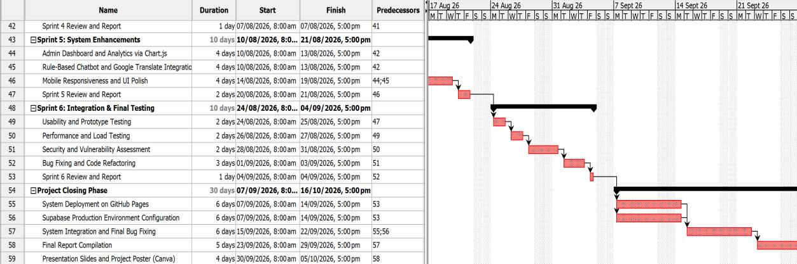
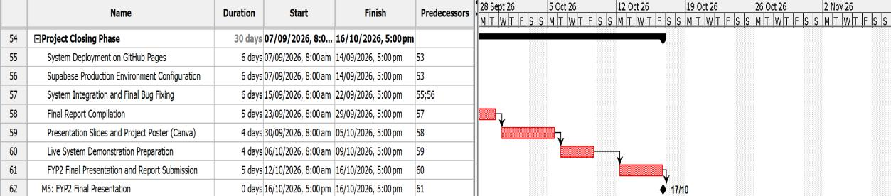
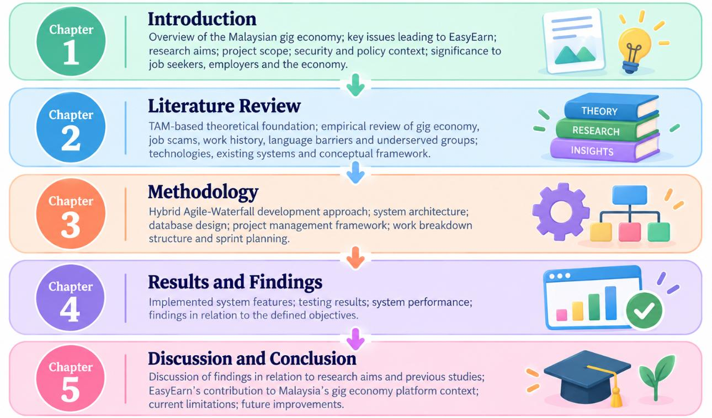
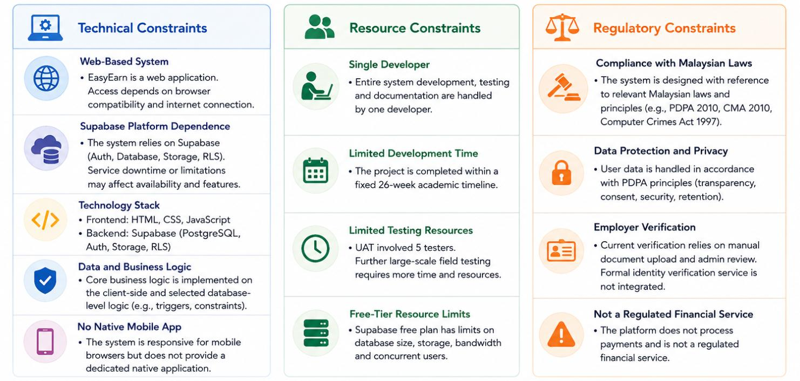
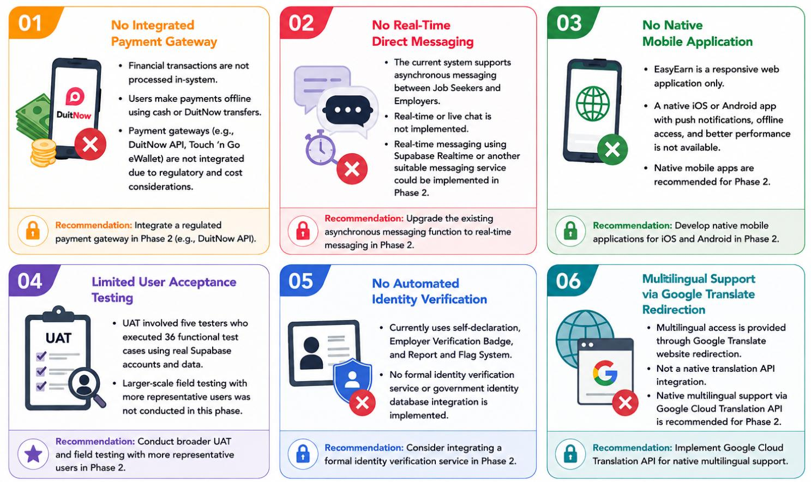

# Chapter 1: Project Introduction

## 1.1 Introduction

The gig economy has changed the way that people work in the 21st century. According to the World Bank [1], there are more than 545 gig platforms and between 154 million and 435 million workers worldwide engaged in online gig work. This transformation has impacted traditional work by unleashing flexible and multiple earning opportunities, and has gained momentum since the smartphone and internet became commonplace [2]. Informal and temporary work has been an increased source of income, particularly for higher education students, housewives and those who have several sources of income in addition to their main income in Southeast Asia [1]. During the coronavirus disease 2019 (COVID-19) pandemic, this new gig economy has risen to a significant force in Malaysia as workers have sought alternative ways to earn a living, as jobs were cut or shifted to work-from-home arrangements, as labour marke ts have been affected, and as wages have declined [3]. Students, housewives, and jobless people are attracted to gig work because of its flexible working hours, the possibility of additional income and minimal participation requirements [3], [4]. According to Malay Mail [5], citing MDEC's internal analysis, the gig economy market size in Malaysia was approximately RM1.33 billion in Q3 2023, while more than 100,000 new individuals participated in and earned income through gig-economy platforms during the same period. Although structured gig platforms are available in Malaysia, the availability of workers and jobs varies by location. GoGet states that its part-timers are mainly available in Klang Valley, Penang, Negeri Sembilan and Johor Bahru [6], suggesting that access to structured gig opportunities may vary outside its main service areas. Job seekers may also use informal channels such as social media and messaging applications, where employment scams remain a concern [7], [8]. EasyEarn therefore focuses on providing a structured short-term job-matching option with location-based access for users in Malaysia, including the secondary towns covered in this study. EasyEarn is suggested to address this gap with a web-based job-matching site utilising HyperText Markup Language (HTML), Cascading Style Sheets (CSS), JavaScrip t, and Supabase. It also has safety and trust features, a multi-language user interface (UI) with Google Translate, and a work history profile with automatic resume generation. EasyEarn aims to support digital inclusion by providing structured job-matching access for users in smaller towns, where digital connectivity and access to economic opportunities may remain more limited [9]. Figure 1.1 summarises the Malaysian gig economy context, the inadequacies in structured access to short-term jobs, and how EasyEarn bridges these gaps with a web-based job-matching platform that is safe, trustworthy, multilingual, and integrated with work history.

Figure 1.1: Overview of the Gig Economy and EasyEarn in Malaysia

## 1.2 Problem Statement

Despite the growth of Malaysia's gig economy, challenges remain in accessing structured short-term work and in managing trust when jobs are sought through informal online channels. EasyEarn is designed around the following six problems: Problem 1: Lack of a Specialised Short-Term Labour Platform in Smaller Towns There are only a handful of geographical hotspots in Malaysia that offer organised gig-work opportunities. One of the established gig-work platforms in Malaysia, GoGet, has more than 400,000 verified part-timers to connect businesses with them, but has said that the majority of the part-timers are in the Klang Valley, Penang, Negeri Sembilan and Johor Bahru [6]. This means that while structured gig platforms have now reached significant scale, they still have a highly skewed distribution of their key workforce availability across Malaysia. However, smaller towns hit by EasyEarn, like Ipoh, Kangar, Alor Setar, Kual a Terengganu and Kota Bharu, are not in GoGet's main availability areas. Access to platform work has been found to be geographically limited, especially away from the main employment hubs, which can be seen as a barrier in digital labour markets [1]. Problem 2: Prevalence of Social Media Job Scams There is still a risk of employment scams for persons who are looking for part-time and flexible jobs in Malaysia. The number of part-time job scam cases reported in 2025 rose to 8,911 (up 144% from 2024), generating financial losses of around RM222 million, according to the Royal Malaysia Police [8]. The fake job offers are usually sent via WhatsApp and Telegram and can include the promise of earning lots of money for doing easy online jobs that ask for upfront payments or private details. The magnitude of these cases shows the importance of having stricter verification and accountability systems for job-seeking online. Moreover, it has been found that reputation information has an impact on trust in digital labour platforms [10]. To offer more organised trust mechanisms for Job Seekers and Employers, EasyEarn includes an Employer Verification Badge, a Report and Flag System, and a Bidirectional Rating and Review System. Problem 3: Lack of Verifiable Work History for Gig Workers Gig workers might have trouble proving their employment history and earnings, since the work is often done in an engagement that lasts only a short time on the platform. The inability to prove work history and income was one of the constraints identified in accessing formal finance for gig workers from a UNCDF study which randomly surveyed 16,166 respondents across five gig platform markets in Malaysia and China [11]. It also stated that one out of four users of Grab's microloans might not have been available at traditional financial institutions due to the lack of accurate earnings information. This is a good example of the importance of keeping an organised record of work done and income generated. Platform workers can also experience problems in establishing a portable professional identity based on their platform-based work [12]. To present and organise completed work experience more systematically, EasyEarn therefore offers a Work History Dashboard and an Auto-Generated Resume. Problem 4: Inefficient Recruitment Process for Employers Small and Medium Enterprises (SMEs), or individual employers, looking for short-term workers may need to coordinate and mobilise extra resources for recruitment. This is especially crucial in Malaysia, as MSMEs employed about 8.09 million people or 48.7% of the population in employment, in 2025, with a contribution of RM689.8 billion or 39.7% of Malaysia's gross domestic product (GDP) [13]. Gusenbauer et al. [14] also arrived at the conclusion that digital work platforms could facilitate access to outside labour for SMEs, enhance the flexibility of their workforces, and lessen the obstacles to outsourcing. Hence, a structured digital recruitment system can assist SMEs to better manage their short-term hiring and applicant coordination. Problem 5: No platform for flexible workers Flexible working opportunities are significant for those who need flexible working arrangements to facilitate study, personal commitments and/or other duties. In Malaysia, recent data from a study of 385 youth gig workers in Kuala Lumpur indicates that 60. 5% were aged 19-24, 33.2% were aged 25 -30, and 33.5% engaged in gig work on a part-time basis [4]. Another important motivator for youth participation in the gig economy identified by the study was flexibility. This is an indicator of the need for flexible working by younger employees. But opportunities for structured short-term work are not ubiquitous, especially in areas away from gig services' central service hubs. For those who are looking for flexibility in their work, EasyEarn offers short-term job categories, filters for location and category, as well as application management functions. Problem 6: Language Barrier on Existing Platforms Language accessibility can have an impact on the capacity of the user to be able to engage freely within digital gig platforms. As part of GoGet's involvement in the UNCDF B40 Challenge, there were over 10,000 registered users on the platform who reported that many low/middle income users preferred to use the platform in their native language, Bahasa Melayu, and that the training materials were available in English [15]. This means that accessibility can be a problem for language differences even in a well-established Gig Platform in Malaysia. A similar study of 4,217 respondents in 6 countries carried out by Saulītis [16] revealed a great preference for web content in users' native language. For this reason, multilingual access is an essential feature to enhance digital accessibility, and EasyEarn offers translated versions of its pages with Google Translate site redirection. All six problems have pointed out a systemic gap in the gig economy infrastructure in Malaysia. Many Malaysians are economically marginalised, defrauded and unable to switch to better career development due to a lack of a dedicated, accessible and secure j ob-matching platform, particularly those in less-serviced areas. EasyEarn is suggested to be an integrated solution, structured and web-based through a job-seeker / job-provider matching portal all over Malaysia. The relevance of EasyEarn is further supported by the Gig Workers Act 2025 (Act 872), which came into force on 31 March 2026 and provides a formal framework for gig worker protection in Malaysia [17]. EasyEarn addresses 6 core issues presented in Figure 1.2, ranging from geographical exclusion to the absence of verifiable gig workers' work histories.

Figure 1.2: Problem Statement of EasyEarn

## 1.3 Research Questions and Research Objectives

EasyEarn is a web-based job matching project that will develop and design a platform to match Job Seekers and Employers to short-term, part-time and freelance job opportunities in Malaysia, especially in the underserved towns of Malaysia, namely Ipoh, Kangar, Alor Setar, Kuala Terengganu and Kota Bharu. In view of the problem statements explained in section 1.2, this section elaborates the research questions and research objectives that will be used in developing and evaluating the EasyEarn Job Matching Portal.

### 1.3.1 Research Questions

Four research questions are generated based on the problem statements discussed in the above section 1.2. These research questions are in line with the project goals and serve as a basis for developing and assessing the EasyEarn Job Matching Portal.

RQ1: What are the essential requirements for a web-based job-matching platform that supports

short-term, part-time and freelance employment between Job Seekers and Employers in Malaysia?

RQ2: What safety and trust features should be incorporated into the platform to support safer

and more trustworthy interactions between Job Seekers and Employers?

RQ3: How can a digital work history and auto-generated resume support gig workers in

documenting and presenting their completed work experience?

RQ4: What are the possible ways of making EasyEarn more accessible to those with varying

language preferences using multilingual access? Figure 1.3 outlines the four questions that have been identified for the development and assessment of the EasyEarn Job Matching Portal. The questions address the platform's essential functions, security and trust elements, digital work history, and automated resume building capabilities, as well as multilingual support.

Figure 1.3: Research Questions of EasyEarn

### 1.3.2 Research Objectives

This project aims to develop and design EasyEarn. Accessed online, the job-matching platform will facilitate job seekers and employers in finding short-term, part-time and freelance jobs in Malaysia and in specific areas that are little-recognised, such as Ipoh, Kangar, Alor Setar, Kuala Terengganu and Kota Bharu. The objectives of EasyEarn are as follows:

- To develop a full-fledged multi-user-based web job matching platform, where users
seeking employment can receive job offers from employers and apply for the jobs using the job matching services offered, such as job-specific dashboards, job posting and management with full Create, Read, Update, and Delete (CRUD) facilities, location-wise job search and filtering, and 24/7 job seeker support by a rule-based chatbot.

- To establish a strong platform safety and trust verification system, setting up a
bidirectional rating and review system, building a report and flag function, developing an employer verification badge, and preventing the emergence of fake job postings and providing a fair, transparent, and accountable job search and hiring environment for job seekers and employers.

- To develop a verifiable digital work history profile for gig workers, enabling them to
document their gigs, tips earned and skills acquired, such as an Auto-Generate Resume feature that will generate a downloadable Portable Document Format (PDF) resume based on data captured from gig workers' work history profiles, which is not currently standardised to record employment history in the informal sector in Malaysia.

- To further enhance multilingual access on the platform by incorporating Google
Translate to facilitate access in various languages such as Bahasa Melayu, Mandarin and Tamil, and to allow smaller communities around Malaysia to access the platform. The four research objectives of EasyEarn are outlined in Figure 1.4, which include development of the platform, safety and trust, verifiable work history and multilingual accessibility.

Figure 1.4: Objectives of EasyEarn

## 1.4 Scope of Project

EasyEarn is an online job matching service which links job seekers and employers in an easy-to-use, secure and efficient platform. The system caters to three main user types: Job Seeker, Employer, and Administrator, with each having its own set of features and access levels to suit their needs. The project involves the full development of EasyEarn, including user management, job posting and management of applications, safety and trust verification, work history monitoring, and multi-language support for accessibility.

### 1.4.1 Project Coverage

EasyEarn is designed as a multi-user Web-based portal that allows various categories of users with various permissions and functions.

- Job seekers (university students, housewives and unemployed) can register and upload
their profiles with skill tags, browse and filter job postings by category and location, apply for jobs, follow up on job applications, save jobs to a wishlist, view their history dashboard, auto-generate a PDF resume from their job history, and use the chatbot for platform support.

- Employers (SMEs and individual hirers) can register, get a Verification Badge, post job
listings and manage them with expiry dates, review and manage applicant submissions, approve/reject applicants, and rate the job seekers after the job.

- Administrators have full control of the platform, including user account management,
job listing moderation, report and flag resolution, and monitoring platform analytics. Figure 1.5 shows that there are three primary groups of users of EasyEarn: Job Seekers, Employers, and Administrators and the features and access each group has to EasyEarn.

Figure 1.5: Project Coverage of EasyEarn

### 1.4.2 Complete Features List

EasyEarn has functionalities classified into two categories. Core Features: These are the essential functions that need to be undertaken and completed completely to realise the project goals. Optional Features are features which may be added to the user experience (UX) and will be added if time and resources allow. Core Features: These are the key features of the EasyEarn platform that must be fulfilled in the system's development. Table 1.1 displays the minimal functionalities that the EasyEarn platform should have to satisfy its main activities.

**Table 1.1: Core Features**

No Features Description 1 User Registration & Login Role-based Job Seeker, Employer and Admin Registration/Login. 2 Job Posting & Application Employers advertise jobs and job seekers apply for jobs, with application management within the platform. 3 Job Category & Filter Search for jobs based on categories, such as F&B, Event, Delivery, and Tutor. 4 Location Filter Search for jobs in Malaysia by city/region. 5 Application Status Timeline Visual tracker with Pending, Reviewed, Interview, Accepted, Completion Pending, Completed, and Rejected stages. 6 Employer Verification Badge Employers with verified accounts have a trust badge in their profile. 7 Report/ Flag System Users are asked to inform Admin about suspicious or non-paying employers or of fraudulently posted listings. 8 Rating & Review System A two-way rating system of 1 to 5 stars and written feedback between employers and job seekers. 9 Work History Dashboard Records finished work, income generated and the distribution of jobs by type. 10 Auto-Generate Resume Completely automates PDF resume generation from job information. 11 Google Translate Website Redirection Redirects to Google Translate to access the platform in several languages. 12 Rule-Based Chatbot Chatbot that responds to questions and offers job application and platform usage information 24/7. Optional Features These features will be added, depending on the availability of time and resources. They will not have an impact on the main functionality of the platform. Table 1.2 shows the available, but optional, features that can be added to EasyEarn, if time and resources allow.

**Table 1.2: Optional Features**

No Features Description 1 Saved Jobs/ Wishlist Job seekers can save interesting jobs to review later. 2 Job Expiry Date Job postings will expire and close automatically after the expiration period. 3 Skills Tag Job seekers add their skills to their profile. 4 Profile Completeness Progress bar showing how much of the user profile is complete. 5 Analytics Dashboard Earnings charts of job seekers; statistics about employers' recruitment; statistics of the administration platform. 6 Payment Confirmation & Dispute When the transfer is made via DuitNow, employers confirm in-system and job seekers upload their DuitNow Quick Response (QR) code and confirm the receipt and either party can have the payment dispute reviewed by the admin. Figure 1.6 shows the full list of the main and optional features of the EasyEarn platform.

Figure 1.6: Features of EasyEarn

### 1.4.3 Excluded Features

The following features are not part of the current project phase because of time, resources and technical constraints:

- Online payment gateway
Financial transactions are carried out offline, using traditional methods like cash and DuitNow transfer. A job seeker can use the DuitNow Quick Response (QR) code to receive payment offline from the employer. Payment processors like the DuitNow Application Programming Interface (API), Touch 'n Go, or credit card processors will not be connected with the platform at this stage.

- Real-Time Chat Messaging
This is not the messaging phase since real-time messaging is not enabled. When it comes to live chat, both the user and the person he/she is chatting with should be online at the same time, which is not feasible with a part-time job platform with an unpredictable schedule. Instead, a rule-based chatbot is used to offer 24/7 automated assistance, without the need for another user to be there.

- Native Mobile Application
EasyEarn is a web application. It excludes a native mobile applicat ion in the current phase. The platform will, instead, use responsive web design to make it mobile-friendly.

- Email Verification
This stage does not have automated email verification. The Employer Verification Badge and the Rating and Review System are both means of establishing user trust.

- Government Database Integration
During this stage, the platform will not be integrating with government databases such as SOCSO, Employees Provident Fund (EPF) and MySejahtera. The information links to Pertubuhan Keselamatan Sosial (PERKESO) ’s Self-Employment Social Security Scheme (SESS) will instead be made available to users for reference.

- Artificial Intelligence (AI) Job Matching Algorithm
Technical complexity in automated Artificial Intelligence-based (AI-based) job recommendation will not be possible in this phase, and the project is restricted to this due to scope limitations. The six features that were not included in the current phase of EasyEarn because of time, resource and technical limitations are shown in Figure 1.7.

Figure 1.7: Excluded Features of EasyEarn

### 1.4.4 Information Security and Policies

EasyEarn handles personal data from both job seekers and employers, and the platform is secured with a variety of technical security measures, safeguarding user information and ensuring the integrity of the platform [18].

#### 1.4.4.1 Regulatory Framework

EasyEarn's personal data is subject to the following Malaysian regulatory frameworks:

- Personal Data Protection Act (PDPA) 2010
The main piece of legislation that regulates the processing of personal data in Malaysia is known as PDPA 2010. Reasonable steps are implemented to ensure that the security of personal data is maintained so that it cannot be lost, misused, altered or acces sed without permission. Names, contacts, work history and more are all stored securely in the Supabase PostgreSQL database. When users register, they are informed of the reason for the collection of the data, and there is no sharing with third parties without authorisation.

- Computer Crimes Act 1997
This legislation regulates and addresses the unauthorised use of computer systems and information. To ensure that users cannot access other users' information or system resources without permission, the platform uses role-based access control and Supabase Authentication. All data is sent via Hypertext Transfer Protocol Secure (HTTPS).

- Consumer Protection Act 1999
As a form of consumer protection, the Report and Flag System and Employer Verification Badge prevent users from being fooled by bogus job postings and non-paying employers.

- Employment Act 1955 (Reference Only)
The platform offers informational guidelines in line with the Employment Act to encourage and help provide fair practices in job posting and clarify responsibilities for the users. This project does not cover direct compliance enforcement because it is an academic prototype called EasyEarn.

- Gig Workers Act 2025 (Act 872)
The Gig Workers Act 2025 (Act 872), which came into force on 31 March 2026, offers a legal structure for gig workers and guidelines on service contracts, workers' rights, social protection and dispute resolution. EasyEarn includes the Employer Verification Badge, Rating and Review System, Reporting and Flagging System, and Work History Profile to help promote transparency and accountability on the platform. The features are developed with awareness of the regulatory framework, which is not a formal legal or regulatory certification of compliance [17]. The five regulatory regimes under which EasyEarn operates and handles data are outlined in Figure 1.8.

Figure 1.8: Regulatory Framework of EasyEarn

#### 1.4.4.2 Technical Security Measures

To ensure users' data security and platform integrity, EasyEarn adopts some technical security measures:

- Supabase Authentication
User account authentication is done via Supabase Authentication, which secures passwords and user sessions. Also, to better manage access to sensitive functions in a system and to limit unauthorised access, token-based authentication is employed.

- Role-Based Access Control (RBAC)
Access to system functions is limited based on user roles. The different permissions and functions are given to the Job Seekers, Employers and Administrators depending on their role in the platform. Only the Admin role has administrative access, and role-based access controls minimise cross-role access.

- HTTPS Encryption
All data sent between the user's browser and Supabase's backend is encrypted using HTTPS. This ensures the data is encrypted while being transmitted and minimises the chance of data interception or eavesdropping.

- Supabase Row Level Security (RLS)
Supabase RLS policies are employed to enforce policies when accessing the database depending on roles and record ownership. These policies offer an extra degree of security by limiting certain read and write operations at the database level. The effectiveness of those individual RLS policies, however, will depend on how they are configured; any remaining access control limitations will be assessed during Security Testing in Chapter 4. Four technical security measures are adopted in EasyEarn to provide user data protection, access control and integrity of the platform as illustrated in Figure 1.9.

Figure 1.9: Technical Security Measures of EasyEarn

## 1.5 Significance of the Study

EasyEarn is expected to have a tangible and quantifiable impact on various stakeholders such as job seekers, employers, and Malaysian society as a whole. EasyEarn is not just a tool for connecting with jobs; it has academic, technological, and socioeconomic implications. These dimensions are discussed in detail in the following sections.

### 1.5.1 Benefits

EasyEarn provides benefits to its main stakeholders, including Job Seekers, Employers, Administrators and the wider community. These benefits align to the project goals of increasing access to short-term jobs, enhancing trust and safety, supporting digital work hi story documentation, and making it easier to access through multilingual support. Benefits to Job Seekers EasyEarn provides job seekers in underserved areas of Malaysia with a structured platform to search and apply for short-term, part-time and freelance jobs. By combining job search, application management, work history and trust-related features in one system, the platform gives users a more organised way to manage their job-search activities. The Work History Dashboard and Auto-Generate Resume allow job seekers to keep and present records of their completed work, which is related to the portable professional identi ty issue discussed by Graham et al. [12]. EasyEarn also uses Google Translate website redirection to provide multilingual access for users with different language preferences, which is relevant to the language-accessibility issue highlighted by UNCDF [15]. Benefits to Employers EasyEarn is a one-stop solution for employers, especially SMEs and individual employers in smaller towns, to post job ads, access applicant profiles, skills and work history, and handle the entire recruitment process in one place. Gusenbauer et al. [14] found that digital work platforms can help small enterprises access external labour and reduce the coordination involved in sourcing workers. The structured recruitment functions of EasyEarn may also help employers manage short-term hiring more efficiently by centralising job posting, applicant information and recruitment activities within one platform. Benefits to Society and the Economy EasyEarn at the societal level seeks to create more structured opportunities to access short-term jobs, including for users residing in less-serviced towns, like Ipoh, Kangar and Kota Bharu, to foster geographical economic inclusion. The platform also addresses is sues relating to employment fraud. The Royal Malaysia Police [8] reported 8,911 cases of part-time job scams in 2025, which is an increase of 144% compared to 2024, and losses amounting to around RM222 million. EasyEarn therefore offers the following trust-related features: Employer Verification Badge, Report and Flag System, and Bidirectional Rating and Review System, which provide a more structured job-search environment. EasyEarn benefits three groups of stakeholders: Job Seekers, Employers, and Society and the Economy; the key benefits of EasyEarn are summarised in Figure 1.10.

Figure 1.10: Benefits of EasyEarn

### 1.5.2 Significance

The output of this project will be the development of the EasyEarn Job Matching Portal which will be a functional web-based platform for short-term, part-time and freelance job opportunities. This system should enable Job Seekers, Employers and Administrators to access and use the system with the necessary level of acces s, post jobs and manage applications, increase user confidence with security measures, facilitate digital work history and resume generation, and be accessible in multiple languages. Academic Significance EasyEarn is an addition to the extant literature on digital labour platforms in developing economies, specifically the context of the Malaysian gig economy. Previous research has explored gig work through the lens of labour rights [12] platform governance and economic inequality [3], but there has been a lack of proposals and implementation of a localised and technology-based solution addressing the particular demographic and geographic circumstances of gig workers in Malaysia. To fill this void, EasyEarn has developed a working system that combines identity verification, portable work history, and multilingual usability in a single platform that can be used as a grounding point for further research into the design and implementation of gig platforms in emerging markets that are underserved. In addition, the development process used in the development of EasyEarn, which uses a Hybrid Agile-Waterfall methodology, is part of the academic discussion on adaptive software development frameworks for students' information systems projects. Structured but iterative, the methodology followed in this study is a model of how academic projects can meet rigorous documentation expectations and be flexible enough to accommodate changing user needs, and, as such, is a model that can be replicated for applied computing research. Technological Significance EasyEarn, from a technological perspective, is a practical proof that a client-side web application can be created on a Backend-as-a-Service (BaaS) architecture and provide a feature-rich, multi-user platform with much less complexity and infrastructure than traditional server-based applications. The use of Supabase for database management and authentication, Chart.js for data visualisation, and jsPDF for dynamic document generation demonstrates the effectiveness of open-source and cloud-native tools to create a scalable, maintainable, and cost-efficient solution [18]. This is an architectural style that is of particular interest in the academic and early-stage commercial development space, where budget and access to dedicated server infrastructure often become constraints. EasyEarn shows that a BaaS-based architecture is techn ically feasible, can provide for complex multi-role workflows, support database-driven multi-role workflows and support user management securely, and is a useful reference for developers and researchers creating similar platforms in resource-constrained environments. Socioeconomic and Policy Significance EasyEarn is not only important because of its benefits for its direct target groups but also as a technological solution to the structural socioeconomic problems in Malaysia. This is supported by Malaysia’s national digital economy and inclusive development policies, which emphasise digital participation, economic inclusion and technology-driven development. Moreover, the government’s commitment to safeguarding gig workers thro ugh the Gig Workers Act 2025 (Act 872) further makes EasyEarn policy-relevant. Moreover, the government has made a commitment to safeguard gig workers through the Gig Workers Act 2025 (Act 872), which formalised its commitment in law, and platforms like EasyEarn do this at the grassroots, making them policy-relevant. EasyEarn serves as evidence that a locally designed gig platform can have a meaningful impact on underserved communities by helping to address their needs, and that targeted, community-focused digital platforms can be potent tools for social and economic inclusion. This not only makes EasyEarn a study but also a model that could be scaled up in the future to help design public-private partnerships to increase the participation of workers in the gig economy outside of urban centres in Malaysia. The EasyEarn platform is academically, technologically, and socio-economically important, as indicated in Figure 1.11.

Figure 1.11: Significance of EasyEarn

## 1.6 Milestones and Deliverables

This section outlines the main milestones and deliverables of the EasyEarn project during the 26 weeks of the Final Year Project. A Work Breakdown Structure (WBS), a project schedule, a Gantt Chart, project milestones and sprint-based deliverables are used to organise the project activities. These planning components are used to help structure the monitoring of project progress and the completion of required development and documentation activities within the planned timeline.

### 1.6.1 Work Breakdown Structure (WBS)

A hierarchical breakdown of the total scope of work needed to complete a project, each of which is more detailed in the definition of project deliverables (Project Management Institute, 2021) is called a WBS. For EasyEarn, the WBS decomposes the project into eleven major phases: Project Initiation, Research and Requirements Analysis, System Design, Prototype and FYP1 Submission, and six Agile development sprints covering Authentication and User Management, Job Posting and Application, Safety and Trust System, Work History and Auto Resume, System Enhancements, and Integration and Final Testing, followed by Deployment and Final Documentation and Submission. There are sub-tasks defined in each phase which help the development team to deliver all the components of the project in a structured way. The WBS eliminates the possibility of any critical activity being missed, and it can be used to estimate project time, assign resources, and measure project progress throughout the project's life cycle [19]. The complete WBS of EasyEarn can be broken down into eleven major project phases, as shown in Figure 1.12.

Figure 1.12: Work Breakdown Structure (WBS)

### 1.6.2 Project Schedule

The project schedule breaks down the WBS into a plan that takes into account time, with each work package allocated to a particular week in the 2 6-week project schedule [19]. Table 1.3 outlines the overall project timeline with the corresponding key milestones and sprints.

**Table 1.3: Project Schedule Summary**

Phase Timeline Key Activities Deliverable Project Initiation Week 1 -2 (FYP1) Topic selection, scope definition, stakeholder identification, and selection of the technology stack. Project proposal draft Research & Requirements Week 2-4 (FYP1) Literature review, competitor analysis, functional/non-functional requirements, and use case development. Requirements specification document System Design Week 5-6 (FYP1) System architecture design, Entity-Relationship Diagram (ERD), wireframes, API endpoint documentation. System design artefacts FYP1 Submission Week 7-8 (FYP1) Development of prototypes, preparation of documents, preparation of final presentation and submission of M3. FYP1 report and prototype Sprint 1 Week 9 -10 (FYP2) User Registration, User login, RBAC, User profile setup and Supervisor review. Functional user management module Sprint 2 Week 11-12 (FYP2) Job posting (CRUD), job searching, filtering and submission and tracking of job applications. Functional job module Sprint 3 Week 13-14 (FYP2) Verification badge by employer, report/flag system, bi-directional rating/review system. Functional safety module Sprint 4 & M4 Week 15-16 (FYP2) Work history dashboard, notification system, auto-generate resume (jsPDF), M4 Midsem Checkpoint. Functional work history module Sprint 5 Week 17-18 (FYP2) Admin dashboard and analytics with Chart.js, mobile responsiveness polish and Supervisor review. Functional admin module Sprint 6 Week 19-20 (FYP2) Full system integration, Usability testing, Performance testing, Security assessment, Bug fixing. Fully tested integrated system Deployment Week 21-22 (FYP2) Live deployment to GitHub Pages, production configuration and overall system integration testing. Live-deployed system and test reports Final Submission Week 23-26 (FYP2) Create Final Report, Present Slides, Set up for live demo and do M5 defence. FYP2 final report and presentation

### 1.6.3 Gantt Chart

The Gantt Chart offers a visual timeline display of all project activities, which helps the project team plan, coordinate and monitor progress against scheduled deadlines [19]. It is evident from the chart that the waterfall-driven planning phase in FYP1 was followed by the 6 agile development sprints in FYP2, and the highlighted critical path runs from Sprint 1 through the end of the development process to submission for deployment. The Gantt Chart is constantly updated and it is a living document at the end of each sprint to show actual progress towards the planned schedule. The following are important events which are tracked on the Gantt Chart: FYP1 Proposal Defence (Week 3), FYP1 Midsem Checkpoint (Week 6), FYP1 Final Presentation (Week 8), FYP2 Midsem Checkpoint (Week 16) and FYP2 Final Presentation and Submission (Week 26). The EasyEarn project has a total of 2 6 weeks for development, and the Gantt Chart of the project is shown in the following figures (Figures 1.1 3-1.17) as a visual representation of all activities along the project development timeline.

Figure 1.13: Gantt Chart (1)

Figure 1.14: Gantt Chart (2)

Figure 1.15: Gantt Chart (3)

Figure 1.16: Gantt Chart (4)

Figure 1.17: Gantt Chart (5)

### 1.6.4 Project Milestones

There are 5 academic milestones, each being a formal assessment/review point for the EasyEarn project in the two FYPs. Sprint completion reviews are also performed at the end of every FYP2 development sprint to help track progress and incorporate supervisor feedback. The five academic milestones tracked throughout the EasyEarn project are listed below in Table 1.4.

**Table 1.4: Project Milestones**

No Milestones Timeline Description M1 Proposal Defence Week 3 Project proposal presented to the assessment panel for approval before proceeding to the design phase. M2 FYP1 Midsem Checkpoint Week 6 Progress on system design documentation, use case diagrams, wireframes, and ERD was presented to the panel. M3 FYP1 Final Presentation & Report Submission Week 8 Submission of the FYP1 interim report and prototype demonstration, marking the end of the first semester. M4 FYP2 Midsem Checkpoint Week 16 Completed Sprints 1 to 4 demonstrated to the assessment panel, along with a development progress report. M5 FYP2 Final Presentation & Report Submission Week 26 Final system presented to the assessment panel; all project deliverables formally submitted. Sprint completion reviews are held at the end of each sprint in FYP2 to ensure development is on track and that supervisor feedback is captured for use in future sprints. Sprint 1 will be reviewed at the end of Week 10, Sprint 2 will be reviewed at the end of Week 12, Sprint 3 will be reviewed at the end of Week 14, Sprint 4 will be reviewed at the end of Week 16, Sprint 5 will be reviewed at the end of Week 18, and Sprint 6 will be reviewed at the end of Week 2 0. The system deployment, preparation and compilation of the system final report, and preparation for the final presentation are completed in the Project Closing Phase from Week 21 to Week 26, culminating in the final M5 presentation and submission at the end of Week 26.

### 1.6.5 Sprint Breakdown and Deliverables

FYP2 development is broken up into six two-week agile sprints (Weeks 9 -20), resulting in a functional system module. The sprint structure allows for incremental development and testing of core platform features that can help identify and fix problems before developing additional features. Table 1.5 shows the sprint breakdown and deliverables delivered in each of the six agile development sprints in FYP2.

**Table 1.5: Sprint Breakdown and Deliverables**

Sprint Timeline Objective Deliverable Sprint 1: Authentication & User Management Week 9-Registration, authentication, login and user role setup. Functional user management module and sprint report. Sprint 2: Job Posting & Application Module Week 11-12 Create, read, update, delete job posts, search for jobs, filter, and submit and track applications. Functional job module and sprint report. Sprint 3: Safety & Trust System Week 13-14 Bidirectional rating & review module, employer verification badge, report and flag system. Functional safety module and sprint report. Sprint 4: Work History & Auto Resume Week 15-16 Work history dashboard, notification and alert system, auto-generate resume using jsPDF, and M4 checkpoint. Functional work history module and sprint report. Sprint 5: System Enhancements Week 17-18 Admin dashboard and analytics through Chart.js, a rule-based chatbot and mobile responsiveness polish. Functional admin module and sprint report. Sprint 6: Integration & Final Testing Week 19-20 Full system integration, usability testing, performance testing and concurrency checks, security assessment and bug fixing. Fully tested and integrated system; final sprint report.

### 1.6.6 Final Deliverables

Final deliverables, as part of the EasyEarn academic evaluation, will be submitted when the project is completed. Deliverables represent the various stages of the project life cycle and show the breadth of the project. Table 1.6 is the full list of final deliverables that will be submitted at the project's end.

**Table 1.6: Final Deliverables**

No Deliverable Description 1 Web-Based Job Matching Portal A fully operational EasyEarn portal deployed on GitHub Pages, incorporating all core features, including user management, job matching, safety verification, work history, auto-generated resume, and Google Translate Website Redirection. 2 Auto-Generated PDF Resume A system-generated, downloadable resume produced from the job seeker's work history, ratings, and skills data using jsPDF. 3 Comprehensive Documentation All project documentation, such as the project proposal, system design diagrams, database schema, test reports and user manuals. 4 Annotated Source Code Formatted and commented HTML, CSS, and JavaScript codebase along with Supabase configuration files, organised for clarity and maintainability. 5 Testing and Evaluation Report Functional tests, security assessment, usability evaluation and system performance analysis are documented in detail. 6 Presentation Materials Presentation slides, project poster created using Canva, and live system demonstration for academic assessment. The milestones, sprint deliverables and final submissions provided in Section 1.6 are the measurable deliverables of the EasyEarn project. The milestones are a formal landmark to review progress towards project objectives, and the deliverables from each sprint ensure that the development of the system keeps moving forward in a step-by-step and systematic fashion throughout the 26 weeks of the project. All of the deliverables in Table 1.6 must be completed for the project to be considered a success.

## 1.7 Thesis Overview

This thesis consists of five chapters to provide a coherent narrative of the development, design and assessment of EasyEarn, an online job-matching platform created to fill some of the gaps in the gig economy in Malaysia. The basis of the study is laid in Chapter 1. It provides an overview of the Malaysian gig economy, six major issues that led to EasyEarn, the aims of the research, the scope of the project, the information security framework and the work regarding information policy compliance, and the importance of EasyEarn for job seekers, employers, and the overall economy in Malaysia. The literature review is included in Chapter 2. It starts with a theoretical discussion based on the Technology Acceptance Model (TAM) and then examines the literature on the gig economy, employment fraud, work history documentation, language barriers and underserved demographics in an empirical way. The chapter also examines the existing technologies, tools and platforms selected, as well as similar existing systems, and suggests a framework that builds upon the literature. The methodology used in this project is explained in Chapter 3. It explains the Hybrid Agile-Waterfall Development Approach, System Architecture, Database Design, and Project Management Framework, along with their Work Breakdown Structure and Sprint Planning.

# Chapter 4 reports the findings and results of the system development and user testing,

explaining the features implemented, the results of testing and the performance of the system in relation to the defined objectives. The findings of this thesis are presented in the context of the research aims and previous research in Chapter 5, the success of EasyEarn as a platform, and the main contribution of this project to the field of gig platforms in Malaysia. It also highlights the current implementation weaknesses and suggests further developments beyond this Final Year Project. Figure 1.18 illustrates the overall structure of the thesis. It briefly summarises the five main chapters (Introduction, Literature Review, Methodology, Findings and Results, Discussion and Conclusion). The figure clearly shows the development of the thesis from the background of the research and related studies to system development, evaluation, findings and future improvements.

Figure 1.18: Thesis Overview of EasyEarn

## 1.8 Constraints and Limitations

EasyEarn is developed under bounded conditions due to the nature of the academic environment, the project timeline, and the technology stack, as well as known limitations of the system, which could be solved in future stages.

### 1.8.1 Project Constraints

Project constraints are the fixed factors that may affect the development of EasyEarn. These constraints include time, development resources, technical dependency, scope control, data security and regulatory compliance. By identifying these constraints, th e project scope and planning can be managed more realistically throughout the development process. Time Constraint The project will be of a fixed duration, comprising 26 weeks in total, to be completed in two phases: FYP1 (20 April to 12 June 2026) and FYP2 ( 15 June to 16 October 2026). This constraint is controlled by the Hybrid Agile-Waterfall methodology: a blend of structured planning with iterative development. Those features that cannot be developed during the sprints are either saved for the next sprints, or they are not included in the scope of the project [20]. Resource Constraint EasyEarn is not developed by a dedicated development team, separate Quality Assurance (QA) team, or enterprise-level infrastructure, but by a single student. This means that only a certain degree of parallel development, testing coverage and optimisation can be achieved during the project period. Thus, it is important to prioritise core functions of the system carefully to make sure that a functional and testable system can be built within the limited resources at hand [21]. Technology Constraint It is built with HTML, CSS and JavaScript, with Supabase offering BaaS functions and GitHub Pages for the deployment of the static frontend. The technology stack was chosen for its accessibility, its suitability for an academic project, and not needing dedicated application-server infrastructure. However, as GitHub Pages is a static front-end, EasyEarn is built on client-side JavaScript, Supabase backend services and some selected back-end business logic, such as RLS policies and PostgreSQL triggers. Additionally, Supabase's free tier usage limits may affect resources like databases, storage, and other services depending on platform usage [18]. Regulatory Constraint EasyEarn processes personal information and will be developed in accordance with the current personal data protection laws and regulations in Malaysia, in particular, the PDPA 2010, Computer Crimes Act 1997 and Consumer Protection Act 1999. Supabase offers RLS policies and HTTPS data transmission, while Role-Based Access Control (RBAC) can be used to limit access based on a user's role. These controls provide support in protecting user data, but are not a formal certification of legal or regulatory compliance. A formal compliance and legal review would be needed before general production. To summarise, EasyEarn has 4 main project constraints: A fixed academic timeline of 26 weeks, A single developer resource constraint, A web-based architecture with a static front end, GitHub Pages and Supabase BaaS services, and regulatory concerns on personal data and gig work. These restrictions are used to limit the development scope and testing depth, as well as the manufacturability of the product. The constraints have been taken into account by making design decisions like phased feature development, prioritisation of essential functions, and using a Hybrid Agile-Waterfall methodology. Table 1.7 below provides a summary of the four key project constraints, their effect on the current project stage and the recommended future actions.

**Table 1.7: Summary of Constraints**

Type Issues Impact Future Recommendation Time Constraint Established a fixed 26-week academic project deadline Restricts the development, testing and refinement that can be achieved during the life of the project. Continues development in phases for features or improvements not within the scope of the project. Resource Constraint A single-developer project with no designated Limits parallel development, independent review, Create a small development and testing team for future development or QA team. testing coverage and optimisation. enhancements and larger deployment. Technology Constraint A static frontend with Supabase's architecture as a backend, built on GitHub Pages. Restricts dedicated application-server processing and relies on the services' capabilities and limits of the chosen BaaS platform. Expand database-level controls, and if needed, the future requirements call for more server-side processing, consider using Supabase Edge Functions or a dedicated backend. Regulatory Constraint Compliance with legal and regulatory aspects of personal data, computer misuse, consumer protection and gig work. Production would need to be assessed by a formal legal and compliance review before being used for wider production. Conduct a formal PDPA and legal review, including relevant requirements under the Gig Workers Act 2025, before wider production use. The remaining four constraints of the project are summarised in EasyEarn, and the effect the project has on the current development phase is summarised in Figure 1.19.

Figure 1.19: Project Constraints of EasyEarn

### 1.8.2 System Limitations

This section provides details on the current restrictions on the EasyEarn Job Matching Portal. The constraints are primarily about payment processing, real-time communication, mobile platform availability, and the size of the acceptance testing. While these restrictions do not hinder the system's core capabilities, they serve as a guide for future development to make the system more functional, accessible, and user-friendly. No Integrated Payment Gateway Financial transactions are currently outside EasyEarn, with cash or DuitNow transfers used. The platform does not have an integrated payment gateway; rather, it facilitates payment confirmation and dispute resolution. Integration with a regulated payment service can be explored in a future phase, subject to technical, regulatory and cost considerations [22]. No Real-Time Direct Messaging EasyEarn supports asynchronous messaging between Job Seekers and Employers, while real-time messaging or live chat is not implemented. The messages are stored and retrieved via the current messaging function, not using a real-time communication service. The existing messaging functionality can be enhanced with Supabase Realtime or another appropriate messaging service in the future. No Native Mobile Application EasyEarn is at the moment a responsive web application and there isn't any dedicated native mobile app. The platform can be accessed via mobile browsers, but there may be mobile-specific functions that can be offered with a native iOS or Android app, such as push notifications, offline access, and better mobile interaction. In future enhancements, therefore, it may be appropriate to consider the development of a native app for mobile devices [23], [24]. Limited User Acceptance Testing Five users participated in User Acceptance Testing (UAT) across 36 functional test cases using designated user accounts and test data stored in Supabase. While the main workflows were successfully tested, the number of testers was too small compared to the number of intended users in several underserved towns in Malaysia. Future evaluation should involve larger-scale field testing with a more representative group of end users. No Automated Identity Verification EasyEarn currently uses employer-submitted verification documents, the Employer Verification Badge and Admin review to support employer credibility. But the system doesn't support a formal automated identity verification system or government identity datab ase. An appropriate identity verification service could be integrated in the future to enhance the employer verification process. Multilingual Support via Redirection Multilingual access is currently available on the EasyEarn site via Google Translate website translation service (and not via the Google in-app translation API). This provides access to several languages, but offers less control over translation accuracy, consistency and interface integration. EasyEarn may be able to benefit from a native translation API like Google Cloud Translation in an upcoming version to offer an integrated multilingual UX [25]. In conclusion, there are six major drawbacks of the current EasyEarn system: there is no embedded payment gateway, real-time direct messaging, mobile app integration, automated identity verification, and the limited scale of UAT, in addition to website redirection instead of a native translation API from Google. These restrictions are primarily due to the scope, time, resource and technical constraints of the academic project. Each limitation also gives a clear direction for future improvement and helps guide the next development stage of EasyEarn. Table 1.8 shows a summary of the 6 system limitations, their effect on the current version of EasyEarn and the suggested enhancements for future releases.

**Table 1.8: Summary of Limitations**

Type Issues Impact Future Recommendation Limitation No integrated payment gateway Payments are made outside the platform, but payments can still be recorded and managed in EasyEarn, and confirmations and disputes can be recorded. Consider integrating a regulated payment service, such as DuitNow, in a future phase. Limitation No real-time direct messaging Job Seekers and Employers interact asynchronously. Make the current messaging feature more powerful by leveraging Supabase Realtime or another appropriate real-time messaging service. Limitation No native mobile application Mobile users use the responsive Web interface and don't have access to mobile-specific features. Create and build native iOS or Android app including push notifications and offline support. Limitation Limited UAT sample The UAT was performed with five testers and may not have captured the broader view of the target group. Perform extended UAT and field testing to a larger number of users from various target towns and backgrounds. Limitation No automated identity verification Employer verification is based on documents submitted and Admin review, not automated identity verification. In future development, consider a formal identity verification service. Limitation Multilingual support via redirection Google Translate website service is required for translation, and is not as Consider upgrading to a native translation API such integrated as a native translation API. as Google Cloud Translation. To design a better system in the future, the EasyEarn system has six limitations, which are presented in Figure 1.20 and solutions are recommended.

Figure 1.20: System Limitations of EasyEarn

## 1.9 Conclusion

This chapter has shared the background, motivation and direction of the creation of the web-based job-matching system EasyEarn for Job Seekers and Employers, focusing especially on the users of less-serviced areas of Malaysia. Structured digital platforms for accessible, trustworthy and efficient short-term employment opportunities are becoming more important due to the rise in gig and flexible work. These six problems are interconnected, with limited access to specialised short-term employment platforms in SM Es and employment fraud and trust issues among them, and the problems of work history without structure and inefficient SME recruitment are exacerbated by the lack of support for flexible workers and language accessibility barriers. In response, Section 1.3 sets four research objectives: Multi-user Portal with role-based access control, Safety and Trust Verification System, Developing a Work History Profile with an auto-generated PDF resume and Multilingual Accessibility through Google Translate. It is created in HTML, CSS, and JS, deployed via GitHub Pages, in a 2 6-week Hybrid Agile-Waterfall framework, built on Supabase. In Section 1.4, further details of the information security and compliance of information policies adopted were highlighted to show how EasyEarn is designed with selected controls aligned with the PDPA 2010, Computer Crimes Act 1997 and Consumer Protection Act 1999. In Section 1.5, the role of the platform in the job search, employer and Malaysian society was confirmed, especially in driving economic inclusion and preventing employment fraud.
