# Chapter 1: Project Introduction

## Introduction

The gig economy has changed the way that people work in the 21st century. According to the World Bank (2023), there are more than 545 gig platforms and between 154 million and 435 million workers worldwide engaged in online gig work. This transformation has impacted traditional work by unleashing flexible and multiple earning opportunities, and has gained momentum since the smartphone and internet became commonplace (International Labour Organisation, 2021). Informal and temporary work has been an increased source of income, particularly for higher education students, housewives and those who have several sources of income in addition to their main income in Southeast Asia (World Bank, 2023).

During the coronavirus disease 2019 (COVID-19) pandemic, this new gig economy has risen to a significant force in Malaysia as workers have sought to find alternative ways to earn a living, as jobs were cut or shifted to work-from-home arrangements, as labour markets have been affected, and as wages have declined (Abd Samad et al., 2023). The number of own-account workers also grew, to 3.09 million, or about 25.1 per cent of the total labour force in the country, by 2024 (Department of Statistics Malaysia, 2024; Kalai Vani & Foo, 2024). Demographically, 97.71 per cent of ride-hailing workers are between 19 and 30 years old and earn RM1,500 to RM2,500 a month and 45 per cent of Malaysians have said they are gig workers at some point (Department of Statistics Malaysia, 2023; Pillai & Paul, 2023). Students, housewives, and jobless people are attracted to gig work because of its flexible working hours, the possibility of additional income and minimal participation requirements (Abd Samad et al., 2023; Siti Nurazira et al., 2024). According to the Malaysia Digital Economy Corporation (MDEC, 2023), the gig economy market size in Malaysia was RM1.33 billion, and the number of new people joining gig platforms exceeded 1 million in Q3 2023.

Though the demand has increased, organised platforms like GoGet and Troopers are still limited to big cities like Kuala Lumpur, Penang and Johor Bahru, and lack of organised gig platforms in smaller towns like Ipoh, Kangar, Alor Setar, Kota Bharu and Kuala Terengganu (MDEC, 2023; GoGet, 2024; Troopers, 2024). Without dedicated platforms, workers in such areas use unverifiable social media channels, like Facebook groups and Instagram communities, where they are exposed to fraud and where they cannot develop a verifiable work history (Pillai & Paul, 2023; Malaysian Communications and Multimedia Commission [MCMC], 2023). Gig work is not catered for by the traditional online portals such as JobStreet and RiceBowl, which focus on permanent or contract positions, making a crucial gap in services in the smaller towns of Malaysia (MDEC, 2023).

EasyEarn is suggested to address this gap with a web-based job matching site utilising HyperText Markup Language (HTML), Cascading Style Sheets (CSS), JavaScript and Supabase. It also has safety and trust features, a multi-language user interface with Google Translate, and a work history profile with automatic resume generation. EasyEarn aims to reduce the disparity between cities and smaller towns in Malaysia and help Malaysia achieve economic inclusion and overall efforts in the digital economy (MDEC, 2023).

## Problem Statement

Despite Malaysia's robust progress in the gig economy (MDEC, 2023), there are several challenges to be tackled in job-matching today. The smaller cities (Kangar, Alor Setar, Kuala Terengganu, Kota Bharu and Ipoh) lack access to a specialised short-term employment platform that is monitored and regulated (Pillai & Paul, 2023), and informal social media channels lack any sort of structure in terms of user protection (MCMC, 2023). EasyEarn has been created to solve the following 6 major problems:

Problem 1: Lack of a Specialised Short-Term Labour Platform in Smaller Towns

The organised gig platforms are concentrated in the major cities, with little presence in secondary towns in Malaysia. The Klang Valley is where there are the most gig economy platforms, while in cities like Ipoh, Kangar and Kota Bharu, there do not seem to be many. This is because those employed in such areas need to resort to informal and unregulated approaches to work, resulting in inefficiency and danger to them (Pillai & Paul, 2023). The geographic imbalance is also cited as one of the common problems in less dense geographic areas in the developing world by the World Bank (2023).

Problem 2: Prevalence of Social Media Job Scams

If there are no registered gig platforms, it is temporary job seekers who turn to Facebook groups, Instagram posts or WhatsApp job groups, which are none of these verified, have no accountability from the employer and are not formally reported on. The number of job ads on social media has increased by 34 per cent in 2022, with the most vulnerable groups being students and housewives, according to the Malaysian Communications and Multimedia Commission (MCMC, 2023). There is a large gap in protection on the informal sector, with only 222,876 gig workers registered with the Social Security Organisation (SOCSO) as of August 2023 (Department of Statistics Malaysia, 2023). This is because there is no formal verification on informal channels, as Gefen et al. (2003) observe.

Problem 3: Lack of Verifiable Work History for Gig Workers

There is no established mechanism in Malaysia to document and validate the work experience of gig workers, which poses a challenge in proving their experience or in negotiating a better compensation package (Pillai & Paul, 2023). This also makes it hard for employers to assess the applicants' suitability, which puts employers at higher risk of hiring the wrong people or those whose qualifications they do not know (Abd Samad et al., 2023). Platform workers in emerging markets still face a persistent structural disadvantage and a lack of development of a professional identity, according to Graham et al. (2017).

Problem 4: Inefficient Recruitment Process for Employers

For Small and Medium Enterprises (SMEs) and individual employers seeking short-term workforces, they have to rely on informal means such as posting on social media and on word of mouth, which are time-consuming and do not involve any formal screening of job candidates. Kalai Vani and Foo (2024) reported that in Malaysia, there is no centralised system to support small businesses to recruit in the short term, which forces small businesses to tackle high recruitment expenses. Poor hiring decisions are exacerbated when the source of the information about the applicant is not trustworthy (Kuek et al., 2015), which is especially a challenge for SME in less developed countries, lacking digital hiring tools, as highlighted by the Organisation for Economic Co-operation and Development (OECD) (2019).

Problem 5: No platform for flexible workers

There is a lack of platforms that cater to the needs of university students, housewives, and unemployed people who need short-term, flexible employment. There are also several longer-term job sites like JobStreet and RiceBowl that do not offer short-term positions, and a handful of local sites like GoGet and Troopers, which are only available in major cities. In smaller town areas, there are not many platforms that target the needs of the younger population, as flexi time and extra income are their primary motivations for participating in gig activities that limit their economic involvement and income security (Abd Samad et al., 2023; Siti Nurazira et al., 2024).

Problem 6: Language Barrier on Existing Platforms

The majority of Malaysian gig platforms are based in English, which limits accessibility for users who speak other languages such as Bahasa Melayu, Mandarin and Tamil. According to the United Nations Capital Development Fund (UNCDF, 2019), most of the users of GoGet come from low and middle-income groups, with the majority being natives who speak the local language of Bahasa Melayu, despite the overall GoGet interface being in English. Not so in the smaller towns where English is not widely used, in which case a large percentage of the local population cannot be utilised. UNCDF (2019) indicated that language inclusivity is the key to access to digital jobs in Southeast Asia.

All six problems have pointed out a systemic gap in the gig economy infrastructure in Malaysia. Many Malaysians are economically marginalised, defrauded and unable to switch to better career development due to a lack of a dedicated, accessible and secure job-matching platform, particularly those in less-serviced areas. EasyEarn is suggested to be an integrated solution, structured and web-based through a job-seeker / job-provider matching portal all over Malaysia. EasyEarn is not only relevant because the Gig Workers Act 2025 (Act 872) was just launched to formalise the structural gaps and lacunae, but also due to the need to act to fill these gaps (Ministry of Human Resources Malaysia, 2025).

EasyEarn addresses 6 core issues presented in Figure 1.1, ranging from geographical exclusion to the absence of verifiable gig workers' work histories.

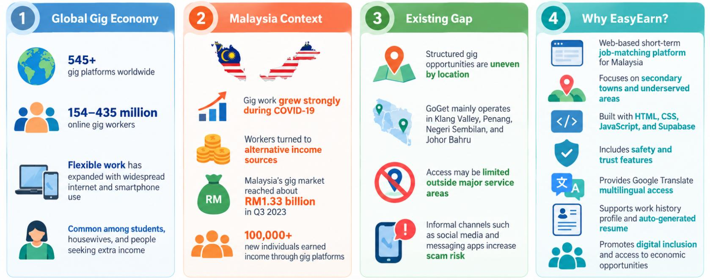

Figure 1.1: Problem Statement of EasyEarn

## Research Objectives

This project aims to develop and design EasyEarn. Accessed online, the job-matching platform will facilitate job seekers and employers in finding short-term, part-time and freelance jobs in Malaysia and in specific areas that are little-recognised, such as Ipoh, Kangar, Alor Setar, Kuala Terengganu and Kota Bharu (MDEC, 2023; Pillai & Paul, 2023).

The objectives of EasyEarn are as follows:

- To develop a full-fledged multi-user-based web job matching platform, where users seeking employment can receive job offers from employers and apply for the jobs using the job matching services offered, such as job-specific dashboards, job posting and management with full Create, Read, Update, and Delete (CRUD) facilities, location-wise job search and filtering, and 24/7 job seeker support by a rule-based chatbot.

- To establish a strong platform safety and trust verification system, setting up a bidirectional rating and review system, building a report and a flag function, developing an employer verification badge, and preventing the emergence of fake job postings and providing a fair, transparent, and accountable job search and hiring environment for job seekers and employers.

- To develop a verifiable digital work history profile for gig workers, enabling them to document their gigs, tips earned and skills acquired, such as an Auto-Generate Resume feature that will generate a downloadable Portable Document Format (PDF) resume based on data captured from gig workers' work history profiles, which is not currently standardised to record employment history in the informal sector in Malaysia.

- To further enhance multilingual access on the platform by incorporating Google Translate to facilitate access in various languages such as Bahasa Melayu, Mandarin and Tamil, and to allow smaller communities around Malaysia to access the platform.

The four research objectives of EasyEarn are outlined in Figure 1.2, which include development of the platform, safety and trust, verifiable work history and multilingual accessibility.

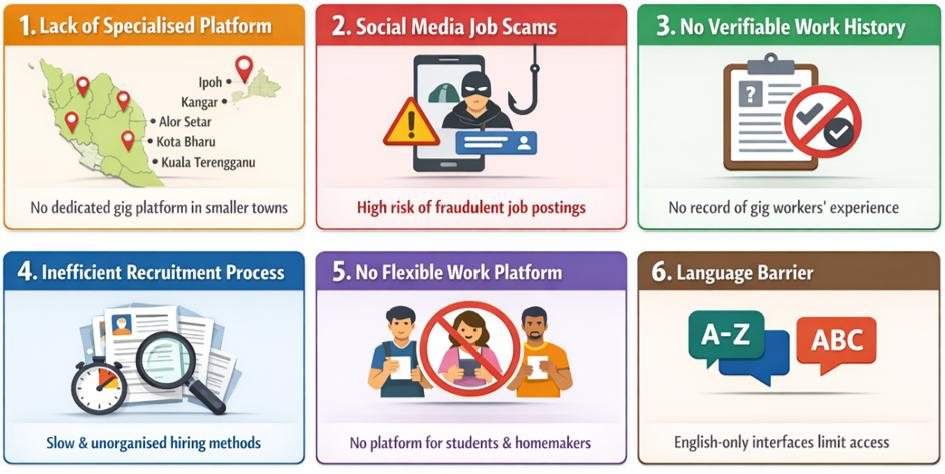

Figure 1.2: Objectives of EasyEarn

## Scope of Project

EasyEarn is an online job matching service which links job seekers and employers in an easy-to-use, secure and efficient platform. The system caters to three main user types: Job Seeker, Employer, and Administrator, with each having its own set of features and access levels to suit their needs. The project involves the full development of EasyEarn, including user management, job posting and management of applications, safety and trust verification, work history monitoring, and multi-language support for accessibility.

### 1.4.1 Project Coverage

EasyEarn is designed as a multi-user Web-based portal that allows various categories of users with various permissions and functions.

Job seekers (university students, housewives and unemployed) can register and upload their profiles with skill tags, browse and filter job postings by category and location, apply for jobs, follow up on job applications, save jobs to a wishlist, view their history dashboard, auto-generate a PDF resume from their job history, and use the chatbot for platform support.

- Employers (SMEs and individual hirers) can register, get a Verification Badge, post job listings and manage them with expiry dates, review and manage applicant submissions, approve/reject applicants, and rate the job seekers after the job.

- Administrators have full control of the platform, including user account management, job listing moderation, report and flag resolution, and monitoring platform analytics.

Figure 1.3 shows that there are three primary groups of users of EasyEarn: Job Seekers, Employers, and Administrators and the features and access each group has to EasyEarn.

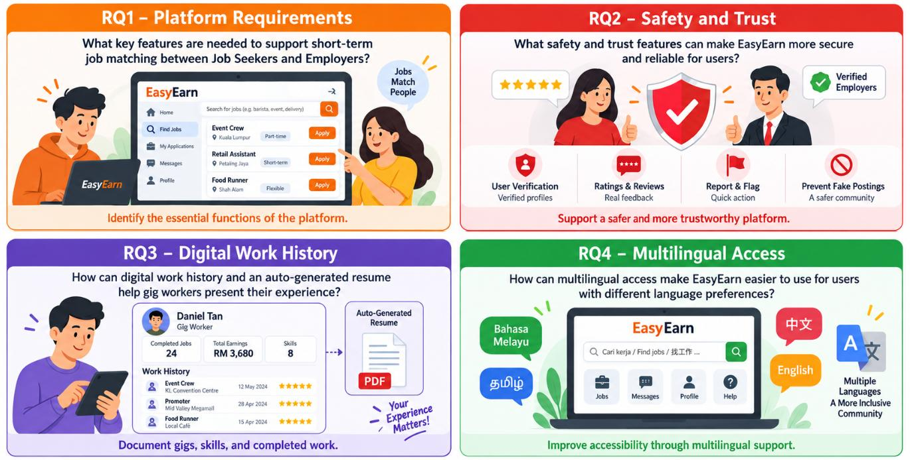

Figure 1.3: Project Coverage of EasyEarn

### 1.4.2 Complete Features List

EasyEarn has functionalities classified into two categories. Core Features: These are the essential functions that need to be undertaken and completed completely to realise the project goals. Optional Features are features which may be added to the user experience and will be added if time and resources allow.

Core Features:

These are the key features of the EasyEarn platform that must be fulfilled in the system's development. Table 1.1 displays the minimal functionalities that the EasyEarn platform should have to satisfy its main activities.

Table 1.1: Core Features

| No | Features | Description |
| --- | --- | --- |
| 1 | User Registration &amp; Login | Role-based Job Seeker, Employer and Admin Registration/Login. |
| 2 | Job Posting &amp; Application | Employers advertise jobs and job seekers apply for jobs, with application management within the platform. |
| 3 | Job Category &amp; Filter | Search for jobs based on categories, such as F&amp;B, Event, Delivery, and Tutor. |
| 4 | Location Filter | Search for jobs in Malaysia by city/region. |
| 5 | Application Status Timeline | Visual tracker with Pending, Reviewed, Interview, Accepted, Completion Pending, Completed, and Rejected stages. |
| 6 | Employer Verification Badge | Employers with verified accounts have a trust badge in their profile. |
| 7 | Report/ Flag System | Users are asked to inform Admin about suspicious or non-paying employers or of fraudulently posted listings. |
| 8 | Rating &amp; Review System | A two-way rating system of 1 to 5 stars and written feedback between employers and job seekers. |
| 9 | Work History Dashboard | Records finished work, income generated and the distribution of jobs by type. |
| 10 | Auto-Generate Resume | Completely automates PDF resume generation from job information. |
| 11 | Google Translate Integration | Redirects to Google Translate to access the platform in several languages. |
| 12 | Rule-Based Chatbot | Chatbot that responds to questions and offers job application and platform usage information 24/7. |

Optional Features

These features will be added, depending on the availability of time and resources. They will not have an impact on the main functionality of the platform. Table 1.2 shows the available, but optional, features that can be added to EasyEarn, if time and resources allow.

Table 1.2: Optional Features

| No | Features | Description |
| --- | --- | --- |
| 1 | Saved Jobs/ Wishlist | Job seekers can save interesting jobs to review later. |
| 2 | Job Expiry Date | Job postings will expire and close automatically after the expiration period. |
| 3 | Skills Tag | Job seekers add their skills to their profile. |
| 4 | Profile Completeness | Progress bar showing how much of the user profile is complete. |
| 5 | Analytics Dashboard | Earnings charts of job seekers; statistics about employers&#x27; recruitment; statistics of the administration platform. |
| 6 | Payment Confirmation &amp; Dispute | When the transfer is made via DuitNow, employers confirm in-system and job seekers upload their DuitNow Quick Response (QR) code and confirm the receipt and either party can have the payment dispute reviewed by the admin. |

The full list of the main and optional features of the EasyEarn platform is shown in Figure 1.4.

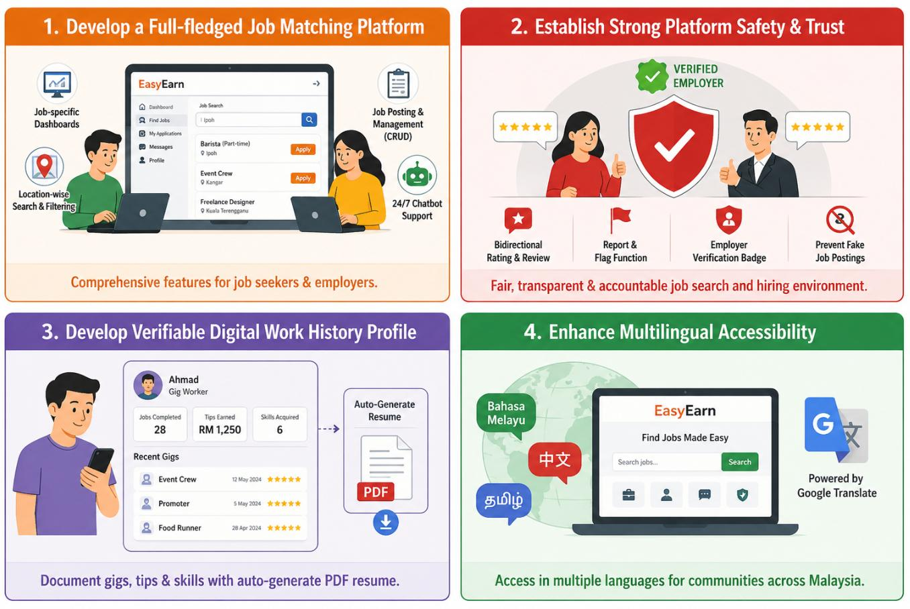

Figure 1.4: Features of EasyEarn

### 1.4.3 Excluded Features

The following features are not part of the current project phase because of time, resources and technical constraints:

- Online payment gateway

Financial transactions are carried out offline, using traditional methods like cash and DuitNow transfer. A job seeker can use the DuitNow Quick Response (QR) code to receive payment offline from the employer. Payment processors like the DuitNow Application Programming Interface (API), Touch 'n Go, or credit card processors will not be connected with the platform at this stage.

- Real-Time Chat Messaging

This is not the messaging phase since real-time messaging is not enabled. When it comes to live chat, both the user and the person he/she is chatting with should be online at the same time, which is not feasible with a part-time job platform with an unpredictable schedule. Instead, a rule-based chatbot is used to offer 24/7 automated assistance, without the need for another user to be there.

- Native Mobile Application

EasyEarn is a web application. It excludes a native mobile application in the current phase. The platform will, instead, use responsive web design to make it mobile-friendly.

- Email Verification

This stage does not have automated email verification. The Employer Verification Badge and the Rating and Review System are both means of establishing user trust.

- Government Database Integration

During this stage, the platform will not be integrating with government databases such as SOCSO, Employees Provident Fund (EPF) and MySejahtera. The information links to Pertubuhan Keselamatan Sosial (PERKESO)’s Self-Employment Social Security Scheme (SESS) will instead be made available to users for reference.

- Artificial Intelligence (AI) Job Matching Algorithm

Technical complexity in automated Artificial Intelligence-based (AI-based) job recommendation will not be possible in this phase, and the project is restricted to this due to scope limitations.

The six features that were not included in the current phase of EasyEarn because of time, resource and technical limitations are shown in Figure 1.5.

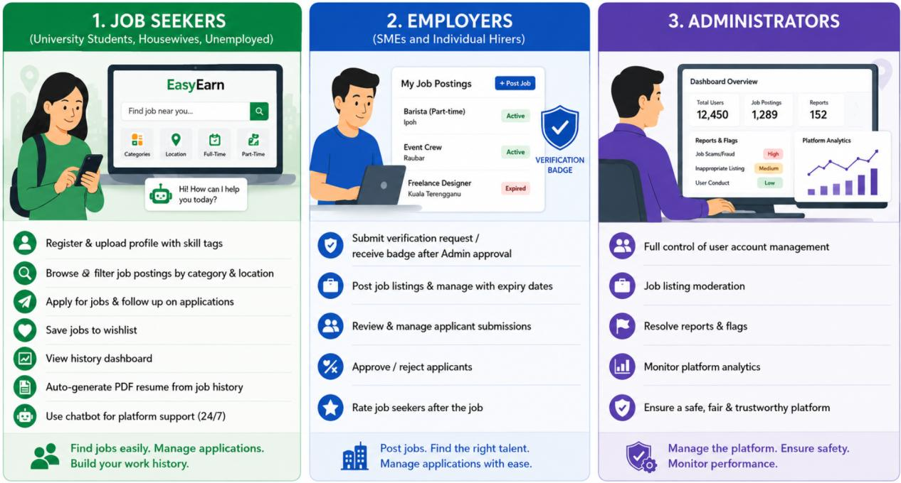

Figure 1.5: Excluded Features of EasyEarn

### 1.4.4 Information Security and Policies

EasyEarn handles personal data from both job seekers and employers, and the platform is secured with a variety of technical security measures, safeguarding user information and ensuring the integrity of the platform (Supabase, 2024).

#### 1.4.4.1 Regulatory Framework

EasyEarn's personal data is subject to the following Malaysian regulatory frameworks:

- Personal Data Protection Act (PDPA) 2010

The main piece of legislation that regulates the processing of personal data in Malaysia is known as PDPA 2010. Reasonable steps are implemented to ensure that the security of personal data is maintained so that it cannot be lost, misused, altered or accessed without permission. Names, contacts, work history and more are all stored securely in the Supabase PostgreSQL database. When users register, they are informed of the reason for the collection of the data, and there is no sharing with third parties without authorisation.

- Computer Crimes Act 1997

This legislation regulates and addresses the unauthorised use of computer systems and information. To ensure that users cannot access other users' information or system resources without permission, the platform uses role-based access control and Supabase Authentication. All data is sent via Hypertext Transfer Protocol Secure (HTTPS).

- Consumer Protection Act 1999

As a form of consumer protection, the Report and Flag System and Employer Verification Badge prevent users from being fooled by bogus job postings and non-paying employers.

- Employment Act 1955 (Reference Only)

The platform offers informational guidelines in line with the Employment Act to encourage and help provide fair practices in job posting and clarify responsibilities for the users. This project does not cover direct compliance enforcement because it is an academic prototype called EasyEarn.

- Gig Workers Act 2025 (Act 872)

This Act, which will come into effect on 31 March 2026, is the first legislative framework to formalise gig workers in Malaysia. It requires transparency in service contracts, guarantees freedom from discrimination and access to dispute-resolution procedures. EasyEarn's Employer Verification Badge, Rating and Review System, and Work History Profile were created to meet the transparency and trust requirements stipulated by this Act (Ministry of Human Resources Malaysia, 2025), as a job-matching site between gig workers and employers.

The five regulatory regimes under which EasyEarn operates and handles data are outlined in Figure 1.6.

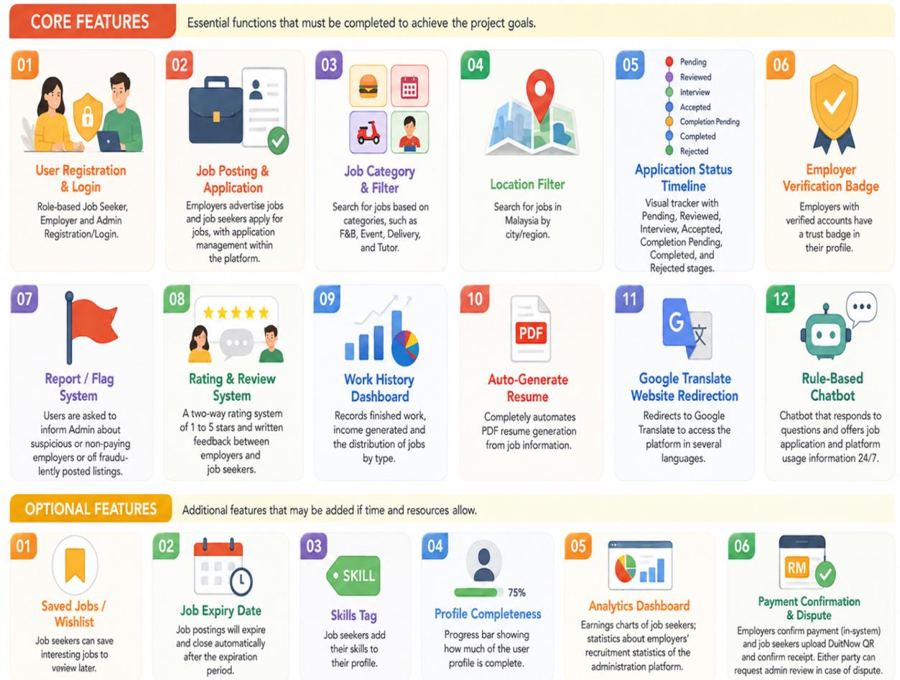

Figure 1.6: Regulatory Framework of EasyEarn

#### 1.4.4.2 Technical Security Measures

To ensure users' data security and platform integrity, EasyEarn adopts some technical security measures:

- Supabase Authentication

User account authentication is done via Supabase Authentication, which secures passwords and user sessions. Also, to better manage access to sensitive functions in a system and to limit unauthorised access, token-based authentication is employed.

- Role-Based Access Control (RBAC)

Access to system functions is limited based on user roles. The different permissions and functions are given to the Job Seekers, Employers and Administrators depending on their role in the platform. Only the Admin role has administrative access, and role-based access controls minimise cross-role access.

- HTTPS Encryption

All data sent between the user's browser and Supabase's backend is encrypted using HTTPS. This ensures the data is encrypted while being transmitted and minimises the chance of data interception or eavesdropping.

- Supabase Row Level Security (RLS)

Supabase RLS policies are employed to enforce policies when accessing the database depending on roles and record ownership. These policies offer an extra degree of security by limiting certain read and write operations at the database level. The effectiveness of those individual RLS policies, however, will depend on how they are configured; any remaining access control limitations will be assessed during Security Testing in Chapter 4.

Four technical security measures are adopted in EasyEarn to provide user data protection, access control and integrity of the platform as illustrated in Figure 1.7.

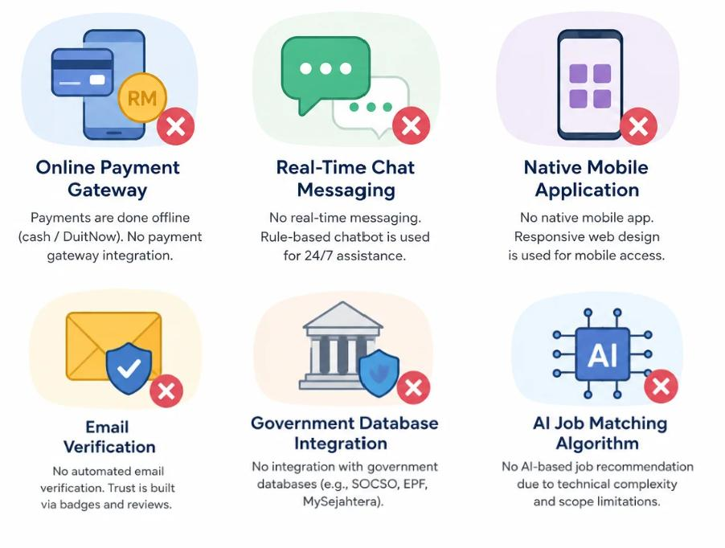

Figure 1.7: Technical Security Measures of EasyEarn

## Significance of the Study

EasyEarn is expected to have a tangible and quantifiable impact on various stakeholders such as job seekers, employers, and Malaysian society as a whole. EasyEarn is not just a tool for connecting with jobs; it has academic, technological, and socioeconomic implications. These dimensions are discussed in detail in the following sections.

### 1.5.1 Benefits

Benefits to Job Seekers

EasyEarn gives job seekers in underserved areas of Malaysia a secure and structured platform to access and apply for short-term, part-time and freelance jobs, without the dangers of unregulated social media platforms. According to Pillai and Paul (2023), those who use dedicated gig platforms can find employment in 40 per cent less time than those who rely on informal methods, leading to higher economic productivity for users, including students in universities, housewives, and the unemployed.

The platform's Work History Dashboard and Auto-Generate Resume also help to rectify a structural weakness mentioned by Graham et al. (2017): the lack of building an easily replicable and verifiable professional identity for platform workers in emergent economies. Further, Google Translate integration makes the platform accessible to users who do not speak English, especially in smaller towns where, to date, English-only platforms have largely ignored a large proportion of the labour force (UNCDF, 2019).

Benefits to Employers

EasyEarn is a one-stop solution for employers, especially SMEs and individual employers in smaller towns, to post job ads, access verified profiles of applicants, and handle the entire recruitment process in one place. According to Kalai Vani and Foo (2024), the lack of a platform specialising in posting short-term jobs in Malaysia is causing time and cost burdens for small businesses. The Employer Verification Badge also adds to growing applicant trust and helps create a better hiring environment, in line with OECD (2019) research, which showed that structured digital recruitment tools cut hiring costs and boost the quality of job matches for SMEs in developing markets.

Benefits to Society and the Economy

At the societal level, EasyEarn aims to facilitate geographical economic inclusion by opening up organised gig economy opportunities to towns like Ipoh, Kangar and Kota Bharu, which are identified by MDEC (2023) as being under-represented in the digital gig economy workforce in Malaysia. The platform has also been created to combat the growing issue of employment fraud. The rising problem of workplace fraud as MCMC (2023) found that there had been a 34 per cent rise in social media job scams in 2022, which disproportionately affected younger and less experienced job seekers. EasyEarn offers a regulated and responsible alternative, helping to create a safer and fairer digital employment landscape in Malaysia.

EasyEarn benefits three groups of stakeholders: Job Seekers, Employers, and Society and the Economy; the key benefits of EasyEarn are summarised in Figure 1.8.

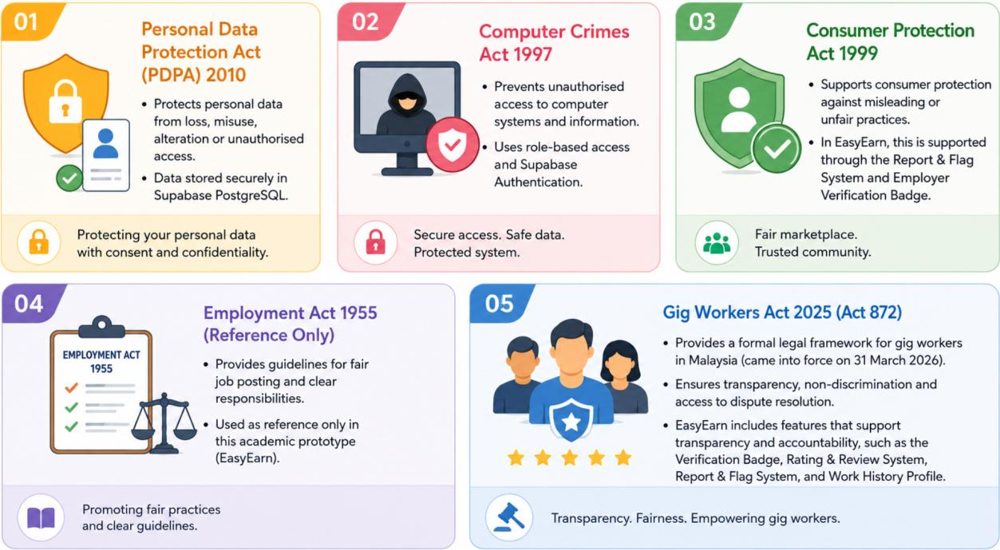

Figure 1.8: Benefits of EasyEarn

### 1.5.2 Significance

Academic Significance

EasyEarn is an addition to the extant literature on digital labour platforms in developing economies, specifically the context of the Malaysian gig economy. Previous research has explored gig work through the lens of labour rights (Graham et al., 2017), platform governance and economic inequality (Abd Samad et al., 2023), but there has been a lack of proposals and implementation of a localised and technology-based solution addressing the particular demographic and geographic circumstances of gig workers in Malaysia. To fill this void, EasyEarn has developed a working system that combines identity verification, portable work history, and multilingual usability in a single platform that can be used as a grounding point for further research into the design and implementation of gig economy platforms in emerging markets that are underserved.

In addition, the development process used in the development of EasyEarn, which uses a Hybrid Agile-Waterfall methodology, is part of the academic discussion on adaptive software development frameworks for students' information systems projects. Structured but iterative, the methodology followed in this study is a model of how academic projects can meet rigorous documentation expectations and be flexible enough to accommodate changing user needs, and, as such, is a model that can be replicated for applied computing research.

Technological Significance

EasyEarn, from a technological perspective, is a practical proof that a client-side web application can be created on a Backend-as-a-Service (BaaS) architecture and provide a feature-rich, multi-user platform with much less complexity and infrastructure than traditional server-based applications. The use of Supabase for database management and authentication, Chart.js for data visualisation, and jsPDF for dynamic document generation demonstrates the effectiveness of open-source and cloud-native tools to create a scalable, maintainable, and cost-efficient solution (Supabase, 2024).

This is an architectural style that is of particular interest in the academic and early-stage commercial development space, where budget and access to dedicated server infrastructure often become constraints. EasyEarn shows that a BaaS-based architecture is technically feasible, can provide for complex multi-role workflows, support real-time data operations and user management securely, and is a useful reference for developers and researchers creating similar platforms in resource-constrained environments.

Socioeconomic and Policy Significance

EasyEarn is not only important because of its benefits for its direct target groups but also as a technological solution to the structural socioeconomic problems in Malaysia. The platform is geared towards three priority areas identified by the national policy, which are geographic underrepresentation, employment fraud and digital exclusion, reflecting the focus of Malaysia's Digital Economy Blueprint and the Twelfth Malaysia Plan on inclusive digital participation and equitable economic development across all regions of Malaysia (MDEC, 2023). Moreover, the government has made a commitment to safeguard gig workers through the Gig Workers Act 2025 (Act 872), which formalised its commitment in law, and platforms like EasyEarn do this at the grassroots, making them policy-relevant.

EasyEarn serves as evidence that a locally designed gig economy platform can have a meaningful impact on underserved communities by helping to address their needs, and that targeted, community-focused digital platforms can be potent tools for social and economic inclusion. This not only makes EasyEarn a study but also a model that could be scaled up in the future to help design public-private partnerships to increase the participation of workers in the gig economy outside of urban centres in Malaysia. The EasyEarn platform is academically, technologically, and socio-economically important, as indicated in Figure 1.9.

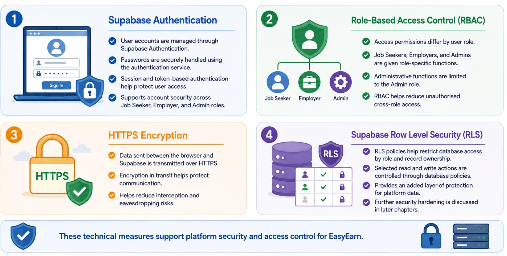

Figure 1.9: Significance of EasyEarn

## Milestone and Deliverable

This section outlines the main milestones and deliverables of the EasyEarn project during the 26-week span of the Final Year Project. A Work Breakdown Structure (WBS), a project schedule, a Gantt Chart, project milestones and sprint-based deliverables are used to organize the project activities. These planning components are used to help structure the monitoring of project progress and the completion of required development and documentation activities within the planned timeline.

### 1.6.1 Work Breakdown Structure (WBS)

A hierarchical breakdown of the total scope of work needed to complete a project, each of which is more detailed in the definition of project deliverables (Project Management Institute [PMI], 2021), is called a Work Breakdown Structure (WBS). For EasyEarn, the WBS decomposes the project into eleven major phases: Project Initiation, Research and Requirements Analysis, System Design, Prototype and FYP1 Submission, and six Agile development sprints covering Authentication and User Management, Job Posting and Application, Safety and Trust System, Work History and Auto Resume, System Enhancements, and Integration and Final Testing, followed by Deployment and Final Documentation and Submission.

There are sub-tasks defined in each phase which help the development team to deliver all the components of the project in a structured way. The WBS eliminates the possibility of any critical activity being missed, and it can be used to estimate project time, assign resources, and measure project progress throughout the project's life cycle (PMI, 2021). The complete Work Breakdown Structure (WBS) of EasyEarn can be broken down into eleven major project phases, as shown in Figure 1.10.

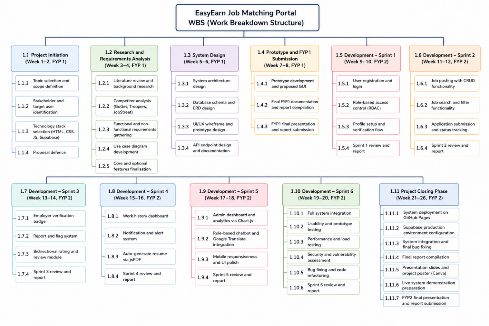

Figure 1.10: Work Breakdown Structure (WBS)

### 1.6.2 Project Schedule

The project schedule breaks down the WBS into a plan that takes into account time, with each work package allocated to a particular week in the 26-week project schedule (PMI, 2021). Table 1.3 outlines the overall project timeline with the corresponding key milestones and sprints.

Table 1.3: Project Schedule Summary

| Phase | Timeline | Key Activities | Deliverable |
| --- | --- | --- | --- |
| Project Initiation | Week 1-2 (FYP1) | Topic selection, scope definition, stakeholder identification, and selection of the technology stack. | Project proposal draft |
| Research &amp; Requirements | Week 2-4 (FYP1) | Literature review, competitor analysis, functional/non-functional requirements, and use case development. | Requirements specification document |
| System Design | Week 5-6 (FYP1) | System architecture design, Entity-Relationship Diagram (ERD), wireframes, API endpoint documentation. | System design artefacts |
| FYP1 Submission | Week 7-8 (FYP1) | Development of prototypes, preparation of documents, preparation of final presentation and submission of M3. | FYP1 report and prototype |
| Sprint 1 | Week 9-10 (FYP2) | User Registration, User login, RBAC, User profile setup and Supervisor review. | Functional user management module |
| Sprint 2 | Week 11-12 (FYP2) | Job posting (CRUD), job searching, filtering and submission and tracking of job applications. | Functional job module |
| Sprint 3 | Week 13-14 (FYP2) | Verification badge by employer, report/flag system, bi-directional rating/review system. | Functional safety module |
| Sprint 4 &amp; M4 | Week 15-16 (FYP2) | Work history dashboard, notification system, auto-generate resume (jsPDF), M4 Midsem Checkpoint. | Functional work history module |
| Sprint 5 | Week 17-18 (FYP2) | Admin dashboard and analytics with Chart.js, mobile responsiveness polish and Supervisor review. | Functional admin module |
| Sprint 6 | Week 19-20 (FYP2) | Full system integration, Usability testing, Performance testing, Security assessment, Bug fixing. | Fully tested integrated system |
| Deployment | Week 21-22 (FYP2) | Live deployment to GitHub Pages, production configuration and overall system integration testing. | Live-deployed system and test reports |
| Final Submission | Week 23-26 (FYP2) | Create Final Report, Present Slides, Set up for live demo and do M5 defence. | FYP2 final report and presentation |

### 1.6.3 Gantt Chart

The Gantt Chart offers a visual timeline display of all project activities, which helps the project team plan, coordinate and monitor progress against scheduled deadlines (PMI, 2021). It is evident from the chart that the waterfall-driven planning phase in FYP1 was followed by the 6 agile development sprints in FYP2, and the highlighted critical path runs from Sprint 1 through the end of the development process to submission for deployment. The Gantt Chart is constantly updated and it is a living document at the end of each sprint to show actual progress towards the planned schedule.

The following are important events which are tracked on the Gantt Chart: FYP1 Proposal Defence (Week 3), FYP1 Midsem Checkpoint (Week 6), FYP1 Final Presentation (Week 8), FYP2 Midsem Checkpoint (Week 16) and FYP2 Final Presentation and Submission (Week 26).

The EasyEarn project has a total of 26 weeks for development, and the Gantt Chart of the project is shown in the following figures (Figures 1.11-1.15) as a visual representation of all activities along the project development timeline.

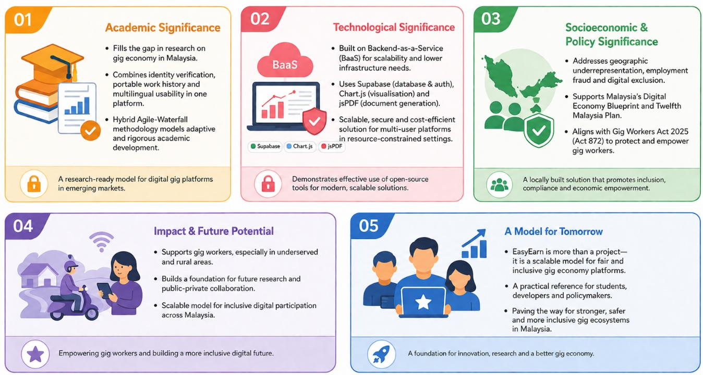

Figure 1.11: Gantt Chart (1)

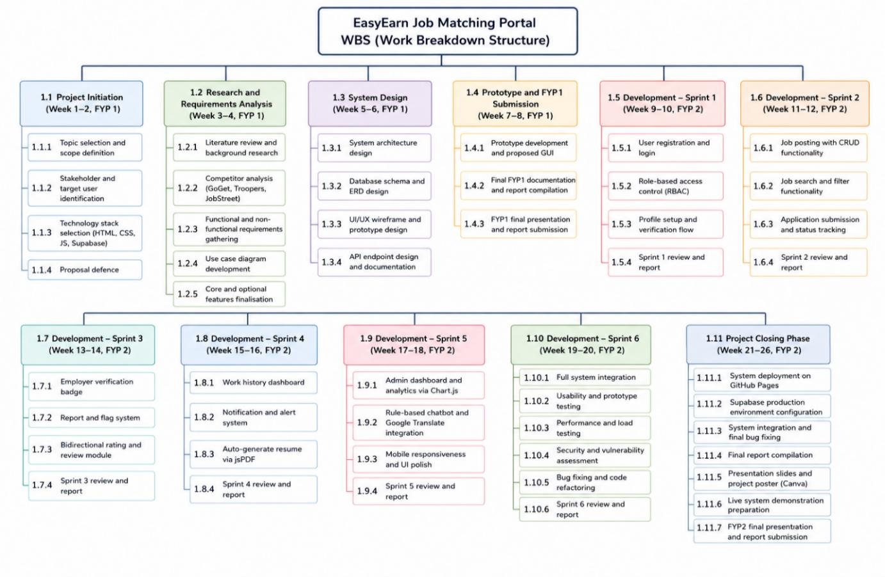

Figure 1.12: Gantt Chart (2)

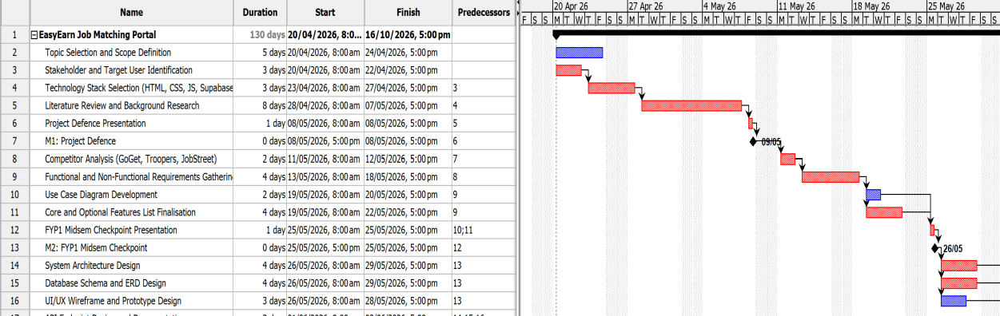

Figure 1.13: Gantt Chart (3)

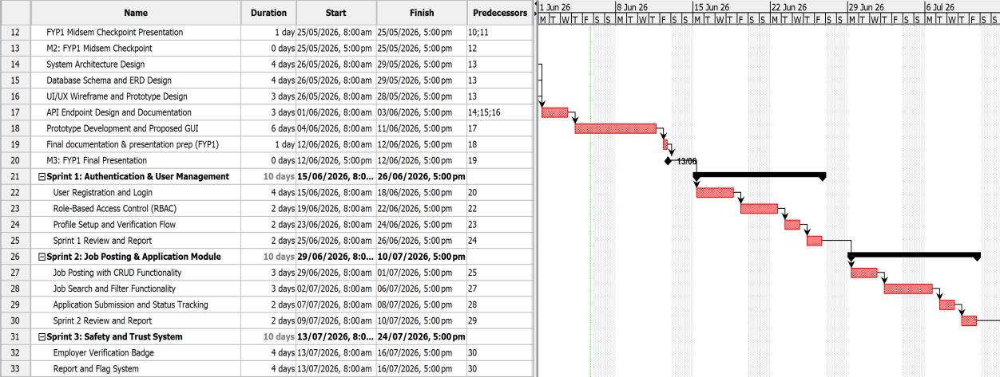

Figure 1.14: Gantt Chart (4)

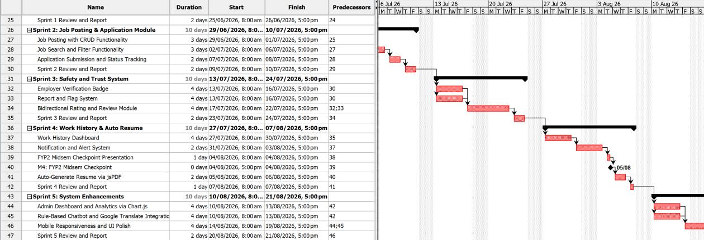

Figure 1.15: Gantt Chart (5)

### 1.6.4 Project Milestones

There are 5 academic milestones, each being a formal assessment/review point for the EasyEarn project in the two FYPs. Sprint completion reviews are also performed at the end of every FYP2 development sprint to help track progress and incorporate supervisor feedback. The five academic milestones tracked throughout the EasyEarn project are listed below in Table 1.4.

Table 1.4: Project Milestones

| No | Milestones | Timeline | Description |
| --- | --- | --- | --- |
| M1 | Proposal Defence | Week 3 | Project proposal presented to the assessment panel for approval before proceeding to the design phase. |
| M2 | FYP1 Midsem Checkpoint | Week 6 | Progress on system design documentation, use case diagrams, wireframes, and ERD was presented to the panel. |
| M3 | FYP1 Final Presentation &amp; Report Submission | Week 8 | Submission of the FYP1 interim report and prototype demonstration, marking the end of the first semester. |
| M4 | FYP2 Midsem Checkpoint | Week 16 | Completed Sprints 1 to 4 demonstrated to the assessment panel, along with a development progress report. |
| M5 | FYP2 Final Presentation &amp; Report Submission | Week 26 | Final system presented to the assessment panel; all project deliverables formally submitted. |

Sprint completion reviews are held at the end of each sprint in FYP2 to ensure development is on track and that supervisor feedback is captured for use in future sprints. Sprint 1 will be reviewed at the end of Week 10, Sprint 2 will be reviewed at the end of Week 12, Sprint 3 will be reviewed at the end of Week 14, Sprint 4 will be reviewed at the end of Week 16, Sprint 5 will be reviewed at the end of Week 18, and Sprint 6 will be reviewed at the end of Week 20. The system deployment, preparation and compilation of the system final report, and preparation for the final presentation are completed in the Project Closing Phase from Week 21 to Week 26, culminating in the final M5 presentation and submission at the end of Week 26.

### 1.6.5 Sprint Breakdown and Deliverables

FYP2 development is broken up into six two-week agile sprints (Weeks 9-20), resulting in a functional system module. The sprint structure allows for incremental development and testing of core platform features that can help identify and fix problems before developing additional features. Table 1.5 shows the sprint breakdown and deliverables delivered in each of the six agile development sprints in FYP2.

Table 1.5: Sprint Breakdown and Deliverables

| Sprint | Timeline | Objective | Deliverable |
| --- | --- | --- | --- |
| Sprint 1: Authentication &amp; User Management | Week 9-10 | Registration, authentication, login and user role setup. | Functional user management module and sprint report. |
| Sprint 2: Job Posting &amp; Application Module | Week 11-12 | Create, read, update, delete job posts, search for jobs, filter, and submit and track applications. | Functional job module and sprint report. |
| Sprint 3: Safety &amp; Trust System | Week 13-14 | Bidirectional rating &amp; review module, employer verification badge, report and flag system. | Functional safety module and sprint report. |
| Sprint 4: Work History &amp; Auto Resume | Week 15-16 | Work history dashboard, notification and alert system, auto-generate resume using jsPDF, and M4 checkpoint. | Functional work history module and sprint report. |
| Sprint 5: System Enhancements | Week 17-18 | Admin dashboard and analytics through Chart.js, a rule-based chatbot and mobile responsiveness polish. | Functional admin module and sprint report. |
| Sprint 6: Integration &amp; Final Testing | Week 19-20 | Full system integration, usability testing, performance testing and concurrency checks, security assessment and bug fixing. | Fully tested and integrated system; final sprint report. |

### 1.6.6 Final Deliverables

Final deliverables, as part of the EasyEarn academic evaluation, will be submitted when the project is completed. Deliverables represent the various stages of the project life cycle and show the breadth of the project. Table 1.6 is the full list of final deliverables that will be submitted at the project's end.

Table 1.6: Final Deliverables

| No | Deliverable | Description |
| --- | --- | --- |
| 1 | Web-Based Job Matching Portal | A fully operational EasyEarn portal deployed on GitHub Pages, incorporating all core features, including user management, job matching, safety verification, work history, auto-generated resume, and Google Translate integration. |
| 2 | Auto-Generated PDF Resume | A system-generated, downloadable resume produced from the job seeker&#x27;s work history, ratings, and skills data using jsPDF. |
| 3 | Comprehensive Documentation | All project documentation, such as the project proposal, system design diagrams, database schema, test reports and user manuals. |
| 4 | Annotated Source Code | Formatted and commented HTML, CSS, and JavaScript codebase along with Supabase configuration files, organised for clarity and maintainability. |
| 5 | Testing and Evaluation Report | Functional tests, security assessment, usability evaluation and system performance analysis are documented in detail. |
| 6 | Presentation Materials | Presentation slides, project poster created using Canva, and live system demonstration for academic assessment. |

The milestones, sprint deliverables and final submissions provided in Section 1.6 are the measurable deliverables of the EasyEarn project. The milestones are a formal landmark to review progress towards project objectives, and the deliverables from each sprint ensure that the development of the system keeps moving forward in a step-by-step and systematic fashion throughout the 26 weeks of the project. All of the deliverables in Table 1.6 must be completed for the project to be considered a success.

## Thesis Overview

This thesis consists of five chapters to provide a coherent narrative of the development, design and assessment of EasyEarn, an online job-matching platform created to fill some of the gaps in the gig economy in Malaysia.

The basis of the study is laid in Chapter 1. It provides an overview of the Malaysian gig economy, six major issues that led to EasyEarn, the aims of the research, the scope of the project, the information security framework and the work regarding information policy compliance, and the importance of EasyEarn for job seekers, employers, and the overall economy in Malaysia.

The literature review is included in Chapter 2. It starts with a theoretical discussion based on the Technology Acceptance Model (TAM) and then examines the literature on the gig economy, employment fraud, work history documentation, language barriers and underserved demographics in an empirical way. The chapter also examines the existing technologies, tools and platforms selected, as well as similar existing systems, and suggests a framework that builds upon the literature.

The methodology used in this project is explained in Chapter 3. It explains the Hybrid Agile-Waterfall Development Approach, System Architecture, Database Design, and Project Management Framework, along with their Work Breakdown Structure and Sprint Planning.
