# Chapter 2: Literature Review

## 2.1 Introduction

The gig economy is growing rapidly in Malaysia, yet a structured, reliable and participatory digital labour platform is needed that can benefit not only the dominant big cities, but also the underserved secondary towns and rural parts of Malaysia. This chapter is a complete and critical review of the academic and technical literature that guides the design, development, and evaluation of EasyEarn: a web-based job-matching portal for short-term, part-time and freelance work within Malaysia.

The review is organised into seven main sections. The theoretical underpinning of the design of EasyEarn's features and the expected adoption by users is based on the Technology Acceptance Model (Davis, 1989) (TAM), as discussed in Section 2.2. The empirical review of the research in Section 2.3 examined research on the gig economy in Malaysia, employment fraud, verifiable work history, language barriers, flexible demographics and SME recruitment challenges. The technologies that will be used to realise EasyEarn are discussed in Section 2.4, and the platform and tools that have been selected are discussed in Section 2.5. It is analysed, and similar systems and their limitations are discussed in Section 2.6, and the research gap is identified in Section 2.6.5. Based on the theoretical and empirical results, and the identified research gap, a conceptual framework is presented in Section 2.7. The chapter ends in Section 2.8.

The literature reviewed in this chapter has indicated that none of the gig platforms reviewed in this study can solve all the six systemic issues mentioned in Chapter 1, namely the geographical concentration of gig platforms in major cities, employment fraud through informal job-seeking opportunities, lack of verifiable work history, inefficient SME recruitment, exclusion of flexible worker groups, and language barriers on existing platforms (MDEC, 2023; Pillai and Paul, 2023; MCMC, 2023). EasyEarn is thus suggested as a technology-based integrated solution to fill the identified gaps in the Malaysian gig employment environment.

## 2.2 Theoretical Framework

A theoretical framework is the conceptual underpinning for the design decisions that are made for a research project and the outcomes of the research project are evaluated (Creswell, 2014). For a technology development project like EasyEarn, the theoretical part should explain why users accept or reject a digital platform and how design decisions can be taken to maximise the adoption and usability of a digital platform. This section introduces the technology acceptance model (TAM) as the main theoretical model, discusses its applicability and limitations in the gig economy context and elucidates its use across the design of EasyEarn.

### 2.2.1 The Technology Acceptance Model (TAM)

The Technology Acceptance Model (TAM) was first presented by Davis (1989) as a model to explain and predict the use of the Information System by users. The model used in this study is the most recent revision of the original TAM (Davis, 1989), which adds and removes other factors from the original model but keeps the same two constructs of Perceived Usefulness and Perceived Ease of Use throughout the study. TAM has been developed from the Theory of Reasoned Action (TRA) developed by Ajzen and Fishbein (1980), which states that people's behaviour is first influenced by their behavioural intention, and this behavioural intention is influenced by their attitude and subjective norm. In the context of information technology adoption, Davis (1989) modified TRA, which has two major factors for user acceptance:

- Perceived Usefulness (PU): the extent to which an individual thinks that the use of a specific system would be useful in accomplishing a task or attaining a goal.

- Perceived Ease of Use (PEOU): the ease of use a person thinks a system will be to use.

The original TAM model proposed by Davis (1989) is shown in Figure 2.1, where the two major determinants are shown to lead to attitude and behavioural intention, which in turn lead to the use of the system. All platform features are designed to enhance perceptions of usefulness and/or ease of use for the intended user group, and this pathway lies at the heart of all feature design decisions for EasyEarn.

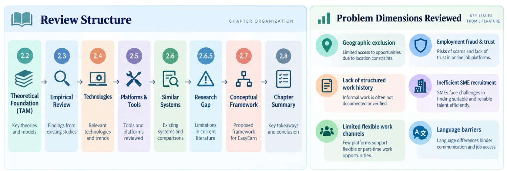

Figure 2.1: The Original Technology Acceptance Model (TAM)

As shown in Figure 2.1, PEOU also has a direct influence on PU, with ease of use being a determinant of a user's sense of usefulness of a system (Davis, 1989). Other external factors like system design characteristics, training and experience also play a role in both constructs.

Davis (1989) found that both PU and PEOU had an impact on a user's attitude toward using a system, which in turn had an impact on a user's Behavioural Intention to Use (BIU), which ultimately had an impact on a user's system use. Venkatesh and Davis (2000) expanded the original model to include additional factors that can impact Perceived Usefulness, namely social influence and cognitive instrumental processes, to further enhance the model's predictive power of enterprise system adoption. Another framework is the Unified Theory of Acceptance and Use of Technology (UTAUT) (Venkatesh et al., 2003), which is a consolidated theory of 12 models, including TAM, but TAM continues to be the most frequently used because of its parsimony and empirical rigour (King and He, 2006).

The current studies on the digital platform continue to employ the TAM approach, demonstrating its applicability in the context of digital transformation (DT) (Park et al., 2022; Schorr, 2023), and in digitalisation studies, PU and PEOU are the two most important predictors for technology adoption. Platform-based services have also been studied to determine their suitability for the study of online service adoption, as done by Troise et al. (2021), which additionally tested the platform-based services and confirmed their applicability for the study of online service adoption, thus making them suitable as a theoretical framework for EasyEarn.

TAM is well tested in various technology settings, such as online employment sites, online e-commerce applications and mobile applications. Pavlou (2003) used TAM in the context of e-commerce and found that nearly 60 per cent of the variance in users' intentions to make transactions on the Internet could be accounted for by trust, perceived usefulness and perceived ease of use. However, in the context of the gig economy platforms, ease of registration and the interpretability of job posting interfaces were the most important PEOU determinants of gig worker platform adoption, whereas income transparency and employer verification were the most significant PU determinants (Constantiou et al., 2017). The following are implications for the design priorities of EasyEarn.

### 2.2.2 Application of TAM to EasyEarn

EasyEarn is divided into two user groups: job seekers and employers, and uses the TAM framework for each group. The usefulness and ease of use of the platform vary between groups and the features EasyEarn offers are geared toward meeting both the usefulness and ease of use dimensions for both groups.

For job seekers, Perceived Usefulness is delivered through functionality that directly affects their job search: location-based job searches save them time deciding where they can find jobs that are relevant to them; the Work History Dashboard and Auto-Generate Resume provide a way for job seekers to create and display a professional, verifiable record; and the bi-directional Rating and Review System helps job seekers show their reliability to potential employers. The inability to establish a portable professional identity and the lack of trust mechanisms through informal means are two of the major structural barriers identified by Graham et al. (2017) and Pillai and Paul (2023), respectively, which are directly targeted in these features. Perceived Ease of Use for job seekers is realised through the mobile-responsive web design of the platform, which ensures that it is accessible to non-English-speaking users through Google Translate integration; and the rule-based chatbot, which allows for guidance on navigating the platform 24/7 (UNCDF, 2019).

The Employer Verification Badge enhances the applicant pool with greater credibility to prospective job seekers; the centralised job posting and application management dashboard streamlines the recruitment process and costs by eliminating the need for manual efforts, and the Report and Flag System ensures that any disputes are resolved through a formal process. The perceived ease of use for employers is manifested in a CRUD-enabled job posting interface, Application Status Timeline, and a self-explanatory platform navigation system based on Nielsen's (1993) usability heuristics. Table 2.1 shows the TAM mapping of the features offered by EasyEarn with the perceived ease of use and the perceived usefulness of each user group.

Table 2.1: TAM Application to EasyEarn Features by User Group

| Feature | User Group | Perceived Usefulness (PU) | Perceived Ease of Use (PEOU) |
| --- | --- | --- | --- |
| Location-Based Job Search | Job Seeker | Saves 40% of search time (Pillai and Paul, 2023) | Easy-to-use filter interface; mobile-friendly design |
| Work History Dashboard | Job Seeker | Constructs a credible professional identity (Graham et al., 2017) | Records jobs that have been completed and auto-populates the chart (visualisation) |
| Auto-Generate Resume | Job Seeker | Produces a downloadable PDF for job applications | Manual input not needed; one click is enough to generate via jsPDF |
| Bidirectional Rating System | Both | Demonstrates trust and accountability (MCMC 2023) | A simple 1-5 star interface and an optional written review |
| Employer Verification Badge | Employer | Raising the level of confidence of the applicant and the quality of the application | The badge is displayed on the profile, and it is automatically added by the admin |
| CRUD Job Posting Dashboard | Employer | Centralises all aspects of the recruitment process | Structured form that has an expiry date with category selection |
| Google Translate Integration | Both | Overcomes language barriers for non-English speakers (UNCDF, 2019) | One-click widget embedded in navigation bar |
| Rule-Based Chatbot | Both | Automated support and FAQ help 24/7 | Conversational interface; no registration required to use |

EasyEarn's features are shown in Figure 2.2 to either address Perceived Usefulness or Perceived Ease of Use for both Job Seekers and Employers.

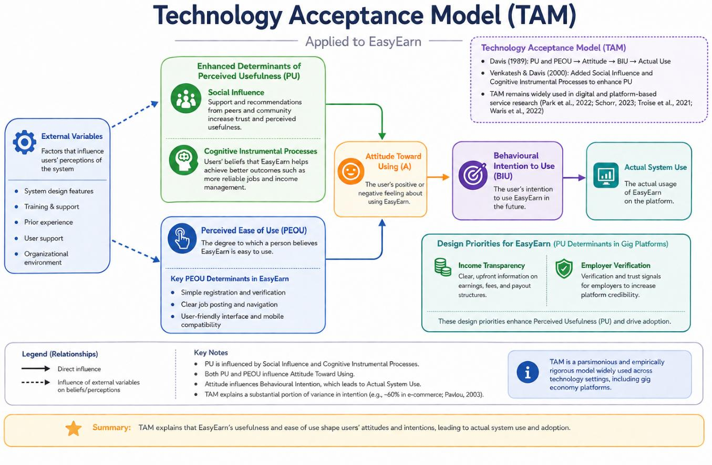

Figure 2.2: Application of TAM

### 2.2.3 Limitations of TAM and Supplementary Considerations

TAM is a comprehensive and empirically extensively proven model for predicting technology adoption, but some scholars have pointed to its limitations in the gig economy platforms. However, Bagozzi (2007) noted that the TAM model is a simplified approach to understanding human adoption of technology because it fails to account for social and emotional factors, which play important roles in technology adoption, especially when there is a high level of trust, a high level of perceived risk, and the presence of strong norms. Gefen et al. (2003) showed, in the context of the gig economy, that trust is an important antecedent of both Perceived Usefulness and Perceived Ease of Use in online marketplace contexts, especially in the case of financial transactions or employment relationships.

In order to overcome this drawback, EasyEarn extends the TAM framework with aspects that are taken from the Trust-Based Technology Acceptance Model of Gefen et al. (2003), which further introduces initial trust as an antecedent of both PU and PEOU. This is operationalised through the EasyEarn Employer Verification Badge, the Report and Flag System and the bi-directional Rating and Review System which aim to build and communicate trustworthiness to platform users prior to and during their interactions with the employer. The incorporation of the trust mechanisms into the design of EasyEarn in this way, therefore, is not only a practical solution but also a theoretical one to the reported drawbacks of TAM in the context of digital labour platforms (Pavlou, 2003; Gefen et al., 2003).

Figure 2.3 illustrates the extended Trust-Based TAM used in EasyEarn, where Initial Trust is treated as an antecedent of PU and PEOU to overcome the lack of applicability of TAM in gig economy platform settings.

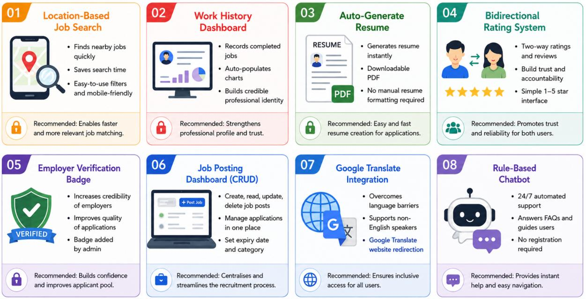

Figure 2.3: Limitations of TAM and Supplementary Considerations

## 2.3 Empirical Review

This section summarises empirical studies which are pertinent to the six problems outlined in Chapter 1 of this proposal. The empirical review brings together work from academic studies, government reports and research from international organisations to build up an evidence base which underpinned EasyEarn's design.

### 2.3.1 The Gig Economy in Malaysia

In the past ten years, the gig economy has made a remarkable change in Malaysia, driven by the proliferation of smartphones, the COVID-19 pandemic, and the growing problem of underemployment among graduates (Abd Samad et al., 2023). According to the World Bank (2023), 154 million to 435 million workers in the world are engaged in online gig work with more than 545 gig platforms globally. Specifically, there were more own-account workers in 2024 than in any previous year, with a population of around 25.1 per cent of the total workforce (Department of Statistics Malaysia, 2024).

Based on the Department of Statistics Malaysia (2023) data, 97.71 per cent of ride-halers are aged between 19 and 30 years, making a monthly income of RM1,500 to RM2,500. Abd Samad et al. (2023) concluded that the key motivators for gig workers among youth in Malaysia are flexible scheduling, earning extra income, and the low entry barrier to gig work. Siti Nurazira et al. (2024) also identified financial insecurity and the cost of living as the most prevalent economic push factors for the gig economy entry of young Malaysians, specifically the university students and newly graduated ones.

Despite these developments, MDEC (2023) showed that the gig platforms are still dominated within the Klang Valley, Penang and Johor Bahru and there were only a handful of platforms in the lesser-known cities of Ipoh, Kangar, Alor Setar, Kota Bharu and Kuala Terengganu. The geographic imbalance is a frequent problem in lower-density markets in developing economies in which the business model of platforms struggles to be replicated, according to the World Bank (2023). The geographic concentration results in a two-tiered gig economy, whereby people working in secondary towns are structurally disadvantaged when compared to people working in urban areas for access to certain jobs and income (Siti Nurazira et al., 2024).

The gig economy in Malaysia is estimated to have a market size of RM1.33 billion, and more than 100,000 new gig workers joined gig platforms in the same quarter of 2023 (MDEC, 2023). The numbers highlight the size of the opportunity and the need for structural changes that will enable secondary town workers to share in this expanding economic segment. The enactment of the Gig Workers Act 2025 (Act 872) on 31 March 2026 will pave the way for the first time with formal legal protections for more than 1.64 million gig workers in Malaysia (Ministry of Human Resources Malaysia, 2025).

Figure 2.4 illustrates the overall gig economy in Malaysia, which provides an overview of the workforce statistics, gig worker characteristics, and geographic distribution of gig platforms.

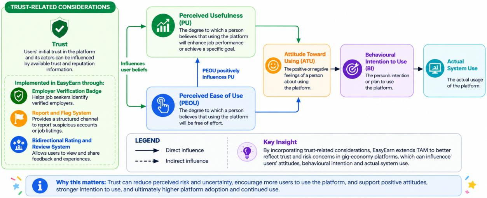

Figure 2.4: Malaysia’s Gig Economy Landscape

### 2.3.2 Employment Fraud and the Risks of Informal Job-Seeking Channels

Without dedicated gig platforms, the secondary towns of Malaysia are using unverified social media sources such as Facebook groups, Instagram posts or WhatsApp communities that are not identity verified, have no workers' accountability and lack formal reporting systems (MCMC, 2023). Empirical studies show the adverse effects of this informal approach.

The MCMC (2023) indicated that there is a rise in social media job scams by 34 per cent in 2022, where university students and housewives were the most vulnerable groups. As of August 2023, 77.2 per cent (or 222,876) of informal gig workers had not registered with SOCSO, meaning they are not protected nor subjected to any accountability mechanisms (Department of Statistics Malaysia, 2023). Along with other reasons, Gefen et al. (2003) observe that in job markets in which there are no formal verification systems, it is possible for online employment fraud to flourish, and this can be addressed by using dedicated job sites with verification systems provided by employers.

The typologies of online employment scams are also relevant to this study to provide some background on the risks of gig workers working through informal channels in Malaysia. While Whitty and Buchanan (2012) created their typology of fraud in the context of online romance scams, researchers have found that the same fraud categories are relevant to online employment scams and that online employment scams, like romance scams, are related to deception, false identity presentation, and exploitation of the victim through financial loss (MCMC, 2023). Whitty and Buchanan (2012) distinguished three main types of fraud: advance-fee fraud, where the victim is asked to pay some amount of money in advance before receiving any payment; identity theft scams, where personal information is solicited as part of a job application process; or non-payment fraud, where the victim agrees to work but is never paid.

All three are found in job communities within social media in Malaysia (MCMC, 2023). Non-payment fraud is the top-reported type of scam, with 58 per cent of those who were scammed reporting it; advance-fee fraud was also reported by 31 per cent of scam victims, according to the MCMC (2023) survey. These numbers directly feed into EasyEarn's payment confirmation and dispute function, which means that job seekers can commence formal disputes if they are not getting paid and can upload DuitNow payment evidence.

This problem is further put into perspective by empirical studies on the topic of online trust. Gefen et al. (2003) showed that the only factor that is a more significant predictor of users' desire to make an online transaction is Perceived Trust (PT), which also includes job applications. Lack of a trustworthy employer profile and formal dispute mechanisms means that job seekers have to deal with what Akerlof (1970) calls the ‘lemons problem' in the job market, in which both workers and employers have less information than in a good market. Ba & Pavlou (2002) also showed that the one-way rating model is clearly causing this asymmetry, and that the two-way rating model helps to lower it and boost platform usage. EasyEarn's Safety and Trust Module directly tackles this with the Employer Verification Badge, Report and Flag System and bi-directional Rating and Review System. Figure 2.5 shows the risks that are identified in the informal gig channels and EasyEarn's safety and trust module that mitigates each of these risks.

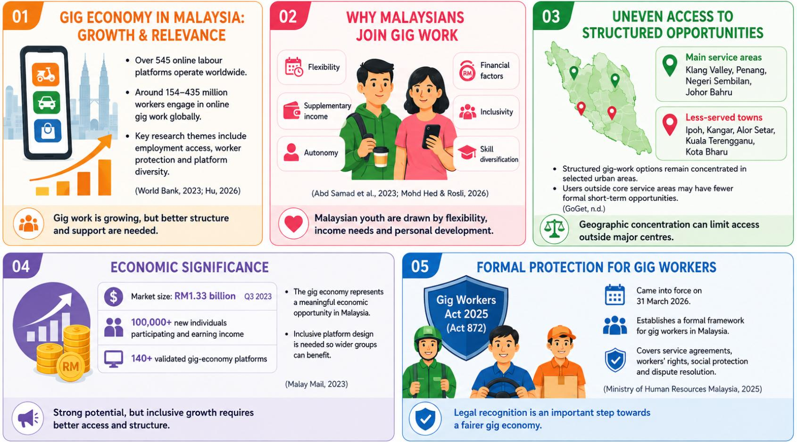

Figure 2.5: Risks of Informal Gig Channels and Solutions

### 2.3.3 The Absence of Verifiable Work Histories for Gig Workers

A consistent issue raised across the different developing economies is the lack of a portable and verifiable professional identity among the gig workers (Graham et al., 2017). It is customary to have a verifiable work history in traditional work, such as work contracts, pay slips and references from employers. By contrast, gig workers are those who work multiple short-term gigs with a series of employers, but do not get formal records of their skill sets, their performance or their employment history.

Graham et al. (2017) report on a large-scale empirical study of platform workers in Sub-Saharan Africa and Southeast Asia: The majority of respondents pointed to the lack of being able to develop a portable identity as a worker as the most important structural difficulty. Staff noted that the lack of evidence of work hindered their ability to negotiate increases, access to higher-skilled jobs and a move to more stable work. Gig workers who had more experience in the gig economy through both formal and informal platforms had significantly higher wages than gig workers who had only acquired more experience in the gig economy through formal platforms, according to Abd Samad et al. (2023).

This also presents difficulties for individual workers in the gig economy as well as for employers looking to evaluate the suitability of applicants, OECD (2019) has noted. In SME contexts, employers are exposed to the risk of hiring, as there is no credibility signal like completion rate, rating, or skills documented to back up the hiring. As screening and verification costs are higher with social media sources, Kuek et al. (2015) estimate that Malaysian SMEs would spend on average 2.3 times more to hire successfully from the social media platforms than from the structured platforms.

The structural problem of lack of verifiable work histories with gig workers and the economic consequences of this lack is summarised in Figure 2.6.

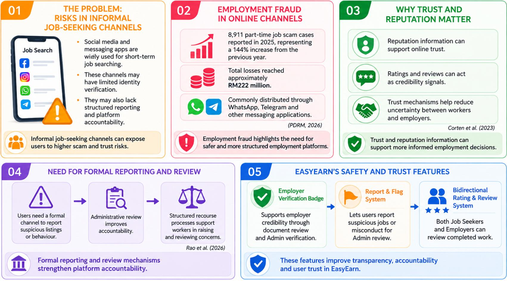

Figure 2.6: The Absence of Verifiable Work Histories of Gig Workers

### 2.3.4 Language Barriers and Digital Exclusion in Malaysian Gig Platforms

One of the important barriers that hinder participation in the gig economy in multilingual developing economies, yet is widely neglected, is language accessibility. Malaysia's population is divided into three linguistic groups: those who speak Bahasa Melayu, Mandarin and Tamil, each with a significant proportion of the population of the gig-able workforce (Department of Statistics Malaysia, 2023).

The study by the UNCDF (2019) on digital financial inclusion in Southeast Asia revealed that GoGet's low- and middle-income consumers are mostly speakers of the local language, Bahasa Melayu, but the website functions mainly in English. The study revealed that non-English-proficient workers in Malaysia would adopt the platform by an estimated 28 per cent less due to language barriers, which means that a significant percentage of users are not currently using the platform. It is UNCDF's (2019) argument that language inclusivity is key for equal access to digital employment platforms in the region.

In addition to the geographic exclusion that has been discussed in Section 2.3.1, MDEC (2023) also observes that in secondary Malaysian towns, English proficiency is far more limited than in major urban centres. Some terminals in towns like Kangar, Kota Bharu and Kuala Terengganu are only partially available, and in towns with accessible platforms, workers are often unable to communicate on the platform, thus putting them at risk of a double layer of digital exclusion. Meanwhile, Siti Nurazira et al. (2024) also discovered that many participants in the non-urban areas of Malaysia in the study stated that they had difficulty in understanding the language of the platforms, as their reason for not participating in the gig economy.

Figure 2.7 illustrates the language accessibility problems that Malaysian gig workers encounter and EasyEarn's multilingual support method.

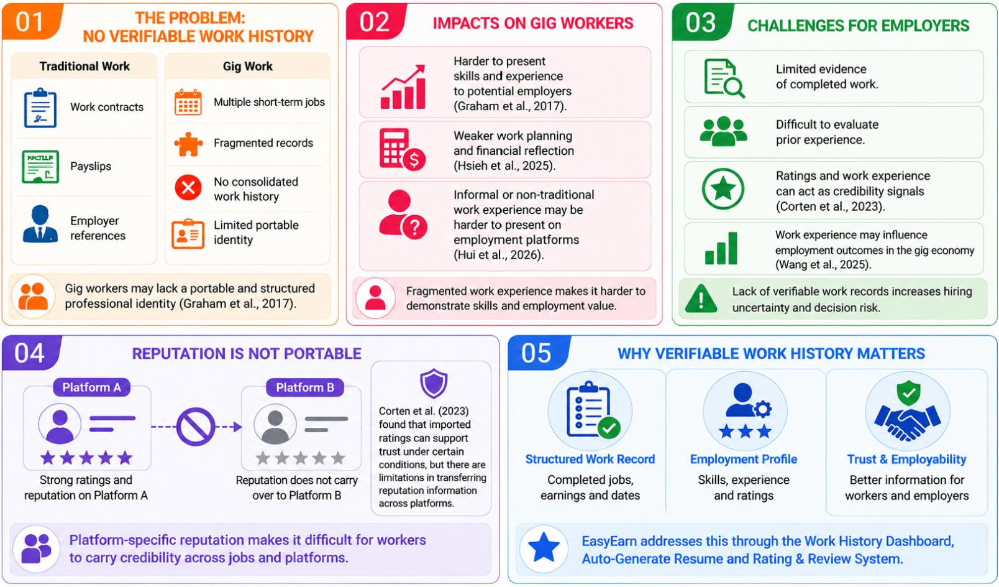

Figure 2.7: Language Accessibility

### 2.3.5 Flexible Work and Underserved Demographics

The current study aligns with the findings of previous studies in Malaysia, where the main groups pursuing flexible and short-term income include university students and housewives, as well as those who are unemployed, and the platforms available are systematically inadequate in supporting them (Abd Samad et al., 2023; Siti Nurazira et al., 2024).

Abd Samad et al. (2023) conducted a study involving 412 gig workers in Malaysia to determine their motivations for taking up gig work as a means of supplementing their income. They found that 68 per cent of the respondents were mainly motivated by flexible working times compared to having a full-time job. The academic schedule was the main factor that hindered students from working, while housewives mentioned childcare as the major factor. Both groups claimed that current long-term employment platforms like JobStreet and RiceBowl were unhelpful to them since they didn't accommodate short-term positions, defined as less than a month.

Indeed, the proliferation of digital labour platforms in Southeast Asia has been skewed towards the logistics and transportation sector, including ride-hailing and food delivery services, that demand vehicle ownership, and hence are out of reach of students and housewives (International Labour Organisation [ILO], 2021). These demographic groups are looking for jobs in event staffing, retail assistance, tutoring and administrative support, which are the most common short-term jobs, but are not catered for by the existing platforms in Malaysia. Malaysian SMEs in these sectors actively look for a platform where they can access staff for short periods of time, but are unable to do so because there is no platform suitable for the purpose, leading to labour market inefficiencies both on the supply and demand side, according to Kalai Vani and Foo (2024).

As illustrated in Figure 2.8, the key demand segments for flexible work, the current platform challenges and supply-demand disconnects for underserved segments are highlighted.

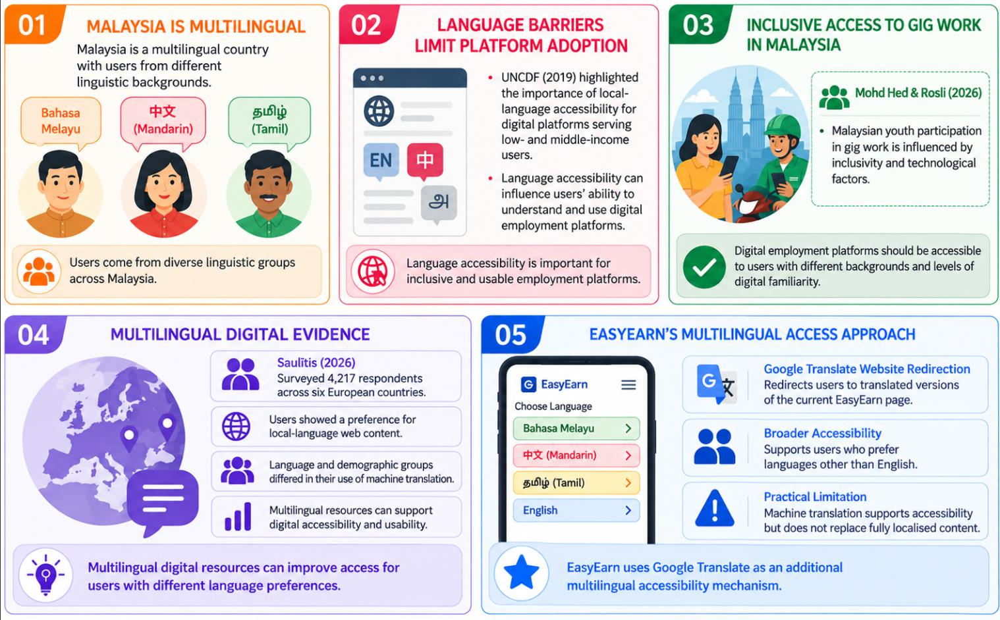

Figure 2.8: Flexible Work and Underserved Demographics

### 2.3.6 Inefficient SME Recruitment and Short-Term Hiring Challenges

In Malaysia, there is a need for a centralised platform to meet the specific needs of small and medium enterprises (SMEs) in hiring workers for short and temporary periods, such as for events, retail support or administrative assistance. According to Kalai Vani and Foo (2024), Malaysian SMEs do not have a holistic system for short-term recruitment and staffing, which makes it difficult for them to use formal and informal recruitment practices to address the short-term demands for labour.

Where there is no structured hiring pathway, SMEs rely on informal practices like social media postings and referrals, and these are time-consuming with no formal vetting of applicants. Kuek et al. (2015) found that Malaysian SMEs spend 2.3 times more per successful hire in the informal social media recruitment method than in the structured recruitment method, mostly due to the fact that applicant data provided on informal social media is not consistent or verifiable. This lack of reliable applicant data makes it harder for employers to hire workers because it raises their risk, especially for SMEs in developing economies who do not have access to digital recruitment tools (OECD, 2019).

In conclusion, the results also indicate the existence of several related issues that contribute to inefficient SME recruitment, rather than one. Kuek et al. (2015) pointed out that informal recruitment is more costly, the OECD (2019) explained the limited availability of digital recruitment tools for SMEs, and Kalai Vani and Foo (2024) addressed the absence of an appropriate platform to hire short-term labour in Malaysia. Thus, a successful solution must enable the screening of applicants as well as a formalised recruitment process for SMEs.

The results indicate the need for SMEs to have a more formalised approach towards short-term recruiting, rather than informal social media platforms. In the long run, a centralised platform can assist employers in posting short-term jobs, shortlisting applicants, and analysing the credibility of applicants with more reliable data. The Employer Dashboard and Job Posting CRUD feature enable employers to handle their job posting and hiring process, and the Application Status Timeline offers insights into the applicant status. The Work History Dashboard and rating system also give employers more information to evaluate the applicant.

Figure 2.9 shows the short-term recruitment problems encountered by Malaysian SMEs, such as informal recruitment, high screening costs and no centralised platform to post jobs, and EasyEarn's solutions of structured job posting, applicant management, application tracking and verified worker information.

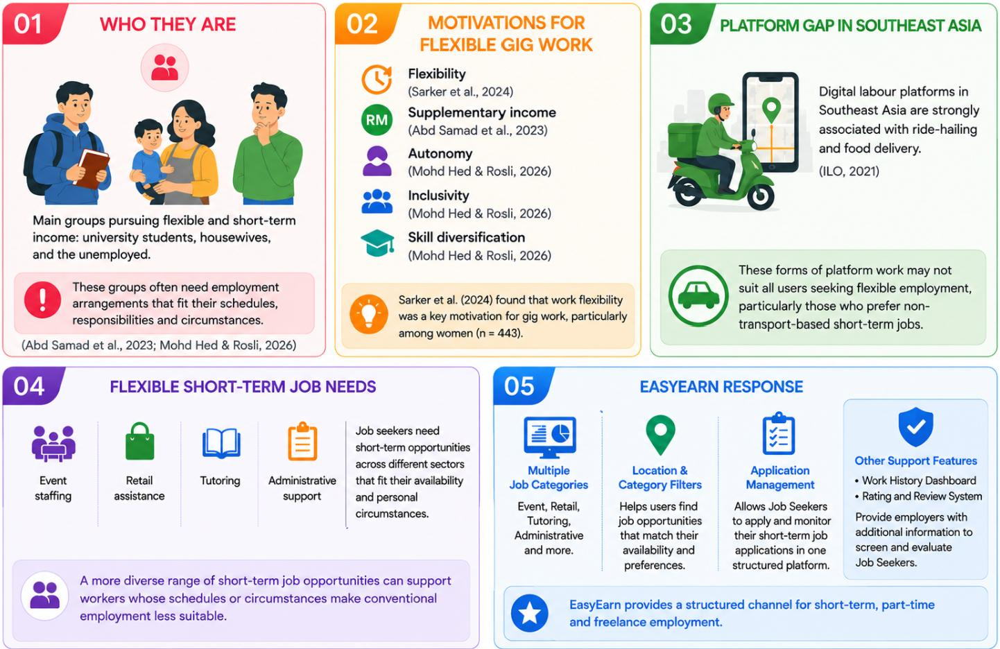

Figure 2.9: Inefficient SME Recruitment and Short-Term Hiring Challenges

### 2.3.7 Summary of Empirical Evidence

To summarise, the key empirical findings are reviewed in Sections 2.3.1-2.3.6. The key empirical results and primary sources and EasyEarn design responses are outlined in each of the six problem dimensions in Table 2.2. In sum, these results lay the groundwork for technology and platform design decisions in later sections.

Table 2.2 provides a summary of the various empirical findings and the main sources for each of the problem dimensions, along with EasyEarn's responses to them.

Table 2.2: Summary of Empirical Evidence

| Problem Dimension | Key Empirical Finding | Primary Source | EasyEarn Design Response |
| --- | --- | --- | --- |
| Geographic Exclusion | Gig platforms are not found in Ipoh, Kangar, Kota Bharu and other secondary towns, and the Klang Valley has the highest number of platforms. | MDEC (2023); World Bank (2023) | Job search and filter (all regions of Malaysia) |
| Employment Fraud | In 2022, social media job scams increased by 34%, non-payment fraud accounted for 58% of social media fraud victims, and housewives and students were the most targeted groups. | MCMC (2023); Whitty and Buchanan (2012) | Both the Reporting and Flag system and the Employer Verification Badge are Fair Use systems. |
| Absent Work Identity | The most important structural hurdle for gig workers is the absence of a transferable work identity; gig workers on formal platforms see higher earnings than those working informally. | Graham et al. (2017); Abd Samad et al. (2023) | The Work History Dashboard, Auto-Generate PDF Resume, and Skill Tags features are also useful for job seekers. |
| Language Barrier | 28% fewer platforms are adopted due to language barriers, and 41% of non-urban non-participants report language difficulty. | UNCDF (2019); Siti Nurazira et al. (2024) | The Google Translate widget is inserted into the navigation bar. |
| Inefficient SME Recruitment | SMEs have to pay 2.3 times more per hire for informal recruitment; SMEs Do Not Have Centralised Short-Term Hiring Tools. | Kuek et al. (2015); Kalai Vani and Foo (2024) | CRUD employer dashboard; Application Status Timeline. |
| Underserved Demographics | 68% of gig workers are seeking flexible hours; students and housewives are not included in the existing platforms. | Abd Samad et al. (2023); ILO (2021) | The short-term nature of the jobs: flexible application management and chatbot support. |

## 2.4 Review of Relevant Technologies

In this section, the basic front-end and client-side technologies that comprise the technical backbone of EasyEarn are discussed. Each technology is compared to academic literature and to believable alternatives to select them in the context of a solo-developer academic project.

### 2.4.1 Web-Based Application Development

HTML5, CSS3 and JavaScript are the backbone of today's Web application development. Mozilla Developer Network (MDN) Web Docs (2023) explain that HTML5 offers the semantic structure, CSS3 offers the presentation, and JavaScript offers the interactivity of the content, without requiring anything on the server side. This is because the choice of the technology stack for software development needs to be based on several criteria: ease of maintenance, developer familiarity, ease of deployment, and technology suitability in the context of EasyEarn's academic domain, which this combination achieves. This is because software development technology stack selection should cater to several criteria, which this combination addresses, such as ease of maintenance, developer familiarity, ease of deployment in EasyEarn's academic domain and technology suitability.

In comparison to modern front-end frameworks like React, Angular, and Vue.js, plain JavaScript has fewer layers of dependency, is less complex with build tools and offers a clearer code structure, which is more suitable for a student-driven academic project that will be evaluated and moderated (MDN Web Docs, 2023). For a single-developer project deployed through GitHub Pages, such as Pressman and Maxim (2020) did, frameworks like React provide virtual Document Object Model (DOM) diffing and componentised architecture, which are useful for large-scale commercial applications but add unnecessary overhead and build pipeline complexity. EasyEarn's feature set and ease of maintenance will thus be a compromise between HTML, CSS, and JavaScript, with the latter being prioritised due to the academic nature of the project and the limited resources of the sole developer.

With responsive web design, using CSS3 media queries and a flexible grid, EasyEarn will be available in both desktop and mobile browsers without a native application. This is especially significant as 97.71 per cent of the Malaysian gig workers between the ages of 19 and 30 use smartphones as their primary source of communication (Department of Statistics Malaysia, 2023).

Figure 2.10 shows the rationale behind the web-based technology stack that EasyEarn has: a contrast between using JavaScript and using modern web frameworks, as well as deployment benefits.

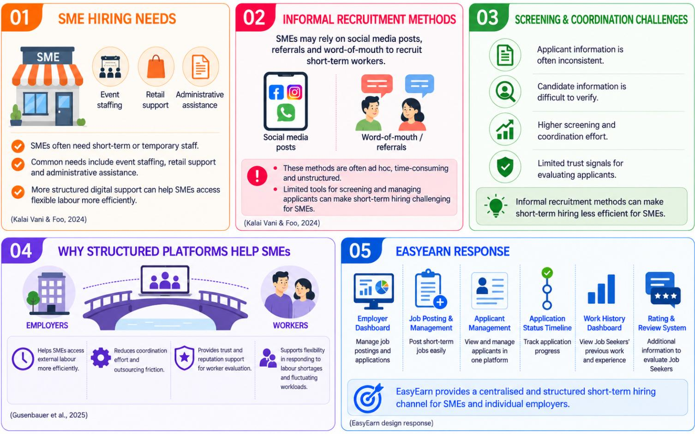

Figure 2.10: Web-Based Application Development

### 2.4.2 Client-Side PDF Generation via jsPDF

The jsPDF library is a free JavaScript library that creates Portable Document Format (PDF) files directly in the browser, instead of having to process the files on the server or make extra API calls (Hall, 2025). EasyEarn's Auto-Generate Resume feature uses jsPDF to enable a job seeker to create a downloadable PDF resume without having to upload it to the platform; this is because job seekers are unable to upload a verifiable resume with work history (Graham et al., 2017).

While the server-side solutions like wkhtmltopdf, Puppeteer and Python's ReportLab provide better typographic control and support for complex layouts, they do require a dedicated backend process for running, which is not supported by EasyEarn's GitHub Pages deployment (GitHub, 2024). The advantages of using jsPDF are that it is entirely executed within the browser, it natively supports the Supabase JavaScript Client Library, and it does not require any extra server infrastructure, which makes it the best fit for the current desired scope of work (Hall, 2025). Moreover, its lightweight design and popularity in web-based applications, academic projects, and commercial projects add to its selection (Hall, 2025).

In Figure 2.11, the client-side approach for creating a PDF is illustrated with the help of the jsPDF library and is contrasted with server-side approaches.

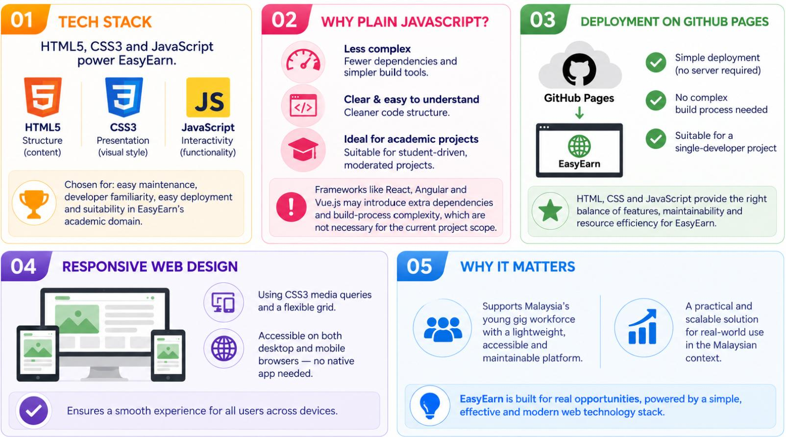

Figure 2.11: Client-Side PDF Generation

### 2.4.3 Data Visualisation via Chart.js

Chart.js is an open-source JavaScript charting library that can create interactive, animated data visualisations inside the HTML5 canvas element Chart.js. (2023). EasyEarn uses Chart.js to present the completed jobs count, along with their total earnings and distribution by job type in the Work History Dashboard, and to provide platform-wide totals of registered users, completed jobs, active job postings, applications submitted and successful job matches in the Admin Analytics Dashboard.

Google Charts is similar, but needs a long-lived connection to Google's content delivery network. In contrast, Chart.js can be downloaded locally, is less cumbersome to set up, is more compatible with JavaScript data arrays, and will create responsive, mobile-friendly charts the most suitable option for EasyEarn's deployment and timeline requirements. The data visualisation method is illustrated in Figure 2.12, which also depicts the data visualisation methods that can be used as alternatives to Chart.js.

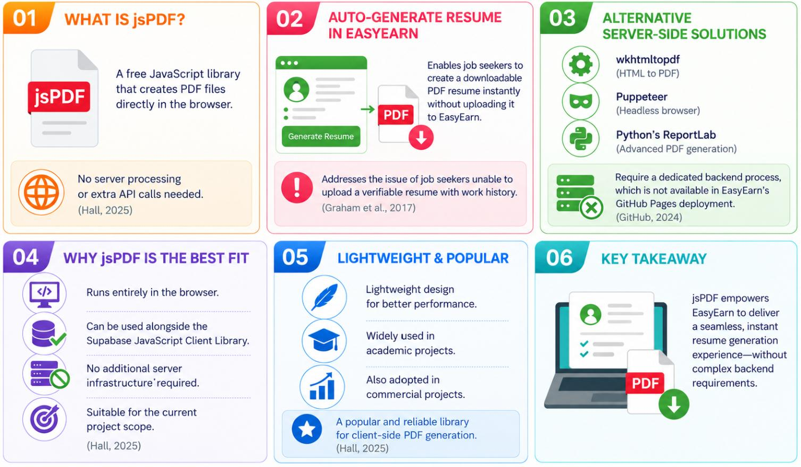

Figure 2.12: Data Visualisation

### 2.4.4 Multilingual Accessibility: Google Translate Integration

UNCDF (2019) emphasizes that multilingual accessibility is one of the key factors in enhancing the digital inclusion of users with different language backgrounds in Malaysia. There are several options for enabling multilingual support in a web application: Using a native translation API like Google Cloud Translation, using pre-translated static content, or redirection to the Google Translate webpage. Google Cloud Translation offers automatic translation services for a wide variety of languages and can be seamlessly integrated into a website (Google Cloud, 2023). It's not the most ideal solution for EasyEarn's zero-budget academic prototype, however, because it's based on usage and has other API integration requirements.

Another translation service is DeepL; however, the language support mentioned in the reviewed source does not completely align with EasyEarn's multilingual needs (DeepL, 2023). For this reason, EasyEarn employs the website redirection mechanism of Google translation (Google, 2023) in which the current EasyEarn page is redirected to the Google website for translation. The method is simple and economical, avoiding the need of a native translation API to support users from various language backgrounds.

As shown in figure 2.13, there are multiple ways of making web pages accessible to people with multiple languages that were considered for EasyEarn and Google Translate website redirection was chosen for the current system.

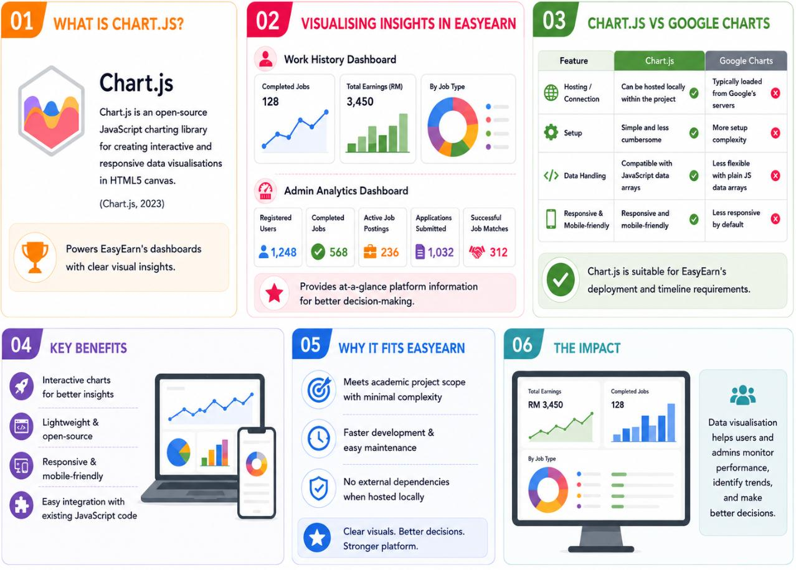

Figure 2.13: Multilingual Accessibility

## 2.5 Review of Selected Tools and Platforms

This section summarises the services, hosting platform and development tools used for EasyEarn and assesses them both academically and technically. Figure 2.14 presents an overview of the tools and platforms that were selected for EasyEarn, including the Supabase relational database features and their comparison with Firebase, the GitHub Pages workflow for static hosting, and the Canva wireframing method based on Nielsen's heuristics for usability.

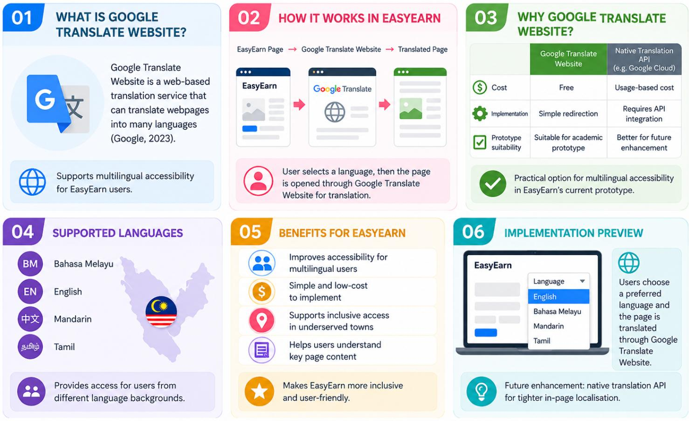

Figure 2.14: Review of Selected Tools and Platforms

### 2.5.1 Supabase: Open-Source Backend-as-a-Service

Backend-as-a-Service (BaaS) is a cloud computing service where the server-side infrastructure, such as database management, authentication management and API provision, is outsourced to a managed third-party service (Supabase, 2024). Developers do not need to configure and maintain a dedicated server, but instead work with the backend utilising a pre-built API client, which removes a lot of the overhead of infrastructure administration. This model is ideal for student academic projects, in which the developer must create a multi-user, data-driven application in a limited time without the availability of their own server infrastructure and without the support of other students (Pressman and Maxim, 2020).

Supabase is an open-source BaaS platform that includes a relational database, token-based authentication via JavaScript Object Notation Web Tokens (JWT), real-time data synchronisation, a JavaScript client library (Supabase, 2024), and RLS policies. It is touted to be an open-source alternative to Firebase, Google's proprietary BaaS. The most notable difference between Supabase and Firebase is the models of their databases. Firebase stores data in Firestore, a NoSQL document-oriented database that is optimised for hierarchical and schema-flexible data. Supabase is based on PostgreSQL, a full-featured relational database that supports foreign key constraints, JOINs, and declarative schema design (Supabase, 2024). EasyEarn's data model contains relational relationships among users, job postings, applications, ratings, and work history records, and it is a more natural data model to be expressed in a relational schema.

EasyEarn's requirement for role-based access is also important to note and is well-suited to Supabase's RLS policies. One of the great features of RLS is that it supports access control policies at the database level, meaning that job seekers can only view their own application data and employers can only update their own jobs, without having to implement extra middleware logic (Supabase, 2024). This meets the security standards outlined in Malaysia's PDPA 2010 and the Computer Crimes Act 1997, which require reasonable measures to be taken to ensure that access to personal data is not granted without authorisation.

### 2.5.2 GitHub Pages: Static Site Hosting

GitHub Pages is a free static website-hosting service that can be provisioned from a GitHub repository via HTTPS (GitHub, 2024). Other services to host them can be Netlify, Vercel, or Firebase Hosting. While Netlify and Vercel provide continuous deployment pipelines and serverless function support, a static front-end making API calls to a Supabase backend doesn't require them. Firebase Hosting is configured at the project level and might need a billing setup beyond the free tier.

The solution for EasyEarn for hosting its academic deployment context with its version control workflows is very simple: GitHub Pages is free, it provides HTTPS by default, and it simply works with a push to the repository. For EasyEarn, one of the most practical and cost-effective methods for hosting is using GitHub Pages, which works seamlessly with the iterative sprint development workflow and is automatically secured by HTTPS (GitHub, 2024).

### 2.5.3 Canva: UI/UX Wireframing and Prototyping

Canva is used to create wireframes and prototypes for EasyEarn. Canva allows for easy visualisation of dashboards and user flow diagrams before HTML implementation, is capable of drag-and-drop interface design, and template-based layout creation, making it well-suited for visualisation of role-based dashboards and user flow diagrams before HTML implementation (Canva, 2023). All screens for the platform are designed based on the wireframes created in Canva, which adhere to Nielsen's (1993) 10 usability heuristics, such as: visibility of system status, error prevention, user control and freedom, and consistency and standards. These heuristics directly contribute to the design of EasyEarn's Application Status Timeline, Chatbot interface and the role-based navigation in the application.

## 2.6 Review of Similar Systems

Existing job-matching platforms are analysed across three categories: full-time job portals, domestic task-based gig platforms and international gig platforms to be considered as comparators to EasyEarn. The analysis is aggregated and presented in a comparative feature gap table.

### 2.6.1 Full-Time Employment Portals: JobStreet and RiceBowl

In Malaysia, some of the most well-known online recruitment platforms include JobStreet (an arm of SEEK Asia) and RiceBowl (2024). Both platforms are geared specifically toward formal, permanent, or long-term contract positions, with the application process consisting of a structured form, employers' profile pages, and a resume submission process for full-time roles. The application forms assume a formal employment arrangement, meaning that students, housewives or those informally employed must provide detailed educational background and professional references, along with cover letters, which causes undue friction for people looking for short-term employment (Pillai and Paul, 2023).

Neither platform offers a verifiable history of gig work, nor has there been a system that allows gig workers to rate their employers, and multilingual support outside of English and limited work in the local language (Bahasa Melayu) is available (MDEC, 2023). This structural mismatch between full-time portal design and flexible working demands is a recurring impediment for the formalisation of the gig economy in developing countries, which EasyEarn's work directly tackles, according to the OECD (2019). It is shown in Figure 2.15 that the existing full-time employment portals have several gaps and EasyEarn has overcome these gaps.

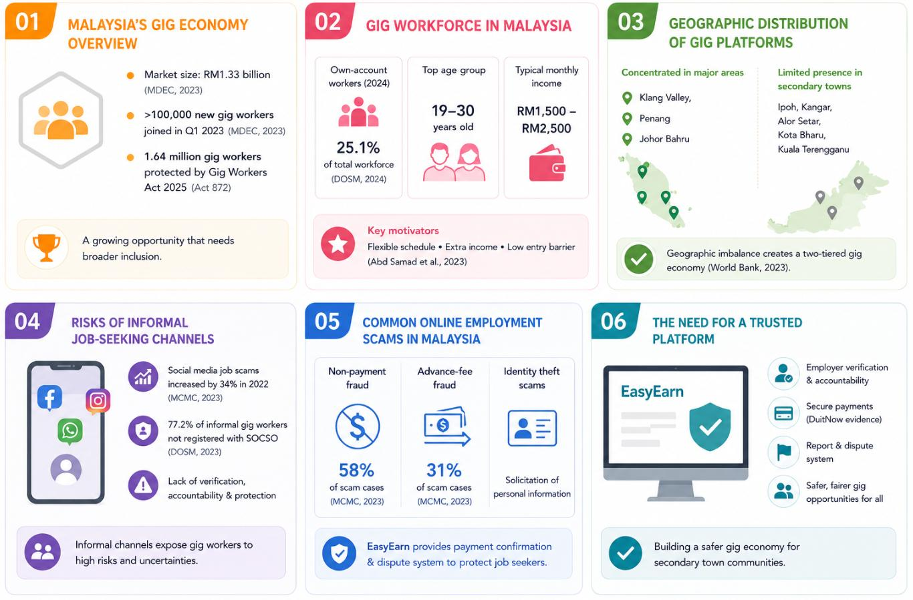

Figure 2.15: Full-Time Employment Portals

### 2.6.2: Task-Based Gig Platforms: GoGet and Troopers

GoGet and Troopers are Malaysia's most well-known task-based gig platforms, offering short-term jobs such as event staffing, cleaning and delivery services (GoGet, 2024; Troopers, 2024). Both platforms are primarily concentrated in major urban centres such as Kuala Lumpur, Penang and Johor Bahru, with little to no presence in secondary towns like Ipoh, Kangar or Kota Bharu (MDEC, 2023). Neither platform provides a verifiable work history profile, a bidirectional rating system, or multilingual support beyond English, which limits accessibility for non-English-speaking workers in smaller towns (UNCDF, 2019).

Furthermore, neither platform includes an employer verification badge or a formal report and flag system, leaving users vulnerable to fraudulent job postings and non-payment (MCMC, 2023). As illustrated in Figure 2.16, existing domestic task-based gig platforms are geographically and feature-limited, while EasyEarn is not.

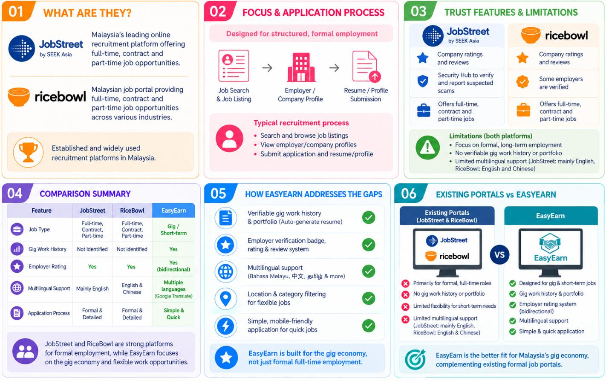

Figure 2.16: Task-Based Gig Platform

### 2.6.3: International Gig Platforms: Fiverr, TaskRabbit, and Upwork

At the international level, some platforms like Fiverr, TaskRabbit, or Upwork have shown the feasibility of a structured digital labour market for flexible and short-term employment (Graham et al., 2017). Nevertheless, there are important power imbalances between workers and clients, no portable record of work beyond ratings on the platform and no access to platforms for workers in areas with low bandwidth or low English language skills, as Graham et al. (2017) established in their large-scale empirical study. Kuek et al. (2015) also note that localised, face-to-face, location-specific jobs like event support and retail jobs do not exist on international platforms, and are the main jobs that gig workers have in Malaysia's secondary towns. The difficulties with the international gig platforms are shown in Figure 2.17, and how EasyEarn resolves the lack of context alignment is shown below.

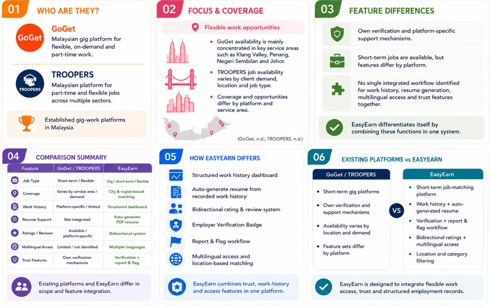

Figure 2.17: International Gig Platform

### 2.6.4: Comparison Feature Gap Analysis

Table 2.3 provides a tabular comparison of EasyEarn with the platforms reviewed based on 11 feature dimensions.

Table 2.3: Feature Comparison of Selected Malaysian Job Platforms and EasyEarn

| Feature | JobStreet | RiceBowl | GoGet | Troopers | EasyEarn | Key Source |
| --- | --- | --- | --- | --- | --- | --- |
| Short-term / Gig Work Support | No | No | Yes | Yes | Yes | MDEC, 2023 |
| Geographic coverage is beyond major cities. | Partial | Partial | No | No | Yes | Pillai and Paul, 2023 |
| Verifiable Work History Profile | No | No | No | No | Yes | Graham et al., 2017 |
| Auto-Generated PDF Resume | No | No | No | No | Yes | Marineau, 2023 |
| Bidirectional Rating and Review | No | No | Partial | Partial | Yes | MCMC, 2023 |
| Multilingual Support | Partial | Partial | No | No | Yes | UNCDF, 2019 |
| Employer Trust Verification Badge | No | No | No | No | Yes | MCMC, 2023 |
| Report and Flag System | No | No | No | No | Yes | MCMC, 2023 |
| Rule-Based Chatbot Support | No | No | No | No | Yes | Somerville, 2016 |
| Offline Payment Guidance | No | No | No | No | Yes | Bank Negara, 2022 |
| Gig Workers Act 2025 Compliance Awareness | No | No | No | No | Yes | Ministry of Human Resources Malaysia, 2025 |

The comparison of the selected Malaysian platforms in Table 2.3 is based on the 11 feature dimensions that are evaluated in this study; only EasyEarn is a platform that is designed to address all these 11 feature dimensions. Moreover, EasyEarn is the only system that explicitly considers and accounts for the changing regulatory landscape of gig work in Malaysia, such as the Gig Workers Act 2025 (Ministry of Human Resources Malaysia, 2025).

### 2.6.5: Research Gap

The empirical study in Section 2.3 and the study of similar systems in Section 2.6 indicate a similar gap in the research. There are a number of issues that have been studied with respect to gig workers and employers, but the issues have been studied individually instead of as a set of interrelated issues in one context of gig employment among workers within Malaysia. Graham et al. (2017) and Abd Samad et al. (2023) discussed the employment experience, work identity and income opportunities of gig workers, while MCMC (2023) and Whitty and Buchanan (2012) shared insights about risks involving employment fraud and unverified online interactions. UNCDF (2019) also found that language accessibility is another challenge to participation in digital platforms, and Kuek et al. (2015) and Kalai Vani and Foo (2024) identified recruitment problems faced by employers and SMEs. While these studies show that geographic exclusion, employment fraud, no verifiable work history, language barriers, and underserved flexible workers and inefficient SME recruitment can be solved individually, there is limited research that looks at these issues together and how they can be solved with one integrated platform.

This is also reflected in the feature comparison as shown in Table 2.3, between the selected job and gig platforms available in the Malaysian context. JobStreet and RiceBowl are primarily geared towards traditional employment, whereas GoGet and Troopers offer more assistance for short-term and gig work. But each platform only covers a partial component of the 11 feature dimensions assessed in this study. While the international platforms discussed separately in Section 2.6.3 (such as Fiverr, TaskRabbit and Upwork) prove that structured digital labour platforms can work, they do not cater to Malaysia's local and location-specific short-term employment needs, especially in secondary towns (Kuek et al., 2015). However, none of the reviewed platforms offers all these features in a single system, including wider geographic access, employer verification, two-way ratings and reviews, verifiable work history, multilingual support, and short-term hiring support for SMEs.

Based on these results, there is still a gap in the literature and the current market. Past research has not fully examined an integrated job-matching system specifically for the Malaysian context and the needs of users in secondary towns. Furthermore, none of the platforms studied in this research covers all six problem dimensions in one system. EasyEarn aims to fill this gap through location-based job search, employer verification, reporting and rating functions, a verifiable work history profile, multilingual support, and short-term job and applicant management on one web-based platform. This identified gap provides the foundation for the design of EasyEarn and is further explained in the Conceptual Framework presented in Section 2.7.

## 2.7 Conceptual Framework

A conceptual framework is suggested, based on the theoretical framework outlined in Section 2.2, empirical evidence reviewed in Section 2.3 and the identified gaps in the context of gig employment in Malaysia in Section 2.6.5, to show how EasyEarn can respond to these gaps. This framework came from the empirical literature and combines the Technology Acceptance Model (TAM) (Davis, 1989; Venkatesh & Bala, 2008), along with the trust-related issues from the Trust-Based Technology Acceptance Model (TBTAM) (Gefen et al., 2003).

There are three analytical layers in the conceptual framework. The first layer is the 6 problem dimensions identified in the empirical literature. The second layer shows the design responses from EasyEarn, where specific features on the platform are linked to each identified problem. The third layer is related to user adoption and platform outcomes expected based on TAM and trust-related factors, including perceived usefulness (PU), perceived ease of use (PEOU) and initial trust. Table 2.4 provides the EasyEarn conceptual framework by making connections between the problem dimensions and the literature basis, the design response, and the expected outcome.

Table 2.4: EasyEarn Conceptual Framework

| Problem Dimension | Literature Basis | EasyEarn Design Response | Expected Outcome (TAM) |
| --- | --- | --- | --- |
| Geographic Exclusion | MDEC (2023); Pillai and Paul (2023) | Job search and location filtering by geographical area. | Increased Perceived Usefulness (PU) for secondary-town users. |
| Employment Fraud | MCMC (2023); Gefen et al. (2003) | Report and Flag System; Employer Verification Badge. | Enhanced initial trust and PU. |
| Absent Work Identity | Graham et al. (2017); Abd Samad et al. (2023) | Work History Dashboard; Auto-Generate PDF Resume. | Reduced information asymmetry; increased PU. |
| Language Barrier | UNCDF (2019); Siti Nurazira et al. (2024) | Google Translate site redirection for multilingual access to the website. | Enhanced PEOU for users with other languages. |
| Inefficient SME Recruitment | Kalai Vani and Foo (2024); OECD (2019) | Employer Dashboard, Job Posting CRUD and Application Status Timeline. | Improved recruitment efficiency and increased PU. |
| No Flexible Work Channel | Abd Samad et al. (2023); ILO (2021) | Flexible application management; short-term job category. | Increased PEOU and PU for flexible workers. |

Figure 2.18 illustrates the EasyEarn Conceptual Framework, which links the six problem dimensions identified to the design responses of EasyEarn, the likely outcomes of TAM, trust, and broader outcomes.

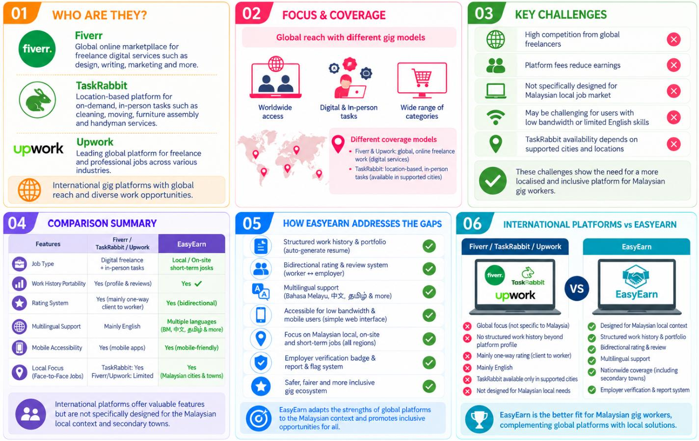

Figure 2.18: EasyEarn Conceptual Framework

The conceptual framework shows that EasyEarn's features are developed based on the academic and empirical evidence reviewed in this chapter. The features relate to particular gap in the literature, and the expected outcomes relate to TAM and trust-related factors. This framework will also be used as a framework to assess the system and the user response during the later phase of the project.

## 2.8 Conclusion

This chapter has created an extensive academic and technical background for EasyEarn in a multi-layered literature review. In order to analyse user acceptance, perceived usefulness, perceived ease of use and trust in the EasyEarn platform, this study adopts a theoretical framework based on the Technology Acceptance Model (TAM) (Davis, 1989) and its trust-based extension, the Trust-Based Technology Acceptance Model (TB-TAM) (Gefen et al., 2003).

The empirical review compiled data from government reports, international organisation research and peer reviewed academic research to provide evidence for each of six problem dimensions faced by EasyEarn: geographic exclusion (MDEC, 2023), employment fraud (MCMC, 2023), lack of a verifiable work identity (Graham et al., 2017), language barriers (UNCDF, 2019), underserved flexible worker demographics (Abd Samad et al., 2023), and inefficient SME recruitment (Kalai Vani and Foo, 2024). The results show that the issues of gig workers and Malaysian SMEs are deeply interwoven, and that isolated solutions cannot resolve the issues.

The technical and practical foundation of EasyEarn was further defined with the review of appropriate technologies in Section 2.4, the selected tools and platforms in Section 2.5 and similar systems in Section 2.6. This technology stack was chosen after evaluating it against the alternatives and finding it suitable for the scope of the project. The comparative feature analysis in Table 2.3 showed that none of the selected platforms fulfils all eleven feature dimensions identified for EasyEarn's target users.

The research gap identified in Section 2.6.5 shows that although these problems have been discussed in previous studies, they are usually examined separately rather than as a whole within the Malaysian gig employment context. In addition, the platforms reviewed in this study do not address all six problem dimensions within a single system. The theoretical and empirical findings are then brought together in the Conceptual Framework in Section 2.7, which links each problem dimension to an EasyEarn design response and its expected TAM- and trust-related outcome.

To conclude, this chapter demonstrates that EasyEarn is not just a software development project but a solution that has been created due to theoretical and empirical observations of the identified gaps in the gig economy in Malaysia. The results of this literature review form the framework for the research methodology, system design, implementation, testing and discussion in the subsequent chapters.
