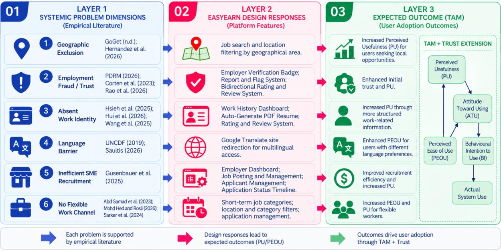

# Chapter 2: Literature Review

## 2.1 Introduction

The gig economy is growing rapidly in Malaysia, yet a structured, reliable and participatory digital labour platform is needed that can benefit not only the dominant big cities, but also the underserved secondary towns and rural parts of Malaysia. This cha pter is a complete and critical review of the academic and technical literature that guides the design, development, and evaluation of EasyEarn: a web-based job-matching portal for short-term, part-time and freelance work within Malaysia. The review is organised into seven main sections. The theoretical underpinning of the design of EasyEarn's features and the expected adoption by users is based on the TAM [26], as discussed in Section 2.2. The empirical review of the research in Section 2.3 examined research on the gig economy in Malaysia, employment fraud, verifiable work history, language barriers, flexible demographics and SME recruitment challenges. The technologies that will be used to realise EasyEarn are discussed in Section 2.4, and the platform and tools that have been selected are discussed in Section 2.5. It is analysed, and similar systems and their limitations are discussed in Section 2.6, and the research gap is identified in Section 2.6.5. Based on the theoretical and empirical results, and the identified research gap, a conceptual framework is presented in Section 2.7. The chapter ends in Section 2.8. The literature reviewed in this chapter covers six problem dimensions related to EasyEarn: geographic exclusion, employment fraud and trust, the absence of structured work history, inefficient SME recruitment, limited flexible work channels and language barriers. In addition, Section 2.6 reviews similar systems and how these systems address th ese areas. In the platforms and features reviewed in this study, no platform was found that integrated all of the above in one platform suitable for the context in Malaysia. EasyEarn is thus suggested as an integrated web-based solution to fill the gap. Figure 2.1 shows the structure of Chapter 2, which covers the theoretical foundation, empirical review, technologies, selected platforms and tools, similar systems, research gap, conceptual framework, and chapter summary. It also emphasises the six dimensions of the problem highlighted in the literature: geographic exclusion, employment fraud and trust, absence of structured work history, inefficient SME recruitment, lack of flexible work channels, and language barriers.

Figure 2.1: Literature Review Overview of EasyEarn

## 2.2 Theoretical Framework

A theoretical framework is the conceptual underpinning for the design decisions that are made for a research project, and the outcomes of the research project are evaluated [27]. For a technology development project like EasyEarn, the theoretical part should explain why users accept or reject a digital platform and how design decisions can be taken to maximise the adoption and usability of a digital platform. This section introdu ces the TAM as the main theoretical model, discusses its applicability and limitations in the gig economy context and elucidates its use across the design of EasyEarn.

### 2.2.1 The Technology Acceptance Model (TAM)

The TAM was first presented by Davis [26] as a model to explain and predict the use of the Information System by users. The model used in this study is the most recent revision of the original TAM [26], which adds and removes other factors from the original model but keeps the same two constructs of Perceived Usefulness (PU) and Perceived Ease of Use (PEOU) throughout the study. TAM has been developed from the Theory of Reasoned Action (TRA) developed by Ajzen and Fishbein [28], which states that people's behaviour is first influenced by their behavioural intention, and this behavioural intention is influenced by their attitude and subjective norm. In the context of information technology adoption, Davis [26] modified the TRA, which has two major factors for user acceptance:

- PU: the extent to which an individual thinks that the use of a specific system would be
useful in accomplishing a task or attaining a goal.

- PEOU: the ease of use a person thinks a system will be to use.
The original TAM model proposed by Davis [26] is shown in Figure 2.2, where the two major determinants are shown to lead to attitude and behavioural intention, which in turn lead to the use of the system. All platform features are designed to enhance perceptions of usefulness and/or ease of use for the intended user group, and this pathway lies at the heart of all feature design decisions for EasyEarn.

Figure 2.2: The Original Technology Acceptance Model (TAM)

As shown in Figure 2.2, PEOU also has a direct influence on PU, with ease of use being a determinant of a user's sense of usefulness of a system [26]. Other external factors, such as system design characteristics, training and experience, also play a role in both constructs. Davis [26] found that both PU and PE OU had an impact on a user's attitude toward using a system, which in turn had an impact on a user's Behavioural Intention to Use (BIU), which ultimately had an impact on a user's system use. Venkatesh and Davis [29] expanded the original model to include additional factors that can impact PU, namely social influence and cognitive instrumental processes, to further enhance the model's predictive power of enterprise system adoption. Another framework is the Unified Theory of Acceptance and Use of Technology (UTAUT) [30], which is a consolidated theory of 12 models, including TAM, but TAM continues to be the most frequently used because of its parsimony and empirical rigour [31]. The current studies on the digital platform continue to employ the TAM approach, demonstrating its applicability in the context of digital transformation (DT) [32], [33]. In digitalisation studies, PU and PEOU are the two most important predictors for technology adoption. Platform-based services have also been studied to determine their suitability for the study of online service adoption, as done by Troise et al. (202 1), which additionally tested platform-based services and confirmed their applicability for the study of online service adoption, thus making them suitable as a theoretical framework for EasyEarn. TAM is well tested in various technology settings, such as online employment sites, online e-commerce applications and mobile applications. Pavlou [34] used TAM in the context of e-commerce and found that nearly 60 per cent of the variance in users' intentions to make transactions on the Internet could be accounted for by trust, PU and PEOU. However, in the context of the gig platforms, ease of registration and the interpretability of job posting interfaces were the most important PEOU determinants of gig worker platform adoption, whereas income transparency and employer verification were the most significant PU determinants [35]. These findings guide the application of TAM to EasyEarn in the next section.

### 2.2.2 Application of TAM to EasyEarn

EasyEarn has three user roles: Job Seeker, Employer and Admin. However, the application of TAM in this section focuses mainly on the two primary end-user groups, Job Seekers and Employers, because they directly use the platform for job searching and recruitment activities. For job seekers, PU is delivered through functionality that directly affects their job search: location-based job searches save them time deciding where they can find jobs that are relevant to them; the Work History Dashboard and Auto-Generate Resume provide a way for job seekers to create and display a professional, verifiable record; and the bi-directional Rating and Review System helps job seekers show their reliability to potential employers. The inability to establish a portable professional identity and the lack of trust mechanisms through informal means are two of the major structural barriers identified by Graham et al. [12] and Corten et al. [10], respectively, which are directly targeted in these features. PEOU for job seekers is realised through the mobile-responsive web design of the platform, which ensures that it is accessible to non-English-speaking users through Google Translate Website Redirection, and the rule-based chatbot, which allows for guidance on navigating the platform 24/7 [15]. For employers, PU is supported by the centralised job posting and applicant management functions, which allow recruitment activities to be managed within one platform. The Employer Verification Badge helps Job Seekers identify employers whose verification has been approved, while the Report and Flag System provides users with a structured channel to report suspicious accounts, job listings or other concerns. PEOU for employers is supported through the CRUD-enabled job posting interface, Application Status Timeline and consistent platform navigation.

**Table 2.1: TAM Application to EasyEarn Features by User Group**

Feature User Group PU PEOU Location-Based Job Search Job Seeker Helps users narrow job opportunities by location Easy-to-use filter interface; mobile-friendly design Work History Dashboard Job Seeker Constructs a credible professional identity [12] Records jobs that have been completed and auto-populates the chart (visualisation) Auto-Generate Resume Job Seeker Produces a downloadable PDF for job applications Generates the PDF from stored profile and work history data using jsPDF. Bidirectional Rating System Both Provides reputation information that can support trust between users [10] A simple 1 -5 star interface and an optional written review Employer Verification Badge Employer Raising the level of confidence of the applicant and the quality of the application The badge is displayed on the profile, and it is automatically added by the admin CRUD Job Posting Dashboard Employer Centralises all aspects of the recruitment process Structured form that has an expiry date with category selection Google Translate Website Redirection Both Overcomes language barriers for non-English speakers [15] Redirects users to Google Translate to access translated versions of the EasyEarn page. Rule-Based Chatbot Both Automated support and Frequently Asked Questions (FAQ) help 24/7 Conversational interface; no registration required to use EasyEarn's features are shown in Figure 2.3 to either address PU or PEOU for both Job Seekers and Employers.

Figure 2.3: Application of TAM

### 2.2.3 Limitations of TAM and Supplementary Considerations

TAM is a comprehensive and empirically proven model for predicting technology adoption, but some scholars have pointed to its limitations in gig platforms. However, Bagozzi [36] noted that the TAM model is a simplified approach to understanding human adoption of technology because it fails to account for social and emotional factors, which play important roles in technology adoption, especially when there is a high level of trust, a high level of perceived risk, and the presence of strong norms. Gefen et al. [37]. In the context of online shopping, demonstrated that trust can be integrated with TAM to help explain users' acceptance of online systems alongside PU and PEOU. To address this limitation, EasyEarn supplements the TAM framework with trust-related considerations adapted from Gefen et al. [37]. In EasyEarn, trust is considered alongside PU and PEOU through features such as the Employer Verification Badge, Report and Flag System, and Bidirectional Rating and Review System. These features are intended to provide users with clearer trust and reputation information when interacting on the pla tform. In this way, trust-related factors are incorporated into the theoretical framework used to guide the design of EasyEarn [34], [37]. Figure 2.4 illustrates how trust-related considerations are incorporated alongside PU and PEOU in the theoretical framework used for EasyEarn.

Figure 2.4: Limitations of TAM and Supplementary Considerations

## 2.3 Empirical Review

This section summarises empirical studies which are pertinent to the six problems outlined in

# Chapter 1 of this study . The empirical review brings together work from academic studies,

government reports and research from international organisations to build up an evidence base which underpinned EasyEarn's design.

### 2.3.1 The Gig Economy in Malaysia

The gig economy has been growing in significance over the past few years, offering non-traditional and flexible employment opportunities to workers. According to the World Bank [1], there are over 545 online labour platforms, with an estimated 154 million to 435 million workers engaged in online gig work globally. Recent literature also highlights a range of socioeconomic issues, such as access to employment, gig-worker protection a nd differences among categories of gig workers. A systematic literature review and bibliometric analysis of 510 gig-economy studies conducted by Hu [38] identified these areas as important themes in current gig-economy research. Gig work has grown in Malaysia as digital platforms have gained traction and individuals increasingly seek alternative sources of income. Abd Samad et al. [3] identified flexibility and supplementary income as important motivations for gig-economy participation, alongside relatively low barriers to participation. More recent research by Mohd Hed and Rosli [4] also found that flexibility, autonomy, financial factors, inclusivity and skill diversification influence Malaysian youths' participation in the gig economy. According to Malay Mail [5], citing MDEC's internal analysis, Malaysia's gig economy market size reached approximately RM1.33 billion in Q3 2023, equivalent to about 80% of the RM1.63 billion recorded for the whole of 2022. More than 100,000 new individuals were participating in and earning income through gig-economy platforms as of Q3 2023, while more than 140 gig-economy platforms had been validated by MDEC and the Ministry of Communications and Digital. Despite this growth, access to structured short-term work opportunities remains concentrated in certain areas. GoGet states that its workers are mainly available in Klang Valley, Penang, Negeri Sembilan and Johor Bahru [6]. This suggests that the availability of structured gig-work opportunities may vary geographically, particularly for users outside the platform's main service areas. Before the Gig Workers Act 2025 came into force, the legal status and protection of gig workers in Malaysia had been identified as an area requiring clearer legal recognition and protection [39]. The regulatory environment surrounding gig employment in Malaysia has also changed significantly. The Gig Workers Act 2025 (Act 872) establishes a formal legislative framework covering matters such as service agreements, gig workers' rights, social protect ion and dispute resolution [17]. The Act came into force on 31 March 2026 and was reported to provide legal safeguards for approximately 1.64 million individuals involved in Malaysia's gig economy [40]. The Ministry of Human Resources also identifies the legislation as the Gig Workers Act 2025 (Act 872), while its implementing regulations specify 31 March 2026 as the commencement date. These developments highlight the increasing significance of gig work in Malaysia and the need for more structured and accessible short-term employment opportunities. EasyEarn responds to this context by providing a web-based platform for short-term, part-time and freelance jobs, with particular attention to users who may have fewer structured gig opportunities in less-serviced areas. Figure 2.5 gives an overview of the gig economy in Malaysia, its development, the motivations for gig work and the ongoing need for greater access to structured employment opportunities.

Figure 2.5: Malaysia’s Gig Economy Landscape

### 2.3.2 Employment Fraud and the Risks of Informal Job-Seeking Channels

Fraud relating to employment has become a growing problem for people looking for a quick job on social media and messaging apps online. In 2025, the total number of job scam incidents reported to the Royal Malaysia Police [8] was 8,911 part-time job scam cases, an increase of 144% from 2024, resulting in RM222 million in losses. Some of the common tricks were high-paying jobs for simple tasks, asking for advance payments or fund transfers via WhatsApp, Telegram, and other apps. Social media is a popular way to search for jobs, especially for individuals looking for work online. Randstad Malaysia [7] reported that 47% of respondents who intended to switch jobs planned to use social media channels such as Facebook and WhatsApp. Randstad also advised employers to promote job openings through trusted channels, such as official company websites and reliable job search platforms, due to the risk of fraudulent digital job advertisements [7]. Trust and reputation mechanisms can help diminish uncertainty between workers and employers, and also work in favo ur of digital labour platforms. Corten et al. [10] carried out an experiment using 180 actual clients across five gig-economy platforms that revealed that reputation information had an impact on trust in workers. When ratings were connected to the same task, they were especially helpful, indicating that reputation information could provide a signal of credibility when users have a limited amount of pre-existing information about each other. Also, formal procedures for addressing and reviewing worker concerns are crucial in digital labour systems. The FareShare project was created by Rao et al. [41] to support the rideshare workers who have been impacted by the platform deactivation or loss of income. The 178 worker account sign-ups in a 3-month field deployment revealed the need for structured recourse processes and a need for trust, consent and accountability in high-stakes digital labour platforms. EasyEarn mitigates these trust and safety issues with the Employer Verification Badge, Report and Flag System, and Bidirectional Rating and Review System. The Employer Verification Badge adds another layer of credibility for Job Seekers before engaging with an Employer and the Report and Flag System enables suspicious job postings or Employers' activity to be reported to Admin for review. The Bidirectional Rating and Review System also allows Job Seekers and Employers to give feedback upon completion of the work, for further reputation data that can be used in future job decisions. The risks and necessary trust and safety mechanisms that are in place to mitigate these risks in EasyEarn are summarised in Figure 2.6.

Figure 2.6: Risks of Informal Gig Channels and Solutions

### 2.3.3 The Absence of Verifiable Work Histories for Gig Workers

One of the consistent problems with gig work is that it is difficult to have a structured, portable, and suitable means of showing workers their employment experience. In traditional work, employers often keep employment contracts, payslips, employer refer ences etc, whereas gig workers may have several short-term work engagements with different employers without building up a track record of their skills, performance and employment history. One of the challenges for platform workers in emerging economies that Graham et al. [12] noted was the lack of ability to construct a portable professional identity. Newer research also supports the benefits of workplace-based information in helping workers on non-traditional career trajectories. Hsieh et al. [42] conducted a seven-day field study with 16 active gig workers from three different platforms and work domains. The study revealed that the exchange of work-related information facilitated financial reflection, work planning and working together among employees. This suggests the potential for structured work data to improve gig workers' understanding and management of their working lives. Hui et al. [43] also reported that traditional credentials and work histories are more often preferred by employment platforms, which can make it challenging for people with informal and non-traditional work histories to showcase their assets to a potential employer. They emphasise the need for a person to be able to articulate "non-traditional" experiences in an employment setting and to recognise the transferable strengths of such experiences. This is especially true for gig workers who could be working for various short-term companies without combining their experience into one. This is also confirmed by recent empirical studies. Based on the data from the China General Social Survey (2015 -2021), Wang et al. [44] found that in the gig economy, labour-market outcomes become more dependent on the work experience of individuals, whereas their traditional education becomes less important. The research also highlights the continuing importance of work experience in gig-economy employment outcomes. Reputation data also plays a role in the job and platform transitions of workers. In an experiment with 180 real clients of five gig-economy platforms, Corten et al. [10] looked into the effects of worker ratings on online trust. The study also highlighted limitations in transferring reputation information across different platforms. To solve this problem, EasyEarn addresses it through the Work History Dashboard, Auto-Generate Resume, and Rating and Review System. The Work History Dashboard keeps track of completed jobs, earnings and ratings, while the Auto-Generate Resume feature converts the recorded work history into a downloadable PDF resume. The Rating and Review System also includes reputation data linked to completed work, enabling Job Seekers to gradually build a more structured digital employment profile. The structural problem of lack of verifiable work histories with gig workers and the economic consequences of this lack are summarised in Figure 2.7.

Figure 2.7: The Absence of Verifiable Work Histories of Gig Workers

### 2.3.4 Language Barriers and Digital Exclusion in Malaysian Gig Platforms

The accessibility of language is one of the critical factors to take note of in digital employment platforms, especially in a multilingual nation like Malaysia. Users in Malaysia may have different levels of proficiency in Bahasa Melayu, English, Mandarin and Tamil, which can affect their understanding of job information and use of digital services. United Nations Capital Development Fund (UNCDF) [15] highlighted the importance of local-language accessibility for low-and middle-income users of digital platforms. This is especially true of employment platforms, as language barriers can limit the understanding of the job requirements, instructions for the platform and job-related information. Further research in Malaysia shows the significance of inclusive access to gig work, as published in more recent studies. Mohd Hed and Rosli [4] conducted a study on 385 gig economy youth participants in Malaysia and found that inclusion and technological access are factors affecting gig economy participation. According to their results, use of digital platforms is an important factor in the ability of Malaysian youth to access flexible jobs. The multi-lingual digital resources are also reinforced by the recent international evidence. Based on survey results from 4,217 respondents in 6 European countries, Saulītis [16] concluded that there was a high level of acceptance of web content in local language, as well as some differences between the various demographic and linguistic groups regarding their satisfaction with machine translation technologies. The study shows the usefulness of multilingual resources in creating digital accessibility and usability, especially for users who might not feel at ease using English-dominant online services. The results are applicable to EasyEarn as it caters to individuals with various linguistic backgrounds in Malaysia. EasyEarn addresses this issue through Google Translate website redirection, allowing users to access translated versions of the current page in languages such as Bahasa Melayu, Mandarin and Tamil. Machine translation is not an alternative to fully localised content but another tool to make the platform available to users who are interested in using it in another language. This is shown in Figure 2.8, which presents the language access issues that have been discussed in the literature, and EasyEarn's multilingual approach to language support.

Figure 2.8: Language Accessibility

### 2.3.5 Flexible Work and Underserved Demographics

Short-term and flexible work can be a way to offer employment for people who may not be able to commit to a full-time job, such as university students, housewives or unemployed people. These groups may need special employment conditions that can be flexible to academic and family needs or changing personal situations. Abd Samad et al. [3] found flexibility and additional income to be significant motivations for gig work among the respondents in Malaysia. A more recent piece of Malaysian evidence confirms the significance of flexible employment for young people. Mohd Hed and Rosli [4] conducted a quantitative study on 385 youth gig workers in Kuala Lumpur and identified some factors that encouraged youth to engage in gig work, such as flexibility, autonomy, inclusivity, technological advancement and skill diversification. Their study reveals that the decision to take on gig work is not simply about economic constraints but also about flexibility and avenues for personal and professional growth. Uchiyama and Furuoka [45] examined 85 young app-based gig workers across 11 Malaysian states through semi-structured interviews. The study found that young gig workers flexibly combined employment and self-employment while facing regulatory ambiguity and unclear labour status. This further shows the changing role of gig work in youth employment in Malaysia. The experiences of other developing countries also show that flexible gig work can be particularly important for individuals with multiple responsibilities. Sarker et al. [46], in a quantitative survey of 443 gig workers in Bangladesh, found that work flexibility was an important motivation for participating in digital work, particularly among women. The study also found that work-life balance and income were positively associated with job satisfaction, while difficulties such as unstable networks and complicated payment systems reduced job satisfaction. International Labour Organisation ( ILO) [2] has previously linked digital labour platforms in Southeast Asia to key areas like rideshare and food delivery. These forms of platform work may not suit all users seeking flexible employment, particularly those who prefer non-transport-based short-term jobs. There are also temporary job openings for individuals looking for work in roles like event staffing, retail work, tutoring or administrative support. A more diverse short-term employment platform can thus offer other employment opportunities for individuals who have schedules and/or situations that are better suited to other forms of employment. EasyEarn tackles this need by offering part-time, freelance and short-term job postings in various job categories. Availability and preference filters help Job Seekers focus on jobs that align with their availability and preferences, and application management equ ips them with a structured application system to keep track of temporary job opportunities. The flexible employment needs of underserved groups and the ways in which short-term job platforms can contribute to broader gig work participation are shown in Figure 2.9.

Figure 2.9: Flexible Work and Underserved Demographics

### 2.3.6 Inefficient SME Recruitment and Short-Term Hiring Challenges

Short and temporary staffing requirements for SMEs may be challenging when businesses need to recruit workers for events, retail support and administrative tasks. Digital work platforms can provide small businesses with access to external labour and more flexible workforce arrangements [14]. New studies illustrate the benefits of digital work platforms for small companies that lack resources and capabilities. Gusenbauer et al. [14] interviewed 19 CEOs, founders, and managers of small and micro businesses in Austria and Germany qualitatively. The research revealed that the primary purpose businesses have for using digital work platforms like Upwork and Fiverr is to secure external resources and to rationalise spending. These platforms also reduced the cost and hassle of outsourcing by offering features that enabled trust and minimised extra coordination that would be needed to discover and handle outside workers. Additionally, Gusenbauer et al. [14] discovered that digital workers offer small businesses higher versatility in coping with momentary labour shortages and fluctuating workloads. Reputation information was also a key part of the selection process, as enterprises took into account price as well as previous ratings when assessing potential freelancers. The results show how a structured digital platform can help small businesses to have more efficient access to external labour, as well as information that helps workers evaluate themselves. The findings of the study by Gusenbauer et al. [14] apply to the issue of short-term employment in Malaysia, as digital outsourcing in Austria and Germany, when conducted by smaller companies, is a way to gain access to workers on a flexible basis. EasyEarn follows this principle in the local employment situation in Malaysia, where SMEs and individual employers can post job opportunities for a limited period of time and run the application process through a defined process on a platform. EasyEarn alleviates these recruitment problems with the following features: Employer Dashboard, Job Posting and Management functions, applicant management and the Application Status Timeline. Employers can post and track short-term job opportunities and profile the applicants in one system. The Work History Dashboard and Rating and Review System also give employers extra details on Job Seekers' past work and reputation in helping to screen applicants. The challenges to recruitment in the short term for SMEs and the structured recruitment process provided by EasyEarn are summarised in Figure 2.10.

Figure 2.10: Inefficient SME Recruitment and Short-Term Hiring Challenges

### 2.3.7 Synthesis of Empirical Evidence

The empirical literature that has been covered in Sections 2.3.1 -2.3.6 covers various aspects of gig work and digital employment. Table 2.2 brings together six recent studies in order to identify common findings and limitations in the literature in relatio n to the research context, main contribution, relevance to EasyEarn and remaining limitations. The comparison helps to detect recurrent deficiencies and serves as a basis for the system design for EasyEarn.

**Table 2.2: Synthesis of Empirical Evidence**

Paper Focus / Context Key Contribution Relevance to EasyEarn Limitation / Weak Point Mohd Hed & Rosli [4] 385 Youth were employed as gig workers in Kuala Lumpur, Malaysia. Determined flexibility, autonomy, inclusivity, technology and skill diversification as reasons for gig participation. Enables flexible short-term employment for Malaysian users. Focuses on Kuala Lumpur youth rather than users in secondary towns and does not examine an integrated job platform. Hsieh et al. [42] 16 gig workers across three platforms/work domains. Work-data sharing was structured, which facilitated financial reflection, planning and mutual support. Implements a Work History Dashboard and/or structured work history records. Lacks ability to match local jobs, verify with employers and provide multilingual access. Corten et al. [10] 180 clients of five gig platforms. Showed how ratings can contribute to online trust and explored some of the barriers to the transfer of reputation. Implements a rating and Review System and reputation records. Focuses mainly on reputation and trust rather than employer verification, reporting or local job access. Gusenbauer et al. [14] 19 executives from small/micro enterprises in Digital work platforms enhanced access to resources, cost optimisation, Supports structured access to external labour for small enterprises. Not local, short-term recruitment-focused, and not Malaysia-specific. Austria and Germany. trust and flexibility for small enterprises. Saulītis [16] Multilingual users of digital resources from six European countries Analysed multilingual resources, the usage and satisfaction of machine translation. Facilitates multilingual accessibility and EasyEarn's Google Translate method. Not specific to employment platforms or the Malaysian population. Hernandez et al. [47] 25 U.S.-based gig drivers in rideshare and delivery work. Highlighted how gig workers adapt their work practices to local geographic, market and infrastructural conditions. Supports the importance of considering local context in platform design. Concentrates on U.S. rideshare and delivery workers, instead of job matching in secondary towns in Malaysia. The synthesis reveals that the current research focuses on key issues surrounding gig work, such as flexibility, data related to gig work, reputation, opportunities for small businesses, multilingualism and local context. Most of these issues, however, are studied individually and not via a single integrated digital employment platform. Within the literature and systems reviewed in this study, no single platform was identified that combines local short-term job access, employer trust mechanisms, structured work history, multilingual accessibility and SME recruitment support for secondary-town users in Malaysia. This shows a gap in the existing research and systems, which EasyEarn aims to address by combining these functions in one web-based job-matching platform.

## 2.4 Review of Relevant Technologies

In this section, the basic front-end and client-side technologies that comprise the technical backbone of EasyEarn are discussed. Each technology is compared to academic literature and to believable alternatives to select them in the context of a solo-developer academic project.

### 2.4.1 Web-Based Application Development

HTML5, CSS3 and JavaScript are the backbone of today's Web application development. Mozilla Developer Network (MDN) Web Docs [48] explain that HTML5 offers the semantic structure, CSS3 offers the presentation, and JavaScript offers the interactivity of the content, without requiring anything on the server side. This is because the choice of the technology stack for software developm ent needs to be based on several criteria: ease of maintenance, developer familiarity, ease of deployment, and technology suitability in the context of EasyEarn's academic domain, which this combination achieves. In comparison to modern front-end frameworks like React, Angular, and Vue.js, plain JavaScript has fewer layers of dependency, is less complex with build tools and offers a clearer code structure, which is more suitable for a student-driven academic projec t that will be evaluated and moderated [48]. For a single-developer project deployed through GitHub Pages, frameworks such as React may introduce additional dependencies and build-process complexity that are not necessary for the current project scope. EasyEarn's feature set and ease of maintenance will thus be a compromise between HTML, CSS, and JavaScript, with the latter being prioritised due to the academic nature of the project and the limited resources of the sole developer. With responsive web design, using CSS3 media queries and a flexible grid, EasyEarn will be accessible through both desktop and mobile browsers without requiring a native application. This is important because EasyEarn is intended to remain usable across di fferent screen sizes and device types. Figure 2.11 shows the rationale behind the web-based technology stack that EasyEarn has: a contrast between using JavaScript and using modern web frameworks, as well as deployment benefits.

Figure 2.11: Web-Based Application Development

### 2.4.2 Client-Side PDF Generation via jsPDF

The jsPDF library is a free JavaScript library that creates PDF files directly in the browser, instead of having to process the files on the server or make extra API calls [49]. EasyEarn's Auto-Generate Resume feature uses jsPDF to create a downloadable PDF resume directly from the Job Seeker's stored profile and work history data. While server-side solutions such as wkhtmltopdf, Puppeteer and Python's ReportLab provide better typographic control and support for complex layouts, they require a dedicated backend process, which is not available in EasyEarn's GitHub Pages deployment [50]. The advantages of using jsPDF are that it runs entirely within the browser, can be used alongside the Supabase JavaScript Client Library, and does not require additional server infrastructure, making it suitable for the current project scope [49]. In Figure 2.12, the client-side approach for creating a PDF is illustrated with the help of the jsPDF library and is contrasted with server-side approaches.

Figure 2.12: Client-Side PDF Generation

### 2.4.3 Data Visualisation via Chart.js

Chart.js is an open-source JavaScript charting library that creates interactive and responsive data visualisations using the HTML5 canvas element [51]. EasyEarn uses Chart.js to present the completed jobs count, along with their total earnings and distribution by job type in the Work History Dashboard, and to provide platform-wide totals of registered users, completed jobs, active job postings, applications submitted and successful job matches in the Admin Analytics Dashboard. Google Charts is typically loaded from Google's servers, while Chart.js can also be hosted locally within the project. Chart.js integrates directly with JavaScript data arrays and supports responsive charts, making it suitable for EasyEarn's deployment and current project requirements. The data visualisation approach is illustrated in Figure 2.13, together with other alternatives considered for the project.

Figure 2.13: Data Visualisation

### 2.4.4 Multilingual Accessibility: Google Translate Website Redirection

UNCDF [15] emphasises that multilingual accessibility is one of the key factors in enhancing the digital inclusion of users with different language backgrounds in Malaysia. There are several options for enabling multilingual support in a web application: Using a native translation API like Google Cloud Translation, using pre-translated static content, or redirection to the Google Translate webpage. Google Cloud Translation provides automatic translation through an API and can be integrated into web applications [25]. However, this approach was not selected for EasyEarn because it involves usage-based costs and additional API integration requirements, which were outside the scope of the current academic prototype. DeepL [52] was also considered; however, the language coverage described in the reviewed source did not fully align with EasyEarn's intended multilingual requirements. For this reason, EasyEarn employs the website redirection mechanism of Google Translate [53], in which the current EasyEarn page is redirected to the Google website for translation. This approach avoids the need to integrate a native translation API while still providing users with access to translated versions of the current EasyEarn page. As shown in Figure 2.14, there are multiple ways of making web pages accessible to people with multiple languages that were considered for EasyEarn, and Google Translate website redirection was chosen for the current system.

Figure 2.14: Multilingual Accessibility

## 2.5 Review of Selected Tools and Platforms

This section summarises the services, hosting platform and development tools used for EasyEarn and assesses them both academically and technically. Figure 2.1 5 presents an overview of the tools and platforms that were selected for EasyEarn, including the Supabase relational database features and their comparison with Firebase, the GitHub Pages workflow for static hosting, and the Canva wireframing method based on Nielsen's heuristics for usability.

Figure 2.15: Review of Selected Tools and Platforms

### 2.5.1 Supabase: Open-Source BaaS

BaaS is a cloud service model in which backend infrastructure, such as database management, authentication and API provision, is provided through a managed third-party service [18]. Developers do not need to configure and maintain a dedicated server, but instead work with the backend utilising a pre-built API client, which removes a lot of the overhead of infrastructure administration. For EasyEarn, this model reduces the need to configure and maintain a dedicated application server, making it suitable for the scope and resources of a single-developer academic project. Supabase is an open-source BaaS platform that includes a relational database, token-based authentication through JSON Web Tokens (JWT), real-time capabilities, a JavaScript client library and Row Level Security (RLS) policies [18]. It is touted to be an open-source alternative to Firebase, Google's proprietary BaaS. The most notable difference between Supabase and Firebase is the models of their databases. Firebase stores data in Firestore, a NoSQL document-oriented database that is optimised for hierarchical and schema-flexible data. Supabase is based on PostgreSQL, a full-featured relational database that supports foreign key constraints, JOINs, and declarative schema design [18]. EasyEarn's data model contains relational relationships among users, job postings, applications, ratings, and work history records, and it is a more natural data model to be expressed in a relational schema. EasyEarn's requirement for role-based access is also important to note and is well-suited to Supabase's RLS policies. One of the great features of RLS is that it supports access control policies at the database level, meaning that job seekers can only view their own application data and employers can only update their own jobs, without having to implement e xtra middleware logic [18]. These RLS policies provide database-level access control and help restrict access to records based on user roles and ownership. This supports EasyEarn's approach to protecting user data, although it does not constitute formal compliance certification under Malaysian legislation.

### 2.5.2 GitHub Pages: Static Site Hosting

GitHub Pages is a static website-hosting service that can publish a website directly from a GitHub repository using HTTPS [50]. Other hosting alternatives include Netlify, Vercel and Firebase Hosting. Since EasyEarn uses a static HTML, CSS and JavaScript frontend that communicates with Supabase as its backend service, GitHub Pages provides the hosting functions required for the current project scope. GitHub Pages was selected because it integrates with the project's GitHub repository, supports HTTPS and allows the static EasyEarn frontend to be deployed without maintaining a dedicated application server [50]. It also fits the project's existing version-control and iterative development workflow.

### 2.5.3 Canva: User Interface (UI)/ User Experience (UX) Wireframing and Prototyping

Canva is used to create wireframes and prototypes for EasyEarn. Canva allows for easy visualisation of dashboards and user flow diagrams before HTML implementation; it is capable of drag-and-drop interface design and template-based layout creation, making it well-suited for visualisation of role-based dashboards and user flow diagrams before HTML implementation [54]. The EasyEarn wireframes were designed with reference to Nielsen's [55] usability heuristics, including visibility of system status, error prevention, user control and freedom, and consistency and standards. These principles influenced features such as the Application Status Timeline, Chatbot interface and role-based navigation.

## 2.6 Review of Similar Systems

Existing job-matching platforms are analysed across three categories: full-time job portals, domestic task-based gig platforms and international gig platforms to be considered as comparators to EasyEarn. The analysis is aggregated and presented in a comparative feature gap table.

### 2.6.1 Full-Time Employment Portals: JobStreet and RiceBowl

JobStreet and RiceBowl are online recruitment and job search websites established in Malaysia and offer structured job search and recruitment services. Both platforms allow for job postings, employer/company profiles, job applications, and resume/profile information. Although they are commonly used for full-time employment, part-time job opportunities are also available on these platforms [56], [57]. Select trust and safety features on both platforms as well. JobStreet includes a system which enables users to report suspicious job advertisements, employer account verification, company reviews, and job advertisement reviews [58], [59]. RiceBowl also claims to be an interface between job seekers and employers who have been verified, with information about safety that is relevant to job posts, such as reporting suspicious job ads [57], [60]. The difference is that JobStreet and RiceBowl aren't the only two places that don't have any part-time jobs. On the contrary, EasyEarn is distinct as it is created for quick, adaptable work workflows. These include completed work history, auto-generated resumes from work history, location filtering, category filtering, tracking work applications and integrated trust for Job Seekers and Employers. The differences that were considered in this study are summarised in Figure 2.16.

Figure 2.16: Full-Time Employment Portals

### 2.6.2 Task-Based Gig Platforms: GoGet and Troopers

GoGet and TROOPERS are two gig-work platforms in Malaysia offering flexible and short-term employment opportunities. GoGet supports part-time, contract and on-demand work and employs a verification system to ensure that GoGetters work. It also includes function-related evaluations and in-app messaging among users [6]. TROOPERS offers flexible and part-time employment opportunities via its mobile platform with verified employment opportunities, identity verification of gig workers, and location-based job searching [61]. Several functions are therefore already available on both platforms that help to create trust and flexible work options. Their ways, however, are distinct from EasyEarn. The part-timer availability is largely centred on the Klang Valley, Penang, Negeri Sembilan and Johor, while the number of jobs available on TROOPERS fluctuates depending on the clients, locations and job demand. Hence, it is untrue to say that either platform lacks in off-centre urban areas. Rather, EasyEarn is created to enable job seekers and employers to search and post short-term jobs categorised by city and region in Malaysia, including the secondary towns covered in this study. Based on the publicly available features reviewed, GoGet and TROOPERS provide their own verification, job-management and worker-support mechanisms. EasyEarn is unique because it integrates an Employer Verification Badge with a Report and Flag workflow, post-completion Bidirectional Rating and Review system, a structured Work History Dashboard and multilingual access into the academic job-matching process. These differences are summarised below in Figure 2.17.

Figure 2.17: Task-Based Gig Platform

### 2.6.3 International Gig Platforms: Fiverr, TaskRabbit, and Upwork

Examples of international gig and freelance work are provided by Fiverr, TaskRabbit and Upwork. Essentially, Fiverr is a digital service platform where freelancers can post their services and service packages on their profiles, while clients can check ratings before booking a service [62]. Upwork provides global access to clients and freelancers via profiles, job postings, proposals, contracts, reviews and platform-managed payments [63], [64]. Unlike these online freelance sites, TaskRabbit makes it possible to get in-person services like cleaning, moving, furniture assembly, and errands [65], [66]. These platforms offer structured ways to connect workers with clients, track work and establish a reputation on the platform. But in terms of their model, they're different from the model that EasyEarn is looking for. Fiverr and Upwork are primarily freelance services marketplaces, whereas TaskRabbit relies on the availability of Taskers in the supported areas of service [62], [63], [64]. As an example, geographic availability is a critical component in local platform work, as TaskRabbit users choose Taskers based on location, availability, price and task category [67]. EasyEarn is made for fast time-period job matches in Malaysia and is enhanced with employment based mostly in cities and regions, Employer Verification, Report and Flag capabilities, Bidirectional Rating and Review, a structured Work History Dashboard, and Auto-Generate Resume, with multilingual reports and access to be had. Rather, the aim is not to copy the international platforms, but to transfer appropriate ideas from the digital labour platforms to the local situation that is being tackled in this study. This is summarised in Figure 2.18.

Figure 2.18: International Gig Platform

### 2.6.4 Comparison Feature Gap Analysis

Table 2.3 shows a comparison of EasyEarn to four selected employment and gig-work platforms in Malaysia, namely JobStreet, RiceBowl, GoGet and TROOPERS across 11 feature dimensions relevant to the identified needs in this study. Yes, No and Partial are used to indicate whether a feature was found in a public release of the platform under the same name, a similar name, or if the feature was not found at all.

**Table 2.3: Feature Comparison of Job Platforms and EasyEarn**

Feature JobStreet RiceBowl GoGet Troopers EasyEarn Short-term / Gig Work Support Partial Partial Yes Yes Yes Geographic coverage is beyond major cities. Yes Yes Partial Partial Yes Verifiable Work History Profile No No Partial Partial Yes Auto-Generated PDF Resume No No No No Yes Bidirectional Rating and Review Partial Partial Partial Partial Yes Multilingual Support Partial Yes No No Yes Employer Trust Verification Badge Yes Yes Partial Partial Yes Report and Flag System Yes Yes Yes Partial Yes Rule-Based Chatbot Support No No No No Yes Offline Payment Guidance No No Partial No Yes Gig Workers Act 2025 Awareness / Design Consideration No No Yes Yes Yes Note: The following comparison is based on the platform features that are publicly available and were identified during the period of the project review in April 2026. Not included: Features added from April 2026 onwards. Yes, Partial and No represent a complete, partial or no match to the assessed feature dimension. Table 2.3 illustrates that the chosen platforms already offered various mixes of employment and trust/gig-work roles during the period of the review. Structured recruitment and part-time work were supported by JobStreet and RiceBowl, and flexible and gig work was supported more directly by GoGet and TROOPERS. The platforms reviewed, however, have done so in various ways and none of the selected platforms brought together all 11 feature dimensions measured in this study into one system. EasyEarn aims to combine the 11 feature dimensions considered in this study within one academic job-matching platform: short-term job support, geographic access, structured work history, auto-generated PDF resumes, bidirectional ratings and reviews, multilingual support, employer verification, reporting and flagging, rule-based chatbot support, offline payment guidance, and awareness of the Gig Workers Act 2025.

### 2.6.5 Research Gap

There are three categories of platforms that review existing job-matching and gig-work platforms, namely Malaysian employment portals, Malaysian task-based gig platforms, and international gig platforms. JobStreet and RiceBowl are considered structured employment websites, GoGet and TROOPERS as gig-work sites in Malaysia, and Fiverr, TaskRabbit and Upwork as international digital labour platforms. The emphasis of the review is on the functionality, models, and applicability to the requirements outlined for the EasyEarn project. Section 2.6.4 presents a comparative feature gap analysis of the selected Malaysian platforms with the EasyEarn platform. This same disparity can be seen in the comparison of currently available systems as shown in Table 2.3. JobStreet and RiceBowl make for traditional jobs; GoGet and Troopers offer more for gig and short-term jobs. Structured digital labour markets are also possible on international platforms like Fiverr, TaskRabbit and Upwork. In this study, however, we have compared features and have only found those that were relevant to the requirements we identified with EasyEarn. Within the platforms and features reviewed in this study, no single platform was identified that combined wider local job access, employer verification, formal reporting, bidirectional ratings and reviews, structured work history, multilingual accessibility and short-term recruitment support for SMEs in one system designed for the Malaysian context. Hence, an integrated short-term job-matching platform to meet the needs of both the Job Seekers and the Employers is still under research and development, especially for those who are in the secondary towns in Malaysia. With this in mind, EasyEarn is designed to fill this gap by providing a single web-based platform that offers location-based job search, employer verification, reporting and rating, a structured digital work history, resume generation, and multilingual accessibility, short-term jobs and applicant management. This identified gap forms the basis for the design of the system, which is also represented in the Conceptual Framework in Section 2.7.

## 2.7 Conceptual Framework

A conceptual framework is developed based on the theoretical framework in Section 2.2, the empirical evidence reviewed in Section 2.3 and the research gap identified in Section 2.6.5. The framework combines TAM [26], [68] with trust-related factors from the Trust-Based Technology Acceptance Model (TBTAM) [37] to show how the EasyEarn features respond to the identified problems. There are three layers in the conceptual framework. The first layer shows the six problem dimensions identified from the literature. The second layer shows the EasyEarn design responses linked to each problem. The third layer shows the expected outcomes based on TAM and trust factors, including PU, PEOU and initial trust. Table 2.4 presents the relationship between the problem dimensions, literature basis, EasyEarn design responses and expected outcomes.

**Table 2.4: EasyEarn Conceptual Framework**

Problem Dimension Literature Basis EasyEarn Design Response Expected Outcome (TAM / Trust) Geographic Exclusion GoGet [6]; Hernandez et al. [47] Job search and location filtering by geographical area. Increased PU for users seeking local opportunities. Employment Fraud / Trust Royal Malaysia Police [8]; Corten et al. [10]; Rao et al. [41] Employer Verification Badge; Report and Flag System; Bidirectional Rating and Review System. Enhanced initial trust and PU. Absent Work Identity Hsieh et al. [42]; Hui et al. [43]; Wang et al. [44] Work History Dashboard; Auto-Generate PDF Resume; Rating and Review System. Increased PU through more structured work-related information. Language Barrier United Nations Capital Development Fund [15]; Saulītis [16] Google Translate site redirection for multilingual access. Enhanced PEOU for users with different language preferences. Inefficient SME Recruitment Gusenbauer et al. [14] Employer Dashboard; Job Posting and Management; Applicant Management; Application Status Timeline. Improved recruitment efficiency and increased PU. No Flexible Work Channel Abd Samad et al. [3]; Mohd Hed and Rosli [4]; Sarker et al. [46] Short-term job categories; location and category filters; application management. Increased PEOU and PU for flexible workers. Figure 2.1 9 illustrates the EasyEarn Conceptual Framework, which links the six problem dimensions identified from the literature to the corresponding EasyEarn design responses and the expected TAM-and trust-related outcomes.

Figure 2.19: EasyEarn Conceptual Framework

The conceptual framework shows that EasyEarn's features are developed based on the academic and empirical evidence reviewed in this chapter. The features relate to a particular gap in the literature, and the expected outcomes relate to TAM and trust-related factors. This framework also provides a basis for evaluating the system and discussing the findings in the later stages of the project.

## 2.8 Conclusion

The chapter laid the groundwork for EasyEarn in terms of theory, empirical and technical development. The study applies the TAM [26] and TBTAM [37] to explain user acceptance, PU, PEOU and trust in the platform. The 6 problem dimensions identified for EasyEarn were: geographic exclusion, employment fraud and trust, lack of structured work history, language barriers, limited flexible work opportunities and inefficient SME recruitment. Recent research has highlighte d the significance of local context [47], online reputation and trust (Corten et al., 2023; Rao et al., 2026), structured work-related data and work identity [42], [43], [44], multilingual accessibility [16], flexible gig participation [4], [46], and digital work platforms for small enterprises [14]. These studies show that the issues are generally examined individually rather than as part of one integrated employment platform. The technologies and development tools relevant to EasyEarn were also reviewed to provide a technical basis for the system. The comparison in Section 2.6 shows that the selected platforms reviewed during the project analysis period provided different combinations of the eleven feature dimensions considered in this study. However, within the platforms reviewed, no single platform was identified that combined all the dimensions in one system designed for EasyEarn's Malaysian context. The identified research gap in section 2.6.5 therefore reinforces the need for an integrated web-based platform with a combination of: local job access, employer verification, reporting and bidirectional ratings, structured work history, multilingual acces sibility and short-term support for recruitment. The problem dimensions in Section 2.7 are linked to the corresponding EasyEarn design responses and the expected TAM and trust-related outcomes. Overall, the literature reviewed in this chapter provides the basis for the research methodology, system design, implementation, testing and evaluation presented in the following chapters.
