# Chapter 3: Research Methodology

## 3.1 Introduction

The research and system development methods used in the development of the EasyEarn Job Matching Portal are described in this chapter. The research methodology encompasses the method of data collection and analysis of user requirements, such as research approach, research design, population and sampling, questionnaire design, data analysis, validity, reliability and research ethics. The results of the user requirement survey are also presented and used to support the identification and prioritisation of system requirements. The chapter then describes the Hybrid Agile-Waterfall methodology adopted in the 26 weeks of the Final Year Project to develop the project EasyEarn. Later sections will discuss the phases of the project as well as the sprints, tools and technologies used, planning and risk management, hardware and software needed, system design, and wireframes and the resulting UI. Figure 3.1 illustrates the overall research and system development methodology used for EasyEarn. It illustrates the process of gathering user requirements by studying user requirements collection, approach to research, research design, population & sampli ng, designing a questionnaire, analysis of data, validity, reliability and research ethics. It also provides a reflection of the development of the system using the Hybrid Agile-Waterfall methodology, including planning, sprints, tools, risk management, system design, wireframes and UI development.

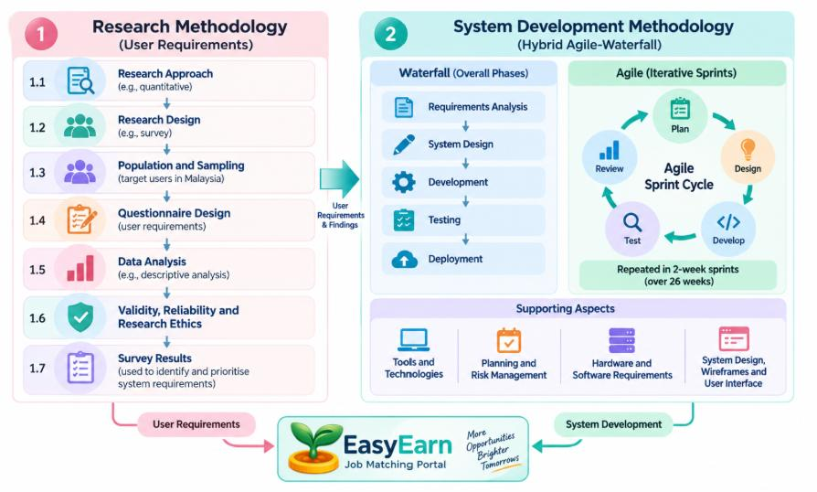

Figure 3.1: Research and System Development Methodology for EasyEarn

## 3.2 Research Methodology

This section outlines the research methodology used to identify and support the user requirements for the EasyEarn Job Matching Portal. It includes the research approach, research design, population and sampling, data collection method, research instrument, data analysis procedure, validity, reliability and research ethics. The results of the user requirements survey are also summarised to illustrate the contribution of the responses gathered in identifying and prioritising system requirements. The system development methodology used to develop EasyEarn is presented separately in Section 3.3.

### 3.2.1 Alignment of Research Questions with Methodology

The research questions introduced in Section 1.3 were derived from the research problems identified in Section 1.2 and aligned with the research objectives. This section explains how the research questions guide the selection of research methods, data coll ection and analysis procedures. Research questions help provide direction for the selection of research methods, data collection and analysis procedures [27], [69]. For reference, the four research questions are linked to the relevant project problems and objectives as follows: To ensure consistency throughout the research process, each research question is connected to the relevant research problems and research objectives.

- RQ1: What are the essential requirements for a web-based job-matching platform that
supports short-term, part-time and freelance employment between Job Seekers and Employers in Malaysia? This research question covers aspects of the lack of a specialist short-term labour platform, inefficient recruitment processes for employers and fewer platforms for flexible workers, which are associated with Problem 1, Problem 4 and Problem 5.

- RQ2: What safety and trust features should be incorporated into the platform to support
safer and more trustworthy interactions between Job Seekers and Employers? The Employer Verification Badge, Report and Flag System, and Bidirectional Rating and Review System were implemented to support Objective 2. These features help users identify verified Employers, report suspicious activities, and provide ratings and reviews after completed jobs.

- RQ3: How can a digital work history and auto-generated resume support gig workers
in documenting and presenting their completed work experience? This research question raises the issue of the lack of verifiable work history among gig workers, which is related to Problem 3.

- RQ4: What are the possible ways of making EasyEarn more accessible to those with
varying language preferences using multilingual access? This research question is related to Problem 6, which is about language barriers in existing platforms. The research questions determine the research approach, research participants, questionnaire items and data analysis procedures utilised in this study. The results from the user requirement survey are interpreted in relation to these research questions to help identify and prioritise user requirements for the development of the EasyEarn Job Matching Portal. The four research questions are summarised and are presented with their respective research problems in Figure 3.2.

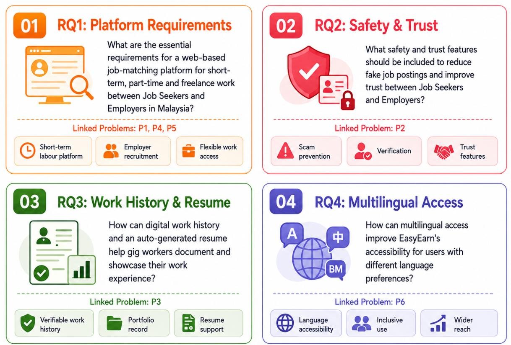

Figure 3.2: Alignment of Research Questions, Problems and Objectives

### 3.2.2 Research Approach

The research approach was selected to identify the needs and preferences of potential users before the main development of the EasyEarn Job Matching Portal. The study mainly adopts a quantitative approach, where UX, needs and feature preferences are collected through structured questions and summarised using numerical data [27]. This study also follows a positivist paradigm. A positivist paradigm assumes that research should be based on observable facts and measurable data rather than personal opinions [27]. Hence, data from the structured questionnaire were used, and the results were analysed using descriptive analysis to identify the user requirements of EasyEarn more objectively and systematically [27]. A deductive approach was used in which existing empirical findings, research problems and problem dimensions revealed in the second chapter were used to structure the questionnaire, rather than it being used as a primarily open-ended and exploratory questionnaire to discover new themes [27]. It was decided that this approach was appropriate as the study started with the existing problems and literature findings, and then gathered user responses to support the identification and prioritisation of EasyEarn requirements. For this study, the overall research approach is mainly quantitative to identify the needs of potential users of the EasyEarn Job Matching Portal. The questions used a structured online questionnaire and produced measurable responses regarding job search/hiring experiences and problems faced, language preferences and the importance of proposed EasyEarn features. The majority of the items on the questionnaire were closed-ended, such as multiple-choice questions, checkboxes, a 5-point scale and a multiple-choice grid. Frequencies, percentages, mean scores and rating distributions were used to summarise the responses. In addition, an open-ended question was added to give the respondents the chance to submit any other recommendations for the system. The quantitative approach was chosen because it helps the study uncover common needs of the users and the importance that they place on the proposed EasyEarn features [27]. The findings that were analysed were then used to support system requirement identification and prioritisation, such as location-based job search, safety and trust, work history, multilingual access, and short-term job management. The research method used in the research was positivist, deductive and quantitative data collection, descriptive analysis and system requirement identification, which is summarised in Figure 3.3.

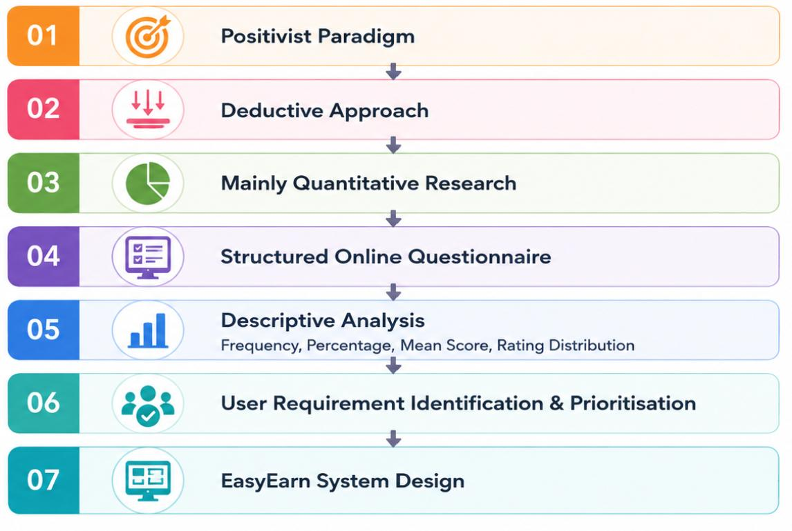

Figure 3.3: Research Approach Flow of the Study

### 3.2.3 Research Design

A cross-sectional descriptive survey was used in this study to gather user requirements for the EasyEarn Job Matching Portal [69]. The survey collected feedback from potential users over a defined period to obtain information about their experiences, concerns and preferences regarding short-term, part-time and freelance job searching and hiring. The cross-sectional study design was used because the study did not involve measuring changes over an extended timeframe, but rather it sought to obtain the current needs and preferences of potential users. A descriptive survey design was also appropriate in that the study a imed to summarise the experiences of users, the problems that they faced and the significance that they attached to the features that were proposed in the EasyEarn system [69]. This study was not an experimental study as there was no manipulation of variables and no attempt to test cause and effect relationships. Rather, the survey was used to describe the current needs and preferences of prospective Job Seekers and Employers. This design was thus felt to be appropriate for EasyEarn as it involved identifying and prioritising the user requirements in the study, instead of testing causal relationships between the variables. The research design for the EasyEarn study is shown in Figure 3.4 and is based on a cross-sectional descriptive survey, non-experimental approach to identify and prioritise user requirements.

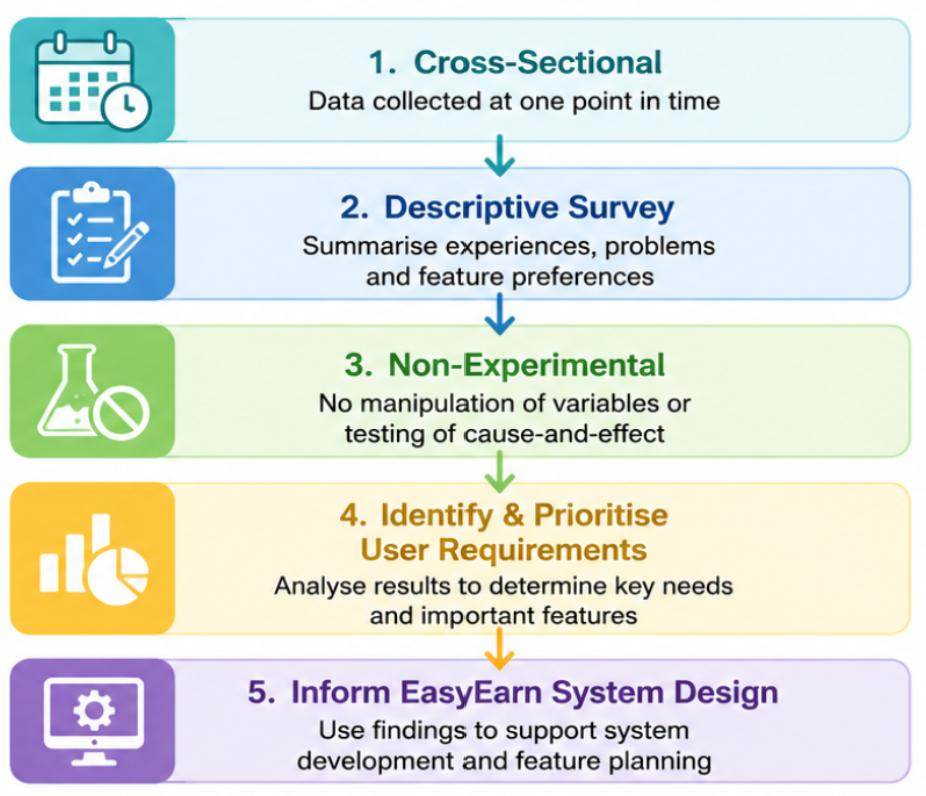

Figure 3.4: Research Design of the Study

### 3.2.4 Population and Sampling

This study targeted people in Malaysia who may search for or offer part-time, short-term or freelance jobs. This encompassed potential Job Seekers who might be looking for jobs on a job-matching platform, as well as potential Employers / Hirers who may be recruiting workers through a job-matching platform. This population was selected as they are the potential users of the proposed system, as this is the design of EasyEarn to match short-term, part-time, and freelance workers in Malaysia. This study did not specifically request respondents with professional knowledge in a specialised field. The questionnaire was designed to gather general comments from prospective job seekers and hirers of varying levels of experience or interest in job seeking and hiring, so that information regarding the needs of these users and proposed feature preferences could be determined. Convenience sampling was used in this study. Convenience sampling was used instead of purposive sampling because the study did not aim to actively seek out respondents with specific expertise, e.g. HR people, SME employers, or gig workers. In contrast, the questionnaire was sent via personal contacts, social media and messaging services, and responses were collected from those who were easily accessible and willing to participate [70]. This was appropriate due to the time and resources available in a FYP. Participation was voluntary. Thirty (30) valid responses were received. The responses were mainly used to find out the common user needs and prioritise the proposed EasyEarn features. Since convenience sampling is a non-probability sampling technique, the findings cannot be generalised to the entire Malaysian population [69]. The sample was found to be useful for identifying user requirements for the EasyEarn Job Matching Portal. The population and sampling process used in this study is shown in Figure 3.5, from the identification of potential Job Seekers and Employers / Hirers to the collection of 30 valid responses through convenience sampling.

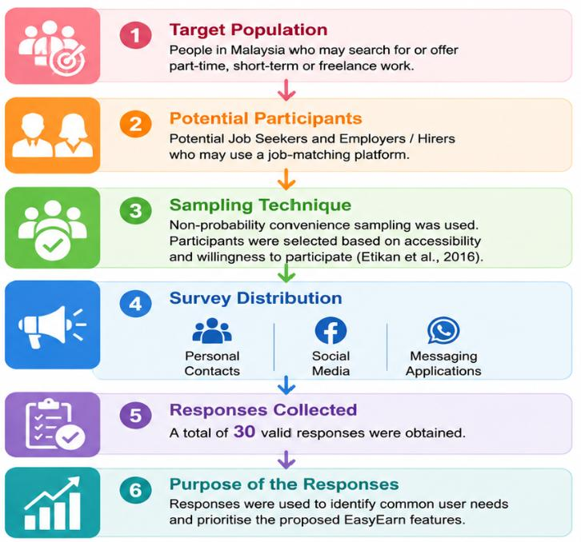

Figure 3.5: Population and Sampling Process of the Study

### 3.2.5 Data Collection Method

Data were collected using a Google Forms online questionnaire, which was appropriate for obtaining standardised responses from several participants [69]. The questionnaire link was sent via social media and messaging communications, as well as personal networks, to a target population of individuals relevant to the study. Participants had the opportunity and time to access and complete a questionnaire as needed. The answers were all automatically entered into Google Forms, and the time of submission was also recorded. This helped in the organisation of collected data and in preparing responses for analysis. The decision to use online data collection was made because it was low er cost, convenient and would enable those undertaking the research to obtain responses from participants from across geographical areas without having to meet them in person. It was also suitable for this study since the group of people involved were Job See kers as well as Employers / Hirers from various parts of Malaysia. The questionnaire and response options were kept consistent for all participants to achieve consistency in data collection. The gathered answers were then analysed descriptively to determine the common experiences, problems, preferences and key EasyEarn attributes. The EasyEarn User Requirement Survey questionnaire is provided in Appendix 1.

### 3.2.6 Research Instrument: Questionnaire Design

In this research, a structured questionnaire was used as a research instrument to collect user requirements for the EasyEarn Job Matching Portal. The questionnaire was designed based on the research objectives and the identified 6 research problem dimensions in Chapter 2, as well as the proposed EasyEarn features. The questions were kept simple and focused on information that was readily available and easily provided by the respondents [69]. A structured questionnaire was deemed appropriate for this research as the majority of the desired data could be obtained by utilising pre-established question sets and answer options. This enabled comparisons between the different participants' responses and summarisation with descriptive statistics. The questionnaire also helped address the four research questions by gathering information on four areas: short-term job searching and hiring, safety and trust, digital work history, and multilingual accessibility. The questionnaire had 13 questions that were grouped into four sections. The first asked for background information, consent, role and location of the respondents. The second part examined the experiences of the respondents in short-term job hunting or recruitment, such as the sources of information they utilised, challenges they faced and their level of difficulty. The third section sought insights into users' requirements, such as language preferences, the significance of proposed EasyEarn features and the factors deemed most crucial by users when utilising a brief time work-match platform. There was an optional open-ended question at the end of the section where participants could add further suggestions or feedback. Table 3.1 shows a summary of the structure of the questionnaire.

**Table 3.1: Structure of the User Requirement Questionnaire**

Section Questions Purpose Respondent Background Q1-Q5 Collect consent, demographic information, intended user role and location. Current Job Search / Hiring Experience Q6-Q9 Identify current experience, channels, problems and level of difficulty. User Requirements Q10-Q12 Determine language preferences, feature importance and overall priorities. Additional Feedback Q13 Gather further feature ideas from participants. The questionnaire contained various types of questions, and the type of question was dependent on the type of information that was being sought. Multiple choice was used for the questions regarding background characteristics of the respondents and general preferences, while checkbox questions were used to high light more than one alternative for the following questions: job search/hiring channel, problem, and preferred language. The level of difficulty in finding suitable short-term jobs or workers was measured using a five-point scale. A multiple-choice grid was also used to measure the importance of ten propo sed EasyEarn features using a five-point scale ranging from 1-Not Important to 5-Very Important. The last question was open-ended and optional, so that respondents could add other suggestions not listed in the options.

### 3.2.7 Data Analysis

This study had research objectives and research questions that were focused on summarising the experiences of the respondents, identifying problems that were common and determining the perceived importance of the proposed EasyEarn features, not on testing hypotheses or testing variables and relationships [27], [69]. The data analysis process was carried out in several steps. The answers to the questions which were obtained from Google Forms were first checked to ensure that only valid answers were analysed. A total of 30 valid responses were used. Second, the closed-ended answers were arranged by the type of question. Google Forms automatically organised the responses and created summary charts to support the analysis of background information of the respondents, job searching experiences, hiring experiences, problems encountered, language preference s, and the importance of the features EasyEarn is proposing. Third, data analysis of multiple-choice questions was done by frequencies and percentages. For questions that allowed multiple responses, the number and percentage of people who answered each were noted. Fourth, the data from the five-point rating questions were analysed by the distribution of responses and mean scores. These findings were employed to determine the general difficulty faced by respondents and their perceived importance of each of the proposed EasyEarn features. Fifth, the results obtained were analysed and compared to determine the common issues, preferences and highly rated features of the users. The results of these findings were used to assist in identifying and prioritising user requirements for the EasyEarn Job Matching Portal. The optional open-ended responses were examined separately to see if there were any other suggestions and comments that were not included in the predefined options to the questionnaire. These suggestions were used as additional feedback to supplement the system requirements. The results of the analyses are summarised in a number of tables, charts and descriptive summaries, which were selected for presentation in Section 3.2.9. The data analysis process of this study is shown in Figure 3.6, starting from reviewing the questionnaire responses, identifying common patterns, and prioritising the needs of users of the EasyEarn Job Matching Portal.

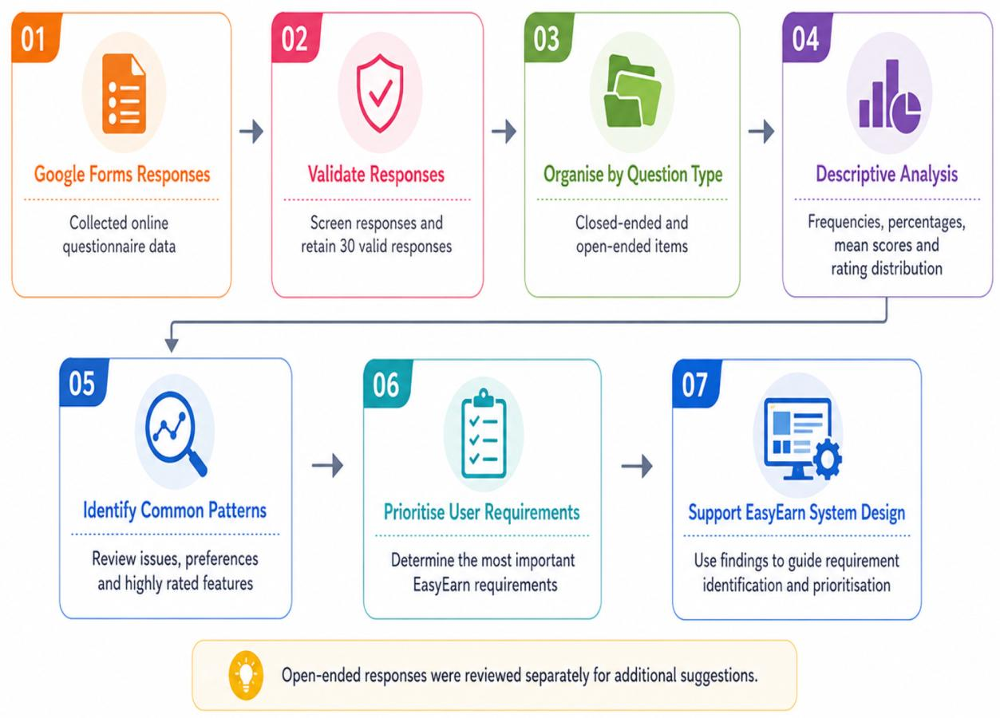

Figure 3.6: Data Analysis Process of the Study

### 3.2.8 Validity, Reliability and Research Ethics

The present study was mostly quantitative in nature, so a measure of validity and reliability was applied to ensure that the questionnaire was measuring the intended user requirements in the same way. Research ethics was also given importance during the process of data collection, analysis and reporting. Validity: Content validity is when the items used in a research instrument are representative of the area that the researcher wants to study [27]. The items of the questionnaire were prepared by taking into consideration the research problem and the research problem findings discussed in Chapter 2 and the features of the EasyEarn Job Matching Portal that was proposed. The following questions were asked for background information of the respondents, Job Searching and Hiring experiences, job search-related problems, Preferred languages and the perceived importance of proposed system features. The items on the questionnaire were also connected with the identified key issues presented in Chapter 2, such as geographic restriction, employment scams, lack of documented work history, language barriers, and limited access to flexible work and inefficient short-term recruitment. This helped to ensure that the responses collected were relevant to the purpose and to identify and prioritise EasyEarn user requirements. But, no formal pre-test or pilot test was done prior to distributing the questionnaire. Reliability: Reliability is the consistency of the data collection instrument and/or the process used to collect data [27]. The online questionnaire used in this study was created with Google Forms and all respondents were asked the same questions, with the same answers to choose from and rating scales. Responses were also gathered online and analysed in the same way as above, to ensure consistency. A formal statistical reliability test did not take place as the questionnaire was not specifically constructed to measure a single psychological construct with a multi-item scale. Rather, it was primarily employed to gather various kinds of user requiremen ts, experiences and preferences for features. Thus, consistency was supported primarily through the use of a standardised questionnaire and a consistent data collection and analysis process. Research Ethics: Research ethics is about giving the right information to participants, getting their consent and responsibly dealing with the information that is gathered [69]. The EasyEarn User Requirement Survey was conducted on a voluntary basis and participants had to give their consent prior to completing the survey. The responses collected were treated confidentially and made use of solely for academic reasons, encompassing the creation of creating the EasyEarn Job Matching Portal and assessing it. The findings of the surveys were presented as frequencies and percentages, mean scores and summary charts, but not as individual respondents. There was also an open-ended question at the end for participants to add their comments and suggestions. The questionnaire was not overly sensitive and did not include questions that might have been confrontational to the respondents. The data gathered were not changed or fabricated in the analysis and reporting process. Academic sources were also cited throughout the study in relation to it and to ensure academic honesty and integrity. The survey responses were also taken into account for data protection. Only the researcher could access the collected responses and the data would only be used in the Final Year Project. The answers were not made available in a public document along with personal information. Figure 3.7 provides a summary of the measures taken to ensure the validity, reliability, and ethical considerations in designing the questionnaire, collecting data and analysing it in this study.

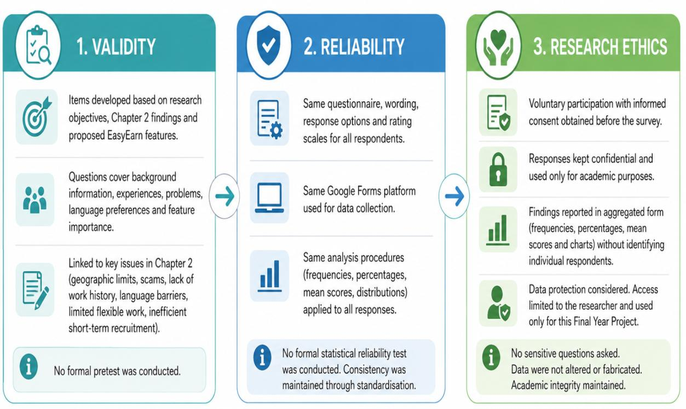

Figure 3.7: Validity, Reliability and Research Ethics of the Study

### 3.2.9 Summary of User Requirement Survey Findings

The user requirement survey gathered feedback on respondents' experiences with searching for or offering short-term jobs, as well as their expectations for EasyEarn. A total of 30 valid responses were collected from 22 to 23 April 2026. The 30 respondents identified as Job Seekers (63.3%), Employers / Hirers (10.0%) and both Job Seekers and Employers / Hirers ( 26.7%). The respondents were from 1 4 different states in Malaysia. Figure 3.8 presents respondents' intended platform role.

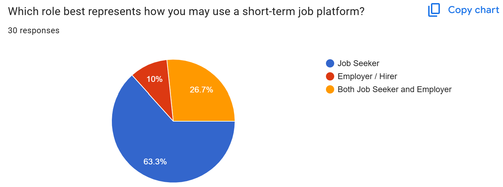

Figure 3.8: Distribution of Respondents by Intended Platform Role

All respondents had looked for or provided short-term, part-time or freelance employment (100.0%). Of these, 24 respondents (80.0%) reported doing so frequently, 4 respondents (13.3%) occasionally, and 2 respondents (6.7%) once or twice. 27 respondents (90.0%) rated the difficulty of finding suitable short-term jobs or workers in their area as Very Difficult, while 3 respondents (10.0%) selected Difficult. The average difficulty score was 4.90 out of 5, meaning that the respondents generally felt that suitable short-term jobs or workers were very difficult to find in their area. The answers are shown in Figure 3.9.

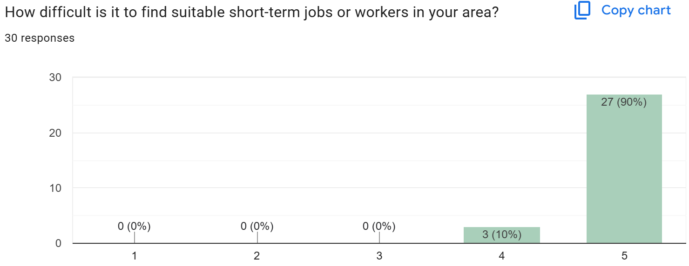

Figure 3.9: Difficulty in Finding Suitable Short-Term Jobs or Workers

All 30 respondents (100.0%) indicated that managing job applications was a difficulty. The other concerns, such as finding jobs or workers locally, fake or suspicious postings, employers that are not verified, unclear job information, reliability of applicants, lack of work history, language barriers and short-term and flexible jobs, were each endorsed by 29 respondents (96.7%). These findings are summarised in Figure 3.10.

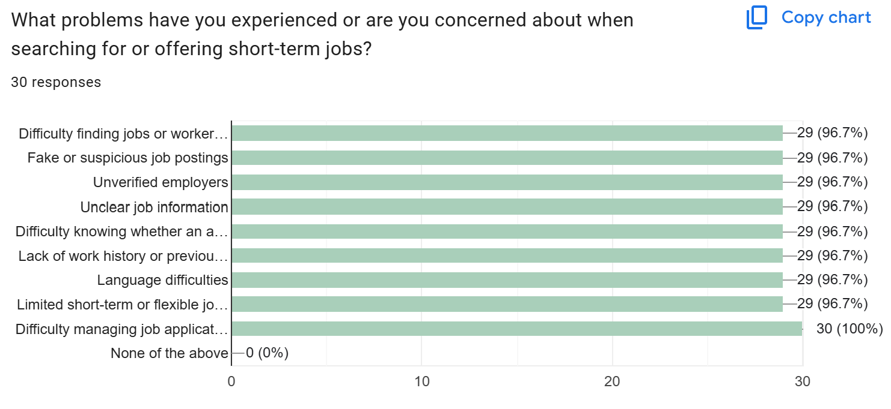

Figure 3.10: Problems in Short-Term Job Search and Hiring

A preference for multilingual accessibility was also revealed in the survey. The majority of the respondents, 24 (80.0%), chose English, 22 (73.3%) chose Bahasa M elayu, 20 (66.7%) chose Mandarin and 6 (20.0%) chose Tamil. Percentages exceed 100% due to multiple selections of preferred languages by respondents. These findings suggest that having access to multiple languages for EasyEarn users would be helpful. All of the proposed EasyEarn features were rated highly. Job Search by Location, Job Search by Category, Application Status Tracking, Employer Verification Badge, Report and Flag System, Work History Profile, Auto-Generated PDF Resume, and Multilingual Access all scored a 5.00 out of 5.00. Two-way Rating and Review System and Rule-Based Chatbot Support both had a mean rating of 4.97/5.00. The results are shown in Figure 3.11.

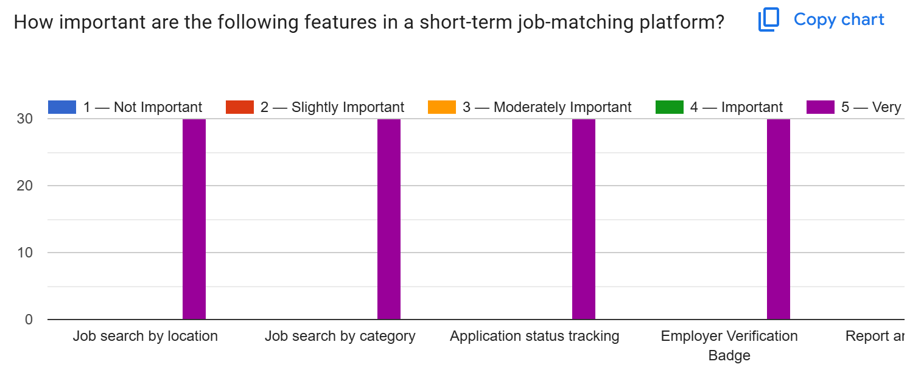

Figure 3.11: Importance Ratings of Proposed EasyEarn Features

The top factor listed when using a short-term job platform was Easy Application / Applicant Management, with 9 respondents (30.0%) marking this as their top choice, followed by Easy-to-Use Interface with 7 respondents (23.3%). 5 respondents (16.7%) opted for Safety and Employer Verification, and 4 respondents (13.3%) selected Work History and Resume Features. Two respondents (6.7%) selected Flexible Job Opportunities, 2 respondents (6.7%) selected Jobs Available in my Location, and 1 respondent (3.3%) selected Multilingual Support. The results are shown in Figure 3.12.

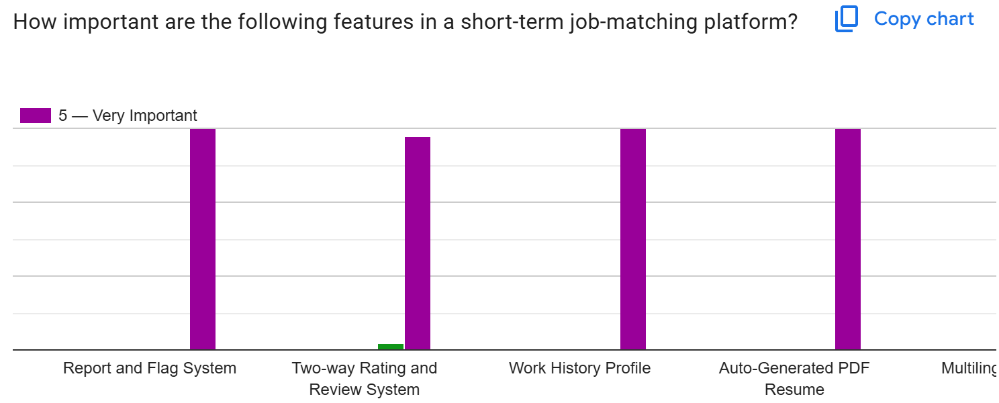

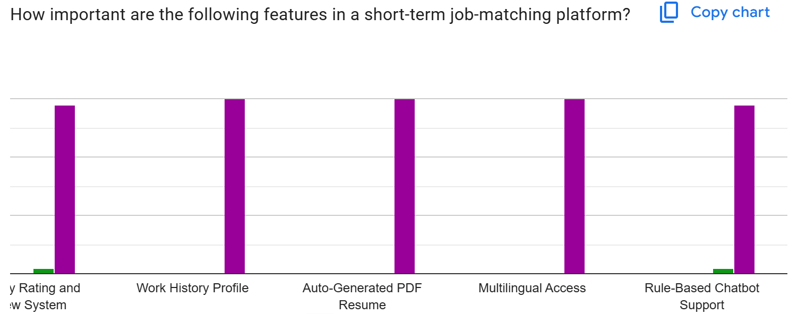

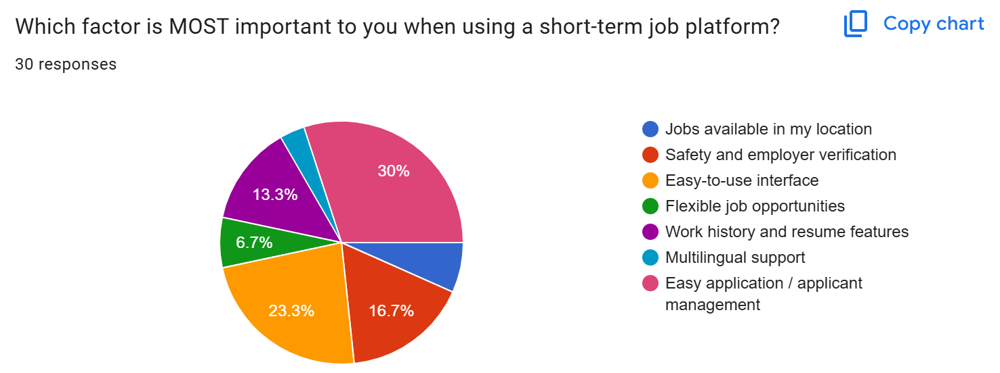

Figure 3.12: Most Important Factor When Using a Short-Term Job Platform

The open-ended answers also provided additional ideas for EasyEarn, including job and application alerts, filters and salary options, scheduling and reminders, increased security features, better profile and resume tools, saved search options, and accessibility options. These suggestions may be considered as future enhancements depending on the project scope, development time and available resources. In general, the results of the survey reflected the primary needs of EasyEarn, such as searching for jobs from a particular location, safety and trust, application management, work history, multilingual accessibility and ease of use. These findings were taken into account when identifying and prioritising the system requirements for EasyEarn.

## 3.3 System Development Methodology

EasyEarn was built with a Hybrid Agile-Waterfall methodology, a combination of the iterative, flexible development of Agile with the structured planning of the Waterfall. This method was chosen to align with the fixed 26-week Final Year Project period and EasyEarn is a multi-modular system [20], [21].

### 3.3.1 Hybrid Development Approach

EasyEarn development methodology is based on a Hybrid Agile-Waterfall approach, which is an iterative, flexible methodology combined with structured planning of the Waterfall. The Waterfall structure applies to the early planning and design activities (Wee ks 1-8) and to the final deployment and review activities (Weeks 23 -26), so as to ensure that academic documentation requirements and project milestones are organised and sequenced. The Agile component leads the six development sprints in Weeks 9 -20, where each two-week sprint produces a usable system module that is tested, reviewed and iterated before the next sprint. This entity enables the project to keep to an academic timetable and still accommodate the technical issues raised in development. Figure 3.13 depicts the overall methodology of Hybrid Agile-Waterfall for EasyEarn, comprising the structured Waterfall phases in FYP1 and iterative Agile sprints in FYP2.

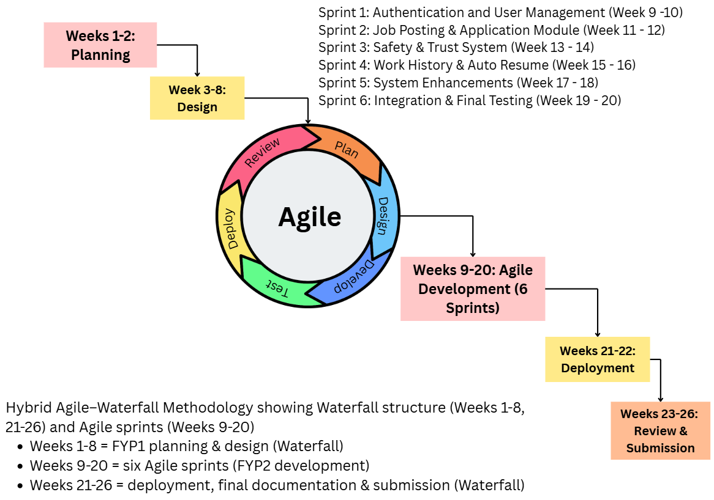

Figure 3.13: Hybrid Agile-Waterfall Methodology Diagram

### 3.3.2 Rationale for Adopting a Hybrid Development Approach

The development of EasyEarn was conducted using a Hybrid Agile-Waterfall approach for the following reasons:

- Academic and Assessment Requirements
Final Year Project (FYP) assessment framework demands that there are well-spelt-out goals, formal documents, and deliverables at certain intervals. The waterfall method has the potential for systematic documentation, through which supervisor assessment and compliance with academic norms can be performed.

- Project Timeline
The project was conducted over two semesters, which have a total period of 26 weeks. One advantage of waterfall planning is that it provides a firm schedule at the outset and achievable milestones during both FYP1 and FYP2. Agile iterations can be used in each sprint to adjust and control the course of the sprint in case of unwanted technical issues, without affecting the deadlines.

- Technical Complexity
The system also comprises several interdependent modules such as Supabase integration, Chart.js analytics, jsPDF resume generation and a multi-role access system. The advantages of these components are the possibilities of development in iterative cycles and continuous testing, which are the main ideas of Agile methodologies.

- Documentation and Compliance Standards
Waterfall provides good documentation of academic deliverables such as a proposal, system design documentation and final report. Also, Agile encourages incremental additions or enhancements to the functionality, and this would allow for earlier verification of functional additions.

### 3.3.3 Waterfall Phase (FYP1, Weeks 1-8)

The waterfall model is a step-by-step process model that consists of distinct phases in the model development process that must be completed in order [71]. This structured characteristic makes it suitable for the requirements elicitation and documentation part of EasyEarn, as the requirements have to be formally elicited and approved before any development activity can begin [20]. The Waterfall component ensured that the system architecture, database schema, use case diagrams and wireframes were fully reviewed and approved before the Agile sprints started. The key activities in the Waterfall phase included:

- Identifying the topic, how it will be covered and who will be involved (Weeks 1-2)
- A literature review and competitor analysis, as well as requirements gathering (Weeks
3-4)

- System architecture design, database schema (ERD), UI/ UX wireframe prototyping
and API endpoint documentation (Weeks 5-6)

- Prototype development, FYP1 documentation compilation and final FYP1 presentation
(Week 7)

### 3.3.4 Agile Phase (FYP2, Weeks 9-20)

The Agile methodology, according to the Manifesto for Agile Software Development [72], favours the iterative delivery of software, the co-creation with the customer, and the ability to adapt to change over upfront planning. These are followed by 6 structured 2-week development sprints in FYP2. A new sprint provides a fully operational system module, allowing issues to be discovered and addressed before other system modules are developed [73]. In Sprint reviews, the supervisor reviews the sprint and gets input for the next sprint. The 6 Agile sprints are organised like this:

- Sprint 1 (Weeks 9-10): Authentication and User Management
- Sprint 2 (Weeks 11-12): Job Posting and Application Module
- Sprint 3 (Weeks 13-14): Safety and Trust System
- Sprint 4 (Weeks 15-16): Work History and Auto Resume
- Sprint 5 (Weeks 17 -18): System Enhancements (Admin Dashboard, Chatbot, Mobile
Responsiveness)

- Sprint 6 (Weeks 19-20): Integration and Final Testing
System deployment on GitHub Pages is completed in Weeks 21 -22, and final system documentation and submission of FYP2 are completed in Weeks 23- 26. This blended model allowed EasyEarn to meet the strict documentation requirements of the academic process and will also be responsive to any changes in the technical requirements that may occur during the development process [74]. The overall Hybrid Agile-Waterfall Methodology used for EasyEarn is shown in Figure 3.13.

### 3.3.5 Hybrid Model Workflow

The project was conducted over two semesters, namely FYP1 (Weeks 1-8, 20 April-12 June 2026) and FYP2 (Weeks 9-26, 15 June-16 October 2026), in six major phases. FYP1 focused on planning, design and prototype development, while FYP2 outlines all six Agile development sprints, system deployment and final submission. The following Table 3.2 summarises the key activities and associated deliverables from each of the six phases of the Hybrid Model Workflow for EasyEarn as well as the timeline for each phase.

**Table 3.2: Hybrid Model Workflow of EasyEarn**

Phase Timeline Key Activities Deliverable Phase 1: Planning (FYP1) Week 1-2 Project preparation, defence, proposal writing and topic selection. Approved proposal Future enhancements: Design (FYP1) Week 3-8 Literature search, competitor analysis, requirement analysis, system design, database design, wireframe design, API documentation and prototype development. ERD, wireframes, prototype FYP1 Assessment Week 6 & Week 8 FYP1 Midsem Checkpoint (Week 6), FYP1 Final Presentation & Report Submission (Week 8). FYP1 report, presentation Phase 3: Development (FYP2) Week 9-Week 20 Each FYP2 Agile sprint develops and delivers a functional system module incrementally. Functional modules, sprint reports FYP2 Assessment Week 16 FYP2 Midsem Checkpoint System demonstration with finished sprints 1-4. Working system demo Phase 4: Testing (FYP2) Week 19-Week 20 The usability testing, performance testing, security testing, bug fixing and code refactoring. Test reports, defect logs Phase 5: Deployment (FYP2) Week 21-22 Deployment of GitHub Pages Hosting, validation and integration of the final system. Live-deployed system Phase 6: Review & Submission (FYP2) Week 23-Week 26 Compiling final documentation, writing reports, preparing presentations and FYP2 final submission. Final report, FYP2 presentation, and system demonstrations.

### 3.3.6 Sprint Structure

Within every two weeks, the sprint is followed by a regular six-step cycle in order to guarantee quality assurance and measurable results at the conclusion of every sprint. Table 3.3 presents a description of the six-step structure of the sprints which EasyEarn followed during the two-week Agile development sprints.

**Table 3.3: Sprint Structure of EasyEarn**

Step Description 1. Planning The beginning of every sprint involves developing sprint goals, user stories, and acceptance criteria to have a clear scope and expected outcomes. 2. Design UI wireframes, Supabase collection schema refinements, and workflow plans for the system are ready to assist with the targeted features of the sprint. 3. Development The implementation of features is done in HTML, CSS, JavaScript, and the Supabase JavaScript Client Library with modular, maintainable and testable code. 4. Testing Sprint testing includes feature-level checks, integration checks and defect fixing to identify issues before the next sprint. 5. Deployment The features are done, and they are added to GitHub Pages, where a stable and working increment is available to be reviewed. 6. Review Sprint review and retrospective meetings are conducted with the project supervisor to show which features are done and receive comments on the following sprint.

### 3.3.7 Sprint Management Practices

To make sure that the hybrid methodology is put into practice, the following sprint management practices are embraced:

- Weekly Progress Tracking
A formal log is used to record progress in development every week. Tasks which have been done and problems which have been faced are recorded as a reference for the supervisors.

- Sprint Planning Sessions
Each sprint commences with the definition of goals and distribution of the tasks to underline responsibilities and facilitate the process.

- Sprint Review Sessions
The sprint review will be held at the end of every sprint, which shows the supervisor what has been accomplished. Feedback is documented in order to make better improvements in subsequent sprints.

- Issue Tracking
Bugs and technical problems are handled in a local tracking log. There are also feature requests that are recorded to ensure clarity and organisation.

- Version Management
Project files are organised in the GitHub repository to support version tracking, traceability and the integration of new features across the development sprints.

### 3.3.8 Risk Mitigation Through the Hybrid Approach

The hybrid model assists in mitigating the main project risks following the development and validation of the organisation:

- Early Development of Core Features (Sprints 1-3)
Core features like user authentication, job posting, and the safety and trust system will be developed early on to have a working baseline system in FYP2.

- Enhancements and Testing Deferred to Later Sprints (Sprints 4-6)
Enhancements like work history, system integration testing, and system administration analytics are not done until the development of core modules has been finished; otherwise, the functionality later developed depends on the higher-quality functionality.

- Regular Academic Validation
Frequent reviews with supervisors ensure that the project is in line with the academic expectations. The feedback is implemented in a cyclical fashion in order to stay in line with the project objectives.

- Modular System Architecture
The system is constructed to have self-contained Supabase tables and independent JavaScript modules to enable the development of the system in parallel and easier detection of defects.

- Documented Decision-Making
All key project decisions are recorded in sprint reports so that they have an apparent audit trail and prove compliance with academic standards.

### 3.3.9 System Evaluation Methodology

System evaluation is performed at a few validation points within the cycles of the sprints to confirm that the system is operational, reliable and oriented toward the project goals:

- System Testing
System testing is used to test the complete integrated system to see if it meets both functional and non-functional specifications [75]. Every functionality of the platform is tested end-to-end, such as the core modules of user sign-up, posting jobs, handling applications, rating and resume generation. This also helps to maintain consistency and integrity of the data across all modules and ensures they can be stored and retrieved properly in the Supabase database.

- User Acceptance Testing (UAT)
UAT is a test that validates the system by following real users to make sure that the system is appropriate for real-world users [75]. Realistic scenarios are tested with representative users of the three roles (Admin, Employer and Job Seeker) to validate that the system matches real user needs.

- Usability Testing
EasyEarn interfaces are evaluated by usability testing based on Nielsen's 10 Usability Heuristics to make sure that the interfaces are user-friendly, consistent and accessible [55]. The interfaces that are chosen to be deployed for the three roles (Job Seeker, Employer and Admin) are reviewed by the project author, and the usability issues that are found are given severity ratings according to the severity rating scale by Nielsen.

- Security Testing
Security testing identifies the weaknesses of the system, vulnerabilities and unauthorised access to the data [75]. Testing of Supabase Authentication, role-based access control, and RLS policies ensures the security of sensitive data that unauthorised users are unable to access.

- Compatibility Testing
EasyEarn is tested for compatibility across various browsers, devices and screen sizes [75]. Browser Compatibility Testing covers Google Chrome, Mozilla Firefox, Microsoft Edge and Safari using the available testing environments. Responsive design and selected platform features are also evaluated across different screen sizes and interaction scenarios

## 3.4 Project Phases and Sprint Breakdown

The FYP2 development was organised into six two-week Agile sprints (Week 9-Week 20), with each sprint delivering a functional system module. The sprint-based development started on 15 June 2026 after the submission of the FYP1 final. Table 3.4 presents a ll 26 weeks of project development along with the project phases, objectives, key activities and deliverables for EasyEarn. Note: Sprint 6 (Week 19-20) happens at the same time as Phase 4 Testing. The Sprint 6 row above contains information about testing activities and deliverables.

**Table 3.4: Project Phases and Sprint Breakdown of EasyEarn**

Sprint Timeline Objective Key Activities Deliverable Phase 1: Planning (FYP1) Week 1-2 Establish project scope, choose a project topic and get approval from the supervisor. Topic selection, team formation, project preparation, proposal writing, and Proposal Defence. Approved project proposal. Project timeline and risk overview. Future enhancements: Design (FYP1) Week 3-8 Design a complete system and Literature Review, Competitor Analysis, Requirement Gathering, ERD, wireframes, system database before development. Use Case Diagram, System Architecture Design, Database Schema Design, UI/UX Wireframe Design (on Canva), API Endpoint Documentation, and Making a Prototype. architecture diagram, API documentati on, prototype. FYP1 Assessment Week 6&8 Present progress and submit FYP1 interim report. FYP1 Midsem Checkpoint (Week 6), FYP1 Final Presentation and Report Submission (Week 8). FYP1 report, presentation. Sprint 1:

Authentication

& User Management Week 9-10 Develop secure user registration, login, and role-based access control. Registration, login, role-based access control, profile setup and verification and Google Translate Website Redirection. Functional user managemen t module. Sprint report. Sprint 2: Job Posting & Application Module Week 11-Implement job posting, search, and application management features. Job posting with CRUD functionality, job search and filter by category and location, job application submission, application status timeline, and saved jobs. Functional job module. Sprint report. Sprint 3: Safety & Trust System Week 13-Build trust and safety mechanisms to protect users from fraud. Employer verification badge, report and flag system, bidirectional rating and review module. Functional safety module. Sprint report. Sprint 4: Work History & Auto Resume Week 15-Develop work history tracking and automated resume generation. Work history dashboard, notification and alert system, auto-generate resume feature using jsPDF. Functional work history module. Sprint report. FYP2 Assessment Week 16 Establish an employment log and auto-completion resume feature. FYP2 Midsem Checkpoint for system demonstration with finished Sprints 1 -4 and progress report. Working system demo. Sprint 5: System Enhancements Week 17-Implement admin dashboard, analytics, chatbot, and UI refinements. Admin dashboard and analytics using Chart.js, rule-based chatbot, mobile responsiveness and UI polish. Functional admin module. Sprint report. Sprint 6: Integration & Final Testing Week 19-Test the system as a whole, integrate all modules. System integration, usability testing, performance testing and concurrency checks, security and vulnerability assessment, bug fixing and code refactoring. Fully tested and integrated system. Final sprint report. Phase 4: Deployment (FYP2) Week 2 1- Deploy on GitHub Pages. Supabase deployment, final system integration verification, and last round of system testing. Live-deployed system. Deployment validation report. Phase 5: Review & Week 23-Finalise documentation and hand in all Final documentation and report compilation, presentation slides and Final report, FYP2 presentation Submission (FYP2) project deliverables. poster preparation, FYP2 Final Presentation and Report Submission., system demonstrati on.

## 3.5 Tools and Technologies

EasyEarn is developed with a light Technology Stack that focuses on the client, with Supabase as the BaaS. Below are the tools and technologies chosen for their suitability for a solo academic project, ease of integration, and support for all core features within the time constraints. The technology stack of EasyEarn is visualised in Figure 3.14 and includes all frontend, backend, hosting and supporting libraries.

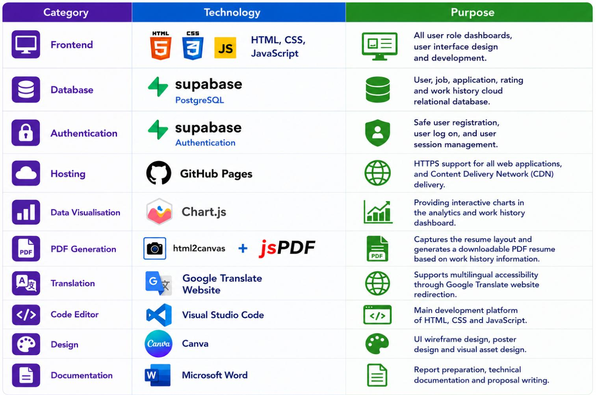

Figure 3.14: Visual Overview of Technology Stack

Table 3.5 shows the tools and technologies chosen for EasyEarn and their category and use in building the platform.

**Table 3.5: Tools and Technologies of EasyEarn**

Category Technology Purpose Frontend HTML, CSS, JavaScript All user role dashboards-UI design and development. Database Supabase PostgreSQL User, job, application, rating and work history Cloud relational database. Authentication Supabase

Authentication

Safe user registration, user login, and user session management. Hosting GitHub Pages HTTPS support for all web applications and Content Delivery Network (CDN) delivery. Data Visualisation Chart.js Providing interactive charts in the analytics and work history dashboard. PDF Generation jsPDF & html2canvas Capture the resume layout and generate a downloadable PDF resume based on the Job Seeker's profile and work history data. Translation Google Translate Website Support multilingual accessibility through Google Translate website redirection. Code Editor Visual Studio Code Main development platform for HTML, CSS and JavaScript. Design Canva UI wireframe design, poster design and visual asset design. Documentation Microsoft Word Report preparation, technical documentation and proposal writing.

## 3.6 Planning

Planning is a key part of projects to ensure they are completed within scope, on schedule and to a required quality [19]. For EasyEarn, the planning phase involves mapping the project goals from Section 1.3 to a structured set of management artefacts that control all activities throughout the project development process, which will last for 26 weeks. The main planning artefacts for EasyEarn, including the Work Breakdown Structure (WBS), Project Schedule and Gantt Chart, are presented in Section 1.6. These planning artefacts support the Hybrid Agile-Waterfall approach described in Section 3.3. This section focuses on the risk management measures used during the project.

### 3.6.1 Risk Management

Risk Management consists of a structured approach to identifying, analysing, and controlling risks that can hinder the successful completion of a project [19]. The third-party Backend-as-a-Service stack, combined with a tight 26-week development schedule and an academic project being worked on by a single developer, makes proactive identification of risks very important to the project's success in delivering the core system on time and to specification at EasyEarn. Table 3.6 shows the six project risks identified for EasyEarn, their likelihood and impact ratings, and the mitigation strategies undertaken for these risks.

**Table 3.6: Risk Management**

No Risk Likelihood Impact Mitigation Strategy 1 Timeline overrun. There is no flexibility for a delay in feature development or testing with the fixed 2 6- week academic schedule. High High Use a Hybrid Agile-Waterfall approach with 2-week sprints. Overall timeline integrity; features deferred/excluded because not completed in allocated sprint [20]. 2 Limited development capability of a solo developer. Without a development team, High Medium Core features are prioritised and developed first (Sprints 1 -3). Optional features are deferred to later sprints (Sprints 4-6) and parallel development, QA coverage and feature volume are limited. may be excluded if time does not permit [21]. 3 Free-tier restrictions or service uptime issues with Supabase. The platform depends entirely on Supabase for authentication, database, and storage. If there is a service outage or if the free tier resources are exceeded, the system would become unusable. Low High All Supabase table schemas, RLS policies, and configurations are documented. Development and testing are carried out within free tier limits. The modular design enables migrating to another BaaS provider if needed [18]. 4 Scope creep. As the project evolves or new feature ideas are introduced, the project scope may grow to a point where it exceeds the time available. Medium High Core Features are not necessarily the same as Optional Features; there is a formal feature list that separates them. New feature requests are evaluated with regard to sprint capacity, prior to inclusion. Sprint reports keep an audit trail of all key project decisions [74]. 5 Data integrity and security failure. Personal information such as user profiles, contact details, and work history is all managed by EasyEarn, which could pose a risk of unauthorised access or data breach. Low High Supabase RLS policies are enforced at the database level. Role-Based Access Control (RBAC) restricts data access by user role. All data is sent via HTTPS. These measures align with the requirements of the PDPA 2010 [76]. 6 Regulatory non-compliance. A lack of understanding of relevant Malaysian laws could subject the system to a risk of legal issues before or after it is deployed into the public sphere. Low Medium EasyEarn is developed using specific easy-to-use controls aligned with the PDPA 2010, Computer Crimes Act 1997 and Consumer Protection Act 1999, which are shown in section 3.8.3. The system is an academic prototype that is not formally presented legally. Compliance audit and legal review would be needed prior to general production deployment. The six risks listed above are addressed mainly with the help of the structural discipline of the Hybrid Agile-Waterfall methodology, enforcing scope control at the sprint level and frequent academic validation. Its modular system architecture with self-contained Supabase tables and independent JavaScript modules also helps minimise risk by allowing parallel development and fault isolation. These risk measures, when combined, allow for EasyEarn's development to be consistent and work towards the project goals and academic requirements throughout the 26-week delivery period and applicable regulatory requirements. Figure 3.15 presents a visual overview of the identified risks, their likelihood and impact ratings, and the risk mitigation measures that were taken for the EasyEarn project.

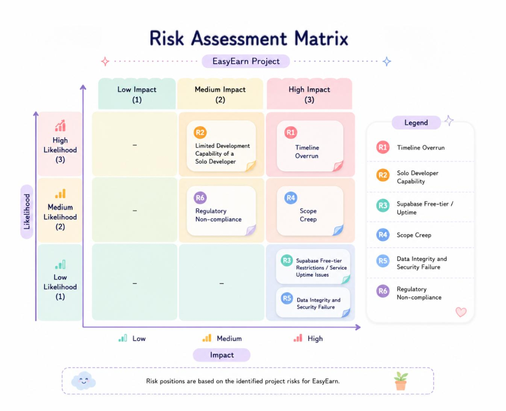

Figure 3.15: Risk Assessment Matrix

## 3.7 Hardware Requirements

EasyEarn is an application that works on the web and can be used with common desktop and laptop computer hardware using a modern web browser. The front end of the system is delivered via the user's web browser, and the backend services, including authentication, database management and data storage, are delivered remotely by Supabase [18]. Hence, no dedicated server hardware needs to be installed or maintained by the user. The following hardware environment allows for a proper user and development experience. The EasyEarn platform hardware requirements for development and operation are shown in Table 3.7.

**Table 3.7: Hardware Requirements**

Component Minimum Specification Recommended Specification Processor Dual-core 1.8 GHz Quad-core 2.4 GHz or above RAM 4 GB 8 GB or above Storage 256 GB SSD 512 GB SSD or above Display 1280 x 720 resolution 1920 x 1080 (Full HD) or above Internet Connection Broadband (5 Mbps) Broadband (25 Mbps or above) Operating System Windows 10, macOS 11, Ubuntu 20.04 Windows 11, macOS 13, Ubuntu 22.04 Because EasyEarn is hosted on GitHub Pages and its provider is Supabase, there is no need for the user to set up specific server hardware for deployment [18], [77]. During the academic project phase, all server-side infrastructure is handled by Supabase in their cloud environment, without requiring any physical hardware.

## 3.8 Software Requirements

Software requirements are statements that specify what a system should do (functional requirements) and the constraints that the system should meet (non-functional requirements) [20]. EasyEarn Software Requirements are organised in this manner.

### 3.8.1 Functional Requirements

Functional requirements are the services, behaviours and functions the system must offer to its users [21]. Table 3.8 provides a breakdown of the functional requirements of EasyEarn, grouped by user role and feature and provides a description of what the function needs to provide.

**Table 3.8: Functional Requirements**

No. User Role Feature Description FR01 All Users User Registration & Login Role-based registration and login for Job Seeker, Employer, and Admin via Supabase Authentication. FR02 All Users Role-Based Access Control Access to system functions is limited by role; RLS prevents cross-role data access. FR03 Job Seeker Profile Setup Individuals can add or remove skill tags, adjust their availability, preferred categories, and profile photo in their profile. FR04 Job Seeker Browse & Filter Job Listings Job seekers can browse active job listings and filter by category (e.g. F&B, Event, Delivery) and location state. FR05 Job Seeker Apply for Jobs Job seekers can submit one-click applications to active job listings with status automatically set to Pending. FR06 Job Seeker Application Status Tracking There is a visual timeline that tracks the application through all status stages: Pending, Reviewed, Interview, Accepted, Completion Pending (awaiting job seeker payment confirmation), Completed, and Rejected. FR07 Job Seeker Save Jobs / Wishlist Job seekers can save job listings for later review and manage their saved job listings. FR08 Job Seeker Work History Dashboard Completed jobs are automatically logged, and the dashboard shows the total number of jobs, cumulative earnings and job type distribution using Chart.js. FR09 Job Seeker Auto-Generate Resume The Job Seeker's stored profile, work history, skills and employer ratings are used to generate a downloadable PDF resume via jsPDF without requiring the user to re-enter or manually format the resume content. FR10 Employer Post & Manage Job Listings Employers are able to create, edit and delete jobs with job title, pay rate, job category, job location, job description, and job expiration date. FR11 Employer Review & Manage Applicants Employers can view all applicants for each job listing and update each applicant's status. FR12 Employer Employer Verification Badge Employers can submit Know Your Business (KYB) documents for Admin review; approved employers receive a verified badge. FR13 Job Seeker & Employer Bidirectional Rating and Review System Upon job completion, Job Seekers and Employers can rate and review each other using a 1 -5 star rating and written feedback. FR14 All Users Report / Flag System Report / Flag System: Any users reporting suspicious job postings, non-paying employers, or fraudulent accounts may submit reports to the Administrator. FR15 Admin User Management The Administrator can view, suspend, and restore all user accounts on the platform. FR16 Admin Job Listing Moderation The Administrator may view, approve, flag and delete the job postings made by employers. FR17 All Users Google Translate Website Redirection Users can access translated versions of EasyEarn pages through Google Translate website redirection from the navigation bar. FR18 All Users Rule-Based Chatbot Users can chat with a rule-based chatbot to ask questions about the FAQs, provide information about completing the job application and how to use the platform.

### 3.8.2 Non-Functional Requirements

Non-functional requirements are the quality characteristics and restrictions that influence the way the system works and how well it performs [20]. The non-functional requirements for EasyEarn are presented in Table 3.9, which includes performance, security, usability, scalability and regulatory compliance.

**Table 3.9: Non-Functional Requirements**

No. Category Requirement Description NFR01 Performance Page Load Time The project targets a page load time of within three seconds for primary pages under a normal broadband connection. NFR02 Security HTTPS Encryption All communication between the client and Supabase backend should use HTTPS to avoid data interception [78]. NFR03 Security RLS Supabase RLS policies are used to restrict data access based on user roles and record ownership [18]. NFR04 Security Session Management All user sessions should be secured by Supabase Authentication with token-based access [78]. NFR05 Usability Responsive Design The platform should be completely usable on desktop and mobile browsers, without the need to install a native app [79]. NFR06 Usability Accessibility The UI should be simple and easy to use, with important tasks designed to be completed within approximately three main interaction steps where practical. NFR07 Reliability System Availability The system aims to be highly available through Supabase backend services and static web hosting. Availability is considered a "reasonable expectation" of deployment, rather than an actual uptime guarantee, for the FYP scope [18]. NFR08 Scalability Concurrent Users The system is built with Supabase and static client-side web architecture for small-scale concurrent usage. 100 concurrent users is considered a target capacity for the FYP scope and isn't formally stress-tested, but rather is based on the selected Supabase-backed static web architecture. NFR09 Maintainability Code Modularity To help with testing and future maintenance [21], JavaScript modules should be logically broken up by feature (auth.js, jobs.js, resume.js). NFR10 Compliance PDPA 2010 Personal data handling follows principles in the PDPA 2010 (Act 709) of purpose limitation and secure storage [76]. NFR11 Compatibility Browser Compatibility The platform should work properly in the latest release of Google Chrome, Mozilla Firefox, Microsoft Edge, and Safari [48]. NFR12 Portability Deployment Independence The frontend should be able to be deployed as a static site on GitHub Pages and not require a dedicated application server [77].

### 3.8.3 Ethical and Legal Considerations

EasyEarn's design was guided by pertinent Malaysian legislation and regulations related to personal data, computer misuse, consumer protection and employment practices and gig work. EasyEarn also has tools which enable fraud awareness, transparency and safer hiring practices. EasyEarn is an academic prototype; these legal and ethical issues are used to inform the design of the system, but are not a formal certification of legal or regulatory compliance. Personal Data Protection Act (PDPA) 2010 In Malaysia, the main laws that regulate the collection, processing, storage and disclosure of personal data are the PDPA 2010. EasyEarn takes reasonable technical steps to prevent the loss, misuse, alteration or access to personal data without authorisati on, in line with the Security Principle in the Act [76]. All personal data is kept in the Supabase PostgreSQL database with RLS policies that ensure that each user can only access data that they have been authorised to see. At registration, users are informed of the purpose of data collection and can access the platform's privacy information. The Auto-Generate Resume feature creates resume documents based on the information that the user enters into the system, and allows the user to control what is in the output. Computer Crimes Act 1997 Unauthorised access to computer systems and data is regulated by the Computer Crimes Act 1997 [80]. EasyEarn's risk of unauthorised access is reduced by using Supabase Authentication, which offers secure password hashing and session management through token-based authentication. Role-Based Access Control (RBAC) also limits what actions a user can take with the system: Job seekers can only view their profile and job applications; employers can only manage their own job listings; administrators have full access to the platform management. Communication between the client and Supabase servers is also sent over HTTPS, which further minimises the risk of unauthorised access and data interception. Consumer Protection Act 1999 The Consumer Protection Act 1999 provides for consumers' rights to be protected from fraudulent and deceptive practices. EasyEarn has two platform features designed to enhance transparency and user protection: the Employer Verification Badge, which shows that an employer has uploaded verification documents for Admin to review; and the Report and Flag System, which enables users to f lag suspicious listings, employers who do not pay, or fraudulent accounts, for further investigation. The features have been designed to assist with the purpose of the Consumer Protection Act 1999 [81]. Employment Act 1955 (Reference Only) The Employment Act 1955 is included as a reference point for conventional employment-related practices in Malaysia. EasyEarn encourages clear job information and fair treatment in job postings; however, the academic prototype does not determine whether a particular gig engagement creates an employer-employee relationship or gives rise to statutory employment entitlements. The A ct is therefore considered for general awareness rather than as a formal compliance requirement for EasyEarn [82]. Gig Workers Act 2025 (Act 872) The Gig Workers Act 2025 (Act 872) is the law in Malaysia that safeguards gig workers and took effect on 31 March 2026. The Act requires that gig workers be covered by the rule of law, be protected against discrimination, and have access to dispute resolution mechanisms in service contracts. EasyEarn's Employer Verification Badge, Bidirectional Rating and Review System, and Work History Profile are created with a spirit of transparency and trust in mind. The features in EasyEarn are tailored based on the principles of transparency, trust and dispute resolution in the Act [17], as it is an academic prototype. Figure 3.16 shows the various Malaysian legislation governing the design and operation of EasyEarn, which includes the PDPA 2010, Computer Crimes Act 1997, Consumer Protection Act 1999, Employment Act 1955 and Gig Workers Act 2025.

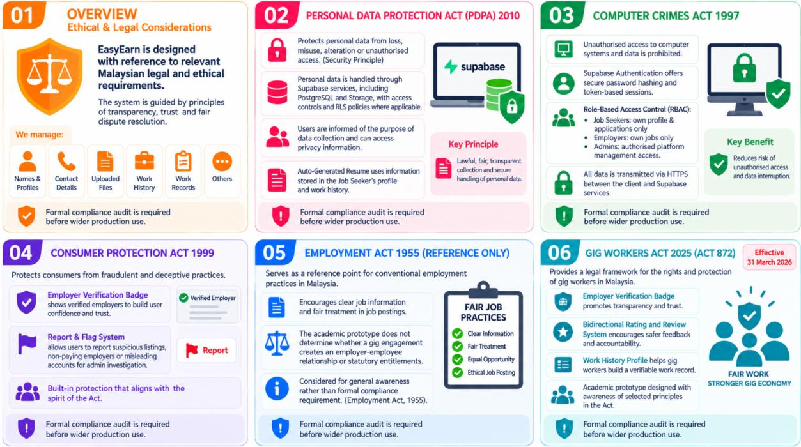

Figure 3.16: Ethical and Legal Considerations

## 3.9 System Design

System design converts the requirements specification into a blueprint for building the software, including the design of the software's architecture, data structures, interfaces, and procedural details [21]. This section includes detailed design of the entire system pertaining to the development framework, system architecture, module division, Database design, Use case diagram and System workflow diagrams.

### 3.9.1 Framework

The framework for EasyEarn is built using vanilla HTML5, CSS3, and JavaScript on the front-end, and Supabase as the provider. This tech stack was chosen because it was widely available, free of licensing fees and appropriate for this academic-based student project. All platform interfaces are built using HTML5 and CSS3, which provide the structure and presentation of all web pages for the platform, allowing them to be responsive and accessible without needing a ‘front-end framework’ [48]. All client-side interactivity, form validation, and CRUD operations are done in vanilla JavaScript, using the Supabase JavaScript Client Library, along with module-level business logic [18]. Avoiding heavy frameworks like React or Angular avoids the complexity of dependencies and keeps code transparent, especially for an academic system built in a short time frame [83]. Within its framework, supplementary libraries are added, such as Chart.js, used to generate interactive analytics charts on the Admin Dashboard and Work History Dashboard, or jsPDF, used to automatically produce PDFs of the resume feature, which is created by the program, so that there is no need for manual formatting on the client side [49], [51]. Google Translate is available throughout the website through site redirection from the navigation bar, allowing multilingual access. The system is deployed and hosted on GitHub Pages, a free, simple and static site hosting service that deploys directly from the project's GitHub repository via HTTPS [77].

### 3.9.2 System Architecture

A three-layer client-server architecture using Supabase BaaS lies at the core of EasyEarn. Instead of installing an application server, this approach reduces the need to do so by using managed backend services offered by Supabase [18]. Figure 3.17 shows that the system is divided into three layers: the Presentation Layer, the Business Logic Layer, and the Data Layer. The front-end interfaces, built with HTML/CSS/JS, are part of the Presentation Layer. This layer is in charge of rendering role-specific dashboards, interactive UI elements, Chart.js visualisations and the auto-generated resume preview and PDF export on the client side via html2canvas and jsPDF. Supabase JavaScript client library allows the frontend to communicate with Supabase backend services for authentication and database operations without having to use a separate application server [18]. JavaScript modules are the major components of the Business Logic Layer that are implemented on the client side, organised by feature domain, such as authentication management, job listing and application logic, safety and trust operations, work history processing, and handling chatbot responses. This modular structure aids in separating concerns throughout the application an d in maintainability and testability throughout the sprint-based development process [84]. Furthermore, certain access control and data handling policies are implemented at the Supabase RLS policy and database level. Supabase provides the Data Layer, which consists of a Postgres relational database, authentication services including session management via tokens, RLS policies, and some of the database-level business logic [18]. These services enable secure data storage, user authentication, and access control to data based on their roles. That means the current EasyEarn architecture doesn't need an application server, as the needed backend services are managed by Supabase. EasyEarn's three-layer system architecture is shown in Figure 3.1 7, which depicts the relationship among the three layers in EasyEarn's system architecture: Presentation Layer, Business Logic Layer, and Data Layer.

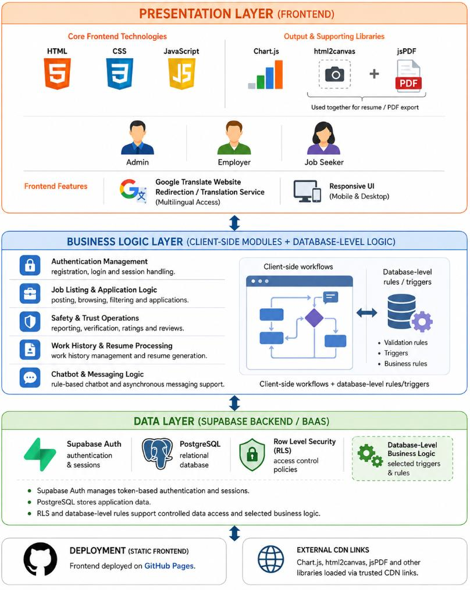

Figure 3.17: System Architecture Diagram

### 3.9.3 System Modules and Functionality

EasyEarn is designed with seven key system modules to help solve different parts of the job-matching process. The relationship of modules and between modules are shown in Figure 3.18.

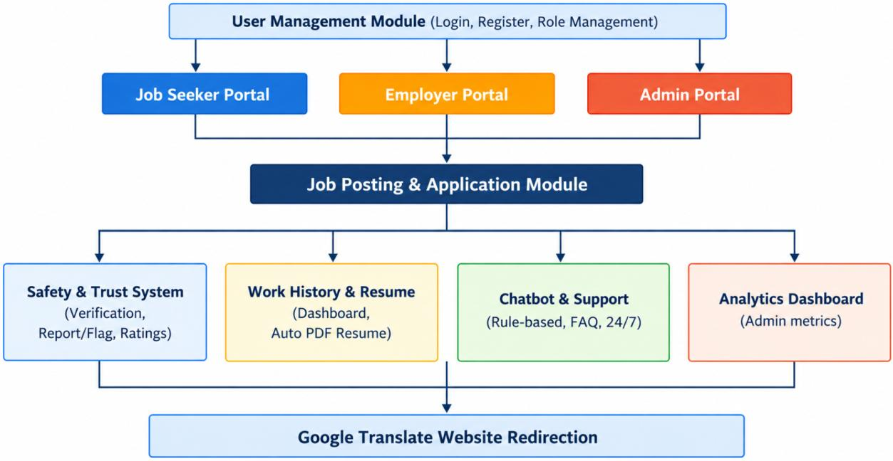

Figure 3.18: System Module Diagram

User Management Module All three users are managed through the User Management Module, which is the entry point of EasyEarn and is responsible for the registration, login and role-based access control (RBAC) for all users. RBAC guarantees that each user can utilise only functions and data that are suitable for their role [85]. Supabase Authentication automatically redirects users to their appropriate dashboards after successful authentication. Client-side role checks are used to help navigate the application based on the user's role; Supabase RLS policies enforce access control at the database level. Job Posting and Application Module The Job Posting and Application Module is the hub of EasyEarn's operations. Employers can add, edit and remove job postings with full CRUD capabilities. Job seekers can view active job postings, apply filters by type and location, and apply directly on the platform. Each application progresses through a multi-stage Application Status Timeline: Pending, Reviewed, Interview (shortlisted for interview), Accepted, Completion Pending (awaiting job seeker payment confirmation), Completed, and Rejected, allowing job seekers to track updates throughout the hiring process. Safety and Trust Module The employment fraud issue on informal gig platforms is a topic that is widely discussed [86] and is covered in this module. It involves three features: the Employer Verification Badge, which is given to a verified employer who provides valid business documents approved by the Administrator; the Report and Flag System, where users can report suspicious listings and accounts. The Bidirectional Rating and Review System allows Job Seekers and Employers to rate and review each other after job completion using a 1 -5 star rating and optional written feedback. Work History and Resume Module This module allows individuals in search of employment to create a digital working identity. The Work History Dashboard is automatically populated with completed jobs and displays some of the necessary metrics through Chart.js [51]. The Auto-Generate Resume feature uses jsPDF to generate a downloadable PDF resume from the Job Seeker's stored profile, work history, skills and platform ratings without requiring the user to re-enter or manually format the resume content [49]. EasyEarn's value proposition for low-income, experience-building workers is at the heart of this automated credential-building process. Chatbot and Support Module The rule-based chatbot offers round-the-clock automated support for all users, answers Frequently Asked Questions (FAQs), guides users through job applications and leads to the appropriate parts of the platform. Rule-based chatbots are based on a set of rules and keywords, and their responses are consistent and predictable, making them suitable for a structured FAQ-based support system [87]. All interactions with the chatbot are stored in Supabase and are available for use by the Administrator as a tool to improve accuracy over time. Admin and Analytics Module This module allows administrators to have complete control over the platform through a dedicated Admin Dashboard include: User Account Management, Job Listing Moderation, Employer Verification Review, and Report Resolution. Platform analytics, using Chart.js, provide users with valuable insights such as the number of registered users, active job postings, total job applications and successful job matches [51]. Google Translate Website Redirection The navigation bar includes a Google Translate site redirection for multilingual access that lets users translate the website into the languages they can understand, including Bahasa Melayu, Mandarin, Tamil, and more [53]. This feature allows for multilingual accessibility for users in Malaysia's various regions with different languages, such as smaller towns and rural areas where English might not be as widely used.

### 3.9.4 Database Design

The EasyEarn database is realised as a relational schema in the Supabase PostgreSQL system, with twelve tables, each of which holds all the platform data. Relational databases are designed to store data in a structured format with tables and relationships defined and validated by primary and foreign key constraints, ensuring data integrity and consistency [88]. The Entity-Relationship Diagram (ERD) shown in Figure 3.19 shows the relationships between the different tables, the primary keys (PK), and the foreign keys (FK). The core table is users, which holds all user records, irrespective of role, such as personal information, role designation, verification status, skill tags, availability, account status, etc. The job_listings table contains every job posting by an employe r and references back to the users table through the foreign key, employer_id and the field approved_by (Administrator reference). Job seekers are linked to job applications in the applications table, and the status of applications is monitored throughout their life cycle. The ratings table supports the bidirectional rating system by referencing the completed application and the users involved as reviewer and reviewee. The work_history table is populated for completed work and references the Job Seeker through seeker_id and the completed application through application_id. Payment confirmations and disputes are stored in the payments table, while user-submitted reports are stored in the reports table for Admin review. There are supporting tables such as saved_jobs for the job wishlist feature, notifications for generated system alerts, analytics for aggregating platform-wide metrics, chatbot_knowledge for the rule-based chatbot knowledge base and chatbot_logs for the interaction history. All tables are primary keyed with Universally Unique Identifiers (UUIDs), which are globally unique and are resistant to enumeration attacks [89].

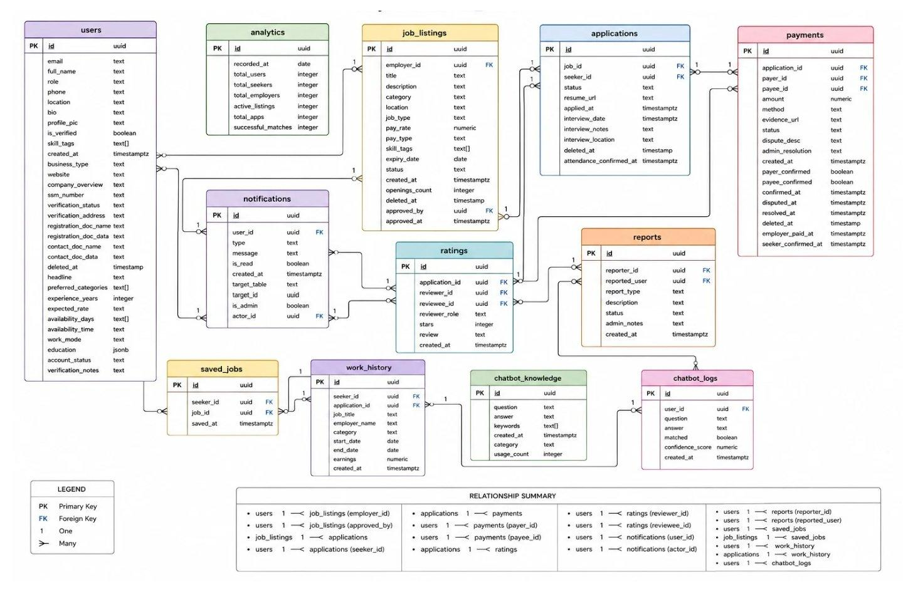

Figure 3.19: Entity-Relationship Diagram (ERD)

### 3.9.5 Data Dictionary

The Data Dictionary offers a detailed description of each of the EasyEarn Supabase PostgreSQL database's columns. The column name, data type, constraints that can be applied to the column, and a description in plain English of what the column represents are all provided in each table entry. All primary keys are based on Universally Unique Identifiers (UUIDs) created by gen_random_uuid(), and RLS is applied on all twelve tables to ensure that users can only access data for which they have permissions. 3.9.5.1 users The users table is the central table of the EasyEarn database. It contains all registered user accounts, including job seekers, employers and administrators. The personal profile information, such as skills, availability, education, and similar data, is stored in a single record along with the employer-specific data, such as Suruhanjaya Syarikat Malaysia (SSM) number, verification documents, etc., and irrelevant fields are kept as NULL based on the role of the user. Table 3.10 shows the data dictionary for the users table, which defines the names, data types, constraints, and descriptions of the table columns.

**Table 3.10: Data Dictionary - users**

Column Name Data Type Constraint Description id UUID PK, NOT NULL Unique identifier for every user record email TEXT NOT NULL User's login email address full_name TEXT NOT NULL User's full display name role TEXT NOT NULL Account role: job_seeker / employer / admin phone TEXT NULL Contact phone number location TEXT NULL User's state or city bio TEXT NULL Short personal or company description profile_pic TEXT NULL Uniform Resource Locator (URL) to the uploaded profile photo is_verified BOOLEAN DEFAULT false Employer verification flag skill_tags TEXT[] NULL An array of skills for job matching headline TEXT NULL Short professional headline preferred_categories TEXT[] NULL Job categories the seeker is interested in experience_years INTEGER NULL Years of work experience expected_rate TEXT NULL Preferred pay rate availability_days TEXT[] NULL Available working days availability_time TEXT NULL Available working time range work_mode TEXT NULL Preferred work mode: remote/onsite education JSONB NULL Education data in JavaScript Object Notation (JSON) format. business_type TEXT NULL Employer business type (employer only) website TEXT NULL Company website URL (employer only) company_overview TEXT NULL Company description (employer only) ssm_number TEXT NULL SSM company registration number verification_status TEXT NULL Verification state: pending/approved/rejected verification_address TEXT NULL Registered business address registration_doc_name TEXT NULL SSM document file name registration_doc_data TEXT NULL SSM document stored as base64 contact_doc_name TEXT NULL Contact person document file name contact_doc_data TEXT NULL The contact person document is stored as base64 verification_notes TEXT NULL Instructions for administering a note about the verification result account_status TEXT DEFAULT 'active' Account state: active / suspended deleted_at TIMESTA MP NULL Soft delete timestamp; NULL means active created_at TIMESTA MP DEFAULT now() Account creation timestamp 3.9.5.2 job_listings The easyearn job_listings table contains all the job postings made by employers on the EasyEarn platform. Each record is foreign-keyed to the user ’s table to identify the employer and documents the entire process of a listing from creation to admin approval to its expiration. Job Seekers can view active job listings that have been approved for publication. The data dictionary for the job_listings table is shown in Table 3.1 1, which lists the columns that store all the jobs posted by the employers on the platform.

**Table 3.11: Data Dictionary - job_listings**

Column Name Data Type Constraint Description id UUID PK, NOT NULL Unique identifier for each job listing employer_id UUID FK → users.id The employer who created the listing title TEXT NOT NULL Job title displayed to job seekers description TEXT NULL Full job description and requirements category TEXT NULL Job category (e.g. F&B, Events, Delivery) location TEXT NOT NULL Job location by state or city job_type TEXT NULL Employment type: part-time / gig / flexible pay_rate NUMERIC NULL Pay amount offered pay_type TEXT NULL Pay basis: hourly / daily skill_tags TEXT[] NULL Required skills for the role expiry_date DATE NULL Application closing date openings_count INTEGER DEFAULT 1, ≥ Number of available vacancies status TEXT DEFAULT 'open' Listing status: open / closed approved_by UUID FK → users.id Admin who approved the listing approved_at TIMESTAMP NULL Timestamp when the listing was approved deleted_at TIMESTAMP NULL Soft delete timestamp; NULL means active created_at TIMESTAMP DEFAULT now() Listing creation timestamp 3.9.5.3 applications The applications table stores all of a job seeker's applications. It monitors the entire application process from submission to employer evaluation to acceptance or rejection and also records the interview scheduling information after an employer has provi ded a short list of candidates. Table 3.12 provides a complete listing of the data dictionary for the applications table, which includes information on the columns used to capture the lifecycle of each job seeker's application.

**Table 3.12: Data Dictionary - applications**

Column Name Data Type Constraint Description id UUID PK, NOT NULL Unique identifier for each application job_id UUID FK → job_listings.id The job listing that was applied to seeker_id UUID FK → users.id Job seeker who submitted the application status TEXT DEFAULT 'pending' Application status: pending/reviewed/interview/ accepted/completion_pendin g/completed/rejected resume_url TEXT NULL URL to the submitted resume file applied_at TIMESTAMP DEFAULT now() Timestamp when the application was submitted interview_date TIMESTAMP NULL Scheduled interview date and time interview_notes TEXT NULL Employer notes on the interview interview_location TEXT NULL Interview venue or Google Meet attendance_confirmed_at TIMESTAMP NULL Timestamp when attendance was confirmed deleted_at TIMESTAMP NULL Soft delete timestamp; NULL means active 3.9.5.4 payments The payments table documents all payments made by employers to job-seekers after a job is finished. It handles all payments from start to finish, including confirmation by both parties, filing of disputes and administrative resolution. Payment evidence is saved as a URL link to a screenshot uploaded with evidence. The payments table contains a set of data columns to record and track every payment transaction between the employer and the job seeker, as shown in Table 3.13.

**Table 3.13: Data Dictionary - payments**

Column Name Data Type Constraint Description id UUID PK, NOT NULL Unique identifier for each payment record application_id UUID FK → applications.id Application this payment is linked to payer_id UUID FK → users.id The user who made the payment payee_id UUID FK → users.id The user who received the payment amount NUMERIC NOT NULL Payment amount in Malaysian Ringgit (MYR) method TEXT DEFAULT 'DuitNow' Payment method used evidence_url TEXT NULL URL to the uploaded payment proof screenshot status TEXT DEFAULT 'pending' The payment status is pending/confirmed/disputed/ resolved dispute_desc TEXT NULL Description of the payment dispute admin_resolution TEXT NULL Admin resolution note for the dispute payer_confirmed BOOLEAN DEFAULT false Whether the payer confirmed the payment payee_confirmed BOOLEAN DEFAULT false Whether the payee confirmed receipt confirmed_at TIMESTAMP NULL Timestamp when payment was confirmed disputed_at TIMESTAMP NULL Timestamp when the dispute was raised resolved_at TIMESTAMP NULL Timestamp when the dispute was resolved employer_paid_at TIMESTAMP NULL Timestamp employer marked as paid seeker_confirmed_at TIMESTAMP NULL Timestamp seeker acknowledged receipt deleted_at TIMESTAMP NULL Soft delete timestamp; NULL means active created_at TIMESTAMP DEFAULT now() Record creation timestamp 3.9.5.5 ratings The ratings table enables Employers and Job Seekers to rate and review each other after job completion, thereby supporting the Bidirectional Rating and Review System. Each rating is attached to a specific use, and it includes the role that the user placed it in, the star score and an optional written rating in order to create a platform of trust and accountability. The data dictionary for the ratings table is shown in Table 3.14, which lists the columns that are used to implement the bidirectional ratings and reviews between employers and job seekers.

**Table 3.14: Data Dictionary - ratings**

Column Name Data Type Constraint Description id UUID PK, NOT NULL Unique identifier for each rating record application_id UUID FK → applications.id Completed application this rating is for reviewer_id UUID FK → users.id The user who submitted the rating reviewee_id UUID FK → users.id The user who received the rating reviewer_role TEXT NULL Role of the reviewer: employer / job_seeker stars INTEGER NULL Star rating from 1 (lowest) to 5 (highest) review TEXT NULL Written review comment created_at TIMESTAMP DEFAULT now() Timestamp when the rating was submitted 3.9.5.6 reports The reports table contains all user-generated reports of suspicious activity on the site, whether that pertains to job scams, fake listings, or non-paying employers. Admin review and resolution is the backbone of EasyEarn's safety and trust system, with ea ch report being reviewed and resolved by an admin. All user-submitted reports of suspicious activity for administrator review are stored in the columns defined in the data dictionary of the reports table, which can be seen below in Table 3.15.

**Table 3.15: Data Dictionary - reports**

Column Name Data Type Constraint Description id UUID PK, NOT NULL Unique identifier for each report record reporter_id UUID FK → users.id The user who filed the report reported_user UUID FK → users.id The user who is being reported report_type TEXT NULL Type of report: scam / fake_listing / non_payment description TEXT NULL Detailed description of the reported issue status TEXT DEFAULT 'pending' Report status: pending/reviewed/resolved admin_notes TEXT NULL Admin's investigation and action notes created_at TIMESTAMP DEFAULT now() Timestamp when the report was submitted 3.9.5.7 saved_jobs The saved_jobs table provides the job wishlist capability, which lets job-seekers save jobs they are interested in viewing later. Each record is an association between a job seeker and one particular job listing, with the time of entry into the record. Table 3.16 shows the data dictionary for saved_jobs, which contains a list of the columns included in the table to store details of jobs that are bookmarked by job seekers for future consideration.

**Table 3.16: Data Dictionary - saved_jobs**

Column Name Data Type Constraint Description id UUID PK, NOT NULL Unique identifier for each saved job record seeker_id UUID FK → users.id Job Seeker who marked this listing as a favourite job_id UUID FK → job_listings.id Job listing that was saved saved_at TIMESTAMP DEFAULT now() Timestamp when the job was saved 3.9.5.8 work_history The work_history table is used to keep a history of all Gig Jobs that a job seeker has finished on EasyEarn that can be verified. Job seeker records are automatically generated when jobs are completed and information is automatically synced into the job seeker's work history dashboard and an auto-generated PDF resume using jsPDF. Table 3.1 7 is the data dictionary of the work_history table, where the columns are used to automatically log and store each job seeker's gig completion data.

**Table 3.17: Data Dictionary - work_history**

Column Name Data Type Constraint Description id UUID PK, NOT NULL Unique identifier for each work history entry seeker_id UUID FK → users.id Job Seeker who owns this work history record application_id UUID FK → applications.id Completed application associated with this work history record job_title TEXT NOT NULL Title of the completed job employer_name TEXT NULL Name of the employer for this job category TEXT NULL This entry's category of jobs start_date DATE NULL Date the job started end_date DATE NULL Date the job ended earnings NUMERIC NULL Total earnings from this completed job created_at TIMESTAMP DEFAULT now() Timestamp when the record was created 3.9.5.9 notifications Notifications is the table that contains all the notifications sent out by the system to users on the platform. An event, like a new application being received, an application status change, or a verification result, triggers notifications. Every record in dicates if the recipient has read the notification. Table 3.18 is the data dictionary for the notifications table, which describes the columns that can be used to store and manage all the system-generated notifications that are sent to the users of the platform.

**Table 3.18: Data Dictionary - notifications**

Column Name Data Type Constraint Description id UUID PK, NOT NULL Unique identifier for each notification user_id UUID FK → users.id The user who receives this notification actor_id UUID FK → users.id The user who triggered the notification event type TEXT NULL Notification type (e.g. application_update) message TEXT NULL The notification message content is displayed to the user is_read BOOLEAN DEFAULT false Whether the user has read this notification is_admin BOOLEAN DEFAULT false Whether this is an admin-targeted notification target_table TEXT NULL Name of the related database table target_id UUID NULL UUID of the related record in target_table created_at TIMESTAMP DEFAULT now() Timestamp when the notification was created 3.9.5.10 chatbot_knowledge EasyEarn's rule-based chatbot utilises the chatbot_knowledge table as its knowledge base. Every entry contains a sample question, a group of matching keywords and a prepared response. The chatbot looks for these words at runtime and returns relevant guidance without having to rely on an external AI service. The data dictionary for the chatbot_knowledge table, which contains the columns of the rule-based chatbot's question-answer knowledge base, is presented in Table 3.19 below.

**Table 3.19: Data Dictionary - chatbot_knowledge**

Column Name Data Type Constraint Description id UUID PK, NOT NULL Unique identifier for each knowledge entry question TEXT NOT NULL Sample question used for chatbot matching answer TEXT NOT NULL Chatbot response returned when matched keywords TEXT[] NULL An array of keywords to match logic based on rules category TEXT NULL Knowledge category: general / jobs usage_count INTEGER DEFAULT 0 Number of times this entry has been matched created_at TIMESTAMP DEFAULT now() Timestamp when the entry was created 3.9.5.11 chatbot_logs The chatbot_logs table has all the logs of the users interacting with the EasyEarn chatbot. Each log entry includes the user's question, the response of the chatbot, a boolean indicating whether a knowledge base match was found and the confidence score for that match. This information can be used by the administrator to track the performance of the chatbot and determine any knowledge gaps. The data dictionary for table chatbot_logs is shown in Table 3.20 and includes the definition of every column that is used to store every interaction of the user with the EasyEarn chatbot.

**Table 3.20: Data Dictionary - chatbot_logs**

Column Name Data Type Constraint Description id UUID PK, NOT NULL Unique identifier for each chatbot interaction log user_id UUID FK → users.id User who interacted with the chatbot; NULL if anonymous question TEXT NULL Question or message sent by the user answer TEXT NULL Response returned by the chatbot matched BOOLEAN DEFAULT false Whether the question is a match for a knowledge base confidence_score NUMERIC NULL Matching confidence score from the rule-based engine created_at TIMESTAMP DEFAULT now() Timestamp when the interaction was logged 3.9.5.12 analytics Admin Dashboard is dynamically calculated from user, jobs, reports and other tables within the core platform. These metrics can be stored periodically in the analytics table as snapshots for historical reference, which is an option. Every snapshot record s tores the number of total users, jobs and applications that are active on the platform at the time of the snapshot and can be monitored as overall growth and activity of the platform through the Chart.js visualisation. Table 3.21 is the data dictionary for the analytics table that holds this periodic snapshot data.

**Table 3.21: Data Dictionary - analytics**

Column Name Data Type Constraint Description id UUID PK, NOT NULL Unique identifier for each analytics snapshot recorded_at DATE DEFAULT CURRENT_DATE Date this snapshot was recorded total_users INTEGER DEFAULT 0 Total number of registered user accounts total_seekers INTEGER DEFAULT 0 Total number of job seeker accounts total_employers INTEGER DEFAULT 0 Total number of employer accounts active_listings INTEGER DEFAULT 0 Number of currently active job listings total_apps INTEGER DEFAULT 0 Total number of applications submitted successful_matches INTEGER DEFAULT 0 Total number of completed jobs

### 3.9.6 Use Case Diagram

A use case diagram is a behavioural diagram in the Unified Modelling Language (UML) that shows the interactions between the external actors and the functional use cases of the system [90]. Figure 3.20 shows three main actors in EasyEarn: Job Seeker, Employer and Admin. The use cases are grouped according to the functions available to each actor. The Job Seeker Module consists of 11 use cases: Browse and Search Jobs, Save Jobs, Apply for Jobs, Track Applications, View Interviews, Chatbot Assistance, Build Resume/Profile, View Work History, Messaging/Chat, Receive Notifications, and Rate Employer. The Employer Module contains 9 use cases: Post Job Listing, Manage Job Listings, View Applicants, Manage Hiring Pipeline, Company Profile, Messaging/Chat, Submit Verification Request, Rate Job Seekers, and Chatbot Assistance. The Admin Module has 6 use cases: User Management, Job Moderation, Approve Employer Verification, Platform Analytics, Handle Reports, and Chatbot Assistance. The <<notify>>, <<moderate>> and <<verify>> stereotype connectors show relationships between modules because of the cross-role dependencies in the platform's trust and safety architecture. The dedicated Interviews page is the implementation of the View Interviews use case, and is where Job Seekers can view scheduled interview appointments for upcoming, confirmed and completed interviews created by Employers. The Application Status Timeline also includes the status of applications for interviews.

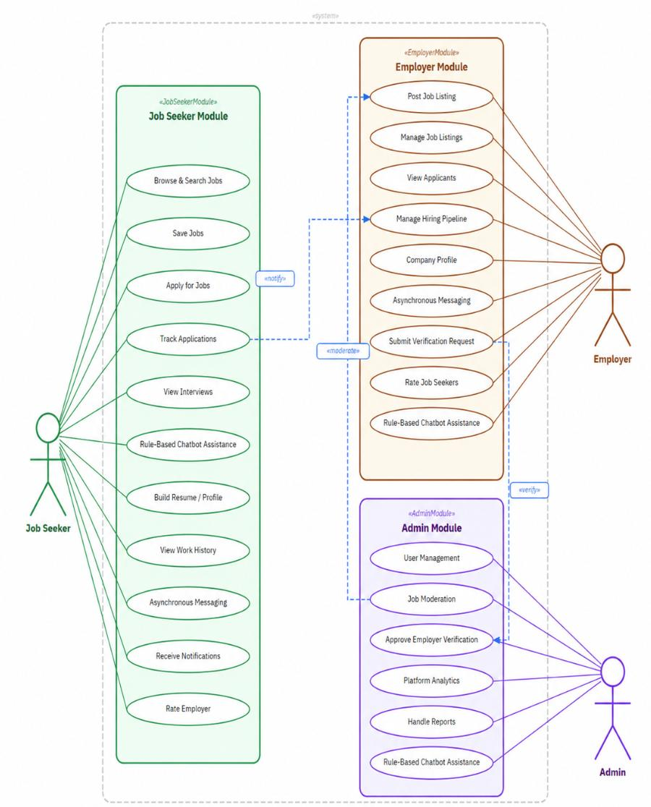

Figure 3.20: Use Case Diagram

### 3.9.7 System Flow

System flow diagrams show a logical sequence of operations, decision points, and interactions between various components of a process in a system, as a structured visual recipe for the logic of the operations performed by the system [21]. There are four system workflow diagrams for EasyEarn: Full System Workflow, Job Seeker Workflow, Employer Workflow, and Admin Workflow. Full System Workflow Figure 3.21 shows the overall workflow between all three user roles, called a Full System Workflow. Users visit EasyEarn, register and choose their role. The Job Seeker Portal is used to direct job seekers to look at and apply for jobs. Employers are referred to the Employer Portal, where they can post jobs and look at applicants. The Admin Portal enables administrators to check employers and to manage the reports. All three flows stream into the Job Matching and Application Module, an application lifecycle management module from submission to completion of the job. Once the job is finished, both parties agree on the payment and provide ratings, which completes the transactional cycle.

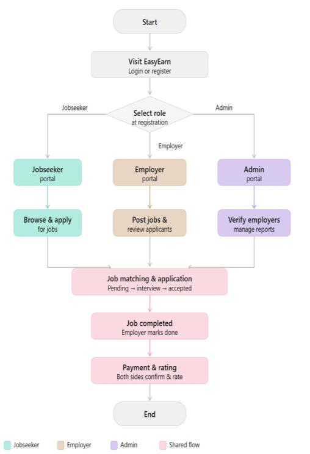

Figure 3.21: Full System Workflow

Job Seeker Workflow The Job Seeker Workflow starts with registration, followed by profile setup, including skills, availability and profile photo. The Job Seeker then browses job listings by category and location and applies for a suitable job. If shortlisted, the Job Seeker attends the scheduled interview. If subsequently accepted, the Job Seeker proceeds with the job. After the work is completed, the Employer confirms payment and the Job Seeker confirms receipt before the application is marked as completed. The completed job is then added to the Job Seeker's work history, and the Job Seeker can rate and review the Employer. If the application is rejected, the Job Seeker can continue applying for other available jobs. Figure 3.22 shows the Job Seeker workflow in EasyEarn, starting from registration and profile setup, and proceeding with the job application and job completion, up to the Employer rating.

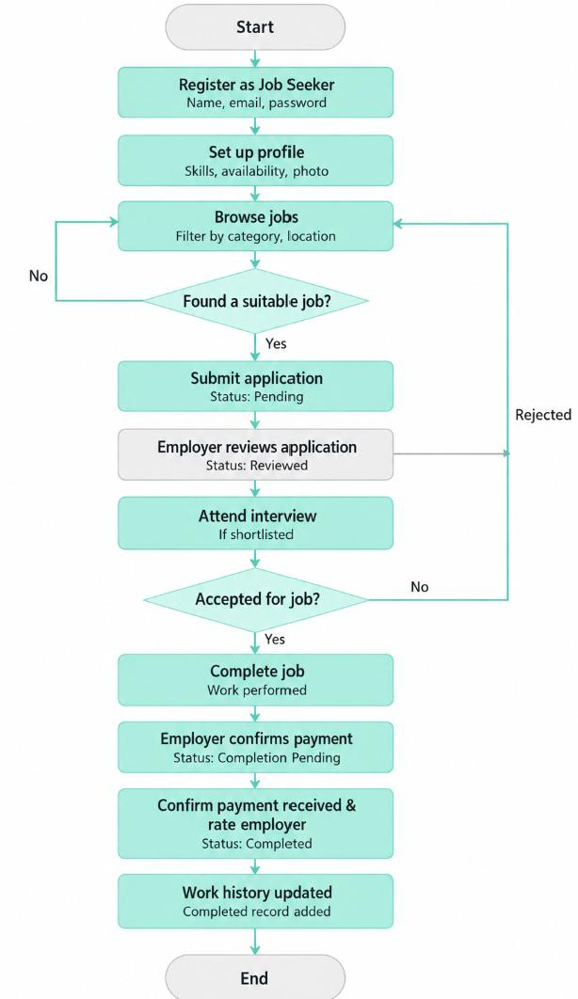

Figure 3.22: Job Seeker System Workflow

Employer Workflow Employer registration is done through an Employer Code and submission of Employer KYB documents (SSM number and Business documents) to the Administrator for review. The employer will be issued a Verification Badge upon approval. The employer then publishes jobs, checks applicants' profiles, accepts and rejects applicants, arranges interviews, records the attendance of the job seeker, uploads evidence of payment and rates the job seeker. Figure 3.23 shows the Employer workflow in EasyEarn, including the registration process, the submission of KYB documents, job posting, applicant management and payment confirmation.

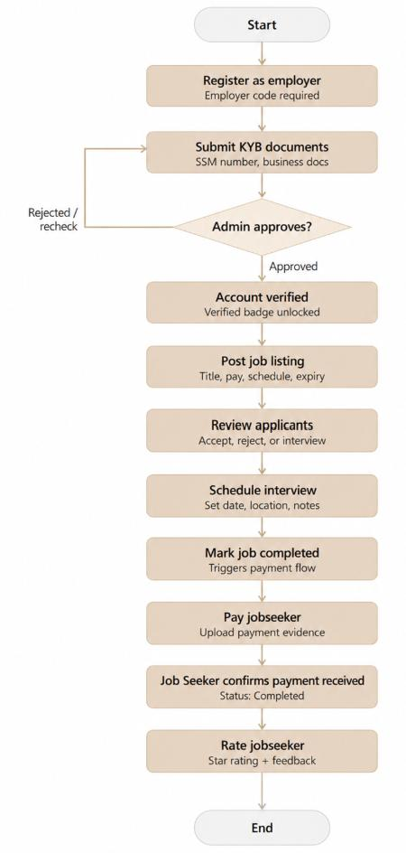

Figure 3.23: Employer System Workflow

Admin Workflow This is the Admin Workflow, which starts with login using a valid Admin account. Once the Administrator logs into the Admin Dashboard, he/she is presented with 3 paths from which to select a task to perform: Verify (to review the employer KYB documents and approve/reject); Reports (to triage received user reports and take action based on the same such as warning, suspend, or resolve); Users (to view, suspend, or restore user accounts). Once complete, the Administrator is able to review the platform analytics, which includes platform metrics, user and job information, and then decides whether to complete more tasks. The EasyEarn Admin workflow is detailed in Figure 3.24, with secure login, employer verification review, report management, user account management and platform analytics review.

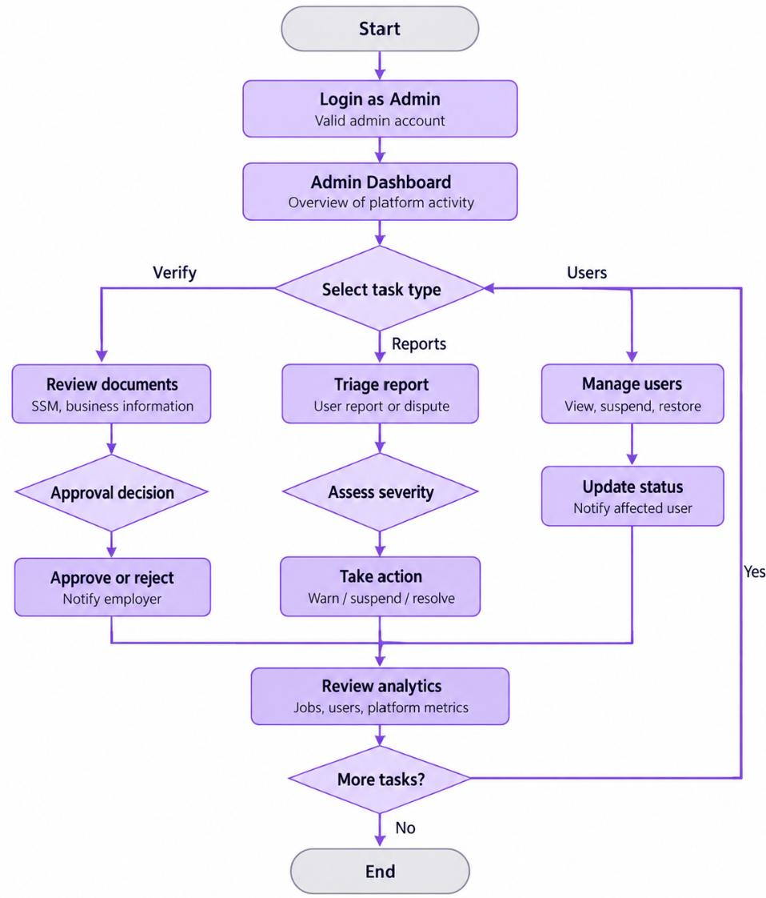

Figure 3.24: Admin System Workflow

## 3.10 Wireframe

Wireframes are low-fidelity sketches of a UI that outline the elements, hierarchy and functionality of each screen without being concerned with the visual design elements like typography and colour [91]. The wireframes were created using the Canva app and act as the UI/UX prototype for the EasyEarn project throughout the Agile sprint phases. Below, each wireframe is shown with a description of its main features and the reasoning behind its design.

### 3.10.1 Landing Page (Index)

The Landing Page (Index) is the front page of EasyEarn that is visible to everyone before logging in or registering. The page has a hero section that includes a prominent tagline, “Find Jobs. Hire Talent. EasyEarn,” and two main call-to-action buttons: “Find a Job” and “Post a Job”. The platform's value proposition, including the Why EasyEarn section that provides six key features (Verified Employers, Auto Resume, Location Filter, Instant Apply, Messaging, and Analytics), the Browse Opportunities section, a Project Scope and Modules summary, and a Functionalities and Security overview, is listed below the hero section. The page ends with a "Create Free Account" link and a footer with navigation links. Figure 3.25 shows the wireframe for the EasyEarn Landing Page, featuring the hero section, call-to-action buttons, and platform feature highlights.

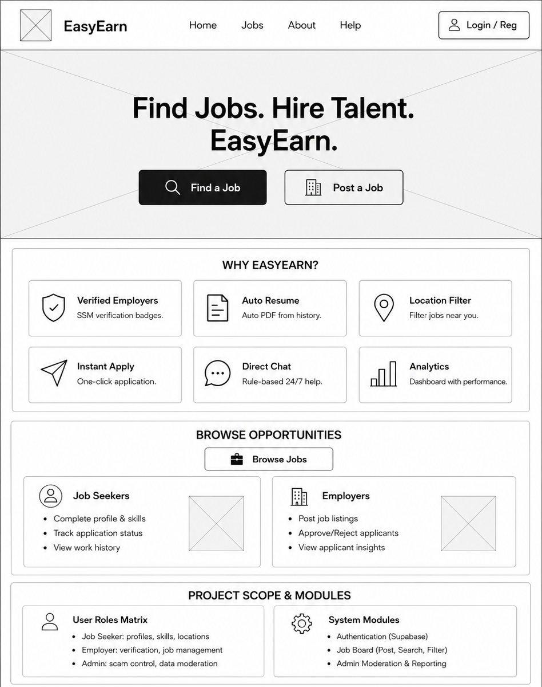

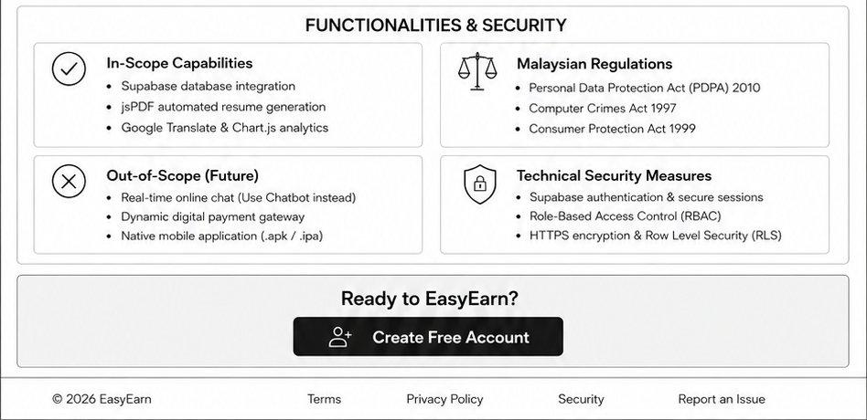

Figure 3.25: Wireframe for Landing Page (Index)

### 3.10.2 Registration Page

The Register page allows new users to create an EasyEarn account by entering their full name, email, and a password that meets the minimum security requirement of at least 6 characters with one special character. Users need to choose their role, either Job Seeker, Employer or Admin, because this determines what will be available on their dashboard once they log in. If the Employer or Admin role is se lected, then the conditional secure code field will appear, providing further access controls. The account is generated as soon as it is submitted, and the user is directed to their account dashboard. Figure 3.26 shows the wireframe of the Registration Page with fields for the Job Seeker and Employer registration forms.

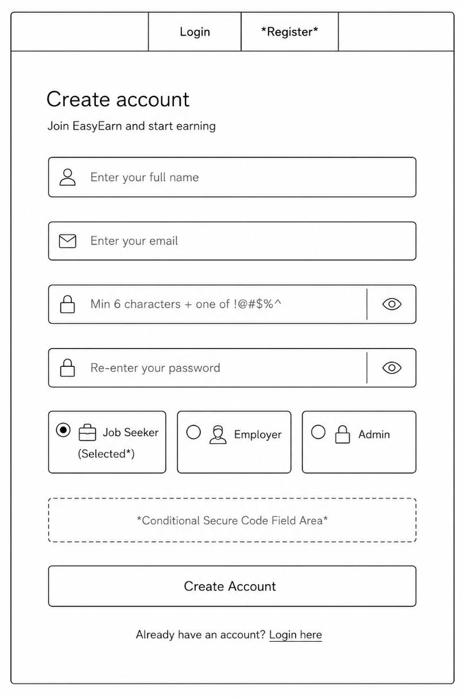

Figure 3.26: Wireframe for Registration Page

### 3.10.3 Login Page

The login page enables existing users to log in with their registered email and password. For convenience, there is a toggle button that shows/hides the password. Users without an account are directed to the Register page via the "Register here" link at the bottom. Figure 3.27 shows the wireframe of the Login Page that includes a role selection box, email and password text boxes.

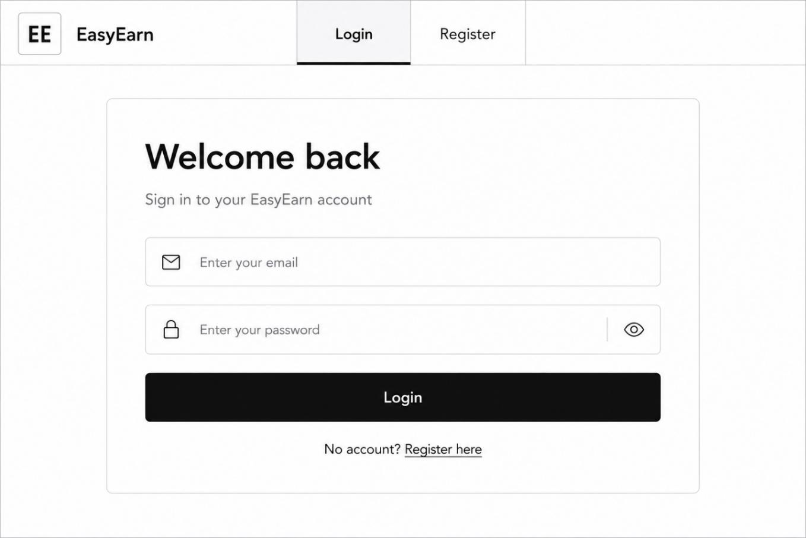

Figure 3.27: Wireframe for Login Page

### 3.10.4 Job Listing Page

The Unified Job Listing Page gives authenticated job seekers access to all available job listings on the platform, or search for jobs by filtering them. The page features a search box to search by title, a filter dropdown to search by location, and an advanced filter button. Job postings are presented as a card listing the job title, the employer, the location, the salary, and the schedule. For wishlisting, there is a Save button on each card, and for immediate application submission, there is an Apply Now button (FR05). There is a Saved Jobs section below the active listings that lists and saves bookmarked jobs, and allows users to delete or directly apply to them (FR07). Figure 3.28 shows the wireframe for a Job Listing Page, featuring job cards that include search and filter functions, as well as save and apply functions.

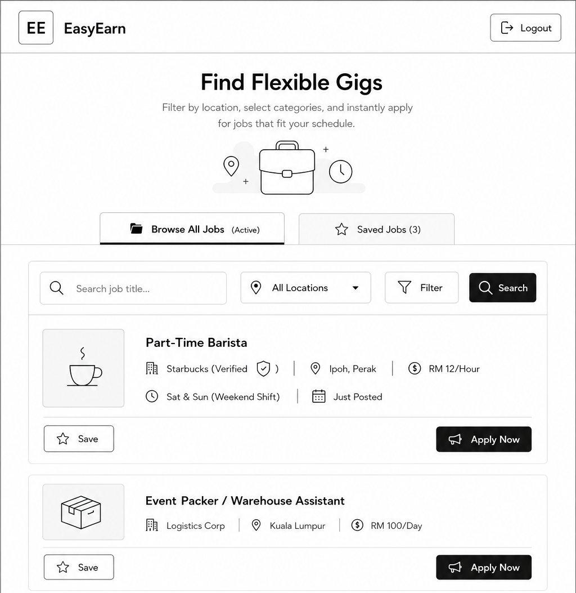

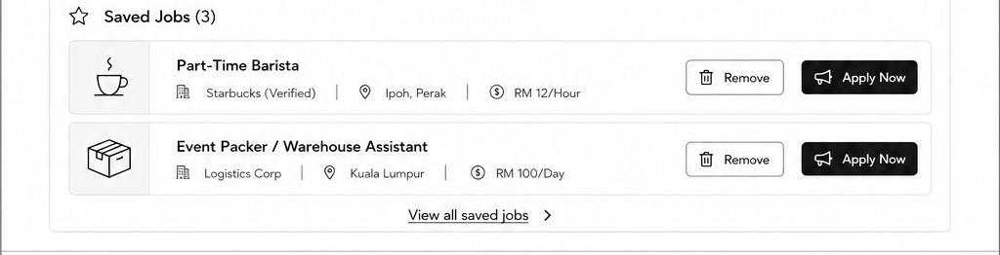

Figure 3.28: Wireframe for Job Listing Page

### 3.10.5 Job Seeker Dashboard

The Job Seeker Dashboard is an authenticated job seeker's personal hub. A welcome banner welcomes the user and shows their name, profile photo and what percentage of the profile is complete. The Overview Snapshot section provides summary data, such as profile completion, which includes a progress bar. Four action cards quickly take you to the key functions of the platform: Update Profile (includes the ability to add a headline, preferences, and skills), Review Applications (shows the status of your applications), Build Resume (auto-generates a PDF resume), and Check Work History (displays completed gigs and payments earn ed). The primary action buttons, “Open Jobs” and “Edit Profile”, are clearly displayed to provide quick access to commonly used functions. The Job Seeker Dashboard's wireframe includes the welcome banner, a progress indicator for completing the profile, and four quick-action cards, as shown in Figure 3.29.

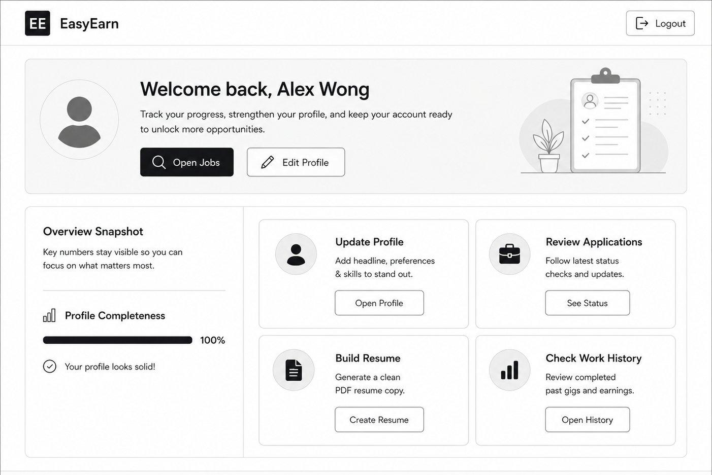

Figure 3.29: Wireframe for Job Seeker Dashboard

### 3.10.6 Job Seeker Resume Builder

The Resume Builder page implements the Auto-Generate Resume feature (FR09) using jsPDF and html2canvas to create a downloadable PDF resume from the Job Seeker's stored profile and work history data [49]. The “Refresh from Profile” button retrieves the latest available data from Supabase and updates the resume preview, while the “Download PDF” button uses jsPDF and html2canvas to generate the PDF on the client side. The auto-generated resume displays an A4 printable preview containing the contact details, location, work mode preferences, profile photo, job seeker name and headline. The resume is divided into 4 sections: Summary and Preferences, Skills (shown as tag ch ips filled with the skill_tags field from the users table), System Metrics Summary (automatically generated from the work_history and ratings tables, showing the number of gigs completed, amount of income tracked, and average job rating), and References (filled with verified employer feedback entries from the ratings table upon gig completion). The resume preview is dynamically generated from the profile, work history and rating data available in Supabase at the time it is refreshed. Figure 3.30 shows the Job Seeker Resume Builder wireframe, which displays the template, including the automatic generation of an A4 PDF template preview and sections for skills, work experience, and employer ratings.

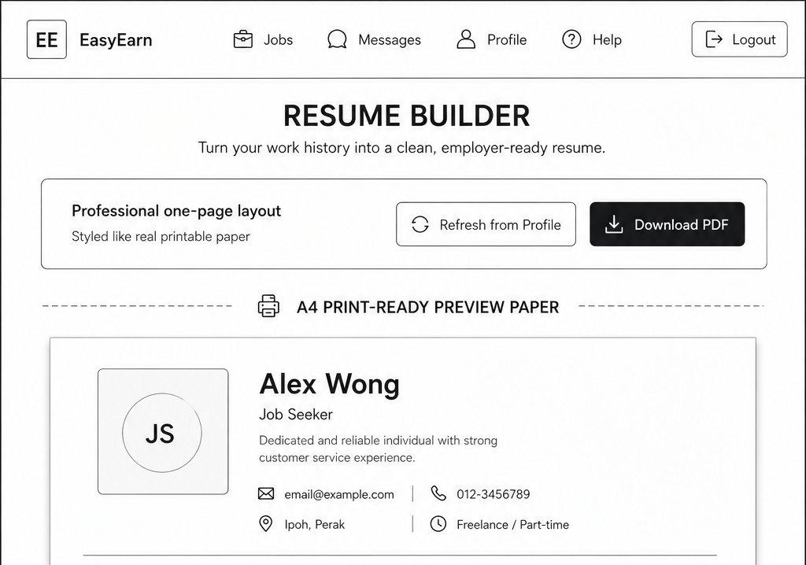

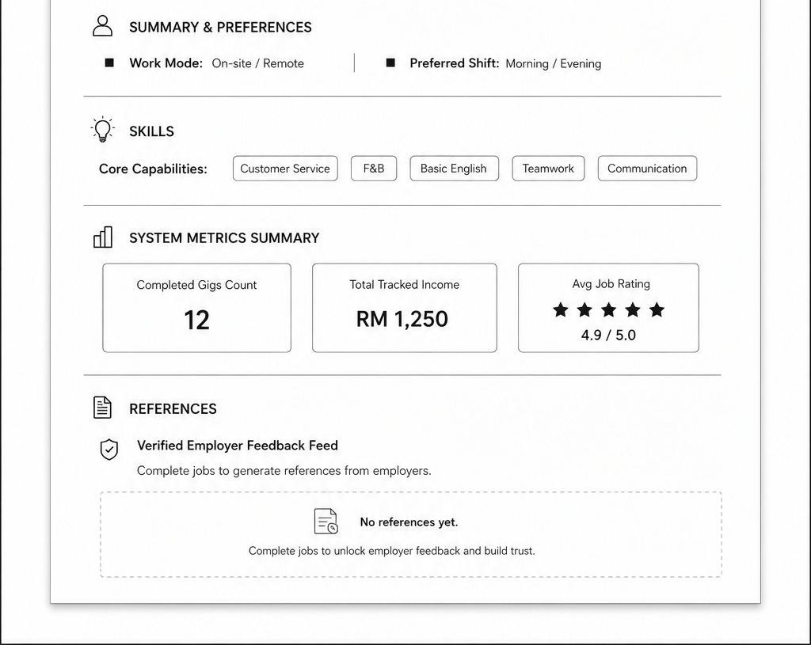

Figure 3.30: Wireframe for Job Seeker Resume Builder (Auto-Generated)

### 3.10.7 Employer Dashboard

The Employer Dashboard gives employers a single view into their hiring activity. The page is split into two panels: the left panel ("Employer Dashboard") displays quick action buttons for Manage Jobs and Edit Profile, while the right panel ("Current Build" ) summarises the employer's connected workflow status. The Active Jobs, Pending Review, Total Applicants and Trust Verified status are shown in four statistics cards at a glance. The bottom section includes a Verification Status Check panel showing the Employer's current verification status and prompting the Employer to complete the verification process where required. Figure 3.31 provides the wireframe for the Employer Dashboard containing statistics cards, verification status and the application breakdown chart.

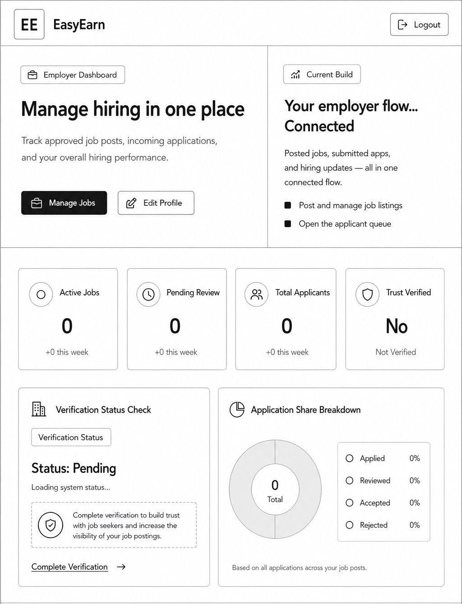

Figure 3.31: Wireframe for Employer Dashboard

### 3.10.8 Employer Manage Jobs

The Manage Jobs page allows the employer to add, edit and track all their job postings in one workspace. The left side shows a Post/Edit Job Listing form with a Publish Job/Save Changes button, and fields for Job Title, Hourly Rate (RM/Hr), State Category, Location State, Area Details, and Job Description. On the right, you will see a dynamically loaded list of Job Post Records that are active, with the title, category icon, posting date, location, and pay rate. Every listing card includes Edit and Applicants buttons for easy management. The Published, Pending Review, Total Applicants, and Completed Gigs counts are displayed at the top of the page as 4 different summary statistics. Figure 3.32 is a wireframe of the Employer Manage Jobs page where the job posting form is displayed and the active job listing records are displayed.

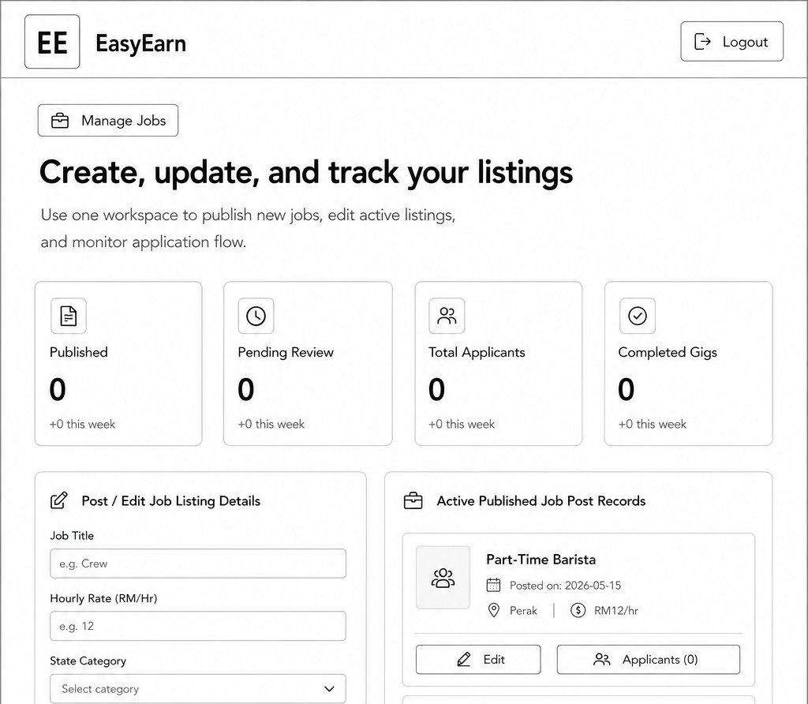

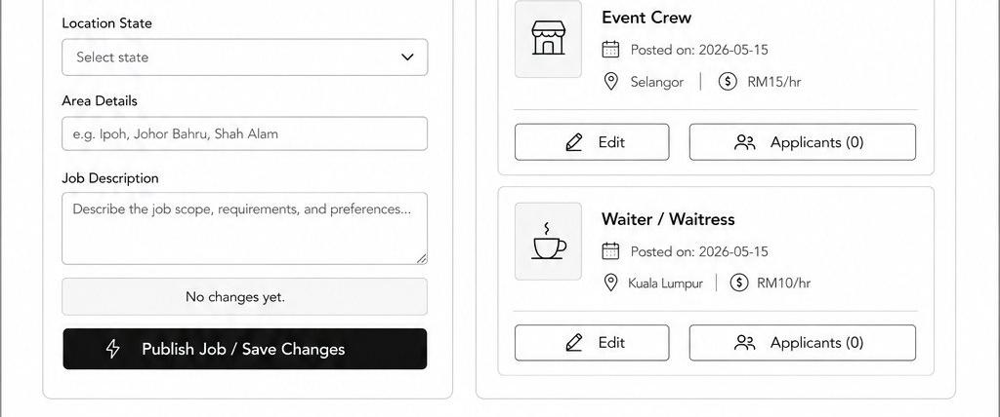

Figure 3.32: Wireframe for Employer Manage Jobs

### 3.10.9 Employer Applicants

The Hiring Pipeline Queue is displayed on the Employer Applicants page and displays all of the applicants from the employer's open job postings. At the top of the page, there are four summary counters: Applied, Reviewed, Accepted, and Completed that show the counts for the current period. A view of each applied job entry in the queue will display the name of the applicant, the job title they applied for, a link to open their auto-generated Resume Summary, and a badge indicating their job's status (Applied, In Review, or Reviewed). There are four action buttons for each applicant: Accept Applicant, Message Seeker, Reject, and Mark as Completed. If the employer clicks on Mark as Completed, a Finalise Completion Details window appears and asks the employer to provide the Final Earnings Paid (RM) and Completed Date before it is finalised. This confirmation will cause the work history to be automatically updated, and the credential to be transferred to the job seeker's profile and update the auto-filled resume information. Figure 3.33 shows the Employer Applicants wireframe with the hiring pipeline queue and applicant action buttons.

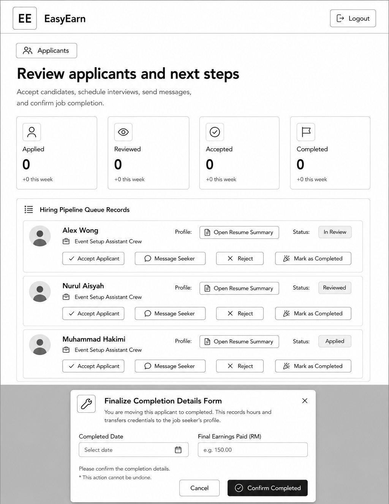

Figure 3.33: Wireframe for Employer Applicants

### 3.10.10 Admin Dashboard

The Admin Dashboard gives the Administrator an overview of the platform. The four statistics cards at the top of the screen show the total number of Users, Reports, Verifications, and Jobs, and include a weekly change indicator. The two main buttons, "Open Reports" and "Review Verifications", are prominently displayed. The lower part of the dashboard breaks down into a Moderation Queue panel, which displays any reports, verifications or job listings that need attention from the admin, and a Database Distribution Metrics panel, which displays a doughnut chart generated using Chart.js that shows the relative distribution of platform data by Users, Reports, Verifications and Jobs. Figure 3.34 is the wireframe for the Admin Dashboard, which displays platform statistics cards, activity stream and the distribution chart of the database.

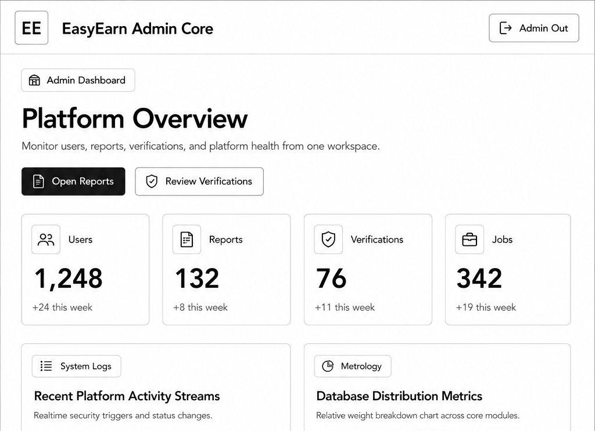

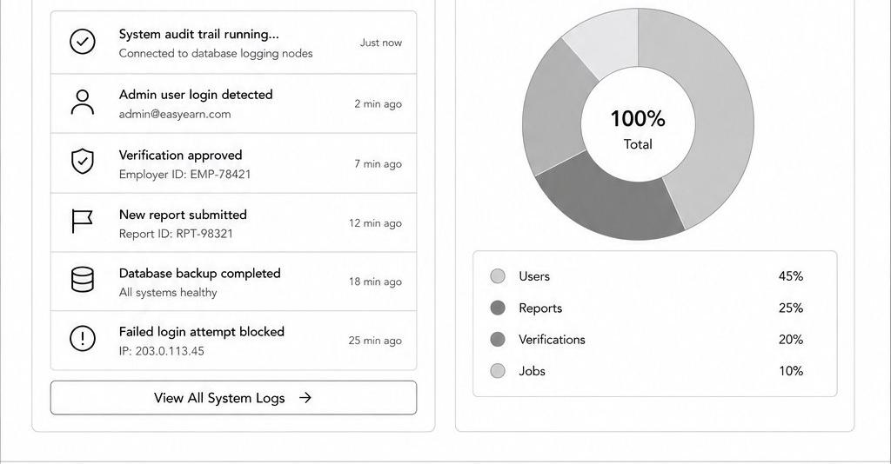

Figure 3.34: Wireframe for Admin Dashboard

### 3.10.11 Admin Job Listing Moderation

The Admin Job Listing Moderation page allows the Admin to view, approve, flag and remove all the job postings from the platform by the employers. There are three summary cards which show Live Jobs, Flagged Jobs and Removed listings. The Hiring Directory Records section offers a Status Filter drop-down and a Search Listings bar to easily moderate listings. A listing record will show the following information: Position Title, Employer Entity, Remuneration Pay-rate, Category Class, Employer ID, flagging reason, and current status badge. A listing has four moderation action buttons: Approve Posting, Flag Listing, Remove Post and View Live Application. This page is the main instrument to ensure high-quality content on the EasyEarn platform and to prevent fraudulent job offers. Figure 3.35 shows the wireframe for the Admin Job Listing Moderation page, which contains listing records and moderation action buttons.

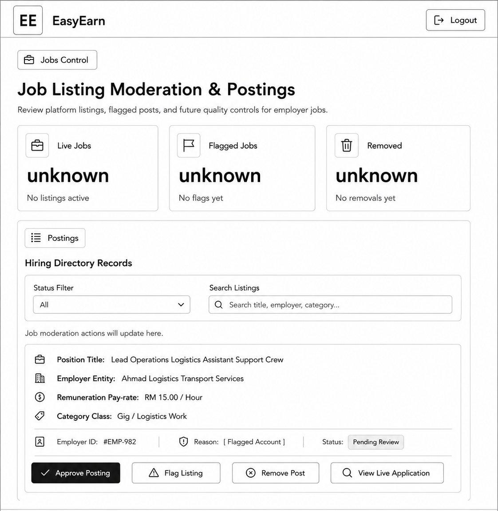

Figure 3.35: Wireframe for Admin Job Listing Moderation

## 3.11 User Interface (UI)

This section presents the key implemented UI screens of the EasyEarn Job Matching Portal, developed based on the wireframe prototypes in Section 3.10.

### 3.11.1 Landing Page (Index)

The Landing Page is the external profile of EasyEarn, which is accessible to everyone without a login. It includes a hero section with two call-to-action buttons ("Find a Job" and "Post a Job"), a platform highlights section, and a Google Translate site redirection for multilingual access on the navigation bar to make it multilingual. Figure 3.36 illustrates the Landing Page design implemented in EasyEarn, which includes the hero section, call-to-action buttons and a Google Translate site redirection for multilingual access.

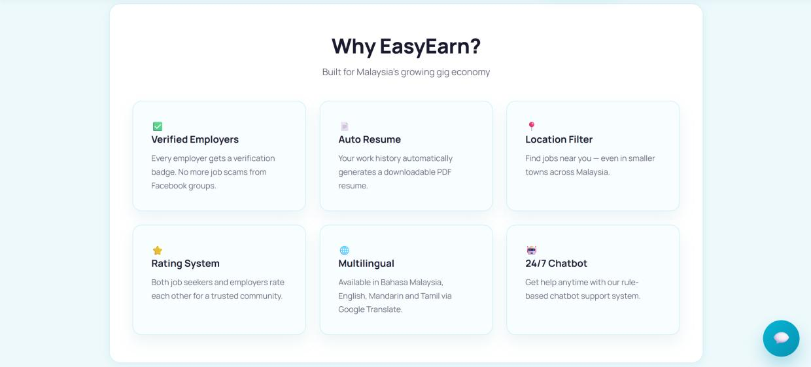

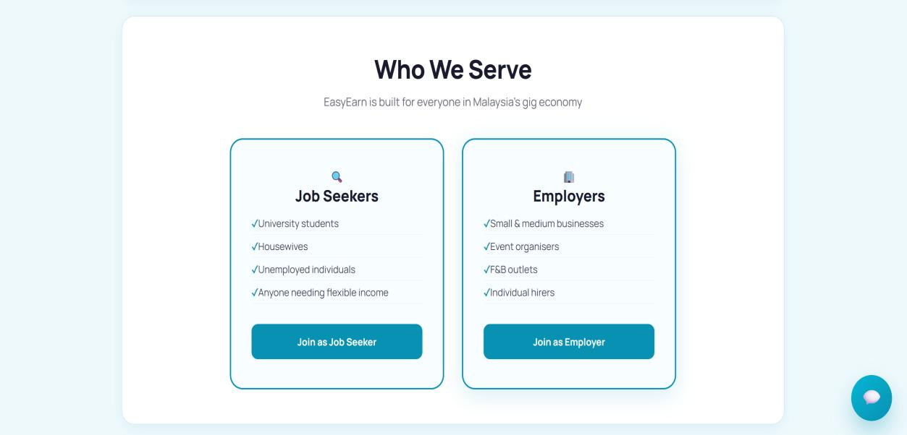

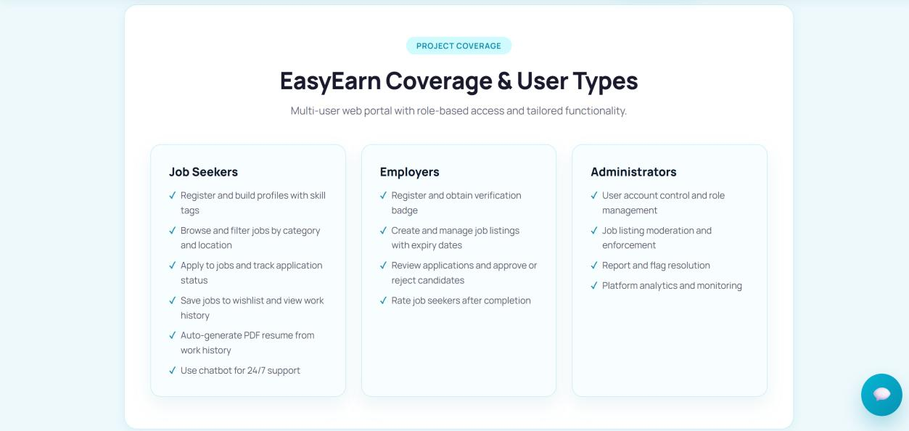

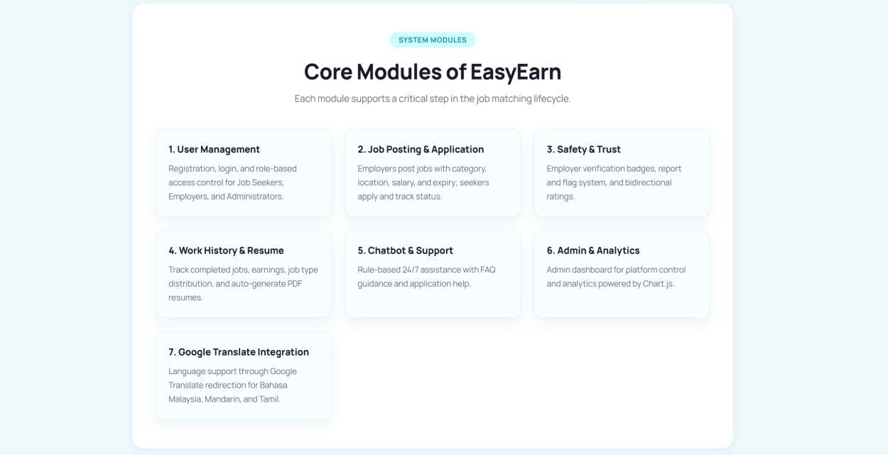

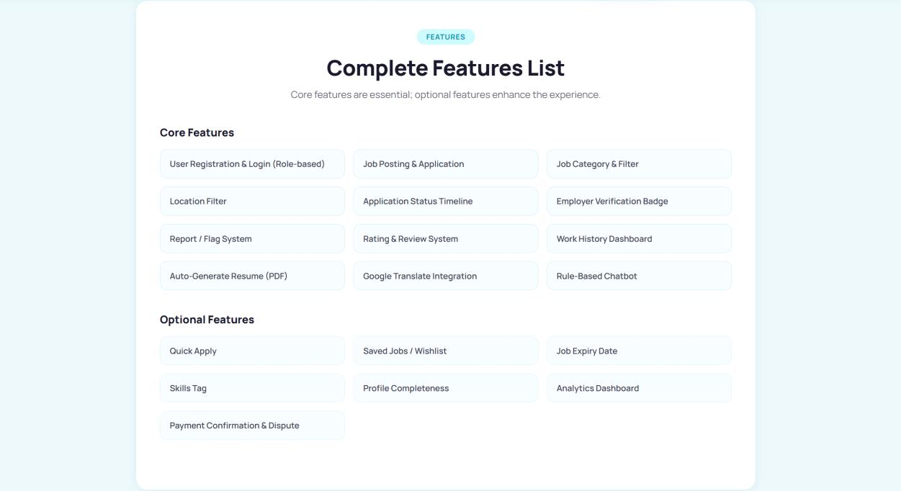

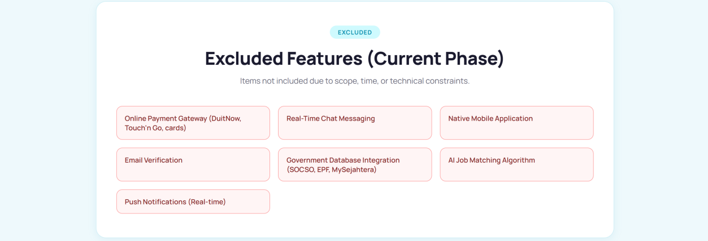

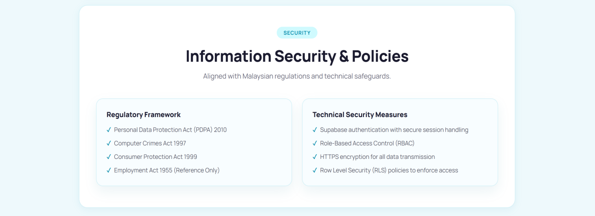

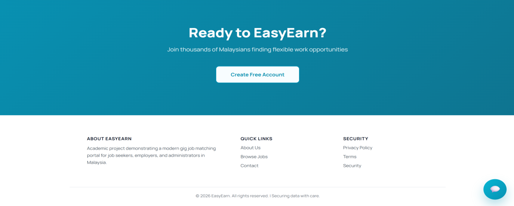

Figure 3.36: Landing Page (Index)

### 3.11.2 About Us Page

The About Us page communicates the purpose of EasyEarn to visitors and describes its mission, target users and development roadmap. It features a Hero banner, a Mission & Vision section that explains the problem being solved and the users of the platform, a development roadmap for FYP1 and FYP2, a series of flip/stacking highlight cards t hat feature three major platform benefits and an overview of the technology stack that was used to create EasyEarn.About Us Page design used in EasyEarn (Mission and Vision, Development Roadmap, Technology stack overview) is shown in Figure 3.37.

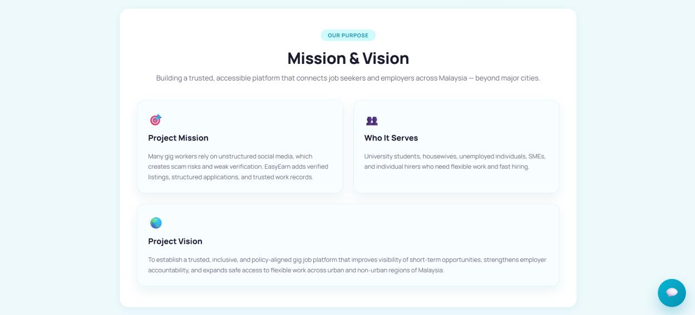

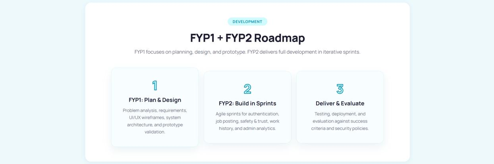

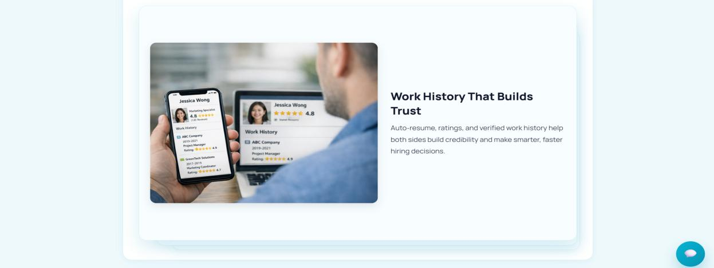

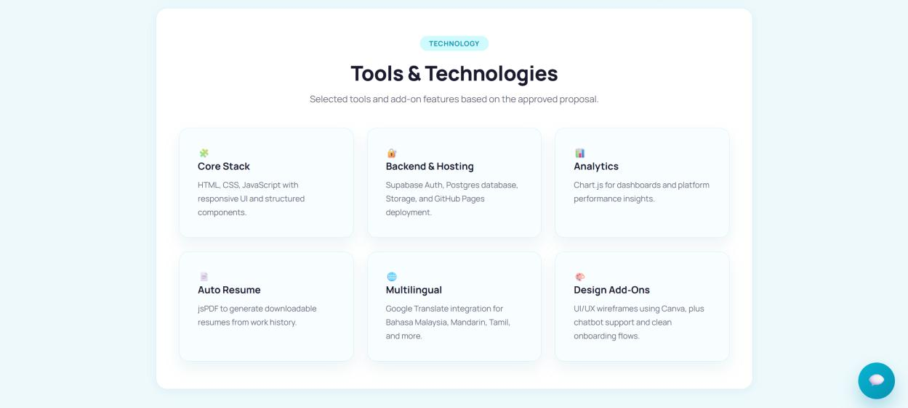

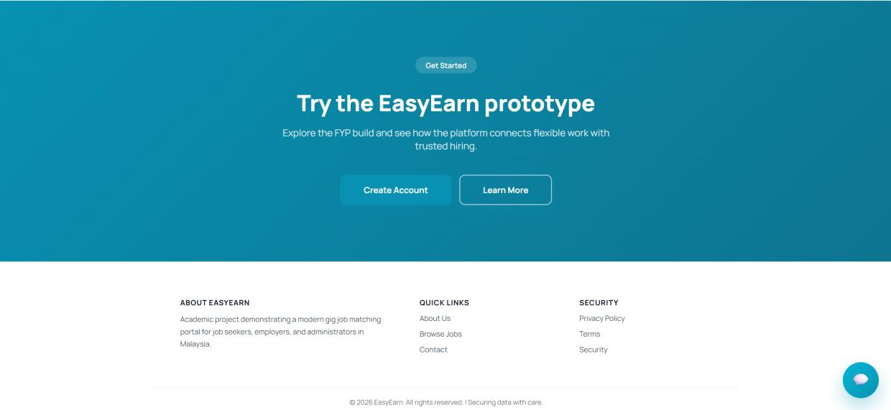

Figure 3.37: About Us Page

### 3.11.3 Help Center Page

The Help Center page is a self-service resource for EasyEarn users, helping to minimise the need for direct contact with the service. It features an FAQ section with expandable accordion items that provide answers to questions about creating an account, employer verification, tracking applications, reporting suspicious listings, protecting data, and resume generation, and a Support section that guides users to use either a chatbot for instant assistance or a contact form with details on how to email and a link to the Report an Issue page. The Help Center Page design implemented in EasyEarn is shown in Figure 3.38, which consists of an FAQ accordion and Support / Contact options.

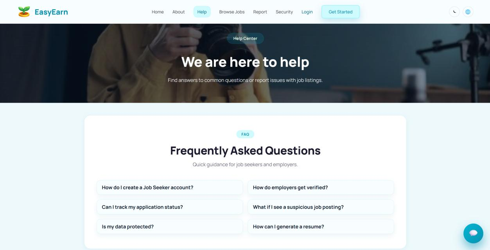

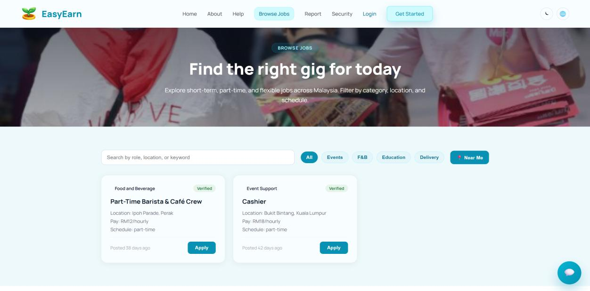

Figure 3.38: Help Center Page

### 3.11.4 Browse Job Page

The Browse Jobs page is the place where job seekers can explore and search to find gig opportunities that are available on EasyEarn. It comprises a search box to find jobs by keyword, category filter pills (Events, F&B, Education, Delivery) and a geolocation option (Near Me) to enable users to select a radius (5-50 km) to find jobs within their current location. Job postings are dynamically displayed in a grid, and loading and empty state indicators are displayed while fetching data and when no corresponding records are found. Figure 3.39 presents the Browse Jobs Page design in EasyEarn, which includes the search and filter toolbar, location-based radius filter and a dynamic listing of jobs in the grid.

Figure 3.39: Browse Job Page

### 3.11.5 Report Page

Users can mark an employer, a job listing, or a payment problem as suspicious to maintain the security of the site. It contains a few fields such as: Reporter Name, Reporter E-mail, Reporter Title, Report Type (Suspicious Listing, Non-paying Employer, Fake Profile, Harassment or Abuse, Other), optional Listing/Profile Link, description field and optional Evidence Upload. A side panel explains how reporting works, what happens when a report is submitted and how to reach the reporting team if you have any que stions about reporting, and a Reporting FAQ section provides answers to common questions about the process of reporting, including questions about confidentiality, evidence required to report, timelines for reviews, and questions about reporting without an account. The Report Page design used in EasyEarn is shown in Figure 3.40 and consists of the report submission form, informational side panel and reporting FAQ.

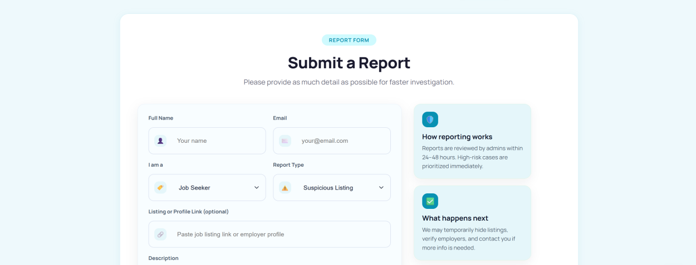

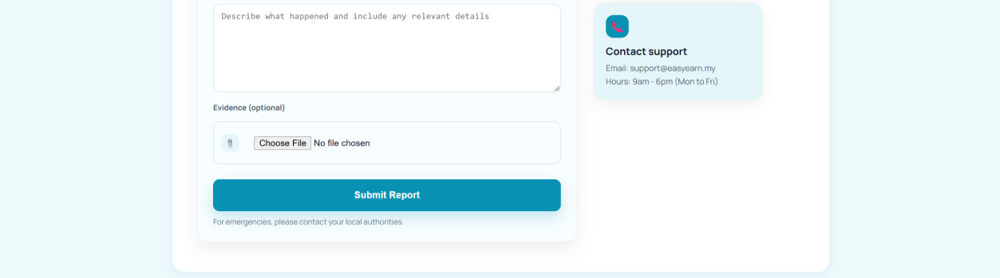

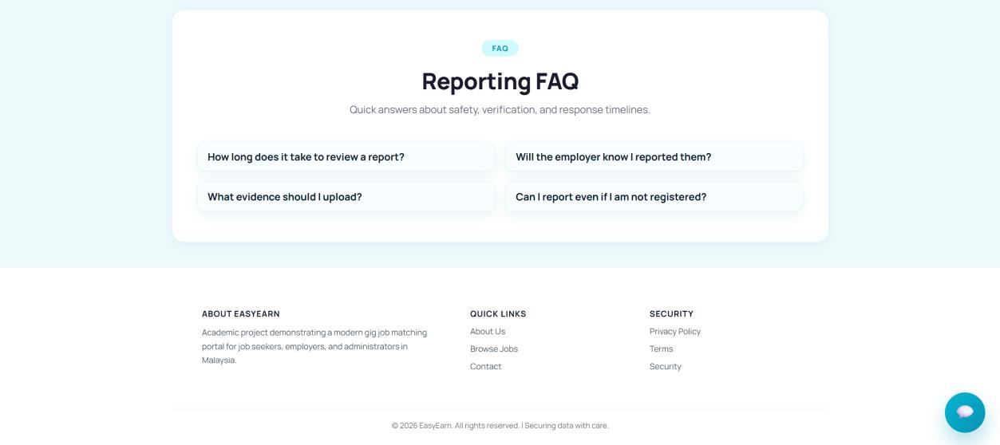

Figure 3.40: Report Page

### 3.11.6 Security Page

The Security page explains the technical measures taken to protect the security of users and platform information in EasyEarn. It also includes Data & Platform Integrity, where it discusses the use of HTTPS encryption, RLS policies that scope reads and writes by user role, and security measures such as security testing and Admin review of reports. A Security FAQ section caps the page with short answers regarding data protection, report handling, data visibility between employers and job seekers, and how to mark suspicious listings. The design of the Security Page in EasyEarn is shown in Figure 3.41, which includes the authentication and access controls, data integrity measures and the security FAQ.

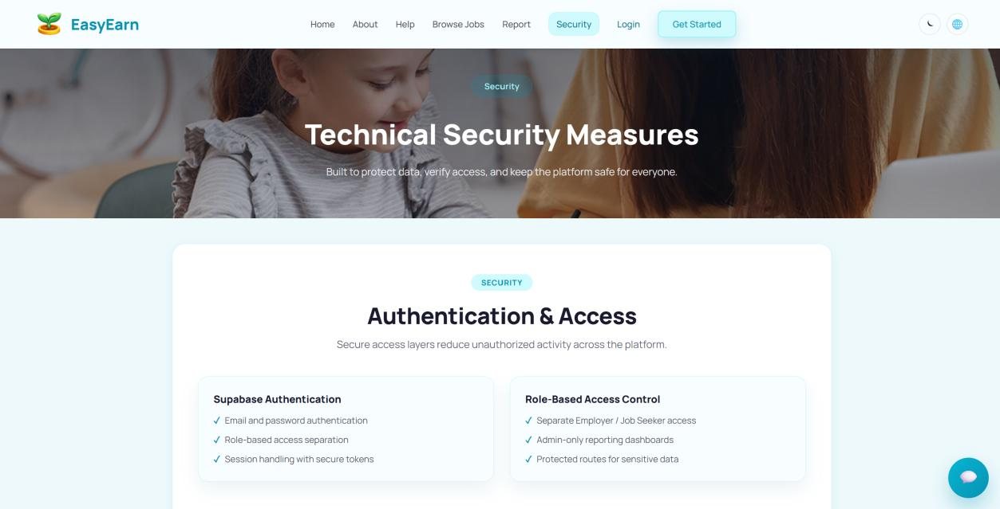

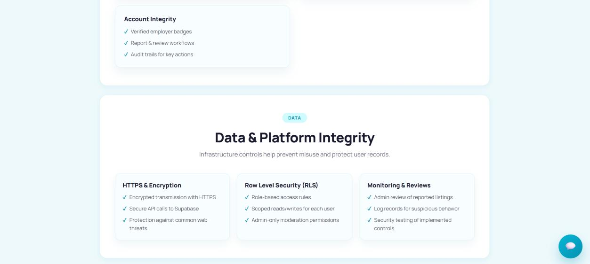

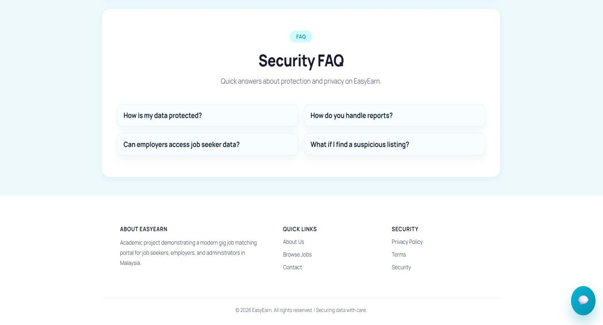

Figure 3.41: Security Page

### 3.11.7 Chatbot Page

The Chatbot page gives a dedicated interface for the user to interact with the EasyEarn Assistant (a rule-based Chatbot) that guides the user on how to use the platform. It features a chat window with a welcome message, a text field and a send button for sending general questions, and quick reply buttons for common topics like sign-up, upload resume, post a job, and report a scam. EasyEarn uses the Chatbot Page design as shown in Figure 3.42, featuring the chat window, input for chatrooms and quick reply shortcuts.

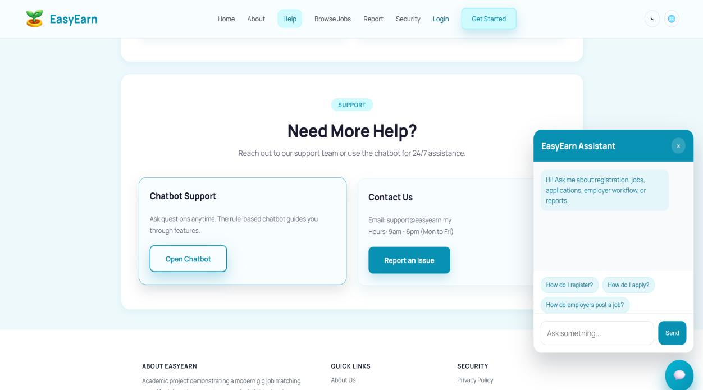

Figure 3.42: Chatbot Page

### 3.11.8 Google Translate Website

Google Translate Website has a language selector where users can see EasyEarn in various languages such as Bahasa Melayu, Mandarin, Tamil and English. If a language is chosen, the current EasyEarn page is redirected via Google Translate site translation se rvice; the content on the page is translated without the need for having localised copies of each page. To extend users' access from different communities in Malaysia, the Google Translate Website is integrated into EasyEarn as in Figure 3.43.

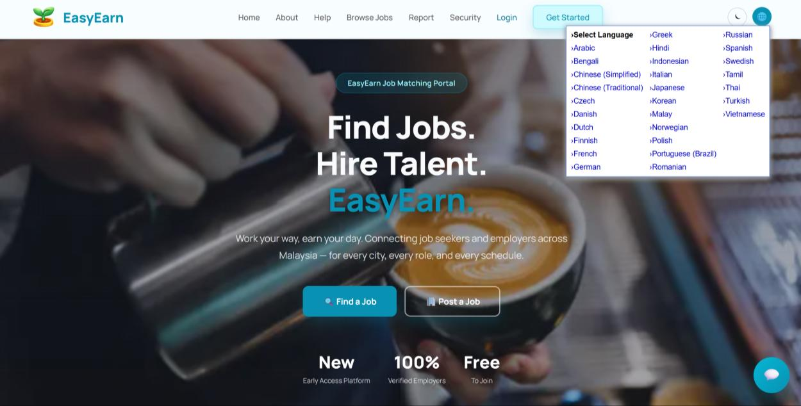

Figure 3.43: Google Translate Website

### 3.11.9 Registration Page

The Registration Page can be used by new users to register on EasyEarn. There are two sections of the form: Job Seeker and Employer, with the form fields adjusted dynamically based on the selection. In both cases, the form requests the user's complete name, email address, password, cellphone number and region or city. Employers are also required to enter the type of business (Individual or Company). If the registration form is successfully submitted, then a user account is created on Supabase with the role selected and the permissions associated with that role. The Terms and Conditions must be accepted before filling out the Registration Form. The collection and processing of personal information are based on the notice, consent and security principles in PDPA 2010. After successful registration, the user is authenticated and redirected to the appropriate dashboard based on the selected role. A Registration Page was implemented as shown in Figure 3.44, with sections split up according to the user's (Job Seeker/Emp) role in signing up for an account.

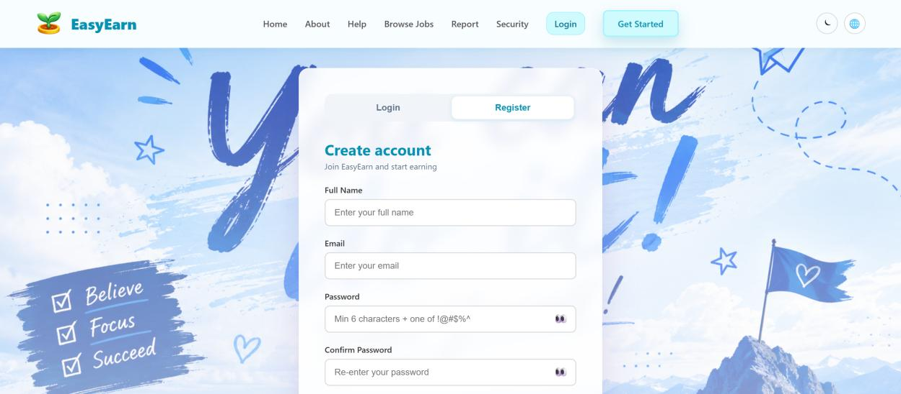

Figure 3.44: Registration Page

### 3.11.10 Login Page

All EasyEarn users will access the Login Page for authentication. The page features an email and password input field, a role selector that lets users choose to be either a Job Seeker or Employer, and a “Login” button that sends the email and password to Supabase Authentication. After successful login, users are directed to their dashboard based on their role. If you do not have an account, A "Register here" link will direct new users to the Registration page, while the Admin Login link is available at the bottom of the page. The developed Login Page is displayed in Figure 3.45, which includes the role selector for authentication, email and password fields.

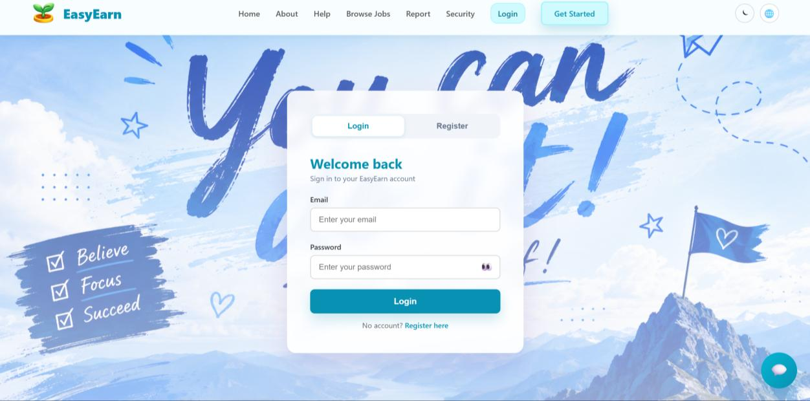

Figure 3.45: Login Page

### 3.11.11 Forgot Password Page

The Forgot Password and Reset Password pages enable users who are not able to log in to their EasyEarn account to recover access to their account via a secure email-based reset flow. On the Forgot Password page, the user types in their registered email address, and Supabase Auth sends a password reset link to their email address. The link will take the user to the Reset Password page, on which he or she will enter and confirm the new password and then return to the Login page to log in with the new password. The password val idation for strength and the visual style are the same on both pages as the Login/Register page. The Forgot Password and Reset Password pages that have been added to EasyEarn and are shown in Figure 3.46 demonstrate how this can be done.

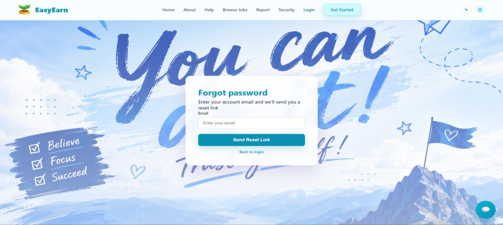

Figure 3.46: Forgot Password Page

### 3.11.12 Password Reset Email

On the Forgot Password page, when a user submits their email, Supabase Auth automatically sends a password reset email to the user's registered email address as shown in Figure 3.47. The email includes a "Reset Password" link which is valid for a short period of time; when it is clicked, the user will be directed to the Reset Password page where they can change their password and regain access to their account.

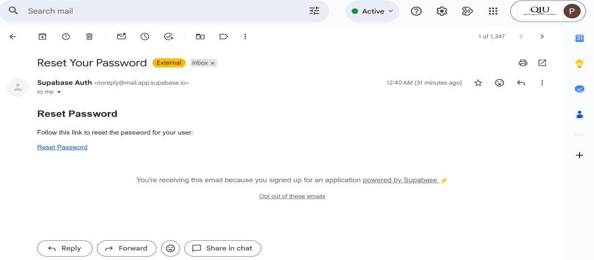

Figure 3.47: Password Reset Email

### 3.11.13 Logout Page

The Logout page verifies that the user is logged out of EasyEarn and his session. It includes a personalised goodbye screen with the user's profile picture or initials, a confirmation message to let the user know that his/her progress has been saved, and options to return to the homepage or log in again. The page also makes a Supabase sign-out call as a precaution, just in case someone navigated to this page directly rather than through the standard logout process. The design of the Logout Page in EasyEarn is shown in Figure 3.48, including a customised goodbye message and navigation.

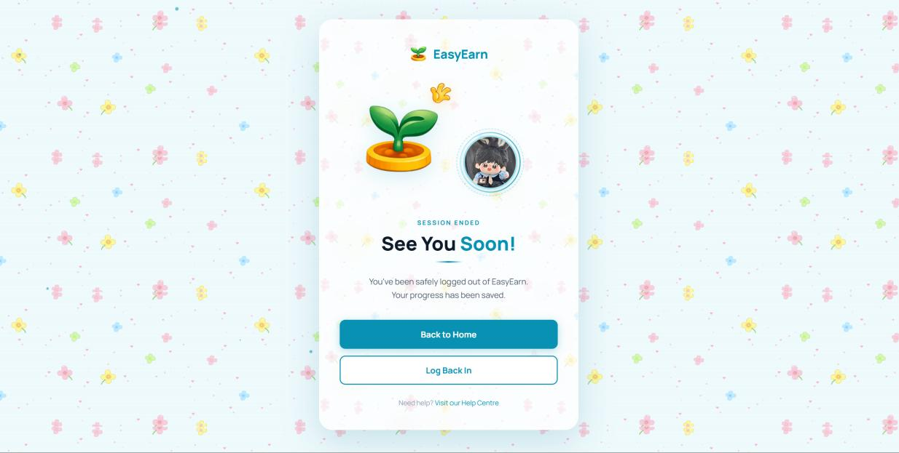

Figure 3.48: Logout Page

### 3.11.14 Job Seeker

The Job Seeker module is intended for people looking for short-term or flexible jobs on EasyEarn, such as students, housewives or people who are not working but want to make some quick and flexible money. Once logged in, Job Seekers will be able to browse and apply for jobs, check the status of applications, build a digital work history, build an auto-resume from completed jobs, and rate employers upon completion of a job. The module has a green colour theme, which helps to differentiate it from the Employer and Admin modules.

#### 3.11.14.1 Job Seeker Dashboard

The Job Seeker Dashboard is the personal hub for authenticated job seekers upon login. It shows a welcome banner that shows the percentage of completion of the profile and highlights 4 buttons for quick access to the following actions: Update Profile, Review Applications, Build Resume and Check Work History. Figure 3.49 depicts the Job Seeker Dashboard with the following elements: Welcome Banner, Profile Completion Indicator, and Quick Access Action Cards.

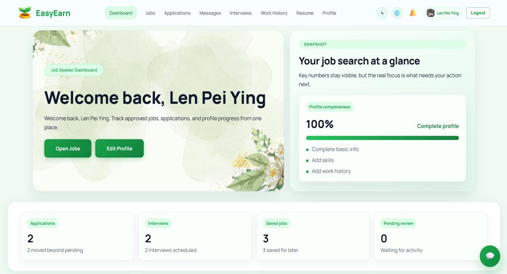

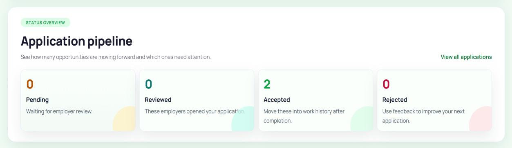

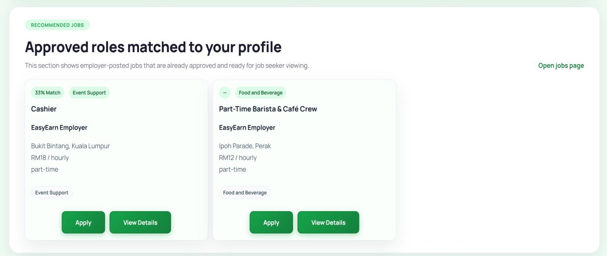

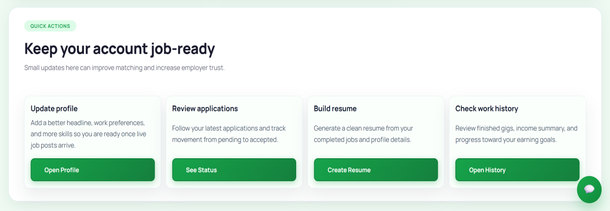

Figure 3.49: Job Seeker Dashboard

#### 3.11.14.2 Jobs Page

The Job Seeker Jobs page provides a way for Job Seekers to view and manage their saved jobs in one place, and to browse through job postings in two tabs, Browse Jobs and Saved Jobs. Browser Job: The Browse Jobs tab includes an activity overview that includes counts of saved, applied, skill-matched and available jobs, a search and filter panel, a filter by "Near Me" geolocation with a radius filter (5-50 km), a grid of live approved job posts, and a jobs already applied filter section. EasyEarn Browse Jobs tab is shown in Figure 3.50, where the activity overview, search/filter panel and live job listings are seen.

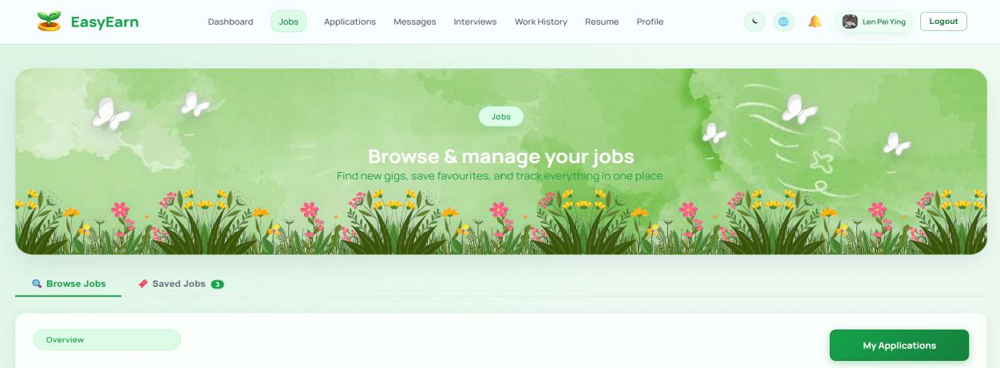

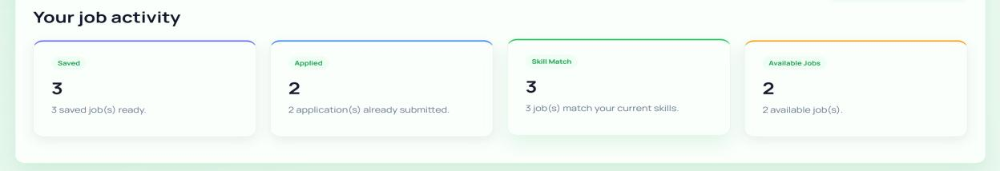

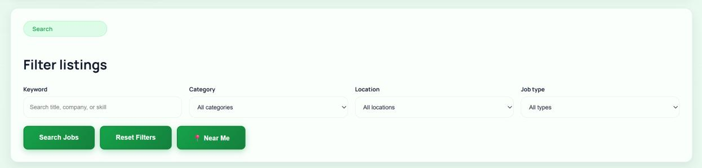

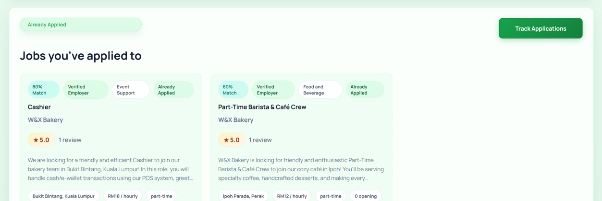

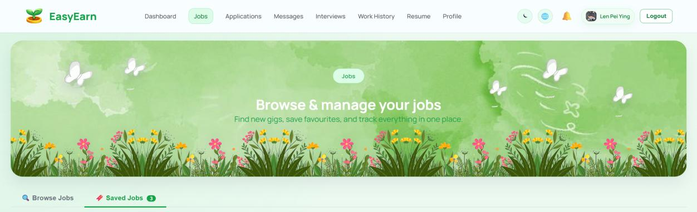

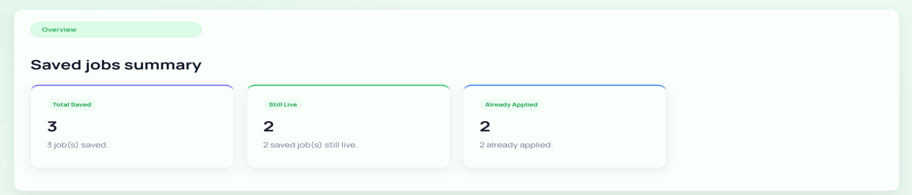

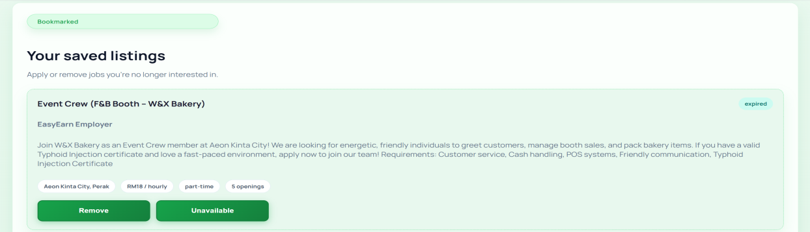

Figure 3.50: Jobs Page (Browse Jobs Tab)

Saved Jobs: The Saved Jobs tab shows a summary of how many jobs are saved, how many of them are still live, and how many have already been applied to, and a list of bookmarked listings available for Job Seekers to apply to or remove. The Saved Jobs tab in EasyEarn is shown in Figure 3.51 and consists of the Saved Jobs summary and Bookmarked listings.

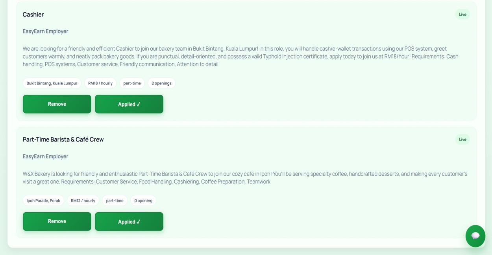

Figure 3.51: Jobs Page (Saved Jobs Tab)

#### 3.11.14.3 My Application Page

Job Seekers can use the My Applications page to keep track of all jobs they have applied for. It features an overview section with application metrics (In Review, Active, Completed, Rejected), a trend section with a line graph and doughnut chart of application activity by status, and filter tabs that display applications by All, Active, or Rejected. All applications are listed on the page with their current status, while a separate Completed Jobs section shows jobs that have completed the confirmation process. Once a job is completed and the completion process is confirmed, the completed work record is added to the Job Seeker's Work History, and the Job Seeker can rate the Employer. When Job Seekers request the Employer to confirm completion of a job, they c an enter the job title, employer/company, category, and start/end dates in a Submit Completion Request modal. Figure 3.52 shows the My Applications Page design used in EasyEarn, which features the application overview statistics, activity trend charts, status filters, and the completed jobs/work history submission flow.

Figure 3.52: My Applications Page

##### 3.11.14.3.1 Report Employer

Job Seekers can report a particular Employer by using the Report button included on each application card, without navigating away from the application page. When the Job Seeker clicks Report, they will access a modal to choose from a list of options like a fake or misleading job posting, harassment, unsafe working conditions, non-payment or scam, and more, and may optionally enter additional details before submitting the report to be reviewed by an admin. The reason selector and details field are presented as the Report Employer modal in EasyEarn, as shown in Figure 3.53.

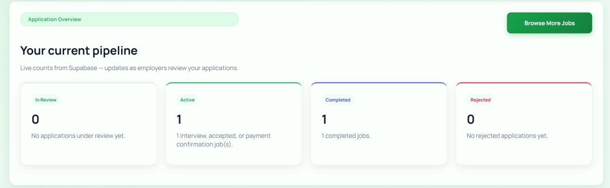

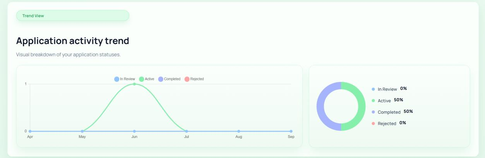

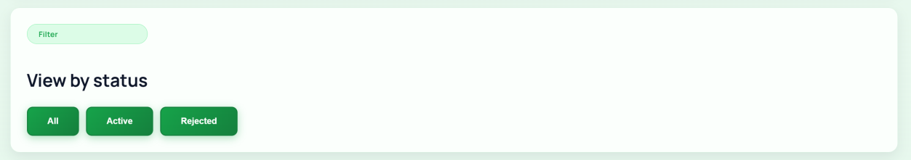

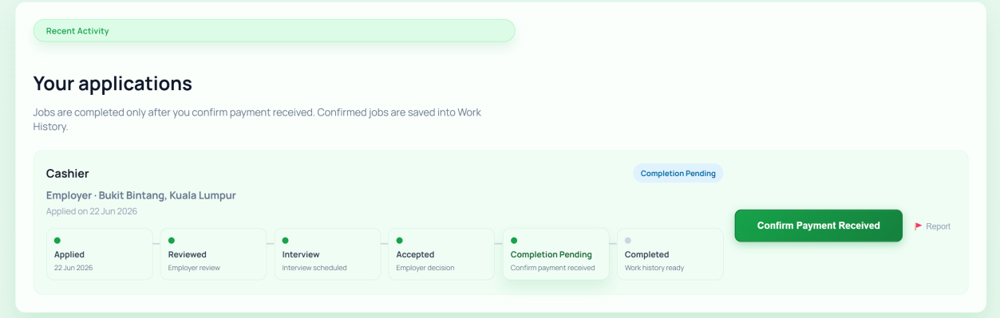

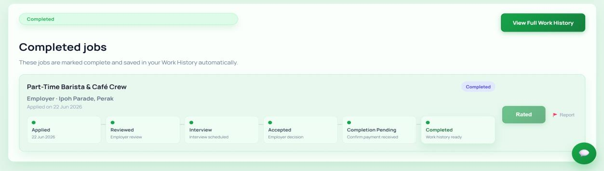

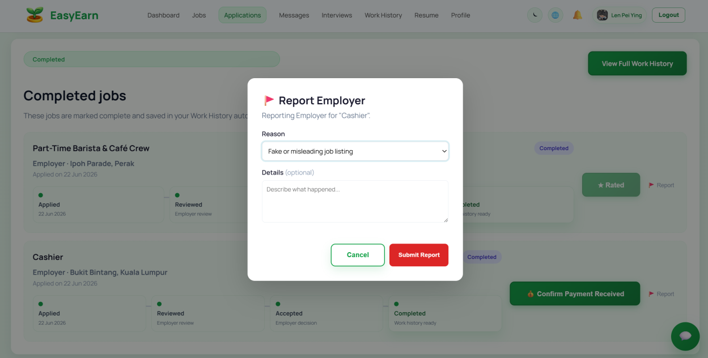

Figure 3.53: Report Employer

#### 3.11.14.4 Job Seeker Messages Page

The Messages page is used to post and receive asynchronous messages to and from the Employers about submitting them for a job and how to get the job. It features a sidebar inbox with an overview of conversation threads with the name of the employer, relevant job posting, and an employer rating if applicable, and a thread panel with the complete conversation history. Job Seekers are able to send text messages, upload images and see the messages sent by the employer, including the special DuitNow payment-related messages. On a panel, if no conversation is selected, it shows a "Select a conversation" prompt in the inbox. The design of the Messages Page used in EasyEarn is shown in Figure 3.54 and consists of the conversation inbox, message thread view, and the image attachment support message composer.

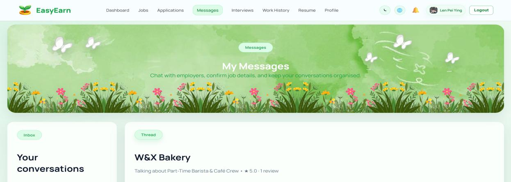

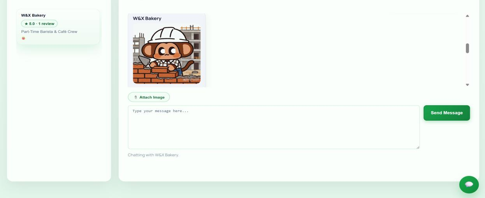

Figure 3.54: Job Seeker Messages Page

#### 3.11.14.5 Interviews Page

The Interviews page lets Job Seekers keep track of interview appointments arranged by employers who have received their job applications. It features an interview summary section with numbers of Confirmed, Upcoming, and Completed interviews; a list of upcoming interviews is sorted by soonest date, and a Completed Interviews section shows past or attended interviews. If there are no confirmed interviews, the page will offer a little bit of advice to the Job Seeker to fill out their profile wit h skills and a bio to increase the odds of being accepted to the application process, as well as links to edit their profile and keep track of applications. The design of the Interviews Page, as shown in Figure 3.55, is the one that was used in EasyEarn and it contains the next interviews, the completed interview history, and the summary stats for the interviews.

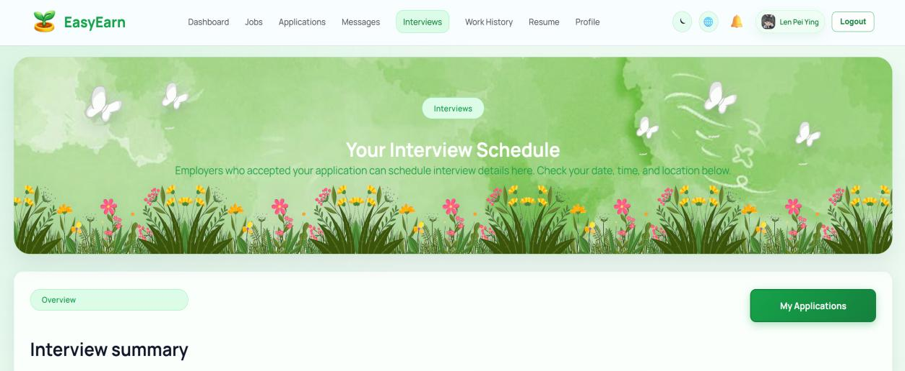

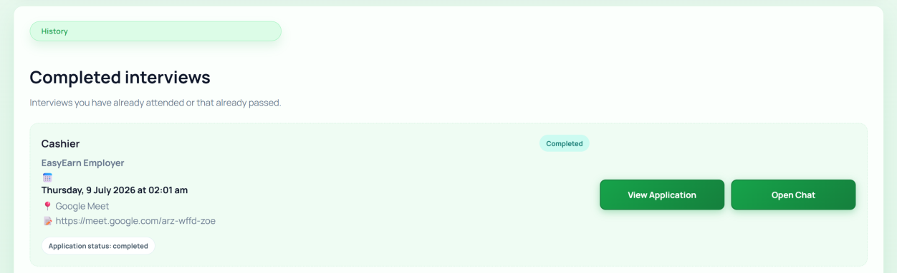

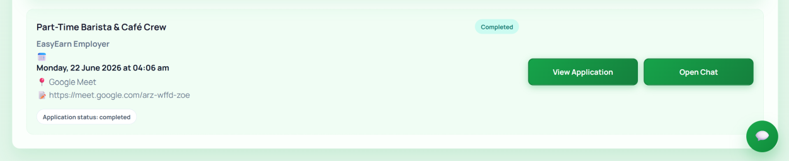

Figure 3.55: Interviews Page

#### 3.11.14.6 Work History Page

Job Seekers will be able to see their completed gigs on their Work History page and update their resumes and earnings tracking. Completed work records from finished job engagements are stored in the Supabase work_history table. The page also provides a Work Record form that allows Job Seekers to enter and save work details such as employer/company, job category, work period and earnings. It provides an overview of key metrics such as total finished jobs, total income, and top category. Each completed work record displays relevant job information such as the employer, job category, work period, earnings and completion details. A resume readiness panel displays the number of work records that have been stored and whether the resume is ready or not, with a link to the Resume page. The Recent Work Record section shows work entries completed that are saved in the work_history table. There is a Rate Employer modal too, which lets a Job Seeker rate the employer 1 -5 stars and write a review of the employer (optional). Figure 3.56 shows the design of the Work History Page in EasyEarn, which consists of the metrics summary, work record form, resume readiness panel, and Rate Employer modal.

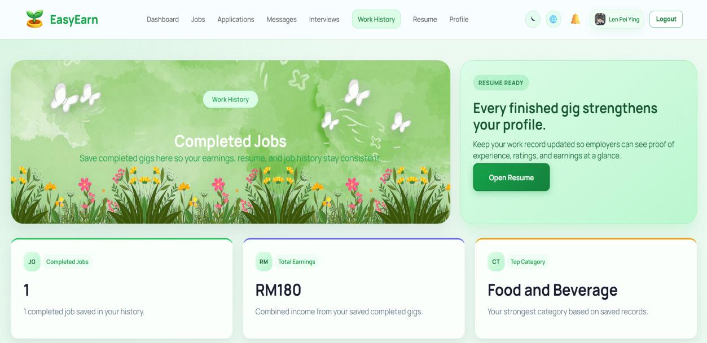

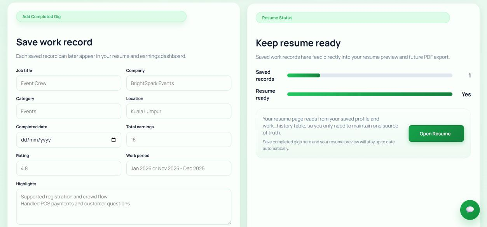

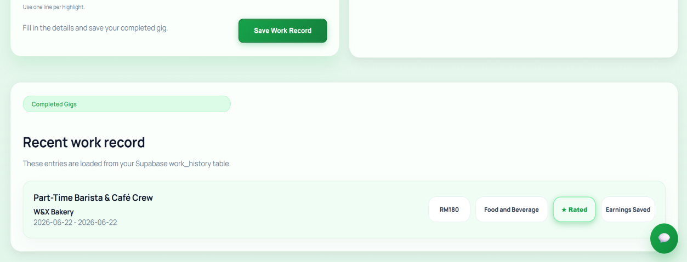

Figure 3.56: Work History Page

#### 3.11.14.7 Resume Page

The Resume page automatically creates a Resume based on the information provided in the Job Seeker's Saved profile and Work History section that's ready for use by an employer. The page provides a printable single-page resume that includes the user's profile picture, name, professional headline, contact information, profile bio, skills, education and availability. The main content area displays work experience entries, highlighted results such as completed jobs, total earnings and average employer rating, as well as references generated from completed jobs. Using the Refresh button, Job Seekers can refresh the preview view with fresh d ata as they update their profile, and download the resume in a PDF format using the jsPDF and html2canvas packages. EasyEarn's Resume Page design is a combination of the Resume preview design and the refresh/download toolbar, as illustrated in Figure 3.57.

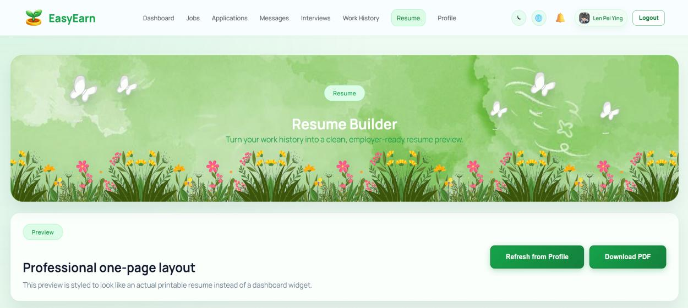

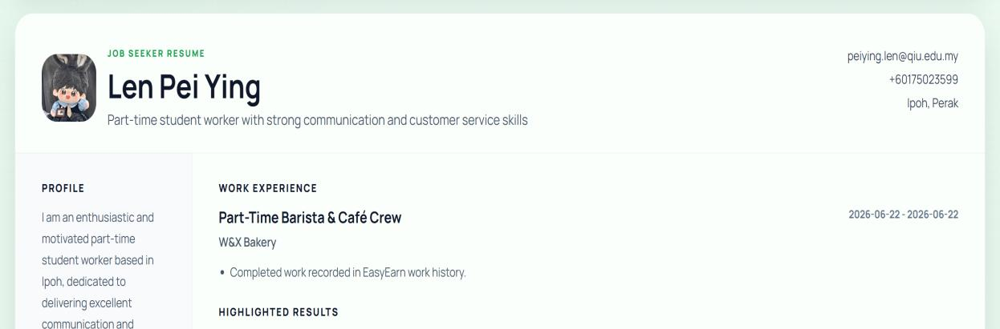

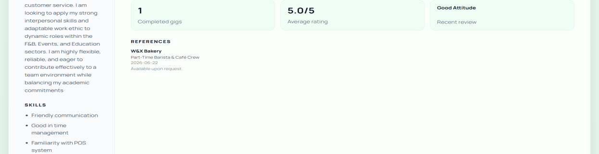

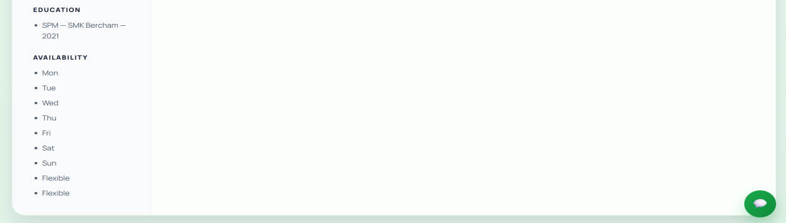

Figure 3.57: Resume Page

#### 3.11.14.8 Job Seeker Profile Page

Job Seekers can use the Profile page to fill in and keep up to date with information that they use throughout applications, recommendations, and resumes. It features a preview card with the user's avatar, headline, location, phone and availability, as well as an activity overview with rating, completed gigs, applications and saved jobs and a guide showing a progress bar and checklist of missing essentials to complete the user profile. The profile form consists of four sections: Basic Information, which includes the name, email, phone number, location, headline and biographical details, and the upload of a profile photo; Skills & Experience, which has a searchable skill tag picker, preferred job category, years of experience, and expected rate; Education, which dynamically adds qualification entries; and Availability, which includes a selectable available days, preferred time, and work mode. The final action section will enable Job Seekers to save all changes to their Supabase profile. The Profile Page design is shown in Figure 3.58 and includes the profile preview, the profile completeness tracker, and the editing form with multiple sections.

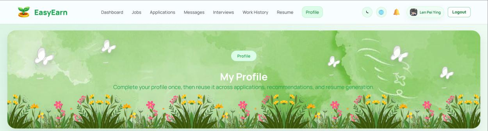

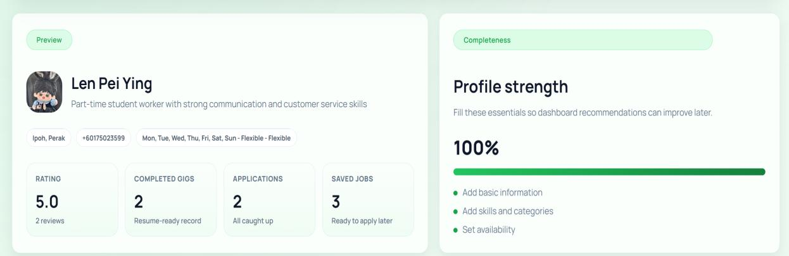

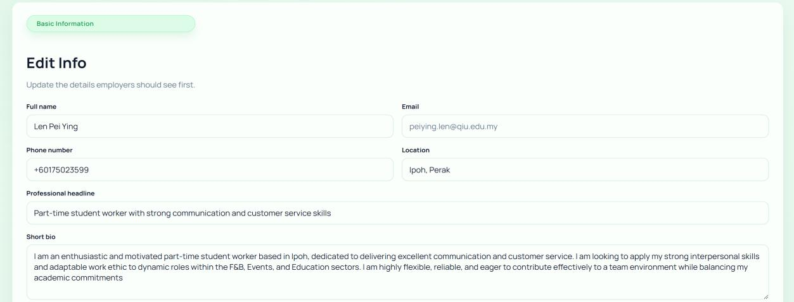

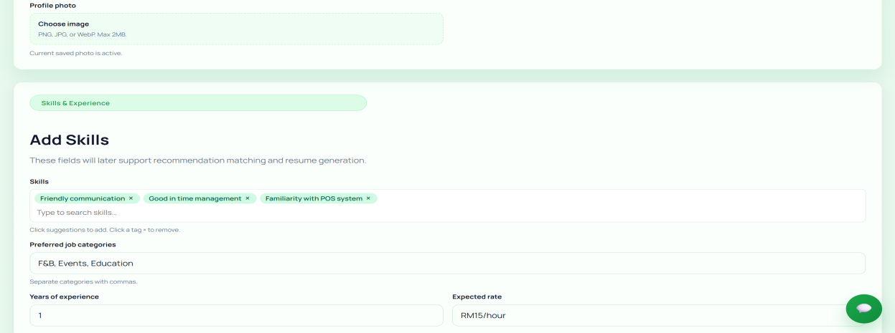

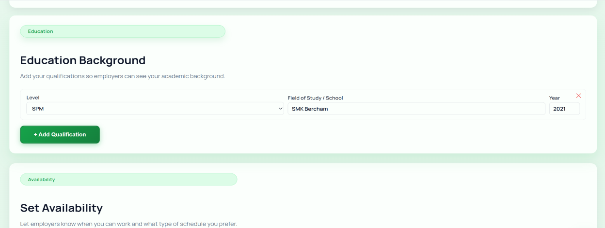

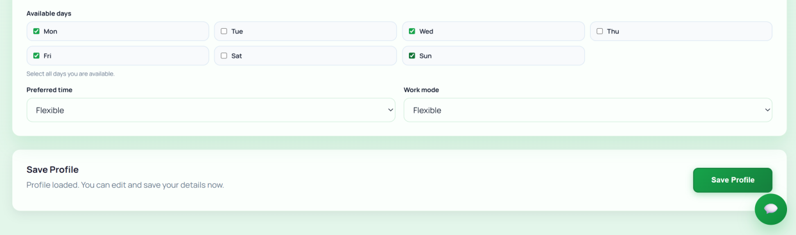

Figure 3.58: Job Seeker Profile Page

### 3.11.15 Employer

The Employer module is for people and SMEs wanting to recruit for short or flexible-term contracts in EasyEarn. Employers can post their job listings, review & manage applications from job seekers, verify their business to display a verified badge, access a dashboard to see their hiring analytics, and rate job seekers after they finish the job. The module has an amber colour theme to differentiate it from Job Seeker and Admin modules.

#### 3.11.15.1 Employer Dashboard

The Employer Dashboard gives employers a single view of their hiring activity and shows them four statistics cards: Active Jobs, Pending Review, Total Applicants, and Trust Verified status. An Application Share Breakdown doughnut chart visualises the distribution of application statuses across all job postings. Figure 3.59 shows the Employer Dashboard implemented with hiring statistics cards and a breakdown of the application status doughnut chart.

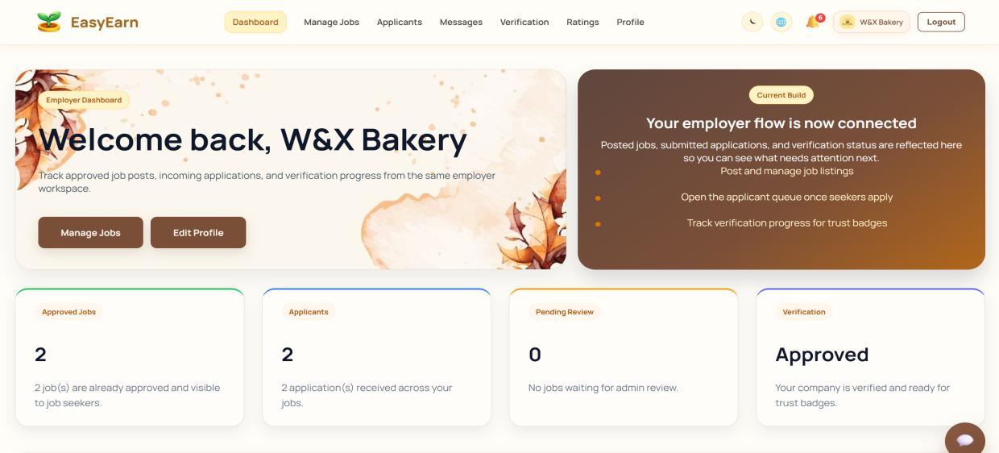

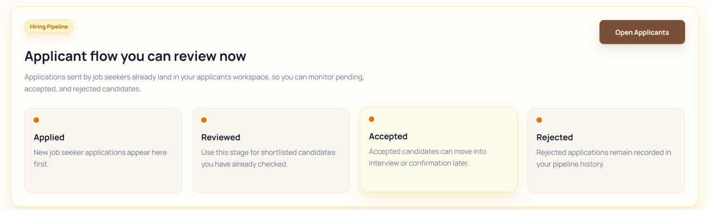

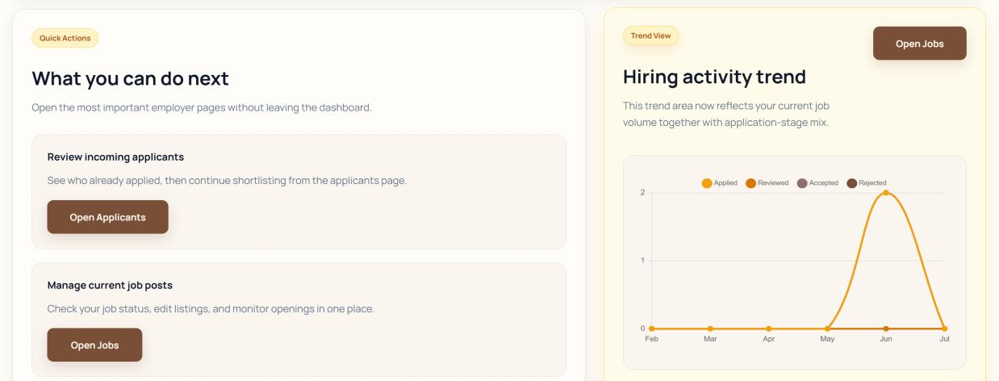

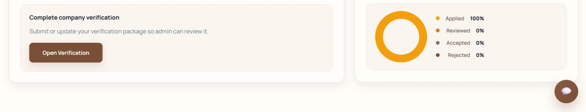

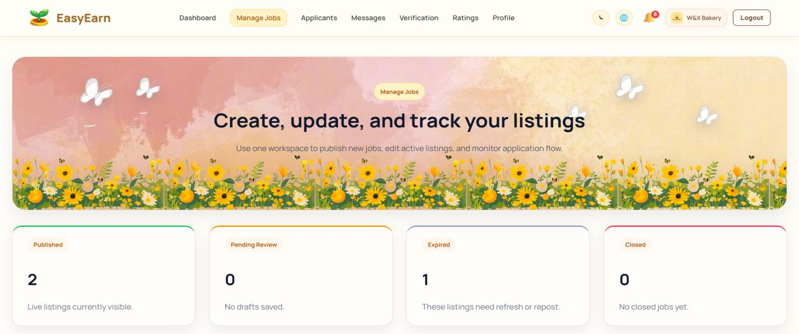

Figure 3.59: Employer Dashboard

#### 3.11.15.2 Manage Jobs Page

The Manage Jobs page is the Employer's main page to post and update jobs. It features a metrics dashboard with Published, Pending Review, Expired, and Closed metrics and a job form to add or edit a job with fields for job title, job category, location (wit h state and area drop-downs, and a geolocate/geocode button), pay range, openings, schedule, expiry date, job required skills (where tags can be set to up to 5 skills), and a job description, including options for publish immediately and save as a draft. A Publishing Notes panel shows a listing quality score, a pre-publish checklist and quick tips for writing effective listings. At the bottom of the page, there is a Job List section, which lists all of the employer's jobs and will display their status, number of applicants, and expiry date so that the employer can view and manage their jobs from one location. The Manage Jobs Page design in EasyEarn is shown in Figure 3.60, which consists of the job metrics overview, the job creation/editing form, the publishing guidance panel, and the listings management table.

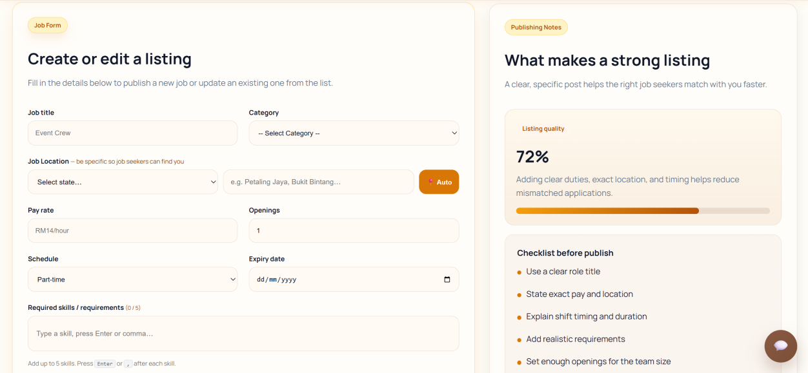

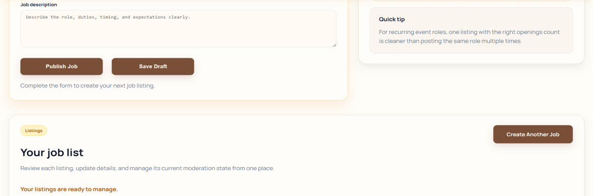

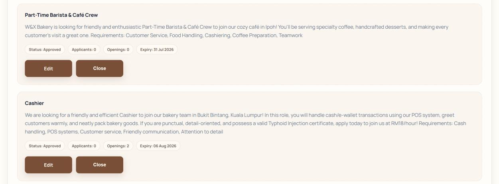

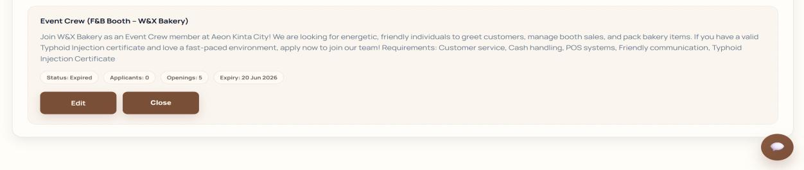

Figure 3.60: Manage Jobs Page

#### 3.11.15.3 Applicants Page

Employers can review candidates and manage the hiring pipeline on their Applicants page for their job listings. It provides an overview where the numbers of applicants applied, reviewed, accepted and rejected are displayed, a trend view with a line chart and a doughnut chart that breaks down the activity of applicants by status, and an Applicant Queue that shows the list of all applications received, from which Employers can accept applicants, schedule them for an interview, send messages and confirm job completion. Employers can use a Schedule Interview modal to schedule the interview date and time, location or platform, and notes for the applicant. Once a Job is completed, Employers are able to record the Date of Confirmation and the Final Earnings using a Confirm Completed Job modal. The Applicants Page design used in EasyEarn is shown in Figure 3.61, featuring the applicant overview stats, activity trend charts, applicant queue, the interview scheduling and job completion modals.

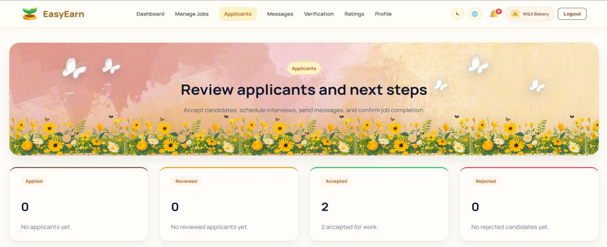

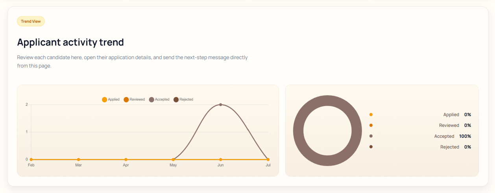

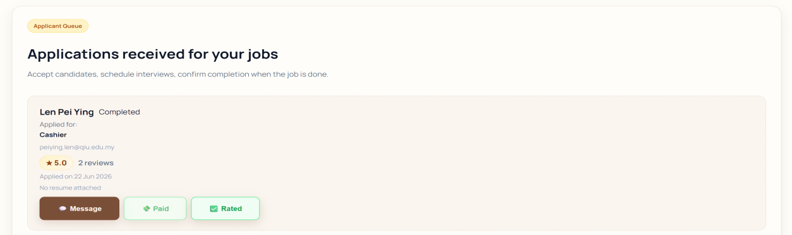

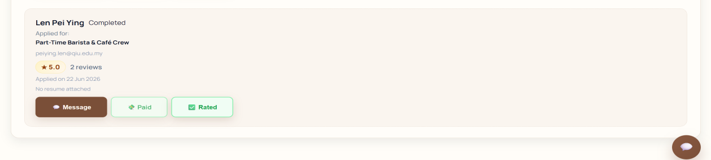

Figure 3.61: Applicants Page

#### 3.11.15.4 Employer Messages Page

Employers can follow up with a job seeker about application and hiring details on the Messages page. It has an inbox sidebar that shows conversation threads, and a thread panel that shows a conversation history and allows Employers to view and add messages about a given applicant. If no conversation is selected, the panel will ask the Employer to select a conversation in the Inbox or create a conversation on the Applicants page. EasyEarn implements the Messages Page (Employer) design shown in Figure 3.62 that contains the conversation inbox and the message thread view.

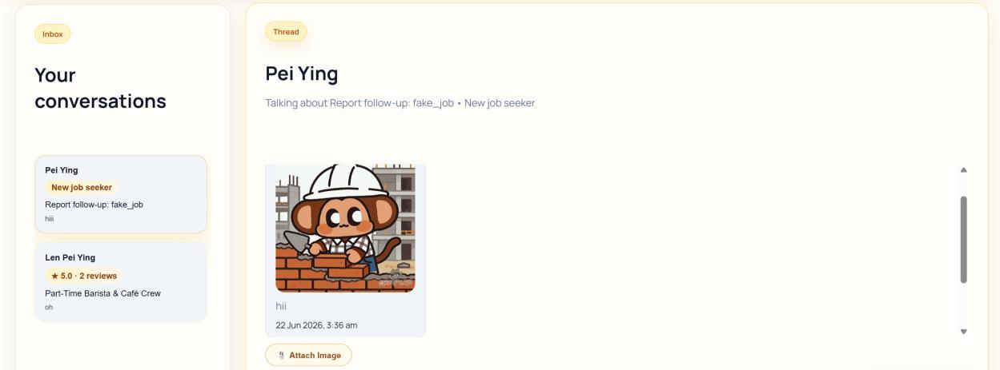

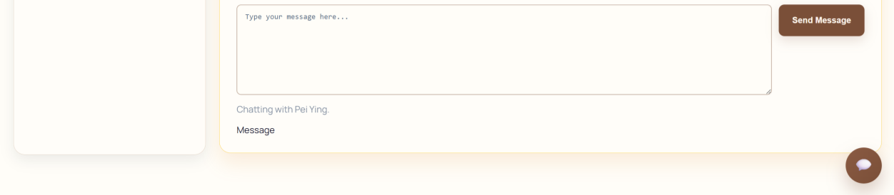

Figure 3.62: Employer Messages Page

#### 3.11.15.5 Verification Page

Employers can upload their business information for admin review and approval on the Verification Page. It comes with a status bar that displays the progress of the verification process and a checklist of the necessary requirements in the Company Info, Doc uments and Admin Review steps. The data collected on the verification form are the SSM registration number, business type, business address and documents uploaded (business registration document, contact person proof (IC copy, staff card or signed authoris ation letter)). After all the necessary information and paperwork are submitted, employers may submit the completed package to the Admin for review. The design of the Verification Page in EasyEarn is shown in Figure 3.63. A progress banner is displayed on this page to show verification status, and a form to return business credentials is provided.

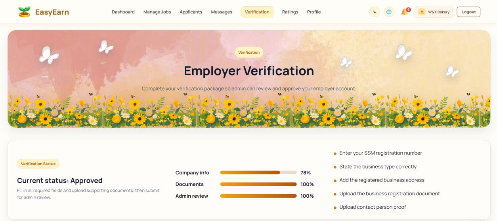

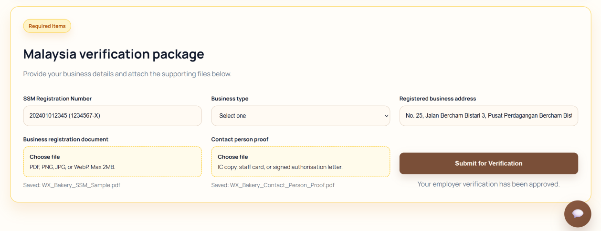

Figure 3.63: Verification Page

#### 3.11.15.6 Rating Page

The Rating Page shows the ratings and reviews of the Employer that have been received from Job Seekers for completed jobs. It includes an overview of the average rating, the number of reviews and the number of 5-star ratings, a rating distribution graph and a list of all the reviews received. The Rating Page design is demonstrated in Figure 3.64, which includes the rating overview, distribution breakdown and list of all ratings.

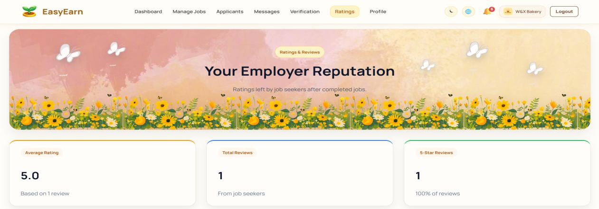

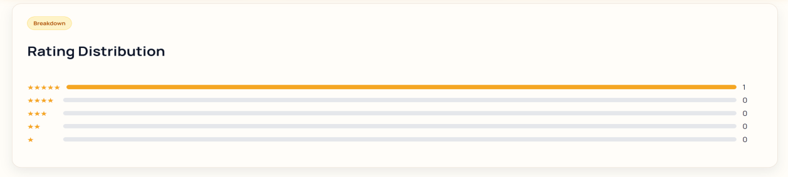

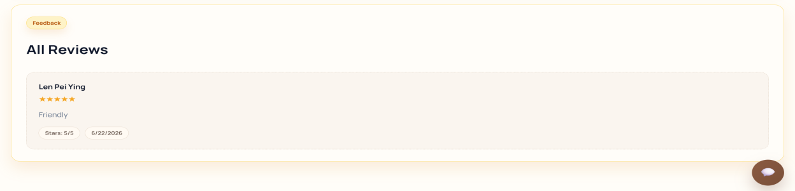

Figure 3.64: Rating Page

#### 3.11.15.7 Employer Profile Page

Employer Profile Page allows the Employer to keep certain company information that can foster trust with prospective Job Seekers before they apply for a job. It includes a profile form with the name of the company, contact email, contact phone number, busi ness type, location, website, business logo and company overview. It also features a readiness snapshot panel, a preview of the company logo, and progress tracking throughout the Basic Info, Trust Setup and Hiring Ready stages, as well as a trust checklist that offers the steps to make the company profile more complete and trustworthy. EasyEarn Employer Profile Page design layout, as shown in Figure 3.65, contains the Employer Profile details form and Employer Profile ready snap.

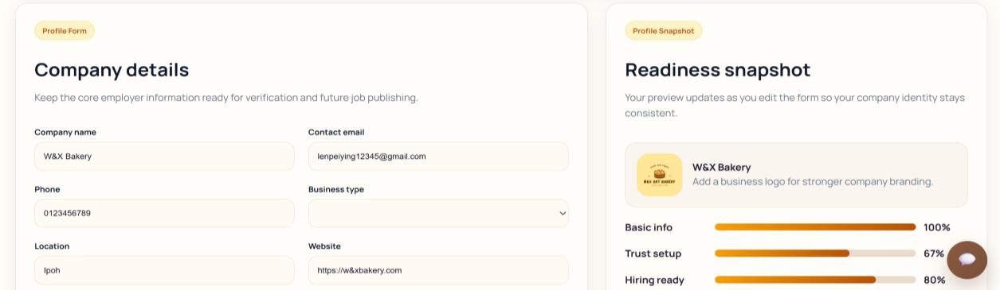

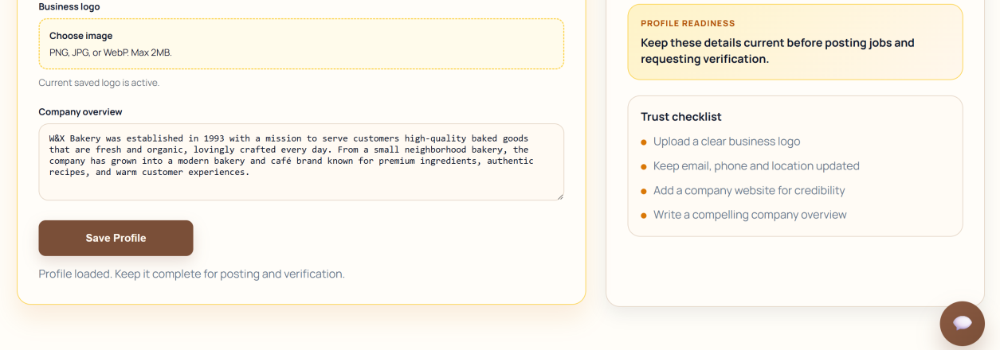

Figure 3.65: Employer Profile Page

### 3.11.16 Admin

The Admin module is designed to control and oversee the platform's operations and guarantee the integrity and safety of EasyEarn. Admins have access to reporting and can respond to user reports, review employer verification requests, access the platform's analytics using Chart.js dashboards, manage users and job listings, and use the rule-based chatbot for help. The module has been designed in a purple colour scheme to help stand out from the Job Seeker and Employer modules.

#### 3.11.16.1 Admin Dashboard

The Admin Dashboard gives the Administrator a full overview of platform activity, with statistics cards for total Users, Reports, Verifications, and Jobs. The Moderation Queue shows reports, verification requests and job postings that need to be reviewed by an admin, while the Database Distribution Metrics doughnut chart shows platform data proportions by category. Figure 3.66 shows the Admin Dashboard implemented with Platform statistics cards, activity stream and Database distribution metrics.

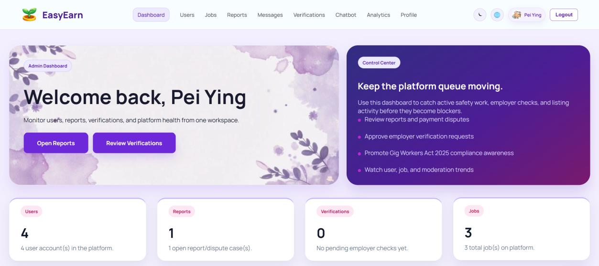

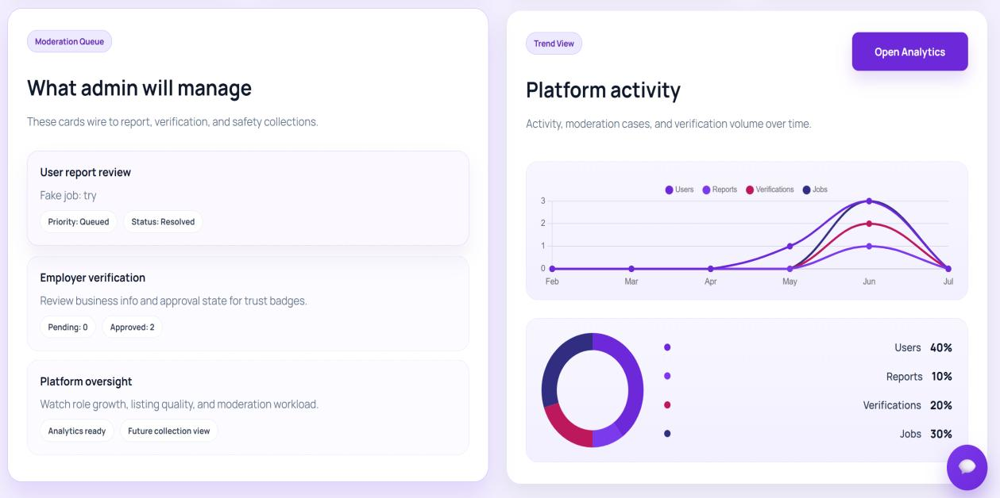

Figure 3.66: Admin Dashboard

#### 3.11.16.2 Admin Users Page

The Admin Users Page provides Administrators with a list of all users registered in the platform. It has a summary that displays the number of Job Seekers, Employers and Admins, and a user directory which filters by role. Alternatively, administrators can search for users by their name, email, phone number or location using the search field. All users appear in the directory with their respective roles, account status and user registration date, which can be used for additional moderation actions. The Admin Users Page design of EasyEarn is displayed in Figure 3.67, which includes an overview of the user count and a filterable user directory.

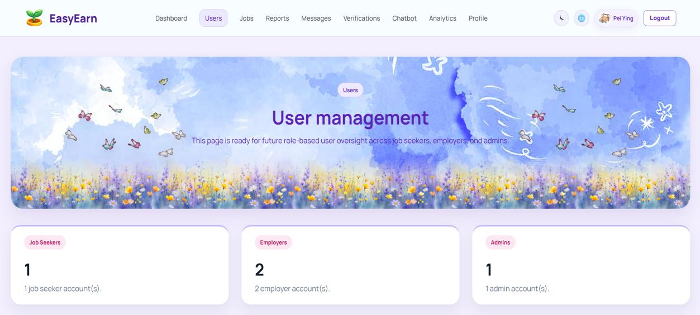

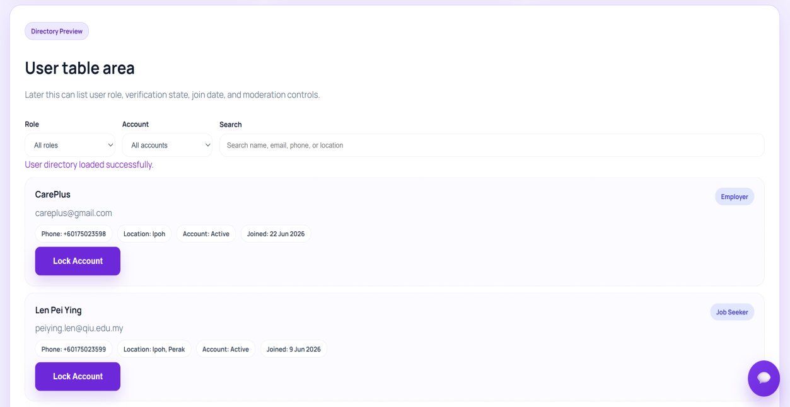

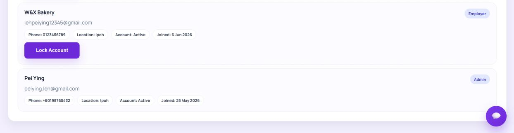

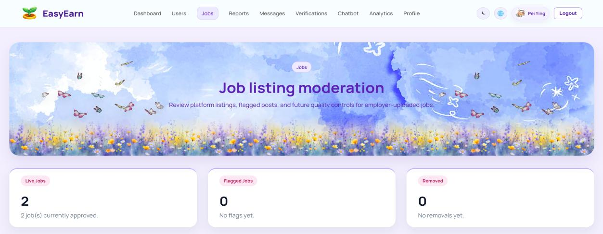

Figure 3.67: Admin User Page

#### 3.11.16.3 Admin Jobs Page

Moderate jobs posted on the platform from the Admin Jobs Page by admins. It contains a summary of the number of Live Jobs, Flagged Jobs and Removed listings, and includes one Live Job review queue. The queue may be sorted by moderation status, which includes Pending Review, Approved, Flagged, Removed, Closed, Expired or All Jobs. A search bar is also provided to search by title, employer, category, pay or description. The employer name is displayed with the flag reason and moderation status for each of the job posts, and this lets Admins view and make changes to flagged or pending job posts. Figure 3.6 8 shows the EasyEarn system's Admin Jobs Page, which contains an overview of the jobs' status and provides a list of jobs in the review queue that can be filtered.

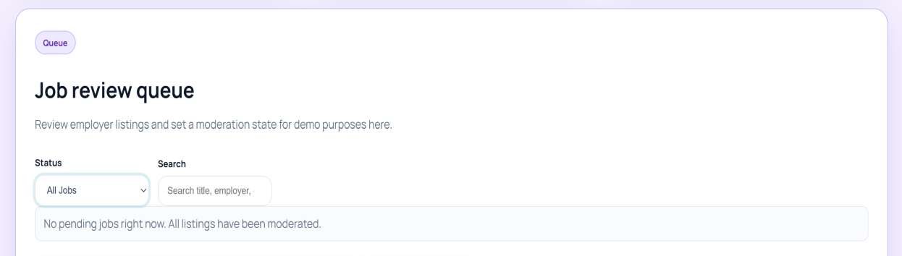

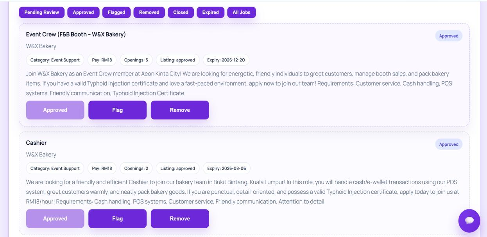

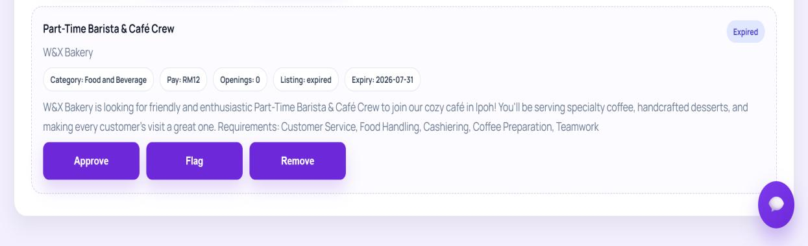

Figure 3.68: Admin Jobs Page

#### 3.11.16.4 Admin Reports Page

Admins can manage and resolve safety-related reports, such as suspicious employers, fraudulent listings and payment disputes, through the Admin Reports Page. It includes an overview of the number of Open, Escalated and Resolved reports, as well as a report feed that filters reports by Status (Open, Escalated or Resolved) and by Source (Supabase Reports or Payment Disputes). A search field is also included to search by type, description, reporter and/or status. Every report displays the type of report, priority and status, enabling Admins to view and act upon reports of fake employers, non-payment, suspicious listings or platform abuse. The design for the Admin Reports Page in EasyEarn is shown in Figure 3.69; it combines the report status overview and filterable report feed.

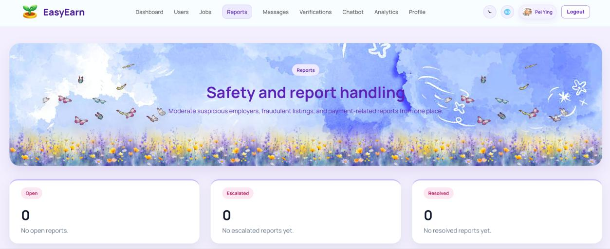

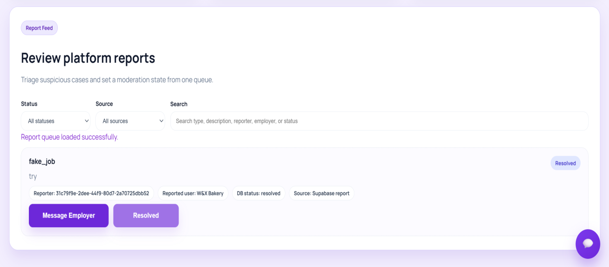

Figure 3.69: Admin Reports Page

#### 3.11.16.5 Admin Messages Page

If a payment dispute or moderation issue is to be followed up with the user in question, Admins may send them a message asynchronously from the Admin Messages Page. It features an inbox sidebar that notifies active conversations between the Admin and other s, and includes a message panel that lists the selected conversation history so that the admin can view past messages and type in new ones. If follow-up is needed, the corresponding conversation will be available for the Admin on the Admin Reports Page. Admin Messages Page design in EasyEarn, with a conversation inbox and message thread panel, is shown in Figure 3.70.

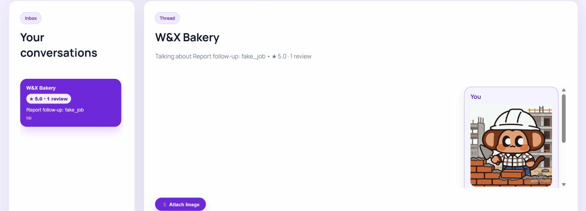

Figure 3.70: Admin Messages Page

#### 3.11.16.6 Admin Verifications Review Page

EasyEarn has a number of Safety and Trust features, including the Admin Verifications Review Page, which directly supports Research Objective 2. The page provides the Administrator the ability to view the verification submissions, review uploaded Know Your Business (KYB) documents, check on the status of the verification, and approve or deny the verification request. If an Employer makes a request for a verification, his/her information, uploaded documents and verification status are displayed for review. This allows the Administrator to evaluate the information provided before verifying the submission and helps to ensure the platform's safety and trust. Figure 3.71 illustrates the Admin Verifications Review Page, which supports Research Objective 2 by allowing the Administrator to review Employer KYB documents, check the verification status, and approve or reject Employer verification submissions.

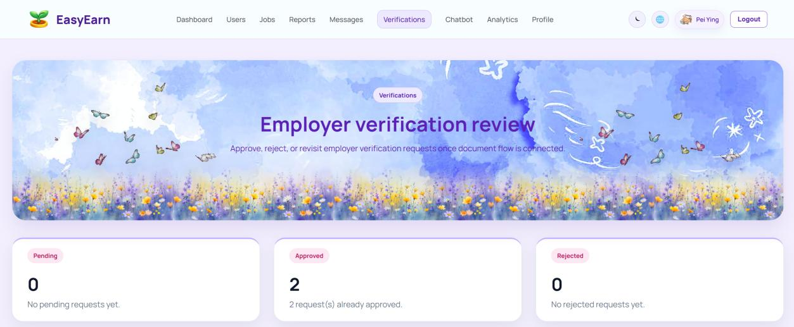

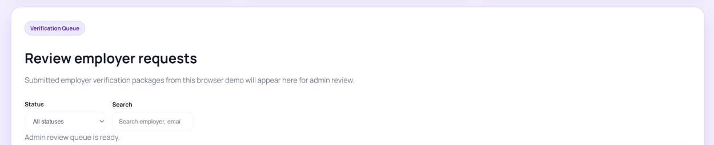

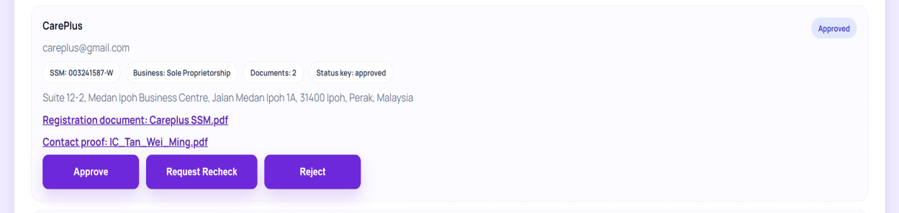

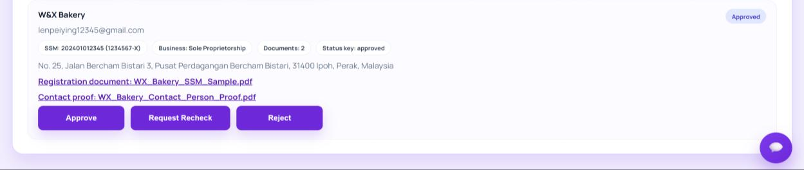

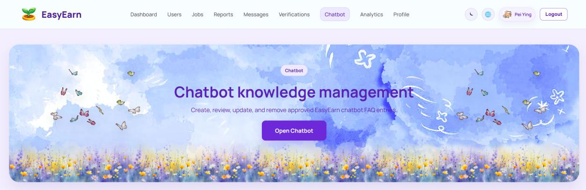

Figure 3.71: Admin Verifications Review Page

#### 3.11.16.7 Admin Chatbot Knowledge Management Page

The Admin Chatbot Knowledge Management Page is where Administrators can manage the knowledge that the EasyEarn rule-based chatbot uses. There is the ability to create new questions and answers, categorise and keyword questions, search for pre-existing chatbot knowledge and update or delete answers that are outdated. The chatbot knowledge is stored in the Supabase chatbot_knowledge table and is used to give a response to common platform-related questions. This way, the information in the chatbot can be updated via the Admin page, without having to adjust chatbot code. Only authorised Administrators have access to the management functions. The Admin Chatbot Knowledge Management Page, as shown in Figure 3.72, contains the knowledge entry form, as well as the stored chatbot knowledge records.

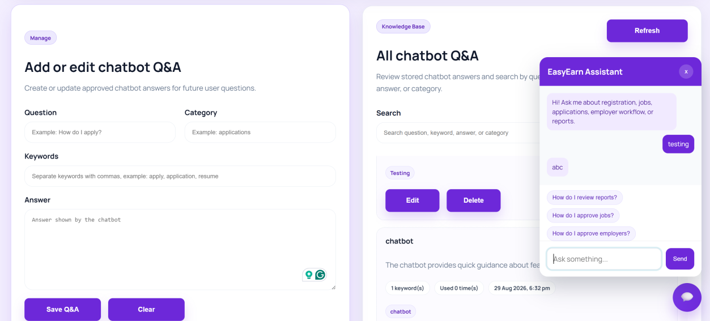

Figure 3.72: Admin Chatbot Knowledge Management Page

#### 3.11.16.8 Admin Analytics Page

The Admin Analytics Page offers Admins a snapshot of platform growth and workload with summary metrics for user growth, job volume and report load, a trend chart, and a distribution graph of users, jobs, reports and verifications. It also includes a Gig Workers Act 2025 awareness panel to remind Admins that there should be clear information in job postings, any claims related to payment must be followed up and that verification records should be looked at when considering employer accountabilities. Under the charts, there is a data explorer table showing analytics records which can be filtered by analytics type and status and searched by name, title, role, category or details. For the Admin Analytics Page, the design includes the filterable records table, the trend and distribution graphs, as well as summary metrics, as shown in Figure 3.73.

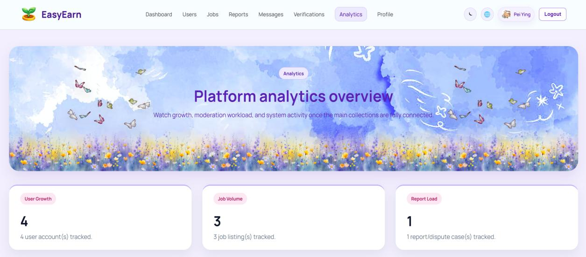

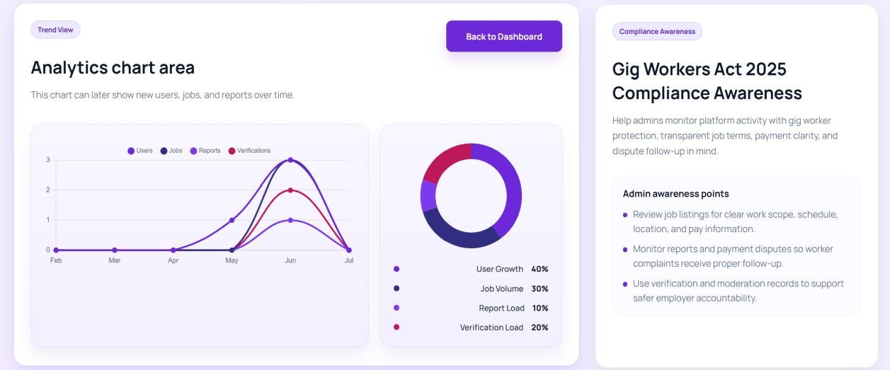

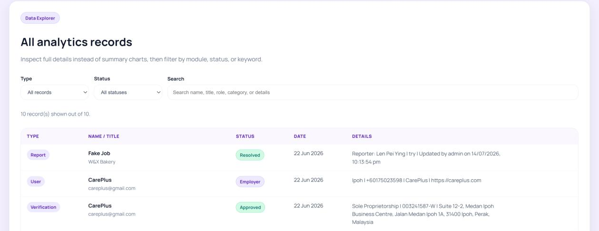

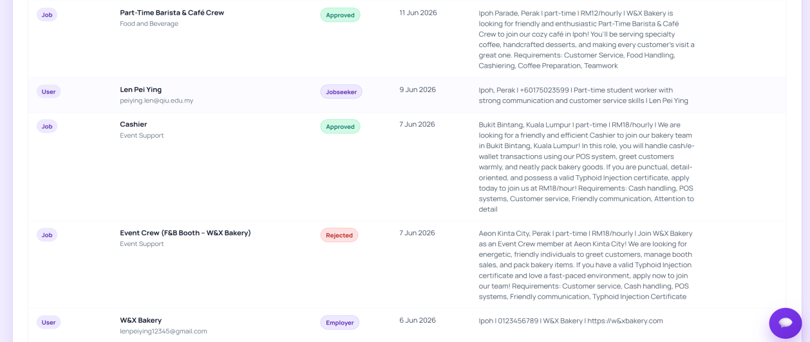

Figure 3.73: Admin Analytics Page

#### 3.11.16.9 Admin Profile Page

The Admin Profile page enables Admins to keep their contact information and avatar complete and trustworthy, and use it across moderation actions. It has a profile page with the Admin's name, email, telephone, address, picture and brief bio about their mod erating position. A snapshot panel on the right provides a real-time preview of the profile and readiness flags for basic info, identity, and moderation readiness, as well as a trust checklist to remind Admins to ensure that all information is up to date before taking moderation action. The design of the Admin Profile Page as used in EasyEarn is shown in Figure 3.74 and further comprises the profile form as well as the readiness snapshot panel.

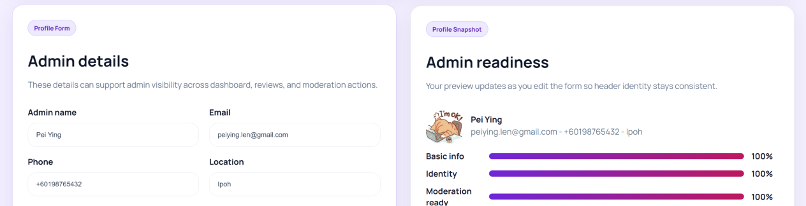

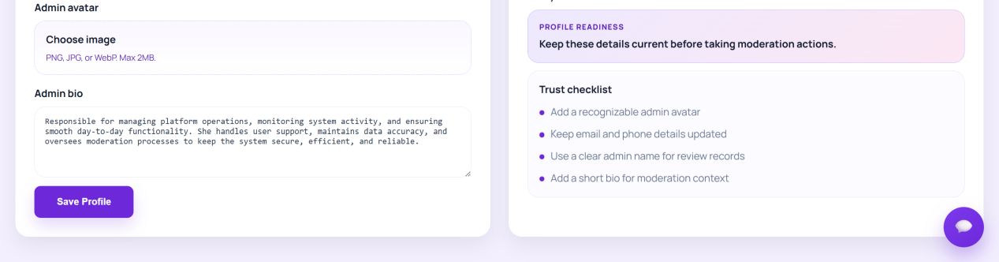

Figure 3.74: Admin Profile Page

## 3.12 Conclusion

This chapter thoroughly documented the research methodology, planning structure, requirements, system design and UI design of the EasyEarn Job Matching Portal. The Hybrid Agile-Waterfall methodology gives a structure to the development process while allowing for the delivery of the seven core system modules in an incremental and sprint-based approach [20], [74]. The planning artefacts (Work Breakdown Structure, project schedule and Gantt Chart) provide a clear 26-week execution framework with defined milestones and deliverables. The Hardware and Software requirements analysis shows that developing and deploying EasyEarn is feasible within the academic project scope using web and cloud-based technology. These system design elements include the three-layer BaaS architecture, modular JavaScript system design, and the twelve-table relational PostgreSQL database schema [88], use case diagram [90], and role-based system workflow diagrams. Together, these elements serve as the technical basis for the EasyEarn platform. The user-centred interface approach throughout the EasyEarn platform is illustrated in the wireframe designs of Section 3.10 and the implemented UI of Section 3.11 [79], [91]. One of the main features is the Auto-Generate Resume function in Section 3.11.14.7, which creates an employer-ready resume PDF from the Job Seeker's saved profile and work history data, without needing to format the resume [49]. The system design prioritises simplicity, clarity, and easy access to the roles, consistent with the platform's mission to serve users with varying levels of digital literacy in underserved regions of Malaysia. Chapter 4 discusses the implementation, testing and evaluation of EasyEarn in relation to the project objectives.
