# Chapter 4 reports the findings and results of the system development and user testing, explaining the features implemented, the results of testing and the performance of the system in relation to the defined objectives.

The findings of this thesis are presented in the context of the research aims and previous research in Chapter 5, the success of EasyEarn as a platform, and the main contribution of this project to the field of gig economy platforms in Malaysia. It also highlights the current implementation weaknesses and suggests further developments beyond this Final Year Project. Chapters 4 and 5 will be finished in FYP2.

## Constraints and Limitations

EasyEarn is developed under bounded conditions due to the nature of the academic environment, the project timeline, and the technology stack, as well as known limitations of the system, which could be solved in future stages.

### 1.8.1 Project Constraints

Time Constraint

The project will be of a fixed duration, comprising 26 weeks in total, to be completed in two phases: FYP1 (20 April to 12 June 2026) and FYP2 (16 October to 16 October 2026). This constraint is controlled by the Hybrid Agile-Waterfall methodology: a blend of structured planning with iterative development. Those features that cannot be developed during the sprints are either saved for the next sprints, or they are not included in the scope of the project (Sommerville, 2016).

Resource Constraint

EasyEarn is not developed by a dedicated development team, separate Quality Assurance (QA) team, or enterprise-level infrastructure, but by a single student. This means that only a certain degree of parallel development, testing coverage and optimisation can be achieved during the project period. Thus, it is important to prioritise core functions of the system carefully to make sure that a functional and testable system can be built within the limited resources at hand (Pressman & Maxim, 2020).

Technology Constraint

It is built with HTML, CSS and JavaScript, with Supabase offering Backend-as-a-Service (BaaS) functions and GitHub Pages for the deployment of the static frontend. The technology stack was chosen for its accessibility, its suitability for an academic project, and not needing dedicated application-server infrastructure. However, as GitHub Pages is a static front-end, EasyEarn is built on client-side JavaScript, Supabase backend services and some selected back-end business logic, such as Row Level Security (RLS) policies and PostgreSQL triggers. Additionally, Supabase's free tier usage limits may affect resources like databases, storage, and other services depending on platform usage (Supabase, 2023).

Regulatory Constraint

EasyEarn processes personal information and will be developed in accordance with the current personal data protection laws and regulations in Malaysia, in particular, the Personal Data Protection Act (PDPA) 2010, Computer Crimes Act 1997 and Consumer Protection Act 1999. Supabase offers Row Level Security (RLS) policies and HTTPS data transmission, while Role-Based Access Control (RBAC) can be used to limit access based on a user's role. These controls provide support in protecting user data, but are not a formal certification of legal or regulatory compliance. A formal compliance and legal review would be needed before general production.

To summarise, EasyEarn has 4 main project constraints: A fixed academic timeline of 26 weeks, A single developer resource constraint, A web-based architecture with a static front end, GitHub Pages and Supabase BaaS services, and regulatory concerns on personal data and gig work. These restrictions are used to limit the development scope and testing depth, as well as the manufacturability of the product. The constraints have been taken into account by making design decisions like phased feature development, prioritisation of essential functions, and using a Hybrid Agile-Waterfall methodology.

To summarise, EasyEarn has 4 main project constraints: A fixed academic timeline of 26 weeks, A single developer resource constraint, A web-based architecture with a static front end, GitHub Pages and Supabase BaaS services, and regulatory concerns on personal data and gig work. These restrictions are used to limit the development scope and testing depth, as well as the manufacturability of the product. The constraints have been taken into account by making design decisions like phased feature development, prioritisation of essential functions, and using a Hybrid Agile-Waterfall methodology.

Table 1.7 below provides a summary of the four key project constraints, their effect on the current project stage and the recommended future actions.

Table 1.7: Summary of Constraints

| Type | Issues | Impact | Future Recommendation |
| --- | --- | --- | --- |
| Time Constraint | Established a fixed 26-week academic project deadline | Restricts the development, testing and refinement that can be achieved during the life of the project. | Continues development in phases for features or improvements not within the scope of the project. |
| Resource Constraint | A single-developer project with no designated development or QA team. | Limits parallel development, independent review, testing coverage and optimisation. | Create a small development and testing team for future enhancements and larger deployment. |
| Technology Constraint | A static frontend with Supabase&#x27;s architecture as a backend, built on GitHub Pages. | Restricts dedicated application-server processing and relies on the services&#x27; capabilities and limits of the chosen BaaS platform. | Expand database-level controls, and if needed, the future requirements call for more server-side processing, consider using Supabase Edge Functions or a dedicated backend. |
| Regulatory Constraint | Compliance with legal and regulatory aspects of personal data, computer misuse, consumer protection and gig work. | Production would need to be assessed by a formal legal and compliance review before being used for wider production. | Conduct a formal PDPA and legal review, including relevant requirements under the Gig Workers Act 2025, before wider production use. |

The remaining four constraints of the project are summarised in EasyEarn and the effect the project has on the current development phase is summarised in Figure 1.16.

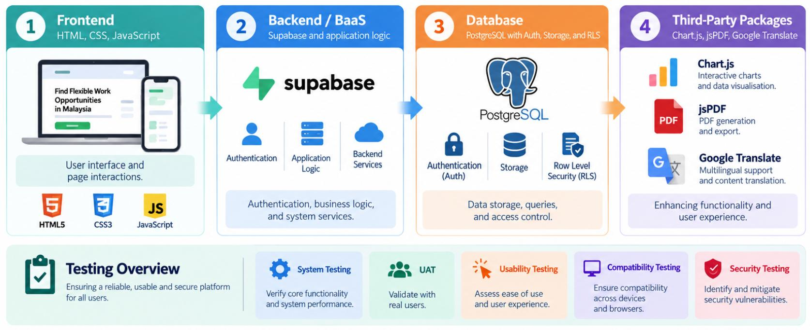

Figure 1.16: Project Constraints of EasyEarn

### 1.8.2 System Limitations

This section provides details on the current restrictions on the EasyEarn Job Matching Portal. The constraints are primarily about payment processing, real-time communication, mobile platform availability, and the size of the acceptance testing. While these restrictions do not hinder the system's core capabilities, they serve as a guide for future development to make the system more functional, accessible, and user-friendly.

No Integrated Payment Gateway

Financial transactions are currently outside EasyEarn, with cash or DuitNow transfers used. The platform does not have an integrated payment gateway; rather, it facilitates payment confirmation and dispute resolution. Integration with a regulated payment service can be explored in a future phase, subject to technical, regulatory and cost considerations (Bank Negara Malaysia, 2022).

No Real-Time Direct Messaging

Asynchronous messaging between Job Seekers and Employers is supported by EasyEarn (also known as real-time messaging or live chat is not implemented). The messages are stored and retrieved via the current messaging function, not using a real-time communication service. The existing messaging functionality can be enhanced with Supabase Realtime or another appropriate messaging service in the future.

No Native Mobile Application

EasyEarn is at the moment a responsive web application and there isn't any dedicated native mobile app. The platform can be accessed via mobile browsers, but there may be mobile-specific functions that can be offered with a native iOS or Android app, such as push notifications, offline access, and better mobile interaction. In Phase 2, therefore, it may be appropriate to consider the development of a native app for mobile devices (Apple Developer Program, 2023; Google Play Console, 2023).

Limited User Acceptance Testing

Five users were used for User Acceptance Testing (UAT) with 36 functional test cases, which were all performed by running them with real accounts and data on Supabase. While the main workflows were successfully tested, the number of testers was too small compared to the number of intended users in several underserved towns in Malaysia. Future development is recommended to be based on a larger scale, with field testing with a more representative group of end users.

No Automated Identity Verification

EasyEarn currently uses employer-submitted verification documents, the Employer Verification Badge and Admin review to support employer credibility. But the system doesn't support a formal automated identity verification system or government identity database. An appropriate identity verification service could be integrated in the future to enhance the employer verification process.

Multilingual Support via Redirection

Multilingual access currently is available on the EasyEarn site via Google Translate website translation service (and not via the Google in-app translation API). This opportunity gains you access to several languages, but has less control over the accuracy of translation, consistent tone, and translation into your interface. EasyEarn may be able to benefit from a native translation API like Google Cloud Translation in an upcoming version to offer an integrated multilingual user experience (Google Cloud, 2023).

In conclusion, there are six major drawbacks of the current EasyEarn system: there is no embedded payment gateway, real-time direct messaging, mobile app integration, automated identity verification, and the limited scale of UAT, in addition to website redirection instead of a native translation API from Google. These restrictions are primarily due to the scope, time, resource and technical constraints of the academic project. Each limitation offers a tangible direction for the next steps of development in Phase 2 and helps define the proposed Phase 2 development roadmap.

Table 1.8 shows a summary of the 6 system limitations, their effect on the current version of EasyEarn and the suggested enhancements for future releases.

Table 1.8: Summary of Limitations

| Type | Issues | Impact | Future Recommendation |
| --- | --- | --- | --- |
| Limitation | No integrated payment gateway | Payments are made outside the platform, but payments can still be recorded and managed in EasyEarn, and confirmations and disputes can be recorded. | Consider integrating a regulated payment service, such as DuitNow, in a future phase. |
| Limitation | No real-time direct messaging | Job Seekers and Employers interact asynchronously. | Make the current messaging feature more powerful by leveraging Supabase Realtime or another appropriate real-time messaging service. |
| Limitation | No native mobile application | Mobile users use the responsive Web interface and don&#x27;t have access to mobile-specific features. | Create and build native iOS or Android app including push notifications and offline support. |
| Limitation | Limited UAT sample | The UAT was performed with five testers and may not have captured the broader view of the target group. | Perform extended UAT and field testing to a larger number of users from various target towns and backgrounds. |
| Limitation | No automated identity verification | Employer verification is based on documents submitted and Admin review, not automated identity verification. | In future development, consider a formal identity verification service. |
| Limitation | Multilingual support via redirection | Google Translate website service is required for translation, and is not as integrated as a native translation API. | Consider upgrading to a native translation API such as Google Cloud Translation. |

To design a better system in the future, the EasyEarn system has six limitations, which are presented in Figure 1.17 and the solutions are recommended.

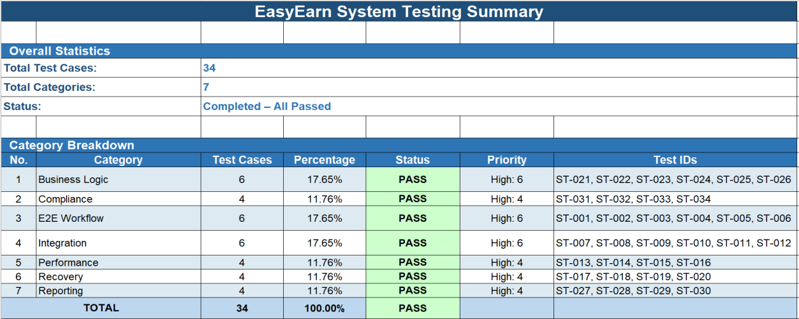

Figure 1.17: System Limitations of EasyEarn

1.9 Conclusion

This chapter has provided the background, motivation and direction for the development of EasyEarn, a web-based job-matching system for both job seekers and employers in underserved areas in Malaysia. Even though the national workforce of own-account workers has reached 3.09 million in 2024, or around 25.1 per cent of the national workforce, access to organised gig platforms is still limited to major urban areas, with smaller towns like Ipoh, Kangar and Kota Bharu being underserved (Department of Statistics Malaysia, 2024; MDEC, 2023).

The gap was identified in section 1.2 as being underpinned by six interconnected problems: Firstly, a lack of a specialised short-term labour platform for smaller towns; Secondly, an increase in social media job scams by 34 per cent in 2022; Thirdly, the absence of verifiable work histories for gig workers; Fourthly, inefficient SME recruitment; Fifthly, limited targeting of flexible worker demographics; Sixthly, English-only platform interfaces (UNCDF, 2019).

In response, Section 1.3 set four measurable research goals: Multi-user Portal with role-based access control, Safety and Trust Verification System, Developing a Work History Profile with an auto-generated PDF resume and Multilingual Accessibility through Google Translate. It is created in HTML, CSS, and JS, deployed via GitHub Pages, in a 26-week Hybrid Agile-Waterfall framework, built on Supabase. In Section 1.4, further details of the information security and compliance of information policies adopted were highlighted to ensure that EasyEarn complies with the PDPA (2010), Computer Crimes Act (1997) and Consumer Protection Act (1999).

In Section 1.5, the role of the platform in the job search, employer and Malaysian society was confirmed, especially in driving economic inclusion and preventing employment fraud. The literature review and research methodology will be covered in FYP1, and the findings and conclusions will be covered in FYP2.

# Chapter 4: Implementation

## 4.1 Introduction

The chapter presents the implementation and testing of the web-based gig job-matching platform, EasyEarn, developed by the International Labour Organisation (ILO) for the own-account and gig economy sectors, in which over 3 million workers participated in Malaysia in 2024 (Bernama, 2024). The chapter describes the main technologies and implementation decisions related to the frontend, backend, database and third-party packages. The testing section shares the outcomes of 5 complementary testing methods: System Testing, UAT, Usability Testing, Security Testing and Compatibility Testing. These testing methods can be used together to assess the functional and non-functional properties of EasyEarn and to understand the successes and areas for improvement.

## 4.2 Implementation

This section explains how EasyEarn is technically implemented in four aspects: Frontend, Backend, Database and Third-party Packages. EasyEarn is a statically-available frontend and a Backend-as-a-Service (BaaS). The front-end is comprised of HTML, CSS and JavaScript files served via GitHub Pages, and authentication, data persistence, access control and some database-level business logic are delivered by Supabase. This architecture minimises the need to have a dedicated application server and enables access-control rules to be implemented using Supabase RLS policies and database rules (Supabase, 2023). Section 4.2.1 explains the structure of the frontend and the page inventory; Section 4.2.2 describes the back-end services and the security model; Section 4.2.3 describes the third-party packages used in the system and the database schema and access-control policies; and Section 4.2.4 summarises the third-party packages used in the system.

### 4.2.1 Frontend

EasyEarn is a multi-page application containing 49 pages, organised into a set of public pages in the root directory (pages/index.html, pages/login.html, pages/jobs.html) and three directories that are role-scoped (pages/jobseeker/, pages/employer/, pages/admin/). The page distribution is summarised in Table 4.1 below.

Table 4.1: Page Distribution by role/section

| Section | Page Count | Representative Page | Paired CSS |
| --- | --- | --- | --- |
| Public / Auth | 16 | index, login, register, forgot-password, reset-password, jobs, about, help, report, security | css/landing.css, css/style.css |
| Job Seeker | 11 | dashboard, jobs, applications, saved-jobs, interviews, resume, work-history, messages, profile, logout | jobseeker-pages.css / jobseeker-dashboard.css |
| Employer | 8 | dashboard, post-job, manage-jobs, applicants, ratings, verification, messages, profile | employer-pages.css |
| Admin | 8 | dashboard, jobs, users, verifications, reports, analytics, messages, profile | admin-pages.css |

The three colour themes (green for Job Seekers, brown for Employers and purple for Admins) are stored centrally in a single CSS file per role folder, not in one file per page (MDN Web Docs, 2023). All pages are written using semantic HTML5 and assembled dynamically using a lightweight client-side includes system (js/includes.js), where a common header and footer are dynamically included in each page, without any server-side template engine; a pattern that is appropriate to a static host like GitHub Pages (GitHub, 2024).

To implement interactivity, we have 46 vanilla JavaScript ECMAScript (ES) modules (MDN Web Docs, 2023), one each page, for instance, jobseeker-resume.js, employer-manage-jobs.js, admin-analytics.js, etc., while a smaller number of shared modules take care of general cross-cutting concerns: auth.js (login/registration/role redirection), supabase-data.js (data access and auth-state guards), notifications-bell.js, theme.js (dark mode), translate.js (multi-language support), and floating-chatbot.js / chatbot.js (the rule-based assistant). RedirectByRole() is handled in auth.js and uses the Supabase role field for the authenticated user to route the user to the appropriate dashboard.

The Job Seeker Resume Builder uses four supporting libraries to extend page functionality over native browser APIs: Lucide (Lucide Contributors, 2025) is used to provide lightweight Scalable Vector Graphics (SVG) icons on all the role dashboards, Chart.js (Chart.js, 2023) is used to render the doughnut and bar charts on the Admin Analytics Dashboard and html2canvas (von Hertzen, 2025) and jsPDF (Hall, 2025) to take a snapshot of the on-screen resume DOM and export it as an A4 PDF without a server round trip.

### 4.2.2 Backend

EasyEarn's backend is powered by Supabase, with no need to build a custom application server. Three back-end issues are addressed this way: authentication, data access, and server-enforced business logic.

Authentication:

Supabase Auth provides email/password sign-up and login, and issues JSON Web Tokens (Jones et al., 2015), which are stored in the browser and automatically refreshed as needed without user intervention. Each protected page subscribes to the Supabase onAuthStateChange event using observeAuth() (js/supabase-data.js), and redirects unauthenticated visitors to the login page before any protected UI is rendered.

Data access:

Instead of sending raw Structured Query Language (SQL) in the client, all interactions with the database happen through the Supabase JavaScript client, which interprets the SQL requests and translates them into requests that can be made to the underlying PostgreSQL database as Hypertext Transfer Protocol (HTTP) requests (PostgREST, 2023). This is a way of minimising the direct risk of SQL injection that can arise from a user constructing queries manually (OWASP, 2025).

Table 4.2: Layered Access Control in EasyEarn

| Layer | Mechanism | Purpose |
| --- | --- | --- |
| Client-side | Use role guards in page JS (e.g. requireUser(), role checks in admin-*.js) | Protects UI from unauthorised users |
| Network | PostgREST over HTTPS, Supabase anon key | Enforces all queries to go through policy evaluation, never raw SQL |
| Database | RLS policies per table | Applies access rules when there are duplicate or modified client requests |

Server-enforced business logic:

Rules that must be obeyed no matter what client makes a call to the database are coded as Postgres trigger functions, not in JavaScript, and therefore can not be circumvented by a buggy or malicious client. The two key examples are sync_job_openings_from_application(), which is activated on INSERT/UPDATE/DELETE to the applications table to ensure that the job_listings.openings_count field is up to date, and no overbooking occurs, and notify_new_application(), which adds a row to the notifications table for the appropriate employer when an application is added to the applications table.

### 4.2.3 Database

The EasyEarn schema consists of 12 tables, summarised in Table 4.3: Key tables support soft-delete via a deleted_at timestamp column, preserving referential integrity while allowing logical removal of records (e.g. a withdrawn job listing).

Table 4.3: EasyEarn Database Tables and Purpose

| Table | Purpose |
| --- | --- |
| users | Stores information about the user&#x27;s profile and role (seeker/employer/admin) for each account. |
| job_listings | Job offers made by employers. |
| applications | Connects a person looking for a job to a job posting and tracks the status of the job. |
| notifications | Built-in notifications based on system events. |
| payments | Completed application payment history. |
| ratings | Employer-to-job seeker post-completion ratings. |
| reports | Safety reports (fraud, dispute, abuse) are checked by Admins. |
| saved_jobs | Job seeker bookmarks. |
| work_history | Completed-job records created when the application is completed. |
| chatbot_knowledge | Keyword-response pairs used by the rule-based chatbot. |
| chatbot_logs | Logged chatbot interactions. |
| analytics | All platform statistics for the Admin dashboard. |

Each table is configured with RLS, and policies are defined using three principals: authenticated user's UUID (auth.uid()), employer identity of a listing (employer_id), and verified by an administrator role check (a subquery on public.users.role). This means that each principal only sees data germane to their role; it is not just masked in the UI, it is masked in Postgres itself.

Duplicate records are prevented by two unique constraints: applications (job_id, seeker_id) means that no seeker can apply to the same listing twice, and ratings (application_id, reviewer_id) means that no duplicate ratings are possible. As data increases, the most commonly used foreign keys (applications.job_id, applications.seeker_id, notifications.user_id, payments.application_id, saved_jobs.seeker_id) are indexed to ensure that the dashboard queries run quickly.

### 4.2.4 Imported Packages

EasyEarn is an integration of the following library packages with the goal of facilitating development. The following are the libraries integrated in EasyEarn for easy development and summarised in Table 4.1. All client-side libraries are loaded from CDN links, without the need for a local build pipeline, as it is used during publishing to GitHub Pages.

Table 4.4: Imported Packages and Third-party Libraries Used in EasyEarn

| Package / Library | Version / Source | Purpose |
| --- | --- | --- |
| Supabase JS Client | @supabase/supabase-js(CDN) | Backend-as-a-service: Auth, Database access, enforce RLS with PostgREST |
| Chart.js | V4.x(CDN) | The charting in the Admin Analytics dashboard can be done in two ways: a doughnut chart and a bar chart. |
| jsPDF | v2.x(CDN) | Job Seeker: Export (programmatic) to PDF. |
| html2canvas | v1.x(CDN) | The frame source which was used for the exported resume (jsPDF) is a DOM-to-canvas snapshot. |
| Lucide Icons | CDN | Helpful, user-friendly, lightweight SVG icon library that is implemented in all role dashboards and in public pages. |
| Google Translate Website | Google Translate Web Service | Redirects the existing EasyEarn page to the Google Translate website translation service, making it accessible in multiple languages. |
| Google Fonts (Manrope, DM Sans) | CDN | When using secondary UI typefaces: Manrope on public &amp; landing pages; DM Sans on all role dashboards. |

Other services listed in Table 4.4 are the Supabase JavaScript Client (Supabase, 2023), which is used to access Supabase from the client-side JavaScript, the Google Translate website translation service for multilingual access and Google Fonts for providing the Manrope and DM Sans typefaces employed across the site.

### 4.2.5 System Deployment

EasyEarn is published using the automatic build-and-deploy pipeline offered by GitHub Pages, which automatically rebuilds and republishes EasyEarn when changes are made to the main branch without needing a custom build/publish pipeline or manual release step. EasyEarn is built with a static-frontend, BaaS architecture, meaning that the HTML, CSS and JavaScript frontend is served from GitHub Pages, while Supabase serves managed backend services like authentication, database access, Row Level Security and business logic at the database level. This design makes it possible to deploy the system without a specific application server.

There were some problems that were encountered in the deployment process that were not apparent when developing locally and only became apparent during deployment; these were related to paths. Shared partials are used in the site, including a common header and footer that are included from a shared file, js/includes.js (Section 4.2.1). The paths to these partials, logos and backgrounds are different for the depth of each page within the folder hierarchy, however. For instance, pages/jobseeker/dashboard.html has to have a different relative path from the top-level pages. Each page sets the EASYEARN_BASE_PATH global variable before the include file includes.js is loaded (such as '../../' for role-specific pages), so that they don't have to duplicate the logic for including the script. Then the script uses this base path to determine at runtime where the header, footer, logo and footer-link will be found. This is a partial-loading dynamic that will allow the same common components to load properly on all 49 pages, even with the varying folder depths.

After several iterations of build-fix-refine, 94 deployments to GitHub Pages were achieved, as seen in Figure 4.1. Of those, 9 were development failures. For instance, deployment #8 ("fix includes.js syntax error") was not successful due to a syntax error added while modifying the base-path system; deployment #34 ("fix: remove hardcoded white background, restore dark mode") and deployment #75 ("Fix register box top gap clipped on full screen") were CSS layout fixes. There were subsequent corrective commits that were deployed, like deployment #9 ("fix includes.js trailing characters") and deployment #76 (fix register-box). This deployment history demonstrates that errors while deploying were tracked and fixed in the iterative development process.

EasyEarn is now released on GitHub Pages and can be found at https://peiying040830.github.io/easyearn/. The deployment is in line with the static-frontend and BaaS architecture explained in Section 4.2, and the project author does not need to provision and maintain a dedicated application server.

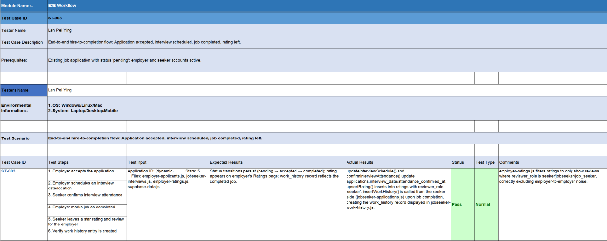

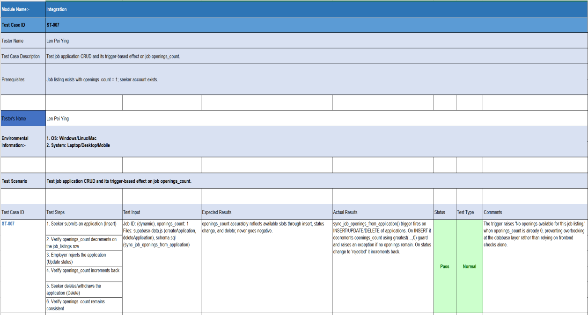

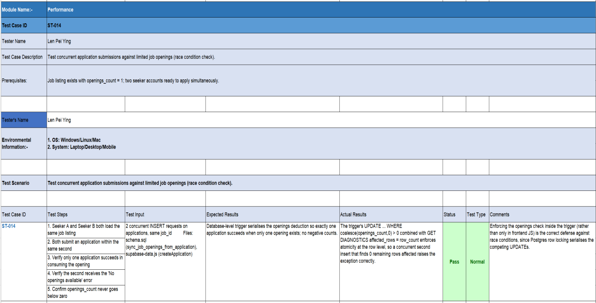

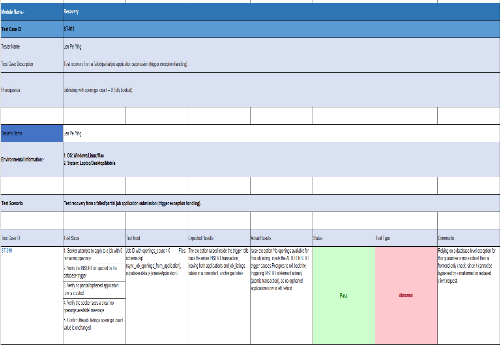

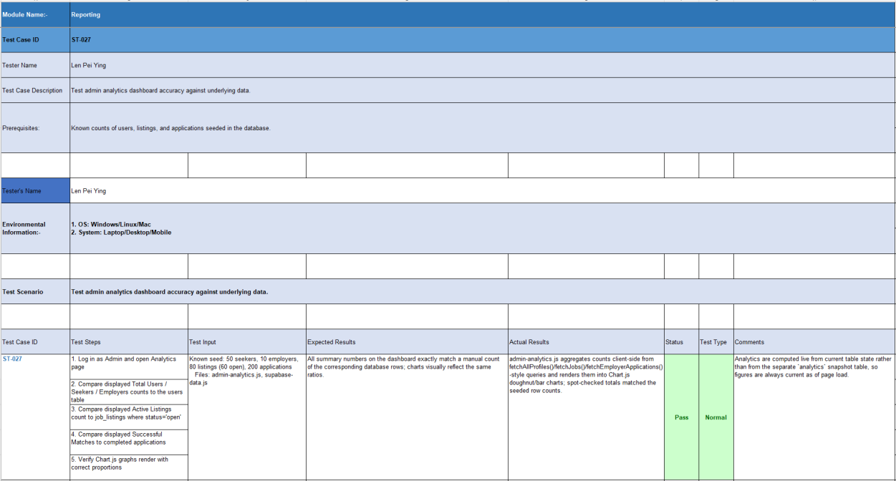

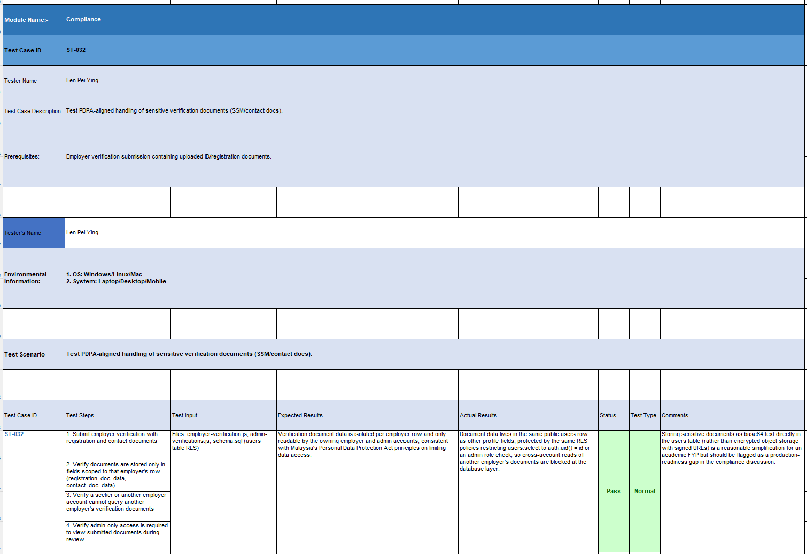

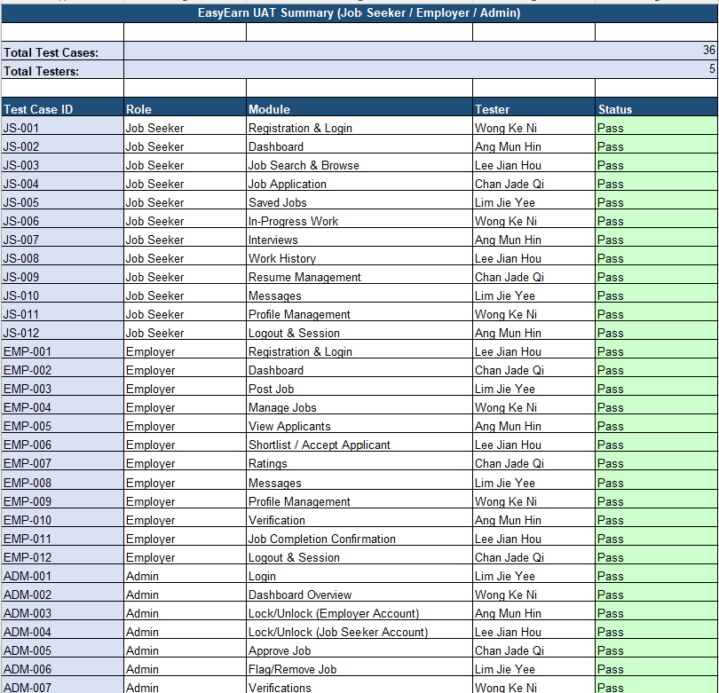

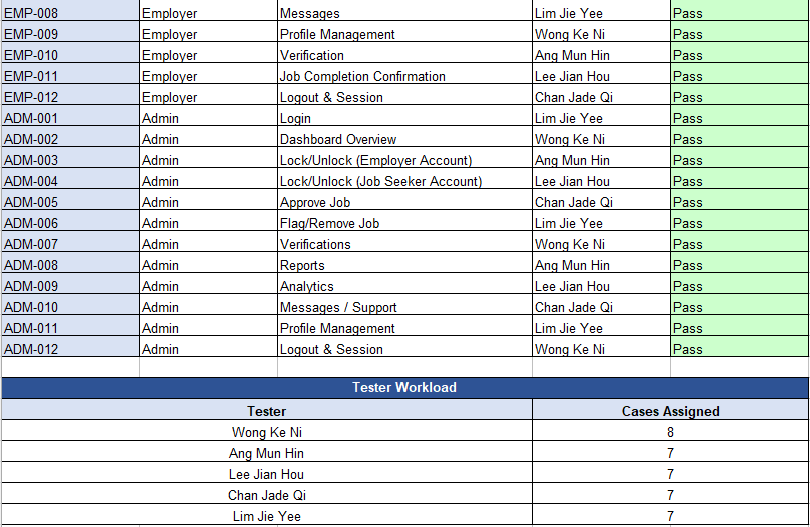

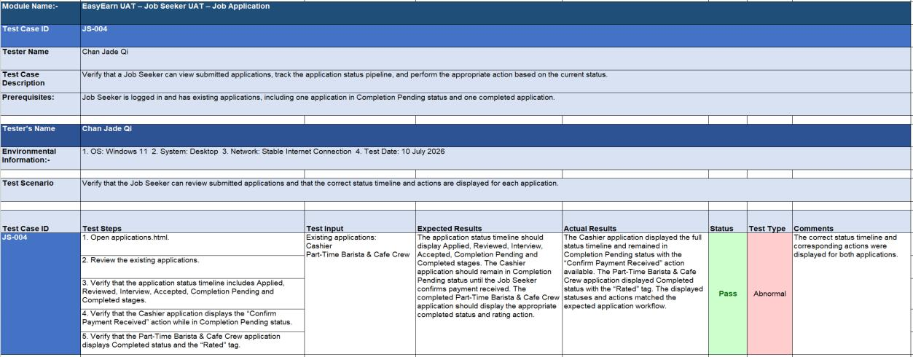

Figure 4.1: GitHub Pages Deployment History

## 4.3 Testing

Five complementary testing methods were used: System Testing (ST), User Acceptance Testing (UAT), Usability Testing, Security Testing (SEC), and Compatibility Testing (CT). The methods are used to assess various quality characteristics of EasyEarn, such as functional correctness, user acceptance, usability, security and cross-environment behaviour. System Testing is the testing that checks the end-to-end (E2E) functionality of the EasyEarn.

### 4.3.1 System Testing

Seven categories of system tests were conducted to ensure full end-to-end (E2E) functionality of EasyEarn with respect to functional requirements: E2E Workflow, Integration, Performance, Recovery, Business Logic, Reporting and Compliance. All 34 test cases returned a Pass result and were designed and executed under this section. Security Testing (29 test cases, SEC-001 to SEC-029) and Compatibility Testing (23 test cases, CT-001 to CT-023) are each covered separately in Sections 4.3.4 and 4.3.5, respectively, as they are different testing methods and have their own test workbooks. The seven categories of System Testing are summarised in Figure 4.2, and the individual test cases with their scenarios, test types and outcomes are provided in Figures 4.3 to 4.36.

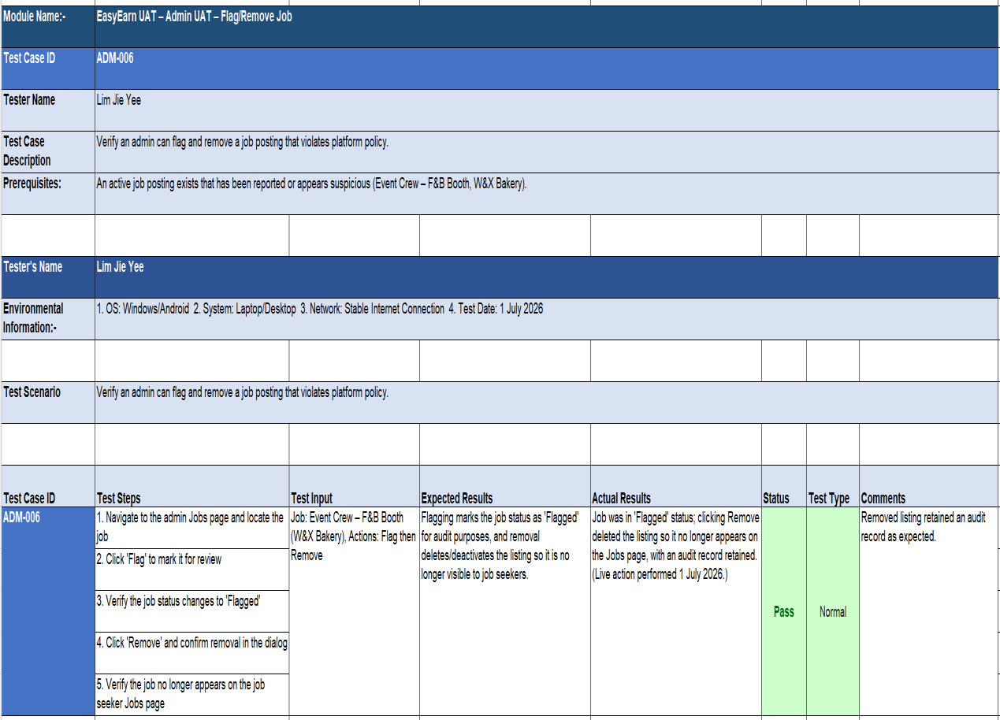

Figure 4.2: EasyEarn System Testing Summary

#### 4.3.1.1 E2E Workflow

End-to-end workflow testing confirms that end-to-end user journeys work without any problems.

ST-001: Job seeker registration to application

It's a complete experience of the job seeker: from creating an account and completing a profile to browsing job listings and submitting an application. Ensures that the application is properly documented and in the Applications section with a pending status. The job seeker's profile form and completed profile are depicted in Figure 4.3 along with the completed application submitted with a "pending" status.

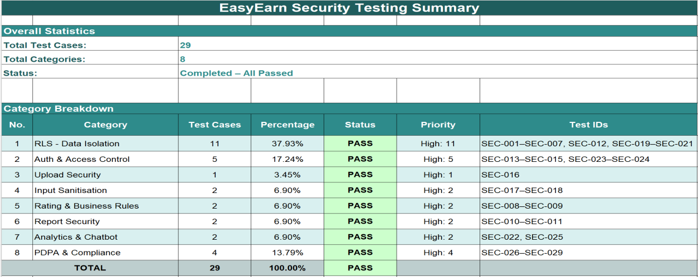

Figure 4.3: Registration of the job seeker as an applicant

ST-002: Employer registration to applicant review

Handles onboarding of the employer with a secure employer code, posting job listings, and the employer reviews incoming applicants. Ensures proper gating of registration and that applicant status updates are communicated to the seeker. The employer registration with the secure employer code, posted job listing, and the applicant review screen are illustrated in Figure 4.4.

Figure 4.4: Registration of the job seeker as an applicant

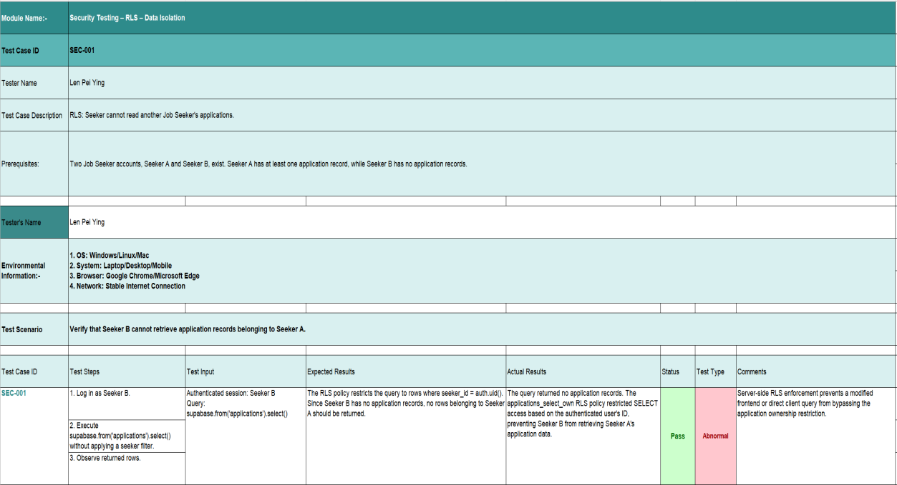

ST-003: Hire-to-completion flow

Handles the entire process from application to interview, to job and to rating. Checks that status changes are retained appropriately and a work history record is generated when the status is completed. Figure 4.5 illustrates the application going through the interview and job stages, arriving at the rating screen and the created work history record.

Figure 4.5: Hire-to-completion flow

ST-004: Admin moderation lifecycle

Consists of an admin who reviews a reported job listing, suspends it and resolves the report. Confirms that the listing is no longer visible when publicly searching for a listing and the report is marked resolved with notes saved. The admin moderation screen for a reported listing with the suspend action and resolved report, along with saved notes, is depicted in Figure 4.6.

Figure 4.6: Admin Moderation Lifecycle

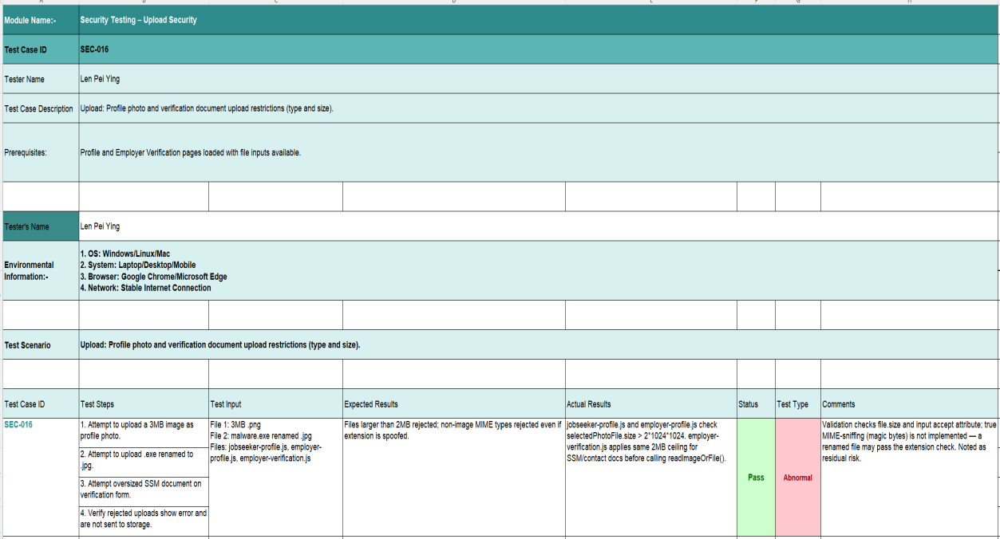

ST-005: Payment lifecycle

Completes the two-step payment confirmation: employer marks payment as paid, seeker confirms receipt. Ensures both times are independently recorded, and payment is not "confirmed" until the seeker acts. The two-step payment confirmation is shown in Figure 4.7: the employer's "Mark as Paid" action and the independent receipt confirmation.

Figure 4.7: Payment Lifecycle

ST-006: Payment dispute and resolution

Covers a seeker who raises a payment dispute rather than confirming receipt, and admin mediation. Validates that the report is correct for the correct application/payment, without changing the payment state. The payment dispute submission and correct payment/record view for admin mediation are shown in Figure 4.8.

Figure 4.8: Payment Dispute and Resolution

#### 4.3.1.2 Integration

Integration testing ensures that the connected components, easyearn's database triggers, notifications and messaging work properly together.

ST-007: Application CRUD and openings_count trigger

An application is created, updated, and deleted properly, and the necessary database function to update the job's openings count is called, not allowing the count to fall below zero. The application record is created, updated and deleted as shown in Figure 4.9, and the job's openings_count field updates correctly with each of these operations.

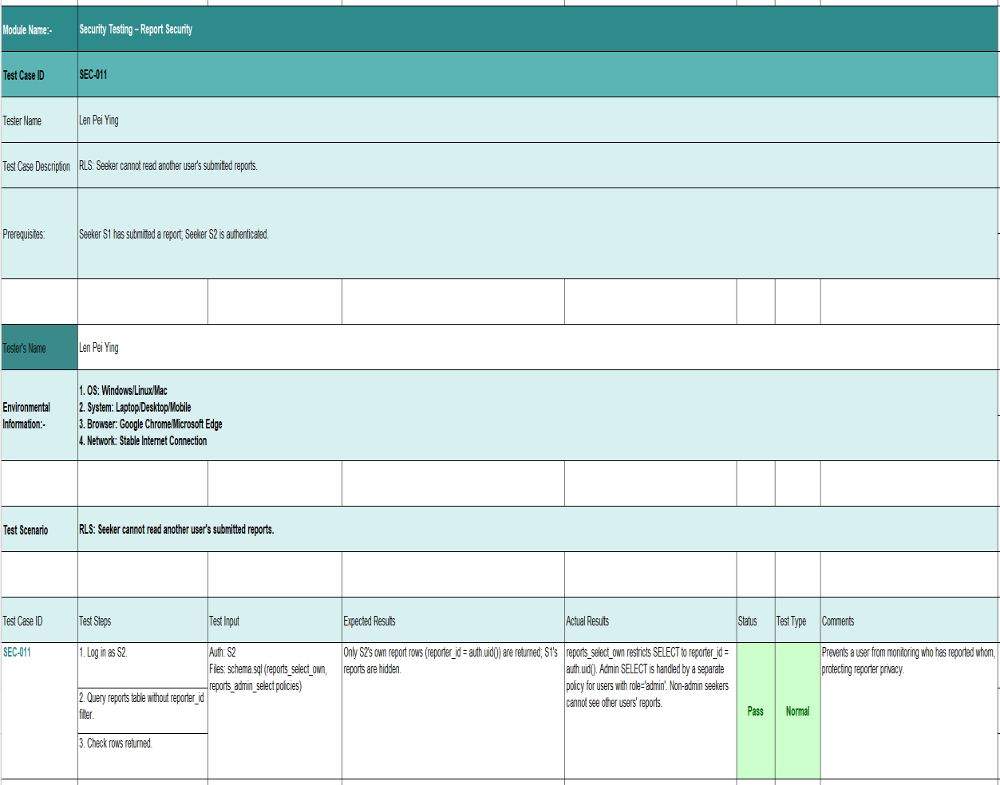

Figure 4.9: Application CRUD and openings_count trigger

ST-008: New-application notification trigger

Tests that automatically create a notification to the proper employer when a new application is submitted and that update the status of the application when the status is marked read. The employer gets a notification with the new application, and the application status is automatically updated when the notification is marked as read, as shown in Figure 4.10.

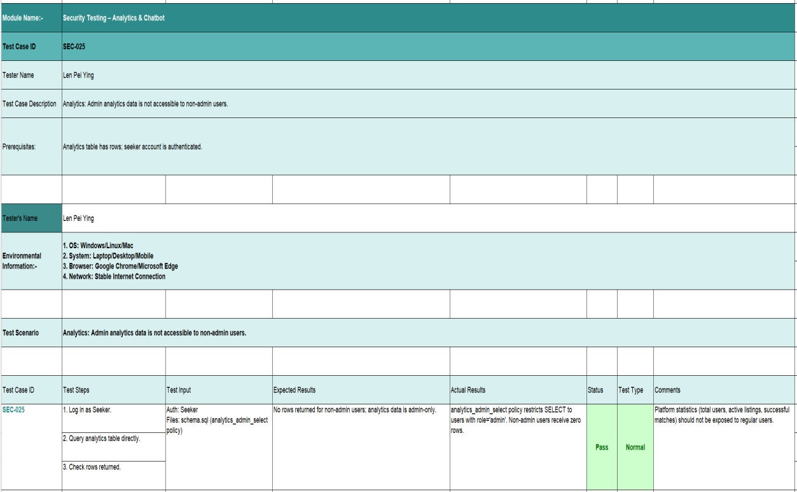

Figure 4.10: New-application Notification Trigger

ST-009: Employer verification workflow

Performs an end-to-end employer verification process, including document submission, admin approval and checks that the verified badge is displayed throughout the platform after successful verification. The employer verification workflow depicted in Figure 4.11 starts with the submission of the document, moves to admin approval and finally results in the verified badge on the platform.

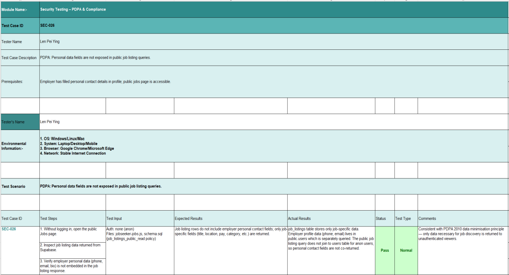

Figure 4.11: Employer Verification Workflow

ST-010: Messaging integration

Tests asynchronous messaging between the Job Seeker and Employer to ensure that messages are stored and that the unread message indicator functions properly. The message thread shows the messages exchanged properly, and unread messages are marked as expected, as indicated in Figure 4.12.

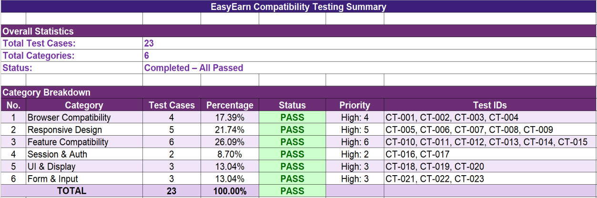

Figure 4.12: Messaging Integration

ST-011: Chatbot knowledge base Integration

Tests that return results to queries are seeded; unrecognised tests return gracefully; both recognised and unrecognised tests are logged with a matched/unmatched flag. The chatbot gives back seeded responses for the recognised queries and a nice response for the unrecognised queries in Figure 4.13.

Figure 4.13: Chatbot Knowledge Base Integration

ST-012: Saved jobs integration

Correct Bookmark / Unbookmark synchronisation on the saved_jobs table and correct metrics for the Saved Jobs page. The Saved Jobs page displays the Saved Jobs and their metrics, synced as shown in Figure 4.14.

Figure 4.14: Saved Jobs Integration

#### 4.3.1.3 Performance

To test the performance of EasyEarn, it is subjected to various loads, such as large amounts of data and time-sensitive processes.

ST-013: Jobs page load and filter performance

Renders and filters a large set of job listings, showing that test page loads and filtering speed are within target and that no UI freezes while rendering or filtering. The Jobs page is rendering and filtering a large number of jobs, as seen in Figure 4.15, and the load and filter times are within target.

Figure 4.15: Jobs Page Load and Filter Performance

ST-014: Concurrent application race condition

Tests the case where multiple applications are submitted simultaneously to a job with exactly one remaining slot, and validates that the database trigger is satisfied by exactly one application. The following Figure 4.16 illustrates the simultaneous applications submitted to a job with one slot still available, in which the database trigger allows exactly one of these applications.

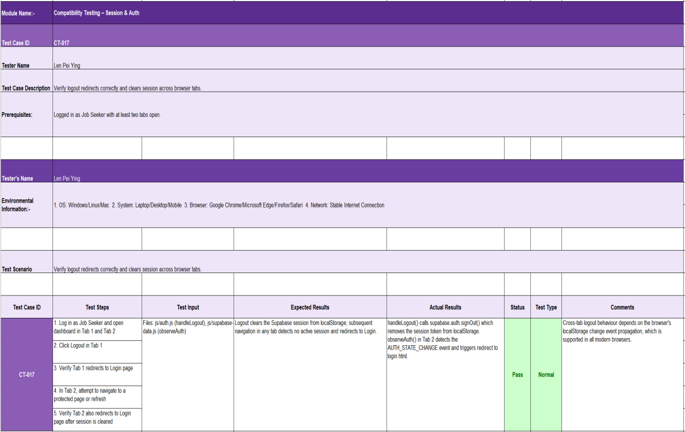

Figure 4.16: Concurrent Application Race Condition

ST-015: PDF resume generation performance

Takes a test of the jsPDF + html2canvas resume export functionality, checking that it generates within the set time limit and is not clipped. The PDF resume export was successful, and the generated document was not clipped, as can be seen in Figure 4.17; it completed export within the target timing.

Figure 4.17: PDF Resume Generation Performance

ST-016: Admin analytics dashboard render time

This test measures the performance of loading the dashboard when it loads a large application dataset, validating the rendering of summary cards and charts within the target time on cold load. Figure 4.18 demonstrates the admin analytics dashboard loading a large dataset and rendering summary cards and charts within the target time.

Figure 4.18: Admin Analytics Dashboard Render Time

#### 4.3.1.4 Recovery

Recovery testing is run to check how EasyEarn deals with failures like lost connections and expired sessions, allowing for graceful recovery.

ST-017: Supabase connectivity loss handling

Test application behaviour in the event of a connection drop to Supabase, ensuring that errors are gracefully presented and that the application retries when the connection is restored. Handling a dropped Supabase connection with a friendly error message and retry when it reconnects, as seen in Figure 4.19.

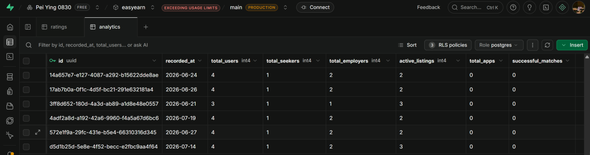

Figure 4.19: Supabase Connectivity Loss Handling

ST-018: Session expiry and re-authentication

Tests which detect an expired session and prompt a user to log in; that is, no protected data is passed to an unauthenticated request. In Figure 4.20, an expired session is detected, and a new session is re-authenticated, but no data is returned to the unauthenticated request.

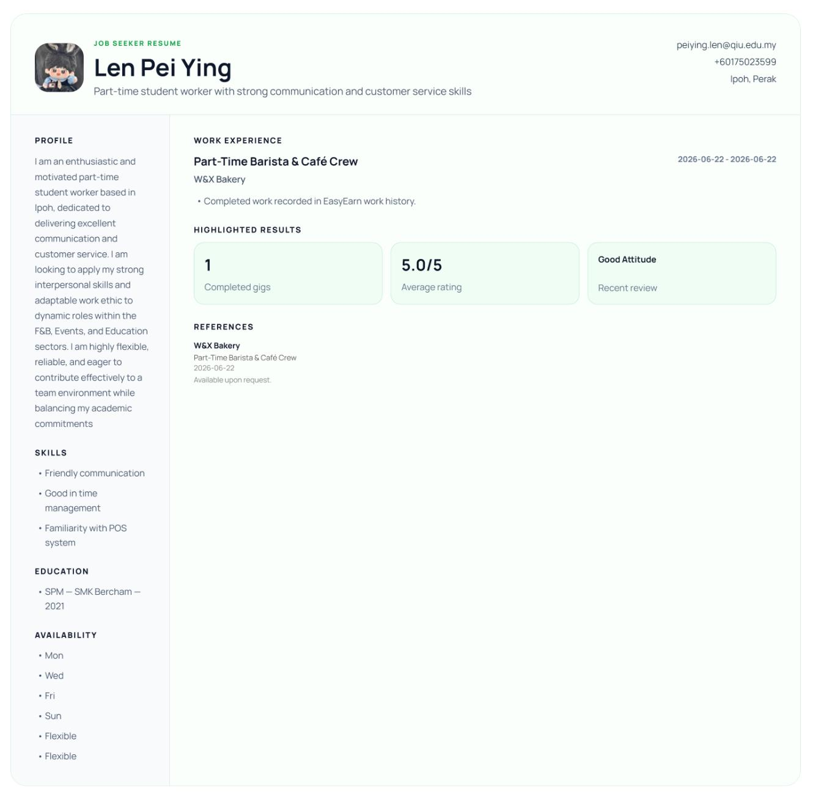

Figure 4.20: Session Expiry and Re-authentication

ST-019: Failed application submission rollback

Tests that are raised from within a database will roll back effectively if the exception is raised, and keep the data in a consistent state. In Figure 4.21, the application fails to submit, but the database transactions roll back without any data being corrupted.

Figure 4.21: Failed Application Submission Rollback

ST-020: Duplicate payment prevention on retry

Tests which retried the action "Mark as Paid" to see if it would update the existing payment record instead of creating a duplicate with conflicting information. If the Mark as Paid action is retried, it will update the existing payment record without creating another record, as shown in Figure 4.22.

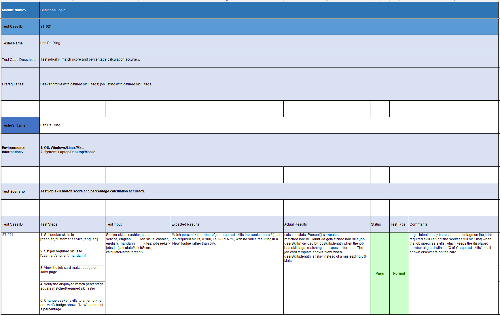

Figure 4.22: Duplicate Payment Prevention on Retry

#### 4.3.1.5 Business Logic

Business logic testing verifies that the key rules, matching and status transitions of EasyEarn are implemented correctly, as are its ratings.

ST-021: Match score calculation accuracy

Takes the skill-matching percentage formula test and shows the correct percentage match for skills that are required if present; a badge of "New" is displayed if there are no required skills listed. The calculated match percentage for required skills and the "New" badge displayed when no skills are listed are demonstrated in Figure 4.23.

Figure 4.23: Match Score Calculation Accuracy

ST-022: Location-distance bonus and match cap

Tests a distance-based bonus that will increase match score for nearby jobs, with a maximum bonus of 99% for jobs that match, and a maximum bonus of 85% for jobs that do not match. The match bonus applied for the distance can be seen in Figure 4.24, where the scores are limited to 99% for known locations and 85% for unknown locations.

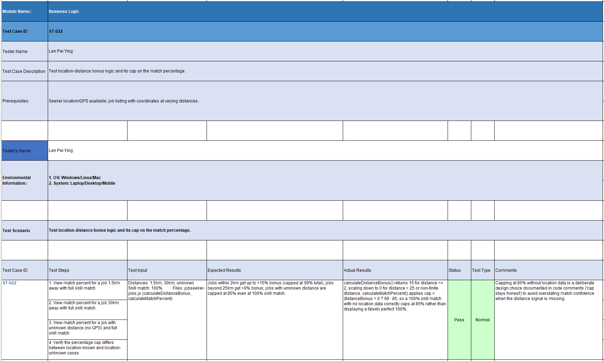

Figure 4.24: Location-distance Bonus and Match Cap

ST-023: Application status transition constraints

Tests ensuring that only valid forward status changes can be made through the employer UI, with a verifier that reversal of a completed application or seeker self-editing is not allowed. Figure 4.25 is the employer UI that can only accept valid forward changes in status, which prevents the seekers from changing status and editing their own applications.

Figure 4.25: Application Status Transition Constraints

ST-024: Bidirectional rating eligibility

Tests in which the rating feature is only available after the job has been completed and if two people rate the same job, then the first rating is updated by the second, not duplicated. The rating feature only appears after the job is complete and a second rating appears and does not duplicate the first rating, as shown in Figure 4.26.

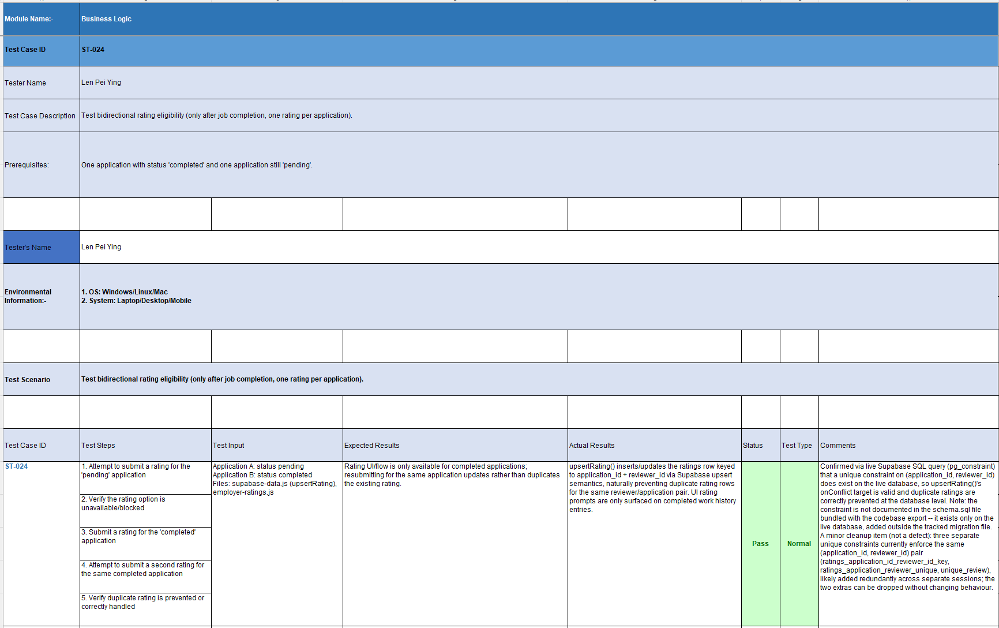

Figure 4.26: Bidirectional Rating Eligibility

ST-025: Admin moderation queue classification

Clearly defined tests where each moderation status label translates correctly to the job listing status in the underlying queue, and filters update the visible queue and the metric counts. The admin moderation queue and filters are updating the queue and metric counts, with each status label correctly mapped as shown in Figure 4.27.

Figure 4.27: Admin Moderation Queue Classification

ST-026: Employer verification badge visibility

Tests in which the verified badge is added and removed from the listing when the employer's account is verified/removed from the verified tab, and the same applies across both views of the profile (listing and profile). When the status of a listing changes, the verified badge appears and disappears on the listing view as well as the profile view, as seen in Figure 4.28.

Figure 4.28: Employer Verification Badge Visibility

4.3.1.5 Reporting

Test results are reported and dashboards and generated reports reflect the underlying database state accurately.

ST-027: Admin analytics dashboard accuracy

Tests for each summary number on the dashboard to see that they are equal to the number of underlying database rows and that the proportions of the chart correspond to the proportions of the rows. Admin page numbers for analytics dashboard appear in the same proportion as the numbers in the database, as seen in Figure 4.29.

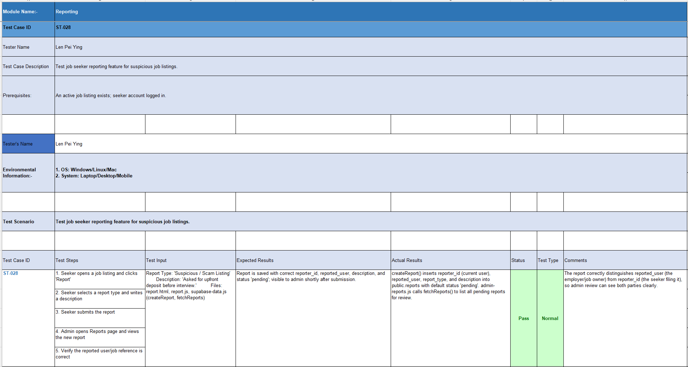

Figure 4.29: Admin Analytics Dashboard Accuracy

ST-028: Job listing reporting feature

Tests whether a job seeker submits a suspicious listing, it is saved correctly, and the admin can see it soon after the job seeker submits the listing. The listing report of a suspicious job seeker is saved and displayed instantly in the admin's report queue, as illustrated in Figure 4.30.

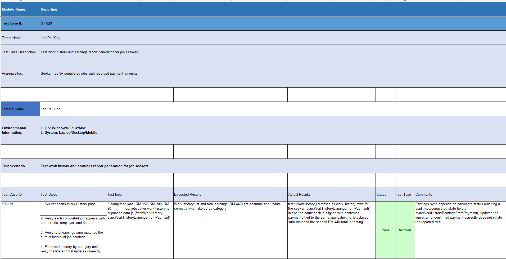

Figure 4.30: Job Listing Report Feature

ST-029: Work history and earnings report

Checks to see if the work history list and total earnings amount are accurate and update properly when the work history is filtered by category. When filtered by ‘category', the work history list and total earnings are updated correctly, as shown in Figure 4.31.

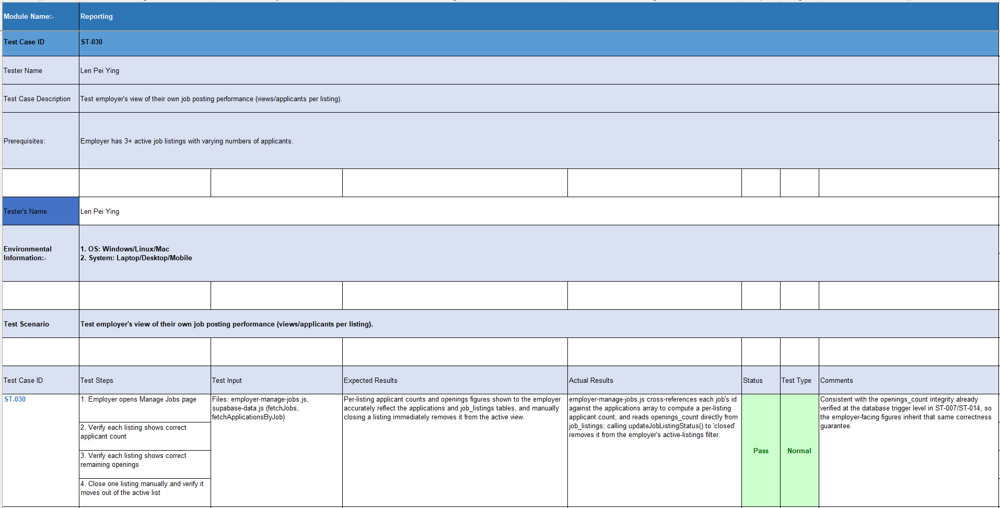

Figure 4.31: Work History and Earnings Report

ST-030: Employer job posting performance view

Tests that provide the employer with the number of applicants or openings per listing that is accurate, and that the removal of a listing is immediate from the listing's view. As seen in Figure 4.32, employers see their job posting performance view with an accurate count of applicants/opportunities as well as a job post disappearing right after it was removed.

Figure 4.32: Employer Job Posting Performance View

#### 4.3.1.6 Compliance

This category evaluates selected EasyEarn features against privacy, transparency and user-protection considerations related to the PDPA 2010 and the Gig Workers Act 2025. Four test cases (ST-031 to ST-034) were created for this purpose. These tests verify the presence and behaviour of relevant system features but do not constitute a formal legal or regulatory compliance audit.

ST-031: Privacy Policy and Terms of Service accessibility

The Privacy Policy and Terms of Service pages are in place and accurately explain how data is handled and are always linked from the site footer. The Privacy Policy and Terms of Service pages with the correct information on how to handle the data are located in the site footer, as shown in Figure 4.33.

Figure 4.33: Privacy Policy and Terms of Service Accessibility

ST-032: PDPA-aligned document handling

Tests where sensitive employer verification documents are separated per account and can only be read by the account owner and admin, as per the Malaysian PDPA. The PDPA is respected by restricting access to the employer verification documents to the account owner and admin, as shown in Figure 4.34.

Figure 4.34: PDPA-aligned Document Handling

ST-033: Admin audit trail for account decisions

Tests that will change access due to changes in access status will be reported and will be recorded as rejection status notes and displayed to the affected employer. The audit trail includes a record of the access-status change, and the rejection notes are shown to the employer concerned, as shown in Figure 4.35.

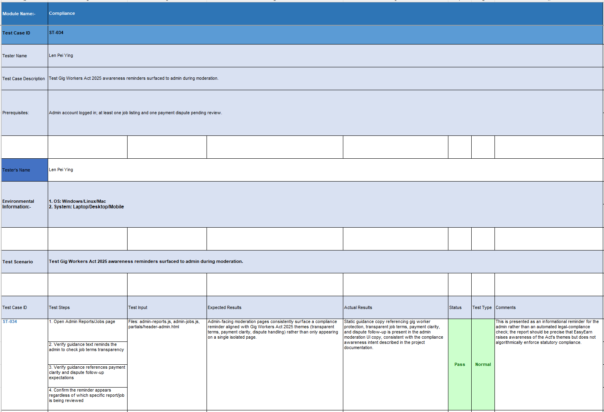

Figure 4.35: Admin Audit Trail for Account Decisions

ST-034: Gig Workers Act 2025 compliance reminders

Admin-focused compliance pages that consistently appear with compliance reminders that align with the Gig Workers Act 2025 (transparent terms, payment clarity, dispute handling) rather than on a single page. The admin compliance pages will include reminders about the Gig Workers Act 2025 regarding terms, clarity of payment, and dispute resolution, as illustrated in Figure 4.36.

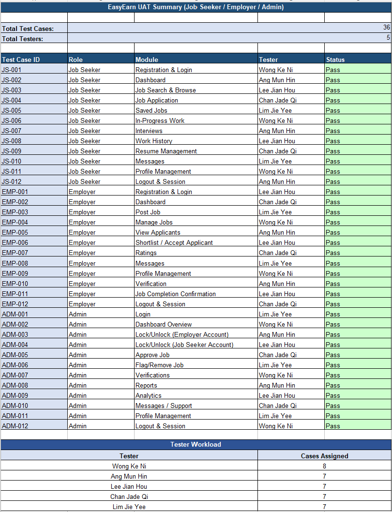

Figure 4.36: Gig Workers Act 2025 Compliance Reminders

The results for all 34 system test cases were Pass. Some of the main findings of the system testing are as follows. It serialises concurrent application inserts correctly in the database, using a trigger sync_job_openings_from_application(), without depending on checks at the front end. To limit the confidence that may be given to a match, the match scoring algorithm (calculateMatchPercent / calculateDistanceBonus) introduces a maximum score of 99% for location-known matches and 85% for location-unknown matches. Two payment timestamped confirmations (as separate fields employer_paid_at, seeker_confirmed_at) prevent the employer or the seeker from independently confirming the payment, thereby securing the payment for both parties. This is a bidirectional rating system, which is enforced by the unique constraint on the live database (and by the UI gating that provides rating prompts only when the work history is complete).

### 4.3.2 User Acceptance Testing (UAT)

UAT was performed to assess if EasyEarn behaves as intended for three user types: Job Seeker, Employer and Admin with real data and accounts on Supabase, rather than mock data. A series of functional test cases was developed for the key workflows of each role. A total of 36 test cases were defined for the three roles and shared among 5 testers, who each ran 1 test case. Compatibility Testing (Section 4.3.5) was evaluated separately for cross-browser/device consistency. The results for each role are described below starting with the Job Seeker role. The distribution of the 36 UAT test cases by role, module, assigned tester and pass/fail, with the workload distribution of all testers, is summarised in Figure 4.37.

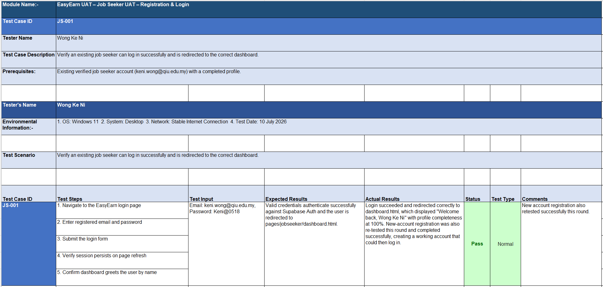

Figure 4.37: Summary of UAT

#### 4.3.2.1 Job Seeker UAT

A total of 12 test cases were created in the Job Seeker module and tested for that module, namely the Job Seeker module: Registration, Login, Job Search, Application, Saved Jobs, Interview, Work History, Resume management, Messages, Profile management, and Logout. Each case was run exactly once by the case tester and supplied with real account information stored in Supabase. In this section, “JS” is prepended to the test cases that are used to validate/activate Job Seeker.

JS-001: Registration and login

Successful login and redirection to Dashboard with profile completion of 100% and message "Welcome back, Wong Ke Ni". This round was also re-tested for new account registration, which was successful, with a working account that was successfully logged in. The Dashboard will appear as shown in Figure 4.38 as soon as you log in, and the Profile Completion Indicator will be at 100%.

Figure 4.38: Job Seeker - Registration and Login

JS-002: Dashboard

The Applications column in the Dashboard counted 2, the Interviews column counted 2, and the Saved Jobs column counted 3. The Applications column in the Dashboard had 2, the Interviews column had 2, and the Saved Jobs column had 3. There were 2 applications, both completed, with 0 Pending, 0 Reviewed and 0 Rejected in the Application Pipeline. The Dashboard summary cards for Applications, Interviews, and Saved Jobs are highlighted in Figure 4.39 along with the Application Pipeline breakdown.

Figure 4.39: Job Seeker - Dashboard

JS-003: Job Search and Browse

The activity summary read: Saved: 3, Applied: 2, Skill Match: 2, Available: 2. The "Approved jobs available now" section was correct, as none of the jobs was available, but there were jobs that were approved yet were not active, and they were visible as "Jobs you've applied to" with Saved + Applied. Cashier (80% match) and Part-Time Barista & Cafe Crew (60% match) were both correct, as they were applied to and were saved. The Jobs page Activity Summary, search/filter panel and applied job listings with match percentages are displayed in Figure 4.40.

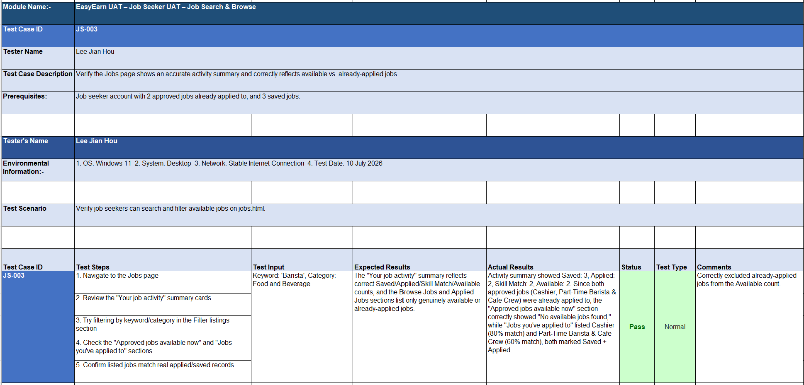

Figure 4.40: Job Seeker - Job Search and Browse

JS-004: Job Application

Completed has been applied and reviewed in both applications, with the "Confirm Payment Received" action in Cashier and a "Rated" tag in Barista. The Applications page includes both completed Applications: the Confirm Payment Received action and the Rated tag, as shown in Figure 4.41.

Figure 4.41: Job Seeker - Job Application

JS-005: Saved Jobs

The count badge for all 3 saved jobs was displayed under the Saved Jobs tab. Each card was confirmed to have a Remove option, and it was clickable. The Saved Jobs tab appears with the count badge and Remove button on the job cards as shown in Figure 4.42.

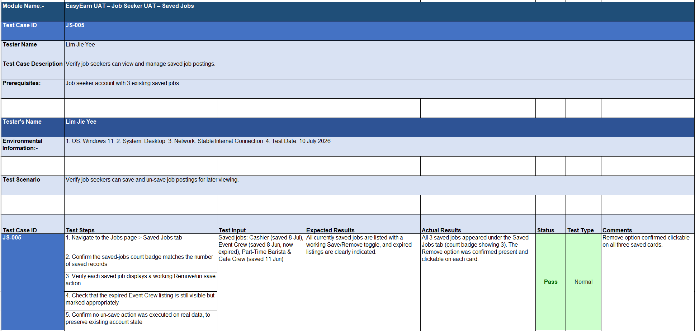

Figure 4.42: Job Seeker - Saved Jobs

JS-006: In-Progress Work

EasyEarn has no In-Progress page, but rather the filter "Active (Pending/Reviewed/Accepted)" on applications.html does this. The two real applications are already Completed, so the Active count would be correct at 0. Clicking the Applications page with the Active (Pending/Reviewed/Accepted) filter selected returns 0 applications, as shown in Figure 4.43.

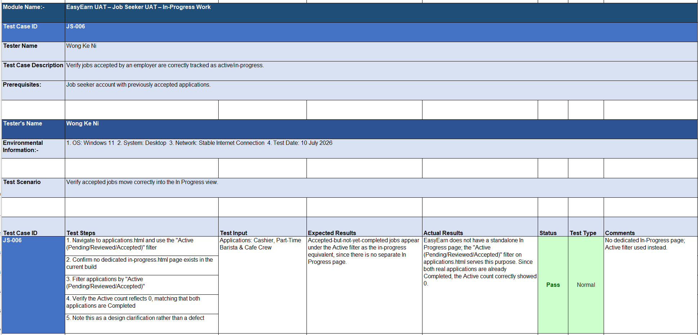

Figure 4.43: Job Seeker - In-Progress Work

JS-007: Interviews

Based on the Interview Summary, the number of confirmed interviews was 2, the number of upcoming interviews was 0, and the number of completed interviews was 2. For both interviews, the correct date and time were specified, along with a working link to Google Meet, and there were actions to View Application and Open Chat. The Interview Summary appears in Figure 4.44 along with the two completed interview records with the date, time, and Google Meet link.

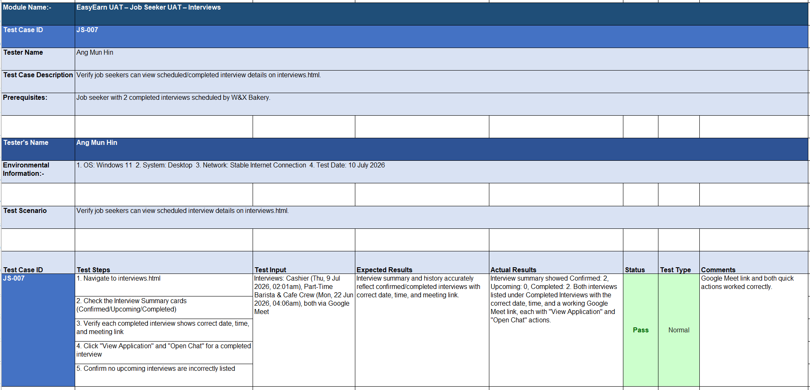

Figure 4.44: Job Seeker – Interviews

JS-008: Work History

The recent work record was tagged with RM180: Food and Beverage, Rated, and dated 2026-06-22 (which is Part-Time Barista & Cafe Crew). Completed Jobs: 1, Total Earnings: RM180, Top Category: Food and Beverage. The Work History page displays the summary stats and the Barista work record, dated as shown in Figure 4.45.

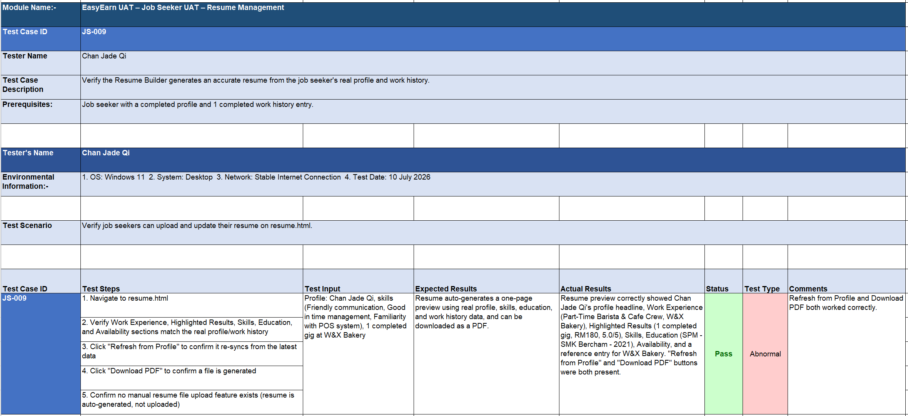

Figure 4.45: Job Seeker - Work History

JS-009: Resume Management

The profile headline was correctly included in the Resume preview, as were the Work Experience (Part-Time Barista & Cafe Crew, W&X Bakery), the Highlighted Results (1 completed gig, RM180, 5.0/5), Skills, Education (SPM - SMK Bercham - 2021), and the Availability, as well as a reference section for W&X Bakery. Both the "Refresh from Profile" and the "Download PDF" buttons were included, which means that the resume is not uploaded but rather is auto-generated. The auto-generated Resume preview is displayed in Figure 4.46 along with the headline, work experience, skills, education and availability sections.

Figure 4.46: Job Seeker - Resume Management

JS-010: Messages

The W&X Bakery thread was there and looked good in the Inbox, in the style of “Part-Time Barista & Cafe Crew - 5.0 - 1 review.” The job context and an existing image attachment from the employer were displayed in the thread view, with a working message input box and a pair of Attach Image and Send Message controls. In Figure 4.47, the Messages inbox is displayed, showing the W&X Bakery thread with the job and image attachment displayed.

Figure 4.47: Job Seeker – Messages

JS-011: Profile Management

The Profile page displayed a 100% Profile Strength with 3 ratings, 2 completed gigs and 2 applications, and 3 saved jobs. All three Edit Info, Skills & Experience, Education Background and Set Availability sections were accurate, as they were in the real saved data. On the Profile page, you can see the Profile Strength indicator and the Edit Info, Skills & Experience and the Availability sections as in Figure 4.48.

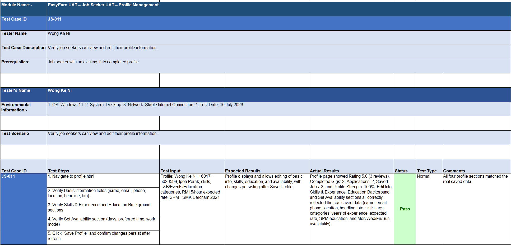

Figure 4.48: Job Seeker - Profile Management

JS-012: Logout and Session

User can log out from the system and enter a session (Tested by Ang Mun Hin). Directly visiting dashboard.html after logging out routed to the login page, and re-authenticating with the account username/password had to be done to access dashboard.html. When dashboard.html was called directly after logging out, the login page appeared as in Figure 4.49.

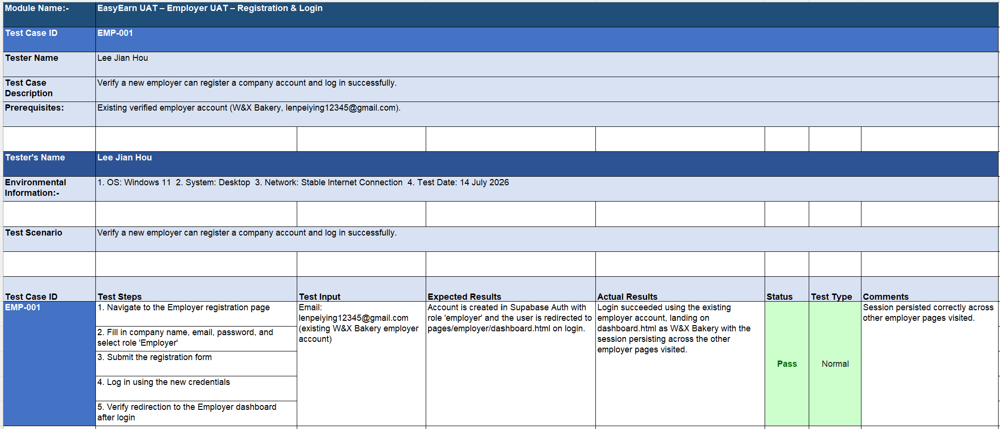

Figure 4.49: Job Seeker - Logout and Session

#### 4.3.2.2 Employer UAT

For the Employer module, there are a total of 12 test cases created and tested for the module, namely Employer module: Registration and Login, Dashboard, Post Job, Manage Jobs, View Applicants, Shortlist/Accept Applicant, Ratings, Messages, Profile Management, Verification, Job Completion Confirmation and Logout and Session. The case tester ran each case exactly once, providing real account information from Supabase.

EMP-001: Registration and Login

Successfully logged in with an existing Employer Account (W&X Bakery), then successfully redirected to the Employer Dashboard, then successful logon with the same Employer Account across the other Employer Pages visited. The Employer Dashboard will appear as shown in Figure 4.50 after logging in, and will show that the current session is W&X Bakery.

Figure 4.50: Employer - Registration and Login

EMP-002: Dashboard

The Dashboard displayed Approved Jobs: 2, Applicants: 2, Pending Review: 0 and Verification: Approved. The What you can do next quick actions appeared, and the Hiring Activity Trend chart appeared. The Dashboard summary cards for Approved Jobs, Applicants, and Verification status are seen in conjunction with the Hiring Activity Trend chart in Figure 4.51.

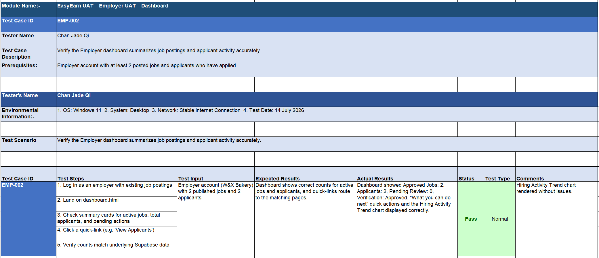

Figure 4.51: Employer – Dashboard

EMP-003: Post Job

Manage Jobs has a total of 2 Published, 0 Pending Review, 1 Expired and 0 Closed. A new Create or Edit a Listing form was reviewed, but no new job was submitted this round. The Create or Edit a Listing form is displayed with the Manage Jobs status summary as shown in Figure 4.52.

Figure 4.52: Employer - Post Job

EMP-004: Manage Jobs

Everything on manage-jobs.html and on the job_listings table was correct for all three jobs, including their status, number of applicants, number of jobs open and their expiry date. Figure 4.53 displays the Manage Jobs page, which shows the status and number of applicants, number of openings, and expiry date for all three jobs.

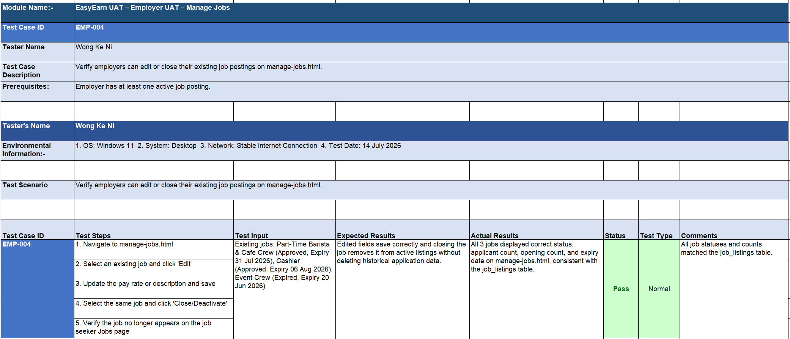

Figure 4.53: Employer - Manage Jobs

EMP-005: View Applicants

The Applied, Reviewed, Accepted and Rejected sections of the Applicants page were all 0. Both Len Pei Ying applications had the correct Job Title, rating 5.0, and 2 reviews, together with the correct application date, 22 June 2026 and both were tagged “Completed” with actions of Message, Paid and Rated. As you can see from Figure 4.54, the status counts appear on the Applicants page, along with the two applications for Len Pei Ying, which have been completed, including rating and action tags.

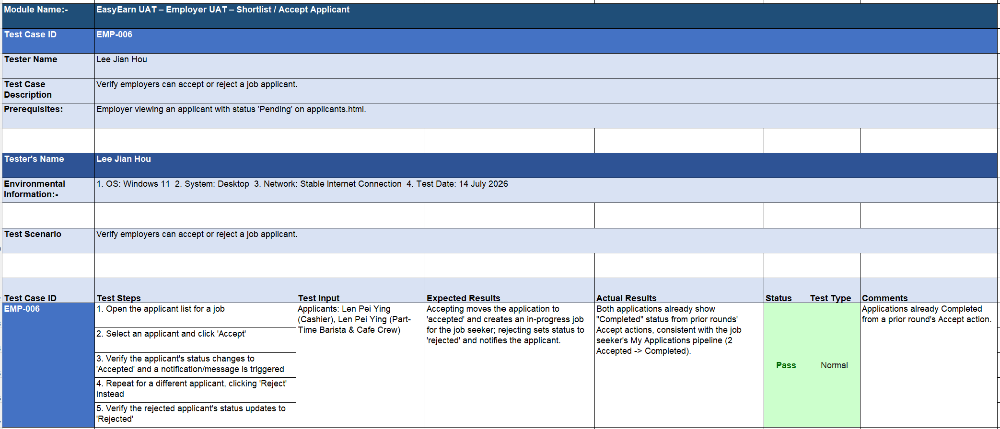

Figure 4.54: Employer - View Applicants

EMP-006: Shortlist/Accept Applicant

Both applications were previously marked as "Completed" in the "My Applications" pipeline (2 Accepted, moved to Completed), matching the job seeker's "My Applications" pipeline. However, both of these applications are in the Completed state as the Accept action was initiated and followed through the applicant pipeline earlier. See Figure 4.55.

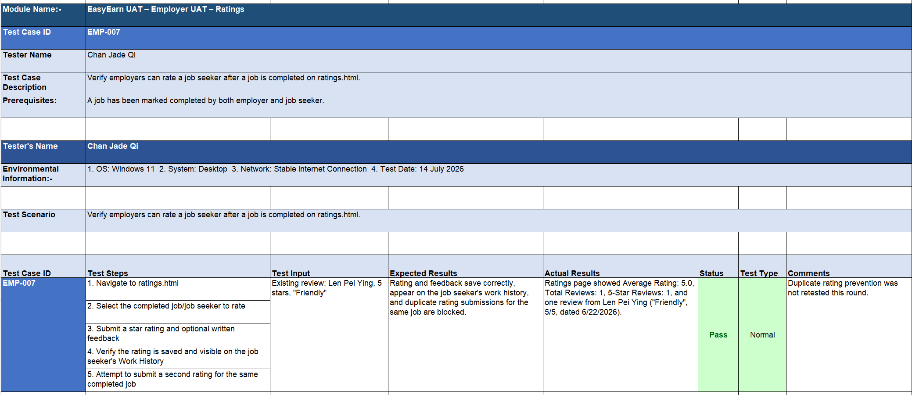

Figure 4.55: Employer - Shortlist/Accept Applicant

EMP-007: Ratings

The Ratings page had a rating of Average, 1 review, 1 5-star rating, and 1 review (5/5) from user Len Pei Ying ("Friendly", dated 22 June 2026). The Ratings page summary and the submitted 5-star rating page review from Len Pei Ying are displayed in Figure 4.56.

Figure 4.56: Employer - Ratings

EMP-008: Messages

There were two conversation threads on the Messages page. The "Pei Ying" thread (marked "New job seeker") contained some pre-existing short messages sent and received between Pei Ying and the user, with an image attachment on 22 June 2026. The Message inbox is displayed in Figure 4.57 with the two conversation threads and the opened exchange dialog with an image attachment in the Pei Ying thread.

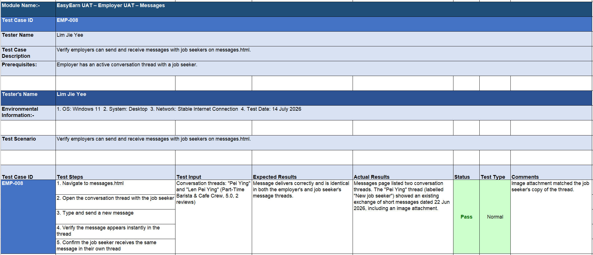

Figure 4.57: Employer – Messages

EMP-009: Profile Management

The Company profile page was able to display the Company information (Name, Email, Phone, Location, Website, Overview) correctly and the Readiness snapshots for Basic Info 100%, Trust Setup 67% and Hiring Ready 80%. Figure 4.58 displays the Company Profile page that contains company details saved and the Readiness snapshot percentages.

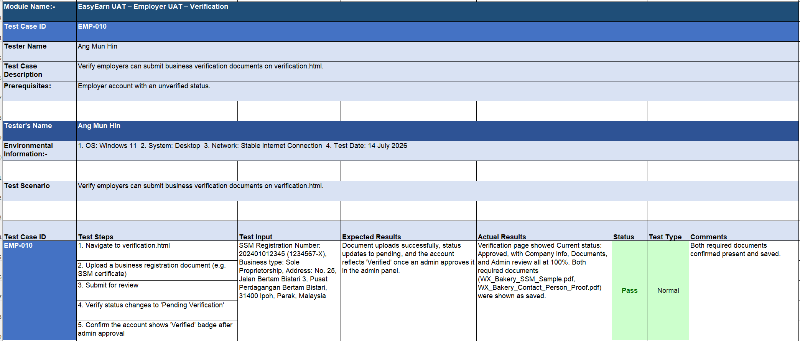

Figure 4.58: Employer - Profile Management

EMP-010: Verification

The Verification page displayed Current Status: Approved and Company Info, Documents and Admin Review had all been marked as 100%, with both required documents marked as Saved. The Verification page appears with the Approved status and with the Company Info, Documents, and Admin Review sections completed as shown in Figure 4.59.

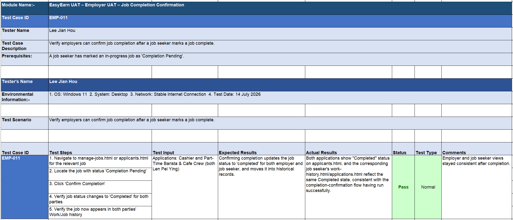

Figure 4.59: Employer - Verification

EMP-011: Job Completion Confirmation

Both applications were marked as "Completed" on applicants.html and the applicants' corresponding work history and applications pages were the same, which indicated a successful completion-confirmation flow. When both jobs are completed, the Applicants page is as shown in Figure 4.60, which is the same as the job seeker's Work History record.

Figure 4.60: Employer - Job Completion Confirmation

EMP-012: Logout and Session

When directly accessing the employer dashboard after logging out, no valid session token was found, and they were redirected to the logon screen. When the employer dashboard was accessed directly after logging out, the login screen was displayed as shown in Figure 4.61.

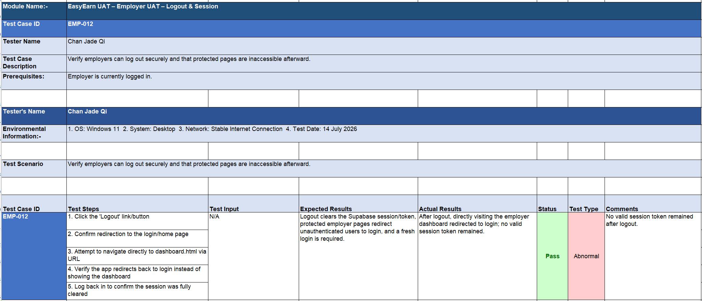

Figure 4.61: Employer - Logout and Session

#### 4.3.2.3 Admin UAT

The total number of test cases created is 12 and tested for the Admin module, such as Login, Dashboard Overview, Lock/Unlock (Employer Account), Lock/Unlock (Job Seeker Account), Approve Job, Flag/Remove Job, Verifications, Reports, Analytics, Messages/Support, Profile Management and Logout/Sesssion. The case testers ran each case only one time and provided real account information stored in Supabase.

ADM-001: Login

Login was successful with a valid username and password, but a subsequent login with an incorrect password was immediately rejected with an error message; no session was created. Figure 4.62 displays the Admin Dashboard, both with a successful login and with an incorrect password.

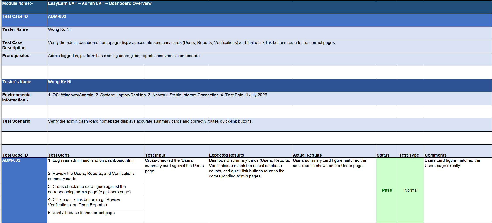

Figure 4.62: Admin - Login

ADM-002: Dashboard Overview

The Users summary card value was in line with the Users page's actual value. The Users count on the Users page matches the figure in the Users summary card in the Admin Dashboard as displayed in Figure 4.63.

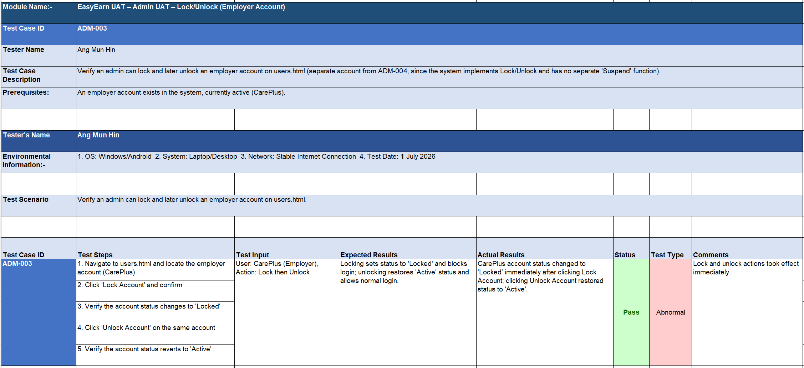

Figure 4.63: Admin - Dashboard Overview

ADM-003: Lock/Unlock (Employer Account)

The Account Status was automatically updated to "Locked" upon clicking Lock Account and to "Active" upon clicking Unlock Account. After the Lock and Unlock actions, the CarePlus account status has changed from Locked to Active, as illustrated in Figure 4.64.

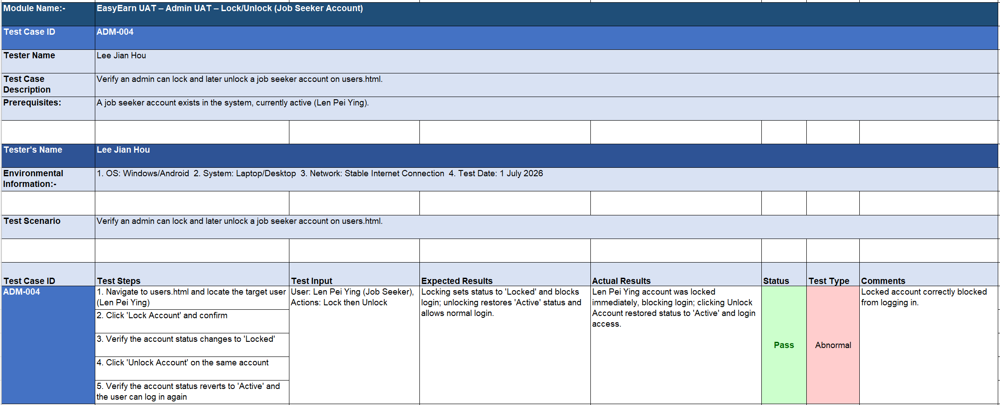

Figure 4.64: Admin - Lock/Unlock (Employer Account)

ADM-004: Lock/Unlock (Job Seeker Account)

The Len Pei Ying account was immediately deactivated and could no longer be logged in, and when clicking Unlock Account, it was immediately turned to Active status, and login was restored. This change in account status from Locked to Active can be seen in Figure 4.65 after locking and unlocking the account.

Figure 4.65: Admin - Lock/Unlock (Job Seeker Account)

ADM-005: Approve Job

The Event Crew job status was set to “Approved” as soon as it was clicked, and the job listing showed up right on the Jobs page. The Event Crew listing status changed from Flagged to Approved, as seen in Figure 4.66, and it is listed on the Jobs page.

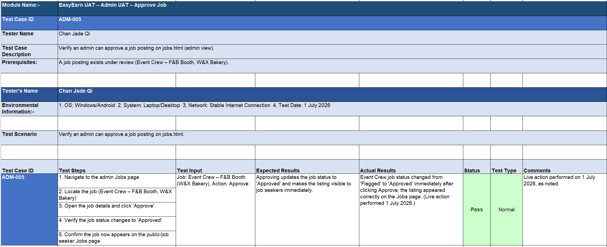

Figure 4.66: Admin - Approve Job

ADM-006: Flag/Remove Job

The job was marked as "Flagged", and when clicked on Remove, the job was removed from the Jobs page and the audit record was retained. The Flagged job listing is deleted from the Jobs page and the audit record is kept as shown in Figure 4.67.

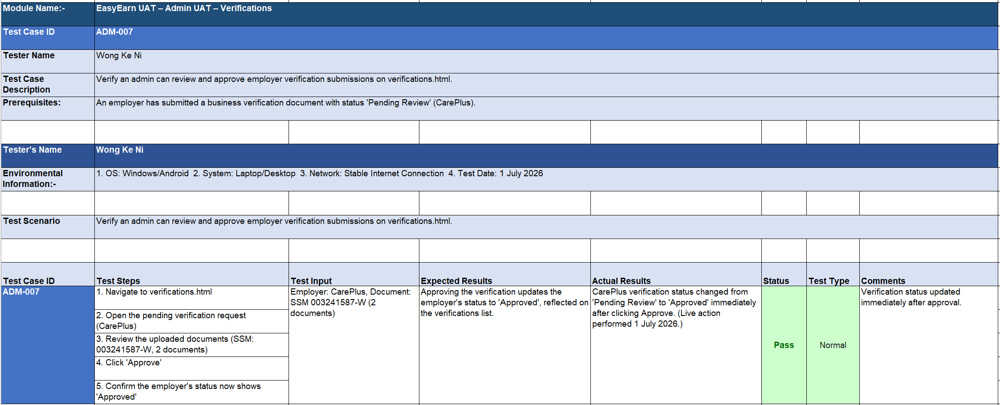

Figure 4.67: Admin - Flag/Remove Job

ADM-007: Verifications

After clicking on Approve, the CarePlus verification status was automatically updated to "Approved". On the Verifications page, the "Approval Status" on the CarePlus verification changes from Pending Review to Approved. The CarePlus verification status updates from Pending Review to Approved in Figure 4.68 on the Verifications page.

Figure 4.68: Admin – Verifications

ADM-008: Reports

The report status was updated to "Resolved" upon clicking Resolve, and the "Message Employer" action was also tested and opened a real conversation thread with W&X Bakery. Figure 4.69 shows the report status changing to Resolved and the Message Employer action opening a conversation thread with W&X Bakery.

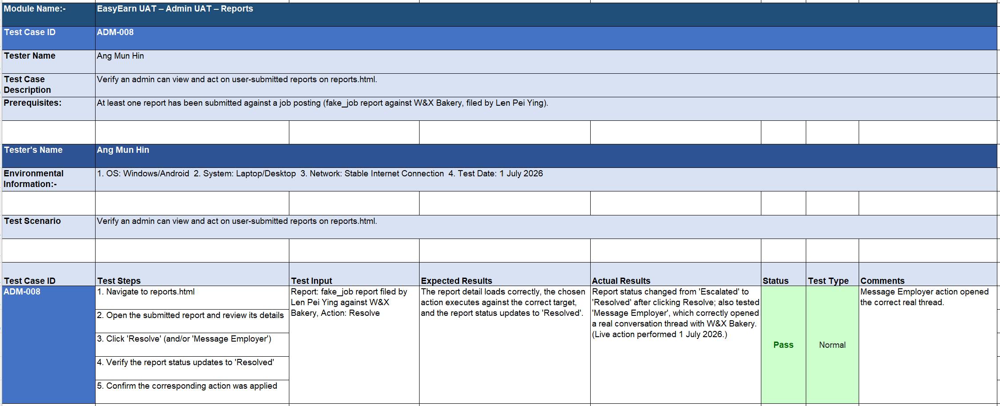

Figure 4.69: Admin - Reports

ADM-009: Analytics

Users trend line worked well from February to July and mirrored Supabase's record movement. On the Analytics page, the Platform Activity line chart is displayed using the Users trend from February to July, as shown in Figure 4.70.

Figure 4.70: Admin - Analytics

ADM-010: Messages/Support

This reply was instant and showed up in the message thread properly. The admin's response is displayed properly in the support message thread, as illustrated in Figure 4.71.

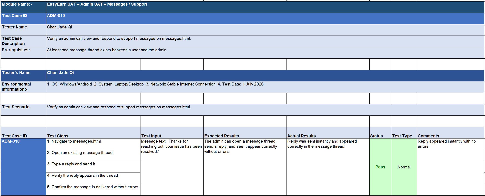

Figure 4.71: Admin - Messages/Support

ADM-011: Profile Management

The changes in the display name and contact email were saved and persisted upon a page refresh as well as re-login. The changed display name and contact email are preserved after refreshing the Admin Profile page, as presented in Figure 4.72.

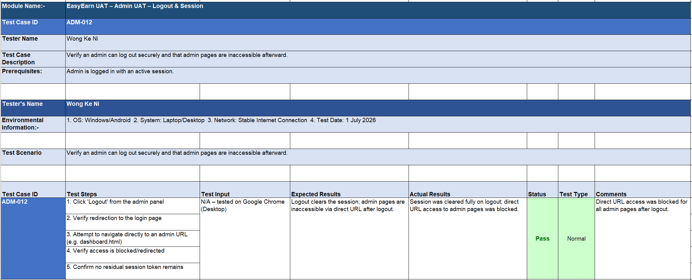

Figure 4.72: Admin - Profile Management

ADM-012: Logout and Session

The session was also terminated without any problems, and direct URL access to admin pages was denied. The default page you will see after you log out is the login screen if you accessed it directly from the URL, as shown in Figure 4.73.

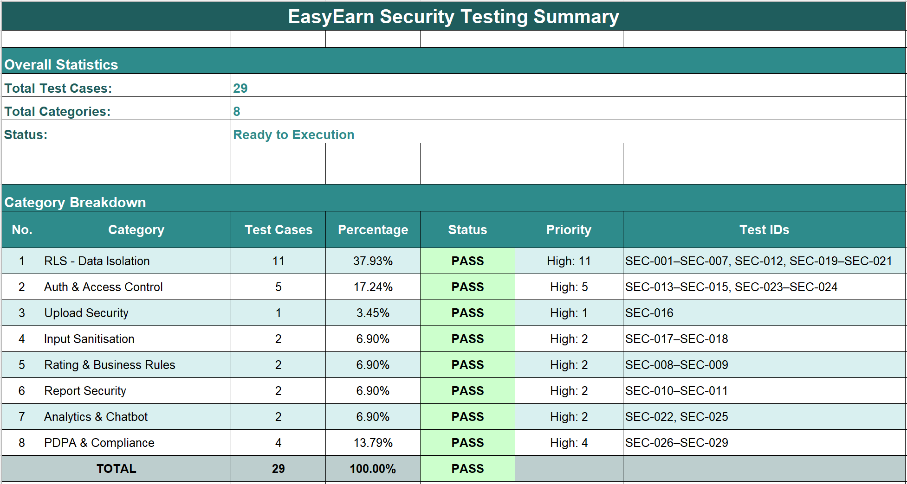

Figure 4.73: Admin - Logout and Session

### 4.3.3 Usability Testing

Usability testing was carried out using the heuristic evaluation method, which was aligned with Nielsen's 10 Heuristics for Usability (Nielsen, 1993). Heuristic evaluation is a type of assessment in which an observer carefully reviews an interface against a set of limited usability heuristics to determine whether any violations have occurred and to rate the severity of those violations, instead of depending on the responses of end-user test participants. The evaluation has been performed by the author on three different passes: Job Seeker, Employer, and Admin. For each evaluation, the deployed application and the source code were referred to substantiate the findings. Each heuristic was judged as conforming or failing to conform and, if it failed, its severity on Nielsen's 0-4 scale (0 = not a usability problem, 4 = usability catastrophe) was rated. The results are shown in Table 4.5.

Table 4.5: Heuristic Evaluation Results

| Heuristic | Application in EasyEarn | Severity | Compliance |
| --- | --- | --- | --- |
| Visibility of System Status | Notification bell updates are made by periodic polling; the application status timeline shows status changes, and the Admin Dashboard shows updated application statistics on the platform. | 2 - Minor | Partially Met |
| Match Between System and the Real World | Job categories, RM currency formatting and role-specific terminology (Job Seeker/Employer/Admin) are aligned with the context of the gig economy in Malaysia. | 0 - None | Met |
| User Control and Freedom | Users can edit and delete job postings, log out anytime, and redo saved-job tasks; a tabbed Login/Register page lets them move back and forth without going anywhere. | 0 - None | Met |
| Consistency and Standards | The same theme is used throughout all pages in each role, using shared partials for header-*.html and footer.html that are themed in green/amber/purple/teal. | 1 - Cosmetic | Partially Met |
| Error Prevention | Multiple job postings are rejected and a helpful message is displayed when they are duplicated, and fields with required information are not accepted. | 0 - None | Met |
| Recognition Rather Than Recall | Role-specific navbar and dashboard summary cards help users not have to memorise the routes between sessions. | 0 - None | Met |
| Flexibility and Efficiency of Use | Novice and frequent users are not overwhelmed by the amount of time they take to use the job search and category/location filters, the dark mode toggle, and the saved-jobs feature. | 0 - None | Met |
| Aesthetic and Minimalist Design | Shared card layout maintains a clean and uncluttered appearance of public-facing and dashboard pages, with only relevant information appearing on each page, depending on the user role. | 0 - None | Met |
| Help Users Recognise, Diagnose, and Recover from Errors | If the password is wrong or there are missing items in input forms, the error messages are displayed directly, clearly and offer suggestions for corrective action. | 0 - None | Met |
| Help and Documentation | An in-context chatbot widget is provided on every page of the dashboard. Only FAQ keywords are covered, not free-form queries. | 2 - Minor | Partially Met |

The evaluation resulted in problems with three out of the ten heuristics: Visibility of System Status (H1), Consistency and Standards (H4) and Help and Documentation (H10). The other seven heuristics were completely met; each had a 0 (not a usability problem) severity rating. Each issue, its location, levels of severity and potential solution are outlined in Table 4.6, while all of the ten heuristics are cross-referenced with their related issues (or noted where they were not found) in Table 4.8.

Table 4.6: Identified Usability Issues and Solutions

| No. | Issue | Heuristic Violated | Location | Severity | Proposed Solution |
| --- | --- | --- | --- | --- | --- |
| 1 | Chatbot only works for keyword-based answer types for FAQ answers and not free-form natural language queries. | H10 - Help and Documentation | Floating chatbot widget (all dashboard pages) | 2 - Minor | Migrate to a Have a light backend that uses an intent-matching or Large Language Model (LLM) service to handle free-form questions (as detailed in Section 5.5). |
| 2 | The colour of the background behind the navbar is different to the background colour of the rest of the page. | H4 - Consistency and Standards | Job Seeker and Admin dashboard navbars | 1 - Cosmetic | Match the background colour token of the navbar to the page-level CSS variable for each role. |
| 3 | This is a bug where the two-column stat-card grid does not show up below the breakpoint of 700px on the Applications page, since a wider media query is more specific, so it is being replaced. | H4 - Consistency and Standards | The page you are at is called your applications page. | 1 - Cosmetic | Make the 700px media query more specific, or set the media queries in the following order: broader breakpoint, narrower breakpoint. |
| 4 | Notification bell uses a 30-second-polling mechanism instead of push notifications, causing an apparent delay when the status changes. | H1 - Visibility of System Status | Notification bell (all roles) | 2 - Minor | Use Supabase Realtime subscriptions instead of polling to send notification updates in real-time. |

Table 4.7 compares current behaviour with the proposed fix (as described in Table 4.6) for the two issues that were ranked most likely to impact a user's moment-to-moment experience.

Table 4.7: Comparison for the Two Higher-Impact Issues

| Issue | Before | After (Proposed) |
| --- | --- | --- |
| Help and Documentation (H10, Issue 1) | The user inputs words into the chatbot and the stored words in the database are known as the &quot;seeds&quot;. If the user inputs words into the chatbot that match any one of the &quot;seeds&quot;, a message will be returned to the user. If the user doesn&#x27;t type any words that match any &quot;seeds&quot;, no message will be returned to the user and the user will have to try again. | Chatbot comes with a lightweight layer of intent matching (or LLM-assisted response generation), which can capture free-form text and paraphrase the seeded answers, not need an exact keyword match. |
| Visibility of System Status (H1, Issue 4) | notifications-bell.js will pull the server every 30 seconds (setInterval(refresh, 30000)); any change in status (Accepted, etc.) will only show up in the notification bell 30 seconds after the change actually occurs. | The notification bell is subscribing to a Supabase Realtime channel, which eliminates the polling delay and status changes are pushed to the client and shown in the bell within about 1 second of when they occur. |

Table 4.8: Heuristics and Issues Found

| Heuristic | Issue(s) Found | Notes |
| --- | --- | --- |
| H1 - Visibility of System Status | Issue 4 | Notification bell status updates do not reflect the real-time status, with a maximum delay of 30 seconds. |
| H2 - Match Between System and the Real World | None identified | The terms and currency are always used in the context of the Malaysian gig economy. |
| H3 - User Control and Freedom | None identified | It is possible for users to edit, delete and reverse all actions as per all three roles. |
| H4 - Consistency and Standards | Issues 2, 3 | Both issues are cosmetic and confined to specific pages/viewports rather than systemic. |
| H5 - Error Prevention | None identified | Duplicate submission and required-field validation were confirmed to be working. |
| H6 - Recognition Rather Than Recall | None identified | Persistent navigation and dashboard summaries require less memory. |
| H7 - Flexibility and Efficiency of Use | None identified | The novice and frequent users are able to use filters, dark mode and saved jobs without issues. |
| H8 - Aesthetic and Minimalist Design | None identified | Shared card layout helps to maintain a clear page layout throughout all roles. |
| H9 - Help Users Recognise, Diagnose, and Recover from Errors | None identified | In all cases tested, there were clear and actionable inline error messages. |
| H10 - Help and Documentation | Issue 1 | The coverage of the chatbot is limited to keywords from the answers in the FAQ; see Section 5.3 and 5.5. |

#### 4.3.3.1 Justification for Non-Violations

However, for seven heuristics where no issues were found, the following reasons justify a full grade of “Met”, and only a shallow pass is considered a lack of a finding. Match Between System and the Real World (H2) was judged fulfilled as all the user interface labels, currency values, and status terms were verified against the conventions used in the Malaysian gig economy, such as RM formatting, role names, and job statuses for the three interfaces, with no generic or mistranslated terminology identified. The user is tested for User Control and Freedom by attempting to change the state of each of the available user actions, such as editing, deleting, logging out and unsaving a bookmarked job, and the user does not become trapped in an undesired state of the interface.

Filters, dark mode, and the saved-jobs list reduced the number of steps for a returning user to perform the same task, such as finding a saved job, but did not increase the number of steps for a new user, so none of these affected Flexibility and Efficiency of Use (H7). For Aesthetic and Minimalist Design (H8), each dashboard page was reviewed for information that was not pertinent to the task in hand. The shared card design was determined to only show information relevant to the role, and no other irrelevant information was found. The other four heuristics were less likely to be tricked into a seemingly legitimate way of doing things, for this reason they are highlighted here; the remaining three heuristics (Error Prevention, Recognition Rather Than Recall, and Help Users Recognise, Diagnose, and Recover from Errors) were considered more directly: the error was elicited, and the system's response was verified to be correct; these are addressed in Table 4.8.

Of the four issues found, two are minor, two are cosmetic in nature, and none are severe enough to impede task completion. The Help and Documentation issue (H10, severity 2) is a result of the fact that the chatbot is limited to using a set of FAQs for answers, and not free-form natural language queries, which is a known limitation of the rule-based implementation, and is detailed further as a limitation in Section 5.3, with a suggestion for an upgrade path in Section 5.5. The Notification bell issue (H1, severity 2) is caused by the 30-second polling interval in the notifications-bell.js file, and not by real-time push updates, such that status changes take up to 30 seconds before showing. It is proposed to migrate to Supabase Realtime subscriptions. The two Consistency and Standards issues are cosmetic only: navbar background colour on the Job Seeker and Admin dashboards are not aligned; and a CSS specificity conflict makes the Applications page's stat-card grid render incorrectly below the 700px breakpoint.

The results of the heuristic evaluation confirm the results from the UAT (Section 4.3.2) in general. The UATs confirmed that the primary workflows of Job Seeker, Employer and Admin could be completed successfully and the heuristic evaluations determined that there were a few minor interface issues that did not hinder the completion of the task. The notification delay and the responsive layout issues in particular were deemed to be issues that can be improved upon and not critical functional defects. The two types of testing thus yielded complementary results: UAT indicated that tasks required to be accomplished were completed successfully; heuristic evaluation pointed out usability issues that could be improved.

A restriction of this evaluation is that it was conducted by a single evaluator who was also the system developer. So the above four issues are indicative and not exhaustive. Multiple evaluators can help in heuristic evaluation since different evaluators might point out different kinds of usability problems (Nielsen, 1993). The results of this evaluation should thus be viewed in conjunction with the UAT results in section 4.3.2, in which 36 functional test cases were run by five testers for the Job Seeker, Employer and Admin roles.

### 4.3.4 Security Testing

There were 8 categories of Security Testing, namely: RLS & data isolation, authentication & access control, input sanitisation, upload security, rating & business rules, report security, analytics & chatbot security, PDPA-related controls. 29 test cases (from SEC-001 to SEC-029) were performed. For all test cases, the results were as expected for the scenarios that were defined, but there were some residual security and privacy limitations that are discussed in Section 5.3. The eight categories are summarised in Figure 4.74 and the test cases are given in Figures 4.75 to 4.103.

Figure 4.74: EasyEarn Security Testing Summary

#### 4.3.4.1 RLS - Data Isolation

This category assesses whether the actual Supabase RLS policies limit access to data based on user roles and record ownership. The test cases are designed to check if users can access or update records they have permission to access and if they can't access records they aren't allowed to access.

SEC-001: Seeker cannot read another seeker's applications

The policy application_select_own only allowed SELECT when the auth.uid() = seeker_id, which meant that PostgREST returned no rows to Seeker B for the applications, just what Seeker A had returned. When Seeker B tries to read Seeker A's applications, it returns no rows, as shown in Figure 4.75.

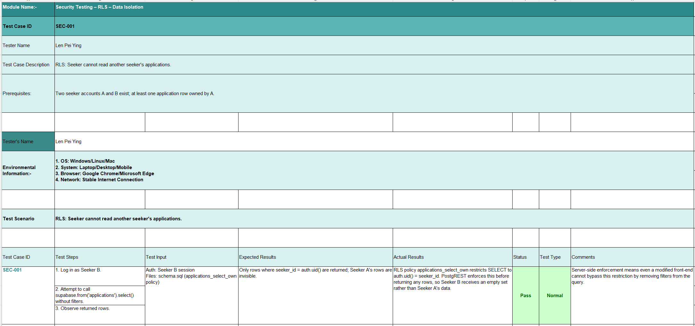

Figure 4.75: RLS - Data Isolation (Seeker Application Read Isolation)

SEC-002: Seeker cannot update another seeker's application status

Both the USING and WITH CHECK clauses of the UPDATE statement are subject to the policy of applications_update_seeker, which prevented the cross-seeker UPDATE operation from being performed at the database level. When Seeker B targeted Seeker A's application, it tried to UPDATE to an existing application that was already deleted, as shown in Figure 4.76; it failed with 0 rows affected.

Figure 4.76: RLS - Data Isolation (Seeker Application Update Isolation)

SEC-003: Seeker cannot read another user's notifications

Other users' notification rows were not returned to the client because the notifications_select_own policy filtered the SELECT statement so that only rows for the current user were returned. When you view the notifications query, only the rows that are for the authenticated user will be returned, as displayed in Figure 4.77.

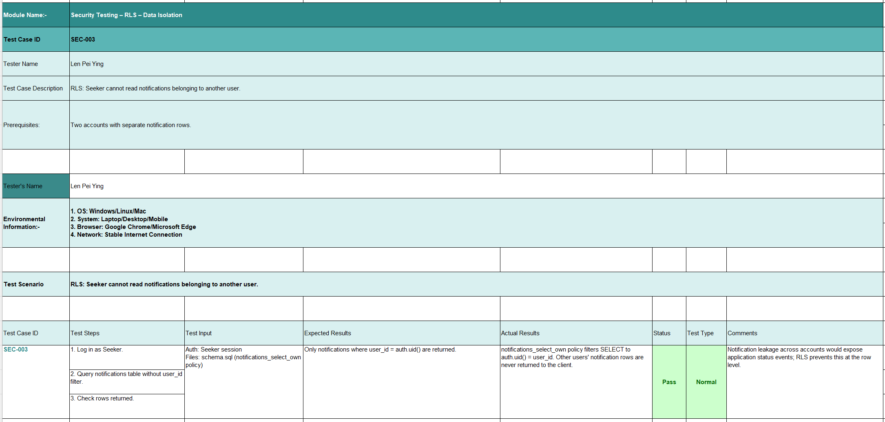

Figure 4.77: RLS - Data Isolation (Notification Read Isolation)

SEC-004: Employer cannot update another employer's job listing

The users_public_read policy grants all authenticated users the SELECT privilege on all user rows, including the SSM document fields. However, users_update_own also restricts UPDATE to the employer who created the row, which is why Employer 2 was unable to update Employer 1's verification data. Document fields have no support for column-level read security, which is mentioned as a limitation in Chapter 5.3. Employer 2's update attempt was blocked on Employer 1's verification fields, as shown in Figure 4.78.

Figure 4.78: RLS - Data Isolation (Job Listing Update Isolation)

SEC-005: Employer cannot modify another employer's verification documents

The users_public_read policy allows all authenticated users to SELECT any user row, including the SSM document fields, though users_update_own still restricts UPDATE to the owning employer, so Employer 2 could not modify Employer 1's verification data. Column-level read security on the document fields is not implemented; this is noted as a limitation in Chapter 5.3. Figure 4.79 shows Employer 2's blocked update attempt on Employer 1's verification fields.

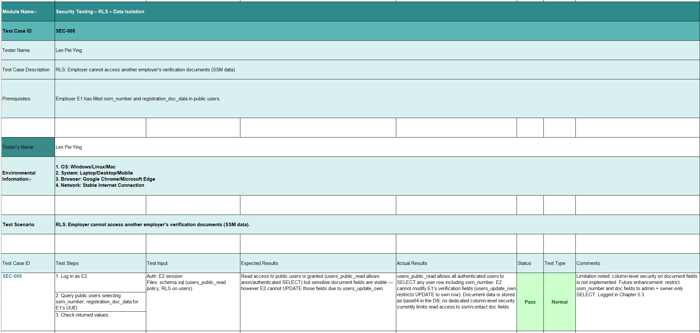

Figure 4.79: RLS - Data Isolation (Verification Document Access)

SEC-006: Seeker cannot insert a payment record on the employer's behalf

The payments_insert_seeker policy is set up to only allow seeker inserts when the application matches and payee_id is null or self, meaning that a seeker shouldn't be able to do a payment insert from the UI. The payment insert is limited as to what action the seeker can confirm in Figure 4.80.

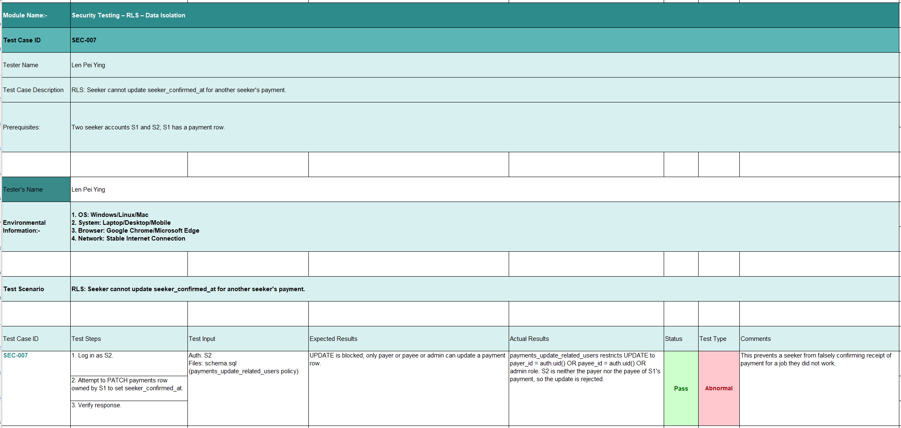

Figure 4.80: RLS - Data Isolation (Payment Insert Restriction)

SEC-007: Seeker cannot update another seeker's payment confirmation

All users were denied the ability to update others' payment information due to the payments_update_related_users policy that was set to only allow the admin, payer or payee role to do so. When Seeker 2 verified Seeker 1's payment, it got the payment rejected, as illustrated in Figure 4.81.

Figure 4.81: RLS - Data Isolation (Payment Confirmation Isolation)

SEC-012: Seeker cannot delete another seeker's saved job

The saved_jobs_delete_own policy only allowed DELETE when the user ID was equal to auth.uid(), so even though Seeker 2 knew the UUID of Seeker 1's saved job, it was not deleted. In Figure 4.82, Seeker 1's saved job has not been altered by the blocked delete request of Seeker 2.

Figure 4.82: RLS - Data Isolation (Saved Job Delete Isolation)

SEC-019: Non-admin cannot update another user's profile row

The users_update_own and users_admin_update policies ensure that only the row owner or someone who is an admin can UPDATE the row; a seeker cannot modify another user's profile information. The rejected update is displayed in Figure 4.83 in another user's profile row.

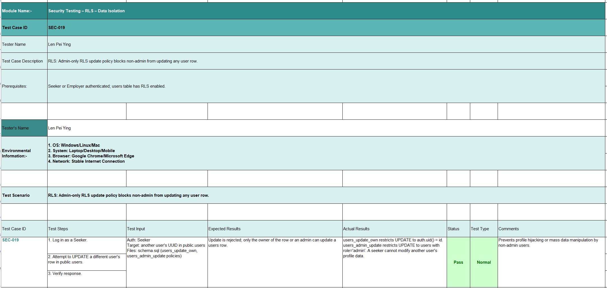

Figure 4.83: RLS - Data Isolation (User Profile Update Isolation)

SEC-020: Seeker cannot change an application's status field directly

For the applications_update_employer policy on job employer_id, the application-facing status transitions are prevented, but there is no field-level constraint preventing the direct API call by the seeker, so the risk remains as described in Chapter 5.3.1. Figure 4.84 displays the application status field unchanged if it is accessed via the update path that is scoped to the employer.

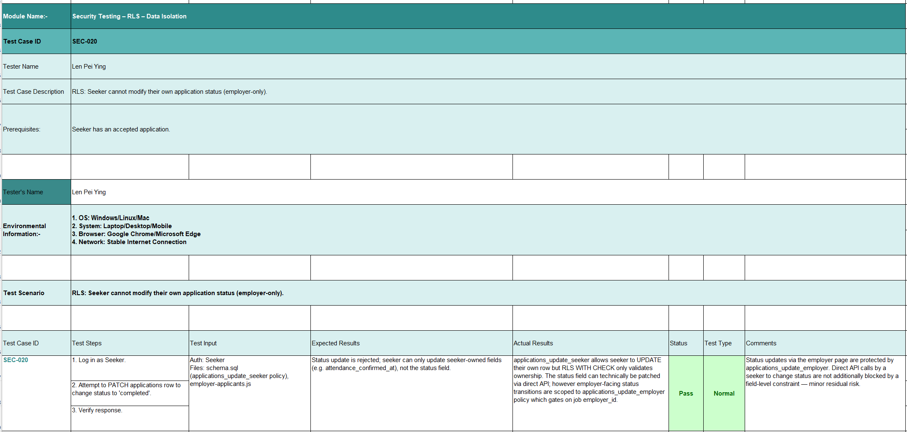

Figure 4.84: RLS - Data Isolation (Application Status Field Restriction)

SEC-021: Employer cannot read another seeker's work history

The work_history_select_own policy only allowed Seeker 1 to see his own work history, preventing Seeker 2 from seeing what Seeker 1 had created. For a non-owning seeker, the work history query returns no rows, as shown in Figure 4.85.

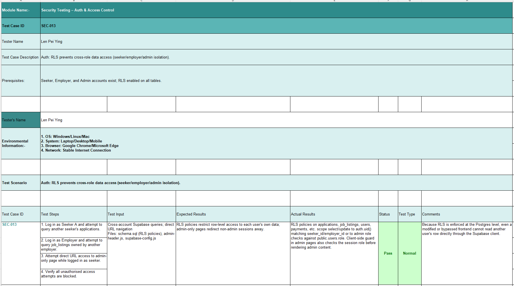

Figure 4.85: RLS - Data Isolation - Work History Read Isolation

#### 4.3.4.2 Auth & Access Control

In this category, it is checked whether the authentication flow, the handling of the session and role-based access control properly limit access to the pages, login and registration according to the assigned role of the user.

SEC-013: RLS prevents cross-role data access

The scoped SELECT/UPDATE for rls_apply, rls_job_listing and rls_user were implemented for matching seeker_id, employer_id and admin, respectively, while the admin pages redirected non-admin sessions client-side as well. The diagram in Figure 4.86 demonstrates that a non-admin session is being redirected from an admin-only page.

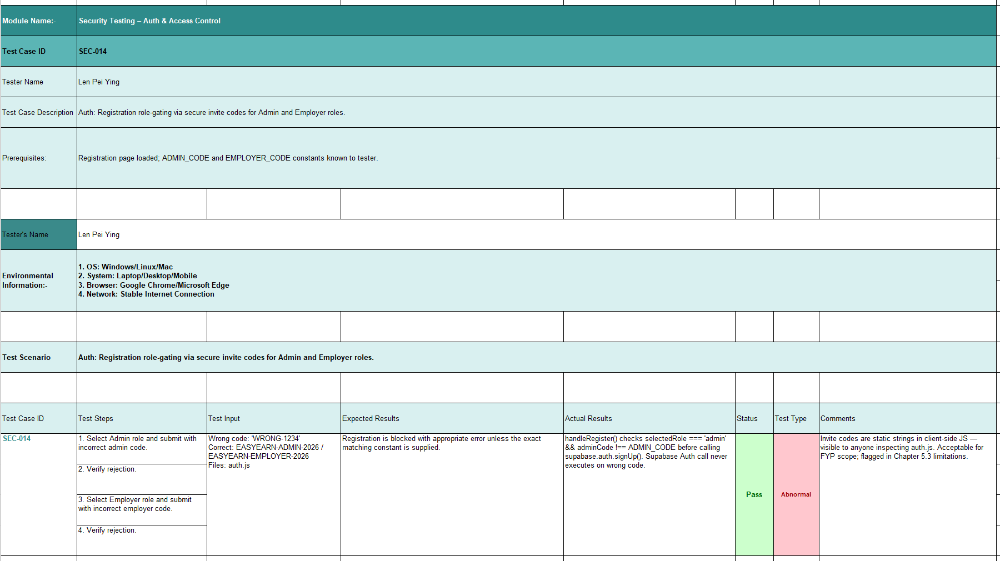

Figure 4.86: Auth & Access Control - Cross-role Data Access

SEC-014: Registration role-gating via invite codes

The function, handleRegister(), checked the provided admin/employer invite code against the constant first before invoking supabase.auth.SignUp(), the registration was denied with the first incorrect code. If the invite code is invalid, the registration form displays an error message before allowing a user to create an account, as seen in Figure 4.87.

Figure 4.87: Auth & Access Control - Registration Role-gating

SEC-015: Password policy enforcement and credential handling

The password length and character requirements are checked on the client side with handleRegister(), and the raw Supabase error messages are converted into a generic "Invalid email or password" message to prevent account enumeration with mapSupabaseAuthError(). Both an incorrect email and password will result in an invalid-credentials message, as is shown in Figure 4.88.

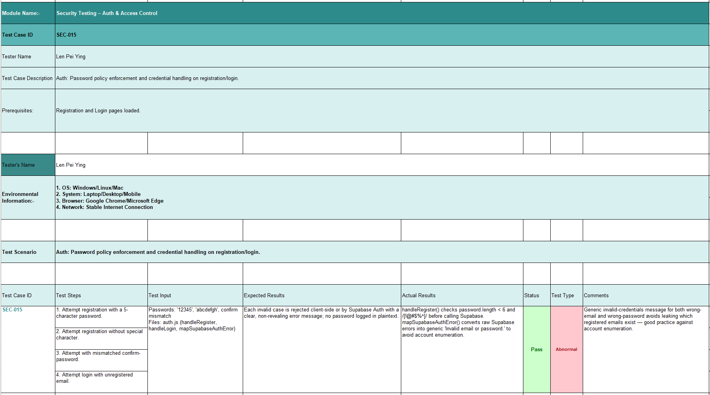

Figure 4.88: Auth & Access Control - Password Policy Enforcement

SEC-023: Session expiry and requireUser() redirect behaviour

Supabase.auth. requirementUser() redirected to the login page.getUser() did not produce any valid session, and observeAuth() received SIGNED_OUT events while the user was surfing the web. The login page is displayed if an expired session was detected, as shown in Figure 4.89.

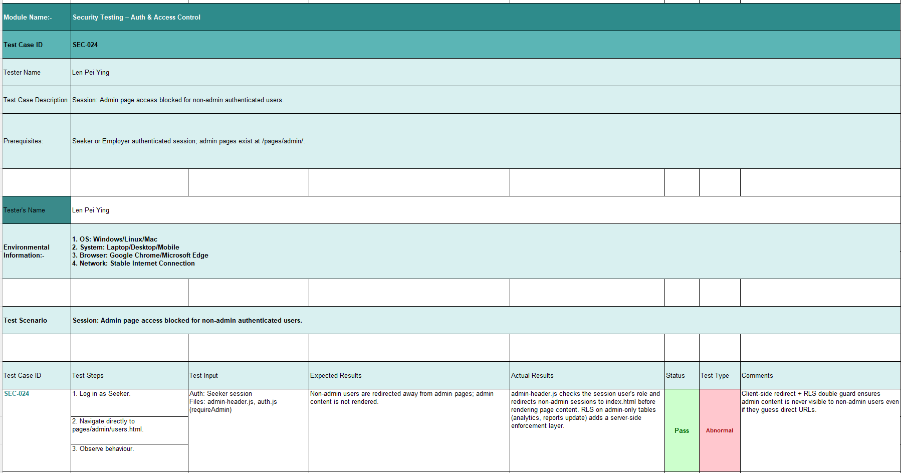

Figure 4.89: Auth & Access Control - Session Expiry Handling

SEC-024: Admin page access blocked for non-admin users

When rendering admin content, admin-header.js was verifying the user's role by redirecting non-admin sessions to index.html and there was also an RLS server-side layer added to admin-only tables. Figure 4.90 displays a non-admin session being redirected away from an admin page that was accessed directly in the URL.

Figure 4.90: Auth & Access Control - Admin Page Access Restriction

#### 4.3.4.3 Upload Security

This category is for the size and type of files used to validate a profile picture and/or employer verification document. The tests will check whether invalid or too-large files are rejected by the current client-side controls and if there are any other upload security flaws to be identified.

SEC-016: Profile photo and verification document upload restrictions

There was a 2MB limit on upload size for each of the following: jobseeker-profile.js, employer-profile.js, and employer-verification.js, but there is no complete Multipurpose Internet Mail Extensions (MIME) type checking/sniffing, so a renamed file may pass the extension check; this is noted as a residual risk as discussed in Chapter 5.3.1. In Figure 4.91, the image of a person with a large profile picture is not accepted for upload.

Figure 4.91: Upload Security - File Type and Size Restrictions

#### 4.3.4.4 Input Sanitisation

This category is used to assess how the user-supplied input and database requests are handled, and if the controls implemented lower the risk of cross-site scripting (XSS) and SQL injection attacks. The tests involve checking the handling of script payloads in selected input fields, and checking if the database requests are sent using parameterised PostgREST operations instead of plain SQL.

SEC-017: Input sanitisation against XSS

The title, category, skills, company and messages in chat were dynamic fields before being added to the innerHTML and the content of the job description was added using textContent, so no script was executed in that case. The script payloads are not being executed, as seen in Figure 4.92.

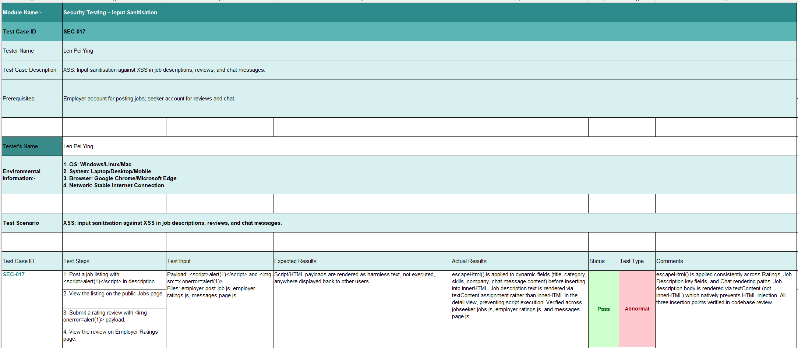

Figure 4.92: Input Sanitisation - XSS Prevention

SEC-018: SQL injection resistance

All database access was made via Supabase JS client's parameterised PostgREST requests, and not directly via SQL. Therefore, all injection payloads were handled as plain text values. An SQL injection payload is submitted in a form field, which is treated as a literal string value, as shown in Figure 4.93.

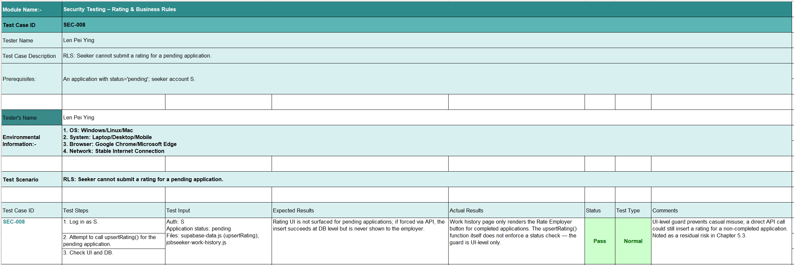

Figure 4.93: Input Sanitisation - SQL Injection Resistance

#### 4.3.4.5 Rating & Business Rules

This category assesses the rating and review business rules that are applied to EasyEarn, such as who can rate and not rate a review, and who can be a reviewer and reviewee. The tests will evaluate current application-level controls and determine if there are any remaining application-level enforcement restrictions at the database level.

SEC-008: Seeker cannot submit a rating for a pending application

The Rate Employer button is only shown for completed applications on the Work History page, but the upsertRating() function doesn't actually check the application status at the database level; this is considered a residual risk in Chapter 5.3.1. As seen in Figure 4.94, the button Rate Employer will only appear if the application is completed.

Figure 4.94: Rating & Business Rules - Rating Eligibility Guard

SEC-009: Reviewer and reviewee cannot be the same user

At this time, there is no CHECK constraint on the reviewer_id field of the Reviewers table that would forbid this, but the application flow always makes sure that both fields are different, and there is no UI path for a reviewer to rate himself, so this is a residual risk identified in Chapter 5.3.1. Always viewed as a reviewer and a reviewee is the rating flow in Figure 4.95.

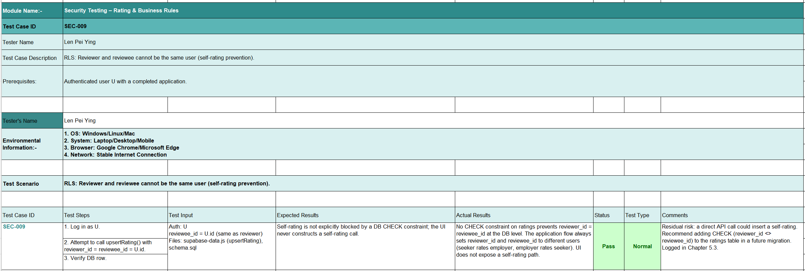

Figure 4.95: Rating & Business Rules - Self-rating Prevention

#### 4.3.4.6 Report Security

In this category, report submission and retrieval are limited to users that are both authenticated and authorised, which means that reports cannot be submitted anonymously and unauthorised users cannot receive reports of another user.

SEC-010: Unauthenticated user cannot submit a report

The policy "reports_insert_own" did not allow anonymous users to make an INSERT, and the front-end report page also verified the session before displaying the report form to prevent the anonymous user from submitting a report. A report form that is not accessible to an unauthenticated session is displayed in Figure 4.96.

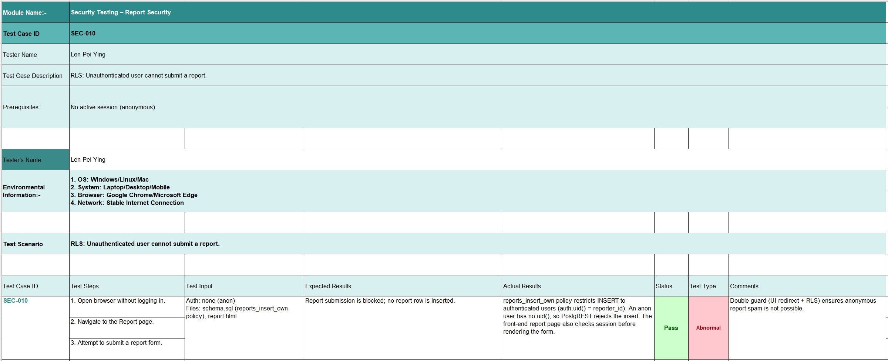

Figure 4.96: Report Security - Unauthenticated Submission Block

SEC-011: Seeker cannot read another user's submitted reports

The reports_select_own policy limited user access to SELECT, including a separate admin policy for admin access, so that non-admin users could view no other users' reports. In Figure 4.97, only the user's own reports will be returned by the reports query.

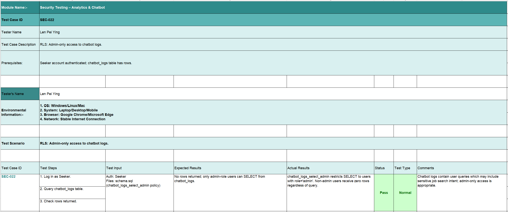

Figure 4.97: Report Security - Report Read Isolation

#### 4.3.4.7 Analytics & Chatbot

This category measures and assesses access to analytics records and chatbot logs based on user roles. The tests determine if non-admin users can access admin-only analytics data and chatbot log data via the access-control policies in place.

SEC-022: Admin-only access to chatbot logs

The policy, chatbot_logs_select_admin, limited SELECT access to admin-role users, thus returning no rows to users who did not have admin-role. There are no rows returned from a non-admin query against the chatbot_logs table, as illustrated in Figure 4.98.

Figure 4.98: Analytics & Chatbot - Chatbot Log Access Restriction

SEC-025: Admin analytics data is not accessible to non-admin users

The analytics_admin_select policy was applied to the SELECT statement so that only admin-role users could see the statement. Therefore, if non-admin users queried platform statistics, they would get back no rows. In Figure 4.99, a non-admin session is not receiving any analytics data.

Figure 4.99: Analytics & Chatbot - Analytics Access Restriction

#### 4.3.4.8 PDPA & Compliance

This category assesses some of the data-handling and access-control practices of EasyEarn with respect to the PDPA 2010, such as minimising data, limiting access, and providing visibility rules. The tests are designed to check if the measures taken are adequate for the handling of personal data and to determine if there are any security or privacy issues that remain.

SEC-026: Personal data fields are not exposed in public job listing queries

In keeping with PDPA data minimisation, the public job listing query does not join to the users table for anonymous viewers, which means that any data that was available to the employers was not co-returned with the job listing. As seen in Figure 4.100, the public job listing query only returns the job-specific fields, but no information about the employer.

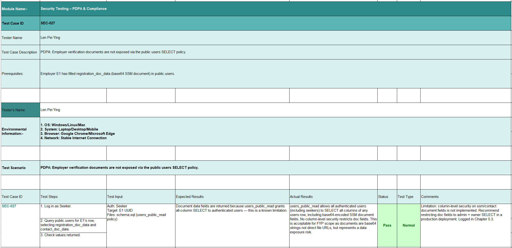

Figure 4.100: PDPA & Compliance - Job Listing Data Minimisation

SEC-027: Employer verification documents are not exposed via the public users SELECT policy

The users_public_read policy now allows all-column SELECT for all users with authentication, which is a known limitation we logged back in Chapter 5.3.1 for only allowing access to document fields within a production deployment for admin and owner users. The users table query will return document fields to an authenticated non-owner session, as shown in Figure 4.101.

Figure 4.101: PDPA & Compliance - Verification Document Exposure

SEC-028: Employer verification status update is restricted to admin role

users_update_own was only allowed to update the row's owner, and only users_admin_update was able to change the verification_status, meaning a seeker was unable to change the verification status of an employer. If an update attempt is not performed by an administrator, the Verification status field will not change in Figure 4.102.

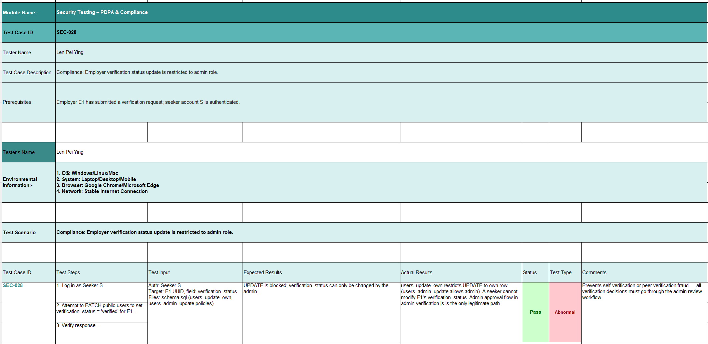

Figure 4.102: PDPA & Compliance - Verification Status Update Restriction

SEC-029: Closed job listings are removed from public job search

The public job query excluded closed listings with the filter .eq('status', 'open') and updateJobListingStatus() was applied by the RLS policy, which is only accessible to admins and sets 'status' to 'closed'. When a listing is closed, it no longer appears in the public job search results as indicated in Figure 4.103.

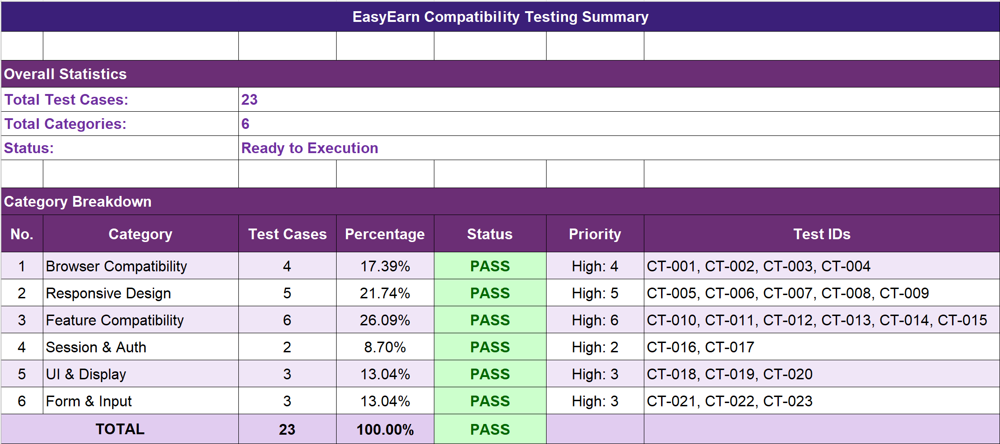

Figure 4.103: PDPA & Compliance - Closed Listing Removal

### 4.3.5 Compatibility Testing

The following are the 6 categories of compatibility testing, conducted to ensure that EasyEarn is consistent across browsers, devices, operating systems and interaction methods: Browser Compatibility, Responsive Design, Feature Compatibility, Session & Auth, UI & Display, Form & Input. Results of all 23 test cases (CT-001 to CT-023) resulted in a pass. The six categories are summarised in Figure 4.104, and the individual test cases are presented in Figures 4.105 to 4.127.

Figure 4.104: EasyEarn Compatibility Testing Summary

#### 4.3.5.1 Browser Compatibility

This category will assess the consistency of the basic functionality of EasyEarn that is dependent on CSS, JavaScript and the browser, across the browsers tested: Google Chrome, Mozilla Firefox and Microsoft Edge. Safari did not undergo actual testing since it was not available on the testing devices. Its expected compatibility is based on the use of normal Web technologies, and not on direct compatibility checking.

CT-001: CSS layout rendering

CSS Grid and Flexbox properties worked the same in all the browsers that were tested (Chrome, Firefox and Edge), and the Lucide icon SVGs and colours were consistent based on the role. The home page layout looks the same across the browsers used for the tests, with no broken grid or flex elements visible, as in Figure 4.105.

Figure 4.105: Browser Compatibility - CSS Layout Rendering

CT-002: JavaScript feature support

No console errors were seen for fetch() or ES module imports in the browsers tested, as they were accessed without error while trying to retrieve job listings from Supabase. Figure 4.106 shows that the browser console has no errors, and that both fetch and ES modules are supported by the browsers tested. Safari support is considered based on standards compliance, but was not directly tested on the available devices.

Figure 4.106: Browser Compatibility - JavaScript Feature Support

CT-003: PDF resume generation

jsPDF and html2canvas ran properly in all the browsers tested, and the resume PDF was created, including using the proper fonts, layout and the correct work history data. The produced resume PDF has been uniformly formatted in the browsers tested, as illustrated in Figure 4.107.

Figure 4.107: Browser Compatibility - PDF Resume Generation

CT-004: Chart.js analytics rendering

Using the Canvas API, line charts and doughnut charts are displayed correctly, and analytics data is shown the same way in all the browsers tested. The Analytics Dashboard charts were presented consistently in all the browsers tested and are shown in Figure 4.108.

Figure 4.108: Browser Compatibility - Chart.js Analytics Rendering

#### 4.3.5.2 Responsive Design

This category ensures layout, navigation and interaction components adjust appropriately between desktop, tablet and mobile breakpoints without loss of functionality or readability.

CT-005: Layout breakpoints

The job grid seamlessly transitioned between multi-column and single-column layouts at desktop, tablet and mobile breakpoints and the navigation was successfully adapted to a collapsible hamburger menu, with no horizontal scrolling detected. The Jobs page layout adapts to the desktop, tablet and mobile breakpoints as illustrated in Figure 4.109.

Figure 4.109: Responsive Design - Layout Breakpoints

CT-006: Mobile touch interactions

The hamburger menu, job card navigation and filter dropdowns also responded correctly to the tap input, which was handled correctly through standard click listeners. As shown in Figure 4.110, the hamburger menu and the filter dropdown will move with a touch.

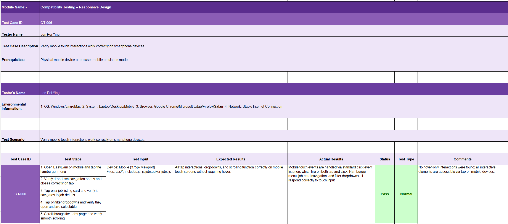

Figure 4.110: Responsive Design - Mobile Touch Interactions

CT-007: Mobile content display

These Saved Jobs and Work History pages were designed using card layouts that will stack vertically on a mobile device, but all content will be visible in a 375px viewport. The Saved Jobs and Work History pages appear as in Figure 4.111 in the 375px mobile viewport.

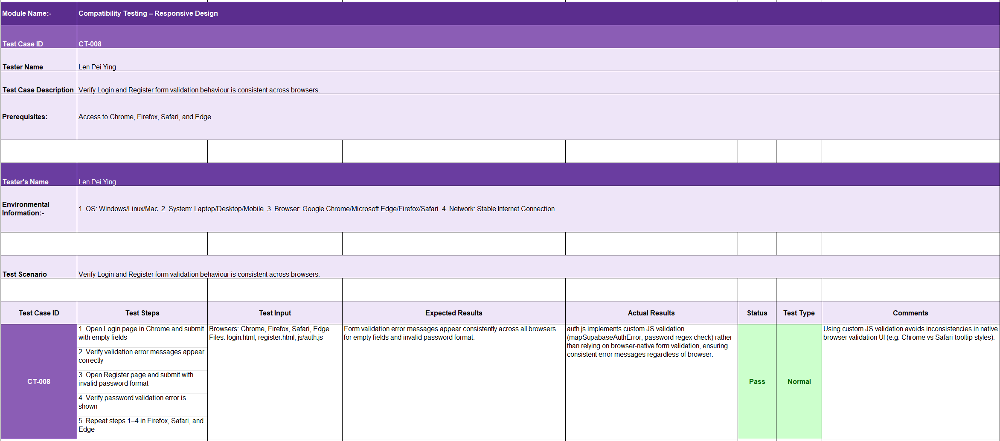

Figure 4.111: Responsive Design - Mobile Content Display

CT-008: Form validation consistency

Empty fields and invalid passwords consistently generated error messages, regardless of browser-native validation styling, for custom JS validation (mapSupabaseAuthError, password regex check). This is the Login page in Figure 4.112 with the same validation error messages in all tested browsers.

Figure 4.112: Responsive Design - Form Validation Consistency

CT-009: Mobile filter functionality

Category and Location filter chips responded to mobile touch input, jobseeker-jobs.js re-rendering the job list over the top. The filters are tapped while the Jobs list is updated on the mobile viewport, as shown in Figure 4.113.

Figure 4.113: Responsive Design - Mobile Filter Functionality

#### 4.3.5.3 Feature Compatibility

In this category, you can ensure that platform-specific features, like translation, dark mode, the chatbot widget and uploading files, work fine and in the same way on supported browsers.

CT-010: Google Translate integration

The Google Translate integration was tested by choosing an available language and checking to see if the current EasyEarn page was directed to the Google Translate translation service via their website. The content of the main page was still accessible after being translated, as were the navigation and interface elements. The EasyEarn website with Google Translate integration is presented in Figure 4.114.

Figure 4.114: Feature Compatibility - Google Translate Integration

CT-011: Dark mode across role dashboards

The preference was saved in localStorage and recalled after reloading the page, as theme.js switched the accent colour for each role to a dark-mode-friendly variant using a root-level data-theme attribute that CSS variables are keyed off of. Dark mode is applied throughout the Job Seeker, Employer and Admin dashboards, as shown in Figure 4.115.

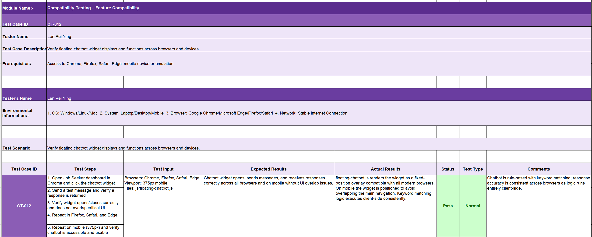

Figure 4.115: Feature Compatibility - Dark Mode Across Role Dashboards

CT-012: Floating chatbot widget

Fixed-position chatbot widget that supports all modern browsers, placed on mobile to not obstruct main navigation, and keyword matching performed consistently client-side. The chatbot widget is depicted in Figure 4.116 both on the desktop and the mobile, while still not interfering with the navigation.

Figure 4.116: Feature Compatibility - Floating Chatbot Widget

CT-013: File upload for verification

The file input was opened natively in all tested browsers, and client-side file type and size validation was done before the file was converted to Base64 and stored in the users table in employer-verification.js. Figure 4.117 displays the Verification page file picker and successfully uploaded document.

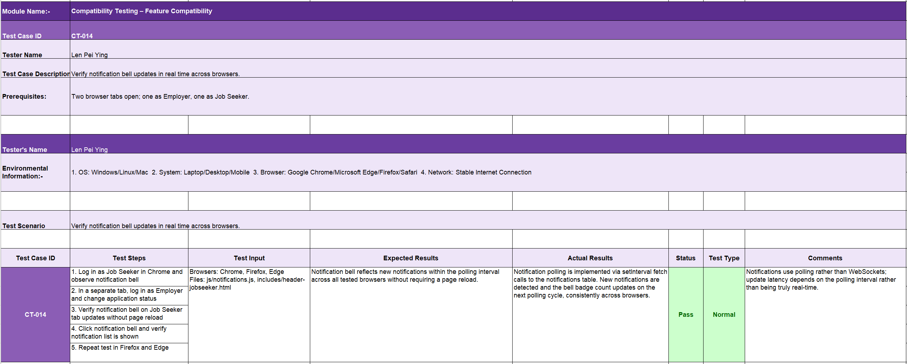

Figure 4.117: Feature Compatibility - File Upload for Verification

CT-014: Notification bell updates

On the subsequent polling cycle, notification polling, using setInterval fetch calls, was used to identify new notifications and refresh the bell indicators with an updated count of notifications, ensuring a constant presentation of notifications across browsers. When the notification bell is added to the badge, it should be updated as shown in Figure 4.118 when a new notification is generated.

Figure 4.118: Feature Compatibility - Notification Bell Updates

CT-015: Admin analytics data consistency

The analytics data was computed from the current records from Supabase tables: Users, Jobs, Reports and verification records, presented with Chart.js. Historical snapshots may also be stored in the analytics table on a daily basis. Figure 4.119 shows that the values in the Analytics Dashboard were the same for each of the browsers tested.

Figure 4.119: Feature Compatibility - Admin Analytics Data Consistency

#### 4.3.5.4 Session & Auth

This category confirms that authentication sessions behave in the same manner in different tabs of a browser, such as persistent sessions and synchronised logout.

CT-016: Cross-tab session persistence

The Supabase auth session stored in localStorage was used across tabs in the same browser, and observeAuth() would identify that this session had previously been used and wouldn't prompt for re-authentication. If the dashboard is opened in a second browser tab, it loads without asking the user to re-login, as illustrated in Figure 4.120.

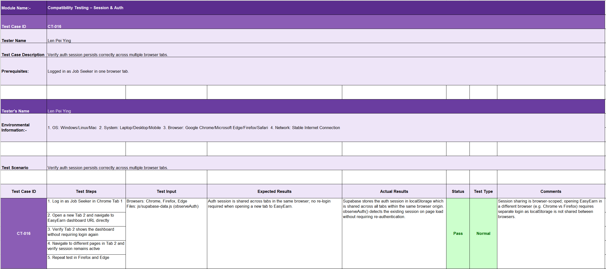

Figure 4.120: Session & Auth - Cross-tab Session Persistence

CT-017: Cross-tab logout

The session token was deleted with handleLogout() from supabase.auth.signOut(), and observeAuth() in another tab received the AUTH_STATE_CHANGE event and was redirected to the login page. After logging out in the first tab, a second tab will redirect to the login page as shown in Figure 4.121.

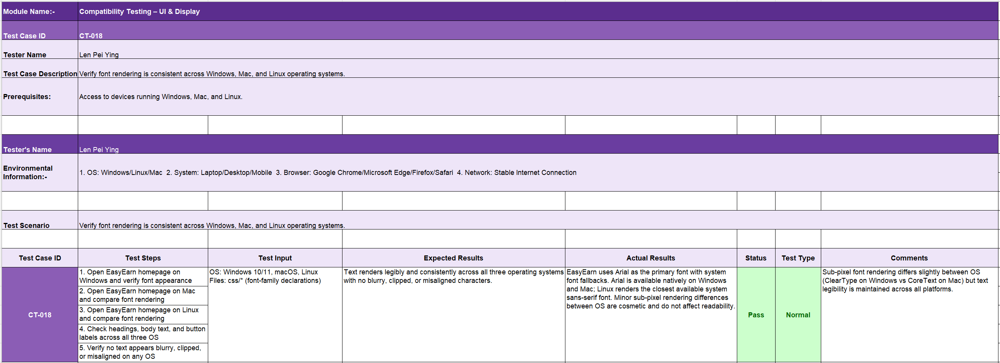

Figure 4.121: Session & Auth - Cross-tab Logout

#### 4.3.5.5 UI & Display

This category ensures that the visual aspects of the program, such as fonts, overflowing text and image previews, are displayed correctly and readable in various operating system (OS) environments and browsers.

CT-018: Cross-OS font rendering

Most testing has been done on Windows, where native support of Arial means no difference in sub-pixel rendering, which could affect legibility. Testing was not performed on a real Mac or Linux machine; Mac is expected to behave similarly, as it natively supports Arial; and Linux is expected to behave as a standard font rendering system, with cosmetic-only differences if the system sans-serif font is different, but based on the font rendering system behaviour, not direct testing. The text on the home page is readable on Windows, as Figure 4.122.

Figure 4.122: UI & Display - Cross-OS Font Rendering

CT-019: Long text overflow handling

Long texts were wrapped or truncated correctly in job cards and profile containers thanks to the CSS word-wrap and overflow properties; for unbreakable long texts, the detail pages adhered to the word-break property. The following Figure 4.123 displays a job description that wraps correctly in the container.

Figure 4.123: UI & Display - Long Text Overflow Handling

CT-020: Image upload preview

The FileReader API had already provided a local object URL for the image preview before upload, and images were displayed properly with the regular img src in Chrome, Firefox and Edge. The profile picture preview works correctly both before and after upload, as shown in Figure 4.124.

Figure 4.124: UI & Display - Image Upload Preview

#### 4.3.5.6 Form & Input

This category ensures that the form elements are used consistently and properly throughout the browsers supported.

CT-021: Interview date/time picker

In Chrome, Firefox and Edge, the datetime-local input opened and saved correctly and the date selected by the user was passed to the function updateInterviewSchedule() and put into the application's table. Safari also natively includes input of type datetime-local as required by the web standard, which was not tested on the testing devices employed. To schedule an interview, use the date and time picker as illustrated in Figure 4.125.

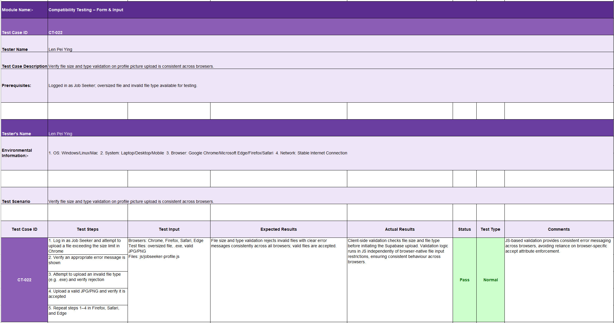

Figure 4.125: Form & Input - Interview Date/Time Picker

CT-022: File size and type validation

Client-side checks for file.size and file.type did not rely on browser-native limitations: files that were deemed invalid got the same error message in all tested browsers. In Figure 4.126, a file that is too large is being rejected, along with the validation error message.

Figure 4.126: Form & Input - File Size and Type Validation

CT-023: Password field masking

By default, all modern browsers mask characters in password entry and only send the password to Supabase Auth via HTTPS, not the console. The input for the password field is masked on the Login page as indicated in Figure 4.127.

Figure 4.127: Form & Input - Password Field Masking

## 4.4 Output Analysis

This section examines 2 representative outputs created by EasyEarn: the Job Seeker's Auto-Generated Resume, created client-side from a Job Seeker's profile information, and the Admin Analytics Dashboard, which aggregates platform-wide statistics, such as growth trends, moderation load and compliance-related record information for admin decision-making. For every output, this section compares the on-screen output with the underlying state of the database to ensure that the system is functioning as it is intended to work.

### 4.4.1 Admin Analytics Dashboard Output

The platform activity is provided via two visualisations in the Chart.js (Chart.js, 2023) library in the Admin Analytics Dashboard. Three summary cards at the top of the page report User Growth, Job Volume and Report Load as raw counts, and a line chart provides a visual of four metrics (Users, Jobs, Reports, and Verifications) over the past six months, enabling an admin to easily see growth trends or sudden surges in moderation load. A doughnut chart is the same as the four categories above (Verification Load), but will show the proportional activity of each category versus total activity on the platform, providing a quick snapshot of which of the categories, such as report volume compared to job postings, is dominating the current time. Both charts are computed on the client, using the existing data fetched from Supabase via fetchAllProfiles, fetchJobs, fetchReports and fetchPaymentDisputes, mirroring EasyEarn's static-frontend and BaaS architecture. The computed totals are also saved as a dated snapshot in a separate analytics table in Supabase (Figure 4.127), providing a history of daily activity levels without relying on the on-screen charts. The proportional breakdown doughnut chart is displayed on the Admin Analytics Dashboard in Figure 3.59 along with a trend line over the past six months.

Below the charts, the Compliance Awareness panel brings to the surface reminders from the Gig Workers Act 2025, allowing admins to make sure job postings are complete with the work scope and pay details, review reports and payment disputes to ensure timely follow-up, and rely on verification records for employer accountability. Below this, a Data Explorer table lists every underlying analytics record in its own row, which can be filtered by status, type of analytics record, and Keyword. An admin can drill from a summary chart down to the individual view of the record that comprises that summary chart.

The output is accurate since the database records that match the specified period of time are tallied and grouped together and displayed on the page, eliminating the need for a dedicated analytics server for Admins to have a real-time view of the operation. The consistency of these total_users, total_seekers, total_employers and active_listings numbers can also be seen in the successive snapshots shown in Figure 4.127, reflecting the numbers on the Admin Analytics Dashboard. Supabase analytics table with persisted daily snapshots (total_users, total_seekers, total_employers, active_listings, successful_matches) is shown in Figure 4.128.

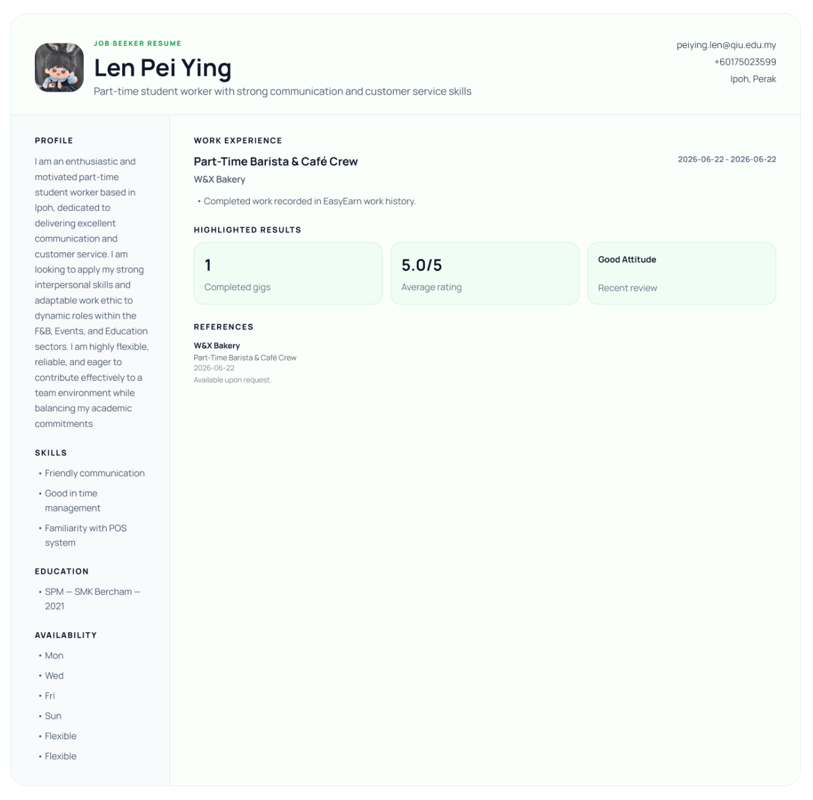

Figure 4.128: Supabase Analytics Table

### 4.4.2 Auto-Generated Resume Output (PDF)

The Resume Builder takes a Job Seeker's profile (profile summary, skills, education, availability and completed work history) and renders it as a snapshot in the browser, scaling it to 2x with html2canvas (von Hertzen, 2025) and embedding it into an A4-formatted document with jsPDF (Hall, 2025). The result is a PDF resume with the populated Skills section (friendly communication, time management, knowledge of POS systems), Education (SPM from SMK Bercham in 2021), and Availability (Mon, Wed, Fri, Sun, Flexible), as shown in Figure 4.129.

Figure 4.129: Auto-Generated Resume Output (PDF)

The Work Experience section contains information about the Work Experience placement from the seeker's application completion record, not from text copied and pasted. Three summary metrics are provided in the A Highlighted Results block: 1 completed gig, a 5.0/5 rating by the employer in their most recent review of the seeker, and a qualitative tag on the seeker's PDF as a result of the most recent employer review, indicating that the PDF accurately represents the seeker's real transaction and rating data at the time it was generated and not static values. A References section is also automatically generated from the same completed engagement and contains the following details: Employer, role, completion date, and the contact details (marked as available upon request). This is because the resume is generated by a piece of logic that reads structured data from multiple tables (work history, ratings), and then combines that data into a single PDF, which is sent to the client. This is a typical EasyEarn static-frontend and Backend-as-a-Service (BaaS) approach: the PDF is created on the client and the data is pulled from Supabase.

## 4.5 Conclusion

This chapter has described the implementation and testing of EasyEarn using five complementary testing methods. The results show that the major system processes work as designed, and also present the remaining issues of usability, security and compatibility to be addressed for the enhancement of the system.

The implementation of EasyEarn was described in Section 4.2, which included 49 pages of straightforward and well-structured code, along with three role-based sections, each with its own colour theme, driven by 46 vanilla JavaScript modules; as well as Supabase-based authentication (Supabase, 2023), PostgREST data access, and trigger-enforced business logic (Supabase, 2024) in the Backend, and a 12-table schema secured by RLS in the Database, and 94 iterative releases successfully deployed through GitHub Pages (GitHub, 2023, 2024).

The results of five testing methods that are aligned with the general software testing concepts described in ISO/IEC/IEEE 29119-1 (2022) were reported in Section 4.3. During System Testing, all 34 test cases were successful for the following areas: E2E Workflow, Integration, Performance, Recovery, Business Logic, Reporting and Compliance. There were five testers who ran 36 functional test cases in the roles of Job Seeker and Employer, and Admin, with real accounts and data in Supabase. The UAT results validated that the primary workflows in the roles could be accomplished. Nielsen's 10 Usability Heuristics (Nielsen, 1993) were applied in the Usability Testing session to determine the usability of the completed website. Nielsen's heuristics were assessed to be met except for four minor or cosmetic issues, which were identified across three of the Nielsen heuristics. It was found that security testing included 29 test cases (SEC-001 to SEC-029) in eight categories. No test cases showed that the results were off in the scenarios they were designed for, but several additional security and privacy concerns were found, such as the permissive users_public_read RLS policy. These risks are discussed further in Chapter 5.

In the two examples shown above of the system in Section 4.4, one was the Admin Analytics Dashboard, which pulled and displayed platform-wide analytics in a visual format using Chart.js (Chart.js, 2023), and the other was the Auto-Generated Resume (PDF), which reflected a Job Seeker's current work history and ratings using data retrieved from Supabase rather than manually entered resume content.

The implementation and test results of the EasyEarn described in this chapter show that EasyEarn works as expected on the major workflows and indicates where it needs to be improved. The major constraints are that usage evaluation is done by one evaluator, Security Testing revealed some security and privacy issues, and the number of UAT testers is limited. These restrictions give grounds for further discussion in Chapter 5, along with implications of the findings for the study's goals.
