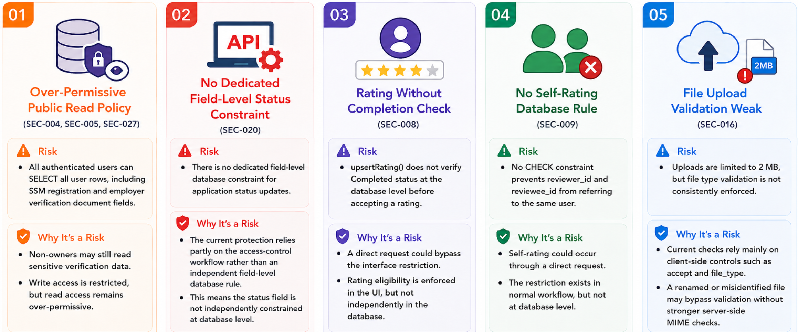
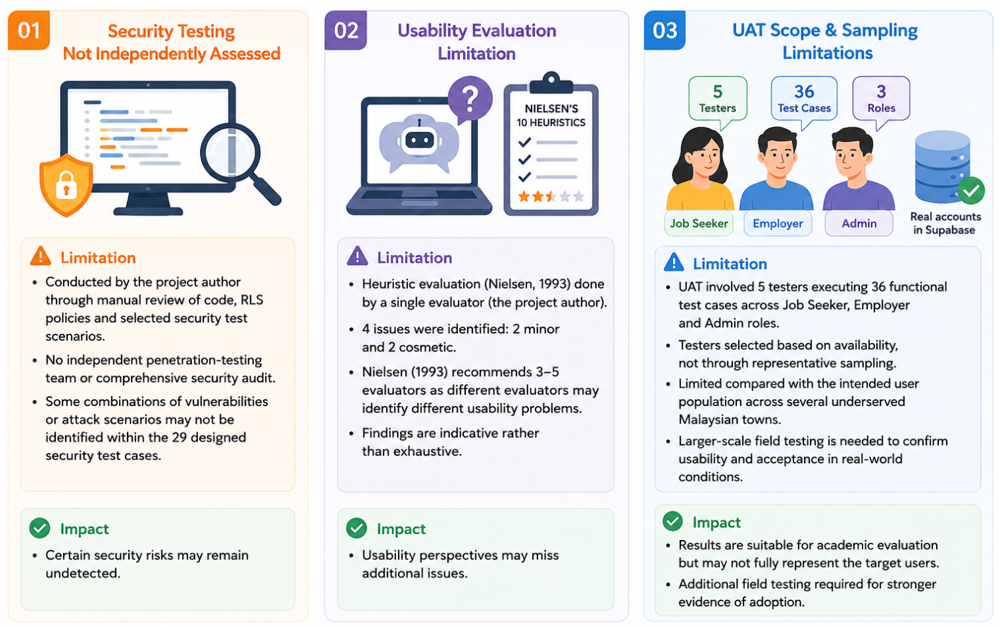
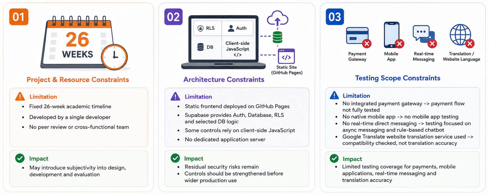
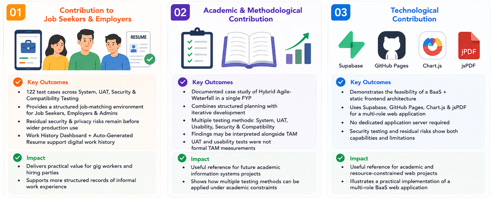
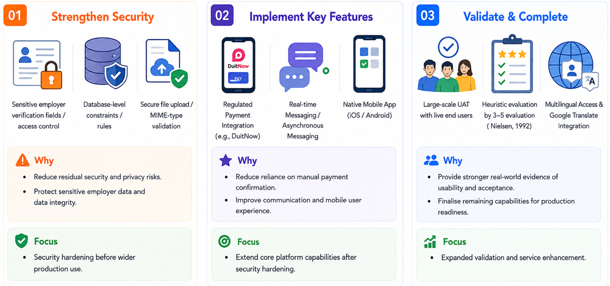
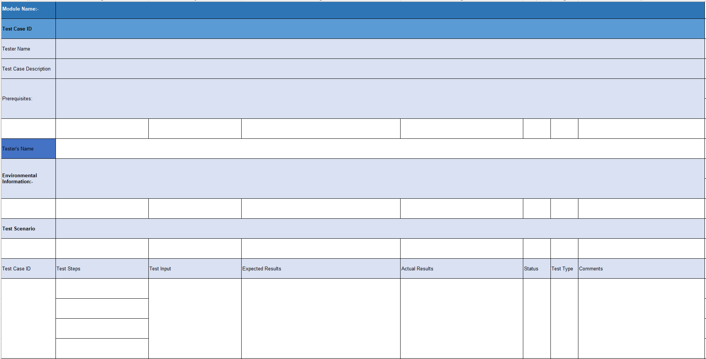
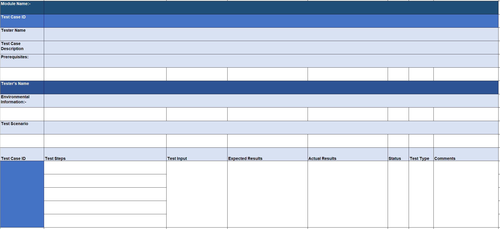
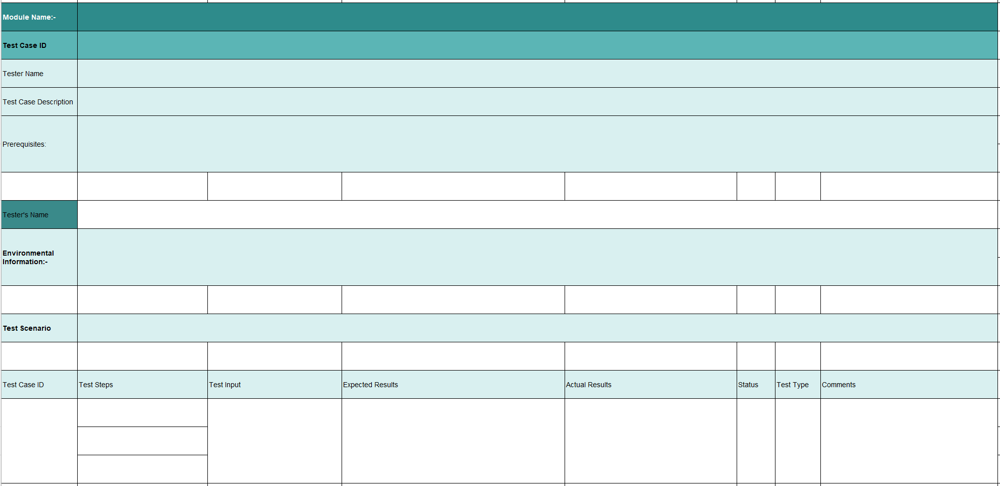
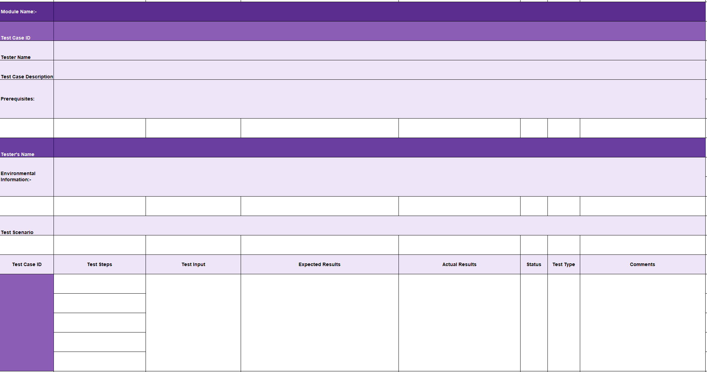

# Chapter 5: Discussion and Conclusion

## 5.1 Introduction

This final chapter summarises the implementation and testing of EasyEarn presented in Chapter 4 and reflects on how the four project goals outlined in Section 1.3 were realised: creating a multi-user job-matching platform; offering safety and trust features; building a verifiable digital work history for gig workers; and ensuring multilingual accessibility. Each objective has Key Findings discussed in Section 5.2. Limitations in implementation and testing are discussed in Section 5.3, with the residual risks identified during Security Testing (Section 4.3.4). The contribution of EasyEarn in terms of practical, academic and technical is presented in Section 5.4, and future enhancements are suggested in Section 5.5. The chapter and overall project are then summarised in Section 5.6.

## 5.2 Findings

The key findings of the EasyEarn project are summarised in this section, which is organised with respect to the four research objectives listed in Section 1.3, while the evidence for implementation and testing is provided in Chapter 4.

### 5.2.1 Objective 1: A Multi-User Job-Matching Platform

The first goal was to create a multi-user web-based platform that allows Job Seekers to browse and apply for available jobs and Employers to post and manage jobs on the site. This goal was accomplished by implementing role-specific dashboards, job posting and management functions, location-based search and filtering and application management and the rule-based chatbot. All 34 test cases passed during System Testing (Section 4.3.1) for the E2E Workflow, Integration, Performance, Recovery, Business Logic, Reporting and Compliance categories. The functional tests were run using real accounts and data in Supabase, and five testers ran a total of 36 functional test cases in the Job Seeker, Employer and Admin roles. According to Usability Testing (Section 4.3.3) based on Nielsen's 10 Usability Heuristics (Nielsen, 1993), there were four minor usability problems (not cosmetic) that were not blocking users from completing tasks.

The platform offers separate interfaces for Public users, Job Seekers, Employment agencies and Admin users, catering to the various functions they need to perform. This directly addresses Problem 1 (Lack of a Specialised Short-Term Labour Platform in Smaller Towns), Problem 4 (Inefficient Recruitment Process for Employers) and Problem 5 (No Platform for Flexible Workers) identified in Section 1.2.

### 5.2.2 Objective 2: A Safety and Trust Verification System

The second was to offer security and trust capabilities with the two-way Rating and Review System, Report and Flag System, and Employer Verification Badge. The features were added and tested in Security Testing. Eight security categories were tested, with a total of 29 test cases (SEC-001 to SEC-029) across the various categories. All test cases achieved the results they were designed for in the scenarios they were developed for, but there were some residual security and privacy concerns identified and discussed in Section 5.3.

The results highlight that the access-control and safety mechanisms implemented in the tested scenarios, in general, limited unauthorized operations, and offered features to let users verify with their employers, report suspicious activities, and review completed work relationships. These functions help achieve the goal of fostering transparency and accountability in short-term job matching and directly target Problem 2 (Prevalence of Social Media Job Scams) stated in Section 1.2.

### 5.2.3 Objective 3: A Verifiable Digital Work History

A third goal was to create a verifiable digital log of gig workers' work history. In Section 4.4.2, we explained how these goals have been achieved via the Work History Dashboard and Auto-Generated Resume features. The Resume Builder reads the data from the Job Seeker's profile, skill tags, work history and platform ratings stored in Supabase, formats it into a resume and generates a downloadable PDF. This will create a structured log of the completed work experience for Job Seekers, and directly address the Problem identified in Section 1.2: Absence of Verifiable Work Histories for Gig Workers.

### 5.2.4 Objective 4: Multilingual Accessibility

The 4th goal was to enable multilingual access for EasyEarn users. This objective has been achieved by using the Google Translate service of the website, which works by using the current EasyEarn page into the selected language. This function was tested along with browser, responsive design and session, interface and form behaviour items in Compatibility Testing (Section 4.3.5). All 23 compatibility test cases have been passed in the tested browsers in various tested environments. The main page content, navigation and interface elements were still readable after translation, as was the Google Translate integration.

This helps to enhance the usability of the platform for a larger audience of users from various Malaysian communities and language preferences, and answers Problem 6 (Language Barrier on Existing Platforms) highlighted in Section 1.2.

In general, the results have shown that the four project goals outlined in Section 1.3 were met. All 122 test cases were run through System Testing, UAT, Security Testing & Compatibility Testing, and all yielded the expected results for the defined scenarios. The results of the Usability Testing, which utilised Nielsen's 10 Usability Heuristics, corroborated these findings for the Job Seeker, Employer and Admin interfaces.

## 5.3 Limitation

The four project objectives were met based on the findings presented in Section 5.2, but there were a number of limitations during the implementation and testing of EasyEarn. The limitations should be taken into account before the system is implemented in a wider production.

### 5.3.1 Residual Security Risks

Security Testing (Section 4.3.4) found five security and privacy risks that exist after implementation. The defined security test cases gave the desired outcome on those specific scenarios, but these additional risks need to be resolved prior to the larger production run.

The first residual risk is related to the users_public_read RLS policy. This policy enables authenticated users to make SELECT statements over ALL user rows, including those defined with sensitive information for SSM registration and employer verification documents (SEC-004, SEC-005 and SEC-027). The users_update_own policy does not allow the updating of the other employer's verification data, but the current read policy is too permissive, as authenticated users who do not own a document can read these document fields. This is a privacy issue that needs to be resolved prior to wider production use.

The second residual risk is related to the field application. The user role restriction on the normal application workflow does not restrict status change via direct request (SEC-020), but there is no separate field-level database constraint that is used to restrict the change of the status via a direct request. For that reason, the existing protection is partially based on the access-control workflow that was defined, instead of a separate database-level rule for the status field.

The third residual risk is regarding eligibility for the ratings. Normal application flow determines if an application can be submitted for a rating based on its status in the system. This one is not independently enforced by a database-level rule that is linked to the rating process (SEC-008). While this application-level restriction is shown in the user interface for completed applications, a direct database request might circumvent this application-level restriction. It should also be implemented at the database level to determine eligibility for rating.

The fourth residual risk is related to the rating of one's own prevention. The ratings table does not currently have a CHECK constraint to prevent the reviewer_id and reviewee_id from pointing to the same user (SEC-009). The normal application flow doesn't offer a self-rating in the user interface, but it's not enforced at the database level. This should therefore be accomplished by adding a database constraint to prevent direct self-rating.

The fifth residual risk is the validation of uploaded files. File size validation is not always enforced on file uploads (SEC-016) and profile photos and employer verification documents may be a maximum of 2 MB. This implementation primarily uses the HTML accept attribute and selected file.type checks rather than an extensive server-side MIME-type check. This can cause the existing validation to be skipped if a renamed or misidentified file is passed. Before making this known to wider production, more robust file validation on the server should be used.

The five residual security risks identified during Security Testing include: (1) an over-permissive public-read RLS policy, (2) no application status updates field-level database constraint, (3) lack of a database-level constraint on rating eligibility, (4) lack of a CHECK constraint to prevent self-rating, and (5) incomplete validation of uploaded profile photos and employer verification documents.

Figure 5.1: Limitation – Residual Security Risks

### 5.3.2 Testing Methodology Limitations

The project author performed Security Testing by manual analysis of the source code, of RLS policies and some of the security test scenarios. Some combinations of vulnerabilities or attack patterns may not have been discovered in the 29 security test cases designed; the testing was not conducted by any independent penetration-testing team or a full security audit.

According to the Usability Testing conducted based on Nielsen's 10 Usability Heuristics (Nielsen, 1993), four issues were found, two minor and two cosmetic. This evaluation was done by one evaluator, who was also the author of the project, which is one of the limitations of this evaluation. Multiple evaluators are recommended by Nielsen (1993), as it is possible that different evaluators will find different usability problems. Thus, the results are not meant to be definitive.

The UAT (Section 4.3.2) utilised five testers who performed 36 functional test cases in the Job Seeker, Employer and Admin roles using live accounts and data held by Supabase. The UAT was successful in achieving the main role-specific workflows, but the number of testers involved was limited compared to the number of expected users in various underserved towns in Malaysia. Furthermore, the testers were not sampled, but were chosen because they were available. However, larger-scale testing in the field and with users from various geographical regions would give further evidence on the usability and acceptance of the platform in real-life conditions.

The limitations of the testing methodology are summarised in Figure 5.2: Security Testing was mostly undertaken by the project author without an independent security assessment, the heuristic evaluation was carried out by a single evaluator, and UAT was limited to a small number of testers, rather than a larger sample representative of the intended user base.

Figure 5.2: Limitation – Testing Methodology Limitations

### 5.3.3 Scope Limitations

There are several limitations that are associated with the scope and constraints of the project as described in 1.8.1 (Table 1.7) below. The project was a 26-week development period for two FYP courses, and a single developer completed the project. Thus, requirements analysis, design, development, testing, and quality assurance have been performed without the benefit of a peer review and cross-functional team as is typically found in commercially-developed software projects. This can lead to some personal opinions being included in the process of development and evaluation.

EasyEarn also has a static frontend and Backend-as-a-Service (BaaS) design. The frontend is deployed via GitHub Pages; the backend is Supabase's authentication, database services, RLS policies, and some database-level business logic. There are some controls that are also implemented in the client side JavaScript. This architecture does not require the use of a separate application server, but there are some remaining security issues that should be addressed before it is generally deployed in production environments, as discussed in Section 5.3.1.

The six limitations on the system outlined in Section 1.8.2 (Table 1.8) also influenced the scope of testing carried out in Chapter 4. These areas were not fully tested due to the lack of an integrated payment gateway and native mobile application. For the reason that the direct messaging feature is not real-time, communication testing centered on the current asynchronous messaging feature and rule-based chatbot. Compatibility Testing was performed to ensure that the translated pages remained accessible and usable in the tested environments (Google Translate website translation service) but was not attempted to test translation accuracy or native localisation.

EasyEarn is subject to several key scope limitations as summarised in Figure 5.3, such as the 26-week academic timeframe, a single developer environment, architectural constraints and limited testing coverage for payment gateway integration, native mobile applications, real-time messaging and translation accuracy.

Figure 5.3: Limitation – Scope Limitations

## 5.4 Contribution of the Project

This section is concerned with the contribution EasyEarn made in going beyond the achievement of the four project objectives described in Section 5.2. The contributions are analysed from three points of view: practical value for Job Seekers and Employers, academic and methodological value as a Final Year Project, and technological value based on the architecture and technologies that have been implemented in the system.

Contribution to Job Seekers and Employers

The implementation and testing results provided in Chapter 4 support the practical benefits described in Section 1.5.1. A total of 122 test cases were performed on System Testing, UAT, Security Testing and Compatibility Testing, and the defined test scenarios have given the desired results. The results demonstrated that EasyEarn offers a structured job-matching platform for Job Seekers, Employers and Admins, and the security and privacy risks identified in Section 5.3.1 suggest some areas for further development before it can be widely implemented in production.

The Work History Dashboard and the Auto-Generated Resume also give working implementation of a digital work history for gig workers. In addition to more structured records of informal work experience identified by Graham et al. (2017), completed work history, skills and platform ratings can be used to create a downloadable resume.

Academic and Methodological Contribution

EasyEarn also offers a documented case study of using a Hybrid Agile-Waterfall approach in a single Final Year Project. This project will involve a combination of formal planning and documentation and iterative development throughout the FYP. The testing approach outlined in Chapter 4, covering System Testing, UAT, Usability Testing using Nielsen's 10 Usability Heuristics (Nielsen, 1993), Security Testing and Compatibility Testing, in conjunction with the shortcomings outlined in Sections 5.3.1 and 5.3.2, serves as a documented illustration of how multiple testing methods can be applied within the confines of an academic information systems project.

The findings can also be considered together with the TAM framework discussed in Section 2.2.2 when interpreting the usability and acceptance of EasyEarn. Both the UAT and usability tests were, however, not constructed as formal assessments of TAM constructs, for example, perceived usefulness or perceived ease of use.

Technological Contribution

EasyEarn is a feature-rich multi-roles web application built using a Backend-as-a-Service (BaaS) approach with Supabase, GitHub Pages, Chart.js and jsPDF, but without a dedicated application server needed. The authentication, database service, RLS policies and a subset of the business logic is provided by Supabase, and the frontend is deployed as a static GitHub page.

The results of the Security Tests in Section 4.3.4 and the remaining risks in Section 5.3.1 give a practical example of the strengths and weaknesses of this architecture. The project can thus be used as a good reference for any other academic or resource-constrained project that is considering using a BaaS architecture for their web application project.

Figure 5.4 summarizes the three major contributions of EasyEarn: its practical value to Job Seekers and Employers, its academic and methodological value as a Hybrid Agile-Waterfall Final Year Project, and its technological value as the implementation of a multi-role web application with a BaaS architecture.

Figure 5.4: Contribution of the Project

5.5 Future Enhancement

The identified six system limitations and five residual security risks from Sections 1.8.2 (Table 1.8) and 5.3.1 are a guideline for future development of EasyEarn. Priority should be given to resolving the remaining security and privacy issues. This involves limiting access to sensitive areas for employer verification, adding database-level constraints on application status changes, rating eligibility and preventing applications from self-rating, and enforcing better MIME-type validation when files are uploaded to the server.

The platform could also be extended further with feature enhancements. Payment integration like DuitNow can help minimise manual payment confirmation. The current asynchronous messaging feature may be enhanced to include real-time messaging capabilities via Supabase Realtime or an appropriate real-time messaging service. Ideally, a native iOS or Android app could be created to complement the push notifications and provide offline access and even better mobile functionality than the current responsive design.

Future evaluation to include more end-users from the target underserved towns. Larger-scale field testing would give more evidence of the platform's usability and acceptance in real-world testing conditions as there were five testers involved in the current UAT. Heuristic evaluation can also be performed by three to five evaluators as suggested by Nielsen (1993), for better coverage of usability issues. Also, the current Google Translate website translation service could be expanded to a native translation API like the Google Cloud Translation service, and a formal identity verification service could be included in the employer verification. The improvements would bring EasyEarn nearer to the production level of being used widely.

The proposed EasyEarn Phase 2 Roadmap is summarised in Figure 5.5: Security hardening by increased access controls, database constraints and server-side file validation; feature expansion by payment integration, real-time messaging, and native mobile application; and expanded validation through increased-scale UAT, multi-evaluator heuristic testing, formal identity verification, and native translation API integration.

Figure 5.5: Future Enhancement

## 5.6 Conclusion

The EasyEarn project was to create an online platform for job matching between Job Seekers and Employers in under-serviced towns in Malaysia, such as Ipoh, Kangar, Alor Setar, Kuala Terengganu and Kota Bharu. The results from this study show that the four project objectives outlined in Section 1.3 were met. The findings from 122 test cases carried out in all the various types of testing, including System Testing, UAT, Security Testing and Compatibility Testing, supported this, as well as the findings from Usability Testing, presented in Chapter 4 and discussed in Section 5.2.

There are also certain restrictions in the project with regard to security, testing methodology and project scope as described in Section 5.3. The restrictions are those of a project which was developed by one developer in a limited time frame (26 weeks in a school year). Despite these limitations, the project offers practical, academic and technological contributions as discussed in Section 5.4 and a roadmap of future extensions and addresses to the remaining limitations in Section 5.5.

EasyEarn as a whole shows the feasibility of having a single developer job-matching website with a Backend-as-a-Service (BaaS) solution to assist with short-term job matching in less-served communities in Malaysia. The features implemented on the platform help overcome the problems of geographic access, employment trust, digital work history, and multilingual accessibility; the limitations identified with the platform will need to be overcome before it can be widely used in production. EasyEarn is thus a working academic prototype as well as a documented case study for future academic and applied computing projects in this field.

# References

Abd Samad, N., Siti Nurazira, M. D., and Zainudin, A. (2023). Motivational factors of gig economy participation among Malaysian youth. Asian Journal of Economics and Business, 4(2), 45-58.

Ajzen, I., and Fishbein, M. (1980). Understanding attitudes and predicting social behaviour. Prentice-Hall. https://www.semanticscholar.org/paper/Understanding-Attitudes-and-Predicting-Social-Ajzen-Fishbein/2303e303f57636618d9c8d5b0050c558a565e835

Akerlof, G. A. (1970). The market for lemons: Quality uncertainty and the market mechanism. The Quarterly Journal of Economics, 84(3), 488-500. https://doi.org/10.2307/1879431

Apple Developer Program. (2023). App Store review guidelines. Apple Inc. https://developer.apple.com/app-store/review/guidelines/

Ba, S., and Pavlou, P. A. (2002). Evidence of the effect of trust-building technology in electronic markets: Price premiums and buyer behaviour. MIS Quarterly, 26(3), 243-268. https://doi.org/10.2307/4132332

Bagozzi, R. P. (2007). The legacy of the technology acceptance model and a proposal for a paradigm shift. Journal of the Association for Information Systems, 8(4), 244-254. https://aisel.aisnet.org/jais/vol8/iss4/12/

Bank Negara Malaysia. (2022). Financial technology enabler group: Payment systems policy. Bank Negara Malaysia. https://www.bnm.gov.my

Beck, K., Beedle, M., van Bennekum, A., et al. (2001). Manifesto for agile software development. http://agilemanifesto.org/

Bernama. (2024). Malaysia's gig economy surpasses 3 million workers. Bernama. https://www.bernama.com

Boehm, B., & Turner, R. (2004). Balancing agility and discipline: A guide for the perplexed. Addison-Wesley. https://dl.acm.org/doi/10.5555/861419

Canva. (2023). Canva: Visual communication platform. Canva Pty Ltd. https://www.canva.com

Chart.js. (2023). Chart.js documentation. https://www.chartjs.org/docs/latest/

Creswell, J. W. (2014). Research design: Qualitative, quantitative, and mixed methods approaches (4th ed.). SAGE Publications. https://study.sagepub.com/creswellrd4e

Computer Crimes Act 1997 (Act 563). (1997). Laws of Malaysia. Commissioner for Law Revision Malaysia. https://www.agc.gov.my/

Constantiou, I., Marton, A., and Tuunainen, V. K. (2017). Four models of sharing economy platforms. MIS Quarterly Executive, 16(4), 236-251. https://aisel.aisnet.org/misqe/vol16/iss4/3/

Consumer Protection Act 1999 (Act 599). (1999). Laws of Malaysia. Commissioner for Law Revision Malaysia. https://www.agc.gov.my/

Date, C. J. (2019). Database design and relational theory: Normal forms and all that jazz (2nd ed.). Apress. https://doi.org/10.1007/978-1-4842-5540-7

Davis, F. D. (1989). Perceived usefulness, perceived ease of use, and user acceptance of information technology. MIS Quarterly, 13(3), 319-340. https://doi.org/10.2307/249008

DeepL. (2023). DeepL translator: Supported languages. DeepL SE. https://www.deepl.com/en/languages

Department of Statistics Malaysia. (2023). Labour force survey report, Malaysia 2023. Department of Statistics Malaysia. https://www.dosm.gov.my

Department of Statistics Malaysia. (2024). Labour force survey report: Third quarter 2024. Department of Statistics Malaysia. https://www.dosm.gov.my

Employment Act 1955 (Act 265). (1955). Laws of Malaysia. Commissioner for Law Revision Malaysia. https://www.agc.gov.my/

Etikan, I., Musa, S. A., & Alkassim, R. S. (2016). Comparison of convenience sampling and purposive sampling. American Journal of Theoretical and Applied Statistics, 5(1), 1–4. https://doi.org/10.11648/j.ajtas.20160501.11

Eurofound. (2018). Employment and working conditions of selected types of platform work. Publications Office of the European Union. https://www.eurofound.europa.eu/publications/report/2018/employment-and-working-conditions-of-selected-types-of-platform-work

Ferraiolo, D. F., Sandhu, R., Gavrila, S., Kuhn, D. R., & Chandramouli, R. (2003). Proposed NIST standard for role-based access control. ACM Transactions on Information and System Security, 4(3), 224-274. https://doi.org/10.1145/501978.501980

Flanagan, D. (2020). JavaScript: The definitive guide (7th ed.). O'Reilly Media. https://www.oreilly.com/library/view/-/9781491952016

Fowler, M. (2018). Refactoring: Improving the design of existing code (2nd ed.). Addison-Wesley.

Garrett, J. J. (2011). The elements of user experience: User-centered design for the web and beyond (2nd ed.). New Riders.

Gefen, D., Karahanna, E., and Straub, D. W. (2003). Trust and TAM in online shopping: An integrated model. MIS Quarterly, 27(1), 51-90. https://doi.org/10.2307/30036519

GitHub. (2023). GitHub Pages documentation. GitHub, Inc. https://docs.github.com/en/pages

GitHub. (2024). GitHub Pages: Websites for you and your projects. GitHub, Inc. https://pages.github.com

GoGet. (2024). About GoGet. GoGet Malaysia. https://www.goget.my

Google Cloud. (2023). Cloud Translation API documentation. Google LLC. https://cloud.google.com/translate/docs

Google Play Console. (2023). Android developer guide: Publish your app. Google LLC. https://developer.android.com/distribute/googleplay

Google. (2023). Google Translate. Google LLC. https://translate.google.com

Google. (2025). Google Fonts. Google LLC. https://fonts.google.com

Graham, M., Hjorth, I., and Lehdonvirta, V. (2017). Digital labour and development: Impacts of global digital labour platforms and the gig economy on worker livelihoods. Transfer: European Review of Labour and Research, 23(2), 135-162. https://doi.org/10.1177/1024258916687250

Hall, J. (2025). jsPDF: Client-side JavaScript PDF generation for everyone [Software library]. GitHub. https://github.com/parallax/jsPDF

International Labour Organisation. (2021). World employment and social outlook 2021: The role of digital labour platforms in transforming the world of work. ILO. https://www.ilo.org

International Organization for Standardization. (2022). ISO/IEC/IEEE 29119-1:2022 — Software and systems engineering — Software testing — Part 1: General concepts. ISO. https://www.iso.org/standard/81291.html

International Software Testing Qualifications Board (ISTQB). (n.d.). ISTQB glossary. https://glossary.istqb.org

JobStreet. (2024). About JobStreet. SEEK Asia. https://www.jobstreet.com.my

Jones, M., Bradley, J., & Sakimura, N. (2015). JSON Web Token (JWT) (RFC 7519). Internet Engineering Task Force (IETF). https://www.rfc-editor.org/rfc/rfc7519

Kalai Vani, K., and Foo, C. C. (2024). Gig economy participation: Is higher education a barrier? UTAR News. https://news.utar.edu.my

King, W. R., and He, J. (2006). A meta-analysis of the technology acceptance model. Information and Management, 43(6), 740-755. https://doi.org/10.1016/j.im.2006.05.003

Kuek, S. C., Paradi-Guilford, C., Fayomi, T., Imaizumi, S., Ipeirotis, P., Pina, P., and Singh, M. (2015). The global opportunity in online outsourcing. World Bank Group. https://openknowledge.worldbank.org/handle/10986/22284

Leach, P., Mealling, M., & Salz, R. (2005). A universally unique identifier (UUID) URN namespace (RFC 4122). Internet Engineering Task Force (IETF). https://www.rfc-editor.org/rfc/rfc4122

Lucide Contributors. (2025). Lucide icons documentation. https://lucide.dev

Malaysia Digital Economy Corporation. (2023). Gig economy report 2023. MDEC. https://mdec.my

Malaysian Communications and Multimedia Commission. (2023). Internet users survey 2023. MCMC. https://www.mcmc.gov.my

MDN Web Docs. (2023). HTML, CSS, and JavaScript references. Mozilla Foundation. https://developer.mozilla.org

Ministry of Human Resources Malaysia. (2025). Gig Workers Act 2025 (Act 872). Retrieved from https://www.mohr.gov.my/aktapekerjagig2025/

Nielsen, J. (1993). Usability engineering. Academic Press.

Nielsen, J. (2012). Usability 101: Introduction to usability. Nielsen Norman Group. https://www.nngroup.com/articles/usability-101-introduction-to-usability/

Organisation for Economic Co-operation and Development. (2019). OECD employment outlook 2019: The future of work. OECD Publishing. https://doi.org/10.1787/9ee00155-en

Open Web Application Security Project Foundation. (2021). OWASP top ten. The Open Web Application Security Project. https://owasp.org/www-project-top-ten/

Park, I., Kim, D., Moon, J., Kim, S., Kang, Y., & Bae, S. (2022). Searching for new technology acceptance model under social context: Analyzing the determinants of acceptance of intelligent information technology in digital transformation and implications for the requisites of digital sustainability. Sustainability, 14(1), 490. https://doi.org/10.3390/su14010490

Pavlou, P. A. (2003). Consumer acceptance of electronic commerce: Integrating trust and risk with the technology acceptance model. International Journal of Electronic Commerce, 7(3), 101-134. https://www.tandfonline.com/doi/abs/10.1080/10864415.2003.11044275

Personal Data Protection Act 2010 (Act 709). (2010). Laws of Malaysia. Commissioner for Law Revision Malaysia. https://www.agc.gov.my/

Pillai, S., and Paul, J. (2023). Gig economy in Malaysia: Current, present and future. International Management and Business Review, 16(2), 62-67.

PostgREST. (2025). PostgREST documentation. https://postgrest.org

Pressman, R. S., & Maxim, B. R. (2020). Software engineering: A practitioner's approach (9th ed.). McGraw-Hill Education.

Project Management Institute. (2021). A guide to the project management body of knowledge (PMBOK® guide) (7th ed.). Project Management Institute. https://www.pmi.org/pmbok-guide-standards/foundational/pmbok

RiceBowl. (2024). About RiceBowl. RiceBowl Networks Sdn Bhd. https://www.ricebowl.my

Royce, W. W. (1970). Managing the development of large software systems. Proceedings of IEEE WESCON, 26, 1-9. https://www.praxisframework.org/files/royce1970.pdf

Rumbaugh, J., Jacobson, I., & Booch, G. (2004). The Unified Modelling Language Reference Manual (2nd ed.). Addison-Wesley. https://www.oreilly.com/library/view/unified-modeling-language/0321245628/

Saunders, M., Lewis, P., & Thornhill, A. (2019). Research methods for business students (8th ed.). Pearson. https://www.pearson.com/en-gb/subject-catalog/p/research-methods-for-business-students/P200000005358/9781292208800

Schorr, A. (2023). The Technology Acceptance Model (TAM) and its importance for digitalization research: A review. Open Education Studies, 5(1). https://doi.org/10.1515/edu-2022-0205

Schwaber, K., & Sutherland, J. (2020). The Scrum guide: The definitive guide to Scrum — The rules of the game. Scrum.org. https://www.scrumguides.org/scrum-guide.html

Shum, H. Y., He, X. D., & Li, D. (2018). From Eliza to XiaoIce: Challenges and opportunities with social chatbots. Frontiers of Information Technology & Electronic Engineering, 19(1), 10-26. https://doi.org/10.1631/FITEE.1700826

Siti Nurazira, M. D., Abd Samad, N., and Ahmad, R. (2024). Navigating the gig economy: What drives Malaysian youth? Journal of Applied Youth Studies. https://link.springer.com/article/10.1007/s43151-025-00192-z

Sommerville, I. (2016). Software engineering (10th ed.). Pearson Education Limited. https://www.pearson.com/en-gb/subject-catalog/p/Sommerville-Software-Engineering-Global-Edition-10th-Edition/P200000005464/9781292096148

Supabase. (2023). Supabase documentation: Database, authentication, and storage. Supabase Inc. https://supabase.com/docs

Troise, C., O'Driscoll, A., Tani, M., & Prisco, A. (2021). Online food delivery services and behavioural intention: A test of an integrated TAM and TPB framework. British Food Journal, 123(6), 2235-2258. https://doi.org/10.1108/BFJ-05-2020-0418

Troopers. (2024). About Troopers. Troopers Malaysia. https://www.troopers.com.my

United Nations Capital Development Fund. (2019). Gig economy and the future of work. United Nations Capital Development Fund. https://www.uncdf.org

Venkatesh, V., and Davis, F. D. (2000). A theoretical extension of the technology acceptance model: Four longitudinal field studies. Management Science, 46(2), 186-204. https://doi.org/10.1287/mnsc.46.2.186.11926

Venkatesh, V., Morris, M. G., Davis, G. B., and Davis, F. D. (2003). User acceptance of information technology: Toward a unified view. MIS Quarterly, 27(3), 425-478. https://doi.org/10.2307/30036540

Venkatesh, V., & Bala, H. (2008). Technology acceptance model 3 and a research agenda on interventions. Decision Sciences, 39(2), 273-315. https://doi.org/10.1111/j.1540-5915.2008.00192.x

von Hertzen, N. (2025). html2canvas: Screenshots with JavaScript [Software library]. GitHub. https://github.com/niklasvh/html2canvas

Whitty, M. T., and Buchanan, T. (2012). The online romance scam: A serious cybercrime. CyberPsychology, Behavior, and Social Networking, 15(3), 181-183. https://doi.org/10.1089/cyber.2011.0352

World Bank. (2023). Working without borders: The promise and peril of online gig work. World Bank Group. https://www.worldbank.org

# Appendix

## 6.1 Google Form

This appendix shows the Google Form used for the EasyEarn User Requirement Survey. Information on users' requirements and extra feedback was gathered using the questionnaire, which also asked for respondents' background data, their job searches, and their experiences of being hired or not.

https://forms.gle/28utP2sdZZ9MFvBbA

## 6.2 EasyEarn Job Matching Portal

The reader can find direct access to the deployed version of the EasyEarn web portal through this link, so that he or she can have a look at the real system that was made throughout this report.

https://peiying040830.github.io/easyearn/

## 6.3 Sample of Test Case

This section provides sample test case templates for each of the four types of testing that are performed on EasyEarn: System Testing, User Acceptance Testing, Security Testing, and Compatibility Testing. The following are examples of test cases and the standard formatting for test cases: Module name, Test case ID, Test case prerequisites, Test scenario, Test steps, Expected results, Actual results, Test case status, and Test type.

- System Testing

This is a sample test case template (ST-001) from the System Testing documentation in the E2E Workflow category that shows the format for describing test cases, prerequisites, test steps, test input, expected result, actual result, test status and test type. System Testing: The test case template used to document the E2E Workflow test cases is shown in Figure 6.1.

Figure 6.1: Sample of Test Case: System Testing

- User Acceptance Testing (UAT)

This is a sample Test Case (TC-001) with the format of recording the Test Scenario, Test Steps, Expected Results, Actual Results, Status and Tester's Information from the User Acceptance Testing (UAT) documentation, in a Job Seeker (JS) category. The test case template for documenting test cases of Job Seeker UAT is given in Figure 6.2.

Figure 6.2: Sample of Test Case: UAT

- Security Testing

This is a sample test case template (SEC-001) from the Security Testing documentation that was chosen from the RLS - Data Isolation category to show you the format on which the test scenario, test steps, expected results, actual results, status and test type are recorded. The test case template for Security Testing (RS - Data Isolation) is shown in Figure 6.3.

Figure 6.3: Sample of Test Case: Security Testing

- Compatibility Testing

The following is an example test case template (CT-001) of the format to document the test scenario, test steps, expected results, actual results, status, and test type from the Browser Compatibility category of the Compatibility Testing documentation. The Browser Compatibility test cases are documented using the test case template given in Figure 6.4 under Compatibility Testing.

Figure 6.4: Sample of Test Case: Compatibility Testing
