Bachelor of Information Technology (Hons)

Study Intake: 202604

BIT 3117 Final Year Project 1

PROJECT PROPOSAL

| Student Name &amp; ID | LEN PEI YING, QIU-202404-007159 |
| --- | --- |
| Project Tittle | EasyEarn Job Matching Portal |
| Supervisor | MR. ON SIANG AIK |
| Moderator | MR. JIVINDRA |
| Submission Date | 11/05/2026 |

# List of Tables

DESCRIPTION PAGE

Table 1: Core Features 9

Table 2: Optional Features 10

Table 3: Project Schedule 21

Table 4: Project Milestones 30

Table 5: Sprint Breakdown and Deliverables 32

Table 6: Final Deliverables 33

Table 7: Feature Comparison of Existing Platforms and EasyEarn 42

Table 8: Summary of Constraints 47

Table 9: Summary of Limitations 50

# List of Figures

DESCRIPTION PAGE

Figure 1: Problem Statement 5

Figure 2: System Module Diagram 8

Figure 3: Benefits 16

Figure 4: Significance 19

Figure 5: Work Breakdown Structure 20

Figure 6: Gantt Chart (1) 25

Figure 7: Gantt Chart (2) 25

Figure 8: Gantt Chart (3) 26

Figure 9: Gantt Chart (4) 26

Figure 10: System Architecture Diagram 35

Figure 11: Hybrid Agile-Waterfall Methodology Diagram 44

# List of Abbreviations

| AI | Artificial Intelligence |
| --- | --- |
| API | Application Programming Interface |
| BaaS | Backend-as-a-Service |
| CDN | Content Delivery Network |
| CRUD | Create, Read, Update and Delete |
| EPF | Employees Provident Fund |
| ERD | Entity-Relationship Diagram |
| FAQ | Frequently Asked Questions |
| FYP | Final Year Project |
| HTML | Hypertext Markup Language |
| HTTPS | HyperText Transfer Protocol Secure |
| CSS | Cascading Style Sheets |
| ILO | International Labour Organisation |
| JS | JavaScript |
| JsPDF | JavaScript PDF Generation Library |
| MDEC | Malaysia Digital Economy Corporation |
| MCMC | Malaysian Communications and Multimedia Commission |
| OECD | Organisation for Economic Co-operation and Development |
| PDPA | Personal Data Protection Act |
| PDF | Portable Document Format |
| PERKESO | Pertubuhan Keselamatan Sosial |
| QR | Quick Response |
| RBAC | Role-Based Access Control |
| RLS | Row Level Security |
| SESS | Self-Employment Social Security Scheme |
| SME | Small and Medium Enterprise |
| SOCSO | Social Security Organisation |
| SQL | Structured Query Language |
| UAT | User Acceptance Testing |
| UI/UX | User Interface / User Experience |
| UNCDF | United Nations Capital Development Fund |
| URL | Uniform Resource Locator |
| WBS | Work Breakdown Structure |

# 1.0 Introduction

The gig economy has fundamentally reshaped the nature of work in the 21st century. The World Bank (2023) estimates that between 154 million and 435 million workers worldwide participate in online gig work, supported by over 545 gig platforms. This shift has transformed conventional employment by offering greater flexibility and access to diverse income streams, further accelerated by the widespread adoption of smartphones and the internet (International Labour Organisation, 2021). In Southeast Asia, informal and temporary work has become a growing source of income, especially among higher education students, housewives, and those who need additional income on top of their main engagements (World Bank, 2023).

In Malaysia, the gig economy gained significant momentum during the COVID-19 pandemic as traditional employment was disrupted and people began seeking more adaptable sources of income (Abd Samad et al., 2023). By 2024, own-account workers reached 3.09 million, representing approximately 25.1 per cent of the national workforce (Department of Statistics Malaysia, 2024; Kalai Vani & Foo, 2024). Demographically, 97.71 per cent of ride-hailing workers are aged 19 to 30, earning between RM1,500 and RM2,500 monthly, while 45 per cent of Malaysians have identified as gig workers at some point (Department of Statistics Malaysia, 2023; Pillai & Paul, 2023). Flexible hours, additional income potential, and low entry barriers make gig work particularly attractive to students, housewives, and the unemployed (Abd Samad et al., 2023; Siti Nurazira et al., 2024). According to MDEC (2023), the gig economy's market size in Malaysia was estimated at RM1.33 billion in the third quarter of 2023, with more than 100,000 new people registering on gig platforms during that period.

Despite this growth, organised platforms such as GoGet and Troopers remain concentrated in major cities like Kuala Lumpur, Penang, and Johor Bahru, leaving secondary cities such as Ipoh, Kangar, Alor Setar, Kota Bharu, and Kuala Terengganu without structured short-term employment options (MDEC, 2023; GoGet, 2024; Troopers, 2024). In the absence of dedicated platforms, workers in these areas rely on unverified social media channels such as Facebook groups and Instagram communities, exposing them to fraud and limiting their ability to build a verifiable work history (Pillai & Paul, 2023; MCMC, 2023). Traditional portals like JobStreet and RiceBowl cater exclusively to permanent or contract roles and are ill-suited to gig work, leaving a significant service gap across Malaysia's smaller towns (MDEC, 2023).

EasyEarn is proposed to bridge this gap as a web-based job-matching portal built on HTML, CSS, JavaScript, and Supabase. It incorporates safety and trust features, a multilingual interface via Google Translate, and a work history profile with an auto-generated resume option. By addressing the shortcomings of existing Malaysian gig platforms, EasyEarn aims to reduce the service gap between urban centres and smaller towns, supporting economic inclusion and Malaysia's broader digital economy goals (MDEC, 2023).

# 1.1 Problem Statement

Despite significant growth in Malaysia's gig economy (MDEC, 2023), serious gaps remain in the current job-matching landscape. Residents of smaller towns such as Ipoh, Kangar, Alor Setar, Kota Bharu, and Kuala Terengganu lack access to a specialised, regulated short-term employment platform (Pillai & Paul, 2023), while informal social media channels offer no structured user protection (MCMC, 2023). The six key problems that led to the development of EasyEarn are outlined below.

Problem 1: Lack of a Specialised Short-Term Labour Platform in Smaller Towns

Organised gig platforms in Malaysia are concentrated in major cities, leaving secondary towns underserved. MDEC (2023) confirmed that the Klang Valley dominates gig economy activity, while cities like Ipoh, Kangar, and Kota Bharu have minimal platform representation. Workers in these areas are forced to rely on informal and unregulated channels, increasing inefficiency and personal risk (Pillai & Paul, 2023). The World Bank (2023) identifies this geographic imbalance as a common challenge in developing economies where platform growth lags in lower-density regions.

Problem 2: Prevalence of Social Media Job Scams

In the absence of verified gig platforms, temporary job seekers depend on Facebook groups, Instagram posts, and WhatsApp communities, all of which lack identity verification, employer accountability, and formal reporting mechanisms. MCMC (2023) reported a 34 per cent increase in social media job scams in 2022, with students and housewives being particularly vulnerable. With only 222,876 gig workers registered under SOCSO as of August 2023, the informal job market represents a significant protection gap (Department of Statistics Malaysia, 2023). Lacity and Willcocks (2017) attribute this to the absence of formal verification mechanisms on informal channels.

Problem 3: Absence of a Verifiable Work History for Gig Workers

Malaysia lacks a formal system for gig workers to document and authenticate their employment history, preventing them from demonstrating experience or negotiating better rates (Pillai & Paul, 2023). This also hinders employers from accurately assessing applicant suitability, creating a low-trust hiring environment (Abd Samad et al., 2023). Graham et al. (2017) identify the inability to build a portable professional identity as a persistent structural barrier for platform workers in emerging economies.

Problem 4: Inefficient Recruitment Process for Employers

SMEs and individual employers seeking temporary staff currently rely on informal social media posts and word-of-mouth referrals, which are time-consuming and lack structured applicant screening. Kalai Vani and Foo (2024) found that small businesses in Malaysia bear significant recruitment costs due to the absence of a centralised short-term hiring system. Without credibility checks on applicants, poor hiring decisions become more likely (Kuek et al., 2015), a challenge the OECD (2019) links to disproportionately higher recruitment costs for SMEs in developing countries lacking digital hiring tools.

Problem 5: No Platform Targeted at Flexible Workers

Existing platforms fail to serve university students, housewives, and the unemployed who require short-duration, flexible work. Long-term portals like JobStreet and RiceBowl are not designed for temporary roles, while GoGet and Troopers are geographically inaccessible to those outside major cities. Abd Samad et al. (2023) identified flexible schedules and supplementary income as the primary motivators for Malaysian youth engaging in gig work, yet no dedicated platform serves these needs in smaller towns, limiting economic participation and financial security (Siti Nurazira et al., 2024).

Problem 6: Language Barrier on Existing Platforms

Most Malaysian gig platforms operate primarily in English, creating accessibility barriers for speakers of Bahasa Malaysia, Mandarin, and Tamil. UNCDF (2019) noted that GoGet's low- and middle-income users are predominantly Bahasa Malaysia speakers, yet the platform's interface remains largely in English. In smaller towns where English proficiency is comparatively lower, this limits usability and excludes a substantial portion of the workforce. UNCDF (2019) emphasises that language inclusivity is fundamental to equitable access to digital employment platforms in Southeast Asia.

All six problems highlight a systemic gap in Malaysia's gig economy infrastructure. The absence of a specialised, accessible, and safe short-term job-matching platform, particularly in underserved areas, has resulted in economic marginalisation, heightened fraud risk, and limited career development for a significant portion of the Malaysian workforce. EasyEarn is proposed as an integrated solution through a structured, web-based job-matching portal serving both job seekers and employers across Malaysia.

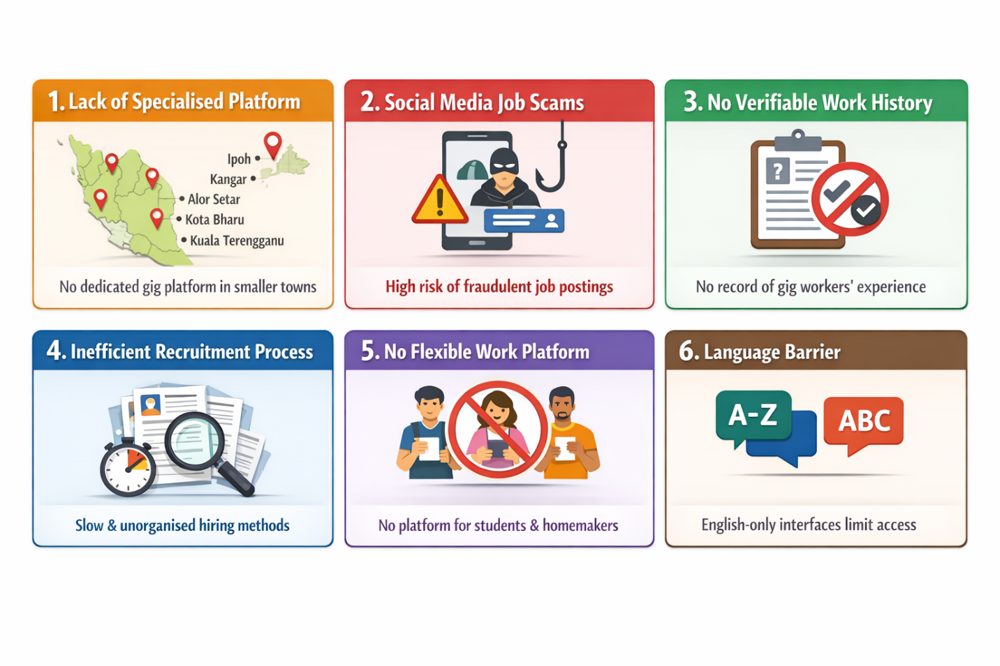

Figure 1: Problem Statement

# 1.2 Objectives and Scope

## 1.2.1 Objectives

This project proposes designing and developing EasyEarn. This web-based job-matching portal connects job seekers and employers through structured access to short-term, part-time, and freelance employment opportunities across Malaysia, with particular emphasis on serving underserved regions such as Ipoh, Kangar, Alor Setar, Kota Bharu, and Kuala Terengganu (MDEC, 2023; Pillai & Paul, 2023).

The objectives of EasyEarn are as follows:

- To develop a fully functional, multi-user web-based job-matching portal that connects job seekers and employers through short-term, part-time, and freelance employment opportunities, incorporating role-based dashboards, job posting and application management with full CRUD capabilities, location-based job search and filtering, and a rule-based chatbot for 24/7 user support.

- To implement a comprehensive platform safety and trust verification system comprising an Employer Verification Badge, a Report and Flag System, and a bidirectional Rating and Review System, thereby reducing the risk of fraudulent job listings and establishing a transparent, accountable hiring environment for both job seekers and employers (MCMC, 2023).

- To develop a verifiable digital work history profile for gig workers that tracks completed jobs, total earnings, and skill sets, and includes an Auto-Generate Resume feature that produces a downloadable PDF resume from work history data, addressing the absence of a standardised employment record system in Malaysia's informal labour market (Pillai & Paul, 2023; Abd Samad et al., 2023; Graham et al., 2017).

- To incorporate multilingual accessibility into the platform through Google Translate integration, enabling users to access EasyEarn in Bahasa Malaysia, Mandarin, Tamil, and other supported languages, thereby reducing the language barrier faced by workers with limited English proficiency in smaller towns across Malaysia (UNCDF, 2019).

## 1.2.2 Scope of Project

EasyEarn is a web-based job-matching portal designed to connect job seekers and employers through a structured, secure, and accessible platform. The system accommodates three primary user roles: Job Seeker, Employer, and Administrator, each with dedicated features and access permissions tailored to their specific needs. The scope of the project covers the full development of the EasyEarn platform, including user management, job posting and application management, safety and trust verification, work history tracking, and multilingual accessibility support.

### 1.2.2.1 Project Coverage

EasyEarn is developed as a multi-user web-based portal with different user types having different functionalities and access permissions.

- Job seekers (university students, housewives, and unemployed individuals) may register, create profiles with skill tags, browse and filter job listings by category and location, apply for jobs, monitor application status, save jobs to a wishlist, view their work history dashboard, auto-generate a PDF resume from their work history, and use the chatbot for platform support.

- Employers (SMEs and individual hirers) can register, obtain a Verification Badge, post and manage job listings with expiry dates, review and manage applicant submissions, approve or reject candidates, and rate job seekers upon job completion.

- Administrators are granted full platform control, comprising user account management, job listing moderation, report and flag resolution, and platform analytics monitoring.

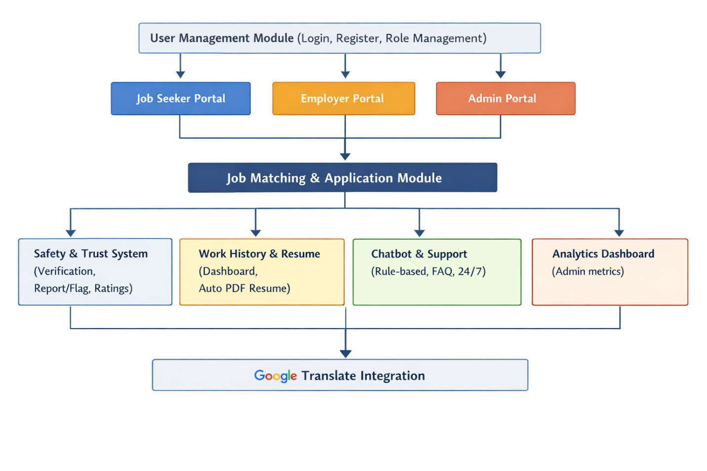

Figure 2: System Module Diagram

### 1.2.2.2 Complete Features List

EasyEarn has functionalities classified into two categories. Core Features are fundamental functionalities that must be fully completed to achieve the project objectives. Optional Features enhance the user experience and will be implemented subject to available time and resources.

Core Features:

These are the fundamental characteristics of the EasyEarn platform that must be completed during system development.

Table 1: Core Features

| No | Features | Description |
| --- | --- | --- |
| 1 | User Registration &amp; Login | Role-based Job Seeker, Employer, and Admin registration and login. |
| 2 | Job Posting &amp; Application | Jobs are posted by employers, applications are submitted by job seekers, and application management is handled within the platform. |
| 3 | Job Category &amp; Filter | Filter jobs by category, such as F&amp;B, Event, Delivery, and Tutor. |
| 4 | Location Filter | Filter jobs by city or region across Malaysia. |
| 5 | Application Status Timeline | Visual tracker showing Pending, Reviewed, Accepted, and Rejected stages. |
| 6 | Employer Verification Badge | Verified employers display a trust badge on their profile. |
| 7 | Report/ Flag System | Users may report suspicious employers, non-paying hirers, or fraudulent listings to Admin. |
| 8 | Rating &amp; Review System | Bidirectional 1–5 star ratings and written reviews between job seekers and employers. |
| 9 | Work History Dashboard | Tracks completed jobs, total earnings, and job type distribution. |
| 10 | Auto-Generate Resume | Automatically generates a downloadable PDF resume from work history data. |
| 11 | Google Translate Integration | Redirects users to Google Translate to access the platform in multiple languages. |
| 12 | Rule-Based Chatbot | 24/7 chatbot providing automated support, FAQ responses, and guidance on job applications and platform features. |

Optional Features

The following features will be introduced, subject to available time and resources. Their absence will not affect the core functionality of the platform.

Table 2: Optional Features

| No | Features | Description |
| --- | --- | --- |
| 1 | Quick Apply | One-click application using saved profile information. |
| 2 | Saved Jobs/ Wishlist | Job seekers can save interesting jobs to review later. |
| 3 | Job Expiry Date | Job listings automatically close after the set expiry date. |
| 4 | Skills Tag | Job seekers tag their skills on their profile. |
| 5 | Profile Completeness | Progress bar indicating the completeness of the user profile. |
| 6 | Analytics Dashboard | Job seeker earnings charts; employer recruitment stats; admin platform metrics. |
| 7 | Payment Confirmation &amp; Dispute | Employers confirm payment in-system; job seekers can upload DuitNow evidence and raise disputes for non-payment. |

### 1.2.2.3 Excluded Features

The current project phase does not include the following features due to time, resource, and technical constraints:

- Online payment gateway

Financial transactions are conducted offline through conventional methods such as cash and DuitNow transfer. Job seekers are advised to provide their DuitNow QR code for payment. The platform will not be integrated with payment processors such as the DuitNow API, Touch 'n Go, or credit card systems in this phase.

- Real-Time Chat Messaging

Direct real-time messaging is not included in this phase. Live chat requires both parties to be simultaneously online, which is not practical for a part-time employment platform where users have varying and unpredictable availability. A rule-based chatbot is deployed instead to provide 24/7 automated assistance without requiring another user to be present.

- Native Mobile Application

EasyEarn is developed as a web-based application. A native mobile application is not within the scope of the current project. The platform will instead adopt responsive web design to ensure accessibility via mobile browsers.

- Email Verification

Automated email verification is not implemented in this phase. User trust is established through the Employer Verification Badge and the Rating and Review System.

- Government Database Integration

The platform will not directly integrate with government databases such as SOCSO, EPF, or MySejahtera in this phase. Users will instead be provided with informational links to PERKESO's Self-Employment Social Security Scheme (SESS) for reference.

- AI Job Matching Algorithm

Automated AI-based job recommendation is excluded from this phase due to technical complexity beyond the current project scope.

- Push Notifications

Real-time push notifications are not implemented. Users may monitor their application status directly through the platform dashboard.

### 1.2.2.4 Information Security and Policies

#### 1.2.2.4.1 Regulatory Framework

As EasyEarn handles the personal data of job seekers and employers, the platform is developed in compliance with the following Malaysian regulatory frameworks:

- Personal Data Protection Act (PDPA) 2010

PDPA 2010 is the primary legislation governing the processing of personal data in Malaysia. In accordance with the Security Principle, reasonable measures are taken to prevent personal data from being lost, misused, modified, or accessed without authorisation. All personal data, including names, contact details, and work history, is securely stored in the Supabase PostgreSQL database. Users are informed of the purpose of data collection upon registration, and no data is shared with third parties without their consent.

- Computer Crimes Act 1997

This legislation governs unauthorised access to computer systems and information. The platform enforces role-based access control and Supabase Authentication to prevent unauthorised access to user data and system resources. All data transmission is conducted over HTTPS.

- Consumer Protection Act 1999

The Report and Flag System and Employer Verification Badge protect users against fraudulent job listings and non-paying employers, providing a form of consumer protection within the platform.

- Employment Act 1955 (Reference Only)

The platform provides informational guidelines aligned with the Employment Act to promote fair job posting practices and clarify user responsibilities. Direct compliance enforcement is outside the scope of this project, as EasyEarn is an academic prototype.

#### 1.2.2.4.2 Technical Security Measures

The following technical security controls are implemented to protect user data and maintain platform integrity:

- Supabase Authentication

All user accounts are managed through Supabase Authentication, which provides secure password hashing and session management. Token-based authentication is used to prevent unauthorised access to user accounts.

- Role-Based Access Control (RBAC)

Access to system functions and data is restricted based on user roles. Job seekers can only access their own profiles and job listings. Employers can only manage their own job postings. Administrators have full platform management access. This prevents cross-role data breaches.

- HTTPS Encryption

All communication between users and the Supabase backend is transmitted over HTTPS, ensuring that data exchanged between the client and server is encrypted and protected from interception.

- Supabase Row Level Security (RLS)

Row-level security policies are configured in Supabase to ensure that users can only read and write data they are authorised to access, providing an additional layer of protection at the database level.

# 1.3 Benefits and Significance

The development of EasyEarn is expected to deliver meaningful, measurable benefits across multiple stakeholder groups, including job seekers, employers, and Malaysian society at large. Beyond its immediate functional utility as a job-matching platform, EasyEarn carries broader significance from academic, technological, and socioeconomic perspectives. The following sections discuss these dimensions in detail.

## 1.3.1 Benefits

Benefits to Job Seekers

EasyEarn provides job seekers in underserved regions of Malaysia with a safe and structured channel to discover and apply for short-term, part-time, and freelance opportunities, eliminating the risks associated with unregulated social media job hunting. Research by Pillai and Paul (2023) indicates that dedicated gig platforms can reduce job-search time by up to 40 per cent compared with informal channels, translating directly into greater economic productivity for users such as university students, housewives, and unemployed individuals.

The platform's Work History Dashboard and Auto-Generate Resume feature further address a persistent structural gap identified by Graham et al. (2017), who noted that the inability to build a portable and verifiable professional identity remains one of the greatest challenges for platform workers in emerging economies. Additionally, the integration of Google Translate ensures that language barriers do not exclude non-English-speaking users, particularly those in smaller towns where existing English-only platforms have historically underserved a substantial portion of the workforce (UNCDF, 2019).

Benefits to Employers

For employers, particularly SMEs and individual hirers in smaller towns, EasyEarn provides a centralised environment for posting listings, reviewing verified applicant profiles, and managing the full recruitment cycle within a single system. Kalai Vani and Foo (2024) noted that small businesses in Malaysia incur significant time and financial costs due to the absence of a dedicated short-term job-posting platform, a gap that EasyEarn directly addresses. The Employer Verification Badge further builds applicant confidence and contributes to a higher-quality hiring environment, consistent with OECD (2019) findings that structured digital recruitment tools reduce hiring costs and improve job match quality for SMEs in developing markets.

Benefits to Society and the Economy

At the societal level, EasyEarn promotes geographic economic inclusion by extending organised gig economy access to towns such as Ipoh, Kangar, and Kota Bharu, regions that MDEC (2023) identified as significantly underrepresented in Malaysia's digital gig workforce. The platform also directly addresses the growing threat of employment fraud, with MCMC (2023) reporting a 34 per cent increase in social media job scams in 2022, disproportionately affecting younger and less experienced job seekers. By providing a structured, accountable alternative, EasyEarn contributes to a safer and more equitable digital employment environment in Malaysia.

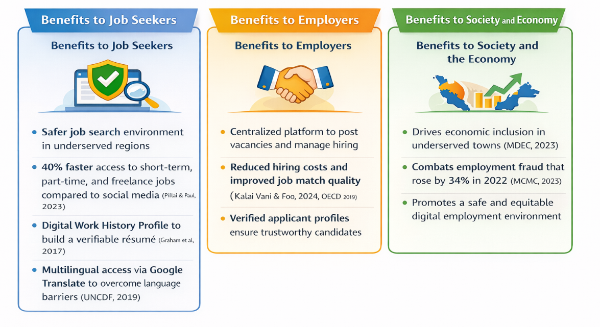

Figure 3: Benefits

## 1.3.2 Significance

Academic Significance

EasyEarn contributes to the growing body of academic literature on digital labour platforms in developing economies, with a specific focus on the Malaysian gig economy context. While existing studies have examined gig work from the perspectives of labour rights, platform governance, and economic inequality (Graham et al., 2017; Abd Samad et al., 2023), relatively few have proposed and implemented a localised, technology-driven solution tailored to the unique demographic and geographic challenges faced by Malaysian gig workers. EasyEarn addresses this gap by offering a working system that integrates identity verification, portable work history, and multilingual accessibility into a single platform, providing a concrete reference point for future research exploring the design and deployment of gig economy platforms in underserved emerging markets.

Furthermore, the development process of EasyEarn, guided by a Hybrid Agile-Waterfall methodology, contributes to academic discourse on adaptive software development frameworks for student-led information systems projects. The structured yet iterative approach adopted in this study demonstrates how academic projects can achieve both rigorous documentation standards and the flexibility to respond to evolving user requirements, offering a replicable methodological model for similar applied computing research.

Technological Significance

From a technological standpoint, EasyEarn serves as a practical proof of concept demonstrating how a client-side web application built on a Backend-as-a-Service (BaaS) architecture can deliver a feature-rich, multi-user platform without the complexity and infrastructure costs associated with traditional server-based systems. The system's integration of Supabase for database management and authentication, Chart.js for data visualisation, and jsPDF for dynamic document generation illustrates how open-source and cloud-native tools can be combined effectively to produce a scalable, maintainable, and cost-efficient solution (Supabase, 2023).

This architectural approach is particularly significant in the context of academic and early-stage commercial development, where budget constraints and limited access to dedicated server infrastructure are common limitations. EasyEarn demonstrates that a BaaS-driven architecture is not only technically viable but also capable of supporting complex multi-role workflows, real-time data operations, and secure user management, making it a valuable reference model for developers and researchers building similar platforms in resource-constrained environments.

Socioeconomic and Policy Significance

Beyond its direct stakeholder benefits, EasyEarn carries broader significance as a technology-driven response to structural socioeconomic challenges in Malaysia. The platform's focus on geographic underrepresentation, employment fraud, and digital exclusion aligns directly with national policy priorities articulated in Malaysia's Digital Economy Blueprint and the Twelfth Malaysia Plan, both of which emphasise the importance of inclusive digital participation and equitable economic development across all regions of the country (MDEC, 2023).

By demonstrating that a locally designed gig economy platform can meaningfully address the needs of underserved communities, EasyEarn provides policymakers and industry stakeholders with evidence that targeted, community-oriented digital platforms can serve as effective instruments of social and economic inclusion. This positions EasyEarn not merely as an academic exercise, but as a scalable model that, with further development, could inform public-private partnerships aimed at expanding gig economy participation beyond Malaysia's urban centres.

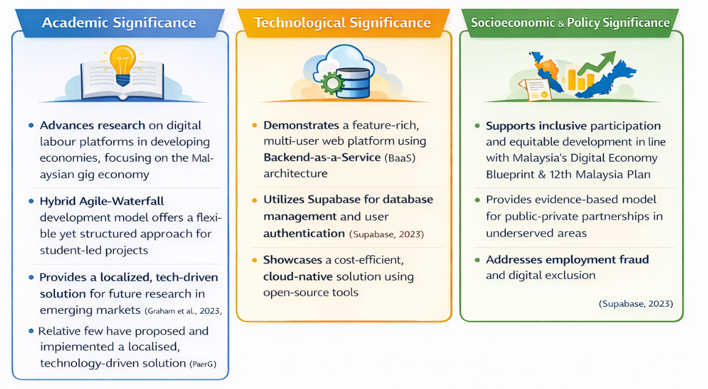

Figure 4: Significance

# 1.4 Milestone and Deliverable

The EasyEarn project spans 24 weeks across two academic semesters, from 20 April 2026 to 8 October 2026, and is structured using a Hybrid Agile-Waterfall development methodology. The project is divided into two phases: FYP 1 (Weeks 1 to 8), which focuses on planning, design, and prototype development; and FYP 2 (Weeks 9 to 24), which encompasses six Agile development sprints, system testing, deployment, and final submission. Each phase is associated with clearly defined milestones and deliverables that serve as checkpoints for measuring progress and ensuring alignment with both academic requirements and project objectives.

## 1.4.1 Work Breakdown Structure (WBS)

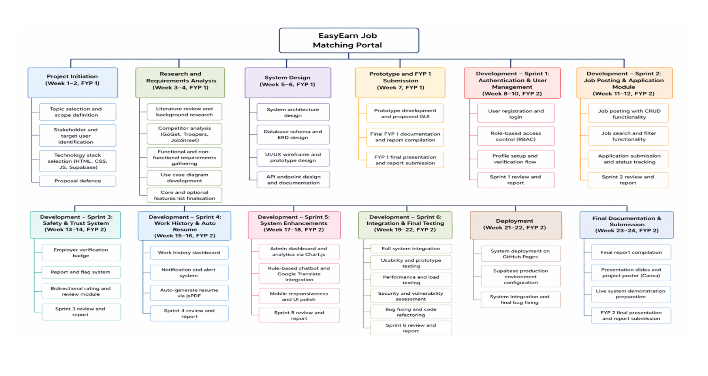

Figure 5: Work Breakdown Structure

Figure 6 illustrates the Work Breakdown Structure (WBS) of the EasyEarn Job Matching Portal. The WBS decomposes the entire project into 12 phases spanning 24 weeks across FYP 1 and FYP 2. Each phase contains specific tasks and deliverables, ranging from Project Initiation and System Design in FYP 1, to six Agile development sprints, deployment, and final documentation in FYP 2. The WBS serves as a visual reference for task allocation, timeline management, and project scope control

## 1.4.2 Project Schedule

The EasyEarn project spans 24 weeks across two semesters, from 20 April 2026 to 8 October 2026, for a total of 124 days. The project is structured under a Hybrid Agile-Waterfall methodology, divided into FYP 1 covering the planning and design phase, and FYP 2 covering the full development, testing, deployment, and final submission phase.

Table 3: Project Schedule

| Phase | Week | Description |
| --- | --- | --- |
| FYP 1: Project Foundation(20 Apr to 15 Jun 2026) | Week 1 | Topic Selection and Team Formation (20 Apr to 24 Apr 2026). |
|  | Week 2 | Project Preparation (27 Apr to 1 May 2026). Literature Review and Background Research followed by Competitor Analysis (4 May to 7 May 2026). |
|  | Week 3 | Proposal Defence is conducted on 8 May 2026. |
|  | Week 4 | Requirement Gathering and Project Planning (14 May to 19 May 2026). Use Case Diagram development commences on 20 May 2026. FYP 1 Midsem Checkpoint is conducted on 2 June 2026. |
|  | Week 5 to 6 | System Architecture Design (20 May to 25 May 2026), Database Schema Design (26 May to 29 May 2026), UI/UX Wireframe Design (26 May to 28 May 2026), and API Endpoint Design and Documentation (29 May to 1 Jun 2026). |
|  | Week 7 | Prototype Development and Proposed GUI (3 Jun to 9 Jun 2026). Final Documentation and Presentation Preparation (10 Jun to 12 Jun 2026). FYP 1 Final Presentation and Report Submission is conducted on 15 June 2026. |
| FYP 2: Sprint 1 and 2(16 Jun to 17 Jul 2026) | Week 8 to 9 | Sprint 1: Authentication and User Management (16 Jun to 24 Jun 2026). |
|  | Week 10 | User Registration and Login (25 Jun to 29 Jun 2026), Role-Based Access Control (30 Jun to 1 Jul 2026), and Profile Setup and Verification Flow (2 Jul to 3 Jul 2026). |
|  | Week 11 to 12 | Sprint 2: Job Posting and Application Module (6 Jul to 14 Jul 2026). |
|  | Week 12 | Job Search and Filter Functionality (15 Jul to 17 Jul 2026). |
| FYP 2: Sprint 3 and 4(20 Jul to 18 Aug 2026 | Week 13 to 14 | Sprint 3: Safety and Trust System (20 Jul to 28 Jul 2026). Rating and Review Module (29 Jul to 30 Jul 2026). |
|  | Week 15 to 16 | Sprint 4: Work History and Auto Resume (31 Jul to 10 Aug 2026). |
|  | Week 17 | Notification and Alert System (11 Aug to 12 Aug 2026) and In-App Messaging and Chat Module (13 Aug to 17 Aug 2026). |
|  | Week 17 | FYP 2 Midsem Checkpoint is conducted on 18 August 2026. |
| FYP 2: Sprint 5 and 6(19 Aug to 9 Sep 2026) | Week 18 | Sprint 5: System Enhancements (19 Aug to 25 Aug 2026). Admin Dashboard and Analytics (26 Aug to 27 Aug 2026). Mobile Responsiveness and UI Polish (28 Aug to 31 Aug 2026). |
|  | Week 18 to 19 | Sprint 6: Integration and Final Testing (26 Aug to 1 Sep 2026). |
|  | Week 19 to 20 | Prototype Testing and Usability Testing (2 Sep to 3 Sep 2026), Performance and Load Testing (4 Sep 2026), and Security and Vulnerability Assessment (7 Sep 2026). |
|  | Week 20 | Bug Fixing and Code Refactoring (8 Sep to 9 Sep 2026). |
| FYP 2: Final Phase(10 Sep to 8 Oct 2026) | Week 21 | System Deployment (10 Sep to 16 Sep 2026). |
|  | Week 22 | System Integration (17 Sep to 21 Sep 2026) and System Testing and Bug Fixing (22 Sep to 24 Sep 2026). |
|  | Week 23 | Final Documentation and Report Compilation (25 Sep to 30 Sep 2026). |
|  | Week 24 | Final Documentation and Presentation Preparation (1 Oct to 2 Oct 2026). |
|  | Week 24 | FYP 2 Final Presentation and Report Submission (5 Oct to 7 Oct 2026). Final Submission and Presentation are due on 8 October 2026. |

## 1.4.3 Gantt Chart

The Gantt Chart for the EasyEarn project is presented across four figures, collectively covering the full 24-week project timeline from 20 April 2026 to 8 October 2026. Each chart segment illustrates the scheduled tasks, durations, and sequential dependencies across FYP 1 planning and design phases, and FYP 2 Agile development sprints through to final system deployment and submission.

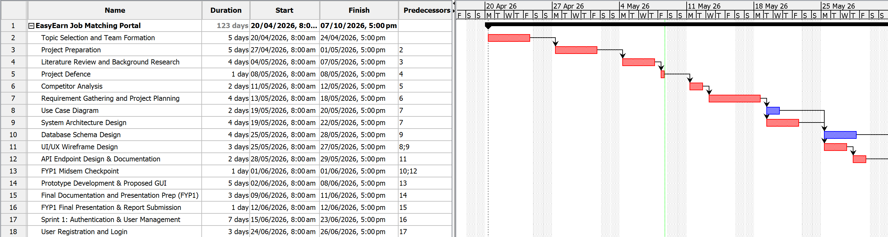

Figure 6: Gantt Chart (1)

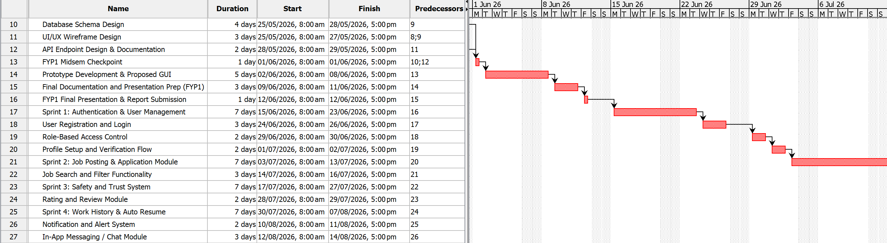

Figure 7: Gantt Chart (2)

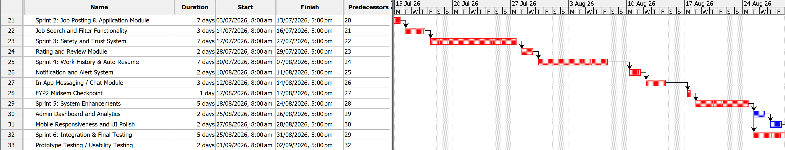

Figure 8: Gantt Chart (3)

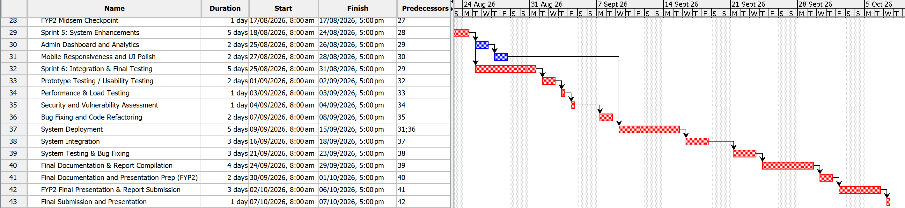

Figure 9: Gantt Chart (4)

## 1.4.4 Project Milestones

The EasyEarn project has five key academic milestones across FYP 1 and FYP 2, each representing a formal assessment or review point. In addition to these academic milestones, sprint completion reviews are conducted at the end of each FYP 2 development sprint to monitor progress and incorporate supervisor feedback. Table 1.3 presents the complete list of project milestones.

Table 4: Project Milestones

| No | Milestones | Timeline | Description |
| --- | --- | --- | --- |
| M1 | Proposal Defence | Week 3 (4 Apr – 8 May 2026) | Project proposal presented to the assessment panel for approval before proceeding to the design phase. |
| M2 | FYP1 Midsem Checkpoint | Week 4 (11 – 15 May 2026) | Progress on system design documentation, use case diagrams, wireframes, and ERD was presented to the panel. |
| M3 | FYP1 Final Presentation &amp; Report Submission | Week 7 (1 – 15 Jun 2026) | Submission of the FYP1 interim report and prototype demonstration, marking the end of the first semester. |
| M4 | FYP2 Midsem Checkpoint | Week 17 (17 – 21 Aug 2026) | Completed Sprints 1 to 4 demonstrated to the assessment panel, along with a development progress report. |
| M5 | FYP2 Final Presentation &amp; Report Submission | Week 23–24 (5 – 8 Oct 2026) | Final system presented to the assessment panel; all project deliverables formally submitted. |

In addition to the five formal academic milestones, sprint completion reviews are conducted at the end of each FYP 2 sprint to ensure development is progressing as planned and to incorporate supervisor feedback into subsequent sprints. Sprint 1 is reviewed at the end of Week 10, Sprint 2 at the end of Week 12, Sprint 3 at the end of Week 14, Sprint 4 at the end of Week 16, Sprint 5 at the end of Week 18, and Sprint 6 at the end of Week 22. System deployment on GitHub Pages is completed in Week 23, ahead of the FYP2 final submission in Week 24.

## 1.4.5 Sprint Breakdown and Deliverables

FYP 2 development is organised into six two-week Agile sprints (Weeks 9 to 22), each delivering a functional system module. The sprint structure ensures that core platform features are built and tested incrementally, allowing issues to be identified and resolved before subsequent modules are developed. Table 1.2 presents the sprint breakdown and associated deliverables for FYP 2.

Table 5: Sprint Breakdown and Deliverables

| Sprint | Timeline | Objective | Deliverable |
| --- | --- | --- | --- |
| Sprint 1: Authentication &amp; User Management | Week 9–10 (16–26 Jun 2026) | Authentication and User Management: user registration, login, role-based access control, and profile setup. | Functional user management module and sprint report. |
| Sprint 2: Job Posting &amp; Application Module | Week 11–12 (29 Jun–10 Jul 2026) | Job Posting and Application Module: job posting with CRUD, job search and filter, application submission and status tracking. | Functional job module and sprint report. |
| Sprint 3: Safety &amp; Trust System | Week 13–14 (13–24 Jul 2026) | Safety and Trust System: employer verification badge, report and flag system, and bidirectional rating and review module. | Functional safety module and sprint report. |
| Sprint 4: Work History &amp; Auto Resume | Week 15–16 (27 Jul–7 Aug 2026) | Work History and Auto Resume: work history dashboard, notification and alert system, and auto-generate resume via jsPDF. | Functional work history module and sprint report. |
| Sprint 5: System Enhancements | Week 17–18 (18–28 Aug 2026) | System Enhancements: admin dashboard and analytics via Chart.js, rule-based chatbot, and mobile responsiveness. | Functional admin module and sprint report. |
| Sprint 6: Integration &amp; Final Testing | Week 19–22 (1–25 Sep 2026) | Integration and Final Testing: full system integration, usability testing, performance and load testing, security assessment, and bug fixing. | Fully tested and integrated system; final sprint report. |

## 1.4.6 Final Deliverables

Upon project completion, the following final deliverables will be submitted as part of the EasyEarn academic assessment. Each deliverable corresponds to a specific phase of the development lifecycle and collectively demonstrates the full scope of the project. Table 1.3 presents the complete list of final project deliverables.

Table 6: Final Deliverables

| No | Deliverable | Description |
| --- | --- | --- |
| 1 | Web-Based Job Matching Portal | A fully operational EasyEarn portal deployed on GitHub Pages, incorporating all core features including user management, job matching, safety verification, work history, auto-generated resume, and Google Translate integration. |
| 2 | Auto-Generated PDF Resume | A system-generated, downloadable resume produced from the job seeker&#x27;s work history, ratings, and skills data using jsPDF. |
| 3 | Comprehensive Documentation | Full project documentation, including the proposal, system design diagrams, database schema, test reports, and user manuals. |
| 4 | Annotated Source Code | Formatted and commented HTML, CSS, and JavaScript codebase along with Supabase configuration files, organised for clarity and maintainability. |
| 5 | Testing and Evaluation Report | Detailed documentation covering functional testing, security assessment, usability evaluation, and system performance analysis. |
| 6 | Presentation Materials | Presentation slides, a project poster designed via Canva, and a live system demonstration prepared for the FYP2 academic assessment. |

The milestones, sprint deliverables, and final submissions outlined in this section collectively define the measurable outcomes of the EasyEarn project. Each milestone serves as a formal checkpoint to evaluate progress against the project objectives, while each sprint deliverable ensures that system development proceeds incrementally and systematically within the defined 24-week timeline. The completion of all deliverables listed in Table 1.3 is required for the project to be considered successfully delivered.EasyEarn adopts a client-server model underpinned by a Backend-as-a-Service (BaaS) architecture built on Supabase. The system consists of three major layers:

## 1.5 System Architecture Diagram

Presentation Layer (Frontend)

The frontend is developed using HTML, CSS, and JavaScript, providing responsive user interfaces across the three user roles. At this layer, Chart.js is utilised to visualise analytics and jsPDF is used to generate client-side PDF resumes (Marineau, 2023). The Supabase JavaScript Client Library is used to interact directly with the Supabase database and authentication services from the client-side (Supabase, 2023). A Google Translate widget is embedded in the navigation bar to provide multilingual support for users across different regions of Malaysia.

Data Layer (Supabase Backend)

Supabase PostgreSQL serves as the primary relational database, providing structured and reliable data storage with real-time synchronisation capabilities across all connected clients (Supabase, 2023). Supabase Authentication handles user identity verification and session management, supporting secure role-based access for job seekers, employers, and administrators (Supabase, 2023). This Backend-as-a-Service model eliminates the need for an independent application server, reducing development complexity while ensuring scalability, security, and reliability suitable for a multi-user job-matching platform.

Business Logic Layer (Client-Side Modules)

The business logic is implemented as client-side JavaScript modules that sit between the Presentation Layer and the Data Layer. This layer handles all core application logic, including CRUD operation management, role-based access control enforcement, form validation, and application status transitions. It also manages the generation of downloadable PDF resumes via jsPDF and renders interactive analytics charts through Chart.js (Marineau, 2023). The system is deployed and hosted via GitHub Pages, providing a straightforward and cost-free static site hosting solution (GitHub, 2023). By keeping this logic modular and separated from the UI, the system remains maintainable and easier to test across development sprints.

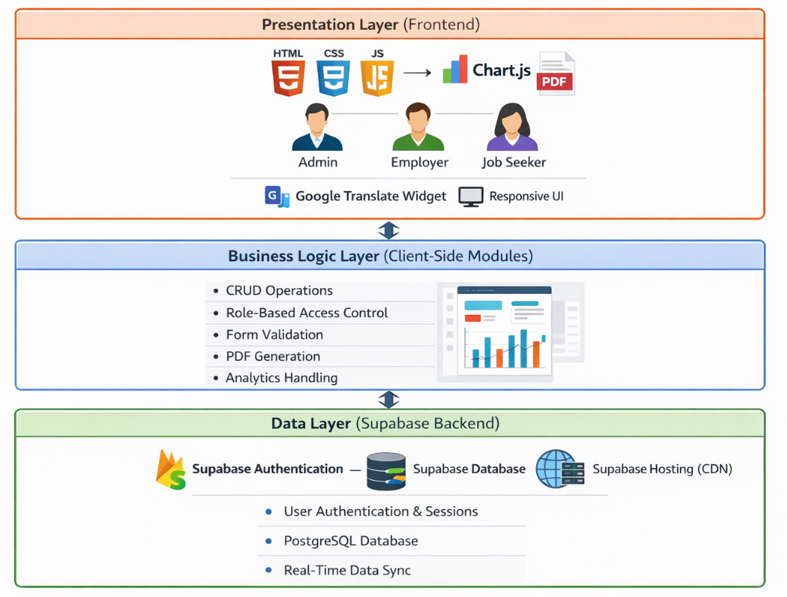

Figure 10: System Architecture Diagram

# 1.6 System Modules and Functionalities

EasyEarn is structured around seven core system modules, each designed to address a specific aspect of the job-matching process. Together, these modules form a cohesive, multi-user platform that serves three distinct user roles: Job Seeker, Employer, and Administrator.

User Management Module

The User Management Module serves as the entry point of the EasyEarn platform, handling user registration, login, and role-based access control for all three user types. Upon successful authentication via Supabase Authentication, users are automatically directed to their respective dashboards based on their assigned role. Each user profile stores essential information including name, contact details, location, and role-specific data such as skill tags for job seekers and company information for employers. Role-Based Access Control (RBAC) is enforced at both the client-side module level and the database level through Supabase Row Level Security (RLS) policies, ensuring that users can only access data and functions relevant to their role (Supabase, 2023).

Job Posting and Application Module

The Job Posting and Application Module forms the operational core of EasyEarn. Employers can create, edit, and delete job listings with details including job category, location, salary range, job description, and expiry date. Job seekers can browse all active listings, apply category and location filters to narrow their search, and submit applications directly through the platform. Each application is tracked through a visual Application Status Timeline displaying four stages: Pending, Reviewed, Accepted, and Rejected, providing job seekers with real-time visibility into their application progress. Employers can review all incoming applications, update applicant status, and manage the full recruitment cycle from a single dashboard. All job and application data is stored and retrieved from Supabase PostgreSQL, with full CRUD capabilities implemented through the Supabase JavaScript Client Library (Supabase, 2023).

Safety and Trust Module

The Safety and Trust Module addresses the problem of employment fraud and low-trust hiring environments identified in Section 1.2. It comprises three interconnected mechanisms. First, the Employer Verification Badge is awarded to employers who have submitted valid business information and been approved by the Administrator, visibly distinguishing trusted hirers from unverified accounts. Second, the Report and Flag System allows any user to report suspicious job listings, non-paying employers, or fraudulent accounts directly to the Administrator for review and action. Third, the bidirectional Rating and Review System enables both job seekers and employers to rate each other upon job completion on a one-to-five-star scale, accompanied by written reviews. These ratings are publicly visible on user profiles, creating a community-driven accountability mechanism that promotes transparent and credible hiring practices (MCMC, 2023).

Work History and Resume Module

The Work History and Resume Module enables job seekers to build and maintain a verifiable digital employment record within the platform. Completed jobs are automatically logged to the job seeker's Work History Dashboard, which displays key metrics including total jobs completed, cumulative earnings, and job type distribution visualised through Chart.js charts. This addresses the structural gap identified by Graham et al. (2017), whereby gig workers in emerging economies lack a portable and credible professional identity. The Auto-Generate Resume feature allows job seekers to produce a downloadable PDF resume directly from their work history data, skill tags, and platform ratings using the jsPDF library (Marineau, 2023). This resume serves as a professional employment record that can be used for future job applications both within and outside the platform.

Chatbot and Support Module

The Chatbot and Support Module provides 24/7 automated assistance to all platform users through a rule-based chatbot embedded within the EasyEarn interface. The chatbot is designed to handle frequently asked questions, guide users through the job application process, explain platform features, and direct users to the appropriate sections of the platform. Unlike AI-driven chatbots, the rule-based approach ensures consistent and predictable responses without requiring additional API costs or machine learning infrastructure, making it appropriate for the academic project context (Sommerville, 2016). All chatbot interaction logs are stored in Supabase and are accessible to the Administrator for ongoing review and improvement of chatbot response accuracy.

Admin and Analytics Module

The Admin and Analytics Module grants administrators full oversight and control of the EasyEarn platform through a dedicated Admin Dashboard. Administrative functions include user account management, job listing moderation, resolution of reported flags, and the issuance or revocation of Employer Verification Badges. The dashboard also provides platform-wide analytics powered by Chart.js, presenting metrics such as total registered users, active job listings, total applications submitted, and successful job matches. These analytics enable the Administrator to monitor platform health, identify emerging issues, and make data-informed decisions regarding platform moderation and development priorities (Supabase, 2023).

Google Translate Integration

To address the language barrier identified in Section 1.2, EasyEarn incorporates multilingual accessibility through Google Translate website redirection. A clearly labelled Google Translate link is embedded in the navigation bar of the platform, allowing users to redirect the entire platform interface to Google Translate and access content in Bahasa Malaysia, Mandarin, Tamil, and other supported languages. While this approach does not deliver native in-app translation, it provides a cost-effective and functional multilingual solution within the constraints of the academic project budget and timeline. As UNCDF (2019) emphasised, language inclusivity is a fundamental requirement for equitable access to digital employment platforms in Southeast Asia, and this integration ensures that non-English-speaking users in smaller Malaysian towns are not excluded from the platform.

# 1.7 Literature Review

This section reviews the relevant technologies, selected tools and platforms, and similar systems that informed the design and development of EasyEarn.

## 1.7.1 Review on Relevant Technologies

The core front-end technologies used in EasyEarn, namely HTML, CSS, and JavaScript, remain the foundational standard for web application development. According to MDN Web Docs (2023), HTML5 and CSS3 together provide the structural and presentational basis for modern responsive web interfaces, while vanilla JavaScript enables dynamic, client-side interactivity without the overhead of a framework.

This combination is well-suited for a lightweight, academic-scope project that prioritises maintainability, accessibility, and fast loading speeds. Unlike heavier frameworks such as React or Angular, vanilla JavaScript reduces dependency complexity and allows for greater transparency in code structure, which is particularly appropriate for a system developed within an academic context.

Chart.js is an open-source JavaScript charting library that renders interactive, responsive data visualisations within the browser. Chartjs.org (2023) describes it as suitable for real-time dashboard rendering with minimal configuration. Its lightweight nature and straightforward integration with plain JavaScript make it an appropriate choice for EasyEarn's analytics and work history dashboard, where clarity and performance are prioritised over complex data manipulation.

The jsPDF library enables client-side PDF generation directly in the browser without server involvement, and is widely adopted for lightweight document generation in web applications (jsPDF, 2023). For EasyEarn's auto-generated resume feature, jsPDF provides a practical and dependency-free solution that operates entirely on the client side, reducing server load and simplifying deployment.

## 1.7.2 Review of Selected Tools and Platforms

Supabase is an open-source Backend-as-a-Service (BaaS) platform built on PostgreSQL, offering authentication, a relational database, and row-level security (RLS) policies. Compared to Firebase, which uses a NoSQL document model, Supabase's relational structure is better suited to EasyEarn's data model, where job listings, applications, ratings, and user profiles have defined relational dependencies. Supabase (2024) highlights that RLS policies provide fine-grained, table-level access control, which is directly applicable to EasyEarn's role-based data security requirements.

Furthermore, Supabase's use of standard SQL makes it more accessible for academic development, as queries and schema design follow widely taught conventions rather than platform-specific syntax.

GitHub Pages is a static site hosting service that deploys files directly from a GitHub repository via HTTPS. Unlike Firebase Hosting, which requires project-level configuration and may involve billing setup beyond its free tier, GitHub Pages offers zero-cost deployment with no external service dependency beyond the repository itself (GitHub, 2024). For a static front-end application consuming a Supabase backend via API calls, GitHub Pages provides a practical, cost-effective, and low-maintenance hosting solution that aligns with the scope and budget constraints of an academic project.

## 1.7.3 Review of Similar Systems

A review of existing platforms reveals a clear gap that EasyEarn aims to address. JobStreet and RiceBowl are among the most established job portals in Malaysia; however, both platforms are primarily designed for full-time and contract employment. Their workflows are structured around formal hiring processes, making them unsuitable for workers seeking flexible or short-term income opportunities such as students, homemakers, and rural residents.

GoGet and Troopers operate closer to the task-based model that EasyEarn targets, but both remain geographically concentrated in major urban centres such as Kuala Lumpur, Penang, and Johor Bahru (GoGet, 2024; Troopers, 2024). This urban-centric approach excludes workers and employers in smaller towns and semi-rural areas, where accessible gig work platforms are arguably most needed.

Beyond geographic limitations, several unmet user needs are identified across existing platforms:

- Job seekers have no means of building a verifiable work history, making it difficult to establish credibility with new employers.

- Employers lack transparent, bidirectional rating systems to evaluate candidate reliability before hiring.

- Both groups face language barriers, as most platforms operate primarily in English, limiting accessibility for users more comfortable in Bahasa Malaysia, Mandarin, or Tamil.

Table 7: Feature Comparison of Existing Platforms and EasyEarn

| Features | JobStreet | RiceBowl | GoGet | Troopers | EasyEarn |
| --- | --- | --- | --- | --- | --- |
| Short-term / Gig Work Support | ✗ | ✗ | ✓ | ✓ | ✓ |
| Geographic Coverage (Beyond Major Cities) | Partial | Partial | ✗ | ✗ | ✓ |
| Verifiable Work History Profile | ✗ | ✗ | ✗ | ✗ | ✓ |
| Auto-generated Resume | ✗ | ✗ | ✗ | ✗ | ✓ |
| Bidirectional Rating &amp; Review System | ✗ | ✗ | Partial | Partial | ✓ |
| Multilingual Support | Partial | Partial | ✗ | ✗ | ✓ |
| Trust Verification System | ✗ | ✗ | ✗ | ✗ | ✓ |

As shown in Table 6, none of the reviewed platforms offers a comprehensive solution for the Malaysian gig economy. EasyEarn addresses these gaps by combining short-term work support with geographic inclusivity, multilingual accessibility, a structured trust verification system, and a verifiable work history profile that supports users' long-term employability.

# 1.8 Methodology

EasyEarn is developed using a Hybrid Agile-Waterfall methodology, combining the structured planning of Waterfall with the iterative flexibility of Agile. The Waterfall component governs the planning and design phases (FYP 1, Weeks 1 to 8), ensuring that system requirements, database schema, and architecture are formally documented before development begins. This satisfies the academic deliverables of the FYP framework, including proposal defence, midsem checkpoint, and final report submission.

The Agile component drives the six two-week development sprints in FYP 2 (Weeks 9 to 22), where each sprint delivers a functional system module, progressing from user authentication and job posting through to safety verification, work history, system enhancements, and final integration testing. Sprint reviews are conducted with the supervisor at the end of each sprint to incorporate feedback into subsequent development cycles.

This hybrid approach was chosen because the fixed 24-week academic timeline requires structured milestones, while the multi-module nature of EasyEarn benefits from incremental delivery and continuous testing. Deployment on GitHub Pages is completed in Week 23, followed by final documentation and FYP 2 submission in Week 24.

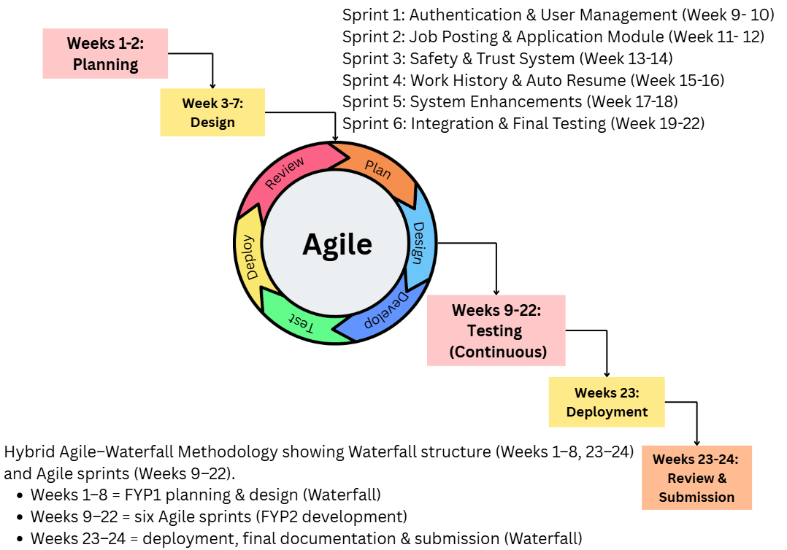

Figure 11: Hybrid Agile-Waterfall Methodology Diagram

# 1.9 Constraint and Limitation

EasyEarn operates within constraints imposed by the academic framework, project timeline, and technology stack, as well as recognised system limitations that may be addressed in future phases.

## 1.9.1 Project Constraints

Time Constraint

The project must be completed within a fixed 24-week timeline across FYP 1 (Weeks 1–8, 20 April – 12 June 2026) and FYP 2 (Weeks 9–24, 15 June – 8 October 2026). A Hybrid Agile-Waterfall methodology is adopted to manage this constraint. Features that cannot be completed within allocated sprints are deferred or excluded from the current phase (Sommerville, 2016).

Resource Constraint

EasyEarn is developed solely by one student, without a dedicated team, QA personnel, or enterprise infrastructure. This limits the volume of features, depth of testing, and level of optimisation achievable. Careful prioritisation of core functionalities is therefore essential to deliver a functional and testable system (Pressman & Maxim, 2020).

Technology Constraint

The platform is built using HTML, CSS, JavaScript, Supabase as the Backend-as-a-Service (BaaS) provider and deployed via GitHub Pages. This stack was selected for its accessibility and zero licensing cost. However, GitHub Pages supports only static content, meaning all business logic must be handled client-side or through Supabase Edge Functions. Additionally, the system is subject to Supabase's free-tier resource limits, including database size, storage, and monthly active users, which may become restrictive beyond the academic prototype stage (Supabase, 2024).

Regulatory Constraint

EasyEarn handles personal data and must be designed with awareness of Malaysia's Personal Data Protection Act (PDPA) 2010, the Computer Crimes Act 1997, and the Consumer Protection Act 1999. Supabase provides row-level security (RLS) policies and HTTPS-enforced data transmission, while Role-Based Access Control (RBAC) restricts unauthorised access. A formal compliance audit would be required before any production deployment (Personal Data Protection Act, 2010).

In summary, EasyEarn operates within four key project constraints: a fixed 24-week academic timeline, a solo developer resource constraint, a client-side technology stack dependent on Supabase and GitHub Pages, and compliance obligations under Malaysia's PDPA 2010. These constraints collectively define the boundaries of development scope, testing depth, and deployment readiness for the current phase of the project. Each constraint has been acknowledged and managed through deliberate design decisions, including phased feature delivery, careful prioritisation of core functionalities, and the adoption of a Hybrid Agile-Waterfall methodology.

Table 8: Summary of Constraints

| Type | Issues | Impact | Future Recommendation |
| --- | --- | --- | --- |
| Constraint | 24-week fixed academic timeline | Limits feature volume and testing depth | Adopt phased development for post-FYP enhancements |
| Constraint | Solo developer resource constraint | Limits parallel development and QA coverage | Form a small team for Phase 2 development |
| Constraint | Client-side only technology stack (Supabase + GitHub Pages) | Restricts server-side processing and scalability | Introduce Supabase Edge Functions or a dedicated backend in Phase 2 |
| Constraint | PDPA 2010 regulatory compliance | Formal audit required before public deployment | Conduct a formal PDPA compliance audit pre-launch |

## 1.9.2 System Limitations

No Integrated Payment Gateway

Financial transactions between users are conducted offline via cash or DuitNow transfers. Integration of payment processors such as the DuitNow API or Touch'n Go eWallet is excluded due to regulatory and cost considerations. Future phases should incorporate a regulated payment gateway (Bank Negara Malaysia, 2022).

No Real-Time Direct Messaging

Direct messaging between users is not supported. A rule-based chatbot provides 24/7 automated assistance instead. Real-time messaging via Supabase Realtime or a third-party API such as Stream Chat is recommended for future development (Supabase, 2024).

No Native Mobile Application

EasyEarn is a responsive web application only. Responsive design ensures basic mobile browser usability, but a native iOS or Android app which offering push notifications, offline access, and faster performance is recommended for Phase 2 (Apple Developer Program, 2023; Google Play Console, 2023).

Limited User Acceptance Testing

Formal UAT with real end users is not feasible within the FYP 2 timeline. Evaluation relies on functional, security, and performance testing using simulated data. Future phases should incorporate structured UAT with representative users from the target demographic (Nielsen, 1993).

No Automated Identity Verification

User credibility relies on self-declaration, the Employer Verification Badge, and the Report and Flag System. Integration with government databases such as MyKad or EPF is excluded from the current scope. A production-ready system should incorporate formal identity verification services (Department of Statistics Malaysia, 2023).

Multilingual Support via Redirection

Multilingual access is achieved through Google Translate website redirection rather than a native in-app translation API. While functional, this approach is less seamless than a full Google Cloud Translation API integration. Upgrading to native translation is recommended for future phases (Google Cloud, 2023).

In summary, EasyEarn's current system carries six key limitations: the absence of an integrated payment gateway, no real-time direct messaging, no native mobile application, limited user acceptance testing, no automated identity verification, and multilingual support provided through redirection rather than a native translation API. These limitations arise from the constraints of the academic scope, budget, and timeline, and are not indicative of fundamental design flaws. Each limitation has been identified alongside a concrete future recommendation, forming a clear development roadmap for Phase 2 of the EasyEarn platform.

Table 9: Summary of Limitations

| Type | Issues | Impact | Future Recommendation |
| --- | --- | --- | --- |
| Limitation | No integrated payment gateway | Payment disputes are unresolvable within the platform | Integrate DuitNow API or a regulated payment processor |
| Limitation | No real-time direct messaging | Reduces communication flexibility between users | Implement Supabase Realtime or Stream Chat API |
| Limitation | No native mobile application | Less optimised mobile user experience | Develop iOS/Android app in Phase 2 |
| Limitation | Limited User Acceptance Testing | Real-user usability issues may remain unidentified | Conduct structured UAT with representative users |
| Limitation | No automated identity verification | Employer badge relies on self-declaration only | Integrate a government API or identity verification service |
| Limitation | Multilingual support via redirection only | Less seamless multilingual user experience | Upgrade to Google Cloud Translation API in Phase 2 |

# 1.10 Conclusion

This chapter has established the context, rationale, and direction for EasyEarn, a web-based job matching portal designed for job seekers and employers in underserved regions of Malaysia. As discussed in Section 1.0, own-account workers in Malaysia surpassed 3.09 million in 2024, representing approximately 25.1 per cent of the national workforce, yet access to organised gig platforms remains concentrated in major urban centres, leaving smaller towns such as Ipoh, Kangar, and Kota Bharu underserved (Department of Statistics Malaysia, 2024; MDEC, 2023).

Section 1.1 identified six interconnected problems underpinning this gap, including the lack of a specialised short-term labour platform in smaller towns, the rise of social media job scams by 34 per cent in 2022, the absence of verifiable work histories for gig workers, inefficient SME recruitment, limited targeting of flexible worker demographics, and English-only platform interfaces (MCMC, 2023; UNCDF, 2019).

In response, Section 1.2 defined four measurable objectives: developing a multi-user portal with role-based access control; implementing a Safety and Trust Verification System; creating a Work History Profile with auto-generated PDF resume; and integrating multilingual accessibility via Google Translate. The system is developed using HTML, CSS, JavaScript, and Supabase, deployed via GitHub Pages, within a 24-week Hybrid Agile-Waterfall framework.

Section 1.3 affirmed the platform's significance for job seekers, employers, and Malaysian society broadly, particularly in promoting economic inclusion and reducing employment fraud. Sections 1.4 and 1.5 outlined the project milestones, constraints, and system limitations, each paired with a future development recommendation, establishing a clear roadmap for EasyEarn's continued evolution beyond this Final Year Project.

# 1.11 References

Abd Samad, N., Siti Nurazira, M. D., & Zainudin, A. (2023). Motivational factors of gig economy participation among Malaysian youth. Asian Journal of Economics and Business, 4(2), 45-58.

Apple Developer Program. (2023). App Store review guidelines. Apple Inc. https://developer.apple.com/app-store/review/guidelines/

Bank Negara Malaysia. (2022). Financial technology enabler group: Payment systems policy. Bank Negara Malaysia. https://www.bnm.gov.my

Department of Statistics Malaysia. (2023). Labour force survey report Malaysia 2023. Department of Statistics Malaysia. https://www.dosm.gov.my

Department of Statistics Malaysia. (2024). Labour force survey report: Third quarter 2024. Department of Statistics Malaysia. https://www.dosm.gov.my

GitHub. (2023). GitHub Pages documentation. GitHub, Inc. https://docs.github.com/en/pages

GitHub. (2024). GitHub Pages: Websites for you and your projects. GitHub, Inc. https://pages.github.com

GoGet. (2024). About GoGet. GoGet Malaysia. https://www.goget.my

Google Cloud. (2023). Cloud translation API documentation. Google LLC. https://cloud.google.com/translate/docs

Google Play Console. (2023). Android developer guide: Publish your app. Google LLC.

https://developer.android.com/distribute/googleplay

Graham, M., Hjorth, I., & Lehdonvirta, V. (2017). Digital labour and development: Impacts of global digital labour platforms and the gig economy on worker livelihoods. Transfer: European Review of Labour and Research, 23(2), 135-162. https://doi.org/10.1177/1024258916687250

International Labour Organization. (2021). World employment and social outlook 2021: The role of digital labour platforms in transforming the world of work. ILO. https://www.ilo.org

Kalai Vani, K., & Foo, C. C. (2024). Gig economy participation: Is higher education a barrier? UTAR News. https://news.utar.edu.my/news/2024/Jan/30/05/05.html

Kuek, S. C., Paradi-Guilford, C., Fayomi, T., Imaizumi, S., Ipeirotis, P., Pina, P., & Singh, M. (2015). The global opportunity in online outsourcing. World Bank Group. https://openknowledge.worldbank.org/handle/10986/22284

Lacity, M., & Willcocks, L. (2017). Robotic process automation and cognitive automation: The next phase. Steve Brookes Publishing.

Malaysia Digital Economy Corporation. (2023). Gig economy continues to grow despite normalisation of household, business activities. Bernama. https://www.bernama.com/en/news.php?id=2254893

Malaysia Digital Economy Corporation. (2023). Gig economy report 2023. MDEC. https://mdec.my

Malay Mail. (2024, December 29). Malaysia's gig economy surpasses three million workers in 2024, spurring calls for better worker safeguards. Malay Mail. https://www.malaymail.com

Malaysian Communications and Multimedia Commission. (2023). Internet users survey 2023. MCMC. https://www.mcmc.gov.my

Marineau, J. (2023). jsPDF: A library to generate PDFs in JavaScript (Version 2.5.1) [Computer software]. https://github.com/parallax/jsPDF

Nielsen, J. (1993). Usability engineering. Academic Press.

Organisation for Economic Co-operation and Development. (2019). OECD employment outlook 2019: The future of work. OECD Publishing. https://doi.org/10.1787/9ee00155-en

Personal Data Protection Act 2010 (Act 709). (2010). Laws of Malaysia. Commissioner for Law Revision Malaysia.

Pillai, S., & Paul, J. (2023). Gig economy in Malaysia: Current, present and future. International Management and Business Review, 16(2), 62-67. https://ojs.amhinternational.com/index.php/imbr/article/download/3769/2466/

Pressman, R. S., & Maxim, B. R. (2020). Software engineering: A practitioner's approach (9th ed.). McGraw-Hill Education.

Siti Nurazira, M. D., Abd Samad, N., & Ahmad, R. (2024). Navigating the gig economy: What drives Malaysian youth? Journal of Applied Youth Studies. https://link.springer.com/article/10.1007/s43151-025-00192-z

Sommerville, I. (2016). Software engineering (10th ed.). Pearson Education Limited.

Supabase. (2023). Supabase documentation: Database, authentication, and storage. Supabase Inc. https://supabase.com/docs

Supabase. (2024). Supabase documentation: Database, authentication, and storage. Supabase Inc. https://supabase.com/docs

Troopers. (2024). About Troopers. Troopers Malaysia. https://www.troopers.com.my

UNCDF. (2019). Gig economy and the future of work. United Nations Capital Development Fund. https://www.uncdf.org

World Bank. (2023). Working without borders: The promise and peril of online gig work. World Bank Group. https://www.worldbank.org
