# EasyEarn Job Matching Portal — Final Report

<!-- Revised from the supplied report and eight testing/UAT source files on 2026-10-07. -->

**FACULTY OF COMPUTING AND ENGINEERING**

**Bachelor of Information Technology (Hons)**

**BIT 3118 FINAL YEAR PROJECT 2**

## PROJECT FINAL REPORT

PREPARED BY:

**LEN PEI YING (QIU-202404-007159)**

SUBMISSION DATE:

**19 10 2026**

### PROJECT TITLE: EASYEARN JOB MATCHING PORTAL

by

Len Pei Ying

A Project

Submitted to the School of Computing

As a Requirement for the Bachelor of Information Technology

OCTOBER 2026

# ACKNOWLEDGEMENT

First and foremost, I would like to express my deepest gratitude to my project supervisor, Mr On Siang Aik, for the invaluable guidance, constructive feedback, and continuous encouragement throughout the entire duration of this Final Year Project (FYP). His expertise and patience have been instrumental in shaping both the direction and quality of this work.

I would also like to extend my sincere appreciation to my project moderator, Mr Jivindra A/L Kalaichelven, for the thoughtful evaluation, valuable comments, and constructive critique that have greatly contributed to the improvement and refinement of this project.

My sincere thanks also go to the Faculty of Computing and Engineering at Quest International University for providing the academic resources, infrastructure, and support necessary to carry out this research.

My heartfelt thanks go to my family, especially my parents, for their unwavering support, understanding, and encouragement during the many long hours of development and writing. Their belief in me has been a constant source of motivation.

I am also grateful to my friends and classmates for their moral support, thoughtful discussions, and shared experiences throughout this journey.

Finally, I acknowledge the open-source communities and documentation behind HyperText Markup Language (HTML), Cascading Style Sheets (CSS), JavaScript, and Supabase, as well as the many academic authors whose published works have informed and enriched the theoretical foundation of this project.

# ABSTRACT

In Malaysia, the gig economy has expanded significantly, with a greater need for flexible and short-term job opportunities. There are also fewer opportunities for organised gig platforms; however, in smaller towns like Ipoh, Kangar, Alor Setar, Kota Bharu and Kuala Terengganu, users have less access to structured gigs. Lack of access to formal job-seeking methods may also lead to problems of employment trust, language accessibility, or lack of documentation of work experience.

This report introduces a HTML, CSS, JavaScript, and Supabase-based web application called EasyEarn, which aims to fill this service gap by offering a job-matching portal. It includes four key features: first, a multi-user job-matching portal with role-based dashboards and Create, Read, Update and Delete (CRUD) job management, second, a Safety and Trust Verification System with Employer Verification Badge, Report and Flag System, and Bidirectional Rating and Review System; third, a digital Work History Profile, with an AutoGenerate Resume feature using a JavaScript-based Portable Document Format (PDF) generation library, jsPDF; and fourth, multilingual access with Google Translate Integration.

The system is developed over 26 weeks in a Hybrid Agile-Waterfall model, with a structured planning phase in Final Year Project 1 (FYP1) and six iterative development sprints in Final Year Project 2 (FYP2). The study uses the Technology Acceptance Model (TAM) as a theoretical framework and a literature review of empirical studies on the gig economy in Malaysia. JobStreet, GoGet and Troopers are also reviewed for comparison purposes. The following are documented in the process of the research: Working prototype, system architecture, database design, functional requirements (FRs) and non-functional requirements (NFRs).

# TABLE OF CONTENTS

- [Chapter 1: Project Introduction](#chapter-1-project-introduction)
- [1.1 Introduction](#11-introduction)
- [1.2 Problem Statement](#12-problem-statement)
- [1.3 Research Questions and Research Objectives](#13-research-questions-and-research-objectives)
- [1.4 Scope of Project](#14-scope-of-project)
- [1.5 Significance of the Study](#15-significance-of-the-study)
- [1.6 Milestones and Deliverables](#16-milestones-and-deliverables)
- [1.7 Thesis Overview](#17-thesis-overview)
- [1.8 Constraints and Limitations](#18-constraints-and-limitations)
- [1.9 Conclusion](#19-conclusion)
- [Chapter 2: Literature Review](#chapter-2-literature-review)
- [2.1 Introduction](#21-introduction)
- [2.2 Theoretical Framework](#22-theoretical-framework)
- [2.3 Empirical Review](#23-empirical-review)
- [2.4 Review of Relevant Technologies](#24-review-of-relevant-technologies)
- [2.5 Review of Selected Tools and Platforms](#25-review-of-selected-tools-and-platforms)
- [2.6 Review of Similar Systems](#26-review-of-similar-systems)
- [2.7 Conceptual Framework](#27-conceptual-framework)
- [2.8 Conclusion](#28-conclusion)
- [Chapter 3: Research Methodology](#chapter-3-research-methodology)
- [3.1 Introduction](#31-introduction)
- [3.2 Research Methodology](#32-research-methodology)
- [3.3 System Development Methodology](#33-system-development-methodology)
- [3.4 Project Phases and Sprint Breakdown](#34-project-phases-and-sprint-breakdown)
- [3.5 Tools and Technologies](#35-tools-and-technologies)
- [3.6 Planning](#36-planning)
- [3.7 Hardware Requirements](#37-hardware-requirements)
- [3.8 Software Requirements](#38-software-requirements)
- [3.9 System Design](#39-system-design)
- [3.10 Wireframe](#310-wireframe)
- [3.11 User Interface (UI)](#311-user-interface-ui)
- [3.12 Conclusion](#312-conclusion)
- [Chapter 4: Implementation](#chapter-4-implementation)
- [4.1 Introduction](#41-introduction)
- [4.2 Implementation](#42-implementation)
- [4.3 Testing](#43-testing)
- [4.4 Output Analysis](#44-output-analysis)
- [4.5 Conclusion](#45-conclusion)
- [Chapter 5: Discussion and Conclusion](#chapter-5-discussion-and-conclusion)
- [5.1 Introduction](#51-introduction)
- [5.2 Findings](#52-findings)
- [5.3 Limitations](#53-limitations)
- [5.4 Contribution of the Project](#54-contribution-of-the-project)
- [5.5 Future Enhancement](#55-future-enhancement)
- [5.6 Conclusion](#56-conclusion)
- [References](#references)
- [Appendix](#appendix)
- [Appendix 1: Google Form](#appendix-1-google-form)
- [Appendix 2: EasyEarn Job Matching Portal](#appendix-2-easyearn-job-matching-portal)
- [Appendix 3: System Testing](#appendix-3-system-testing)
- [Appendix 3.1 E2E Workflow](#appendix-31-e2e-workflow)
- [Appendix 3.2 Integration](#appendix-32-integration)
- [Appendix 3.3 Performance](#appendix-33-performance)
- [Appendix 3.4 Recovery](#appendix-34-recovery)
- [Appendix 3.5 Business Logic](#appendix-35-business-logic)
- [Appendix 3.6 Reporting](#appendix-36-reporting)
- [Appendix 3.7 Compliance](#appendix-37-compliance)
- [Appendix 4: User Acceptance Testing (UAT)](#appendix-4-user-acceptance-testing-uat)
- [Appendix 4.1: Chan Jade Qi](#appendix-41-chan-jade-qi)
- [Appendix 4.2: Ang Mun Hin](#appendix-42-ang-mun-hin)
- [Appendix 4.3: Seah Pei Yan](#appendix-43-seah-pei-yan)
- [Appendix 4.4: Lee Jian Hou](#appendix-44-lee-jian-hou)
- [Appendix 4.5: Wong Ke Ni](#appendix-45-wong-ke-ni)
- [Appendix 5: Security Testing](#appendix-5-security-testing)
- [Appendix 5.1: RLS - Data Isolation](#appendix-51-rls---data-isolation)
- [Appendix 5.2: Auth & Access Control](#appendix-52-auth--access-control)
- [Appendix 5.3: Upload Security](#appendix-53-upload-security)
- [Appendix 5.4: Input Sanitisation](#appendix-54-input-sanitisation)
- [Appendix 5.5: Rating & Business Rules](#appendix-55-rating--business-rules)
- [Appendix 5.6: Report Security](#appendix-56-report-security)
- [Appendix 5.7: Analytics & Chatbot](#appendix-57-analytics--chatbot)
- [Appendix 5.8: PDPA & Compliance](#appendix-58-pdpa--compliance)
- [Appendix 5.9: Employer Verification & Visibility](#appendix-59-employer-verification--visibility)
- [Appendix 6: Compatibility Testing](#appendix-6-compatibility-testing)
- [Appendix 6.1: Browser Compatibility](#appendix-61-browser-compatibility)
- [Appendix 6.2: Responsive Design](#appendix-62-responsive-design)
- [Appendix 6.3: Feature Compatibility](#appendix-63-feature-compatibility)
- [Appendix 6.4: Session & Auth](#appendix-64-session--auth)
- [Appendix 6.5: UI & Display](#appendix-65-ui--display)
- [Appendix 6.6: Form & Input](#appendix-66-form--input)
- [Appendix 7: GitHub Repository and Deployment](#appendix-7-github-repository-and-deployment)

# LIST OF TABLES

- Table 1.1: Core Features
- Table 1.2: Optional Features
- Table 1.3: Project Schedule Summary
- Table 1.4: Project Milestones
- Table 1.5: Sprint Breakdown and Deliverables
- Table 1.6: Final Deliverables
- Table 1.7: Summary of Constraints
- Table 1.8: Summary of Limitations
- Table 2.1: TAM Application to EasyEarn Features by User Group
- Table 2.2: Synthesis of Empirical Evidence
- Table 2.3: Feature Comparison of Job Platforms and EasyEarn
- Table 2.4: EasyEarn Conceptual Framework
- Table 3.1: Structure of the User Requirement Questionnaire
- Table 3.2: Hybrid Model Workflow of EasyEarn
- Table 3.3: Sprint Structure of EasyEarn
- Table 3.4: Project Phases and Sprint Breakdown of EasyEarn
- Table 3.5: Tools and Technologies of EasyEarn
- Table 3.6: Risk Management
- Table 3.7: Hardware Requirements
- Table 3.8: Functional Requirements
- Table 3.9: Non-Functional Requirements
- Table 3.10: Data Dictionary - users
- Table 3.11: Data Dictionary - job_listings
- Table 3.12: Data Dictionary - applications
- Table 3.13: Data Dictionary - payments
- Table 3.14: Data Dictionary - ratings
- Table 3.15: Data Dictionary - reports
- Table 3.16: Data Dictionary - saved_jobs
- Table 3.17: Data Dictionary - work_history
- Table 3.18: Data Dictionary - notifications
- Table 3.19: Data Dictionary - chatbot_knowledge
- Table 3.20: Data Dictionary - chatbot_logs
- Table 3.21: Data Dictionary - analytics
- Table 4.1: Page Distribution by role/section
- Table 4.2: Layered Access Control in EasyEarn
- Table 4.3: EasyEarn Database Tables and Purpose
- Table 4.4:  Imported Packages and Third-party Libraries Used in EasyEarn
- Table 4.5a: UAT Participant and Execution Summary
- Table 4.5: End-user Usability Questionnaire Results
- Table 4.5b: Usability Scores by Participant
- Table 4.6: Heuristic Evaluation Issues and Proposed Solutions
- Table 4.7: Comparison for the Two Higher-Impact Issues
- Table 4.8: Heuristics and Issues Found
- Table 4.9: Functional Requirements Verification Summary
- Table 4.10: Non-Functional Requirements Verification Summary
- Table 5.1: Overall Project Objective Achievement Summary

# LIST OF FIGURES

- Figure 1.1: Overview of the Gig Economy and EasyEarn in Malaysia
- Figure 1.2: Problem Statement of EasyEarn
- Figure 1.3: Research Questions of EasyEarn
- Figure 1.4: Objectives of EasyEarn
- Figure 1.5: Project Coverage of EasyEarn
- Figure 1.6: Features of EasyEarn
- Figure 1.7: Excluded Features of EasyEarn
- Figure 1.8: Regulatory Framework of EasyEarn
- Figure 1.9: Technical Security Measures of EasyEarn
- Figure 1.10: Benefits of EasyEarn
- Figure 1.11: Significance of EasyEarn
- Figure 1.12: Work Breakdown Structure (WBS)
- Figure 1.13: Gantt Chart (1)
- Figure 1.14: Gantt Chart (2)
- Figure 1.15: Gantt Chart (3)
- Figure 1.16: Gantt Chart (4)
- Figure 1.17: Gantt Chart (5)
- Figure 1.18: Thesis Overview of EasyEarn
- Figure 1.19: Project Constraints of EasyEarn
- Figure 1.20: System Limitations of EasyEarn
- Figure 2.1: Literature Review Overview of EasyEarn
- Figure 2.2: The Original Technology Acceptance Model (TAM)
- Figure 2.3: Application of TAM
- Figure 2.4: Limitations of TAM and Supplementary Considerations
- Figure 2.5: Malaysia’s Gig Economy Landscape
- Figure 2.6: Risks of Informal Gig Channels and Solutions
- Figure 2.7: The Absence of Verifiable Work Histories of Gig Workers
- Figure 2.8: Language Accessibility
- Figure 2.9: Flexible Work and Underserved Demographics
- Figure 2.10: Inefficient SME Recruitment and Short-Term Hiring Challenges
- Figure 2.11: Web-Based Application Development
- Figure 2.12: Client-Side PDF Generation
- Figure 2.13: Data Visualisation
- Figure 2.14: Multilingual Accessibility
- Figure 2.15: Review of Selected Tools and Platforms
- Figure 2.16: Full-Time Employment Portals
- Figure 2.17: Task-Based Gig Platform
- Figure 2.18: International Gig Platform
- Figure 2.19: EasyEarn Conceptual Framework
- Figure 3.1: Research and System Development Methodology for EasyEarn
- Figure 3.2: Alignment of Research Questions, Problems and Objectives
- Figure 3.3: Research Approach Flow of the Study
- Figure 3.4: Research Design of the Study
- Figure 3.5: Population and Sampling Process of the Study
- Figure 3.6: Data Analysis Process of the Study
- Figure 3.7: Validity, Reliability and Research Ethics of the Study
- Figure 3.8: Distribution of Respondents by Intended Platform Role
- Figure 3.9: Difficulty in Finding Suitable Short-Term Jobs or Workers
- Figure 3.10: Problems in Short-Term Job Search and Hiring
- Figure 3.11: Importance Ratings of Proposed EasyEarn Features
- Figure 3.12: Most Important Factor When Using a Short-Term Job Platform
- Figure 3.13: Hybrid Agile-Waterfall Methodology Diagram
- Figure 3.14: Visual Overview of Technology Stack
- Figure 3.15: Risk Assessment Matrix
- Figure 3.16: Ethical and Legal Considerations
- Figure 3.17: System Architecture Diagram
- Figure 3.18: System Module Diagram
- Figure 3.19: Entity-Relationship Diagram (ERD)
- Figure 3.20: Use Case Diagram
- Figure 3.21: Full System Workflow
- Figure 3.22: Job Seeker System Workflow
- Figure 3.23: Employer System Workflow
- Figure 3.24: Admin System Workflow
- Figure 3.25: Wireframe for Landing Page (Index)
- Figure 3.26: Wireframe for Registration Page
- Figure 3.27: Wireframe for Login Page
- Figure 3.28: Wireframe for Job Listing Page
- Figure 3.29: Wireframe for Job Seeker Dashboard
- Figure 3.30: Wireframe for Job Seeker Resume Builder (Auto-Generated)
- Figure 3.31: Wireframe for Employer Dashboard
- Figure 3.32: Wireframe for Employer Manage Jobs
- Figure 3.33: Wireframe for Employer Applicants
- Figure 3.34: Wireframe for Admin Dashboard
- Figure 3.35: Wireframe for Admin Job Listing Moderation
- Figure 3.36: Landing Page (Index)
- Figure 3.37: About Us Page
- Figure 3.38: Help Center Page
- Figure 3.39: Browse Job Page
- Figure 3.40: Report Page
- Figure 3.41: Security Page
- Figure 3.42: Chatbot Page
- Figure 3.43: Google Translate Integration
- Figure 3.44: Registration Page
- Figure 3.45: Login Page
- Figure 3.46: Forgot Password Page
- Figure 3.47: Password Reset Email
- Figure 3.48: Logout Page
- Figure 3.49: Job Seeker Dashboard
- Figure 3.50: Jobs Page (Browse Jobs Tab)
- Figure 3.51: Jobs Page (Saved Jobs Tab)
- Figure 3.52: My Applications Page
- Figure 3.53: Report Employer
- Figure 3.54: Job Seeker Messages Page
- Figure 3.55: Interviews Page
- Figure 3.56: Work History Page
- Figure 3.57: Resume Page
- Figure 3.58: Job Seeker Profile Page
- Figure 3.59: Employer Dashboard
- Figure 3.60: Manage Jobs Page
- Figure 3.61: Applicants Page
- Figure 3.62: Employer Messages Page
- Figure 3.63: Verification Page
- Figure 3.64: Rating Page
- Figure 3.65: Employer Profile Page
- Figure 3.66: Admin Dashboard
- Figure 3.67: Admin User Page
- Figure 3.68: Admin Jobs Page
- Figure 3.69: Admin Reports Page
- Figure 3.70: Admin Messages Page
- Figure 3.71: Admin Verifications Review Page
- Figure 3.72: Admin Chatbot Knowledge Management Page
- Figure 3.73: Admin Analytics Page
- Figure 3.74: Admin Profile Page
- Figure 4.1: Implementation and Testing Overview of EasyEarn
- Figure 4.2: EasyEarn System Testing Summary
- Figure 4.3: Hire-to-completion flow
- Figure 4.4: Application CRUD and openings_count trigger
- Figure 4.5: Concurrent Application Race Condition
- Figure 4.6: Failed Application Submission Rollback
- Figure 4.7: Application Status Transition Constraints
- Figure 4.8: Admin Analytics Dashboard Accuracy
- Figure 4.9: PDPA-aligned Document Handling
- Figure 4.10: Summary of User Acceptance Testing Results
- Figure 4.11: Representative Job Seeker UAT Results
- Figure 4.12: Representative Employer UAT Results
- Figure 4.13: Representative Admin UAT Results
- Figure 4.14: EasyEarn Security Testing Summary
- Figure 4.15: RLS - Data Isolation (Seeker Application Read Isolation)
- Figure 4.16: Auth & Access Control - Admin Page Access Restriction
- Figure 4.17: Upload Security - File Type and Size Restrictions
- Figure 4.18: Input Sanitisation - XSS Prevention
- Figure 4.19: Rating & Business Rules - Rating Eligibility Guard
- Figure 4.20: Report Security - Report Read Isolation
- Figure 4.21: Analytics & Chatbot - Analytics Access Restriction
- Figure 4.22: PDPA & Compliance - Job Listing Data Minimisation
- Figure 4.23: Employer Verification and Job Visibility Restriction
- Figure 4.24: EasyEarn Compatibility Testing Summary
- Figure 4.25: Browser Compatibility - CSS Layout Rendering
- Figure 4.26: Responsive Design - Layout Breakpoints
- Figure 4.27: Feature Compatibility - Google Translate Integration
- Figure 4.28: Session & Auth - Cross-tab Logout
- Figure 4.29: UI & Display - Long Text Overflow Handling
- Figure 4.30: Form & Input - Interview Date/Time Picker
- Figure 4.31: Supabase Analytics Table
- Figure 4.32: Auto-Generated Resume Output (PDF)
- Figure 5.1: Overview of Chapter 5 Discussion and Conclusion
- Figure 5.2: Summary of Findings for RQ1 and Objective 1
- Figure 5.3: Summary of Findings for RQ2 and Objective 2
- Figure 5.4: Summary of findings for RQ3 and Objective 3
- Figure 5.5: Summary of findings for RQ4 and Objective 4
- Figure 5.6: Limitation – Security Assurance Limitations
- Figure 5.7: Limitation – Testing Methodology Limitations
- Figure 5.8: Limitation – Scope Limitations
- Figure 5.9: Contribution of the Project
- Figure 5.10: Future Enhancement
- Figure A3.1: Job Seeker Registration to Application
- Figure A3.2: Employer Registration to Applicant Review
- Figure A3.3: Admin Moderation Lifecycle
- Figure A3.4: Payment Lifecycle
- Figure A3.5: Payment Dispute and Resolution
- Figure A3.6: New-application Notification Trigger
- Figure A3.7: Employer Verification Workflow
- Figure A3.8: Messaging Integration
- Figure A3.9: Chatbot Knowledge Base Integration
- Figure A3.10: Saved Jobs Integration
- Figure A3.11: Jobs Page Load and Filter Performance
- Figure A3.12: PDF Resume Generation Performance
- Figure A3.13: Admin Analytics Dashboard Render Time
- Figure A3.14: Supabase Connectivity Loss Handling
- Figure A3.15: Session Expiry and Re-authentication
- Figure A3.16: Duplicate Payment Prevention on Retry
- Figure A3.17: Match Score Calculation Accuracy
- Figure A3.18: Location-distance Bonus and Match Cap
- Figure A3.19: Bidirectional Rating Eligibility
- Figure A3.20: Admin Moderation Queue Classification
- Figure A3.21: Employer Verification Badge Visibility
- Figure A3.22: Job Listing Report Feature
- Figure A3.23: Work History and Earnings Report
- Figure A3.24: Employer Job Posting Performance View
- Figure A3.25: Privacy Policy and Terms of Service Accessibility
- Figure A3.26: Admin Audit Trail for Account Decisions
- Figure A3.27: Gig Workers Act 2025 Compliance Reminders
- Figure A5.1: RLS - Data Isolation (Seeker Application Update Isolation)
- Figure A5.2: RLS - Data Isolation (Notification Read Isolation)
- Figure A5.3: RLS - Data Isolation (Job Listing Update Isolation)
- Figure A5.4: RLS - Data Isolation (Verification Document Access)
- Figure A5.5: RLS - Data Isolation (Payment Insert Restriction)
- Figure A5.6: RLS - Data Isolation (Payment Confirmation Isolation)
- Figure A5.7: RLS - Data Isolation (Saved Job Delete Isolation)
- Figure A5.8: RLS - Data Isolation (User Profile Update Isolation)
- Figure A5.9: RLS - Data Isolation (Application Status Field Restriction)
- Figure A5.10: RLS - Data Isolation - Work History Read Isolation
- Figure A5.11: Auth & Access Control - Cross-role Data Access
- Figure A5.12: Auth & Access Control - Registration Role-gating
- Figure A5.13: Auth & Access Control - Password Policy Enforcement
- Figure A5.14: Auth & Access Control - Session Expiry Handling
- Figure A5.15: Input Sanitisation - SQL Injection Resistance
- Figure A5.16: Rating & Business Rules - Self-rating Prevention
- Figure A5.17: Report Security - Unauthenticated Submission Block
- Figure A5.18: Analytics & Chatbot - Chatbot Log Access Restriction
- Figure A5.19: PDPA & Compliance - Verification Document Access Restriction
- Figure A5.20: PDPA & Compliance - Verification Status Update Restriction
- Figure A5.21: PDPA & Compliance - Closed Listing Removal
- Figure A6.1: Browser Compatibility - JavaScript Feature Support
- Figure A6.2: Browser Compatibility - PDF Resume Generation
- Figure A6.3: Browser Compatibility - Chart.js Analytics Rendering
- Figure A6.4: Responsive Design - Mobile Touch Interactions
- Figure A6.5: Responsive Design - Mobile Content Display
- Figure A6.6: Responsive Design - Form Validation Consistency
- Figure A6.7: Responsive Design - Mobile Filter Functionality
- Figure A6.8: Feature Compatibility - Dark Mode Across Role Dashboards
- Figure A6.9: Feature Compatibility - Floating Chatbot Widget
- Figure A6.10: Feature Compatibility - File Upload for Verification
- Figure A6.11: Feature Compatibility - Notification Bell Updates
- Figure A6.12: Feature Compatibility - Admin Analytics Data Consistency
- Figure A6.13: Session & Auth - Cross-tab Session Persistence
- Figure A6.14: UI & Display - Cross-OS Font Rendering
- Figure A6.15: UI & Display - Image Upload Preview
- Figure A6.16: Form & Input - File Size and Type Validation
- Figure A6.17: Form & Input - Password Field Masking

# LIST OF ABBREVIATIONS

- AI Artificial Intelligence API Application Programming Interface BaaS Backend-as-a-Service BIU Behavioural Intention to Use CDN Content Delivery Network CEO Chief Executive Officer

- COVID-19 Coronavirus Disease 2019 CRUD Create, Read, Update, Delete CSS Cascading Style Sheets CT Compatibility Testing DOM Document Object Model DT Digital Transformation E2E End-to-End EMP Employer EPF Employees Provident Fund ERD Entity-Relationship Diagram ES ECMAScript FAQ Frequently Asked Questions FK Foreign Key FR Functional Requirement FYP Final Year Project FYP1 Final Year Project 1

- FYP2 Final Year Project 2 F&B Food and Beverage GDP Gross Domestic Product HTML HyperText Markup Language

- HTTP Hypertext Transfer Protocol HTTPS Hypertext Transfer Protocol Secure HR Human Resources ID Identifier ILO International Labour Organisation

|JSON|JavaScript Object Notation|
|---|---|
|JWT|JSON Web Token|
|KYB|Know Your Business|
|LLM|Large Language Model|
|MDEC|Malaysia Digital Economy Corporation|
|MDN|Mozilla Developer Network|
|MSME|Micro, Small and Medium Enterprise|
|MYR|Malaysian Ringgit|
|NFR|Non-Functional Requirement|
|OS|Operating System|
|PDF|Portable Document Format|
|PDPA|Personal Data Protection Act|
|PEOU|Perceived Ease of Use|
|PERKESO|Pertubuhan Keselamatan Sosial (Social Security Organisation)|
|PK|Primary Key|
|PU|Perceived Usefulness|
|QA|Quality Assurance|
|QR|Quick Response|
|RAM|Random Access Memory|
|RBAC|Role-Based Access Control|
|RLS|Row-Level Security|
|RQ|Research Question|
|SEC|Security Testing|
|SESS|Self-Employment Social Security Scheme|
|SME|Small and Medium Enterprise|
|SOCSO|Social Security Organisation|
|SQL|Structured Query Language|
|SSD|Solid State Drive|
|SSM|Suruhanjaya Syarikat Malaysia (Companies Commission of Malaysia)|
|ST|System Testing|
|SVG|Scalable Vector Graphics|
|TAM|Technology Acceptance Model|
|TBTAM|Trust-Based Technology Acceptance Model|

|TRA|Theory of Reasoned Action|
|---|---|
|UAT|User Acceptance Testing|
|UI|User Interface|
|UML|Unified Modelling Language|
|UNCDF|United Nations Capital Development Fund|
|URL|Uniform Resource Locator|
|UTAUT|Unified Theory of Acceptance and Use of Technology|
|UUID|Universally Unique Identifier|
|UX|User Experience|
|WBS|Work Breakdown Structure|
|XSS|Cross-Site Scripting|

# Chapter 1: Project Introduction

## 1.1 Introduction

The gig economy has changed the way that people work in the 21st century. According to the World Bank [1], there are more than 545 gig platforms and between 154 million and 435 million workers worldwide engaged in online gig work. This transformation has impacted traditional work by unleashing flexible and multiple earning opportunities, and has gained momentum since the smartphone and internet became commonplace [2]. Informal and temporary work has become an increased source of income, particularly for higher education students, housewives and those who have several sources of income in addition to their main income in Southeast Asia  [1].

During the coronavirus disease 2019 (COVID-19) pandemic, this new gig economy has risen to a significant force in Malaysia as workers have sought alternative ways to earn a living, as jobs were cut or shifted to work-from-home arrangements, as labour markets have been affected, and as wages have declined [3]. Students, housewives, and jobless people are attracted to gig work because of its flexible working hours, the possibility of additional income and minimal participation requirements [3], [4]. According to Malay Mail [5], citing internal analysis by the Malaysia Digital Economy Corporation (MDEC), the gig economy market size in Malaysia was approximately RM1.33 billion in Q3 2023, while more than 100,000 new individuals participated in and earned income through gig-economy platforms during the same period.

Although structured gig platforms are available in Malaysia, the availability of workers and jobs varies by location. GoGet states that its part-timers are mainly available in Klang Valley, Penang, Negeri Sembilan and Johor Bahru [6], suggesting that access to structured gig opportunities may vary outside its main service areas. Job seekers may also use informal channels such as social media and messaging applications, where employment scams remain a concern [7], [8]. EasyEarn therefore focuses on providing a structured short-term job-matching

option with location-based access for users in Malaysia, including the secondary towns covered in this study.

EasyEarn is suggested to address this gap with a web-based job-matching site utilising HyperText Markup Language (HTML), Cascading Style Sheets (CSS), JavaScript, and Supabase. It also has safety and trust features, a multi-language user interface (UI) with Google Translate, and a work history profile with automatic resume generation. EasyEarn aims to support digital inclusion by providing structured job-matching access for users in smaller towns, where digital connectivity and access to economic opportunities may remain more limited [9].

Figure 1.1 summarises the Malaysian gig economy context, the inadequacies in structured access to short-term jobs, and how EasyEarn bridges these gaps with a web-based job-matching platform that is safe, trustworthy, multilingual, and integrated with work history.

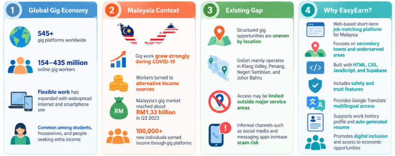

_Figure 1.1: Overview of the Gig Economy and EasyEarn in Malaysia_

## 1.2 Problem Statement

Despite the growth of Malaysia's gig economy, challenges remain in accessing structured shortterm work and in managing trust when jobs are sought through informal online channels. EasyEarn is designed around the following six problems:

## Problem 1: Lack of a Specialised Short-Term Labour Platform in Smaller Towns

There are only a handful of geographical hotspots in Malaysia that offer organised gig-work opportunities. One of the established gig-work platforms in Malaysia, GoGet, has more than 400,000 verified part-timers to connect businesses with them, but has said that the majority of the part-timers are in the Klang Valley, Penang, Negeri Sembilan and Johor Bahru [6]. This means that while structured gig platforms have now reached significant scale, they still have a highly skewed distribution of their key workforce availability across Malaysia. However, smaller towns targeted by EasyEarn, like Ipoh, Kangar, Alor Setar, Kuala Terengganu and Kota Bharu, are not in GoGet's main availability areas. Access to platform work is geographically limited, especially away from the main employment hubs, which can be seen as a barrier in digital labour markets [1].

## Problem 2: Prevalence of Social Media Job Scams

There is still a risk of employment scams for persons who are looking for part-time and flexible jobs in Malaysia. The number of part-time job scam cases reported in 2025 rose to 8,911 (up 144% from 2024), generating financial losses of around RM222 million, according to the Royal Malaysia Police [8]. The fake job offers are usually sent via WhatsApp and Telegram and can include the promise of earning lots of money for doing easy online jobs that ask for upfront payments or private details. The magnitude of these cases shows the importance of having stricter verification and accountability systems for job-seeking online. Moreover, it has been found that reputation information has an impact on trust in digital labour platforms [10]. To offer more organised trust mechanisms for Job Seekers and Employers, EasyEarn includes an Employer Verification Badge, a Report and Flag System, and a Bidirectional Rating and Review System.

## Problem 3: Lack of Verifiable Work History for Gig Workers

Gig workers might have trouble proving their employment history and earnings, since the work is often done in an engagement that lasts only a short time on the platform. The inability to prove work history and income was one of the constraints identified in accessing formal finance for gig workers from a United Nations Capital Development Fund (UNCDF) study which randomly surveyed 16,166 respondents across five gig platform markets in Malaysia and China [11]. It also stated that one out of four users of Grab's microloans might not have been available at traditional financial institutions due to the lack of accurate earnings information. This is a good example of the importance of keeping an organised record of work done and income generated. Platform workers can also experience problems in establishing a portable professional identity based on their platform-based work [12]. To present and organise completed work experience more systematically, EasyEarn therefore offers a Work History Dashboard and an Auto-Generated Resume.

## Problem 4: Inefficient Recruitment Process for Employers

Small and Medium Enterprises (SMEs), or individual employers, looking for short-term workers may need to coordinate and mobilise extra resources for recruitment. This is especially crucial in Malaysia, as Micro, Small and Medium Enterprises (MSMEs) employed about 8.09 million people or 48.7% of the population in employment, in 2025, with a contribution of RM689.8 billion or 39.7% of Malaysia's gross domestic product (GDP) [13]. Gusenbauer et al. [14] also arrived at the conclusion that digital work platforms could facilitate access to outside labour for SMEs, enhance the flexibility of their workforces, and lessen the obstacles to outsourcing. Hence, a structured digital recruitment system can assist SMEs to better manage their short-term hiring and applicant coordination.

## Problem 5: Limited Structured Access to Flexible Work Opportunities

Flexible working opportunities are significant for those who need flexible working arrangements to facilitate study, personal commitments and/or other duties. In Malaysia, recent data from a study of 385 youth gig workers in Kuala Lumpur indicates that 60.5% were aged 19-24, 33.2% were aged 25-30, and 33.5% engaged in gig work on a part-time basis [4]. Another important motivator for youth participation in the gig economy identified by the study was flexibility. This is an indicator of the need for flexible working by younger employees. But opportunities for structured short-term work are not ubiquitous, especially in areas away from gig services' central service hubs. For those who are looking for flexibility in their work, EasyEarn offers short-term job categories, filters for location and category, as well as application management functions.

## Problem 6: Language Barrier on Existing Platforms

Language accessibility can have an impact on the capacity of the user to be able to engage freely within digital gig platforms. As part of GoGet's involvement in the UNCDF B40 Challenge, there were over 10,000 registered users on the platform who reported that many low/middle income users preferred to use the platform in their native language, Bahasa Melayu, and that the training materials were available in English [15]. This means that accessibility can be a problem for language differences even in a well-established Gig Platform in Malaysia. A similar study of 4,217 respondents in 6 countries carried out by Saulītis [16] revealed a great preference for web content in users' native language. For this reason, multilingual access is an essential feature to enhance digital accessibility, and EasyEarn offers translated versions of its pages with Google Translate site redirection.

All six problems have pointed out a systemic gap in the gig economy infrastructure in Malaysia. Many Malaysians are economically marginalised, defrauded and unable to switch to better career development due to a lack of a dedicated, accessible and secure job-matching platform, particularly those in less-serviced areas. EasyEarn is suggested to be an integrated solution, structured and web-based through a job-seeker / job-provider matching portal all over Malaysia. The relevance of EasyEarn is further supported by the Gig Workers Act 2025 (Act 872), which came into force on 31 March 2026 and provides a formal framework for gig worker protection in Malaysia [17].

EasyEarn addresses 6 core issues presented in Figure 1.2, ranging from geographical exclusion to the absence of verifiable gig workers' work histories.

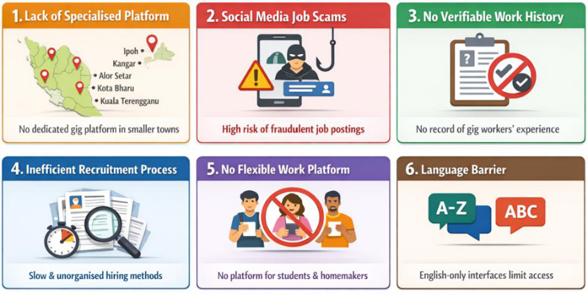

_Figure 1.2: Problem Statement of EasyEarn_

## 1.3 Research Questions and Research Objectives

EasyEarn is a web-based job-matching platform developed to connect Job Seekers and Employers to short-term, part-time and freelance job opportunities in Malaysia, especially in the underserved towns of Malaysia, namely Ipoh, Kangar, Alor Setar, Kuala Terengganu and Kota Bharu. In view of the problem statements explained in Section 1.2, this section elaborates the research questions (RQs) and research objectives to be used in developing and evaluating the EasyEarn Job Matching Portal.

### 1.3.1 Research Questions

Four RQs are generated based on the problem statements discussed in the above section 1.2. These RQs are in line with the project goals and serve as a basis for developing and assessing the EasyEarn Job Matching Portal.

RQ1: What are the essential requirements for a web-based job-matching platform that supports short-term, part-time and freelance employment between Job Seekers and Employers in Malaysia?

RQ2: What safety and trust features should be incorporated into the platform to support safer and more trustworthy interactions between Job Seekers and Employers?

RQ3: How can a digital work history and auto-generated resume support gig workers in documenting and presenting their completed work experience?

RQ4: What are the possible ways of making EasyEarn more accessible to those with varying language preferences using multilingual access?

Figure 1.3 outlines the four questions that have been identified for the development and assessment of the EasyEarn Job Matching Portal. The questions address the platform's essential functions, security and trust elements, digital work history, and automated resume building capabilities, as well as multilingual support.

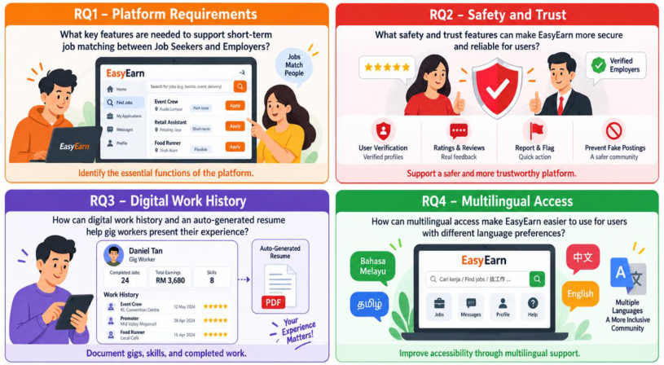

_Figure 1.3: Research Questions of EasyEarn_

### 1.3.2 Research Objectives

This project aims to develop and design EasyEarn. Accessed online, the job-matching platform will facilitate job seekers and employers in finding short-term, part-time and freelance jobs in Malaysia and in specific areas that are little-recognised, such as Ipoh, Kangar, Alor Setar, Kuala Terengganu and Kota Bharu. The objectives of EasyEarn are as follows:

- To develop a full-fledged multi-user-based web job matching platform, where users seeking employment can receive job offers from employers and apply for the jobs using the job matching services offered, such as job-specific dashboards, job posting and

management with full Create, Read, Update, and Delete (CRUD) facilities, locationwise job search and filtering, and 24/7 job seeker support by a rule-based chatbot.

- To establish a strong platform safety and trust verification system by implementing a bidirectional rating and review system, a Report and Flag function, and an Employer Verification Badge to reduce the risk of fraudulent job postings and support a fair, transparent and accountable job search and hiring environment for Job Seekers and Employers.

- To develop a verifiable digital work history profile for gig workers, enabling them to document their completed gigs, earnings and skills acquired, such as an Auto-Generate Resume feature that will generate a downloadable Portable Document Format (PDF) resume based on data captured from gig workers' work history profiles, which is not currently standardised to record employment history in the informal sector in Malaysia.

- To further enhance multilingual access on the platform by incorporating Google Translate to facilitate access in various languages such as Bahasa Melayu, Mandarin and Tamil, and to allow smaller communities around Malaysia to access the platform.

The four research objectives of EasyEarn are outlined in Figure 1.4, which include development of the platform, safety and trust, verifiable work history and multilingual accessibility.

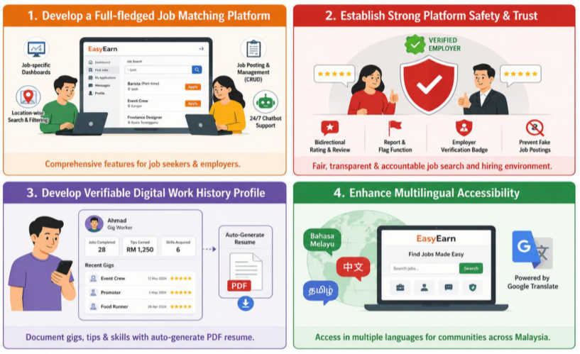

_Figure 1.4: Objectives of EasyEarn_

## 1.4 Scope of Project

EasyEarn is an online job matching service which links job seekers and employers in an easyto-use, secure and efficient platform. The system caters to three main user types: Job Seeker, Employer, and Administrator, with each having its own set of features and access levels to suit their needs. The project involves the full development of EasyEarn, including user management, job posting and management of applications, safety and trust verification, work history monitoring, and multi-language support for accessibility.

### 1.4.1 Project Coverage

EasyEarn is designed as a multi-user Web-based portal that allows various categories of users with various permissions and functions.

- Job seekers (university students, housewives and unemployed) can register and upload their profiles with skill tags, browse and filter job postings by category and location, apply for jobs, follow up on job applications, save jobs to a wishlist, view their history dashboard, auto-generate a PDF resume from their job history, and use the chatbot for platform support.

- Employers (SMEs and individual hirers) can register, submit verification details and supporting documents based on their employer type for Admin review, receive a Verification Badge upon approval, post and manage job listings with expiry dates, review applicant submissions, approve or reject applicants, and rate Job Seekers after completed jobs.

- Administrators have full control of the platform, including user account management, job listing moderation, report and flag resolution, and monitoring platform analytics.

Figure 1.5 shows that there are three primary groups of users of EasyEarn: Job Seekers, Employers, and Administrators and the features and access each group has to EasyEarn.

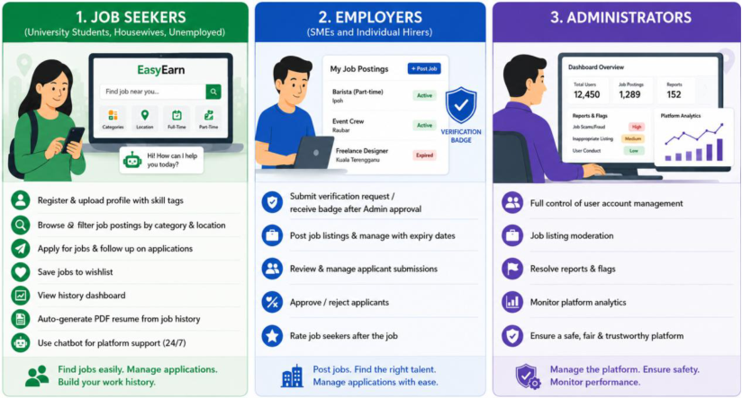

_Figure 1.5: Project Coverage of EasyEarn_

### 1.4.2 Complete Features List

EasyEarn has functionalities classified into two categories. Core Features: These are the essential functions that need to be undertaken and completed completely to realise the project goals. Optional Features are features which may be added to the user experience (UX) and were considered optional if time and resources allow.

## Core Features:

These are the key features of the EasyEarn platform that must be fulfilled in the system's development. Table 1.1 displays the minimal functionalities that the EasyEarn platform should have to satisfy its main activities.

_Table 1.1: Core Features_

|**No**|**Features**|**Description**|
|---|---|---|
|**1**|User Registration & Login|Role-based Job Seeker, Employer and Admin Registration/Login.|
|**2**|Job Posting & Application|Employers advertise jobs and job seekers apply for jobs, with application management within the platform.|
|**3**|Job Category & Filter|Search for jobs based on categories, such as Food and Beverage (F&B), Event, Delivery, and Tutor.|
|**4**|Location Filter|Search for jobs in Malaysia by city/region.|
|**5**|Application Status Timeline|Visual tracker with Pending, Reviewed, Interview, Accepted, Completion Pending, Completed, and Rejected stages.|
|**6**|Employer Verification Badge|Employers with verified accounts have a trust badge in their profile.|
|**7**|Report and Flag System|Users are asked to inform Admin about suspicious or non-paying employers or of fraudulently posted listings.|

|**8**|Rating & Review System|A two-way rating system of 1 to 5 stars and written feedback between employers and job seekers.|
|---|---|---|
|**9**|Work History Dashboard|Records finished work, income generated and the distribution of jobs by type.|
|**10**|Auto-Generate Resume|Completely automates PDF resume generation from job information.|
|**11**|Google Translate Integration|Redirects to Google Translate to access the platform in several languages.|
|**12**|Rule-Based Chatbot|Rule-based chatbot that responds to questions and offers job application and platform usage information 24/7.|

## Optional Features

These features were considered optional, depending on the availability of time and resources. They will not have an impact on the main functionality of the platform. Table 1.2 shows the available, but optional, features that can be added to EasyEarn, if time and resources allow.

_Table 1.2: Optional Features_

|**No**|**Features**|**Description**|
|---|---|---|
|**1**|Saved Jobs/ Wishlist|Job seekers can save interesting jobs to review later.|
|**2**|Job Expiry Date|Job postings will expire and close automatically after the expiration period.|
|**3**|Skills Tag|Job seekers add their skills to their profile.|
|**4**|Profile Completeness|Progress bar showing how much of the user profile is complete.|
|**5**|Analytics Dashboard|Earnings charts of job seekers; statistics about employers' recruitment; statistics of the administration platform.|
|**6**|Payment|When the transfer is made via DuitNow, employers confirm in-|
||Confirmation &|system and job seekers upload their DuitNow Quick Response|
||Dispute|(QR) code and confirm the receipt and either party can have the|
|||payment dispute reviewed by the admin.|

Figure 1.6 shows the full list of the main and optional features of the EasyEarn platform.

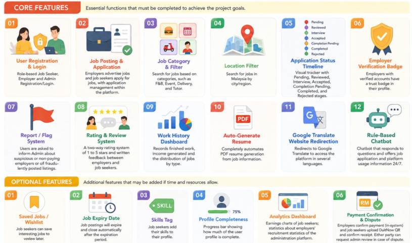

_Figure 1.6: Features of EasyEarn_

### 1.4.3 Excluded Features

The following features are not part of the current project phase because of time, resources and technical constraints:

- **Online payment gateway**

Financial transactions are carried out offline, using traditional methods like cash and DuitNow transfer. A job seeker can use the DuitNow QR code to receive payment offline from the employer. Payment processors like the DuitNow Application Programming Interface (API), Touch 'n Go, or credit card processors will not be connected with the platform at this stage.

- **Real-Time Chat Messaging**

This is not the messaging phase since real-time messaging is not enabled. When it comes to live chat, both the user and the person he/she is chatting with should be online at the same time, which is not feasible with a part-time job platform with an unpredictable schedule. Instead, a rule-based chatbot is used to offer 24/7 automated assistance, without the need for another user to be there.

- **Native Mobile Application**

EasyEarn is a web application. It excludes a native mobile application in the current phase. The platform will, instead, use responsive web design to make it mobile-friendly.

- **Mandatory Email Verification**

There is no current requirement to verify an email address when registering for a new account. But Supabase Auth enables email-based password recovery by sending a password reset link to the user's registered email address.

- **Government Database Integration**

   - During this stage, the platform will not be integrating with government databases such as Social Security Organisation (SOCSO), Employees Provident Fund (EPF) and MySejahtera. The information links to Pertubuhan Keselamatan Sosial (PERKESO)’s Self-Employment Social Security Scheme (SESS) will instead be made available to users for reference.

- **Artificial Intelligence (AI) Job Matching Algorithm** Technical complexity in automated Artificial Intelligence (AI)-based job recommendation will not be possible in this phase, and the project is restricted to this due to scope limitations.

The six features that were not included in the current phase of EasyEarn because of time, resource and technical limitations are shown in Figure 1.7.

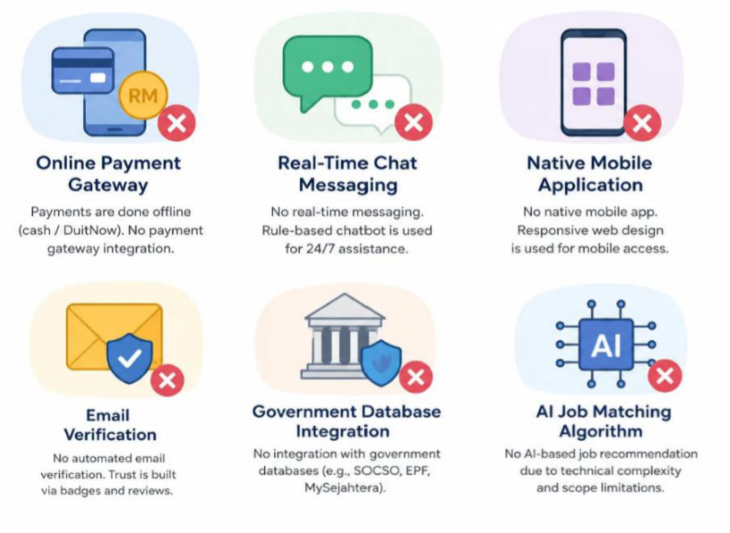

_Figure 1.7: Excluded Features of EasyEarn_

### 1.4.4 Information Security and Policies

EasyEarn handles personal data from both job seekers and employers, and the platform is secured with a variety of technical security measures, safeguarding user information and ensuring the integrity of the platform [18].

#### 1.4.4.1 Regulatory Framework

EasyEarn's personal data is subject to the following Malaysian regulatory frameworks:

- **Personal Data Protection Act (PDPA) 2010**

The main piece of legislation that regulates the processing of personal data in Malaysia is the Personal Data Protection Act (PDPA) 2010. Reasonable steps are implemented to ensure that the security of personal data is maintained so that it cannot be lost, misused, altered or accessed without permission. Names, contacts, work history and more are all stored securely in the Supabase PostgreSQL database. When users register, they are informed of the reason for the collection of the data, and there is no sharing with third parties without authorisation.

- **Computer Crimes Act 1997**

This legislation regulates and addresses the unauthorised use of computer systems and information. To ensure that users cannot access other users' information or system resources without permission, the platform uses role-based access control (RBAC) and Supabase Authentication. All data is sent via Hypertext Transfer Protocol Secure (HTTPS).

- **Consumer Protection Act 1999**

As a form of consumer protection, the Report and Flag System and Employer Verification Badge help reduce the risk of fraudulent job postings and non-paying employers.

- **Employment Act 1955 (Reference Only)**

The platform offers informational guidelines in line with the Employment Act to encourage and help provide fair practices in job posting and clarify responsibilities for the users. This project does not cover direct compliance enforcement because it is an academic prototype called EasyEarn.

- **Gig Workers Act 2025 (Act 872)**

The Gig Workers Act 2025 (Act 872), which came into force on 31 March 2026, offers a legal structure for gig workers and guidelines on service contracts, workers' rights, social protection and dispute resolution. EasyEarn includes the Employer Verification Badge, Rating and Review System, Reporting and Flagging System, and Work History Profile to help promote transparency and accountability on the platform. The features are developed with awareness of the regulatory framework, which is not a formal legal or regulatory certification of compliance [17].

The five regulatory regimes under which EasyEarn operates and handles data are outlined in Figure 1.8.

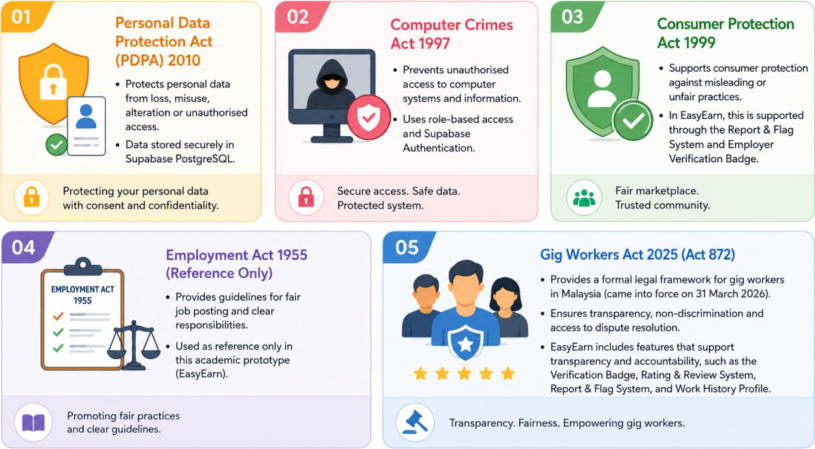

_Figure 1.8: Regulatory Framework of EasyEarn_

#### 1.4.4.2 Technical Security Measures

To ensure users' data security and platform integrity, EasyEarn adopts some technical security measures:

- **Supabase Authentication**

User account authentication is done via Supabase Authentication, which secures passwords and user sessions. Also, to better manage access to sensitive functions in a system and to limit unauthorised access, token-based authentication is employed.

- **Role-Based Access Control (RBAC)**

Access to system functions is limited based on user roles. The different permissions and functions are given to the Job Seekers, Employers and Administrators depending on their role in the platform. Only the Admin role has administrative access, and RBAC minimises cross-role access.

- **HTTPS Encryption**

All data sent between the user's browser and Supabase's backend is encrypted using HTTPS. This ensures the data is encrypted while being transmitted and minimises the chance of data interception or eavesdropping.

- **Supabase Row Level Security (RLS)**

Supabase Row Level Security (RLS) policies are employed to enforce policies when accessing the database depending on roles and record ownership. These policies offer an extra degree of security by limiting certain read and write operations at the database level. The effectiveness of those individual RLS policies, however, will depend on how they are configured; any remaining access control limitations will be assessed during Security Testing in Chapter 4.

Four technical security measures are adopted in EasyEarn to provide user data protection, access control and integrity of the platform as illustrated in Figure 1.9.

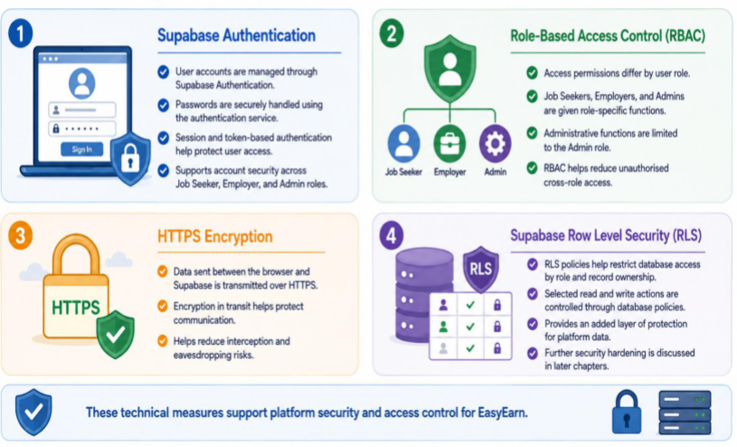

_Figure 1.9: Technical Security Measures of EasyEarn_

## 1.5 Significance of the Study

EasyEarn is expected to have a tangible and quantifiable impact on various stakeholders such as job seekers, employers, and Malaysian society as a whole. EasyEarn is not just a tool for connecting with jobs; it has academic, technological, and socioeconomic implications. These dimensions are discussed in detail in the following sections.

### 1.5.1 Benefits

EasyEarn provides benefits to its main stakeholders, including Job Seekers, Employers, Administrators and the wider community. These benefits align to the project goals of increasing access to short-term jobs, enhancing trust and safety, supporting digital work history documentation, and making it easier to access through multilingual support.

## Benefits to Job Seekers

EasyEarn provides job seekers in underserved areas of Malaysia with a structured platform to search and apply for short-term, part-time and freelance jobs. By combining job search, application management, work history and trust-related features in one system, the platform gives users a more organised way to manage their job-search activities. The Work History Dashboard and Auto-Generate Resume allow job seekers to keep and present records of their completed work, which is related to the portable professional identity issue discussed by Graham et al. [12]. EasyEarn also uses Google Translate Integration to provide multilingual access for users with different language preferences, which is relevant to the languageaccessibility issue highlighted by UNCDF [15].

## Benefits to Employers

EasyEarn is a one-stop solution for employers, especially SMEs and individual employers in smaller towns, to post job ads, access applicant profiles, skills and work history, and handle the entire recruitment process in one place. Gusenbauer et al. [14] found that digital work platforms can help small enterprises access external labour and reduce the coordination involved in sourcing workers. The structured recruitment functions of EasyEarn may also help employers manage short-term hiring more efficiently by centralising job posting, applicant information and recruitment activities within one platform.

## Benefits to Society and the Economy

EasyEarn at the societal level seeks to create more structured opportunities to access short-term jobs, including for users residing in less-serviced towns, like Ipoh, Kangar and Kota Bharu, to foster geographical economic inclusion. The platform also addresses issues relating to employment fraud. The Royal Malaysia Police [8] reported 8,911 cases of part-time job scams in 2025, which is an increase of 144% compared to 2024, and losses amounting to around RM222 million. EasyEarn therefore offers the following trust-related features: Employer Verification Badge, Report and Flag System, and Bidirectional Rating and Review System, which provide a more structured job-search environment.

EasyEarn benefits three groups of stakeholders: Job Seekers, Employers, and Society and the Economy; the key benefits of EasyEarn are summarised in Figure 1.10.

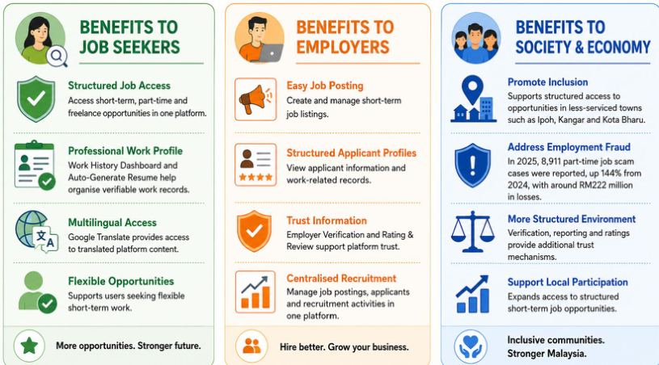

_Figure 1.10: Benefits of EasyEarn_

### 1.5.2 Significance

The output of this project will be the development of the EasyEarn Job Matching Portal which will be a functional web-based platform for short-term, part-time and freelance job opportunities. This system should enable Job Seekers, Employers and Administrators to access and use the system with the necessary level of access, post jobs and manage applications, increase user confidence with security measures, facilitate digital work history and resume generation, and be accessible in multiple languages.

## Academic Significance

EasyEarn is an addition to the extant literature on digital labour platforms in developing economies, specifically the context of the Malaysian gig economy. Previous research has explored gig work through the lens of labour rights [12] platform governance and economic inequality [3], but there has been a lack of proposals and implementation of a localised and technology-based solution addressing the particular demographic and geographic circumstances of gig workers in Malaysia. To fill this void, EasyEarn has developed a working system that combines identity verification, portable work history, and multilingual usability in a single platform that can be used as a grounding point for further research into the design and implementation of gig platforms in emerging markets that are underserved.

In addition, the development process used in the development of EasyEarn, which uses a Hybrid Agile-Waterfall methodology, is part of the academic discussion on adaptive software development frameworks for students' information systems projects. Structured but iterative, the methodology followed in this study is a model of how academic projects can meet rigorous documentation expectations and be flexible enough to accommodate changing user needs, and, as such, is a model that can be replicated for applied computing research.

## Technological Significance

EasyEarn, from a technological perspective, is a practical proof that a client-side web application can be created on a Backend-as-a-Service (BaaS) architecture and provide a feature-rich, multi-user platform with much less complexity and infrastructure than traditional server-based applications. The use of Supabase for database management and authentication, Chart.js for data visualisation, and jsPDF for dynamic document generation demonstrates the effectiveness of open-source and cloud-native tools to create a scalable, maintainable, and costefficient solution [18].

This is an architectural style that is of particular interest in the academic and early-stage commercial development space, where budget and access to dedicated server infrastructure often become constraints. EasyEarn shows that a BaaS-based architecture is technically feasible, can provide for complex multi-role workflows, support database-driven multi-role workflows and support user management securely, and is a useful reference for developers and researchers creating similar platforms in resource-constrained environments.

## Socioeconomic and Policy Significance

EasyEarn's key appeals are not only to its targeted groups but also as a technology-driven solution that benefits Malaysia's socio-economic inclusion. This is aligned with Malaysia’s national digital development priorities, which emphasise digital participation, economic inclusion and technology-driven development. The Gig Workers Act 2025 (Act 872) provides a formal framework for protecting gig workers in Malaysia, which also gives gig worker policy platforms like EasyEarn policy relevance.

EasyEarn is an example of how a local design can overcome local challenges and barriers to short-term job access, trust, work history documentation, and multilingual accessibility to serve underserved communities. The project could also offer valuable insights for future expansion of community-based digital labour platforms and initiatives encouraging participation in the gig economy in non-urbanised areas of Malaysia. The EasyEarn platform is academically, technologically, and socio-economically important, as indicated in Figure 1.11.

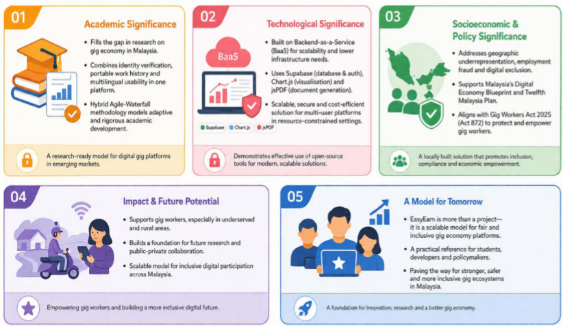

_Figure 1.11: Significance of EasyEarn_

## 1.6 Milestones and Deliverables

This section outlines the main milestones and deliverables of the EasyEarn project during the 26 weeks of the Final Year Project (FYP). A Work Breakdown Structure (WBS), a project schedule, a Gantt Chart, project milestones and sprint-based deliverables are used to organise the project activities. These planning components are used to help structure the monitoring of project progress and the completion of required development and documentation activities within the planned timeline.

### 1.6.1 Work Breakdown Structure (WBS)

A hierarchical breakdown of the total scope of work needed to complete a project, each of which is more detailed in the definition of project deliverables (Project Management Institute, 2021) is called a WBS. For EasyEarn, the WBS decomposes the project into eleven major phases: Project Initiation, Research and Requirements Analysis, System Design, Prototype and Final Year Project 1 (FYP1) Submission, and six Agile development sprints in Final Year Project 2 (FYP2) covering Authentication and User Management, Job Posting and Application, Safety and Trust System, Work History and Auto Resume, System Enhancements, and Integration and Final Testing, followed by Deployment and Final Documentation and Submission.

There are sub-tasks defined in each phase which help the development team to deliver all the components of the project in a structured way. The WBS eliminates the possibility of any critical activity being missed, and it can be used to estimate project time, assign resources, and measure project progress throughout the project's life cycle [19]. The complete WBS of EasyEarn can be broken down into eleven major project phases, as shown in Figure 1.12.

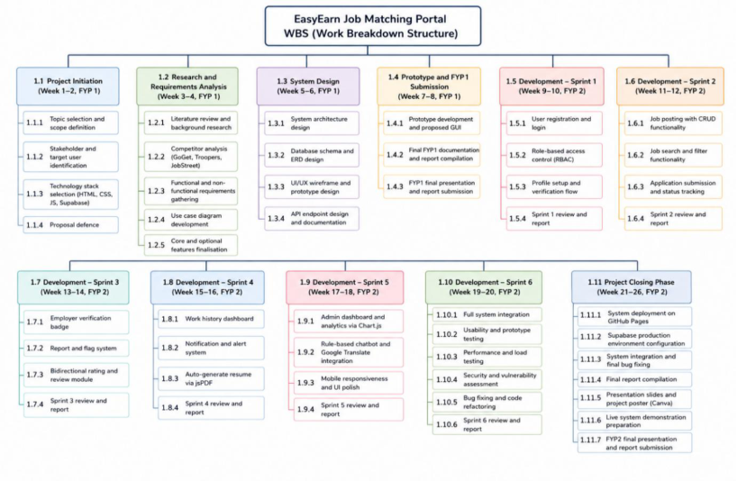

_Figure 1.12: Work Breakdown Structure (WBS)_

### 1.6.2 Project Schedule

The project schedule breaks down the WBS into a plan that takes into account time, with each work package allocated to a particular week in the 26-week project schedule [19]. Table 1.3 outlines the overall project timeline with the corresponding key milestones and sprints.

_Table 1.3: Project Schedule Summary_

|**Phase**|**Timelin**|**e**|**Key Activitie**|**s**|**Deliverable**|
|---|---|---|---|---|---|
|Project Initiation|Week (FYP1)|1-2|Topic select stakeholder id of the technolo|ion, scope definition, entification, and selection gy stack.|Project proposal draft|
|Research &|Week|2-4|Literature rev|iew, competitor analysis,|Requirements|
|Requirements|(FYP1)||functional req functional req case developm|uirements (FRs) and non- uirements (NFRs), and use ent.|specification document|
|System Design|Week (FYP1)|5-6|System arch Relationship wireframes, documentation|itecture design, Entity- Diagram (ERD), API endpoint .|System design artefacts|
|FYP1|Week|7-8|Development|of prototypes, preparation|FYP1 report and|
|Submission|(FYP1)||of document presentation a|s, preparation of final nd submission of M3.|prototype|
|Sprint 1|Week (FYP2)|9-10|User Registra User profile review.|tion, User login, RBAC, setup and Supervisor|Functional user management module|
|Sprint 2|Week 1 (FYP2)|1-12|Job posting filtering and s job application|(CRUD), job searching, ubmission and tracking of s.|Functional job module|
|Sprint 3|Week 1 (FYP2)|3-14|Verification report/flag rating/review|badge by employer, system, bi-directional system.|Functional safety module|

|Sprint 4 & M4|Week 15-16 (FYP2)|Work history dashboard, notification system, auto-generate resume (jsPDF), M4 Midsem Checkpoint.|Functional work history module|
|---|---|---|---|
|Sprint 5|Week 17-18 (FYP2)|Admin dashboard and analytics with Chart.js, mobile responsiveness polish and Supervisor review.|Functional admin module|
|Sprint 6|Week 19-20 (FYP2)|Full system integration, Usability testing, Performance testing, Security assessment, Bug fixing.|Fully tested integrated system|
|Deployment|Week 21-22 (FYP2)|Live deployment to GitHub Pages, production configuration and overall|Live-deployed system and test|
|||system integration testing.|reports|
|Final|Week 23-26|Create Final Report, Present Slides, Set|FYP2 final|
|Submission|(FYP2)|up for live demo and do M5 defence.|report and presentation|

### 1.6.3 Gantt Chart

The Gantt Chart offers a visual timeline display of all project activities, which helps the project team plan, coordinate and monitor progress against scheduled deadlines [19]. It is evident from the chart that the waterfall-driven planning phase in FYP1 was followed by the 6 agile development sprints in FYP2, and the highlighted critical path runs from Sprint 1 through the end of the development process to submission for deployment. The Gantt Chart is constantly updated and it is a living document at the end of each sprint to show actual progress towards the planned schedule.

The following are important events which are tracked on the Gantt Chart: FYP1 Proposal Defence (Week 3), FYP1 Midsem Checkpoint (Week 6), FYP1 Final Presentation (Week 8), FYP2 Midsem Checkpoint (Week 16) and FYP2 Final Presentation and Submission (Week 26).

The EasyEarn project has a total of 26 weeks for development, and the Gantt Chart of the project is shown in the following figures (Figures 1.13-1.17) as a visual representation of all activities along the project development timeline.

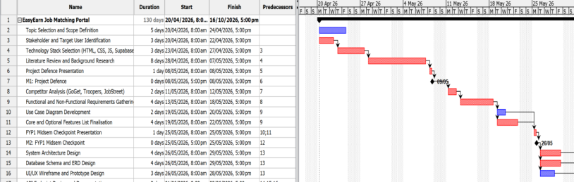

_Figure 1.13: Gantt Chart (1)_

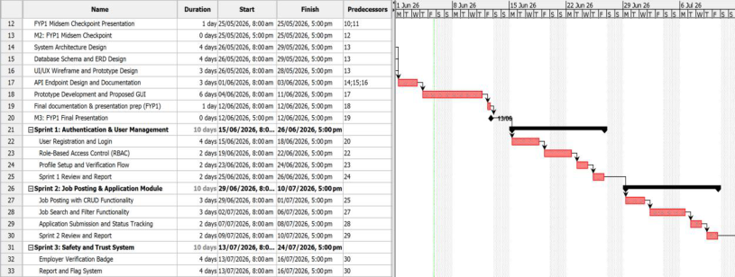

_Figure 1.14: Gantt Chart (2)_

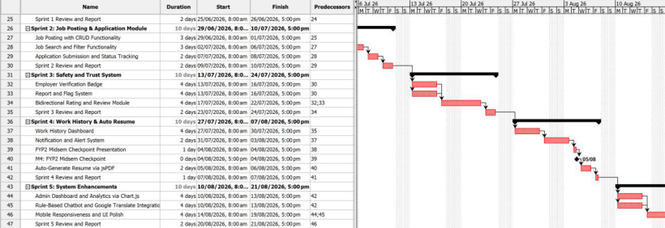

_Figure 1.15: Gantt Chart (3)_

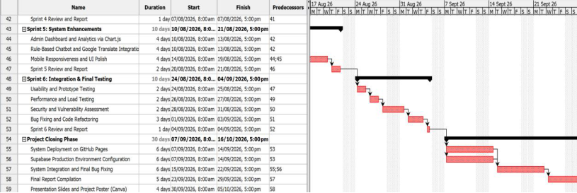

_Figure 1.16: Gantt Chart (4)_

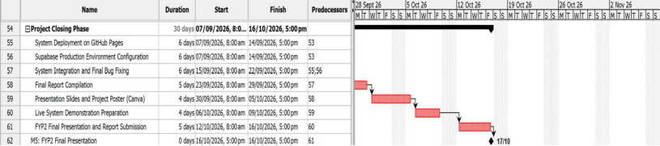

_Figure 1.17: Gantt Chart (5)_

### 1.6.4 Project Milestones

There are 5 academic milestones, each being a formal assessment/review point for the EasyEarn project in the two FYPs. Sprint completion reviews are also performed at the end of every FYP2 development sprint to help track progress and incorporate supervisor feedback. The five academic milestones tracked throughout the EasyEarn project are listed below in Table 1.4.

_Table 1.4: Project Milestones_

|**No**|**Milestones**|**Timeline**|**Description**|
|---|---|---|---|
|**M1**|Proposal Defence|Week 3|Project proposal presented to the assessment panel for approval before proceeding to the design phase.|
|**M2**|FYP1 Midsem Checkpoint|Week 6|Progress on system design documentation, use case diagrams, wireframes, and ERD was presented to the panel.|
|**M3**|FYP1 Final|Week 8|Submission of the FYP1 interim report and|
||Presentation &||prototype demonstration, marking the end of the|
||Report Submission||first semester.|
|**M4**|FYP2 Midsem|Week 16|Completed Sprints 1 to 4 demonstrated to the|
||Checkpoint||assessment panel, along with a development progress report.|
|**M5**|FYP2 Final|Week 26|Final system presented to the assessment panel; all|
||Presentation &||project deliverables formally submitted.|
||Report Submission|||

Sprint completion reviews are held at the end of each sprint in FYP2 to ensure development is on track and that supervisor feedback is captured for use in future sprints. Sprint 1 will be reviewed at the end of Week 10, Sprint 2 will be reviewed at the end of Week 12, Sprint 3 will be reviewed at the end of Week 14, Sprint 4 will be reviewed at the end of Week 16, Sprint 5 will be reviewed at the end of Week 18, and Sprint 6 will be reviewed at the end of Week 20. The system deployment, preparation and compilation of the system final report, and preparation for the final presentation are completed in the Project Closing Phase from Week

21 to Week 26, culminating in the final M5 presentation and submission at the end of Week 26.

### 1.6.5 Sprint Breakdown and Deliverables

FYP2 development is broken up into six two-week agile sprints (Weeks 9-20), resulting in a functional system module. The sprint structure allows for incremental development and testing of core platform features that can help identify and fix problems before developing additional features. Table 1.5 shows the sprint breakdown and deliverables delivered in each of the six agile development sprints in FYP2.

_Table 1.5: Sprint Breakdown and Deliverables_

|**Sprint**|**Timeline**|**Objective**|**Delivera**|**ble**||
|---|---|---|---|---|---|
|**Sprint** **1:**|Week 9-|Registration, authentication,|Function|al|user|
|**Authentication** **&**|10|login and user role setup.|managem|ent|module|
|**User Management**|||and sprin|t rep|ort.|
|**Sprint 2: Job Posting**|Week|CRUD job posts, search for|Function|al|job|
|**&** **Application**|11-12|jobs, filter, and submit and track|module|and|sprint|
|**Module**||applications.|report.|||
|**Sprint 3: Safety &**|Week|Bidirectional rating & review|Function|al|safety|
|**Trust System**|13-14|module, employer verification badge, report and flag system.|module report.|and|sprint|
|**Sprint** **4:** **Work**|Week|Work history dashboard,|Function|al|work|
|**History** **&** **Auto**|15-16|notification and alert system,|history|modu|le and|
|**Resume**||auto-generate resume using jsPDF, and M4 checkpoint.|sprint re|port.||
|**Sprint** **5:** **System**|Week|Admin dashboard and analytics|Function|al|admin|
|**Enhancements**|17-18|through Chart.js, a rule-based chatbot and mobile responsiveness polish.|module report.|and|sprint|

|**Sprint 6: Integration**|Week|Full system integration,|Fully tested and|
|---|---|---|---|
|**& Final Testing**|19-20|usability testing, performance testing and concurrency checks,|integrated system; final sprint report.|
|||security assessment and bug||
|||fixing.||

### 1.6.6 Final Deliverables

Final deliverables, as part of the EasyEarn academic evaluation, are submitted when the project is completed. Deliverables represent the various stages of the project life cycle and show the breadth of the project. Table 1.6 is the full list of final deliverables that are submitted at the project's end.

_Table 1.6: Final Deliverables_

|**No**|**Deliverable**|**Description**|
|---|---|---|
|**1**|Web-Based Job Matching Portal|A fully operational EasyEarn portal deployed on GitHub Pages, incorporating all core features, including user management, job matching, safety verification, work history, auto-generated resume, and Google Translate Integration.|
|**2**|Auto-Generated PDF Resume|A system-generated, downloadable resume produced from the job seeker's work history, ratings, and skills data using jsPDF.|
|**3**|Comprehensive Documentation|All project documentation, such as the project proposal, system design diagrams, database schema, test reports and user manuals.|
|**4**|Annotated Source Code|Formatted and commented HTML, CSS, and JavaScript codebase along with Supabase configuration files, organised for clarity and maintainability.|
|**5**|Testing and|Functional tests, security assessment, usability evaluation and|
||Evaluation Report|system performance analysis are documented in detail.|
|**6**|Presentation Materials|Presentation slides, project poster created using Canva, and live system demonstration for academic assessment.|

The milestones, sprint deliverables and final submissions provided in Section 1.6 are the measurable deliverables of the EasyEarn project. The milestones are formal landmarks to review progress towards project objectives, and the deliverables from each sprint ensure that the development of the system keeps moving forward in a step-by-step and systematic fashion throughout the 26 weeks of the project. All of the deliverables in Table 1.6 must be completed for the project to be considered a success.

## 1.7 Thesis Overview

This thesis consists of five chapters to provide a coherent narrative of the development, design and assessment of EasyEarn, an online job-matching platform created to fill some of the gaps in the gig economy in Malaysia.

The basis of the study is laid in Chapter 1. It provides an overview of the Malaysian gig economy, six major issues that led to EasyEarn, the aims of the research, the scope of the project, the information security framework and the work regarding information policy compliance, and the importance of EasyEarn for job seekers, employers, and the overall economy in Malaysia.

The literature review is included in Chapter 2. It starts with a theoretical discussion based on the Technology Acceptance Model (TAM) and then examines the literature on the gig economy, employment fraud, work history documentation, language barriers and underserved demographics in an empirical way. The chapter also examines the existing technologies, tools and platforms selected, as well as similar existing systems, and suggests a framework that builds upon the literature.

The methodology used in this project is explained in Chapter 3. It explains the Hybrid Agile-Waterfall Development Approach, System Architecture, Database Design, and Project Management Framework, along with their WBS and Sprint Planning.

Chapter 4 reports the findings and results of the system development and user testing, explaining the features implemented, the results of testing and the performance of the system in relation to the defined objectives.

The findings of this thesis are presented in the context of the research aims and previous research in Chapter 5, the success of EasyEarn as a platform, and the main contribution of this project to the field of gig platforms in Malaysia. It also highlights the current implementation weaknesses and suggests further developments beyond this FYP.

Figure 1.18 illustrates the overall structure of the thesis. It briefly summarises the five main chapters (Introduction, Literature Review, Methodology, Findings and Results, Discussion and Conclusion). The figure clearly shows the development of the thesis from the background of the research and related studies to system development, evaluation, findings and future improvements.

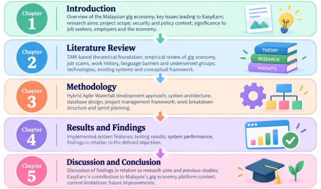

_Figure 1.18: Thesis Overview of EasyEarn_

## 1.8 Constraints and Limitations

EasyEarn is developed under bounded conditions due to the nature of the academic environment, the project timeline, and the technology stack, as well as known limitations of the system, which could be solved in future stages.

### 1.8.1 Project Constraints

Project constraints are the fixed factors that may affect the development of EasyEarn. These constraints include time, development resources, technical dependency, scope control, data security and regulatory compliance. By identifying these constraints, the project scope and planning can be managed more realistically throughout the development process.

## Time Constraint

The project will be of a fixed duration, comprising 26 weeks in total, to be completed in two phases: FYP1 (20 April to 12 June 2026) and FYP2 (15 June to 16 October 2026). This constraint is controlled by the Hybrid Agile-Waterfall methodology: a blend of structured planning with iterative development. Those features that cannot be developed during the sprints are either saved for the next sprints, or they are not included in the scope of the project [20].

## Resource Constraint

EasyEarn is not developed by a dedicated development team, separate Quality Assurance (QA) team, or enterprise-level infrastructure, but by a single student. This means that only a certain degree of parallel development, testing coverage and optimisation can be achieved during the project period. Thus, it is important to prioritise core functions of the system carefully to make sure that a functional and testable system can be built within the limited resources at hand [21].

## Technology Constraint

It is built with HTML, CSS and JavaScript, with Supabase offering BaaS functions and GitHub Pages for the deployment of the static frontend. The technology stack was chosen for its accessibility, its suitability for an academic project, and not needing dedicated applicationserver infrastructure. However, as GitHub Pages is a static front-end, EasyEarn is built on client-side JavaScript, Supabase backend services and some selected back-end business logic, such as RLS policies and PostgreSQL triggers. Additionally, Supabase's free tier usage limits may affect resources like databases, storage, and other services depending on platform usage [18].

## Regulatory Constraint

EasyEarn processes personal information and will be developed in accordance with the current personal data protection laws and regulations in Malaysia, in particular, the PDPA 2010, Computer Crimes Act 1997 and Consumer Protection Act 1999. Supabase offers RLS policies and HTTPS data transmission, while RBAC can be used to limit access based on a user's role. These controls provide support in protecting user data, but are not a formal certification of legal or regulatory compliance. A formal compliance and legal review would be needed before general production.

To summarise, EasyEarn has 4 main project constraints: A fixed academic timeline of 26 weeks, A single developer resource constraint, A web-based architecture with a static front end, GitHub Pages and Supabase BaaS services, and regulatory concerns on personal data and gig work. These restrictions are used to limit the development scope and testing depth, as well as the manufacturability of the product. The constraints have been taken into account by making design decisions like phased feature development, prioritisation of essential functions, and using a Hybrid Agile-Waterfall methodology.

Table 1.7 below provides a summary of the four key project constraints, their effect on the current project stage and the recommended future actions.

_Table 1.7: Summary of Constraints_

|**Type**|**Issues**|**Impact**|**Future Recomme**|**ndation**|
|---|---|---|---|---|
|**Time**|Established a fixed|Restricts the|Continues develop|ment in|
|**Constraint**|26-week academic project deadline|development, testing and refinement that can be achieved during the life of the project.|phases for featu improvements not the scope of the pr|res or within oject.|
|**Resource**|A single-developer|Limits parallel|Create a|small|
|**Constraint**|project with no designated development or QA team.|development, independent review, testing coverage and optimisation.|development and team for enhancements and deployment.|testing future larger|
|**Technology**|A static frontend|Restricts dedicated|Expand databa|se-level|
|**Constraint**|with Supabase's architecture as a|application-server processing and relies on|controls, and if nee future requiremen|ded, the ts call|
||backend, built on GitHub Pages.|the services' capabilities and limits of the chosen BaaS platform.|for more ser processing, consid Supabase Edge Fu or a dedicated back|ver-side er using nctions end.|
|**Regulatory**|Compliance with|Production would need to|Conduct a formal|PDPA|
|**Constraint**|legal and regulatory aspects of personal data, computer|be assessed by a formal legal and compliance review before being used|and legal review, in relevant requi under the Gig Wor|cluding rements kers Act|
||misuse, consumer protection and gig work.|for wider production.|2025, before production use.|wider|

The remaining four constraints of the project are summarised in EasyEarn, and the effect the project has on the current development phase is summarised in Figure 1.19.

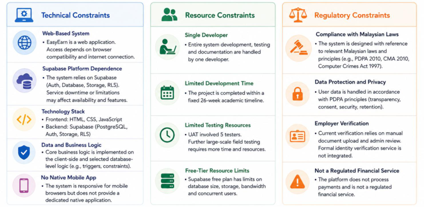

_Figure 1.19: Project Constraints of EasyEarn_

### 1.8.2 System Limitations

This section provides details on the current restrictions on the EasyEarn Job Matching Portal. The constraints are primarily about payment processing, real-time communication, mobile platform availability, and the size of the acceptance testing. While these restrictions do not hinder the system's core capabilities, they serve as a guide for future development to make the system more functional, accessible, and user-friendly.

## No Integrated Payment Gateway

Financial transactions are currently outside EasyEarn, with cash or DuitNow transfers used. The platform does not have an integrated payment gateway; rather, it facilitates payment confirmation and dispute resolution. Integration with a regulated payment service can be explored in a future phase, subject to technical, regulatory and cost considerations [22].

## No Real-Time Direct Messaging

EasyEarn supports asynchronous messaging between Job Seekers and Employers, while realtime messaging or live chat is not implemented. The messages are stored and retrieved via the current messaging function, not using a real-time communication service. The existing messaging functionality can be enhanced with Supabase Realtime or another appropriate messaging service in the future.

## No Native Mobile Application

EasyEarn is at the moment a responsive web application and there isn't any dedicated native mobile app. The platform can be accessed via mobile browsers, but there may be mobilespecific functions that can be offered with a native iOS or Android app, such as push notifications, offline access, and better mobile interaction. In future enhancements, therefore, it may be appropriate to consider the development of a native app for mobile devices [23], [24].

## Limited User Acceptance Testing

Five users participated in User Acceptance Testing (UAT), completing 75 functional task executions across the Job Seeker, Employer and Admin roles using designated user accounts and test data stored in Supabase. While the main workflows were successfully tested, the number of testers was limited compared with the intended user population across the targeted underserved towns in Malaysia. Further testing should take place on a larger scale in field with more representative end users.

## No Automated Identity Verification

EasyEarn currently uses employer-submitted verification documents, the Employer Verification Badge and Admin review to support employer credibility. But the system doesn't support a formal automated identity verification system or government identity database. An appropriate identity verification service could be integrated in the future to enhance the employer verification process.

## Multilingual Support via Redirection

Multilingual access is currently available on the EasyEarn site via Google Translate website translation service (and not via the Google in-app translation API). This provides access to several languages, but offers less control over translation accuracy, consistency and interface integration. EasyEarn may be able to benefit from a native translation API like Google Cloud Translation in an upcoming version to offer an integrated multilingual UX [25].

In conclusion, there are six major drawbacks of the current EasyEarn system: there is no embedded payment gateway, real-time direct messaging, mobile app integration, automated identity verification, and the limited scale of UAT, in addition to website redirection instead of a native translation API from Google. These restrictions are primarily due to the scope, time, resource and technical constraints of the academic project. Each limitation also gives a clear direction for future improvement and helps guide the next development stage of EasyEarn.

Table 1.8 shows a summary of the 6 system limitations, their effect on the current version of EasyEarn and the suggested enhancements for future releases.

_Table 1.8: Summary of Limitations_

|**Type**|**Issues**|**Impact**|**Future Recommendation**|
|---|---|---|---|
|**Limitation**|No integrated payment|Payments are made outside the platform, but|Consider integrating a regulated payment service,|
||gateway|payments can still be recorded and managed in|such as DuitNow, in a future phase.|
|||EasyEarn, and||
|||confirmations and||
|||disputes can be recorded.||
|**Limitation**|No real-time|Job Seekers and|Make the current messaging|
||direct messaging|Employers interact|feature more powerful by|
|||asynchronously.|leveraging Supabase|
||||Realtime or another|

||||appropriate real-time messaging service.|
|---|---|---|---|
|**Limitation**|No native mobile application|Mobile users use the responsive Web interface|Create and build native iOS or Android app including|
|||and don't have access to mobile-specific features.|push notifications and offline support.|
|**Limitation**|Limited UAT sample|The UAT was performed with five testers and may not have captured the broader view of the target group.|Perform extended UAT and field testing to a larger number of users from various target towns and backgrounds.|
|**Limitation**|No automated identity verification|Employer verification is based on documents submitted and Admin review, not automated identity verification.|In future development, consider a formal identity verification service.|
|**Limitation**|Multilingual support via redirection|Google Translate website service is required for translation, and is not as integrated as a native translation API.|Consider upgrading to a native translation API such as Google Cloud Translation.|

To design a better system in the future, the EasyEarn system has six limitations, which are presented in Figure 1.20 and solutions are recommended.

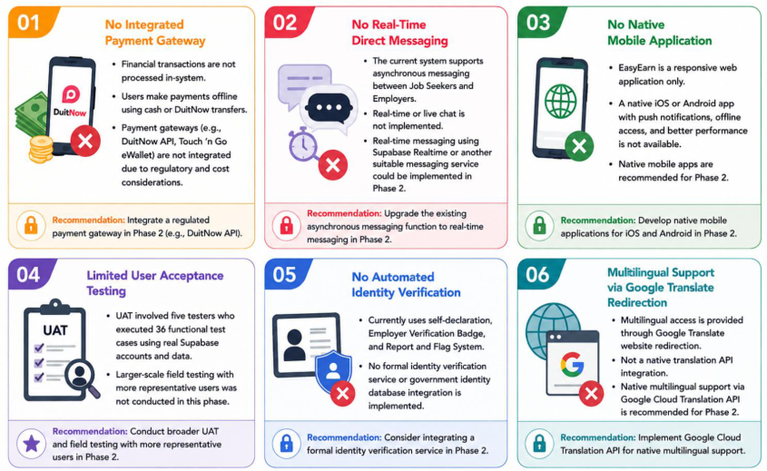

_Figure 1.20: System Limitations of EasyEarn_

## 1.9 Conclusion

This chapter has shared the background, motivation and direction of the creation of the webbased job-matching system EasyEarn for Job Seekers and Employers, focusing especially on the users of less-serviced areas of Malaysia. Structured digital platforms for accessible, trustworthy and efficient short-term employment opportunities are becoming more important due to the rise in gig and flexible work.

These six problems are interconnected, with limited access to specialised short-term employment platforms in SMEs and employment fraud and trust issues among them, and the problems of work history without structure and inefficient SME recruitment are exacerbated by the lack of support for flexible workers and language accessibility barriers.

In response, Section 1.3 sets four research objectives: Multi-user Portal with RBAC, Safety and Trust Verification System, Developing a Work History Profile with an autogenerated PDF resume and Multilingual Accessibility through Google Translate. It is created in HTML, CSS, and JavaScript, deployed via GitHub Pages, in a 26-week Hybrid AgileWaterfall framework, built on Supabase. In Section 1.4, further details of the information security and compliance of information policies adopted were highlighted to show how EasyEarn is designed with selected controls aligned with the PDPA 2010, Computer Crimes Act 1997 and Consumer Protection Act 1999.

In Section 1.5, the role of the platform in the job search, employer and Malaysian society was confirmed, especially in driving economic inclusion and preventing employment fraud.

# Chapter 2: Literature Review

## 2.1 Introduction

The gig economy is growing rapidly in Malaysia, yet a structured, reliable and participatory digital labour platform is needed that can benefit not only the dominant big cities, but also the underserved secondary towns and rural parts of Malaysia. This chapter is a complete and critical review of the academic and technical literature that guides the design, development, and evaluation of EasyEarn: a web-based job-matching portal for short-term, part-time and freelance work within Malaysia.

The review is organised into seven main sections. The theoretical underpinning of the design of EasyEarn's features and the expected adoption by users is based on the TAM [26], as discussed in Section 2.2. The empirical review of the research in Section 2.3 examined research on the gig economy in Malaysia, employment fraud, verifiable work history, language barriers, flexible demographics and SME recruitment challenges. The technologies that will be used to realise EasyEarn are discussed in Section 2.4, and the platform and tools that have been selected are discussed in Section 2.5. It is analysed, and similar systems and their limitations are discussed in Section 2.6, and the research gap is identified in Section 2.6.5. Based on the theoretical and empirical results, and the identified research gap, a conceptual framework is presented in Section 2.7. The chapter ends in Section 2.8.

The literature reviewed in this chapter covers six problem dimensions related to EasyEarn: geographic exclusion, employment fraud and trust, the absence of structured work history, inefficient SME recruitment, limited flexible work channels and language barriers. In addition, Section 2.6 reviews similar systems and how these systems address these areas. In the platforms and features reviewed in this study, no platform was found that integrated all of the above in one platform suitable for the context in Malaysia. EasyEarn is thus suggested as an integrated web-based solution to fill the gap.

Figure 2.1 shows the structure of Chapter 2, which covers the theoretical foundation, empirical review, technologies, selected platforms and tools, similar systems, research gap, conceptual framework, and chapter summary. It also emphasises the six dimensions of the problem highlighted in the literature: geographic exclusion, employment fraud and trust, absence of structured work history, inefficient SME recruitment, lack of flexible work channels, and language barriers.

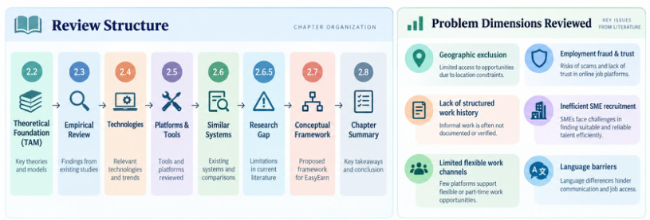

_Figure 2.1: Literature Review Overview of EasyEarn_

## 2.2 Theoretical Framework

A theoretical framework is the conceptual underpinning for the design decisions that are made for a research project, and the outcomes of the research project are evaluated [27]. For a technology development project like EasyEarn, the theoretical part should explain why users accept or reject a digital platform and how design decisions can be taken to maximise the adoption and usability of a digital platform. This section introduces the TAM as the main theoretical model, discusses its applicability and limitations in the gig economy context and elucidates its use across the design of EasyEarn.

### 2.2.1 The Technology Acceptance Model (TAM)

The TAM was first presented by Davis [26] as a model to explain and predict the use of the Information System by users. The model used in this study is the most recent revision of the original TAM [26], which adds and removes other factors from the original model but keeps the same two constructs of Perceived Usefulness (PU) and Perceived Ease of Use (PEOU) throughout the study. TAM has been developed from the Theory of Reasoned Action (TRA) developed by Ajzen and Fishbein [28], which states that people's behaviour is first influenced by their behavioural intention, and this behavioural intention is influenced by their attitude and subjective norm. In the context of information technology adoption, Davis [26] modified the TRA, which has two major factors for user acceptance:

- PU: the extent to which an individual thinks that the use of a specific system would be useful in accomplishing a task or attaining a goal.

- PEOU: the ease of use a person thinks a system will be to use.

The original TAM model proposed by Davis [26] is shown in Figure 2.2, where the two major determinants are shown to lead to attitude and behavioural intention, which in turn lead to the use of the system. All platform features are designed to enhance perceptions of usefulness and/or ease of use for the intended user group, and this pathway lies at the heart of all feature design decisions for EasyEarn.

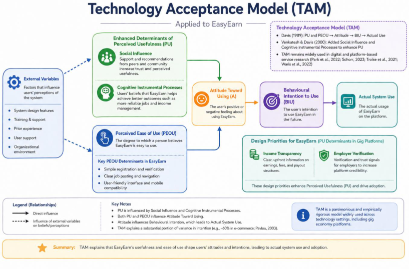

_Figure 2.2: The Original Technology Acceptance Model (TAM)_

As shown in Figure 2.2, PEOU also has a direct influence on PU, with ease of use being a determinant of a user's sense of usefulness of a system [26]. Other external factors, such as system design characteristics, training and experience, also play a role in both constructs.

Davis [26] found that both PU and PEOU had an impact on a user's attitude toward using a system, which in turn had an impact on a user's Behavioural Intention to Use (BIU), which ultimately had an impact on a user's system use. Venkatesh and Davis [29] expanded the original model to include additional factors that can impact PU, namely social influence and cognitive instrumental processes, to further enhance the model's predictive power of enterprise system adoption. Another framework is the Unified Theory of Acceptance and Use of Technology (UTAUT) [30], which is a consolidated theory of 12 models, including TAM, but TAM continues to be the most frequently used because of its parsimony and empirical rigour [31].

The current studies on the digital platform continue to employ the TAM approach, demonstrating its applicability in the context of digital transformation (DT) [32], [33]. In digitalisation studies, PU and PEOU are the two most important predictors for technology adoption. Platform-based services have also been studied to determine their suitability for the study of online service adoption, as done by Troise et al. (2021), which additionally tested platform-based services and confirmed their applicability for the study of online service adoption, thus making them suitable as a theoretical framework for EasyEarn.

TAM is well tested in various technology settings, such as online employment sites, online e-commerce applications and mobile applications. Pavlou [34] used TAM in the context of e-commerce and found that nearly 60 per cent of the variance in users' intentions to make transactions on the Internet could be accounted for by trust, PU and PEOU. However, in the context of the gig platforms, ease of registration and the interpretability of job posting interfaces were the most important PEOU determinants of gig worker platform adoption, whereas income transparency and employer verification were the most significant PU determinants [35]. These findings guide the application of TAM to EasyEarn in the next section.

### 2.2.2 Application of TAM to EasyEarn

EasyEarn has three user roles: Job Seeker, Employer and Admin. However, the application of TAM in this section focuses mainly on the two primary end-user groups, Job Seekers and Employers, because they directly use the platform for job searching and recruitment activities.

For job seekers, PU is delivered through functionality that directly affects their job search: location-based job searches save them time deciding where they can find jobs that are relevant to them; the Work History Dashboard and Auto-Generate Resume provide a way for job seekers to create and display a professional, verifiable record; and the bi-directional Rating and Review System helps job seekers show their reliability to potential employers. The inability to establish a portable professional identity and the lack of trust mechanisms through informal means are two of the major structural barriers identified by Graham et al. [12] and Corten et al. [10], respectively, which are directly targeted in these features. PEOU for job seekers is realised through the mobile-responsive web design of the platform, which ensures that it is accessible to non-English-speaking users through Google Translate Integration, and the rule-based chatbot, which allows for guidance on navigating the platform 24/7 [15].

For employers, PU is supported by the centralised job posting and applicant management functions, which allow recruitment activities to be managed within one platform. The Employer Verification Badge helps Job Seekers identify employers whose verification has been approved, while the Report and Flag System provides users with a structured channel to report suspicious accounts, job listings or other concerns. PEOU for employers is supported through the CRUD-enabled job posting interface, Application Status Timeline and consistent platform navigation.

_Table 2.1: TAM Application to EasyEarn Features by User Group_

|**Feature**|**User Group**|**PU**|**PEOU**||
|---|---|---|---|---|
|Location-Based|Job Seeker|Helps users narrow job|Easy-to-use|filter interface;|
|Job Search||opportunities by location|mobile-frien|dly design|
|Work History|Job Seeker|Constructs a credible|Records jobs|that have been|
|Dashboard||professional identity|completed|and auto-|
|||[12]|populates (visualisatio|the chart n)|

|Auto-Generate|Job Seeker|Produces a|Generates the PDF from|
|---|---|---|---|
|Resume||downloadable PDF for job applications|stored profile and work history data using jsPDF.|
|Bidirectional|Both|Provides reputation|A simple 1-5 star interface|
|Rating System||information that can support trust between users[10]|and an optional written review|
|Employer|Employer|Raising the level of|The badge is displayed on|
|Verification||confidence of the|the profile, and it is|
|Badge||applicant and the quality of the application|automatically added by the admin|
|CRUD Job|Employer|Centralises all aspects of|Structured form that has an|
|Posting Dashboard||the recruitment process|expiry date with category selection|
|Google|Both|Overcomes language|Redirects users to Google|
|Translate||barriers for non-English|Translate to access translated|
|Integration||speakers[15]|versions of the EasyEarn page.|
|Rule-Based|Both|Automated support and|Conversational interface; no|
|Chatbot||Frequently Asked Questions (FAQ) help 24/7|registration required to use|

EasyEarn's features are shown in Figure 2.3 to either address PU or PEOU for both Job Seekers and Employers.

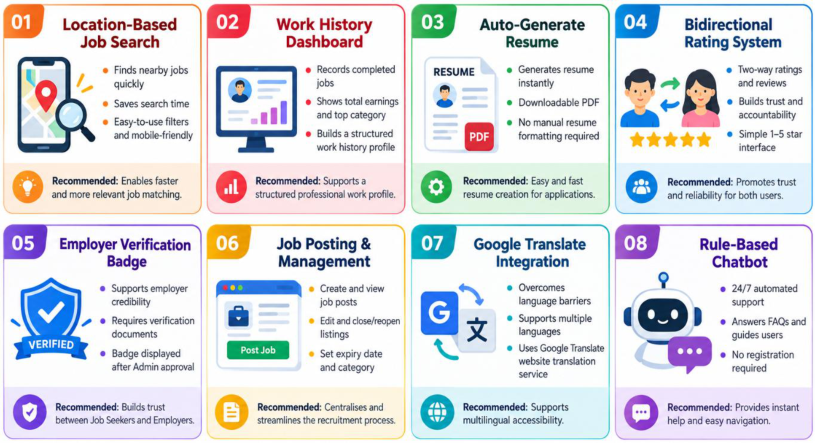

_Figure 2.3: Application of TAM_

### 2.2.3 Limitations of TAM and Supplementary Considerations

TAM is a comprehensive and empirically proven model for predicting technology adoption, but some scholars have pointed to its limitations in gig platforms. However, Bagozzi [36] noted that the TAM model is a simplified approach to understanding human adoption of technology because it fails to account for social and emotional factors, which play important roles in technology adoption, especially when there is a high level of trust, a high level of perceived risk, and the presence of strong norms. Gefen et al. [37], in the context of online shopping, demonstrated that trust can be integrated with TAM to help explain users' acceptance of online systems alongside PU and PEOU.

To address this limitation, EasyEarn supplements the TAM framework with trustrelated considerations adapted from Gefen et al. [37]. In EasyEarn, trust is considered alongside PU and PEOU through features such as the Employer Verification Badge, Report and Flag System, and Bidirectional Rating and Review System. These features are intended to provide users with clearer trust and reputation information when interacting on the platform. In this way, trust-related factors are incorporated into the theoretical framework used to guide the design of EasyEarn [34], [37].

Figure 2.4 illustrates how trust-related considerations are incorporated alongside PU and PEOU in the theoretical framework used for EasyEarn.

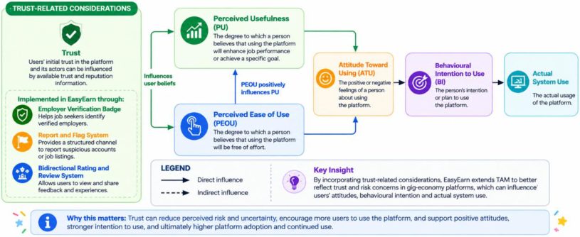

_Figure 2.4: Limitations of TAM and Supplementary Considerations_

## 2.3 Empirical Review

This section summarises empirical studies which are pertinent to the six problems outlined in Chapter 1 of this study. The empirical review brings together work from academic studies, government reports and research from international organisations to build up an evidence base which underpinned EasyEarn's design.

### 2.3.1 The Gig Economy in Malaysia

The gig economy has been growing in significance over the past few years, offering nontraditional and flexible employment opportunities to workers. According to the World Bank [1], there are over 545 online labour platforms, with an estimated 154 million to 435 million workers engaged in online gig work globally. Recent literature also highlights a range of socioeconomic issues, such as access to employment, gig-worker protection and differences among categories of gig workers. A systematic literature review and bibliometric analysis of 510 gig-economy studies conducted by Hu [38] identified these areas as important themes in current gig-economy research.

Gig work has grown in Malaysia as digital platforms have gained traction and individuals increasingly seek alternative sources of income. Abd Samad et al. [3] identified flexibility and supplementary income as important motivations for gig-economy participation, alongside relatively low barriers to participation. More recent research by Mohd Hed and Rosli [4] also found that flexibility, autonomy, financial factors, inclusivity and skill diversification influence Malaysian youths' participation in the gig economy.

According to Malay Mail [5], citing MDEC's internal analysis, Malaysia's gig economy market size reached approximately RM1.33 billion in Q3 2023, equivalent to about 80% of the RM1.63 billion recorded for the whole of 2022. More than 100,000 new individuals were participating in and earning income through gig-economy platforms as of Q3 2023, while more than 140 gig-economy platforms had been validated by MDEC and the Ministry of Communications and Digital.

Despite this growth, access to structured short-term work opportunities remains concentrated in certain areas. GoGet states that its workers are mainly available in Klang Valley, Penang, Negeri Sembilan and Johor Bahru [6]. This suggests that the availability of structured gig-work opportunities may vary geographically, particularly for users outside the platform's main service areas.

Before the Gig Workers Act 2025 came into force, the legal status and protection of gig workers in Malaysia had been identified as an area requiring clearer legal recognition and protection [39]. The regulatory environment surrounding gig employment in Malaysia has also changed significantly. The Gig Workers Act 2025 (Act 872) establishes a formal legislative framework covering matters such as service agreements, gig workers' rights, social protection and dispute resolution [17]. The Act came into force on 31 March 2026 and was reported to provide legal safeguards for approximately 1.64 million individuals involved in Malaysia's gig economy [40]. The Ministry of Human Resources also identifies the legislation as the Gig Workers Act 2025 (Act 872), while its implementing regulations specify 31 March 2026 as the commencement date.

These developments highlight the increasing significance of gig work in Malaysia and the need for more structured and accessible short-term employment opportunities. EasyEarn responds to this context by providing a web-based platform for short-term, part-time and freelance jobs, with particular attention to users who may have fewer structured gig opportunities in less-serviced areas.

Figure 2.5 gives an overview of the gig economy in Malaysia, its development, the motivations for gig work and the ongoing need for greater access to structured employment opportunities.

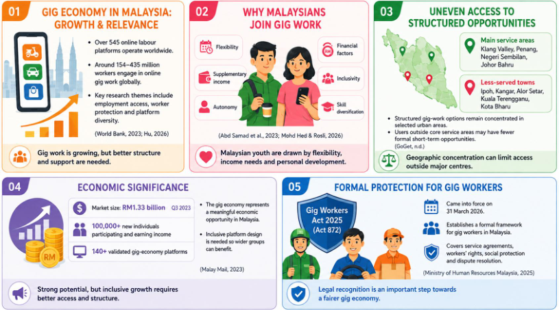

_Figure 2.5: Malaysia’s Gig Economy Landscape_

### 2.3.2 Employment Fraud and the Risks of Informal Job-Seeking Channels

Fraud relating to employment has become a growing problem for people looking for a quick job on social media and messaging apps online. In 2025, the total number of job scam incidents reported to the Royal Malaysia Police [8] was 8,911 part-time job scam cases, an increase of 144% from 2024, resulting in RM222 million in losses. Some of the common tricks were highpaying jobs for simple tasks, asking for advance payments or fund transfers via WhatsApp, Telegram, and other apps.

Social media is a popular way to search for jobs, especially for individuals looking for work online. Randstad Malaysia [7] reported that 47% of respondents who intended to switch jobs planned to use social media channels such as Facebook and WhatsApp. Randstad also advised employers to promote job openings through trusted channels, such as official company websites and reliable job search platforms, due to the risk of fraudulent digital job advertisements  [7].

Trust and reputation mechanisms can help diminish uncertainty between workers and employers, and also work in favour of digital labour platforms. Corten et al. [10] carried out an experiment using 180 actual clients across five gig-economy platforms that revealed that reputation information had an impact on trust in workers. When ratings were connected to the same task, they were especially helpful, indicating that reputation information could provide a signal of credibility when users have a limited amount of pre-existing information about each other.

Also, formal procedures for addressing and reviewing worker concerns are crucial in digital labour systems. The FareShare project was created by Rao et al. [41] to support the rideshare workers who have been impacted by the platform deactivation or loss of income. The 178 worker account sign-ups in a 3-month field deployment revealed the need for structured recourse processes and a need for trust, consent and accountability in high-stakes digital labour platforms.

EasyEarn mitigates these trust and safety issues with the Employer Verification Badge, Report and Flag System, and Bidirectional Rating and Review System. The Employer Verification Badge adds another layer of credibility for Job Seekers before engaging with an Employer and the Report and Flag System enables suspicious job postings or Employers' activity to be reported to Admin for review. The Bidirectional Rating and Review System also allows Job Seekers and Employers to give feedback upon completion of the work, for further reputation data that can be used in future job decisions.

The risks and necessary trust and safety mechanisms that are in place to mitigate these risks in EasyEarn are summarised in Figure 2.6.

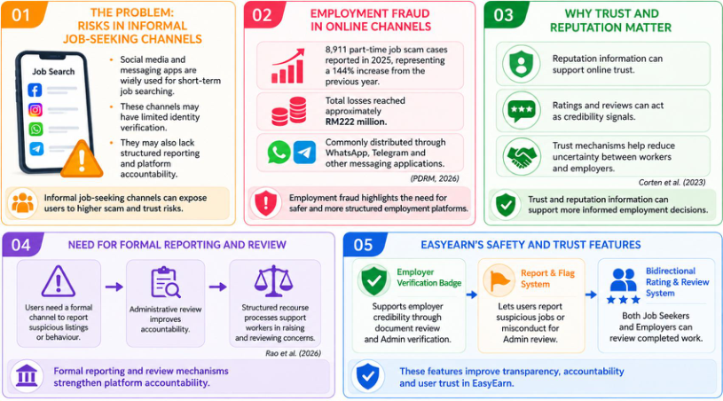

_Figure 2.6: Risks of Informal Gig Channels and Solutions_

### 2.3.3 The Absence of Verifiable Work Histories for Gig Workers

One of the consistent problems with gig work is that it is difficult to have a structured, portable, and suitable means of showing workers their employment experience. In traditional work, employers often keep employment contracts, payslips, employer references etc, whereas gig workers may have several short-term work engagements with different employers without building up a track record of their skills, performance and employment history. One of the challenges for platform workers in emerging economies that Graham et al. [12] noted was the lack of ability to construct a portable professional identity.

Newer research also supports the benefits of workplace-based information in helping workers on non-traditional career trajectories. Hsieh et al. [42] conducted a seven-day field study with 16 active gig workers from three different platforms and work domains. The study revealed that the exchange of work-related information facilitated financial reflection, work planning and working together among employees. This suggests the potential for structured work data to improve gig workers' understanding and management of their working lives.

Hui et al. [43] also reported that traditional credentials and work histories are more often preferred by employment platforms, which can make it challenging for people with informal and non-traditional work histories to showcase their assets to a potential employer. They emphasise the need for a person to be able to articulate "non-traditional" experiences in an employment setting and to recognise the transferable strengths of such experiences. This is especially true for gig workers who could be working for various short-term companies without combining their experience into one.

This is also confirmed by recent empirical studies. Based on the data from the China General Social Survey (2015-2021), Wang et al. [44] found that in the gig economy, labourmarket outcomes become more dependent on the work experience of individuals, whereas their traditional education becomes less important. The research also highlights the continuing importance of work experience in gig-economy employment outcomes.

Reputation data also plays a role in the job and platform transitions of workers. In an experiment with 180 real clients of five gig-economy platforms, Corten et al. [10] looked into the effects of worker ratings on online trust. The study also highlighted limitations in transferring reputation information across different platforms.

To solve this problem, EasyEarn addresses it through the Work History Dashboard, Auto-Generate Resume, and Rating and Review System. The Work History Dashboard keeps track of completed jobs, earnings and ratings, while the Auto-Generate Resume feature converts the recorded work history into a downloadable PDF resume. The Rating and Review System also includes reputation data linked to completed work, enabling Job Seekers to gradually build a more structured digital employment profile.

The structural problem of lack of verifiable work histories with gig workers and the economic consequences of this lack are summarised in Figure 2.7.

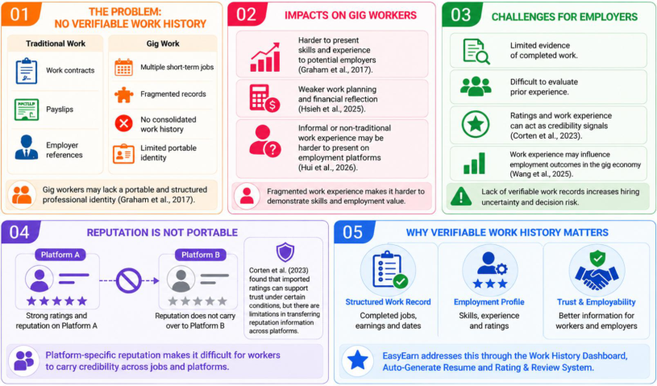

_Figure 2.7: The Absence of Verifiable Work Histories of Gig Workers_

### 2.3.4 Language Barriers and Digital Exclusion in Malaysian Gig Platforms

The accessibility of language is one of the critical factors to take note of in digital employment platforms, especially in a multilingual nation like Malaysia. Users in Malaysia may have different levels of proficiency in Bahasa Melayu, English, Mandarin and Tamil, which can affect their understanding of job information and use of digital services.

UNCDF [15] highlighted the importance of local-language accessibility for low- and middle-income users of digital platforms.  This is especially true of employment platforms, as language barriers can limit the understanding of the job requirements, instructions for the platform and job-related information.

Further research in Malaysia shows the significance of inclusive access to gig work, as published in more recent studies. Mohd Hed and Rosli [4] conducted a study on 385 gig economy youth participants in Malaysia and found that inclusion and technological access are factors affecting gig economy participation. According to their results, use of digital platforms is an important factor in the ability of Malaysian youth to access flexible jobs.

The multi-lingual digital resources are also reinforced by the recent international evidence. Based on survey results from 4,217 respondents in 6 European countries, Saulītis [16] concluded that there was a high level of acceptance of web content in local language, as well as some differences between the various demographic and linguistic groups regarding their satisfaction with machine translation technologies. The study shows the usefulness of multilingual resources in creating digital accessibility and usability, especially for users who might not feel at ease using English-dominant online services.

The results are applicable to EasyEarn as it caters to individuals with various linguistic backgrounds in Malaysia. EasyEarn addresses this issue through Google Translate Integration, allowing users to access translated versions of the current page in languages such as Bahasa Melayu, Mandarin and Tamil. Machine translation is not an alternative to fully localised content but another tool to make the platform available to users who are interested in using it in another language.

This is shown in Figure 2.8, which presents the language access issues that have been discussed in the literature, and EasyEarn's multilingual approach to language support.

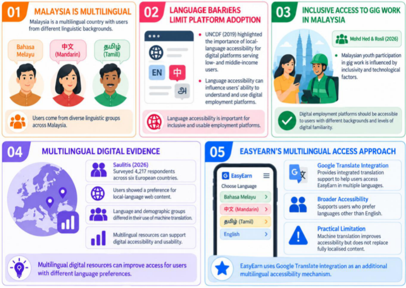

_Figure 2.8: Language Accessibility_

### 2.3.5 Flexible Work and Underserved Demographics

Short-term and flexible work can be a way to offer employment for people who may not be able to commit to a full-time job, such as university students, housewives or unemployed people. These groups may need special employment conditions that can be flexible to academic and family needs or changing personal situations. Abd Samad et al. [3] found flexibility and additional income to be significant motivations for gig work among the respondents in Malaysia.

A more recent piece of Malaysian evidence confirms the significance of flexible employment for young people. Mohd Hed and Rosli [4] conducted a quantitative study on 385 youth gig workers in Kuala Lumpur and identified some factors that encouraged youth to engage in gig work, such as flexibility, autonomy, inclusivity, technological advancement and skill diversification. Their study reveals that the decision to take on gig work is not simply about economic constraints but also about flexibility and avenues for personal and professional growth.

Uchiyama and Furuoka [45] examined 85 young app-based gig workers across 11 Malaysian states through semi-structured interviews. The study found that young gig workers flexibly combined employment and self-employment while facing regulatory ambiguity and unclear labour status. This further shows the changing role of gig work in youth employment in Malaysia.

The experiences of other developing countries also show that flexible gig work can be particularly important for individuals with multiple responsibilities. Sarker et al. [46], in a quantitative survey of 443 gig workers in Bangladesh, found that work flexibility was an important motivation for participating in digital work, particularly among women. The study also found that work-life balance and income were positively associated with job satisfaction, while difficulties such as unstable networks and complicated payment systems reduced job satisfaction.

International Labour Organisation (ILO) [2] has previously linked digital labour platforms in Southeast Asia to key areas like rideshare and food delivery. These forms of platform work may not suit all users seeking flexible employment, particularly those who prefer non-transport-based short-term jobs. There are also temporary job openings for individuals looking for work in roles like event staffing, retail work, tutoring or administrative support. A more diverse short-term employment platform can thus offer other employment opportunities for individuals who have schedules and/or situations that are better suited to other forms of employment.

EasyEarn tackles this need by offering part-time, freelance and short-term job postings in various job categories. Availability and preference filters help Job Seekers focus on jobs that align with their availability and preferences, and application management equips them with a structured application system to keep track of temporary job opportunities.

The flexible employment needs of underserved groups and the ways in which shortterm job platforms can contribute to broader gig work participation are shown in Figure 2.9.

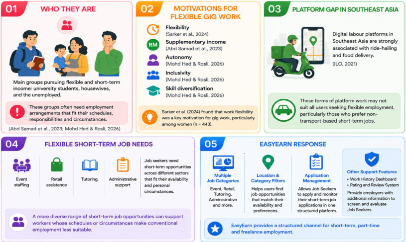

_Figure 2.9: Flexible Work and Underserved Demographics_

### 2.3.6 Inefficient SME Recruitment and Short-Term Hiring Challenges

Short and temporary staffing requirements for SMEs may be challenging when businesses need to recruit workers for events, retail support and administrative tasks. Digital work platforms can provide small businesses with access to external labour and more flexible workforce arrangements [14].

New studies illustrate the benefits of digital work platforms for small companies that lack resources and capabilities. Gusenbauer et al. [14] interviewed 19 chief executive officers (CEOs), founders, and managers of small and micro businesses in Austria and Germany qualitatively. The research revealed that the primary purpose businesses have for using digital work platforms like Upwork and Fiverr is to secure external resources and to rationalise spending. These platforms also reduced the cost and hassle of outsourcing by offering features that enabled trust and minimised extra coordination that would be needed to discover and handle outside workers.

Additionally, Gusenbauer et al. [14] discovered that digital workers offer small businesses higher versatility in coping with momentary labour shortages and fluctuating workloads. Reputation information was also a key part of the selection process, as enterprises took into account price as well as previous ratings when assessing potential freelancers. The results show how a structured digital platform can help small businesses to have more efficient access to external labour, as well as information that helps workers evaluate themselves.

The findings of the study by Gusenbauer et al. [14] apply to the issue of short-term employment in Malaysia, as digital outsourcing in Austria and Germany, when conducted by smaller companies, is a way to gain access to workers on a flexible basis. EasyEarn follows this principle in the local employment situation in Malaysia, where SMEs and individual employers can post job opportunities for a limited period of time and run the application process through a defined process on a platform.

EasyEarn alleviates these recruitment problems with the following features: Employer Dashboard, Job Posting and Management functions, applicant management and the Application Status Timeline. Employers can post and track short-term job opportunities and profile the applicants in one system. The Work History Dashboard and Rating and Review System also give employers extra details on Job Seekers' past work and reputation in helping to screen applicants.

The challenges to recruitment in the short term for SMEs and the structured recruitment process provided by EasyEarn are summarised in Figure 2.10.

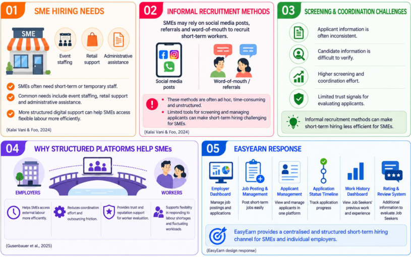

_Figure 2.10: Inefficient SME Recruitment and Short-Term Hiring Challenges_

### 2.3.7 Synthesis of Empirical Evidence

The empirical literature that has been covered in Sections 2.3.1–2.3.6 covers various aspects of gig work and digital employment. Table 2.2 brings together six recent studies in order to identify common findings and limitations in the literature in relation to the research context, main contribution, relevance to EasyEarn and remaining limitations. The comparison helps to detect recurrent deficiencies and serves as a basis for the system design for EasyEarn.

_Table 2.2: Synthesis of Empirical Evidence_

|**Paper**|**Focus** **/** **Context**|**Key** **Contribution**|**Relevance** **to** **EasyEarn**|**Limitation** **Weak Point**|**/** |
|---|---|---|---|---|---|
|**Mohd Hed &**|385 Youth|Determined|Enables flexible|Focuses on|Kuala|
|**Rosli** **[4]**|were employed|flexibility,|short-term|Lumpur|youth|
||as gig workers in Kuala|autonomy, inclusivity,|employment for Malaysian users.|rather than in seco|users ndary|
||Lumpur,|technology and||towns and|does|
||Malaysia.|skill||not examin|e an|
|||diversification as reasons for gig participation.||integrated platform.|job|
|**Hsieh et al.**|16 gig workers|Work-data|Implements a|Lacks abili|ty to|
|**[42]**|across three platforms/work domains.|sharing was structured, which facilitated financial reflection, planning and mutual support.|Work History Dashboard and/or structured work history records.|match local verify employers provide multilingual access.|jobs, with and |
|**Corten et al.**|180 clients of|Showed how|Implements a|Focuses m|ainly|
|**[10]**|five gig platforms.|ratings can contribute to|rating and Review System|on reputatio trust rather|n and than|
|||online trust and explored some of the barriers to the transfer of reputation.|and reputation records.|employer verification, reporting or job access.| local|
|**Gusenbauer**|19 executives|Digital work|Supports|Not local,|short-|
|**et al.[14]**|from small/micro enterprises in|platforms enhanced access to resources, cost optimisation,|structured access to external labour for small enterprises.|term recruit focused, an Malaysia-sp|ment- d not ecific.|

||Austria and|trust|and||||
|---|---|---|---|---|---|---|
||Germany.|flexibility small enterp|for rises.||||
|**Saulītis[16]**|Multilingual users of digital|Analysed multilingual||Facilitates multilingual|Not specific employment|to|
||resources from|resources,|the|accessibility and|platforms or|the|
||six European countries|usage satisfaction|and of|EasyEarn's Google|Malaysian population.||
|||machine||Translate|||
|||translation.||method.|||
|**Hernandez et**|25 U.S.-based|Highlighted|how|Supports the|Concentrates|on|
|**al.[47]**|gig drivers in rideshare and|gig workers their|adapt work|importance of considering|U.S. rideshare delivery work|and ers,|
||delivery work.|practices to|local|local context in|instead of|job|
|||geographic,||platform design.|matching|in|
|||market|and||secondary to|wns|
|||infrastructur conditions.|al||in Malaysia.||

The synthesis reveals that the current research focuses on key issues surrounding gig work, such as flexibility, data related to gig work, reputation, opportunities for small businesses, multilingualism and local context. Most of these issues, however, are studied individually and not via a single integrated digital employment platform. Within the literature and systems reviewed in this study, no single platform was identified that combines local short-term job access, employer trust mechanisms, structured work history, multilingual accessibility and SME recruitment support for secondary-town users in Malaysia. This shows a gap in the existing research and systems, which EasyEarn aims to address by combining these functions in one web-based job-matching platform.

## 2.4 Review of Relevant Technologies

In this section, the basic front-end and client-side technologies that comprise the technical backbone of EasyEarn are discussed. Each technology is compared to academic literature and to believable alternatives to select them in the context of a solo-developer academic project.

### 2.4.1 Web-Based Application Development

HTML5, CSS3 and JavaScript are the backbone of today's Web application development. Mozilla Developer Network (MDN) Web Docs [48] explain that HTML5 offers the semantic structure, CSS3 offers the presentation, and JavaScript offers the interactivity of the content, without requiring anything on the server side. This is because the choice of the technology stack for software development needs to be based on several criteria: ease of maintenance, developer familiarity, ease of deployment, and technology suitability in the context of EasyEarn's academic domain, which this combination achieves.

In comparison to modern front-end frameworks like React, Angular, and Vue.js, plain JavaScript has fewer layers of dependency, is less complex with build tools and offers a clearer code structure, which is more suitable for a student-driven academic project that will be evaluated and moderated [48]. For a single-developer project deployed through GitHub Pages, frameworks such as React may introduce additional dependencies and build-process complexity that are not necessary for the current project scope. EasyEarn's feature set and ease of maintenance will thus be a compromise between HTML, CSS, and JavaScript, with the latter being prioritised due to the academic nature of the project and the limited resources of the sole developer.

With responsive web design, using CSS3 media queries and a flexible grid, EasyEarn will be accessible through both desktop and mobile browsers without requiring a native application. This is important because EasyEarn is intended to remain usable across different screen sizes and device types.

Figure 2.11 shows the rationale behind the web-based technology stack that EasyEarn has: a contrast between using JavaScript and using modern web frameworks, as well as deployment benefits.

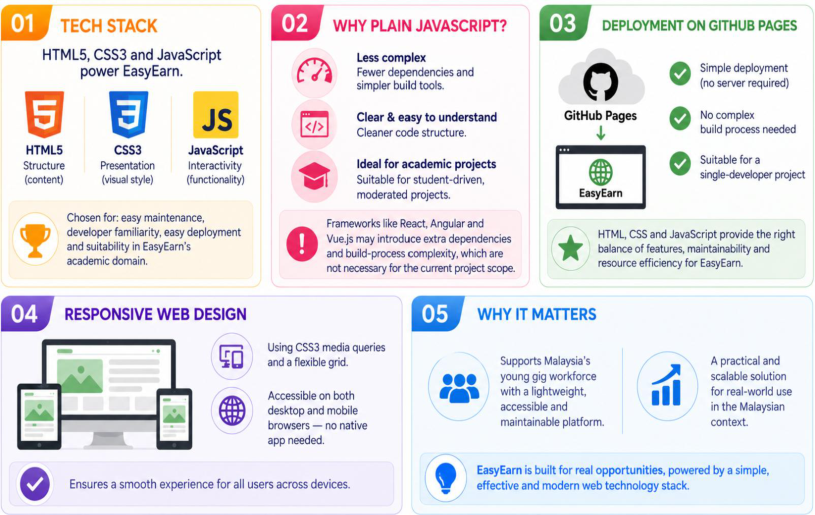

_Figure 2.11: Web-Based Application Development_

### 2.4.2 Client-Side PDF Generation via jsPDF

The jsPDF library is a free JavaScript library that creates PDF files directly in the browser, instead of having to process the files on the server or make extra API calls [49]. EasyEarn's Auto-Generate Resume feature uses jsPDF to create a downloadable PDF resume directly from the Job Seeker's stored profile and work history data.

While server-side solutions such as wkhtmltopdf, Puppeteer and Python's ReportLab provide better typographic control and support for complex layouts, they require a dedicated backend process, which is not available in EasyEarn's GitHub Pages deployment [50]. The advantages of using jsPDF are that it runs entirely within the browser, can be used alongside the Supabase JavaScript Client Library, and does not require additional server infrastructure, making it suitable for the current project scope [49].

In Figure 2.12, the client-side approach for creating a PDF is illustrated with the help of the jsPDF library and is contrasted with server-side approaches.

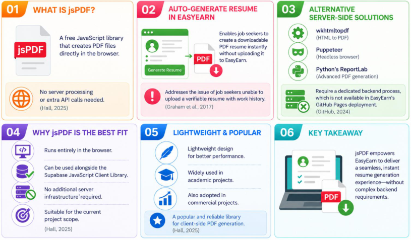

_Figure 2.12: Client-Side PDF Generation_

### 2.4.3 Data Visualisation via Chart.js

Chart.js is an open-source JavaScript charting library that creates interactive and responsive data visualisations using the HTML5 canvas element [51]. EasyEarn uses Chart.js to present the completed jobs count, along with their total earnings and distribution by job type in the Work History Dashboard, and to provide platform-wide totals of registered users, completed jobs, active job postings, applications submitted and successful job matches in the Admin Analytics Dashboard.

Google Charts is typically loaded from Google's servers, while Chart.js can also be hosted locally within the project. Chart.js integrates directly with JavaScript data arrays and supports responsive charts, making it suitable for EasyEarn's deployment and current project requirements. The data visualisation approach is illustrated in Figure 2.13, together with other alternatives considered for the project.

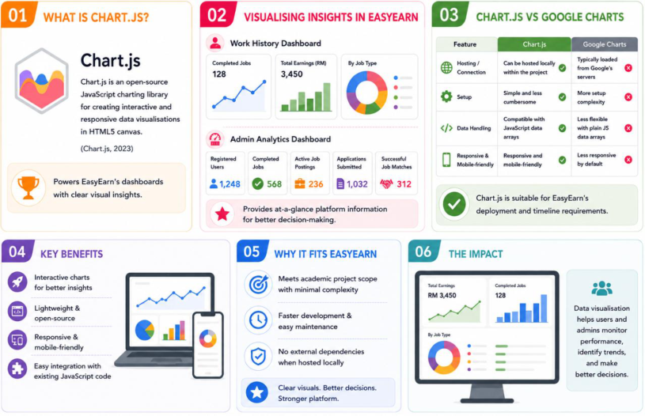

_Figure 2.13: Data Visualisation_

### 2.4.4 Multilingual Accessibility: Google Translate Integration

UNCDF [15] emphasises that multilingual accessibility is one of the key factors in enhancing the digital inclusion of users with different language backgrounds in Malaysia. There are several options for enabling multilingual support in a web application: Using a native translation API like Google Cloud Translation, using pre-translated static content, or redirection to the Google Translate webpage. Google Cloud Translation provides automatic translation through an API and can be integrated into web applications [25]. However, this approach was not selected for EasyEarn because it involves usage-based costs and additional API integration requirements, which were outside the scope of the current academic prototype.

DeepL [52] was also considered; however, the language coverage described in the reviewed source did not fully align with EasyEarn's intended multilingual requirements. For this reason, EasyEarn employs the website redirection mechanism of Google Translate [53], in which the current EasyEarn page is redirected to the Google website for translation. This approach avoids the need to integrate a native translation API while still providing users with access to translated versions of the current EasyEarn page.

As shown in Figure 2.14, there are multiple ways of making web pages accessible to people with multiple languages that were considered for EasyEarn, and Google Translate Integration was chosen for the current system.

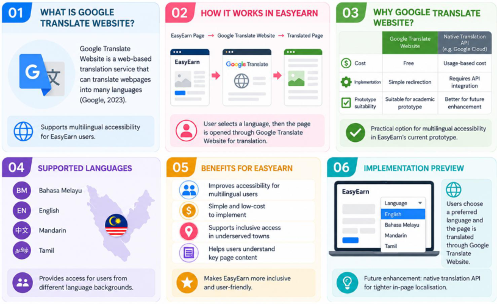

_Figure 2.14: Multilingual Accessibility_

## 2.5 Review of Selected Tools and Platforms

This section summarises the services, hosting platform and development tools used for EasyEarn and assesses them both academically and technically. Figure 2.15 presents an overview of the tools and platforms that were selected for EasyEarn, including the Supabase relational database features and their comparison with Firebase, the GitHub Pages workflow for static hosting, and the Canva wireframing method based on Nielsen's heuristics for usability.

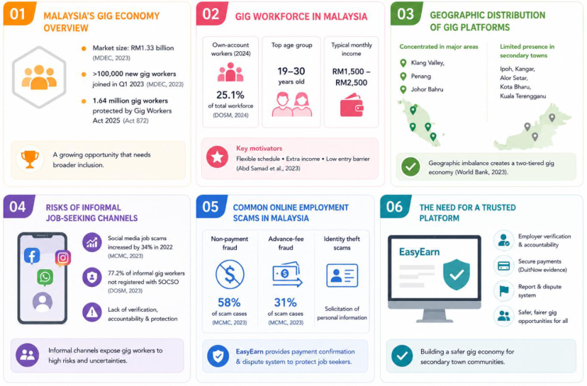

_Figure 2.15: Review of Selected Tools and Platforms_

### 2.5.1 Supabase: Open-Source BaaS

BaaS is a cloud service model in which backend infrastructure, such as database management, authentication and API provision, is provided through a managed third-party service [18]. Developers do not need to configure and maintain a dedicated server, but instead work with the backend utilising a pre-built API client, which removes a lot of the overhead of infrastructure administration. For EasyEarn, this model reduces the need to configure and maintain a dedicated application server, making it suitable for the scope and resources of a single-developer academic project.

Supabase is an open-source BaaS platform that includes a relational database, tokenbased authentication through JSON Web Tokens (JWTs), real-time capabilities, a JavaScript client library and RLS policies [18]. It is touted to be an open-source alternative to Firebase, Google's proprietary BaaS. The most notable difference between Supabase and Firebase is the models of their databases. Firebase stores data in Firestore, a NoSQL document-oriented database that is optimised for hierarchical and schema-flexible data. Supabase is based on PostgreSQL, a full-featured relational database that supports foreign key (FK) constraints, JOINs, and declarative schema design [18]. EasyEarn's data model contains relational relationships among users, job postings, applications, ratings, and work history records, and it is a more natural data model to be expressed in a relational schema.

EasyEarn's requirement for role-based access is also important to note and is well-suited to Supabase's RLS policies. One of the great features of RLS is that it supports access control policies at the database level, meaning that job seekers can only view their own application data and employers can only update their own jobs, without having to implement extra middleware logic [18]. These RLS policies provide database-level access control and help restrict access to records based on user roles and ownership. This supports EasyEarn's approach to protecting user data, although it does not constitute formal compliance certification under Malaysian legislation.

### 2.5.2 GitHub Pages: Static Site Hosting

GitHub Pages is a static website-hosting service that can publish a website directly from a GitHub repository using HTTPS [50]. Other hosting alternatives include Netlify, Vercel and Firebase Hosting. Since EasyEarn uses a static HTML, CSS and JavaScript frontend that communicates with Supabase as its backend service, GitHub Pages provides the hosting functions required for the current project scope.

GitHub Pages was selected because it integrates with the project's GitHub repository, supports HTTPS and allows the static EasyEarn frontend to be deployed without maintaining a dedicated application server [50]. It also fits the project's existing version-control and iterative development workflow.

### 2.5.3 Canva: User Interface (UI)/ User Experience (UX) Wireframing and Prototyping

Canva is used to create wireframes and prototypes for EasyEarn. Canva allows for easy visualisation of dashboards and user flow diagrams before HTML implementation; it is capable of drag-and-drop interface design and template-based layout creation, making it well-suited for visualisation of role-based dashboards and user flow diagrams before HTML implementation [54]. The EasyEarn wireframes were designed with reference to Nielsen's [55] usability heuristics, including visibility of system status, error prevention, user control and freedom, and consistency and standards. These principles influenced features such as the Application Status Timeline, Chatbot interface and role-based navigation.

## 2.6 Review of Similar Systems

Existing job-matching platforms are analysed across three categories: full-time job portals, domestic task-based gig platforms and international gig platforms to be considered as comparators to EasyEarn. The analysis is aggregated and presented in a comparative feature gap table.

### 2.6.1 Full-Time Employment Portals: JobStreet and RiceBowl

JobStreet and RiceBowl are online recruitment and job search websites established in Malaysia and offer structured job search and recruitment services. Both platforms allow for job postings, employer/company profiles, job applications, and resume/profile information. Although they are commonly used for full-time employment, part-time job opportunities are also available on these platforms [56], [57].

Select trust and safety features on both platforms as well. JobStreet includes a system which enables users to report suspicious job advertisements, employer account verification, company reviews, and job advertisement reviews [58], [59]. RiceBowl also claims to be an interface between job seekers and employers who have been verified, with information about safety that is relevant to job posts, such as reporting suspicious job ads [57], [60].

The difference is that JobStreet and RiceBowl aren't the only two places that don't have any part-time jobs. On the contrary, EasyEarn is distinct as it is created for quick, adaptable work workflows. These include completed work history, auto-generated resumes from work history, location filtering, category filtering, tracking work applications and integrated trust for Job Seekers and Employers. The differences that were considered in this study are summarised in Figure 2.16.

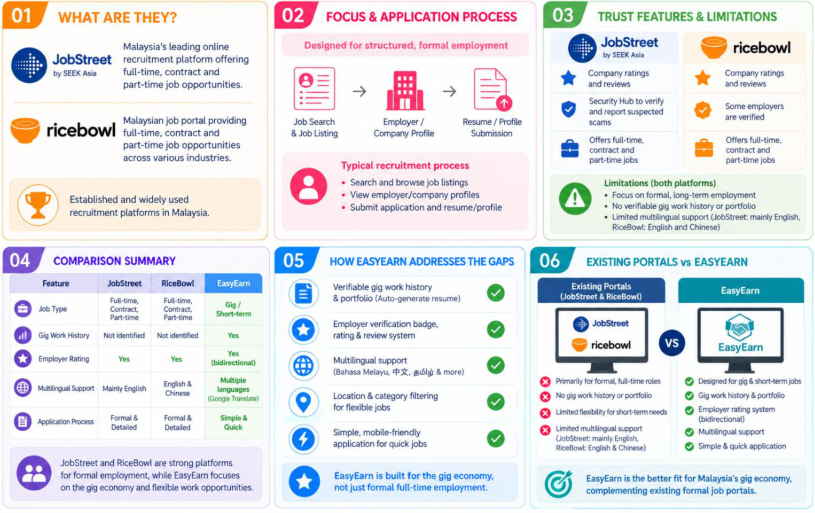

_Figure 2.16: Full-Time Employment Portals_

### 2.6.2 Task-Based Gig Platforms: GoGet and Troopers

GoGet and TROOPERS are two gig-work platforms in Malaysia offering flexible and shortterm employment opportunities. GoGet supports part-time, contract and on-demand work and employs a verification system to ensure that GoGetters work. It also includes function-related evaluations and in-app messaging among users [6]. TROOPERS offers flexible and part-time employment opportunities via its mobile platform with verified employment opportunities, identity verification of gig workers, and location-based job searching [61].

Several functions are therefore already available on both platforms that help to create trust and flexible work options. Their ways, however, are distinct from EasyEarn. The parttimer availability is largely centred on the Klang Valley, Penang, Negeri Sembilan and Johor, while the number of jobs available on TROOPERS fluctuates depending on the clients, locations and job demand. Hence, it is untrue to say that either platform lacks in off-centre urban areas. Rather, EasyEarn is created to enable job seekers and employers to search and post short-term jobs categorised by city and region in Malaysia, including the secondary towns covered in this study.

Based on the publicly available features reviewed, GoGet and TROOPERS provide their own verification, job-management and worker-support mechanisms. EasyEarn is unique because it integrates an Employer Verification Badge with a Report and Flag workflow, postcompletion Bidirectional Rating and Review system, a structured Work History Dashboard and multilingual access into the academic job-matching process. These differences are summarised below in Figure 2.17.

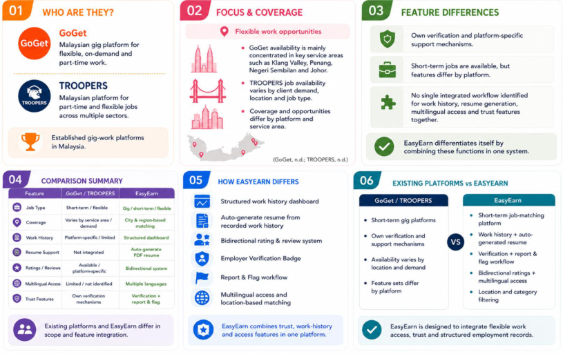

_Figure 2.17: Task-Based Gig Platform_

### 2.6.3 International Gig Platforms: Fiverr, TaskRabbit, and Upwork

Examples of international gig and freelance work are provided by Fiverr, TaskRabbit and Upwork. Essentially, Fiverr is a digital service platform where freelancers can post their services and service packages on their profiles, while clients can check ratings before booking a service [62]. Upwork provides global access to clients and freelancers via profiles, job postings, proposals, contracts, reviews and platform-managed payments [63], [64]. Unlike these online freelance sites, TaskRabbit makes it possible to get in-person services like cleaning, moving, furniture assembly, and errands [65], [66].

These platforms offer structured ways to connect workers with clients, track work and establish a reputation on the platform. But in terms of their model, they're different from the model that EasyEarn is looking for. Fiverr and Upwork are primarily freelance services marketplaces, whereas TaskRabbit relies on the availability of Taskers in the supported areas of service [62], [63], [64]. As an example, geographic availability is a critical component in local platform work, as TaskRabbit users choose Taskers based on location, availability, price and task category [67].

EasyEarn is made for fast time-period job matches in Malaysia and is enhanced with employment based mostly in cities and regions, Employer Verification, Report and Flag capabilities, Bidirectional Rating and Review, a structured Work History Dashboard, and AutoGenerate Resume, with multilingual reports and access to be had. Rather, the aim is not to copy the international platforms, but to transfer appropriate ideas from the digital labour platforms to the local situation that is being tackled in this study. This is summarised in Figure 2.18.

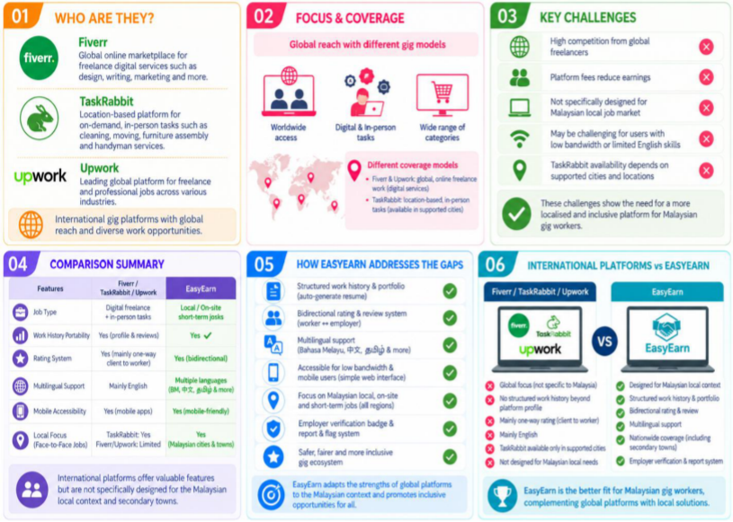

_Figure 2.18: International Gig Platform_

### 2.6.4 Comparison Feature Gap Analysis

Table 2.3 shows a comparison of EasyEarn to four selected employment and gig-work platforms in Malaysia, namely JobStreet, RiceBowl, GoGet and TROOPERS across 11 feature dimensions relevant to the identified needs in this study. Yes, No and Partial are used to indicate whether a feature was found in a public release of the platform under the same name, a similar name, or if the feature was not found at all.

_Table 2.3: Feature Comparison of Job Platforms and EasyEarn_

|**Feature**|**JobStreet**|**RiceBowl**|**GoGet**|**Troopers**|**EasyEarn**|
|---|---|---|---|---|---|
|Short-term / Gig Work Support|Partial|Partial|Yes|Yes|Yes|
|Geographic coverage is beyond major cities.|Yes|Yes|Partial|Partial|Yes|
|Verifiable Work History Profile|No|No|Partial|Partial|Yes|
|Auto-Generated PDF Resume|No|No|No|No|Yes|
|Bidirectional Rating and Review|Partial|Partial|Partial|Partial|Yes|
|Multilingual Support|Partial|Yes|No|No|Yes|
|Employer Trust Verification Badge|Yes|Yes|Partial|Partial|Yes|
|Report and Flag System|Yes|Yes|Yes|Partial|Yes|
|Rule-Based Chatbot Support|No|No|No|No|Yes|
|Offline Payment Guidance|No|No|Partial|No|Yes|
|Gig Workers Act 2025 Awareness / Design Consideration|No|No|Yes|Yes|Yes|

**Note:** The following comparison is based on the platform features that are publicly available and were identified during the period of the project review in April 2026. Not included: Features added from April 2026 onwards. Yes, Partial and No represent a complete, partial or no match to the assessed feature dimension.

Table 2.3 illustrates that the chosen platforms already offered various mixes of employment and trust/gig-work roles during the period of the review. Structured recruitment and part-time work were supported by JobStreet and RiceBowl, and flexible and gig work was supported more directly by GoGet and TROOPERS. The platforms reviewed, however, have done so in various ways and none of the selected platforms brought together all 11 feature dimensions measured in this study into one system.

EasyEarn aims to combine the 11 feature dimensions considered in this study within one academic job-matching platform: short-term job support, geographic access, structured work history, auto-generated PDF resumes, bidirectional ratings and reviews, multilingual support, employer verification, reporting and flagging, rule-based chatbot support, offline payment guidance, and awareness of the Gig Workers Act 2025.

### 2.6.5 Research Gap

There are three categories of platforms that review existing job-matching and gig-work platforms, namely Malaysian employment portals, Malaysian task-based gig platforms, and international gig platforms. JobStreet and RiceBowl are considered structured employment websites, GoGet and TROOPERS as gig-work sites in Malaysia, and Fiverr, TaskRabbit and Upwork as international digital labour platforms. The emphasis of the review is on the functionality, models, and applicability to the requirements outlined for the EasyEarn project. Section 2.6.4 presents a comparative feature gap analysis of the selected Malaysian platforms with the EasyEarn platform.

This same disparity can be seen in the comparison of currently available systems as shown in Table 2.3. JobStreet and RiceBowl make for traditional jobs; GoGet and Troopers offer more for gig and short-term jobs. Structured digital labour markets are also possible on international platforms like Fiverr, TaskRabbit and Upwork. In this study, however, we have compared features and have only found those that were relevant to the requirements we identified with EasyEarn. Within the platforms and features reviewed in this study, no single platform was identified that combined wider local job access, employer verification, formal reporting, bidirectional ratings and reviews, structured work history, multilingual accessibility and short-term recruitment support for SMEs in one system designed for the Malaysian context.

Hence, an integrated short-term job-matching platform to meet the needs of both the Job Seekers and the Employers is still under research and development, especially for those who are in the secondary towns in Malaysia. With this in mind, EasyEarn is designed to fill this gap by providing a single web-based platform that offers location-based job search, employer verification, reporting and rating, a structured digital work history, resume generation, and multilingual accessibility, short-term jobs and applicant management. This identified gap forms the basis for the design of the system, which is also represented in the Conceptual Framework in Section 2.7.

## 2.7 Conceptual Framework

A conceptual framework is developed based on the theoretical framework in Section 2.2, the empirical evidence reviewed in Section 2.3 and the research gap identified in Section 2.6.5. The framework combines TAM [26], [68] with trust-related factors from the Trust-Based Technology Acceptance Model (TBTAM) [37] to show how the EasyEarn features respond to the identified problems.

There are three layers in the conceptual framework. The first layer shows the six problem dimensions identified from the literature. The second layer shows the EasyEarn design responses linked to each problem. The third layer shows the expected outcomes based on TAM and trust factors, including PU, PEOU and initial trust. Table 2.4 presents the relationship between the problem dimensions, literature basis, EasyEarn design responses and expected outcomes.

_Table 2.4: EasyEarn Conceptual Framework_

|**Problem**|**Literature Basis**|**EasyEarn** **Design**|**Expected** **Outcome**|
|---|---|---|---|
|**Dimension**||**Response**|**(TAM / Trust)**|
|Geographic|GoGet [6];|Job search and location|Increased PU for users|
|Exclusion|Hernandez et al. [47]|filtering by geographical area.|seeking local opportunities.|
|Employment|Royal Malaysia|Employer Verification|Enhanced initial trust and|
|Fraud / Trust|Police[8]; Corten et al.[10]; Rao et al. [41]|Badge; Report and Flag System; Bidirectional Rating and Review System.|PU.|
|Absent Work|Hsieh et al.[42];|Work History Dashboard;|Increased PU through|
|Identity|Hui et al.[43];|Auto-Generate PDF|more structured work-|
||Wang et al.[44]|Resume; Rating and Review System.|related information.|
|Language|UNCDF [15];|Google Translate site|Enhanced PEOU for|
|Barrier|Saulītis[16]|redirection for|users with different|
|||multilingual access.|language preferences.|
|Inefficient|Gusenbauer et al.|Employer Dashboard; Job|Improved recruitment|
|SME|[14]|Posting and Management;|efficiency and increased|
|Recruitment||Applicant Management;|PU.|
|||Application Status Timeline.||
|Limited|Abd Samad et al.|Short-term job categories;|Increased PEOU and PU|
|Structured|[3]; Mohd Hed and|location and category|for flexible workers.|

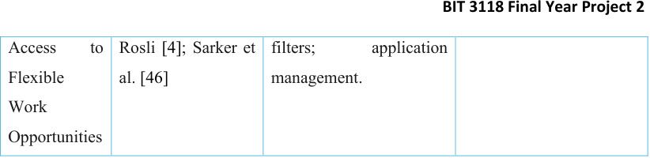

Figure 2.19 illustrates the EasyEarn Conceptual Framework, which links the six problem dimensions identified from the literature to the corresponding EasyEarn design responses and the expected TAM- and trust-related outcomes.

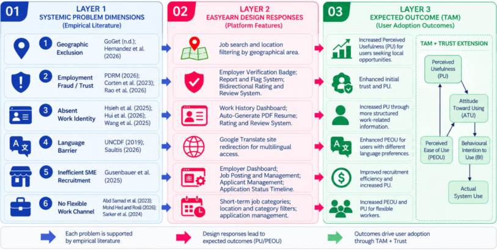

_Figure 2.19: EasyEarn Conceptual Framework_

The conceptual framework shows that EasyEarn's features are developed based on the academic and empirical evidence reviewed in this chapter. The features relate to a particular gap in the literature, and the expected outcomes relate to TAM and trust-related factors. This framework also provides a basis for evaluating the system and discussing the findings in the later stages of the project.

## 2.8 Conclusion

This chapter provides the theoretical, empirical and technical foundation for EasyEarn. The study applies the TAM [26] as the main theoretical framework and incorporates trust-related considerations from TBTAM [37] to explain user acceptance, PU, PEOU and trust in the platform.

The 6 problem dimensions identified for EasyEarn were: geographic exclusion, employment fraud and trust, lack of structured work history, language barriers, limited flexible work opportunities and inefficient SME recruitment. Recent research has highlighted the significance of local context [47], online reputation and trust (Corten et al., 2023; Rao et al., 2026), structured work-related data and work identity [42], [43], [44], multilingual accessibility [16], flexible gig participation [4], [46], and digital work platforms for small enterprises [14]. These studies generally examine these issues individually rather than as part of an integrated employment platform.

The technologies and development tools relevant to EasyEarn were also reviewed to provide a technical basis for the system. The comparison in Section 2.6 shows that the selected platforms reviewed during the project analysis period provided different combinations of the eleven feature dimensions considered in this study. However, within the platforms reviewed, no single platform was identified that combined all the dimensions in one system designed for EasyEarn's Malaysian context.

The identified research gap in section 2.6.5 therefore reinforces the need for an integrated web-based platform with a combination of: local job access, employer verification, reporting and bidirectional ratings, structured work history, multilingual accessibility and short-term support for recruitment. The problem dimensions in Section 2.7 are linked to the corresponding EasyEarn design responses and the expected TAM and trust-related outcomes. Overall, the literature reviewed in this chapter provides the basis for the research methodology, system design, implementation, testing and evaluation presented in the following chapters.

# Chapter 3: Research Methodology

## 3.1 Introduction

The research and system development methods used in the development of the EasyEarn Job Matching Portal are described in this chapter. The research methodology encompasses the method of data collection and analysis of user requirements, such as research approach, research design, population and sampling, questionnaire design, data analysis, validity, reliability and research ethics. The results of the user requirement survey are also presented and used to support the identification and prioritisation of system requirements.

The chapter then describes the Hybrid Agile-Waterfall methodology adopted in the 26 weeks of the FYP to develop the project EasyEarn. Later sections will discuss the phases of the project as well as the sprints, tools and technologies used, planning and risk management, hardware and software needed, system design, and wireframes and the resulting UI.

Figure 3.1 illustrates the overall research and system development methodology used for EasyEarn. It illustrates the process of gathering user requirements by studying user requirements collection, approach to research, research design, population & sampling, designing a questionnaire, analysis of data, validity, reliability and research ethics. It also provides a reflection of the development of the system using the Hybrid Agile-Waterfall methodology, including planning, sprints, tools, risk management, system design, wireframes and UI development.

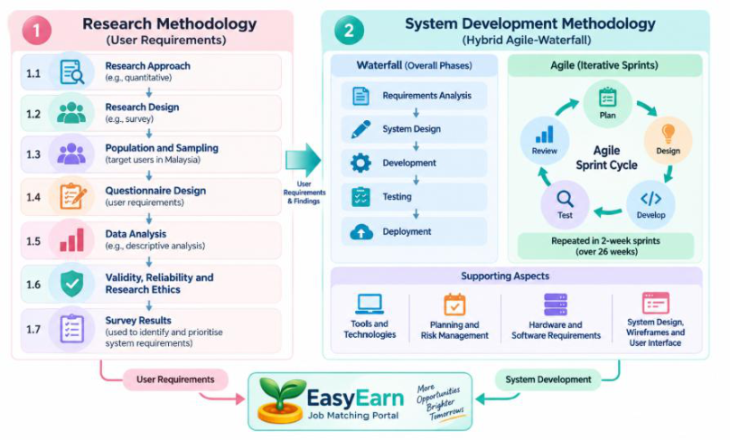

_Figure 3.1: Research and System Development Methodology for EasyEarn_

## 3.2 Research Methodology

This section outlines the research methodology used to identify and support the user requirements for the EasyEarn Job Matching Portal. It includes the research approach, research design, population and sampling, data collection method, research instrument, data analysis procedure, validity, reliability and research ethics. The results of the user requirements survey are also summarised to illustrate the contribution of the responses gathered in identifying and prioritising system requirements. The system development methodology used to develop EasyEarn is presented separately in Section 3.3.

### 3.2.1 Alignment of Research Questions with Methodology

The RQs introduced in Section 1.3 were derived from the research problems identified in Section 1.2 and aligned with the research objectives. This section explains how the RQs guide the selection of research methods, data collection and analysis procedures. RQs help provide direction for the selection of research methods, data collection and analysis procedures [27], [69]. For consistency throughout the research process, each RQ is linked to the relevant research problems and research objectives.

- RQ1: What are the essential requirements for a web-based job-matching platform that supports short-term, part-time and freelance employment between Job Seekers and Employers in Malaysia?

This RQ covers aspects of the lack of a specialist short-term labour platform, inefficient recruitment processes for employers and limited structured access to flexible work opportunities, which are associated with Problem 1, Problem 4 and Problem 5.

- RQ2: What safety and trust features should be incorporated into the platform to support safer and more trustworthy interactions between Job Seekers and Employers?

The Employer Verification Badge, Report and Flag System, and Bidirectional Rating and Review System were implemented to support Objective 2. These features help users identify verified Employers, report suspicious activities, and provide ratings and reviews after completed jobs.

- RQ3: How can a digital work history and auto-generated resume support gig workers in documenting and presenting their completed work experience?

This RQ raises the issue of the lack of verifiable work history among gig workers, which is related to Problem 3.

- RQ4: What are the possible ways of making EasyEarn more accessible to those with varying language preferences using multilingual access?

This RQ is related to Problem 6, which is about language barriers in existing platforms.

The RQs determine the research approach, research participants, questionnaire items and data analysis procedures utilised in this study. The results from the user requirement survey are interpreted in relation to these RQs to help identify and prioritise user requirements for the development of the EasyEarn Job Matching Portal. The four RQs are summarised and are presented with their respective research problems in Figure 3.2.

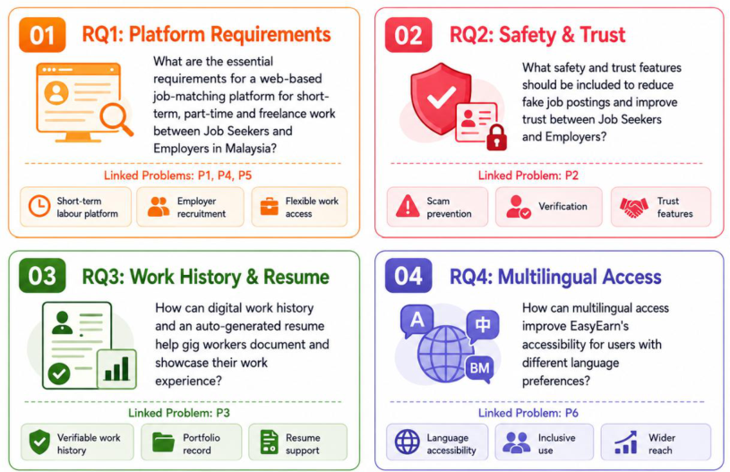

_Figure 3.2: Alignment of Research Questions, Problems and Objectives_

### 3.2.2 Research Approach

The research approach was selected to identify the needs and preferences of potential users before the main development of the EasyEarn Job Matching Portal. The study mainly adopts a quantitative approach, where UX, needs and feature preferences are collected through structured questions and summarised using numerical data [27].

This study also follows a positivist paradigm. A positivist paradigm assumes that research should be based on observable facts and measurable data rather than personal opinions [27]. Hence, data from the structured questionnaire were used, and the results were analysed using descriptive analysis to identify the user requirements of EasyEarn more objectively and systematically [27].

A deductive approach was used in which existing empirical findings, research problems and problem dimensions revealed in the second chapter were used to structure the questionnaire, rather than it being used as a primarily open-ended and exploratory questionnaire to discover new themes [27]. It was decided that this approach was appropriate as the study started with the existing problems and literature findings, and then gathered user responses to support the identification and prioritisation of EasyEarn requirements.

For this study, the overall research approach is mainly quantitative to identify the needs of potential users of the EasyEarn Job Matching Portal. The questions used a structured online questionnaire and produced measurable responses regarding job search/hiring experiences and problems faced, language preferences and the importance of proposed EasyEarn features. The majority of the items on the questionnaire were closed-ended, such as multiple-choice questions, checkboxes, a 5-point scale and a multiple-choice grid. Frequencies, percentages, mean scores and rating distributions were used to summarise the responses. In addition, an open-ended question was added to give the respondents the chance to submit any other recommendations for the system.

The quantitative approach was chosen because it helps the study uncover common needs of the users and the importance that they place on the proposed EasyEarn features [27]. The findings that were analysed were then used to support system requirement identification and prioritisation, such as location-based job search, safety and trust, work history, multilingual access, and short-term job management.

The study adopted a positivist paradigm, a deductive approach and mainly quantitative data collection, followed by descriptive analysis and system requirement identification, as summarised in Figure 3.3.

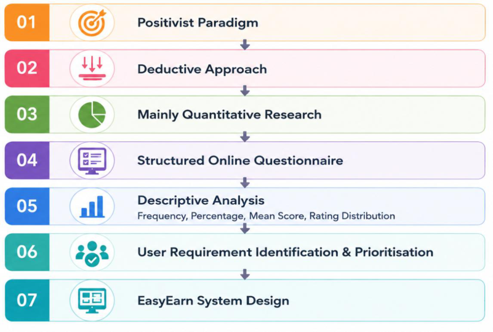

_Figure 3.3: Research Approach Flow of the Study_

### 3.2.3 Research Design

A cross-sectional descriptive survey was used in this study to gather user requirements for the EasyEarn Job Matching Portal [69]. The survey collected feedback from potential users over a defined period to obtain information about their experiences, concerns and preferences regarding short-term, part-time and freelance job searching and hiring.

The cross-sectional study design was used because the study did not involve measuring changes over an extended timeframe, but rather it sought to obtain the current needs and preferences of potential users. A descriptive survey design was also appropriate in that the study aimed to summarise the experiences of users, the problems that they faced and the significance that they attached to the features that were proposed in the EasyEarn system [69].

This study was not an experimental study as there was no manipulation of variables and no attempt to test cause and effect relationships. Rather, the survey was used to describe the current needs and preferences of prospective Job Seekers and Employers. This design was thus felt to be appropriate for EasyEarn as it involved identifying and prioritising the user requirements in the study, instead of testing causal relationships between the variables.

The research design for the EasyEarn study is shown in Figure 3.4 and is based on a cross-sectional descriptive survey, non-experimental approach to identify and prioritise user requirements.

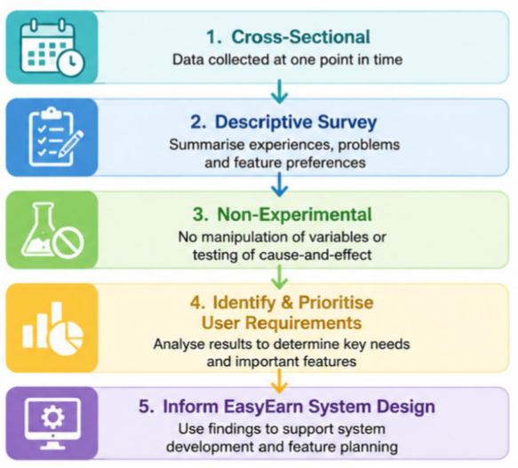

_Figure 3.4: Research Design of the Study_

### 3.2.4 Population and Sampling

This study targeted people in Malaysia who may search for or offer part-time, short-term or freelance jobs. This encompassed potential Job Seekers who might be looking for jobs on a job-matching platform, as well as potential Employers / Hirers who may be recruiting workers through a job-matching platform.

This population was selected as they are the potential users of the proposed system, as this is the design of EasyEarn to match short-term, part-time, and freelance workers in Malaysia. This study did not specifically request respondents with professional knowledge in a specialised field. The questionnaire was designed to gather general comments from prospective job seekers and hirers of varying levels of experience or interest in job seeking and hiring, so that information regarding the needs of these users and proposed feature preferences could be determined.

Convenience sampling was used in this study. Convenience sampling was used instead of purposive sampling because the study did not aim to actively seek out respondents with specific expertise, e.g. human resources (HR) personnel, SME employers, or gig workers. In contrast, the questionnaire was sent via personal contacts, social media and messaging services, and responses were collected from those who were easily accessible and willing to participate [70]. This was appropriate due to the time and resources available in a FYP. Participation was voluntary.

Thirty (30) valid responses were received. The responses were mainly used to find out the common user needs and prioritise the proposed EasyEarn features. Since convenience sampling is a non-probability sampling technique, the findings cannot be generalised to the entire Malaysian population [69]. The sample was found to be useful for identifying user requirements for the EasyEarn Job Matching Portal.

The population and sampling process used in this study is shown in Figure 3.5, from the identification of potential Job Seekers and Employers / Hirers to the collection of 30 valid responses through convenience sampling.

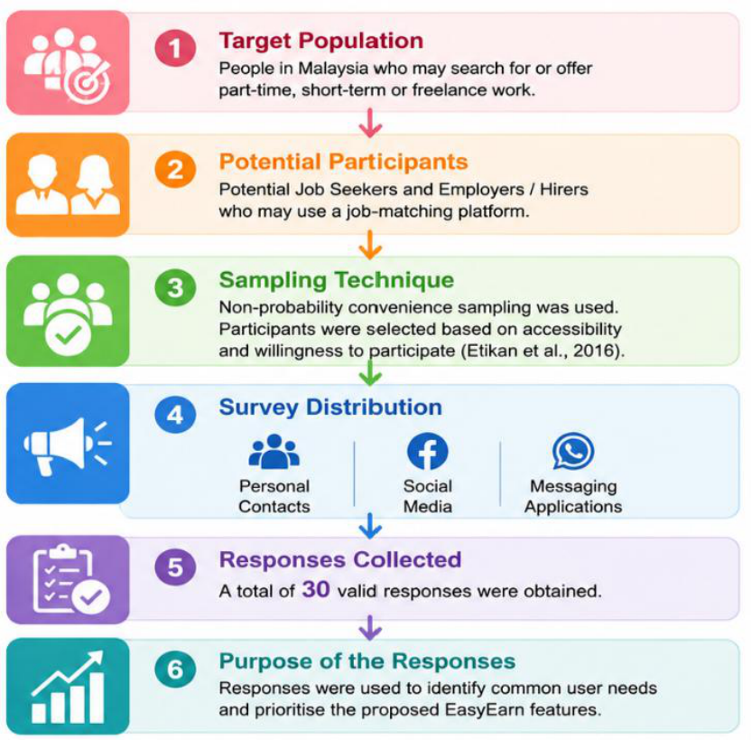

_Figure 3.5: Population and Sampling Process of the Study_

### 3.2.5 Data Collection Method

Data were collected using a Google Forms online questionnaire, which was appropriate for obtaining standardised responses from several participants [69]. The questionnaire link was sent via social media and messaging communications, as well as personal networks, to a target population of individuals relevant to the study.

Participants had the opportunity and time to access and complete a questionnaire as needed. The answers were all automatically entered into Google Forms, and the time of submission was also recorded. This helped in the organisation of collected data and in preparing responses for analysis.

The decision to use online data collection was made because it was lower cost, convenient and would enable those undertaking the research to obtain responses from participants from across geographical areas without having to meet them in person. It was also suitable for this study since the group of people involved were Job Seekers as well as Employers / Hirers from various parts of Malaysia.

The questionnaire and response options were kept consistent for all participants to achieve consistency in data collection. The gathered answers were then analysed descriptively to determine the common experiences, problems, preferences and key EasyEarn attributes. The EasyEarn User Requirement Survey questionnaire is provided in Appendix 1.

### 3.2.6 Research Instrument: Questionnaire Design

In this research, a structured questionnaire was used as a research instrument to collect user requirements for the EasyEarn Job Matching Portal. The questionnaire was designed based on the research objectives and the identified 6 research problem dimensions in Chapter 2, as well as the proposed EasyEarn features. The questions were kept simple and focused on information that was readily available and easily provided by the respondents [69].

A structured questionnaire was deemed appropriate for this research as the majority of the desired data could be obtained by utilising pre-established question sets and answer options. This enabled comparisons between the different participants' responses and summarisation with descriptive statistics. The questionnaire also helped address the four RQs by gathering information on four areas: short-term job searching and hiring, safety and trust, digital work history, and multilingual accessibility.

The questionnaire had 13 questions that were grouped into four sections. The first asked for background information, consent, role and location of the respondents. The second part examined the experiences of the respondents in short-term job hunting or recruitment, such as the sources of information they utilised, challenges they faced and their level of difficulty. The third section sought insights into users' requirements, such as language preferences, the significance of proposed EasyEarn features and the factors deemed most crucial by users when utilising a brief time work-match platform. There was an optional open-ended question at the end of the section where participants could add further suggestions or feedback. Table 3.1 shows a summary of the structure of the questionnaire.

_Table 3.1: Structure of the User Requirement Questionnaire_

|**Section**|**Questions**|**Purpose**|
|---|---|---|
|**Respondent Background**|Q1-Q5|Collect consent, demographic information,|
|||intended user role and location.|
|**Current Job Search /**|Q6-Q9|Identify current experience, channels, problems|
|**Hiring Experience**||and level of difficulty.|
|**User Requirements**|Q10-Q12|Determine language preferences, feature|
|||importance and overall priorities.|
|**Additional Feedback**|Q13|Gather further feature ideas from participants.|

The questionnaire contained various types of questions, and the type of question was dependent on the type of information that was being sought. Multiple choice was used for the questions regarding background characteristics of the respondents and general preferences, while checkbox questions were used to highlight more than one alternative for the following questions: job search/hiring channel, problem, and preferred language. The level of difficulty in finding suitable short-term jobs or workers was measured using a five-point scale. A multiple-choice grid was also used to measure the importance of ten proposed EasyEarn features using a five-point scale ranging from 1 – Not Important to 5 – Very Important. The last question was open-ended and optional, so that respondents could add other suggestions not listed in the options.

### 3.2.7 Data Analysis

This study had research objectives and RQs that were focused on summarising the experiences of the respondents, identifying problems that were common and determining the perceived importance of the proposed EasyEarn features, not on testing hypotheses or testing variables and relationships [27], [69].

The data analysis process was carried out in several steps. The answers to the questions which were obtained from Google Forms were first checked to ensure that only valid answers were analysed. A total of 30 valid responses were used.

Second, the closed-ended answers were arranged by the type of question. Google Forms automatically organised the responses and created summary charts to support the analysis of background information of the respondents, job searching experiences, hiring experiences, problems encountered, language preferences, and the importance of the features EasyEarn is proposing.

Third, data analysis of multiple-choice questions was done by frequencies and percentages. For questions that allowed multiple responses, the number and percentage of people who answered each were noted.

Fourth, the data from the five-point rating questions were analysed by the distribution of responses and mean scores. These findings were employed to determine the general difficulty faced by respondents and their perceived importance of each of the proposed EasyEarn features.

Fifth, the results obtained were analysed and compared to determine the common issues, preferences and highly rated features of the users. The results of these findings were used to assist in identifying and prioritising user requirements for the EasyEarn Job Matching Portal.

The optional open-ended responses were examined separately to see if there were any other suggestions and comments that were not included in the predefined options to the questionnaire. These suggestions were used as additional feedback to supplement the system requirements. The results of the analyses are summarised in a number of tables, charts and descriptive summaries, which were selected for presentation in Section 3.2.9.

The data analysis process of this study is shown in Figure 3.6, starting from reviewing the questionnaire responses, identifying common patterns, and prioritising the needs of users of the EasyEarn Job Matching Portal.

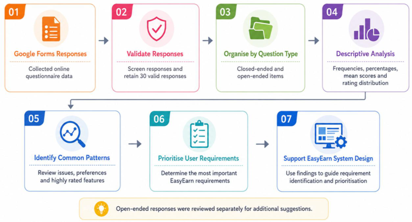

_Figure 3.6: Data Analysis Process of the Study_

### 3.2.8 Validity, Reliability and Research Ethics

The present study was mostly quantitative in nature, so a measure of validity and reliability was applied to ensure that the questionnaire was measuring the intended user requirements in the same way. Research ethics was also given importance during the process of data collection, analysis and reporting.

# Validity:

Content validity is when the items used in a research instrument are representative of the area that the researcher wants to study [27]. The items of the questionnaire were prepared by taking into consideration the research problem and the research problem findings discussed in Chapter 2 and the features of the EasyEarn Job Matching Portal. The following questions were asked for background information of the respondents, Job Searching and Hiring experiences, job search-related problems, Preferred languages and the perceived importance of proposed system features.

The items on the questionnaire were also connected with the identified key issues presented in Chapter 2, such as geographic restriction, employment scams, lack of documented work history, language barriers, and limited access to flexible work and inefficient short-term recruitment. This helped to ensure that the responses collected were relevant to the purpose and to identify and prioritise EasyEarn user requirements. But, no formal pre-test or pilot test was done prior to distributing the questionnaire.

# Reliability:

Reliability is the consistency of the data collection instrument and/or the process used to collect data [27]. The online questionnaire used in this study was created with Google Forms and all respondents were asked the same questions, with the same answers to choose from and rating scales. Responses were also gathered online and analysed in the same way as above, to ensure consistency.

A formal statistical reliability test did not take place as the questionnaire was not specifically constructed to measure a single psychological construct with a multi-item scale. Rather, it was primarily employed to gather various kinds of user requirements, experiences and preferences for features. Thus, consistency was supported primarily through the use of a standardised questionnaire and a consistent data collection and analysis process.

# Research Ethics:

Research ethics is about giving the right information to participants, getting their consent and responsibly dealing with the information that is gathered [69]. The EasyEarn User Requirement Survey was conducted on a voluntary basis and participants had to give their consent prior to completing the survey.

The responses collected were treated confidentially and made use of solely for academic reasons, encompassing the development and evaluation of the EasyEarn Job Matching Portal. The findings of the surveys were presented as frequencies and percentages, mean scores and summary charts, but not as individual respondents. There was also an openended question at the end for participants to add their comments and suggestions.

The questionnaire was not overly sensitive and did not include questions that might have been confrontational to the respondents. The data gathered were not changed or fabricated in the analysis and reporting process. Academic sources were also cited throughout the study in relation to it and to ensure academic honesty and integrity.

The survey responses were also taken into account for data protection. Only the researcher could access the collected responses and the data would only be used in the FYP The answers were not made available in a public document along with personal information. Figure 3.7 provides a summary of the measures taken to ensure the validity, reliability, and ethical considerations in designing the questionnaire, collecting data and analysing it in this study.

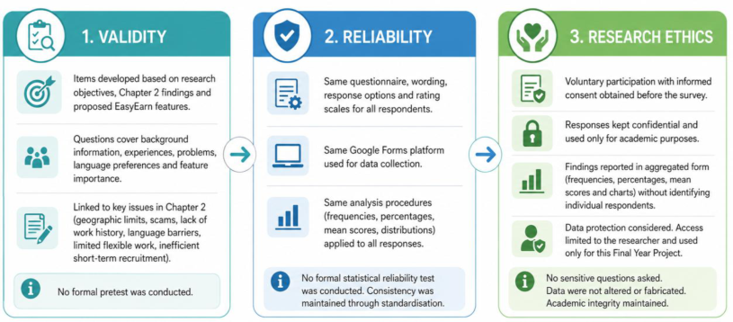

_Figure 3.7: Validity, Reliability and Research Ethics of the Study_

### 3.2.9 Summary of User Requirement Survey Findings

The user requirement survey gathered feedback on respondents' experiences with searching for or offering short-term jobs, as well as their expectations for EasyEarn. A total of 30 valid responses were collected from 22 to 23 April 2026.

The 30 respondents identified as Job Seekers (63.3%), Employers / Hirers (10.0%) and both Job Seekers and Employers / Hirers (26.7%). The respondents were from 14 different states in Malaysia. Figure 3.8 presents respondents' intended platform role.

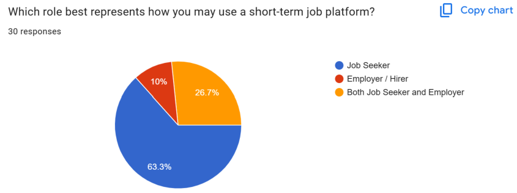

_Figure 3.8: Distribution of Respondents by Intended Platform Role_

All respondents had looked for or provided short-term, part-time or freelance employment (100.0%). Of these, 24 respondents (80.0%) reported doing so frequently, 4 respondents (13.3%) occasionally, and 2 respondents (6.7%) once or twice.

27 respondents (90.0%) rated the difficulty of finding suitable short-term jobs or workers in their area as Very Difficult, while 3 respondents (10.0%) selected Difficult. The average difficulty score was 4.90 out of 5, meaning that the respondents generally felt that suitable short-term jobs or workers were very difficult to find in their area. The answers are shown in Figure 3.9.

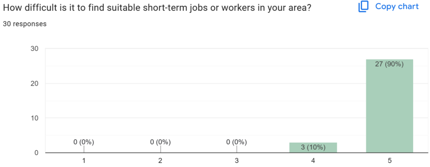

_Figure 3.9: Difficulty in Finding Suitable Short-Term Jobs or Workers_

All 30 respondents (100.0%) indicated that managing job applications was a difficulty. The other concerns, such as finding jobs or workers locally, fake or suspicious postings, employers that are not verified, unclear job information, reliability of applicants, lack of work history, language barriers and short-term and flexible jobs, were each endorsed by 29 respondents (96.7%). These findings are summarised in Figure 3.10.

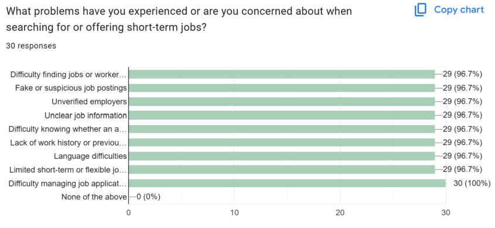

_Figure 3.10: Problems in Short-Term Job Search and Hiring_

A preference for multilingual accessibility was also revealed in the survey. The majority of the respondents, 24 (80.0%), chose English, 22 (73.3%) chose Bahasa Melayu, 20 (66.7%) chose Mandarin and 6 (20.0%) chose Tamil. Percentages exceed 100% due to multiple selections of preferred languages by respondents. These findings suggest that having access to multiple languages for EasyEarn users would be helpful.

All of the proposed EasyEarn features were rated highly. Job Search by Location, Job Search by Category, Application Status Tracking, Employer Verification Badge, Report and Flag System, Work History Profile, Auto-Generated PDF Resume, and Multilingual Access all scored a 5.00 out of 5.00. Two-way Rating and Review System and Rule-Based Chatbot Support both had a mean rating of 4.97/5.00. The results are shown in Figure 3.11.

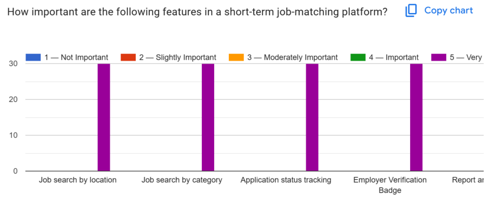

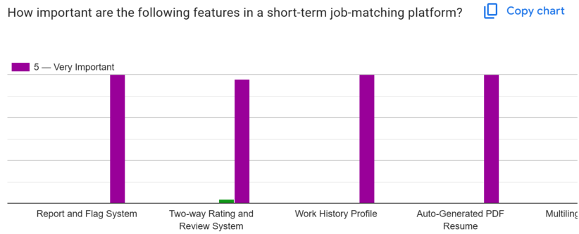

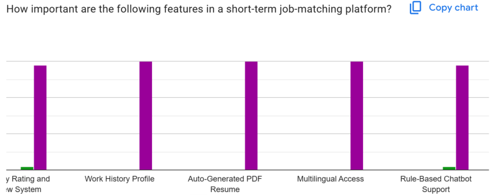

_Figure 3.11: Importance Ratings of Proposed EasyEarn Features_

The top factor listed when using a short-term job platform was Easy Application / Applicant Management, with 9 respondents (30.0%) marking this as their top choice, followed by Easy-to-Use Interface with 7 respondents (23.3%). 5 respondents (16.7%) opted for Safety and Employer Verification, and 4 respondents (13.3%) selected Work History and Resume Features. Two respondents (6.7%) selected Flexible Job Opportunities, 2 respondents (6.7%) selected Jobs Available in my Location, and 1 respondent (3.3%) selected Multilingual Support. The results are shown in Figure 3.12.

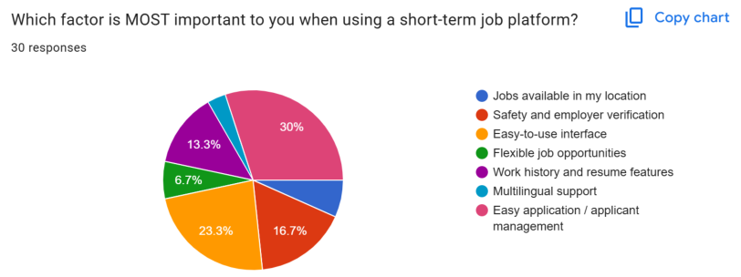

_Figure 3.12: Most Important Factor When Using a Short-Term Job Platform_

The open-ended answers also provided additional ideas for EasyEarn, including job and application alerts, filters and salary options, scheduling and reminders, increased security features, better profile and resume tools, saved search options, and accessibility options. These suggestions may be considered as future enhancements depending on the project scope, development time and available resources.

In general, the results of the survey reflected the primary needs of EasyEarn, such as searching for jobs from a particular location, safety and trust, application management, work history, multilingual accessibility and ease of use. These findings were taken into account when identifying and prioritising the system requirements for EasyEarn.

## 3.3 System Development Methodology

EasyEarn was built with a Hybrid Agile-Waterfall methodology, a combination of the iterative, flexible development of Agile with the structured planning of the Waterfall. This method was chosen to align with the fixed 26-week FYP period and EasyEarn is a multi-modular system [20], [21].

### 3.3.1 Hybrid Development Approach

EasyEarn development methodology is based on a Hybrid Agile-Waterfall approach, which is an iterative, flexible methodology combined with structured planning of the Waterfall. The Waterfall structure applies to the early planning and design activities (Weeks 1-8) and to the final deployment and review activities (Weeks 23-26), so as to ensure that academic documentation requirements and project milestones are organised and sequenced. The Agile component leads the six development sprints in Weeks 9-20, where each two-week sprint produces a usable system module that is tested, reviewed and iterated before the next sprint. This entity enables the project to keep to an academic timetable and still accommodate the technical issues raised in development.

Figure 3.13 depicts the overall methodology of Hybrid Agile-Waterfall for EasyEarn, comprising the structured Waterfall phases in FYP1 and iterative Agile sprints in FYP2.

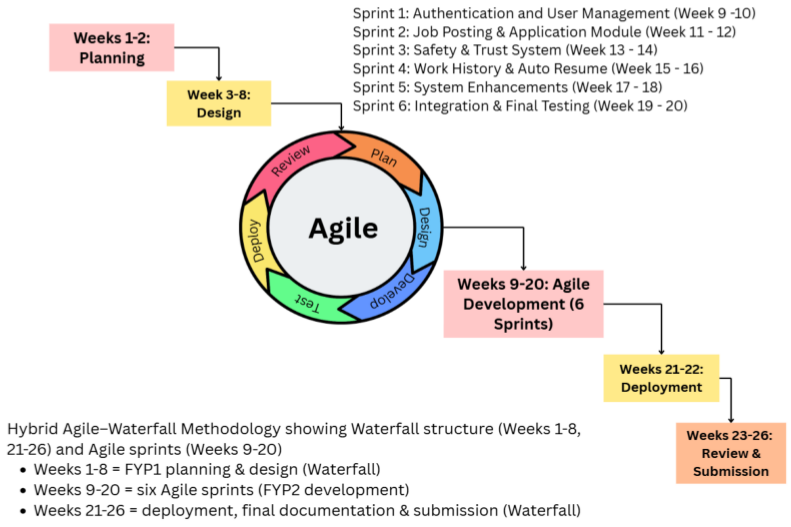

_Figure 3.13: Hybrid Agile-Waterfall Methodology Diagram_

### 3.3.2 Rationale for Adopting a Hybrid Development Approach

The development of EasyEarn was conducted using a Hybrid Agile-Waterfall approach for the following reasons:

- **Academic and Assessment Requirements**

FYP assessment framework demands that there are well-spelt-out goals, formal documents, and deliverables at certain intervals. The waterfall method has the potential for systematic documentation, through which supervisor assessment and compliance with academic norms can be performed.

- **Project Timeline**

The project was conducted over two semesters, which have a total period of 26 weeks. One advantage of waterfall planning is that it provides a firm schedule at the outset and achievable milestones during both FYP1 and FYP2. Agile iterations can be used in each sprint to adjust and control the course of the sprint in case of unwanted technical issues, without affecting the deadlines.

- **Technical Complexity**

The system also comprises several interdependent modules such as Supabase integration, Chart.js analytics, jsPDF resume generation and a multi-role access system. The advantages of these components are the possibilities of development in iterative cycles and continuous testing, which are the main ideas of Agile methodologies.

- **Documentation and Compliance Standards**

Waterfall provides good documentation of academic deliverables such as a proposal, system design documentation and final report. Also, Agile encourages incremental additions or enhancements to the functionality, and this would allow for earlier verification of functional additions.

### 3.3.3 Waterfall Phase (FYP1, Weeks 1-8)

The waterfall model is a step-by-step process model that consists of distinct phases in the model development process that must be completed in order [71]. This structured characteristic makes it suitable for the requirements elicitation and documentation part of EasyEarn, as the requirements have to be formally elicited and approved before any development activity can begin [20]. The Waterfall component ensured that the system architecture, database schema, use case diagrams and wireframes were fully reviewed and approved before the Agile sprints started. The key activities in the Waterfall phase included:

- Identifying the topic, how it will be covered and who will be involved (Weeks 1-2)

- A literature review and competitor analysis, as well as requirements gathering (Weeks 3 - 4)

- System architecture design, database schema (ERD), UI/ UX wireframe prototyping and API endpoint documentation (Weeks 5-6)

- Prototype development, FYP1 documentation compilation and final FYP1 presentation (Week 7)

### 3.3.4 Agile Phase (FYP2, Weeks 9-20)

The Agile methodology, according to the Manifesto for Agile Software Development [72], favours the iterative delivery of software, the co-creation with the customer, and the ability to adapt to change over upfront planning. These are followed by 6 structured 2-week development sprints in FYP2. A new sprint provides a fully operational system module, allowing issues to be discovered and addressed before other system modules are developed [73]. In Sprint reviews, the supervisor reviews the sprint and gets input for the next sprint. The 6 Agile sprints are organised like this:

- Sprint 1 (Weeks 9-10): Authentication and User Management

- Sprint 2 (Weeks 11-12): Job Posting and Application Module

- Sprint 3 (Weeks 13-14): Safety and Trust System

- Sprint 4 (Weeks 15-16): Work History and Auto Resume

- Sprint 5 (Weeks 17-18): System Enhancements (Admin Dashboard, Chatbot, Mobile Responsiveness)

- Sprint 6 (Weeks 19-20): Integration and Final Testing

System deployment on GitHub Pages is completed in Weeks 21-22, and final system documentation and submission of FYP2 are completed in Weeks 23- 26. This blended model allowed EasyEarn to meet the strict documentation requirements of the academic process and will also be responsive to any changes in the technical requirements that may occur during the development process [74]. The overall Hybrid Agile-Waterfall Methodology used for EasyEarn is shown in Figure 3.13.

### 3.3.5 Hybrid Model Workflow

The project was conducted over two semesters, namely FYP1 (Weeks 1-8, 20 April - 12 June 2026) and FYP2 (Weeks 9-26, 15 June - 16 October 2026), in six major phases. FYP1 focused on planning, design and prototype development, while FYP2 outlines all six Agile development sprints, system deployment and final submission.

The following Table 3.2 summarises the key activities and associated deliverables from each of the six phases of the Hybrid Model Workflow for EasyEarn as well as the timeline for each phase.

_Table 3.2: Hybrid Model Workflow of EasyEarn_

|**Phase**|**Timeline**|**Key Activities**|**Deliverable**|
|---|---|---|---|
|**Phase** **1:**|Week 1-2|Project preparation, defence, proposal|Approved|
|**Planning** **(FYP1)**||writing and topic selection.|proposal|
|**Future**|Week 3-8|Literature search, competitor analysis,|ERD,|
|**enhancements:**||requirement analysis, system design,|wireframes,|
|**Design (FYP1)**||database design, wireframe design, API documentation and prototype development.|prototype|
|**FYP1**|Week 6 &|FYP1 Midsem Checkpoint (Week 6),|FYP1 report,|
|**Assessment**|Week 8|FYP1 Final Presentation & Report Submission (Week 8).|presentation|
|**Phase** **3:**|Week 9 -|Each FYP2 Agile sprint develops and|Functional|
|**Development** **(FYP2)**|Week 20|delivers a functional system module incrementally.|modules, sprint reports|
|**FYP2**|Week 16|FYP2 Midsem Checkpoint System|Working|
|**Assessment**||demonstration with finished sprints 1-4.|system demo|
|**Phase** **4:**|Week 19 -|The usability testing, performance|Test reports,|
|**Testing** **(FYP2)**|Week 20|testing, security testing, bug fixing and code refactoring.|defect logs|

|**Phase** **5:**|Week 21-22|Deployment of GitHub Pages Hosting,|Live-deployed|
|---|---|---|---|
|**Deployment**||validation and integration of the final|system|
|**(FYP2)**||system.||
|**Phase** **6:**|Week 23 -|Compiling final documentation, writing|Final report,|
|**Review** **&**|Week 26|reports, preparing presentations and|FYP2|
|**Submission**||FYP2 final submission.|presentation,|
|**(FYP2)**|||and system demonstrations.|

### 3.3.6 Sprint Structure

Within every two weeks, the sprint is followed by a regular six-step cycle in order to QA assurance and measurable results at the conclusion of every sprint. Table 3.3 presents a description of the six-step structure of the sprints which EasyEarn followed during the twoweek Agile development sprints.

_Table 3.3: Sprint Structure of EasyEarn_

|**Step**||**Description**|
|---|---|---|
|**1. **|**Planning**|The beginning of every sprint involves developing sprint goals, user stories, and acceptance criteria to have a clear scope and expected outcomes.|
|**2. **|**Design**|UI wireframes, Supabase collection schema refinements, and workflow plans for the system are ready to assist with the targeted features of the sprint.|
|**3. **|**Development**|The implementation of features is done in HTML, CSS, JavaScript, and the Supabase JavaScript Client Library with modular, maintainable and testable code.|
|**4. **|**Testing**|Sprint testing includes feature-level checks, integration checks and defect fixing to identify issues before the next sprint.|
|**5. **|**Deployment**|The features are done, and they are added to GitHub Pages, where a stable and working increment is available to be reviewed.|

**6. Review** Sprint review and retrospective meetings are conducted with the project supervisor to show which features are done and receive comments on the following sprint.

### 3.3.7 Sprint Management Practices

To make sure that the hybrid methodology is put into practice, the following sprint management practices are embraced:

- **Weekly Progress Tracking**

A formal log is used to record progress in development every week. Tasks which have been done and problems which have been faced are recorded as a reference for the supervisors.

- **Sprint Planning Sessions**

   - Each sprint commences with the definition of goals and distribution of the tasks to underline responsibilities and facilitate the process.

- **Sprint Review Sessions**

   - The sprint review will be held at the end of every sprint, which shows the supervisor what has been accomplished. Feedback is documented in order to make better improvements in subsequent sprints.

- **Issue Tracking**

   - Bugs and technical problems are handled in a local tracking log. There are also feature requests that are recorded to ensure clarity and organisation.

- **Version Management**

Project files are organised in the GitHub repository to support version tracking, traceability and the integration of new features across the development sprints.

### 3.3.8 Risk Mitigation Through the Hybrid Approach

The hybrid model assists in mitigating the main project risks following the development and validation of the organisation:

- **Early Development of Core Features (Sprints 1-3)**

Core features like user authentication, job posting, and the safety and trust system will be developed early on to have a working baseline system in FYP2.

- **Enhancements and Testing Deferred to Later Sprints (Sprints 4-6)**

Enhancements like work history, system integration testing, and system administration analytics are not done until the development of core modules has been finished; otherwise, the functionality later developed depends on the higher-quality functionality.

- **Regular Academic Validation**

Frequent reviews with supervisors ensure that the project is in line with the academic expectations. The feedback is implemented in a cyclical fashion in order to stay in line with the project objectives.

- **Modular System Architecture**

The system is constructed to have self-contained Supabase tables and independent JavaScript modules to enable the development of the system in parallel and easier detection of defects.

- **Documented Decision-Making**

All key project decisions are recorded in sprint reports so that they have an apparent audit trail and prove compliance with academic standards.

### 3.3.9 System Evaluation Methodology

System evaluation is performed at a few validation points within the cycles of the sprints to confirm that the system is operational, reliable and oriented toward the project goals:

- **System Testing**

System testing is used to test the complete integrated system to see if it meets both functional and non-functional specifications [75]. Every functionality of the platform is tested end-to-end (E2E), such as the core modules of user sign-up, posting jobs, handling applications, rating and resume generation. This also helps to maintain consistency and integrity of the data across all modules and ensures they can be stored and retrieved properly in the Supabase database.

- **User Acceptance Testing (UAT)**

UAT is a test that validates the system by following real users to make sure that the system is appropriate for real-world users [75]. Realistic scenarios are tested with representative users of the three roles (Admin, Employer and Job Seeker) to validate that the system matches real user needs.

- **Usability Testing**

EasyEarn interfaces are evaluated by usability testing based on Nielsen's 10 Usability Heuristics to make sure that the interfaces are user-friendly, consistent and accessible [55]. The interfaces that are chosen to be deployed for the three roles (Job Seeker, Employer and Admin) are reviewed by the project author, and the usability issues that are found are given severity ratings according to the severity rating scale by Nielsen.

- **Security Testing**

Security testing identifies the weaknesses of the system, vulnerabilities and unauthorised access to the data [75]. Testing of Supabase Authentication, RBAC, and RLS policies ensures the security of sensitive data that unauthorised users are unable to access.

# • **Compatibility Testing**

EasyEarn is tested for compatibility across various browsers, devices and screen sizes [75]. Browser Compatibility Testing included Google Chrome, Mozilla Firefox and Microsoft Edge in the included desktop testing environments. To ensure Safari compatibility, the UAT was done on an iPhone browser, Safari. They also measured the responsive design and chosen platform features on various screen sizes and interaction situations.

## 3.4 Project Phases and Sprint Breakdown

The FYP2 development was organised into six two-week Agile sprints (Week 9 - Week 20), with each sprint delivering a functional system module. The sprint-based development started on 15 June 2026 after the submission of the FYP1 final. Table 3.4 presents all 26 weeks of project development along with the project phases, objectives, key activities and deliverables for EasyEarn.

**Note:** Sprint 6 (Week 19 - 20) happens at the same time as Phase 4 Testing. The Sprint 6 row above contains information about testing activities and deliverables.

_Table 3.4: Project Phases and Sprint Breakdown of EasyEarn_

|**Sprint**||**Timeline**|**Objectiv**|**e**|**Key Activities**||**Deliverable**|
|---|---|---|---|---|---|---|---|
|**Phase**|**1:**|Week 1-2|Establish||Topic selectio|n, team|Approved|
|**Planning**|||project|scope,|formation,|project|project|
|**(FYP1)**|||choose|a|preparation,|proposal|proposal.|
||||project|topic|writing, and|Proposal|Project|
||||and|get|Defence.||timeline and|
||||approval|from|||risk|
||||the super|visor.|||overview.|

|**Future**|Week 3-8|Design a|Literature|Review,|ERD,|
|---|---|---|---|---|---|
|**enhancements:**||complete|Competitor|Analysis,|wireframes,|
|**Design (FYP1)**||system and database before development.|Requirement Use Case System   Design, Data Design, Wireframe Canva), AP Documentatio Making a Pro|Gathering, Diagram, Architecture base Schema UI/UX Design (on I Endpoint n, and totype.|system architecture diagram, API documentati on, prototype.|
|**FYP1**|Week 6&8|Present|FYP1|Midsem|FYP1|
|**Assessment**||progress and submit FYP1 interim report.|Checkpoint FYP1 Final and Report (Week 8).|(Week 6), Presentation Submission|report, presentation .|
|**Sprint** **1:** **Authentication**|Week 9-10|Develop secure user|Registration, RBAC, profi|login, le setup and|Functional user|
|**&** **User** **Management**||registration, login, and RBAC.|verification Translate Inte|and Google gration.|managemen t module. Sprint report.|
|**Sprint 2: Job**|Week 11-|Implement job|Job posting|with CRUD|Functional|
|**Posting** **&** **Application** **Module**|12|posting, search, and application management features.|functionality, and filter by c location, job submission, status timelin jobs.|job search ategory and application application e, and saved|job module. Sprint report.|
|**Sprint 3: Safety** **& Trust System**|Week 13- 14|Build trust and safety mechanisms to|Employer badge, repor system,   rating and rev|verification t and flag bidirectional iew module.|Functional safety module.|

|||protect users from fraud.||Sprint report.|
|---|---|---|---|---|
|**Sprint 4: Work**|Week 15-|Develop work|Work history dashboard,|Functional|
|**History & Auto**|16|history|notification and alert|work|
|**Resume**||tracking and automated resume generation.|system, auto-generate resume feature using jsPDF.|history module. Sprint report.|
|**FYP2** **Assessment**|Week 16|Establish an employment log and auto- completion resume feature.|FYP2 Midsem Checkpoint for system demonstration with finished Sprints 1-4 and progress report.|Working system demo.|
|**Sprint** **5:** **System** **Enhancements**|Week 17- 18|Implement admin dashboard, analytics, chatbot, and UI refinements.|Admin dashboard and analytics using Chart.js, rule-based chatbot, mobile responsiveness and UI polish.|Functional admin module. Sprint report.|
|**Sprint** **6:**|Week 19-|Test the system|System integration,|Fully tested|
|**Integration** **&** **Final Testing**|20|as a whole, integrate all modules.|usability testing, performance testing and concurrency checks, security and vulnerability assessment, bug fixing and code refactoring.|and integrated system. Final sprint report.|
|**Phase** **4:** **Deployment** **(FYP2)**|Week 21- 22|Deploy on GitHub Pages.|Supabase deployment, final system integration verification, and last round of system testing.|Live- deployed system. Deployment validation report.|

|**Phase**|**5:**|Week 23-|Finalise|Final documentation and|Final report,|
|---|---|---|---|---|---|
|**Review**|**&**|26|documentation|report compilation,|FYP2|
|**Submission**|||and hand in all|presentation slides and|presentation|
|**(FYP2)**|||project|poster preparation, FYP2|, system|
||||deliverables.|Final Presentation and|demonstrati|
|||||Report Submission.|on.|

## 3.5 Tools and Technologies

EasyEarn is developed with a light Technology Stack that focuses on the client, with Supabase as the BaaS. Below are the tools and technologies chosen for their suitability for a solo academic project, ease of integration, and support for all core features within the time constraints. The technology stack of EasyEarn is visualised in Figure 3.14 and includes all frontend, backend, hosting and supporting libraries.

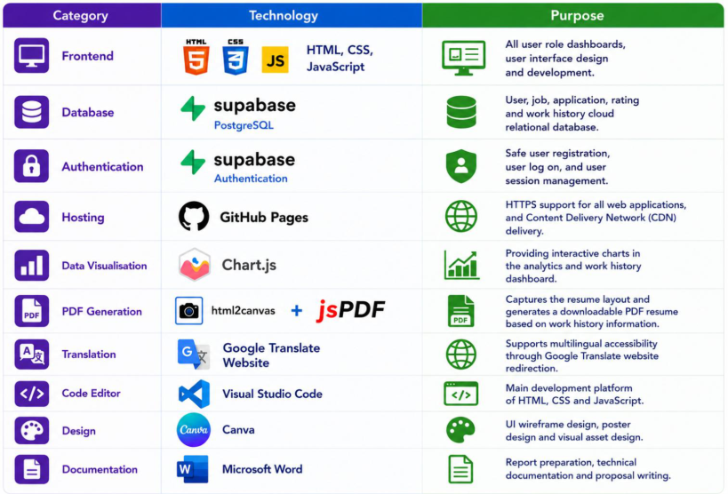

_Figure 3.14: Visual Overview of Technology Stack_

Table 3.5 shows the tools and technologies chosen for EasyEarn and their category and use in building the platform.

_Table 3.5: Tools and Technologies of EasyEarn_

|**Category**|**Technology**|**Purpose**|
|---|---|---|
|**Frontend**|HTML, CSS, JavaScript|All user role dashboards - UI design and development.|
|**Database**|Supabase PostgreSQL|User, job, application, rating and work history Cloud relational database.|
|**Authentication**|Supabase Authentication|Safe user registration, user login, and user session management.|
|**Hosting**|GitHub Pages|HTTPS support for all web applications and Content Delivery Network (CDN) delivery.|
|**Data**|Chart.js|Providing interactive charts in the analytics and|
|**Visualisation**||work history dashboard.|
|**PDF Generation**|jsPDF & html2canvas|Capture the resume layout and generate a downloadable PDF resume based on the Job Seeker's profile and work history data.|
|**Translation**|Google Translate Website|Support multilingual accessibility through Google Translate Integration.|
|**Code Editor**|Visual Studio Code|Main development platform for HTML, CSS and JavaScript.|
|**Design**|Canva|UI wireframe design, poster design and visual asset design.|
|**Documentation**|Microsoft Word|Report preparation, technical documentation and proposal writing.|

## 3.6 Planning

Planning is a key part of projects to ensure they are completed within scope, on schedule and to a required quality [19]. For EasyEarn, the planning phase involves mapping the project goals from Section 1.3 to a structured set of management artefacts that control all activities throughout the project development process, which will last for 26 weeks. The main planning artefacts for EasyEarn, including the WBS, Project Schedule and Gantt Chart, are presented in Section 1.6. These planning artefacts support the Hybrid Agile-Waterfall approach described in Section 3.3. This section focuses on the risk management measures used during the project.

### 3.6.1 Risk Management

Risk Management consists of a structured approach to identifying, analysing, and controlling risks that can hinder the successful completion of a project [19]. The third-party BaaS, combined with a tight 26-week development schedule and an academic project being worked on by a single developer, makes proactive identification of risks very important to the project's success in delivering the core system on time and to specification at EasyEarn. Table 3.6 shows the six project risks identified for EasyEarn, their likelihood and impact ratings, and the mitigation strategies undertaken for these risks.

_Table 3.6: Risk Management_

|**No**|**Risk**|**Likelihood**|**Impact**|**Mitigation Strategy**|
|---|---|---|---|---|
|1|Timeline overrun. There|High|High|Use a Hybrid Agile-Waterfall|
||is no flexibility for a delay|||approach with 2-week sprints.|
||in feature development or|||Overall timeline integrity;|
||testing with the fixed 26-|||features deferred/excluded|
||week academic schedule.|||because not completed in allocated sprint [20].|
|2|Limited development|High|Medium|Core features are prioritised and|
||capability of a solo|||developed first (Sprints 1-3).|
||developer. Without a|||Optional features are deferred|
||development team, parallel development, QA|||to later sprints (Sprints 4-6) and|

|coverage and feature volume are limited.|||may be excluded if time does not permit [21].|
|---|---|---|---|
|3 Free-tier restrictions or|Low|High|All Supabase table schemas,|
|service uptime issues|||RLS policies, and|
|with Supabase. The|||configurations are documented.|
|platform depends entirely|||Development and testing are|
|on Supabase for|||carried out within free tier|
|authentication, database, and storage. If there is a|||limits. The modular design enables migrating to another|
|service outage or if the free tier resources are exceeded, the system would become unusable.|||BaaS provider if needed [18].|
|4 Scope creep. As the project evolves or new|Medium|High|Core Features are not necessarily the same as|
|feature ideas are introduced, the project scope may grow to a point where it exceeds the time available.|||Optional Features; there is a formal feature list that separates them. New feature requests are evaluated with regard to sprint capacity, prior to inclusion. Sprint reports keep an audit trail of all key project decisions [74].|
|5 Data integrity and security failure. Personal information such as user profiles, contact details, and work history is all managed by EasyEarn, which could pose a risk of unauthorised access or data breach.|Low|High|Supabase RLS policies are enforced at the database level. RBAC restricts data access by user role. All data is sent via HTTPS. These measures align with the requirements of the PDPA 2010 [76].|
|6 Regulatory non-|Low|Medium|EasyEarn is developed using|
|compliance. A lack of|||specific easy-to-use controls|

|understanding of relevant|aligned with the PDPA 2010,|
|---|---|
|Malaysian laws could|Computer Crimes Act 1997 and|
|subject the system to a|Consumer Protection Act 1999,|
|risk of legal issues before|which are shown in section|
|or after it is deployed into|3.8.3. The system is an|
|the public sphere.|academic prototype that is not|
||formally presented legally.|
||Compliance audit and legal|
||review would be needed prior to general production deployment.|

The six risks listed above are addressed mainly with the help of the structural discipline of the Hybrid Agile-Waterfall methodology, enforcing scope control at the sprint level and frequent academic validation. Its modular system architecture with self-contained Supabase tables and independent JavaScript modules also helps minimise risk by allowing parallel development and fault isolation. These risk measures, when combined, allow for EasyEarn's development to be consistent and work towards the project goals and academic requirements throughout the 26-week delivery period and applicable regulatory requirements.

Figure 3.15 presents a visual overview of the identified risks, their likelihood and impact ratings, and the risk mitigation measures that were taken for the EasyEarn project.

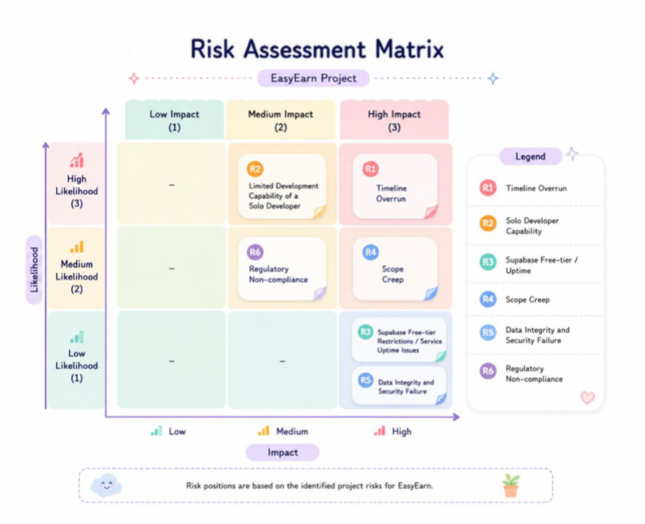

_Figure 3.15: Risk Assessment Matrix_

## 3.7 Hardware Requirements

EasyEarn is an application that works on the web and can be used with common desktop and laptop computer hardware using a modern web browser. The front end of the system is delivered via the user's web browser, and the backend services, including authentication, database management and data storage, are delivered remotely by Supabase [18]. Hence, no dedicated server hardware needs to be installed or maintained by the user. The following hardware environment allows for a proper user and development experience. The EasyEarn platform hardware requirements for development and operation are shown in Table 3.7.

_Table 3.7: Hardware Requirements_

|**Component**|**Minimum Specification**|**Recommended Specification**|
|---|---|---|
|Processor|Dual-core 1.8 GHz|Quad-core 2.4 GHz or above|
|Random Access|4 GB|8 GB or above|
|Memory (RAM)|||
|Storage|256 GB Solid State Drive (SSD)|512 GB SSD or above|
|Display|1280 x 720 resolution|1920 x 1080 (Full HD) or above|
|Internet Connection|Broadband (5 Mbps)|Broadband (25 Mbps or above)|
|Operating System|Windows 10, macOS 11,|Windows 11, macOS 13, Ubuntu|
||Ubuntu 20.04|22.04|

Because EasyEarn is hosted on GitHub Pages and its provider is Supabase, there is no need for the user to set up specific server hardware for deployment [18], [77]. During the academic project phase, all server-side infrastructure is handled by Supabase in their cloud environment, without requiring any physical hardware.

## 3.8 Software Requirements

Software requirements are organised into FRs, which specify what the system should do, and NFRs, which specify the constraints that the system should meet [20]. EasyEarn Software Requirements are organised in this manner.

### 3.8.1 Functional Requirements

FRs are the services, behaviours and functions the system must offer to its users  [21]. Table 3.8 provides a breakdown of EasyEarn's FRs, grouped by user role and feature, and provides a description of what each function needs to provide.

_Table 3.8: Functional Requirements_

|**No.**|**User Role**|**Feature**|**Description**|
|---|---|---|---|
|FR01|All Users|User Registration|Role-based registration and login for Job Seeker,|
|||& Login|Employer, and Admin via Supabase Authentication.|
|FR02|All Users|RBAC|Access to system functions is limited by role; RLS prevents cross-role data access.|
|FR03|Job Seeker|Profile Setup|Individuals can add or remove skill tags, adjust their availability, preferred categories, and profile photo in their profile.|
|FR04|Job Seeker|Browse & Filter Job Listings|Job seekers can browse active job listings and filter by category (e.g. F&B, Event, Delivery) and location state.|
|FR05|Job Seeker|Apply for Jobs|Job seekers can submit one-click applications to active job listings with status automatically set to Pending.|
|FR06|Job Seeker|Application Status Tracking|There is a visual timeline that tracks the application through all status stages: Pending, Reviewed, Interview, Accepted, Completion Pending (awaiting job seeker payment confirmation), Completed, and Rejected.|
|FR07|Job Seeker|Save Jobs / Wishlist|Job seekers can save job listings for later review and manage their saved job listings.|
|FR08|Job Seeker|Work History Dashboard|Completed jobs are automatically logged, and the dashboard shows the total number of jobs, cumulative earnings and job type distribution using Chart.js.|
|FR09|Job Seeker|Auto-Generate Resume|The Job Seeker's stored profile, work history, skills and employer ratings are used to generate a downloadable PDF resume via jsPDF without requiring the user to re-enter or manually format the resume content.|

|FR10|Employer|Post & Manage Job Listings|Employers are able to create, edit and delete jobs with job title, pay rate, job category, job location, job description, and job expiration date.|
|---|---|---|---|
|FR11|Employer|Review & Manage Applicants|Employers can view all applicants for each job listing and update each applicant's status.|
|FR12|Employer|Employer Verification Badge|Employers can submit Know Your Business (KYB) documents for Admin review; approved employers receive a verified badge.|
|FR13|Job Seeker & Employer|Bidirectional Rating and Review System|Upon job completion, Job Seekers and Employers can rate and review each other using a 1-5 star rating and written feedback.|
|FR14|All Users|Report / Flag System|Report / Flag System: Any users reporting suspicious job postings, non-paying employers, or fraudulent accounts may submit reports to the Administrator.|
|FR15|Admin|User Management|The Administrator can view, suspend, and restore all user accounts on the platform.|
|FR16|Admin|Job Listing Moderation|The Administrator may view, approve, flag and delete the job postings made by employers.|
|FR17|All Users|Google Translate Integration|Users can access translated versions of EasyEarn pages through Google Translate Integration from the navigation bar.|
|FR18|All Users|Rule-Based Chatbot|Users can chat with a rule-based chatbot to ask questions about the FAQs, provide information about completing the job application and how to use the platform.|

### 3.8.2 Non-Functional Requirements

NFRs are the quality characteristics and restrictions that influence the way the system works and how well it performs [20]. The NFRs for EasyEarn are presented in Table 3.9, which includes performance, security, usability, scalability and regulatory compliance.

_Table 3.9: Non-Functional Requirements_

|**No.**|**Category**|**Requirement**|**Description**|
|---|---|---|---|
|NFR01|Performance|Page Load Time|The project targets a page load time of within three seconds for primary pages under a normal broadband connection.|
|NFR02|Security|HTTPS Encryption|All communication between the client and Supabase backend should use HTTPS to avoid data interception [78].|
|NFR03|Security|RLS|Supabase RLS policies are used to restrict data access based on user roles and record ownership [18].|
|NFR04|Security|Session Management|All user sessions should be secured by Supabase Authentication with token-based access [78].|
|NFR05|Usability|Responsive Design|The platform should be completely usable on desktop and mobile browsers, without the need to install a native app [79].|
|NFR06|Usability|Accessibility|The UI should be simple and easy to use, with important tasks designed to be completed within approximately three main interaction steps where practical.|
|NFR07|Reliability|System Availability|The system aims to be highly available through Supabase backend services and static web hosting. Availability is considered a "reasonable expectation" of deployment, rather than an actual uptime guarantee, for the FYP scope [18].|

|NFR08|Scalability|Concurrent Users|The system is built with Supabase and static client-side web architecture for small-scale concurrent usage. 100 concurrent users is considered a target capacity for the FYP scope and isn't formally stress-tested, but rather is based on the selected Supabase-backed static web architecture.|
|---|---|---|---|
|NFR09|Maintainability|Code Modularity|To help with testing and future maintenance [21], JavaScript modules should be logically broken up by feature (auth.js, jobs.js, resume.js).|
|NFR10|Compliance|PDPA 2010|Personal data handling follows principles in the PDPA 2010 (Act 709) of purpose limitation and secure storage [76].|
|NFR11|Compatibility|Browser Compatibility|The platform should work properly in the latest release of Google Chrome, Mozilla Firefox, Microsoft Edge, and Safari [48].|
|NFR12|Portability|Deployment Independence|The frontend should be able to be deployed as a static site on GitHub Pages and not require a dedicated application server [77].|

### 3.8.3 Ethical and Legal Considerations

EasyEarn's design was guided by pertinent Malaysian legislation and regulations related to personal data, computer misuse, consumer protection and employment practices and gig work. EasyEarn also has tools which enable fraud awareness, transparency and safer hiring practices. EasyEarn is an academic prototype; these legal and ethical issues are used to inform the design of the system, but are not a formal certification of legal or regulatory compliance.

# Personal Data Protection Act (PDPA) 2010

In Malaysia, the main laws that regulate the collection, processing, storage and disclosure of personal data are the PDPA 2010. EasyEarn takes reasonable technical steps to prevent the loss, misuse, alteration or access to personal data without authorisation, in line with the Security Principle in the Act [76]. All personal data is kept in the Supabase PostgreSQL database with RLS policies that ensure that each user can only access data that they have been authorised to see. At registration, users are informed of the purpose of data collection and can access the platform's privacy information.  The Auto-Generate Resume feature creates resume documents based on the information that the user enters into the system, and allows the user to control what is in the output.

# Computer Crimes Act 1997

Unauthorised access to computer systems and data is regulated by the Computer Crimes Act 1997 [80]. EasyEarn's risk of unauthorised access is reduced by using Supabase Authentication, which offers secure password hashing and session management through token-based authentication. RBAC also limits what actions a user can take with the system: Job seekers can only view their profile and job applications; employers can only manage their own job listings; administrators have full access to the platform management. Communication between the client and Supabase servers is also sent over HTTPS, which further minimises the risk of unauthorised access and data interception.

# Consumer Protection Act 1999

The Consumer Protection Act 1999 provides for consumers' rights to be protected from fraudulent and deceptive practices. EasyEarn has two platform features designed to enhance transparency and user protection: the Employer Verification Badge, which shows that an employer has uploaded verification documents for Admin to review; and the Report and Flag System, which enables users to flag suspicious listings, employers who do not pay, or fraudulent accounts, for further investigation. The features have been designed to assist with the purpose of the Consumer Protection Act 1999 [81].

# Employment Act 1955 (Reference Only)

The Employment Act 1955 is included as a reference point for conventional employmentrelated practices in Malaysia. EasyEarn encourages clear job information and fair treatment in job postings; however, the academic prototype does not determine whether a particular gig engagement creates an employer-employee relationship or gives rise to statutory employment entitlements. The Act is therefore considered for general awareness rather than as a formal compliance requirement for EasyEarn [82].

# Gig Workers Act 2025 (Act 872)

The Gig Workers Act 2025 (Act 872) is the law in Malaysia that safeguards gig workers and took effect on 31 March 2026. The Act requires that gig workers be covered by the rule of law, be protected against discrimination, and have access to dispute resolution mechanisms in service contracts. EasyEarn's Employer Verification Badge, Bidirectional Rating and Review System, and Work History Profile are created with a spirit of transparency and trust in mind. The features in EasyEarn are tailored based on the principles of transparency, trust and dispute resolution in the Act [17], as it is an academic prototype.

Figure 3.16 shows the various Malaysian legislation governing the design and operation of EasyEarn, which includes the PDPA 2010, Computer Crimes Act 1997, Consumer Protection Act 1999, Employment Act 1955 and Gig Workers Act 2025.

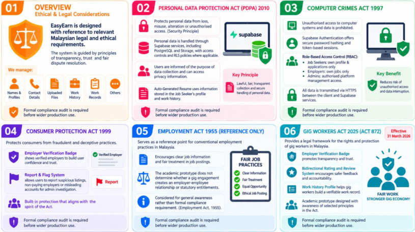

_Figure 3.16: Ethical and Legal Considerations_

## 3.9 System Design

System design converts the requirements specification into a blueprint for building the software, including the design of the software's architecture, data structures, interfaces, and procedural details [21]. This section includes detailed design of the entire system pertaining to the development framework, system architecture, module division, Database design, Use case diagram and System workflow diagrams.

### 3.9.1 Framework

The framework for EasyEarn is built using vanilla HTML5, CSS3, and JavaScript on the frontend, and Supabase as the provider. This tech stack was chosen because it was widely available, free of licensing fees and appropriate for this academic-based student project.

All platform interfaces are built using HTML5 and CSS3, which provide the structure and presentation of all web pages for the platform, allowing them to be responsive and accessible without needing a ‘front-end framework’ [48]. All client-side interactivity, form validation, and CRUD operations are done in vanilla JavaScript, using the Supabase JavaScript Client Library, along with module-level business logic [18]. Avoiding heavy frameworks like React or Angular avoids the complexity of dependencies and keeps code transparent, especially for an academic system built in a short time frame [83].

Within its framework, supplementary libraries are added, such as Chart.js, used to generate interactive analytics charts on the Admin Dashboard and Work History Dashboard, or jsPDF, used to automatically produce PDFs of the resume feature, which is created by the program, so that there is no need for manual formatting on the client side [49], [51]. Google Translate is available throughout the website through site redirection from the navigation bar, allowing multilingual access. The system is deployed and hosted on GitHub Pages, a free, simple and static site hosting service that deploys directly from the project's GitHub repository via HTTPS [77].

### 3.9.2 System Architecture

A three-layer client-server architecture using Supabase BaaS lies at the core of EasyEarn. Instead of installing an application server, this approach reduces the need to do so by using managed backend services offered by Supabase [18]. Figure 3.17 shows that the system is divided into three layers: the Presentation Layer, the Business Logic Layer, and the Data Layer.

The front-end interfaces, built with HTML/CSS/JavaScript, are part of the Presentation Layer. This layer is in charge of rendering role-specific dashboards, interactive UI elements, Chart.js visualisations and the auto-generated resume preview and PDF export on the client side via html2canvas and jsPDF. Supabase JavaScript client library allows the frontend to communicate with Supabase backend services for authentication and database operations without having to use a separate application server [18].

JavaScript modules are the major components of the Business Logic Layer that are implemented on the client side, organised by feature domain, such as authentication management, job listing and application logic, safety and trust operations, work history processing, and handling chatbot responses. This modular structure aids in separating concerns throughout the application and in maintainability and testability throughout the sprint-based development process [84]. Furthermore, certain access control and data handling policies are implemented at the Supabase RLS policy and database level.

Supabase provides the Data Layer, which consists of a Postgres relational database, authentication services including session management via tokens, RLS policies, and some of the database-level business logic [18]. These services enable secure data storage, user authentication, and access control to data based on their roles. That means the current EasyEarn architecture doesn't need an application server, as the needed backend services are managed by Supabase.

EasyEarn's three-layer system architecture is shown in Figure 3.17, which depicts the relationship among the three layers in EasyEarn's system architecture: Presentation Layer, Business Logic Layer, and Data Layer.

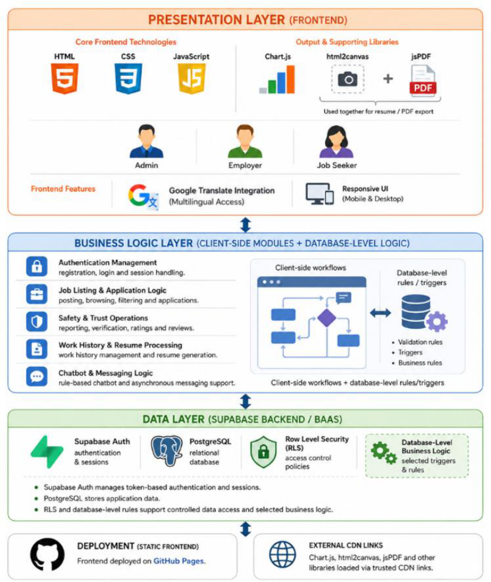

_Figure 3.17: System Architecture Diagram_

### 3.9.3 System Modules and Functionality

EasyEarn is designed with seven key system modules to help solve different parts of the jobmatching process. The relationship of modules and between modules are shown in Figure 3.18.

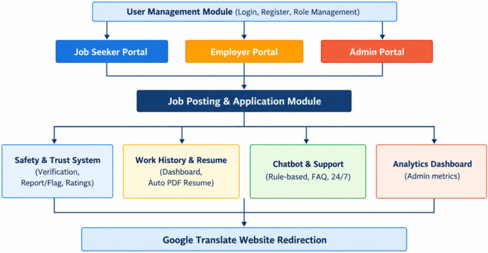

_Figure 3.18: System Module Diagram_

# User Management Module

All three users are managed through the User Management Module, which is the entry point of EasyEarn and is responsible for the registration, login and RBAC for all users. RBAC guarantees that each user can utilise only functions and data that are suitable for their role [85]. Supabase Authentication automatically redirects users to their appropriate dashboards after successful authentication. Client-side role checks are used to help navigate the application based on the user's role; Supabase RLS policies enforce access control at the database level.

# Job Posting and Application Module

The Job Posting and Application Module is the hub of EasyEarn's operations. Employers can add, edit and remove job postings with full CRUD capabilities. Job seekers can view active job postings, apply filters by type and location, and apply directly on the platform. Each application progresses through a multi-stage Application Status Timeline: Pending, Reviewed, Interview (shortlisted for interview), Accepted, Completion Pending (awaiting job seeker payment confirmation), Completed, and Rejected, allowing job seekers to track updates throughout the hiring process.

# Safety and Trust Module

The employment fraud issue on informal gig platforms is a topic that is widely discussed [86] and is covered in this module. It involves three features: the Employer Verification Badge, which is given to a verified employer who provides valid business documents approved by the Administrator; the Report and Flag System, where users can report suspicious listings and accounts. The Bidirectional Rating and Review System allows Job Seekers and Employers to rate and review each other after job completion using a 1–5 star rating and optional written feedback.

# Work History and Resume Module

This module allows individuals in search of employment to create a digital working identity. The Work History Dashboard is automatically populated with completed jobs and displays some of the necessary metrics through Chart.js [51]. The Auto-Generate Resume feature uses jsPDF to generate a downloadable PDF resume from the Job Seeker's stored profile, work history, skills and platform ratings without requiring the user to re-enter or manually format the resume content [49]. EasyEarn's value proposition for low-income, experience-building workers is at the heart of this automated credential-building process.

# Chatbot and Support Module

The rule-based chatbot offers round-the-clock automated support for all users, answers FAQs, guides users through job applications and leads to the appropriate parts of the platform. Rulebased chatbots are based on a set of rules and keywords, and their responses are consistent and predictable, making them suitable for a structured FAQ-based support system [87]. All interactions with the chatbot are stored in Supabase and are available for use by the Administrator as a tool to improve accuracy over time.

# Admin and Analytics Module

This module allows administrators to manage the platform through a dedicated Admin Dashboard, including User Account Management, Job Listing Moderation, Employer Verification Review and Report Resolution. Platform analytics, using Chart.js, provide users with valuable insights such as the number of registered users, active job postings, total job applications and successful job matches [51].

# Google Translate Integration

The navigation bar includes a Google Translate site redirection for multilingual access that lets users translate the website into the languages they can understand, including Bahasa Melayu, Mandarin, Tamil, and more [53]. This feature allows for multilingual accessibility for users in Malaysia's various regions with different languages, such as smaller towns and rural areas where English might not be as widely used.

### 3.9.4 Database Design

The EasyEarn database is realised as a relational schema in the Supabase PostgreSQL system, with twelve tables, each of which holds all the platform data. Relational databases are designed to store data in a structured format with tables and relationships defined and validated by primary key (PK) and FK constraints, ensuring data integrity and consistency [88]. The ERD shown in Figure 3.19 shows the relationships between the different tables, their PKs and FKs.

The core table is users, which holds all user records, irrespective of role, such as personal information, role designation, verification status, skill tags, availability, account status, etc. The job_listings table contains every job posting by an employer and references back to the users table through the FK employer_id and the field approved_by (Administrator reference). Job seekers are linked to job applications in the applications table, and the status of applications is monitored throughout their life cycle.

The ratings table supports the bidirectional rating system by referencing the completed application and the users involved as reviewer and reviewee. The work_history table is populated for completed work and references the Job Seeker through seeker_id and the completed application through application_id. Payment confirmations and disputes are stored in the payments table, while user-submitted reports are stored in the reports table for Admin review.

There are supporting tables such as saved_jobs for the job wishlist feature, notifications for generated system alerts, analytics for aggregating platform-wide metrics, chatbot_knowledge for the rule-based chatbot knowledge base and chatbot_logs for the interaction history. All tables are primary keyed with Universally Unique Identifiers (UUIDs), which are globally unique and are resistant to enumeration attacks [89].

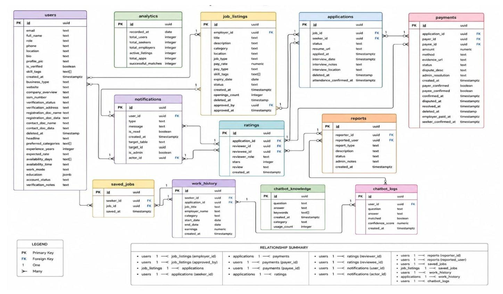

_Figure 3.19: Entity-Relationship Diagram (ERD)_

### 3.9.5 Data Dictionary

The Data Dictionary offers a detailed description of each of the EasyEarn Supabase PostgreSQL database's columns. The column name, data type, constraints that can be applied to the column, and a description in plain English of what the column represents are all provided in each table entry. All primary keys are based on UUIDs created by gen_random_uuid(), and RLS is applied on all twelve tables to ensure that users can only access data for which they have permissions.

#### 3.9.5.1 users

The users table is the central table of the EasyEarn database. It contains all registered user accounts, including job seekers, employers and administrators. The personal profile information, such as skills, availability, education, and similar data, is stored in a single record along with the employer-specific data, such as Suruhanjaya Syarikat Malaysia (SSM) number, verification documents, etc., and irrelevant fields are kept as NULL based on the role of the user. Table 3.10 shows the data dictionary for the users table, which defines the names, data types, constraints, and descriptions of the table columns.

_Table 3.10: Data Dictionary - users_

|**Column Name**|**Data Type**|**Constraint**|**Description**|
|---|---|---|---|
|id|UUID|PK, NOT NULL|Unique identifier for every user record|
|email|TEXT|NOT NULL|User's login email address|
|full_name|TEXT|NOT NULL|User's full display name|
|role|TEXT|NOT NULL|Account role: job_seeker / employer / admin|
|phone|TEXT|NULL|Contact phone number|
|location|TEXT|NULL|User's state or city|
|bio|TEXT|NULL|Short personal or company description|

||||Uniform Resource Locator|
|---|---|---|---|
|profile_pic|TEXT|NULL|(URL) to the uploaded profile photo|
|is_verified|BOOLEAN|DEFAULT false|Employer verification flag|
|skill_tags|TEXT[]|NULL|An array of skills for job matching|
|headline|TEXT|NULL|Short professional headline|
|preferred_categories|TEXT[]|NULL|Job categories the seeker is interested in|
|experience_years|INTEGER|NULL|Years of work experience|
|expected_rate|TEXT|NULL|Preferred pay rate|
|availability_days|TEXT[]|NULL|Available working days|
|availability_time|TEXT|NULL|Available working time range|
|work_mode|TEXT|NULL|Preferred work mode: remote/onsite|
||||Education data in JavaScript|
|education|JSONB|NULL|Object Notation (JSON) format.|
|business_type|TEXT|NULL|Employer business type (employer only)|
|website|TEXT|NULL|Company website URL (employer only)|
|company_overview|TEXT|NULL|Company description (employer only)|
|ssm_number|TEXT|NULL|SSM company registration number|
|verification_status|TEXT|NULL|Verification state: pending/approved/rejected|
|verification_address|TEXT|NULL|Registered business address|
|registration_doc_name|TEXT|NULL|SSM document file name|
|registration_doc_data|TEXT|NULL|SSM document stored as base64|

|contact_doc_name|TEXT|NULL|Contact person document file name|
|---|---|---|---|
|contact_doc_data|TEXT|NULL|The contact person document is stored as base64|
|verification_notes|TEXT|NULL|Instructions for administering a note about the verification|
||||result|
|account_status|TEXT|DEFAULT 'active'|Account state: active / suspended|
|deleted_at|TIMESTA MP|NULL|Soft delete timestamp; NULL means active|
|ratdat|TIMESTA|DEFAULT|Ant ratin timtam|
|cee_|MP|now()|ccou ceo esp|

#### 3.9.5.2 job_listings

The easyearn job_listings table contains all the job postings made by employers on the EasyEarn platform. Each record is foreign-keyed to the user’s table to identify the employer and documents the entire process of a listing from creation to admin approval to its expiration. Job Seekers can view active job listings that have been approved for publication. The data dictionary for the job_listings table is shown in Table 3.11, which lists the columns that store all the jobs posted by the employers on the platform.

_Table 3.11: Data Dictionary - job_listings_

|**Column Name**|**Data Type**|**Constraint**|**Description**|
|---|---|---|---|
|id|UUID|PK, NOT NULL|Unique identifier for each job listing|
|employer_id|UUID|FK → users.id|The employer who created the listing|

|title|TEXT|NOT NULL|Job title displayed to job seekers|
|---|---|---|---|
|description|TEXT|NULL|Full job description and requirements|
|category|TEXT|NULL|Job category (e.g. F&B, Events, Delivery)|
|location|TEXT|NOT NULL|Job location by state or city|
|job_type|TEXT|NULL|Employment type: part-time / gig / flexible|
|pay_rate|NUMERIC|NULL|Pay amount offered|
|pay_type|TEXT|NULL|Pay basis: hourly / daily|
|skill_tags|TEXT[]|NULL|Required skills for the role|
|expiry_date|DATE|NULL|Application closing date|
|openings_count|INTEGER|DEFAULT 1, ≥ 0|Number of available vacancies|
|status|TEXT|DEFAULT 'open'|Listing status: open / closed|
|approved_by|UUID|FK → users.id|Admin who approved the listing|
|approved_at|TIMESTAMP|NULL|Timestamp when the listing was approved|
|deleted_at|TIMESTAMP|NULL|Soft delete timestamp; NULL means active|
|created_at|TIMESTAMP|DEFAULT now()|Listing creation timestamp|

#### 3.9.5.3 applications

The applications table stores all of a job seeker's applications. It monitors the entire application process from submission to employer evaluation to acceptance or rejection and also records the interview scheduling information after an employer has provided a short list of candidates. Table 3.12 provides a complete listing of the data dictionary for the applications table, which

includes information on the columns used to capture the lifecycle of each job seeker's application.

_Table 3.12: Data Dictionary - applications_

|**Column Name**|**Data Type**|**Constraint**|**Description**||
|---|---|---|---|---|
|id|UUID|PK, NOT NULL|Unique identifier for application|each|
|job_id|UUID|FK → job_listings.id|The job listing that applied to|was|
|seeker_id|UUID|FK → users.id|Job seeker who subm the application|itted|
|status|TEXT|DEFAULT 'pending'|Application s pending/reviewed/inter accepted/completion_p g/completed/rejected|tatus: view/ endin|
|resume_url|TEXT|NULL|URL to the subm resume file|itted|
|applied_at|TIMESTAMP|DEFAULT now()|Timestamp when application was submitt|the ed|
|interview_date|TIMESTAMP|NULL|Scheduled interview and time|date|
|interview_notes|TEXT|NULL|Employer notes on interview|the|
|interview_location|TEXT|NULL|Interview venue or G Meet|oogle|
|attendance_confirmed_at|TIMESTAMP|NULL|Timestamp when attend was confirmed|ance|
|deleted_at|TIMESTAMP|NULL|Soft delete timest NULL means active|amp;|

#### 3.9.5.4 payments

The payments table documents all payments made by employers to job-seekers after a job is finished. It handles all payments from start to finish, including confirmation by both parties, filing of disputes and administrative resolution. Payment evidence is saved as a URL link to a screenshot uploaded with evidence. The payments table contains a set of data columns to record and track every payment transaction between the employer and the job seeker, as shown in Table 3.13.

_Table 3.13: Data Dictionary - payments_

|**Column Name**|**Data Type**|**Constraint**|**Description**|
|---|---|---|---|
|id|UUID|PK, NOT NULL|Unique identifier for each payment record|
|application_id|UUID|FK → applications.id|Application this payment is linked to|
|payer_id|UUID|FK → users.id|The user who made the payment|
|payee_id|UUID|FK → users.id|The user who received the payment|
|amount|NUMERIC|NOT NULL|Payment amount in Malaysian Ringgit (MYR)|
|method|TEXT|DEFAULT 'DuitNow'|Payment method used|
|evidence_url|TEXT|NULL|URL to the uploaded payment proof screenshot|
|||DEFAULT|The payment status is|
|status|TEXT| 'pending'|pending/confirmed/disputed/ resolved|
|dispute_desc|TEXT|NULL|Description of the payment dispute|
|admin_resolution|TEXT|NULL|Admin resolution note for the dispute|

|payer_confirmed|BOOLEAN|DEFAULT false|Whether the payer confirmed the payment|
|---|---|---|---|
|payeeconfirmed|BOOLEAN|DEFAULT|Whether the payee|
|_||false|confirmed receipt|
|confirmed_at|TIMESTAMP|NULL|Timestamp when payment was confirmed|
|disputed_at|TIMESTAMP|NULL|Timestamp when the dispute was raised|
|resolved_at|TIMESTAMP|NULL|Timestamp when the dispute was resolved|
|employer_paid_at|TIMESTAMP|NULL|Timestamp employer marked as paid|
|seeker_confirmed_at|TIMESTAMP|NULL|Timestamp seeker acknowledged receipt|
|deleted_at|TIMESTAMP|NULL|Soft delete timestamp; NULL means active|
|created_at|TIMESTAMP|DEFAULT now()|Record creation timestamp|

#### 3.9.5.5 ratings

The ratings table enables Employers and Job Seekers to rate and review each other after job completion, thereby supporting the Bidirectional Rating and Review System. Each rating is attached to a specific use, and it includes the role that the user placed it in, the star score and an optional written rating in order to create a platform of trust and accountability. The data dictionary for the ratings table is shown in Table 3.14, which lists the columns that are used to implement the bidirectional ratings and reviews between employers and job seekers.

_Table 3.14: Data Dictionary - ratings_

|**Column Name**|**Data Type**|**Constraint**|**Description**|
|---|---|---|---|
|id|UUID|PK, NOT NULL|Unique identifier for each rating record|
|application_id|UUID|FK → applications.id|Completed application this rating is for|
|reviewer_id|UUID|FK → users.id|The user who submitted the rating|
|reviewee_id|UUID|FK → users.id|The user who received the rating|
|reviewer_role|TEXT|NULL|Role of the reviewer: employer / job_seeker|
|stars|INTEGER|NULL|Star rating from 1 (lowest) to 5 (highest)|
|review|TEXT|NULL|Written review comment|
|created_at|TIMESTAMP|DEFAULT now()|Timestamp when the rating was submitted|

#### 3.9.5.6 reports

The reports table contains all user-generated reports of suspicious activity on the site, whether that pertains to job scams, fake listings, or non-paying employers. Admin review and resolution is the backbone of EasyEarn's safety and trust system, with each report being reviewed and resolved by an admin. All user-submitted reports of suspicious activity for administrator review are stored in the columns defined in the data dictionary of the reports table, which can be seen below in Table 3.15.

_Table 3.15: Data Dictionary - reports_

|**Column Name**|**Data Type**|**Constraint**|**Description**|
|---|---|---|---|
|id|UUID|PK, NOT NULL|Unique identifier for each report record|
|reporter_id|UUID|FK → users.id|The user who filed the report|
|reported_user|UUID|FK → users.id|The user who is being reported|
|report_type|TEXT|NULL|Type of report: scam / fake_listing / non_payment|
|description|TEXT|NULL|Detailed description of the reported issue|
|status|TEXT|DEFAULT 'pending'|Report status: pending/reviewed/resolved|
|admin_notes|TEXT|NULL|Admin's investigation and action notes|
|created_at|TIMESTAMP|DEFAULT now()|Timestamp when the report was submitted|

#### 3.9.5.7 saved_jobs

The saved_jobs table provides the job wishlist capability, which lets job-seekers save jobs they are interested in viewing later. Each record is an association between a job seeker and one particular job listing, with the time of entry into the record. Table 3.16 shows the data dictionary for saved_jobs, which contains a list of the columns included in the table to store details of jobs that are bookmarked by job seekers for future consideration.

_Table 3.16: Data Dictionary - saved_jobs_

|**Column Name**|**Data Type**|**Constraint**|**Description**|
|---|---|---|---|
|id|UUID|PK, NOT NULL|Unique identifier for each saved job record|
|seeker_id|UUID|FK → users.id|Job Seeker who marked this listing as a favourite|
|job_id|UUID|FK → job_listings.id|Job listing that was saved|
|saved_at|TIMESTAMP|DEFAULT now()|Timestamp when the job was saved|

#### 3.9.5.8 work_history

The work_history table is used to keep a history of all Gig Jobs that a job seeker has finished on EasyEarn that can be verified. Job seeker records are automatically generated when jobs are completed and information is automatically synced into the job seeker's work history dashboard and an auto-generated PDF resume using jsPDF. Table 3.17 is the data dictionary of the work_history table, where the columns are used to automatically log and store each job seeker's gig completion data.

_Table 3.17: Data Dictionary - work_history_

|**Column Name**|**Data Type**|**Constraint**|**Description**|
|---|---|---|---|
|id|UUID|PK, NOT NULL|Unique identifier for each work history entry|
|seeker_id|UUID|FK → users.id|Job Seeker who owns this work history record|
|application_id|UUID|FK → applications.id|Completed application associated with this work history record|
|job_title|TEXT|NOT NULL|Title of the completed job|

|employer_name|TEXT|NULL|Name of the employer for this job|
|---|---|---|---|
|category|TEXT|NULL|This entry's category of jobs|
|start_date|DATE|NULL|Date the job started|
|end_date|DATE|NULL|Date the job ended|
|earnings|NUMERIC|NULL|Total earnings from this completed job|
|created_at|TIMESTAMP|DEFAULT now()|Timestamp when the record was created|

#### 3.9.5.9 notifications

Notifications is the table that contains all the notifications sent out by the system to users on the platform. An event, like a new application being received, an application status change, or a verification result, triggers notifications. Every record indicates if the recipient has read the notification. Table 3.18 is the data dictionary for the notifications table, which describes the columns that can be used to store and manage all the system-generated notifications that are sent to the users of the platform.

_Table 3.18: Data Dictionary - notifications_

|**Column Name**|**Data Type**|**Constraint**|**Description**||
|---|---|---|---|---|
|id|UUID|PK, NOT NULL|Unique identifier for notification|each|
|user_id|UUID|FK → users.id|The user who receives notification|this|
|actor_id|UUID|FK → users.id|The user who triggered notification event|the|
|type|TEXT|NULL|Notification type application_update)|(e.g.|

||||The notification message|
|---|---|---|---|
|message|TEXT|NULL|content is displayed to the|
||||user|
|is_read|BOOLEAN|DEFAULT false|Whether the user has read this notification|
|is_admin|BOOLEAN|DEFAULT false|Whether this is an admin- targeted notification|
|target_table|TEXT|NULL|Name of the related database table|
|target_id|UUID|NULL|UUID of the related record in target_table|
|rtdt|TIMESTAMP|DEFAULT|Timestamp when the|
|ceae_a||now()|notification was created|

#### 3.9.5.10 chatbot_knowledge

EasyEarn's rule-based chatbot utilises the chatbot_knowledge table as its knowledge base. Every entry contains a sample question, a group of matching keywords and a prepared response. The chatbot looks for these words at runtime and returns relevant guidance without having to rely on an external AI service. The data dictionary for the chatbot_knowledge table, which contains the columns of the rule-based chatbot's question-answer knowledge base, is presented in Table 3.19 below.

_Table 3.19: Data Dictionary - chatbot_knowledge_

|**Column Name**|**Data Type**|**Constraint**|**Description**|
|---|---|---|---|
|id|UUID|PK, NOT NULL|Unique identifier for each knowledge entry|
|question|TEXT|NOT NULL|Sample question used for chatbot matching|

|answer|TEXT|NOT NULL|Chatbot response returned when matched|
|---|---|---|---|
|keywords|TEXT[]|NULL|An array of keywords to match logic based on rules|
|category|TEXT|NULL|Knowledge category: general / jobs|
|usage_count|INTEGER|DEFAULT 0|Number of times this entry has been matched|
|created_at|TIMESTAMP|DEFAULT now()|Timestamp when the entry was created|

#### 3.9.5.11 chatbot_logs

The chatbot_logs table has all the logs of the users interacting with the EasyEarn chatbot. Each log entry includes the user's question, the response of the chatbot, a boolean indicating whether a knowledge base match was found and the confidence score for that match. This information can be used by the administrator to track the performance of the chatbot and determine any knowledge gaps. The data dictionary for table chatbot_logs is shown in Table 3.20 and includes the definition of every column that is used to store every interaction of the user with the EasyEarn chatbot.

_Table 3.20: Data Dictionary - chatbot_logs_

|**Column Name**|**Data Type**|**Constraint**|**Description**|
|---|---|---|---|
|id|UUID|PK, NOT NULL|Unique identifier for each chatbot interaction log|
|user_id|UUID|FK → users.id|User who interacted with the chatbot; NULL if anonymous|
|question|TEXT|NULL|Question or message sent by the user|

||||**BIT 3118 Final Year Pr**|**oject 2**|
|---|---|---|---|---|
|answer|TEXT|NULL|Response returned b chatbot|y the|
|matched|BOOLEAN|DEFAULT false|Whether the question match for a knowledge|is a base|
|confidence_score|NUMERIC|NULL|Matching confidence from the rule-based eng|score ine|
|created_at|TIMESTAMP|DEFAULT now()|Timestamp when interaction was logged|the|

#### 3.9.5.12 analytics

Admin Dashboard is dynamically calculated from user, jobs, reports and other tables within the core platform. These metrics can be stored periodically in the analytics table as snapshots for historical reference, which is an option. Every snapshot record stores the number of total users, jobs and applications that are active on the platform at the time of the snapshot and can be monitored as overall growth and activity of the platform through the Chart.js visualisation. Table 3.21 is the data dictionary for the analytics table that holds this periodic snapshot data.

_Table 3.21: Data Dictionary - analytics_

|**Column Name**|**Data Type**|**Constraint**|**Description**|
|---|---|---|---|
|id|UUID|PK, NOT NULL|Unique identifier for each analytics snapshot|
|recorded_at|DATE|DEFAULT CURRENT_DATE|Date this snapshot was recorded|
|total_users|INTEGER|DEFAULT 0|Total number of registered user accounts|
|total_seekers|INTEGER|DEFAULT 0|Total number of job seeker accounts|
|total_employers|INTEGER|DEFAULT 0|Total number of employer accounts|

|---|---|---|---|
|active_listings|INTEGER|DEFAULT 0|Number of currently active job listings|
|total_apps|INTEGER|DEFAULT 0|Total number of applications submitted|
|successful_matches|INTEGER|DEFAULT 0|Total number of completed jobs|

### 3.9.6 Use Case Diagram

A use case diagram is a behavioural diagram in the Unified Modelling Language (UML) that shows the interactions between the external actors and the functional use cases of the system [90]. Figure 3.20 shows three main actors in EasyEarn: Job Seeker, Employer and Admin. The use cases are grouped according to the functions available to each actor.

The Job Seeker Module consists of 11 use cases: Browse and Search Jobs, Save Jobs, Apply for Jobs, Track Applications, View Interviews, Chatbot Assistance, Build Resume/Profile, View Work History, Messaging/Chat, Receive Notifications, and Rate Employer. The Employer Module contains 9 use cases: Post Job Listing, Manage Job Listings, View Applicants, Manage Hiring Pipeline, Company Profile, Messaging/Chat, Submit Verification Request, Rate Job Seekers, and Chatbot Assistance. The Admin Module has 6 use cases: User Management, Job Moderation, Approve Employer Verification, Platform Analytics, Handle Reports, and Chatbot Assistance. The <<notify>>, <<moderate>> and <<verify>> stereotype connectors show relationships between modules because of the cross-role dependencies in the platform's trust and safety architecture.

The dedicated Interviews page is the implementation of the View Interviews use case, and is where Job Seekers can view scheduled interview appointments for upcoming, confirmed and completed interviews created by Employers. The Application Status Timeline also includes the status of applications for interviews.

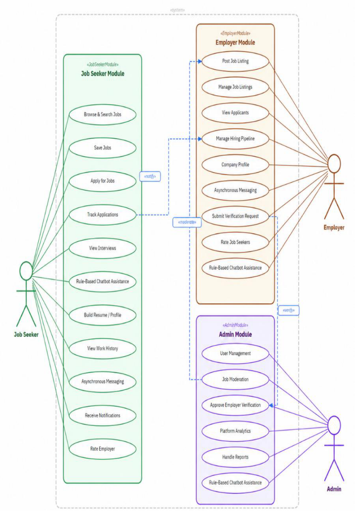

_Figure 3.20: Use Case Diagram_

### 3.9.7 System Flow

System flow diagrams show a logical sequence of operations, decision points, and interactions between various components of a process in a system, as a structured visual recipe for the logic of the operations performed by the system [21]. There are four system workflow diagrams for EasyEarn: Full System Workflow, Job Seeker Workflow, Employer Workflow, and Admin Workflow.

# Full System Workflow

Figure 3.21 shows the overall workflow between all three user roles, called a Full System Workflow. Users visit EasyEarn, register and choose their role. The Job Seeker Portal is used to direct job seekers to look at and apply for jobs. Employers are referred to the Employer Portal, where they can post jobs and look at applicants. The Admin Portal enables administrators to check employers and to manage the reports. All three flows stream into the Job Matching and Application Module, an application lifecycle management module from submission to completion of the job. Once the job is finished, both parties agree on the payment and provide ratings, which completes the transactional cycle.

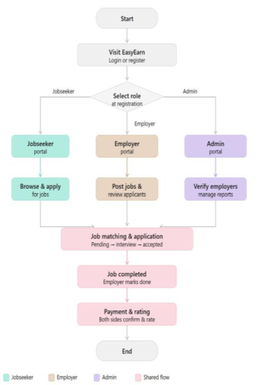

_Figure 3.21: Full System Workflow_

# Job Seeker Workflow

The Job Seeker Workflow starts with registration, followed by profile setup, including skills, availability and profile photo. The Job Seeker then browses job listings by category and location and applies for a suitable job. If shortlisted, the Job Seeker attends the scheduled interview. If subsequently accepted, the Job Seeker proceeds with the job. After the work is completed, the Employer confirms payment and the Job Seeker confirms receipt before the application is marked as completed. The completed job is then added to the Job Seeker's work history, and the Job Seeker can rate and review the Employer. If the application is rejected, the Job Seeker can continue applying for other available jobs.

Figure 3.22 shows the Job Seeker workflow in EasyEarn, starting from registration and profile setup, and proceeding with the job application and job completion, up to the Employer rating.

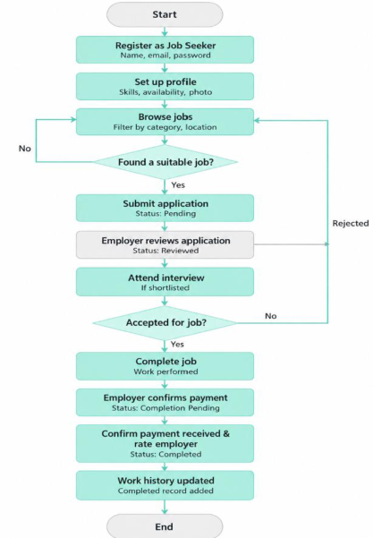

_Figure 3.22: Job Seeker System Workflow_

# Employer Workflow

Employer registration is done through an Employer Code and submission of Employer KYB documents (SSM number and Business documents) to the Administrator for review. The employer will be issued a Verification Badge upon approval. The employer then publishes jobs, checks applicants' profiles, accepts and rejects applicants, arranges interviews, records the attendance of the job seeker, uploads evidence of payment and rates the job seeker.

Figure 3.23 shows the Employer workflow in EasyEarn, including the registration process, the submission of KYB documents, job posting, applicant management and payment confirmation.

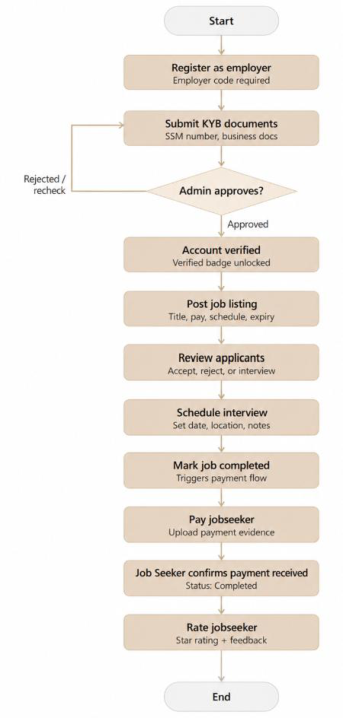

_Figure 3.23: Employer System Workflow_

# Admin Workflow

This is the Admin Workflow, which starts with login using a valid Admin account.  Once the Administrator logs into the Admin Dashboard, he/she is presented with 3 paths from which to select a task to perform: Verify (to review the employer KYB documents and approve/reject); Reports (to triage received user reports and take action based on the same such as warning, suspend, or resolve); Users (to view, suspend, or restore user accounts). Once complete, the Administrator is able to review the platform analytics, which includes platform metrics, user and job information, and then decides whether to complete more tasks.

The EasyEarn Admin workflow is detailed in Figure 3.24, with secure login, employer verification review, report management, user account management and platform analytics review.

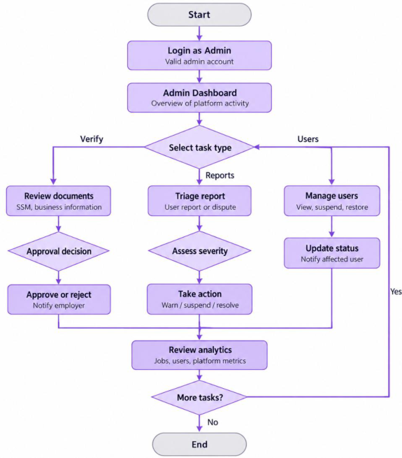

_Figure 3.24: Admin System Workflow_

## 3.10 Wireframe

Wireframes are low-fidelity sketches of a UI that outline the elements, hierarchy and functionality of each screen without being concerned with the visual design elements like typography and colour [91]. The wireframes were created using the Canva app and act as the UI/UX prototype for the EasyEarn project throughout the Agile sprint phases. Below, each wireframe is shown with a description of its main features and the reasoning behind its design.

### 3.10.1 Landing Page (Index)

The Landing Page (Index) is the front page of EasyEarn that is visible to everyone before logging in or registering. The page has a hero section that includes a prominent tagline, “Find Jobs. Hire Talent. EasyEarn,” and two main call-to-action buttons: “Find a Job” and “Post a Job”. The platform's value proposition, including the Why EasyEarn section that provides six key features (Verified Employers, Auto Resume, Location Filter, Instant Apply, Messaging, and Analytics), the Browse Opportunities section, a Project Scope and Modules summary, and a Functionalities and Security overview, is listed below the hero section. The page ends with a "Create Free Account" link and a footer with navigation links.

Figure 3.25 shows the wireframe for the EasyEarn Landing Page, featuring the hero section, call-to-action buttons, and platform feature highlights.

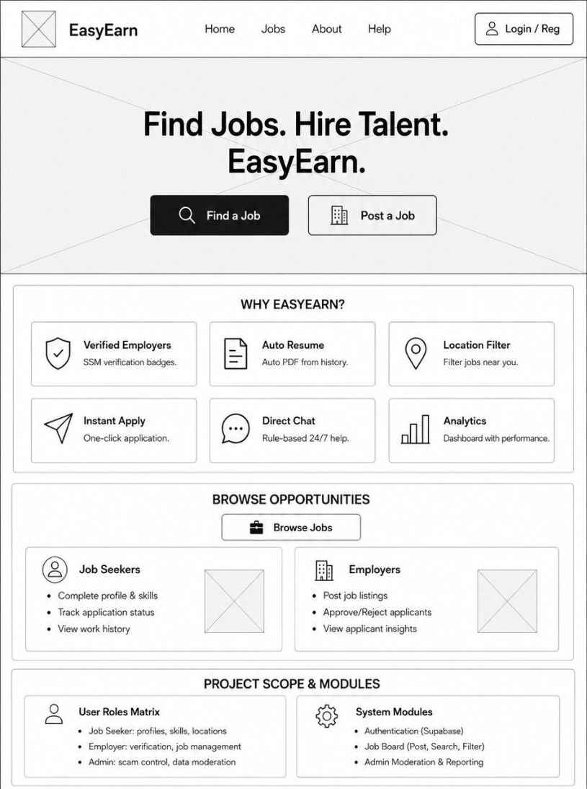

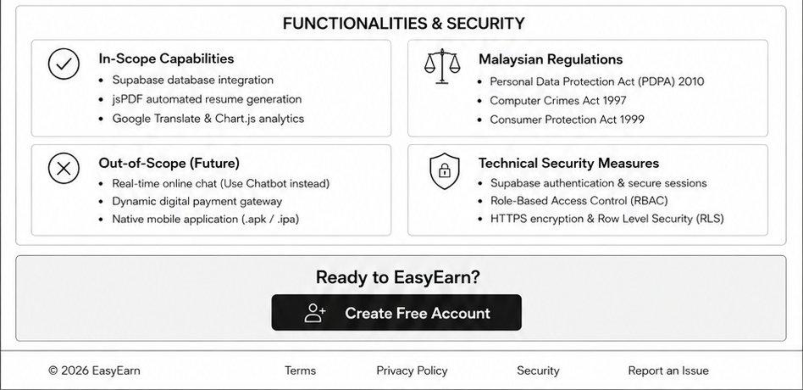

_Figure 3.25: Wireframe for Landing Page (Index)_

### 3.10.2 Registration Page

The Register page allows new users to create an EasyEarn account by entering their full name, email, and a password that meets the minimum security requirement of at least 6 characters with one special character. Users need to choose their role, either Job Seeker, Employer or Admin, because this determines what will be available on their dashboard once they log in. If the Employer or Admin role is selected, then the conditional secure code field will appear, providing further access controls. The account is generated as soon as it is submitted, and the user is directed to their account dashboard.

Figure 3.26 shows the wireframe of the Registration Page with fields for the Job Seeker and Employer registration forms.

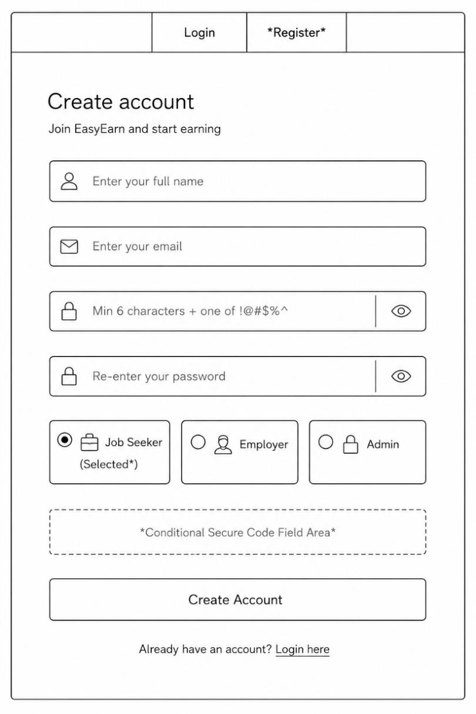

_Figure 3.26: Wireframe for Registration Page_

### 3.10.3 Login Page

The login page enables existing users to log in with their registered email and password. For convenience, there is a toggle button that shows/hides the password. Users without an account are directed to the Register page via the "Register here" link at the bottom.

Figure 3.27 shows the wireframe of the Login Page that includes a role selection box, email and password text boxes.

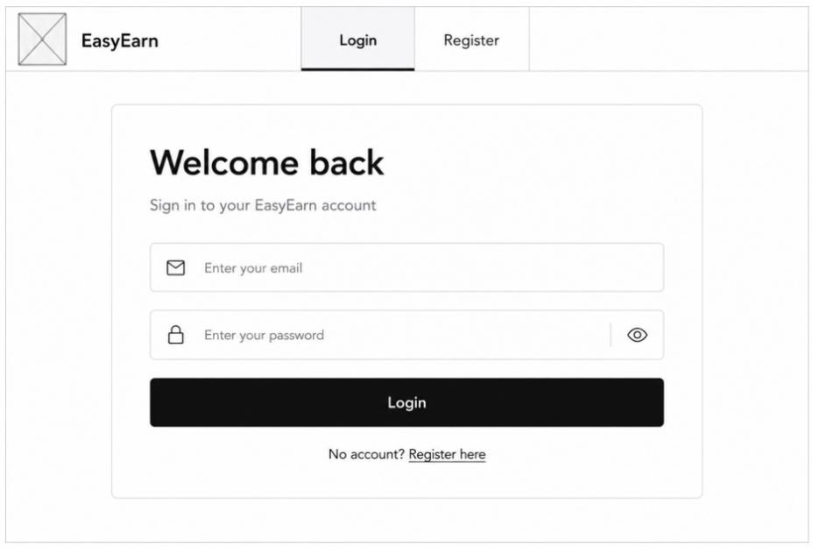

_Figure 3.27: Wireframe for Login Page_

### 3.10.4 Job Listing Page

The Unified Job Listing Page gives authenticated job seekers access to all available job listings on the platform, or search for jobs by filtering them. The page features a search box to search by title, a filter dropdown to search by location, and an advanced filter button. Job postings are presented as a card listing the job title, the employer, the location, the salary, and the schedule. For wishlisting, there is a Save button on each card, and for immediate application submission, there is an Apply Now button (FR05). There is a Saved Jobs section below the active listings that lists and saves bookmarked jobs, and allows users to delete or directly apply to them (FR07).

Figure 3.28 shows the wireframe for a Job Listing Page, featuring job cards that include search and filter functions, as well as save and apply functions.

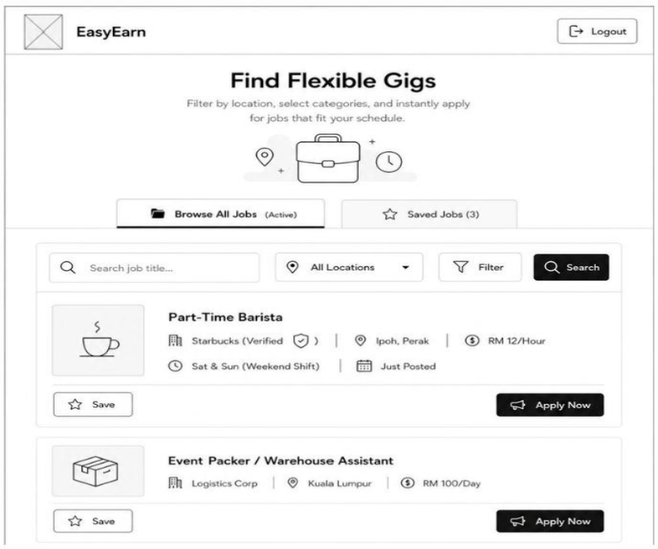

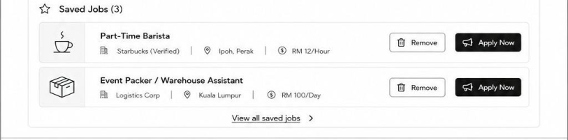

_Figure 3.28: Wireframe for Job Listing Page_

### 3.10.5 Job Seeker Dashboard

The Job Seeker Dashboard is an authenticated job seeker's personal hub. A welcome banner welcomes the user and shows their name, profile photo and what percentage of the profile is complete. The Overview Snapshot section provides summary data, such as profile completion, which includes a progress bar. Four action cards quickly take you to the key functions of the platform: Update Profile (includes the ability to add a headline, preferences, and skills), Review Applications (shows the status of your applications), Build Resume (auto-generates a PDF resume), and Check Work History (displays completed gigs and payments earned). The primary action buttons, “Open Jobs” and “Edit Profile”, are clearly displayed to provide quick access to commonly used functions.

The Job Seeker Dashboard's wireframe includes the welcome banner, a progress indicator for completing the profile, and four quick-action cards, as shown in Figure 3.29.

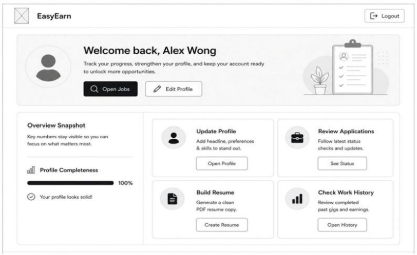

_Figure 3.29: Wireframe for Job Seeker Dashboard_

### 3.10.6 Job Seeker Resume Builder

The Resume Builder page implements the Auto-Generate Resume feature (FR09) using jsPDF and html2canvas to create a downloadable PDF resume from the Job Seeker's stored profile and work history data [49]. The “Refresh from Profile” button retrieves the latest available data from Supabase and updates the resume preview, while the “Download PDF” button uses jsPDF and html2canvas to generate the PDF on the client side.

The auto-generated resume displays an A4 printable preview containing the contact details, location, work mode preferences, profile photo, job seeker name and headline. The resume is divided into 4 sections: Summary and Preferences, Skills (shown as tag chips filled with the skill_tags field from the users table), System Metrics Summary (automatically generated from the work_history and ratings tables, showing the number of gigs completed, amount of income tracked, and average job rating), and References (filled with verified employer feedback entries from the ratings table upon gig completion). The resume preview is dynamically generated from the profile, work history and rating data available in Supabase at the time it is refreshed.

Figure 3.30 shows the Job Seeker Resume Builder wireframe, which displays the template, including the automatic generation of an A4 PDF template preview and sections for skills, work experience, and employer ratings.

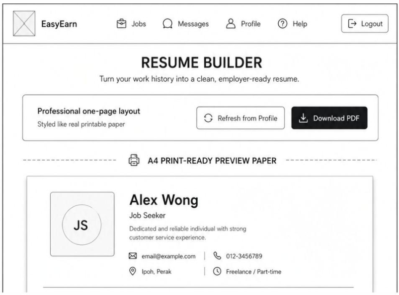

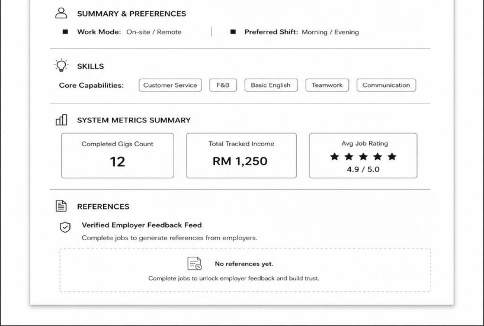

_Figure 3.30: Wireframe for Job Seeker Resume Builder (Auto-Generated)_

### 3.10.7 Employer Dashboard

The Employer Dashboard gives employers a single view into their hiring activity. The page is split into two panels: the left panel ("Employer Dashboard") displays quick action buttons for Manage Jobs and Edit Profile, while the right panel ("Current Build") summarises the employer's connected workflow status. The Active Jobs, Pending Review, Total Applicants and Trust Verified status are shown in four statistics cards at a glance. The bottom section includes a Verification Status Check panel showing the Employer's current verification status and prompting the Employer to complete the verification process where required.

Figure 3.31 provides the wireframe for the Employer Dashboard containing statistics cards, verification status and the application breakdown chart.

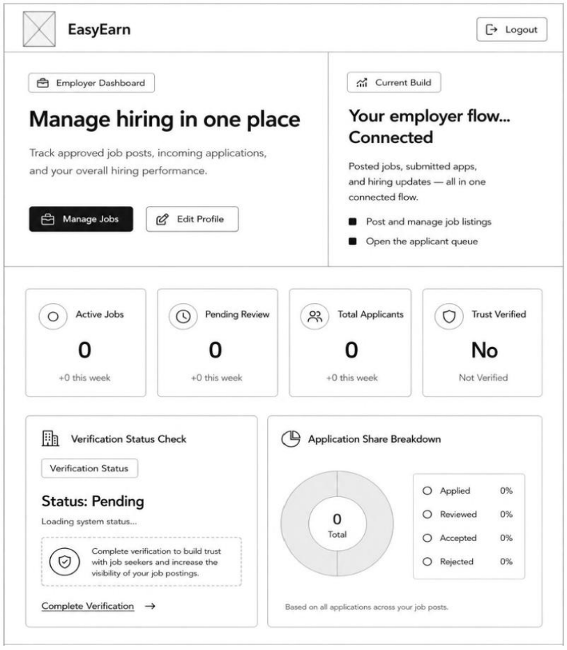

_Figure 3.31: Wireframe for Employer Dashboard_

### 3.10.8 Employer Manage Jobs

The Manage Jobs page allows the employer to add, edit and track all their job postings in one workspace. The left side shows a Post/Edit Job Listing form with a Publish Job/Save Changes button, and fields for Job Title, Hourly Rate (RM/Hr), State Category, Location State, Area Details, and Job Description. On the right, you will see a dynamically loaded list of Job Post Records that are active, with the title, category icon, posting date, location, and pay rate. Every listing card includes Edit and Applicants buttons for easy management. The Published, Pending Review, Total Applicants, and Completed Gigs counts are displayed at the top of the page as 4 different summary statistics.

Figure 3.32 is a wireframe of the Employer Manage Jobs page where the job posting form is displayed and the active job listing records are displayed.

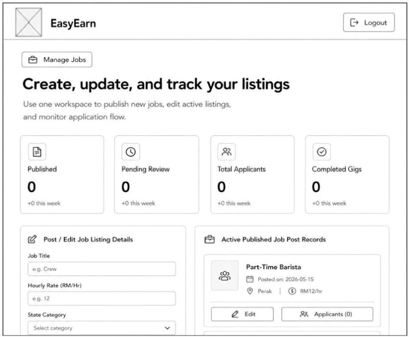

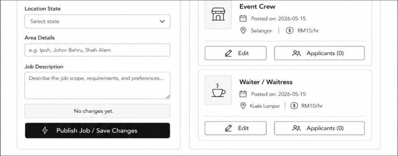

_Figure 3.32: Wireframe for Employer Manage Jobs_

### 3.10.9 Employer Applicants

The Hiring Pipeline Queue is displayed on the Employer Applicants page and displays all of the applicants from the employer's open job postings. At the top of the page, there are four summary counters: Applied, Reviewed, Accepted, and Completed that show the counts for the current period. A view of each applied job entry in the queue will display the name of the applicant, the job title they applied for, a link to open their auto-generated Resume Summary, and a badge indicating their job's status (Applied, In Review, or Reviewed). There are four action buttons for each applicant: Accept Applicant, Message Seeker, Reject, and Mark as Completed. If the employer clicks on Mark as Completed, a Finalise Completion Details window appears and asks the employer to provide the Final Earnings Paid (RM) and Completed Date before it is finalised. This confirmation will cause the work history to be automatically updated, and the credential to be transferred to the job seeker's profile and update the autofilled resume information.

Figure 3.33 shows the Employer Applicants wireframe with the hiring pipeline queue and applicant action buttons.

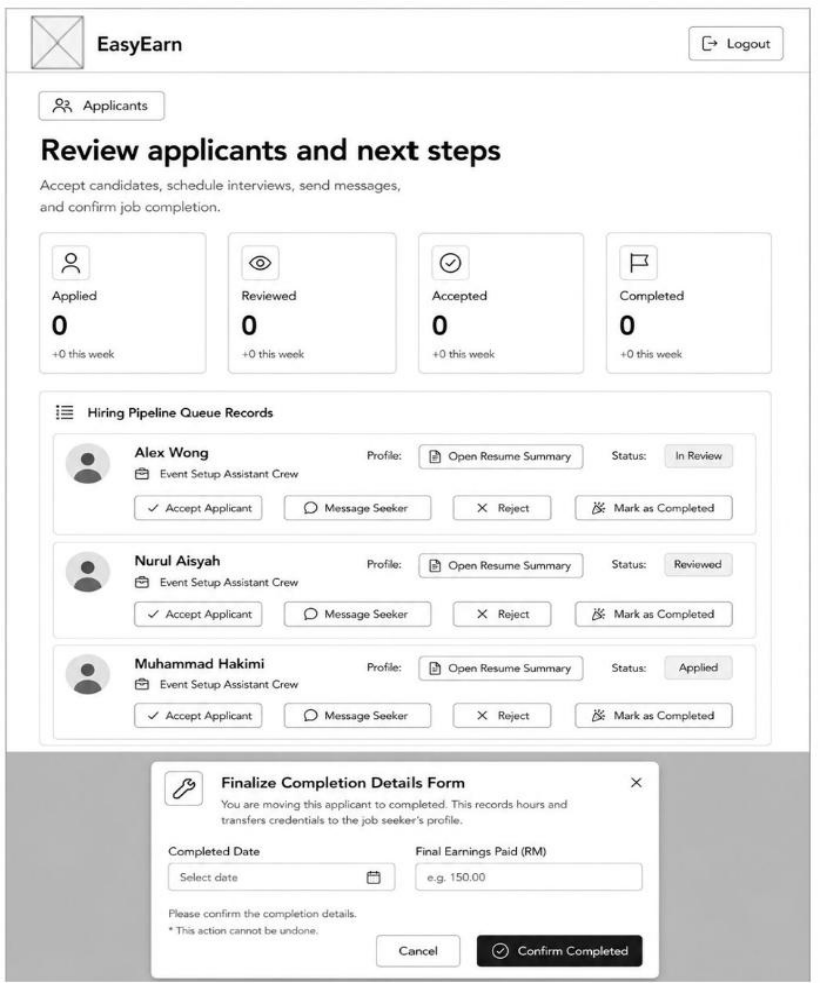

_Figure 3.33: Wireframe for Employer Applicants_

### 3.10.10 Admin Dashboard

The Admin Dashboard gives the Administrator an overview of the platform. The four statistics cards at the top of the screen show the total number of Users, Reports, Verifications, and Jobs, and include a weekly change indicator. The two main buttons, "Open Reports" and "Review Verifications", are prominently displayed. The lower part of the dashboard breaks down into a Moderation Queue panel, which displays any reports, verifications or job listings that need attention from the admin, and a Database Distribution Metrics panel, which displays a doughnut chart generated using Chart.js that shows the relative distribution of platform data by Users, Reports, Verifications and Jobs.

Figure 3.34 is the wireframe for the Admin Dashboard, which displays platform statistics cards, activity stream and the distribution chart of the database.

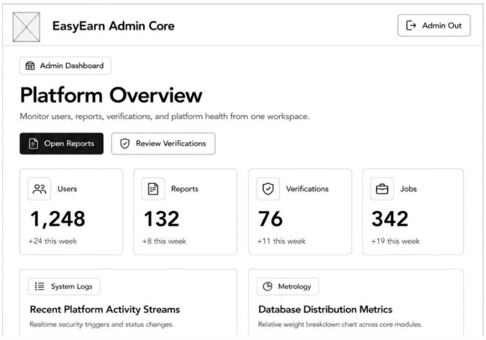

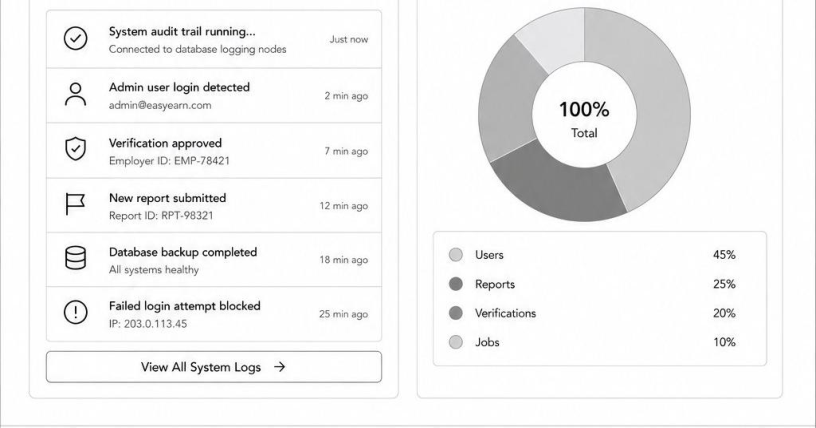

_Figure 3.34: Wireframe for Admin Dashboard_

### 3.10.11 Admin Job Listing Moderation

The Admin Job Listing Moderation page allows the Admin to view, approve, flag and remove all the job postings from the platform by the employers. There are three summary cards which show Live Jobs, Flagged Jobs and Removed listings. The Hiring Directory Records section offers a Status Filter drop-down and a Search Listings bar to easily moderate listings. A listing record will show the following information: Position Title, Employer Entity, Remuneration Pay-rate, Category Class, Employer Identifier (ID), flagging reason, and current status badge. A listing has four moderation action buttons: Approve Posting, Flag Listing, Remove Post and View Live Application. This page is the main instrument to ensure high-quality content on the EasyEarn platform and to prevent fraudulent job offers.

Figure 3.35 shows the wireframe for the Admin Job Listing Moderation page, which contains listing records and moderation action buttons.

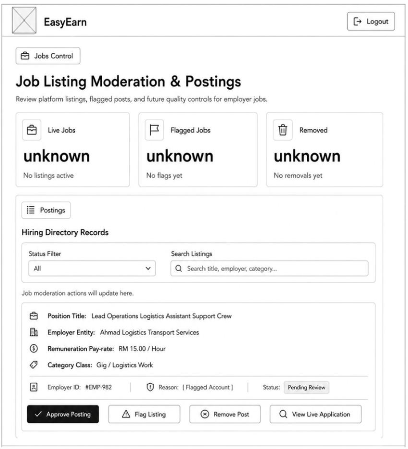

_Figure 3.35: Wireframe for Admin Job Listing Moderation_

## 3.11 User Interface (UI)

This section presents the key implemented UI screens of the EasyEarn Job Matching Portal, developed based on the wireframe prototypes in Section 3.10.

### 3.11.1 Landing Page (Index)

The Landing Page is the external profile of EasyEarn, which is accessible to everyone without a login. It includes a hero section with two call-to-action buttons ("Find a Job" and "Post a Job"), a platform highlights section, and a Google Translate site redirection for multilingual access on the navigation bar to make it multilingual. Figure 3.36 illustrates the Landing Page design implemented in EasyEarn, which includes the hero section, call-to-action buttons and a Google Translate site redirection for multilingual access.

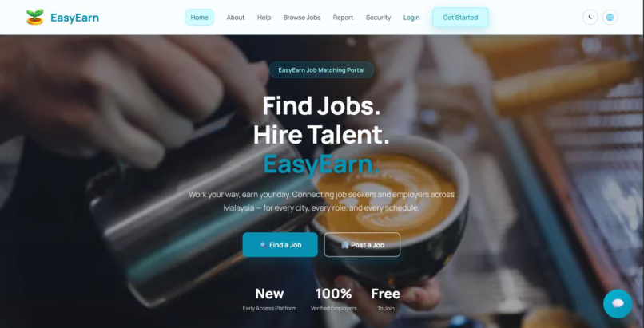

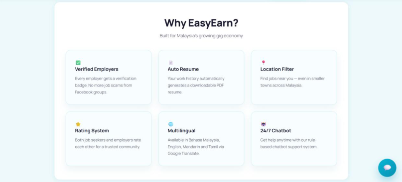

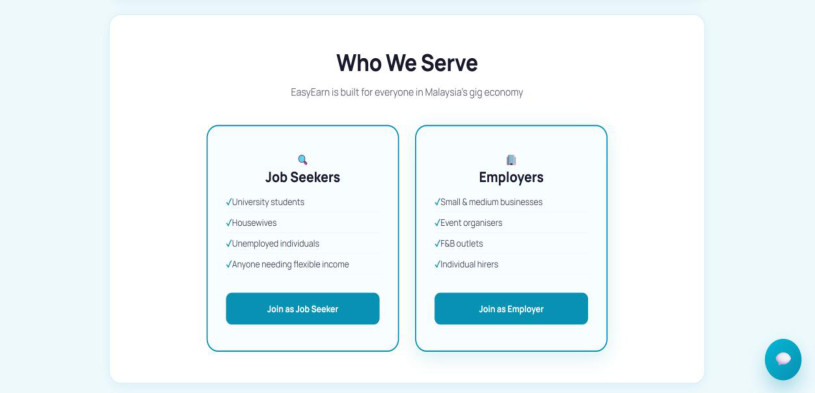

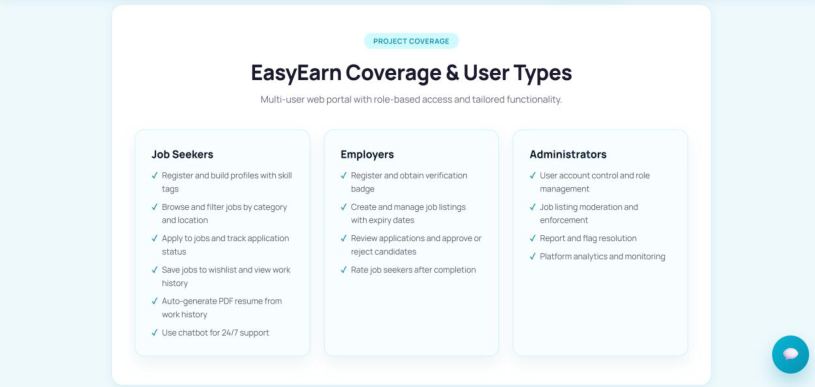

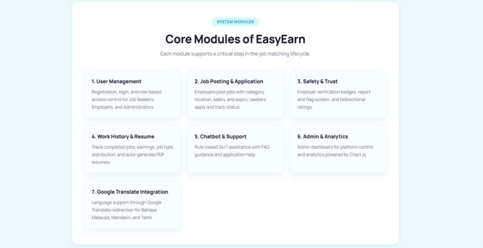

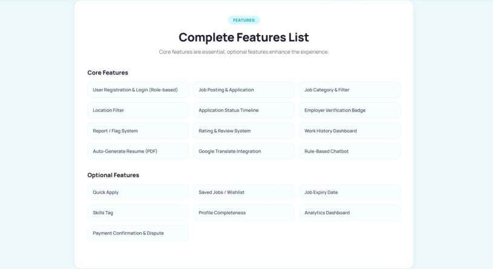

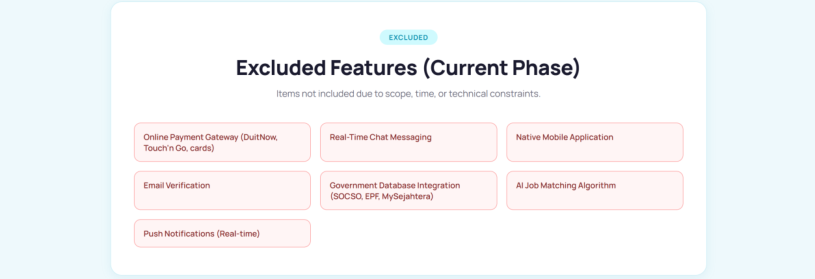

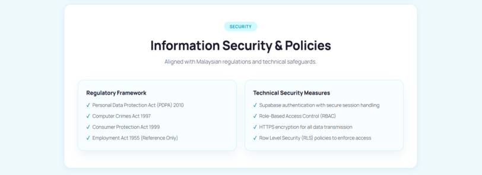

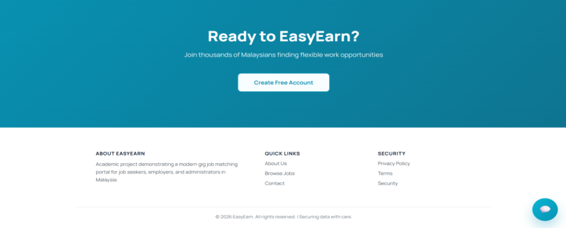

_Figure 3.36: Landing Page (Index)_

### 3.11.2 About Us Page

The About Us page communicates the purpose of EasyEarn to visitors and describes its mission, target users and development roadmap. It features a Hero banner, a Mission & Vision section that explains the problem being solved and the users of the platform, a development roadmap for FYP1 and FYP2, a series of flip/stacking highlight cards that feature three major platform benefits and an overview of the technology stack that was used to create EasyEarn.About Us Page design used in EasyEarn (Mission and Vision, Development Roadmap, Technology stack overview) is shown in Figure 3.37.

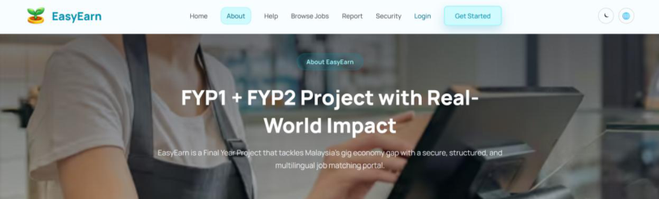

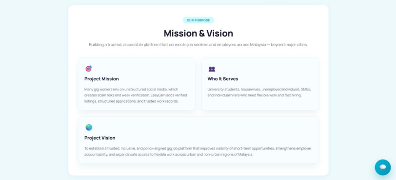

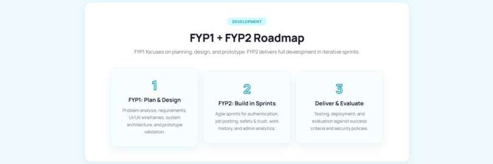

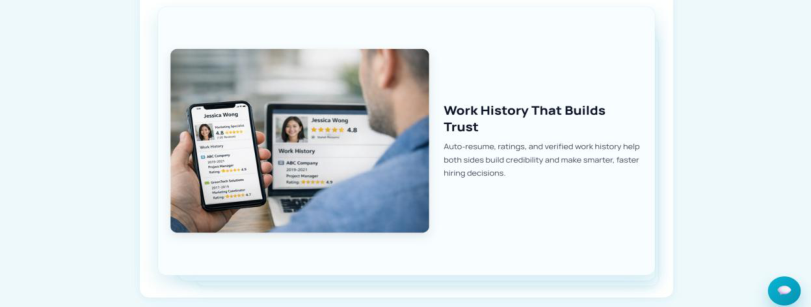

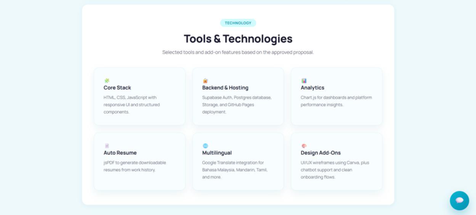

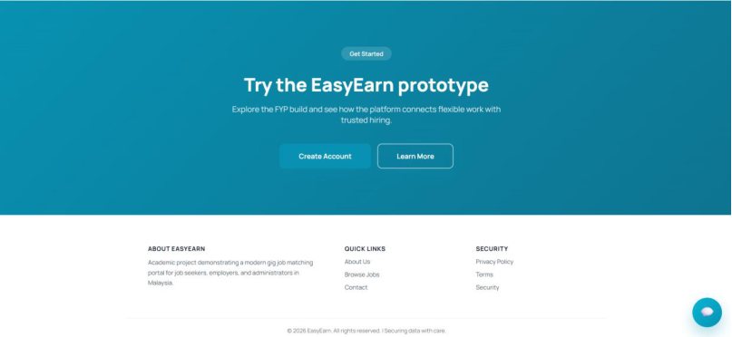

_Figure 3.37: About Us Page_

### 3.11.3 Help Center Page

The Help Center page is a self-service resource for EasyEarn users, helping to minimise the need for direct contact with the service. It has an FAQ section with expandable accordion answers for common questions about account creation, employer verification, application tracking, reporting suspicious listings, data protection and resume generation. A Support section also provides access to the rule-based chatbot, the EasyEarn support email and a link to the Report an Issue page. The Help Center Page design implemented in EasyEarn is shown in Figure 3.38, which consists of an FAQ accordion and Support / Contact options.

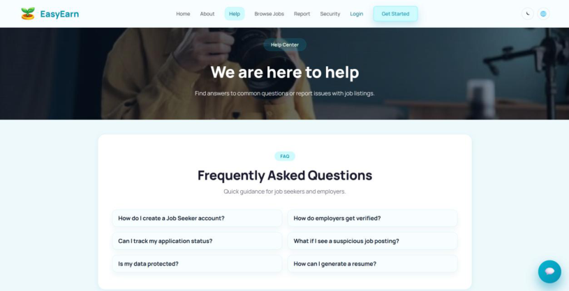

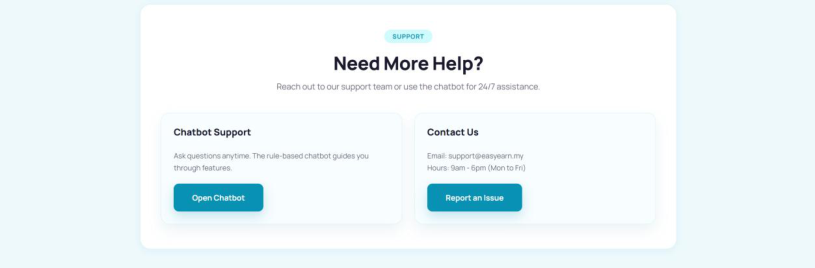

_Figure 3.38: Help Center Page_

### 3.11.4 Browse Job Page

The Browse Jobs page is the place where job seekers can explore and search to find gig opportunities that are available on EasyEarn. It comprises a search box to find jobs by keyword, category filter pills (Events, F&B, Education, Delivery) and a geolocation option (Near Me) to enable users to select a radius (5-50 km) to find jobs within their current location. Job postings are dynamically displayed in a grid, and loading and empty state indicators are displayed while fetching data and when no corresponding records are found. Figure 3.39 presents the Browse Jobs Page design in EasyEarn, which includes the search and filter toolbar, location-based radius filter and a dynamic listing of jobs in the grid.

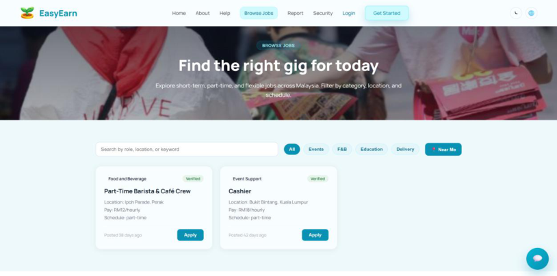

_Figure 3.39: Browse Job Page_

### 3.11.5 Report Page

Users can report suspicious employers, job listings, payment issues or other safety concerns through the Report Page. The form includes Full Name, Email, user role, Report Type, an optional Listing or Profile Link, a Description field and an optional Evidence Upload. The available report reasons include fake or misleading jobs, unpaid or insufficient payment, scams, harassment, discrimination, unsafe working conditions, changes to agreed work terms and other concerns. A side panel is included, detailing the reporting process and contact details, and a Reporting FAQ offers guidance related to review time, confidentiality and supporting evidence. Figure 3.40 shows the Report Page implemented in EasyEarn.

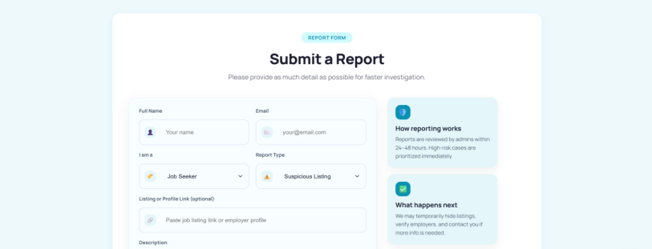

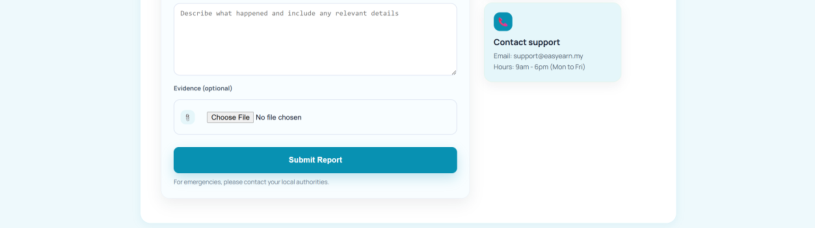

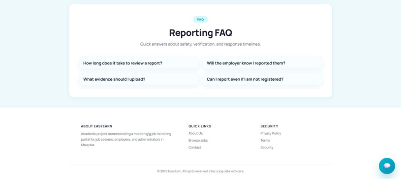

_Figure 3.40: Report Page_

### 3.11.6 Security Page

The Security page explains the technical measures taken to protect the security of users and platform information in EasyEarn. It also includes Data & Platform Integrity, where it discusses the use of HTTPS encryption, RLS policies that scope reads and writes by user role, and security measures such as security testing and Admin review of reports. A Security FAQ section caps the page with short answers regarding data protection, report handling, data visibility between employers and job seekers, and how to mark suspicious listings. The design of the Security Page in EasyEarn is shown in Figure 3.41, which includes the authentication and access controls, data integrity measures and the security FAQ.

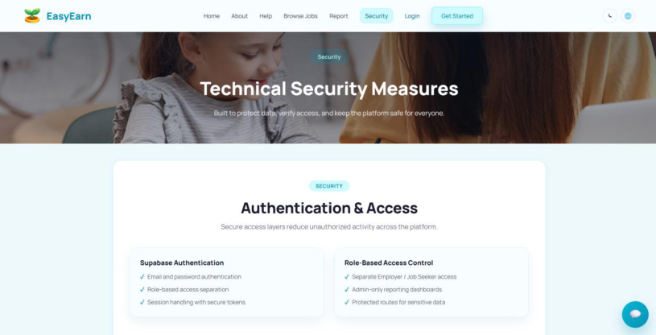

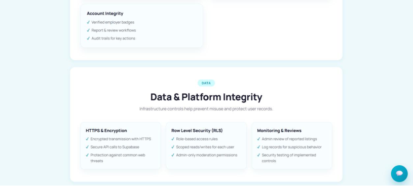

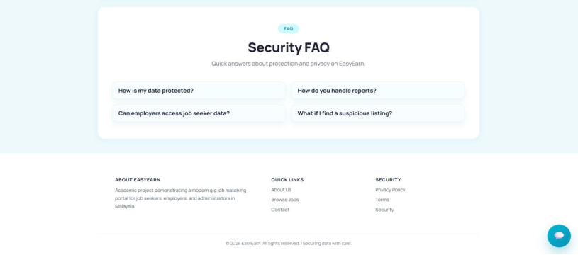

_Figure 3.41: Security Page_

### 3.11.7 Chatbot Page

The Chatbot page gives a dedicated interface for the user to interact with the EasyEarn Assistant (a rule-based Chatbot) that guides the user on how to use the platform. It features a chat window with a welcome message, a text field and a send button for sending general questions, and quick reply buttons for common topics like sign-up, upload resume, post a job, and report a scam. EasyEarn uses the Chatbot Page design as shown in Figure 3.42, featuring the chat window, input for chatrooms and quick reply shortcuts.

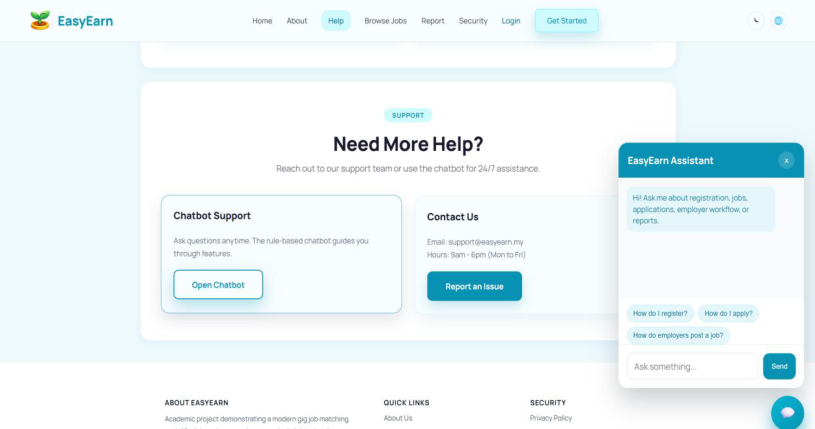

_Figure 3.42: Chatbot Page_

### 3.11.8 Google Translate Website

Google Translate Website has a language selector where users can see EasyEarn in various languages such as Bahasa Melayu, Mandarin, Tamil and English. If a language is chosen, the current EasyEarn page is redirected via Google Translate site translation service; the content on the page is translated without the need for having localised copies of each page. To extend users' access from different communities in Malaysia, the Google Translate Website is integrated into EasyEarn as in Figure 3.43.

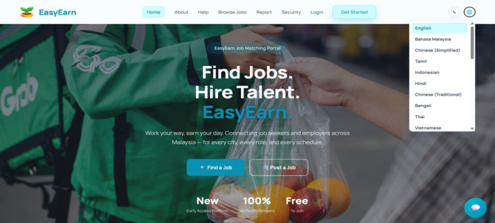

_Figure 3.43: Google Translate Integration_

### 3.11.9 Registration Page

The Registration Page allows new users to create an EasyEarn account. The registration form asks the user for a full name, email, a password and confirmation, and then asks for the user to select a role: Job Seeker, Employer or Admin. The secure code is used as an extra access control for Employer and Admin registration. Before creating an account, users must agree to the collection and use of their account and profile data and accept the Privacy Policy and Terms of Service. Once registered, an account is created via Supabase Authentication and the user is redirected based on the role they registered. Figure 3.44 shows the Registration Page implemented in EasyEarn.

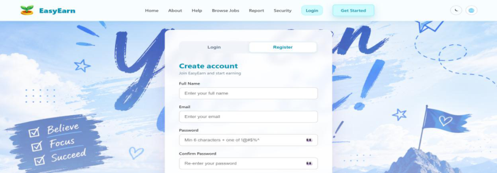

_Figure 3.44: Registration Page_

### 3.11.10 Login Page

All registered EasyEarn users access the Login Page using their email address and password. Users log in with Supabase Authentication, and then the system checks what role the user is registered for and sends them to the Job Seeker, Employer or Admin dashboard. The page also includes a Forgot Password link for recovering the account and a Register link for signing up. Figure 3.45 shows the Login Page implemented in EasyEarn.

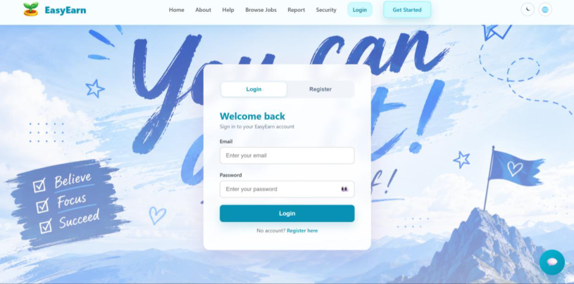

_Figure 3.45: Login Page_

### 3.11.11 Forgot Password Page

The Forgot Password and Reset Password pages enable users who are not able to log in to their EasyEarn account to recover access to their account via a secure email-based reset flow. On the Forgot Password page, the user types in their registered email address, and Supabase Auth sends a password reset link to their email address. The link will take the user to the Reset Password page, on which he or she will enter and confirm the new password and then return to the Login page to log in with the new password. The password validation for strength and the visual style are the same on both pages as the Login/Register page. The Forgot Password and Reset Password pages that have been added to EasyEarn and are shown in Figure 3.46 demonstrate how this can be done.

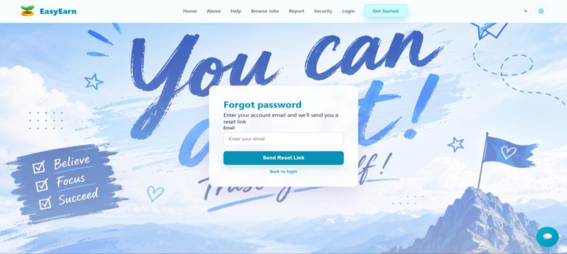

_Figure 3.46: Forgot Password Page_

### 3.11.12 Password Reset Email

On the Forgot Password page, when a user submits their email, Supabase Auth automatically sends a password reset email to the user's registered email address as shown in Figure 3.47. The email includes a "Reset Password" link which is valid for a short period of time; when it is clicked, the user will be directed to the Reset Password page where they can change their password and regain access to their account.

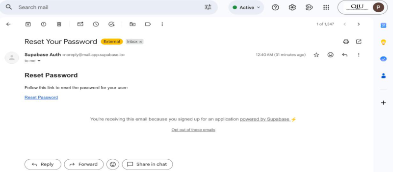

_Figure 3.47: Password Reset Email_

### 3.11.13 Logout Page

The Logout page verifies that the user is logged out of EasyEarn and his session. It includes a personalised goodbye screen with the user's profile picture or initials, a confirmation message to let the user know that his/her progress has been saved, and options to return to the homepage or log in again. The page also makes a Supabase sign-out call as a precaution, just in case someone navigated to this page directly rather than through the standard logout process. The design of the Logout Page in EasyEarn is shown in Figure 3.48, including a customised goodbye message and navigation.

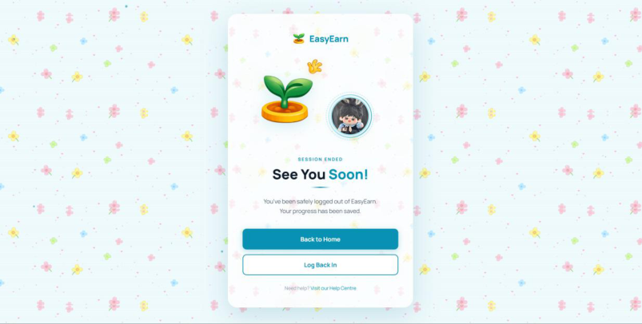

_Figure 3.48: Logout Page_

### 3.11.14 Job Seeker

The Job Seeker module is intended for people looking for short-term or flexible jobs on EasyEarn, such as students, housewives or people who are not working but seek flexible earning opportunities. Once logged in, Job Seekers will be able to browse and apply for jobs, check the status of applications, build a digital work history, build an auto-resume from completed jobs, and rate employers upon completion of a job. The module has a green colour theme, which helps to differentiate it from the Employer and Admin modules.

#### 3.11.14.1 Job Seeker Dashboard

The Job Seeker Dashboard is the personal hub for authenticated job seekers upon login. It shows a welcome banner that shows the percentage of completion of the profile and highlights 4 buttons for quick access to the following actions: Update Profile, Review Applications, Build Resume and Check Work History. Figure 3.49 depicts the Job Seeker Dashboard with the following elements: Welcome Banner, Profile Completion Indicator, and Quick Access Action Cards.

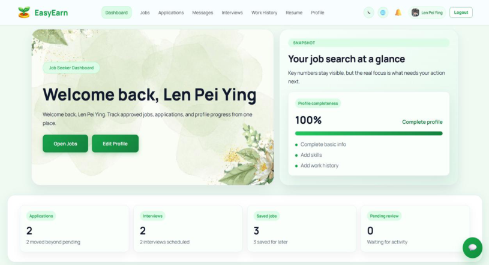

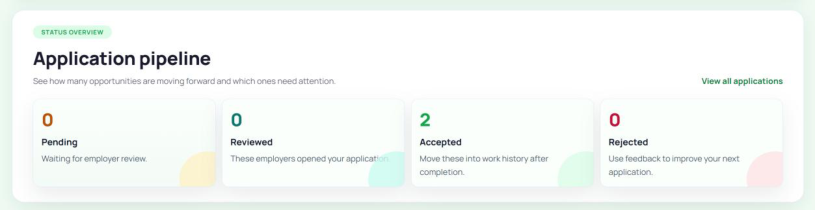

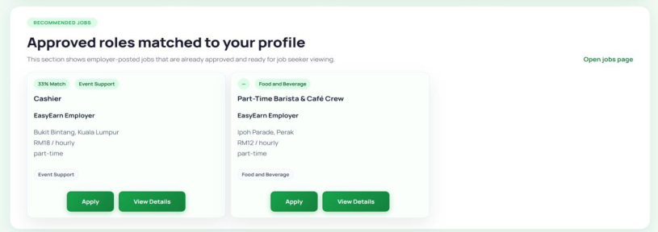

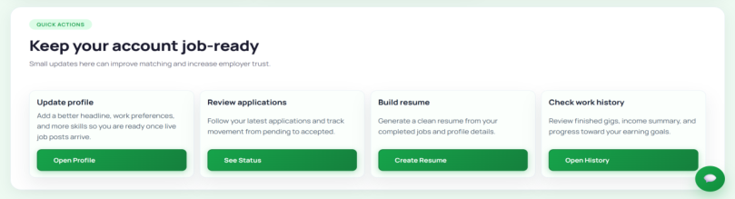

_Figure 3.49: Job Seeker Dashboard_

#### 3.11.14.2 Jobs Page

The Job Seeker Jobs page provides a way for Job Seekers to view and manage their saved jobs in one place, and to browse through job postings in two tabs, Browse Jobs and Saved Jobs.

# Browser Job:

The Browse Jobs tab includes an activity overview that includes counts of saved, applied, skillmatched and available jobs, a search and filter panel, a filter by "Near Me" geolocation with a radius filter (5-50 km), a grid of live approved job posts, and a job already applied filter section. EasyEarn Browse Jobs tab is shown in Figure 3.50, where the activity overview, search/filter panel and live job listings are seen.

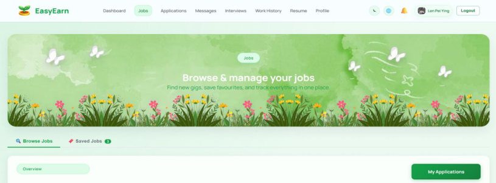

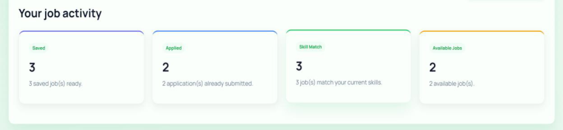

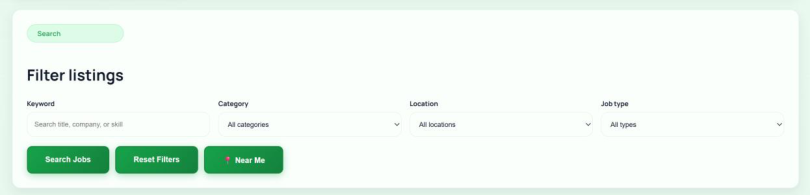

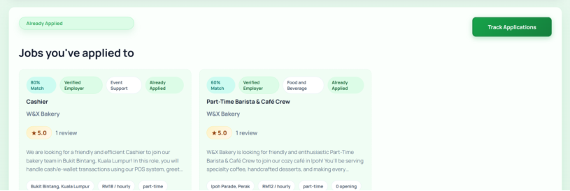

_Figure 3.50: Jobs Page (Browse Jobs Tab)_

# Saved Jobs:

The Saved Jobs tab shows a summary of how many jobs are saved, how many of them are still live, and how many have already been applied to, and a list of bookmarked listings available for Job Seekers to apply to or remove. The Saved Jobs tab in EasyEarn is shown in Figure 3.51 and consists of the Saved Jobs summary and Bookmarked listings.

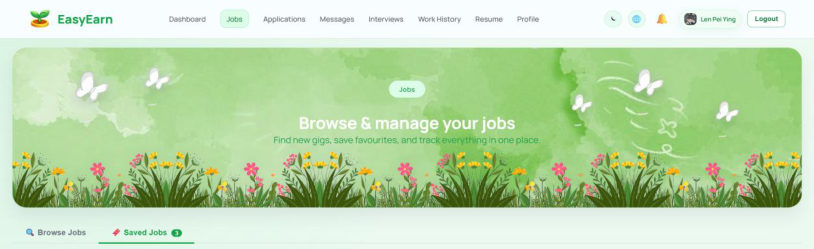

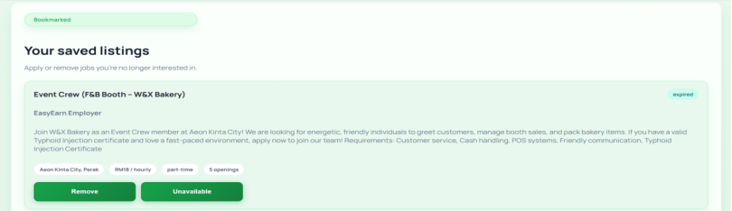

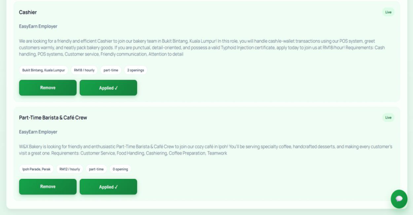

_Figure 3.51: Jobs Page (Saved Jobs Tab)_

#### 3.11.14.3 My Application Page

Job Seekers can use the My Applications page to keep track of all jobs they have applied for. It features an overview section with application metrics (In Review, Active, Completed, Rejected), a trend section with a line graph and doughnut chart of application activity by status, and filter tabs that display applications by All, Active, or Rejected. All applications are listed on the page with their current status, while a separate Completed Jobs section shows jobs that have completed the confirmation process. Once a job is completed and the completion process is confirmed, the completed work record is added to the Job Seeker's Work History, and the Job Seeker can rate the Employer. When Job Seekers request the Employer to confirm completion of a job, they can enter the job title, employer/company, category, and start/end dates in a Submit Completion Request modal. Figure 3.52 shows the My Applications Page design used in EasyEarn, which features the application overview statistics, activity trend charts, status filters, and the completed jobs/work history submission flow.

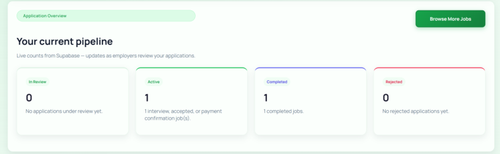

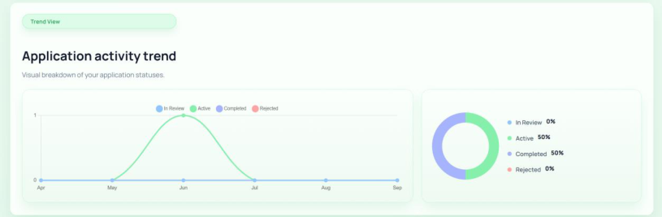

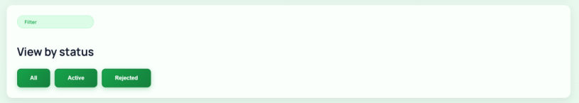

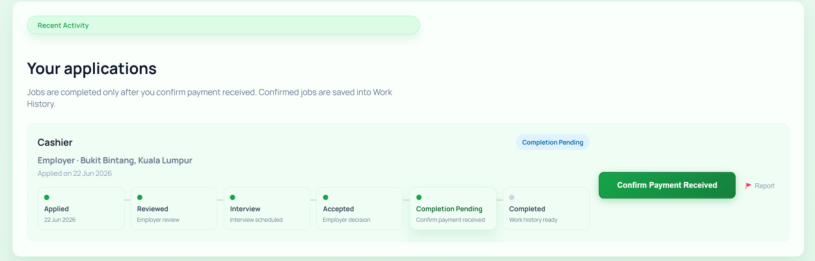

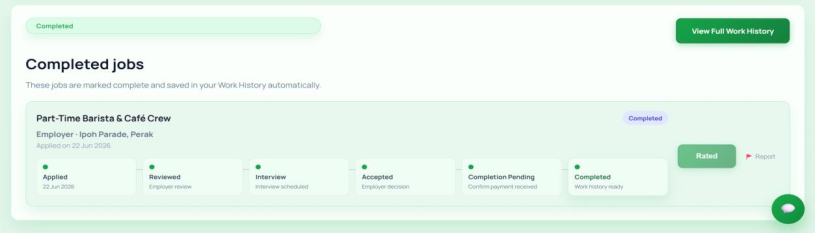

_Figure 3.52: My Applications Page_

##### 3.11.14.3.1 Report Employer

Job Seekers can report a particular Employer by using the Report button included on each application card, without navigating away from the application page. When the Job Seeker clicks Report, they will access a modal to choose from a list of options like a fake or misleading job posting, harassment, unsafe working conditions, non-payment or scam, and more, and may optionally enter additional details before submitting the report to be reviewed by an admin. The reason selector and details field are presented as the Report Employer modal in EasyEarn, as shown in Figure 3.53.

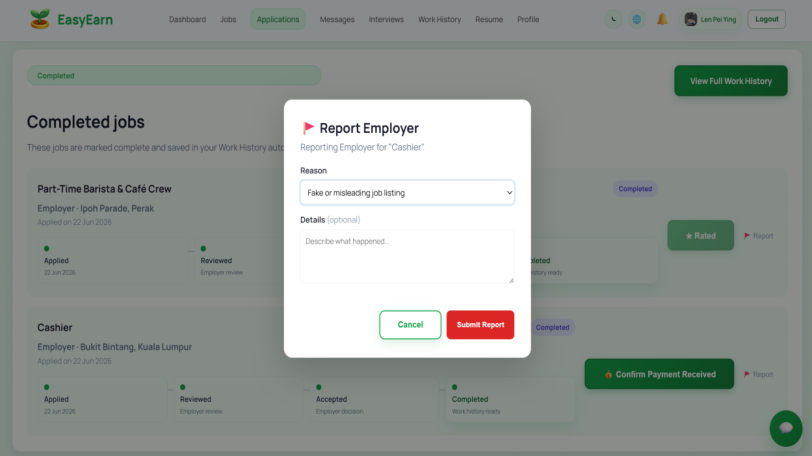

_Figure 3.53: Report Employer_

#### 3.11.14.4 Job Seeker Messages Page

The Messages page is used to post and receive asynchronous messages to and from the Employers about submitting them for a job and how to get the job. It features a sidebar inbox with an overview of conversation threads with the name of the employer, relevant job posting, and an employer rating if applicable, and a thread panel with the complete conversation history. Job Seekers are able to send text messages, upload images and see the messages sent by the

employer, including the special DuitNow payment-related messages. On a panel, if no conversation is selected, it shows a "Select a conversation" prompt in the inbox. The design of the Messages Page used in EasyEarn is shown in Figure 3.54 and consists of the conversation inbox, message thread view, and the image attachment support message composer.

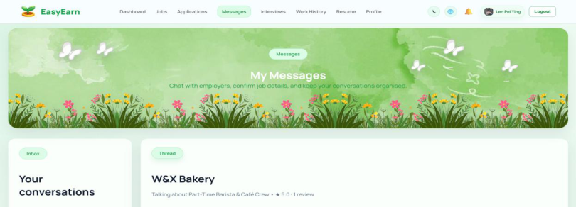

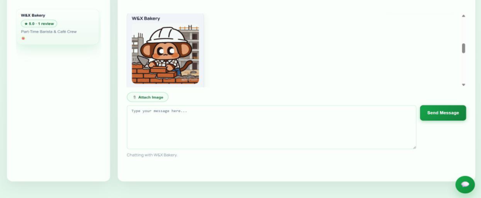

_Figure 3.54: Job Seeker Messages Page_

#### 3.11.14.5 Interviews Page

The Interviews page lets Job Seekers keep track of interview appointments arranged by employers who have received their job applications. It features an interview summary section with numbers of Confirmed, Upcoming, and Completed interviews; a list of upcoming interviews is sorted by soonest date, and a Completed Interviews section shows past or attended interviews. If there are no confirmed interviews, the page will offer a little bit of advice to the Job Seeker to fill out their profile with skills and a bio to increase the odds of being accepted to the application process, as well as links to edit their profile and keep track of applications. The design of the Interviews Page, as shown in Figure 3.55, is the one that was used in EasyEarn and it contains the next interviews, the completed interview history, and the summary stats for the interviews.

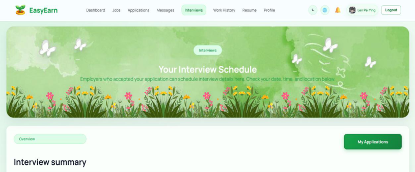

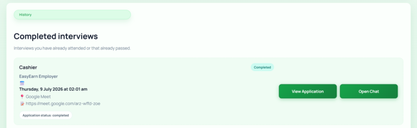

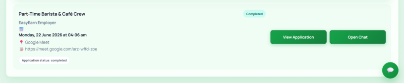

_Figure 3.55: Interviews Page_

#### 3.11.14.6 Work History Page

Job Seekers can use the Work History page to view their completed gigs, monitor their earnings and maintain work records that can later be included in their resumes. Completed work records are stored in the Supabase work_history table.

The page provides a Work Record form that allows Job Seekers to save information such as job title, company, category, location, completion date, total earnings, rating, work period and work highlights. It also shows summary information such as the total jobs completed, total earnings and top job category.

A Resume Status panel displays the count of saved work records and if the resume is prepared, and will include a button that will take you directly to the Resume page. The Recent Work Record section displays completed job records stored in the work_history table, including the job title, company, completion date, earnings, category and rating information. Completed jobs that have employer ratings and reviews are also shown.

Figure 3.56 shows the design of the Work History Page in EasyEarn, including the completedjob summary, Work Record form, Resume Status panel and Recent Work Record section.

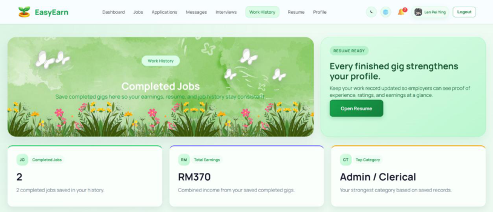

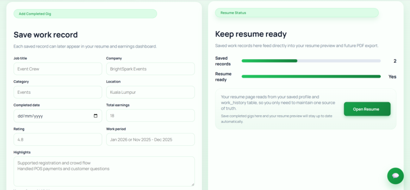

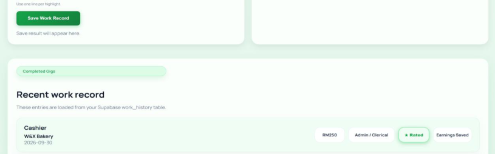

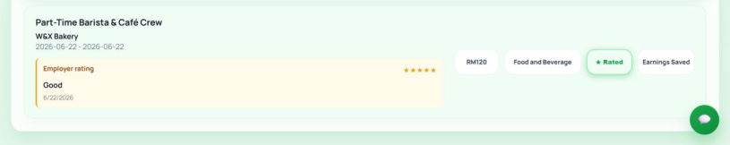

_Figure 3.56: Work History Page_

#### 3.11.14.7 Resume Page

The Resume page automatically creates a Resume based on the information provided in the Job Seeker's Saved profile and Work History section that's ready for use by an employer. The page provides a printable single-page resume that includes the user's profile picture, name, professional headline, contact information, profile bio, skills, education and availability. The main content area displays work experience entries, highlighted results such as completed jobs, total earnings and average employer rating, as well as references generated from completed jobs. Using the Refresh button, Job Seekers can refresh the preview view with fresh data as they update their profile, and download the resume in a PDF format using the jsPDF and html2canvas packages. EasyEarn's Resume Page design is a combination of the Resume preview design and the refresh/download toolbar, as illustrated in Figure 3.57.

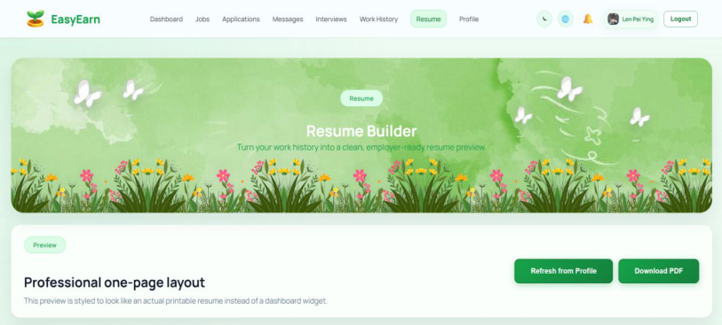

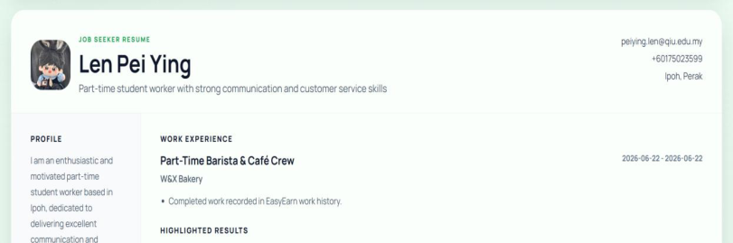

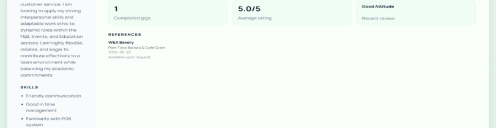

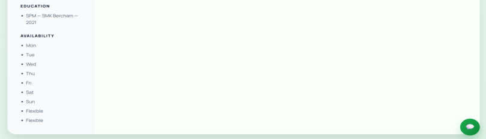

_Figure 3.57: Resume Page_

#### 3.11.14.8 Job Seeker Profile Page

Job Seekers can use the Profile page to fill in and keep up to date with information that they use throughout applications, recommendations, and resumes. It features a preview card with the user's avatar, headline, location, phone and availability, as well as an activity overview with rating, completed gigs, applications and saved jobs and a guide showing a progress bar and checklist of missing essentials to complete the user profile. The profile form consists of four sections: Basic Information, which includes the name, email, phone number, location, headline and biographical details, and the upload of a profile photo; Skills & Experience, which has a searchable skill tag picker, preferred job category, years of experience, and expected rate; Education, which dynamically adds qualification entries; and Availability, which includes a selectable available days, preferred time, and work mode. The final action section enables Job Seekers to save all changes to their Supabase profile. The Profile Page design is shown in Figure 3.58 and includes the profile preview, the profile completeness tracker, and the editing form with multiple sections.

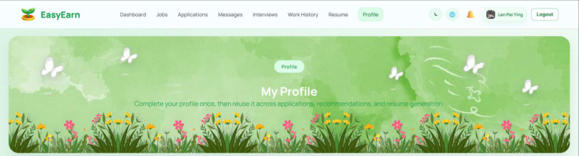

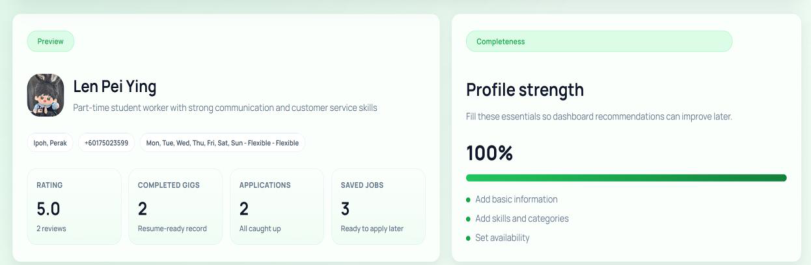

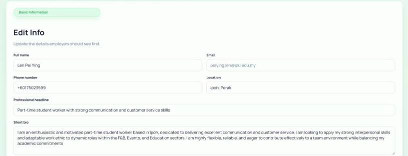

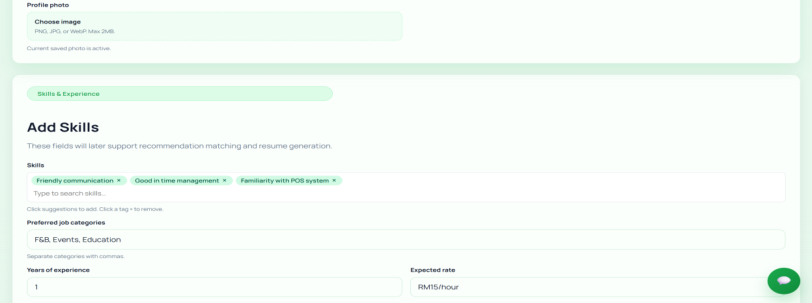

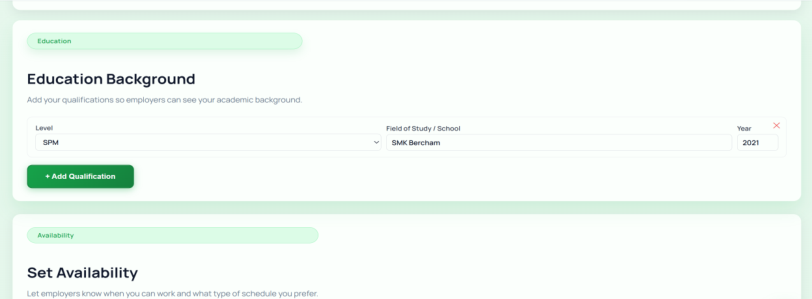

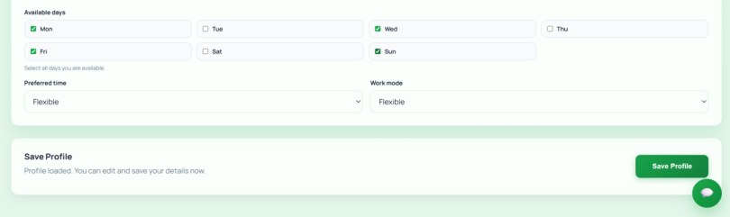

_Figure 3.58: Job Seeker Profile Page_

### 3.11.15 Employer

The Employer module is for people and SMEs wanting to recruit for short or flexible-term contracts in EasyEarn. Employers can post their job listings, review & manage applications from job seekers, verify their business to display a verified badge, access a dashboard to see their hiring analytics, and rate job seekers after they finish the job. The module has an amber colour theme to differentiate it from Job Seeker and Admin modules.

#### 3.11.15.1 Employer Dashboard

The Employer Dashboard gives employers a single view of their hiring activity and shows them four statistics cards: Active Jobs, Pending Review, Total Applicants, and Trust Verified status. An Application Share Breakdown doughnut chart visualises the distribution of application statuses across all job postings. Figure 3.59 shows the Employer Dashboard implemented with hiring statistics cards and a breakdown of the application status doughnut chart.

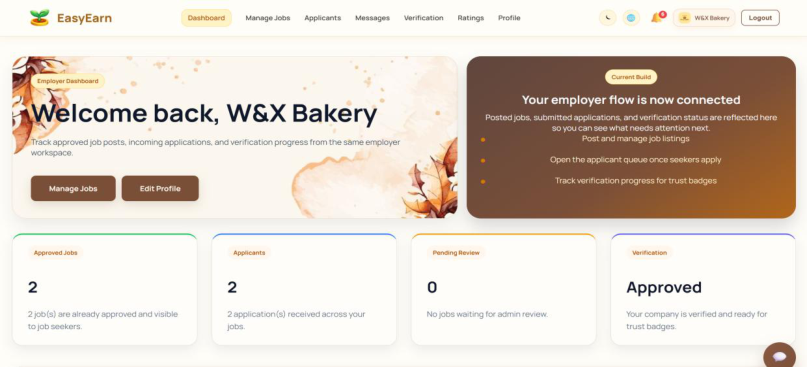

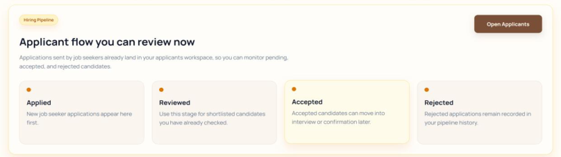

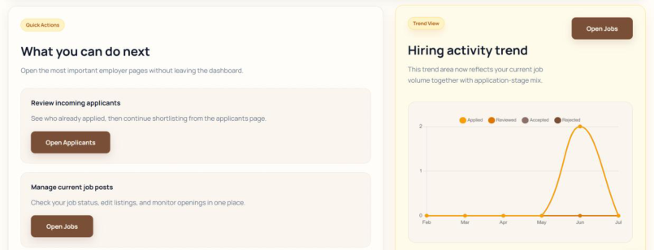

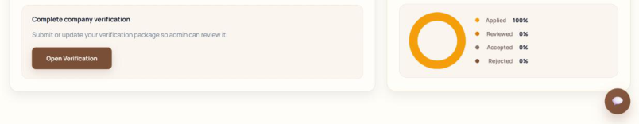

_Figure 3.59: Employer Dashboard_

#### 3.11.15.2 Manage Jobs Page

The Manage Jobs page is the Employer's main page to post and update jobs. It features a metrics dashboard with Published, Pending Review, Expired, and Closed metrics and a job form to add or edit a job with fields for job title, job category, location (with state and area drop-downs, and a geolocate/geocode button), pay range, openings, schedule, expiry date, job required skills (where tags can be set to up to 5 skills), and a job description, including options for publish immediately and save as a draft. A Publishing Notes panel shows a listing quality score, a prepublish checklist and quick tips for writing effective listings. At the bottom of the page, there is a Job List section, which lists all of the employer's jobs and displays their status, number of

applicants and expiry date so that the employer can view and manage their jobs from one location. The Manage Jobs Page design in EasyEarn is shown in Figure 3.60, which consists of the job metrics overview, the job creation/editing form, the publishing guidance panel, and the listings management table.

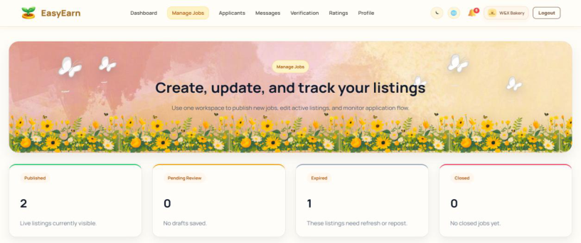

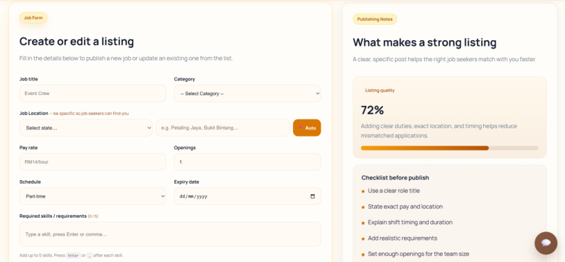

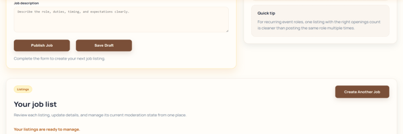

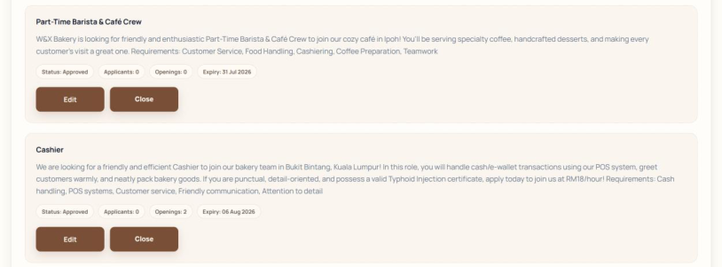

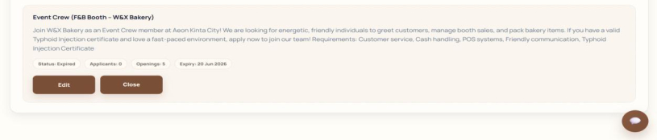

_Figure 3.60: Manage Jobs Page_

#### 3.11.15.3 Applicants Page

Employers can review candidates and manage the hiring pipeline on their Applicants page for their job listings. It provides an overview where the numbers of applicants applied, reviewed, accepted and rejected are displayed, a trend view with a line chart and a doughnut chart that breaks down the activity of applicants by status, and an Applicant Queue that shows the list of all applications received, from which Employers can accept applicants, schedule them for an interview, send messages and confirm job completion. Employers can use a Schedule Interview modal to schedule the interview date and time, location or platform, and notes for the applicant. Once a Job is completed, Employers are able to record the Date of Confirmation and the Final Earnings using a Confirm Completed Job modal. The Applicants Page design used in EasyEarn is shown in Figure 3.61, featuring the applicant overview stats, activity trend charts, applicant queue, the interview scheduling and job completion modals.

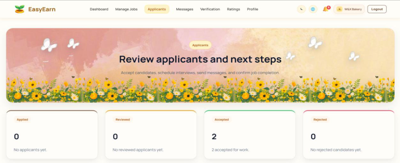

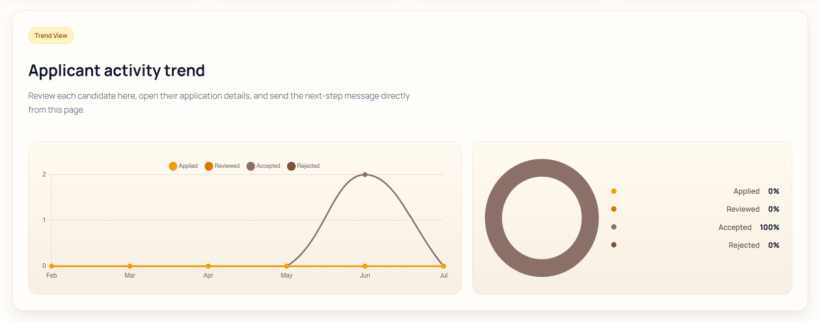

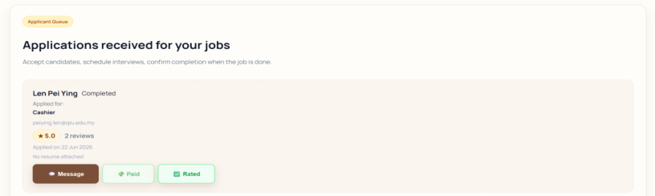

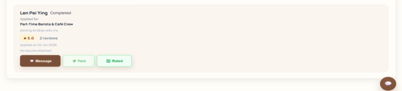

_Figure 3.61: Applicants Page_

#### 3.11.15.4 Employer Messages Page

Employers can follow up with a job seeker about application and hiring details on the Messages page. It has an inbox sidebar that shows conversation threads, and a thread panel that shows a conversation history and allows Employers to view and add messages about a given applicant. If no conversation is selected, the panel will ask the Employer to select a conversation in the Inbox or create a conversation on the Applicants page. EasyEarn implements the Messages Page (Employer) design shown in Figure 3.62 that contains the conversation inbox and the message thread view.

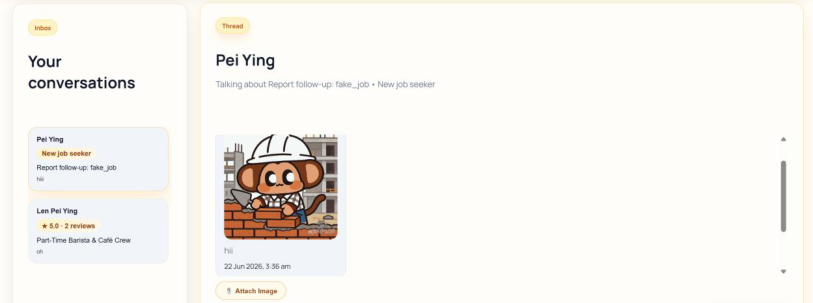

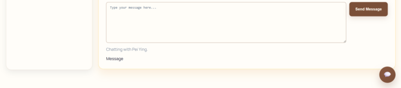

_Figure 3.62: Employer Messages Page_

#### 3.11.15.5 Verification Page

Employers can submit verification information and supporting documents for Admin review through the Verification Page. Information that is required depends on the type of employer. Individual Hirers are required to provide a contact address, proof of address and identity proof, while Company / Business and Online Seller / E-commerce accounts are required to provide a registration number, registered business address, business registration document and contactperson proof. The page also shows the current verification status and progress before the completed package is submitted to Admin for verification. Figure 3.63 shows the Verification Page implemented in EasyEarn.

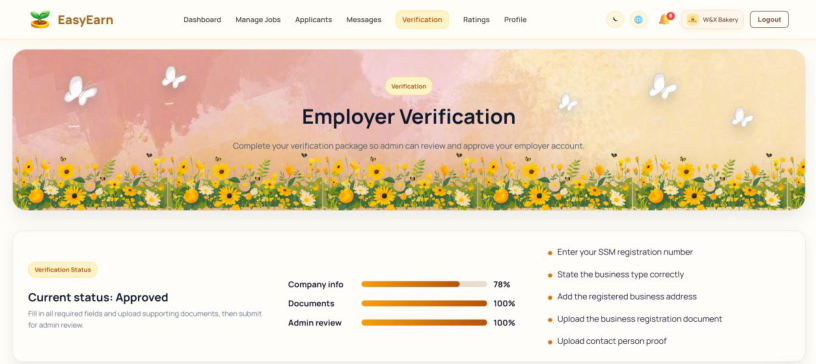

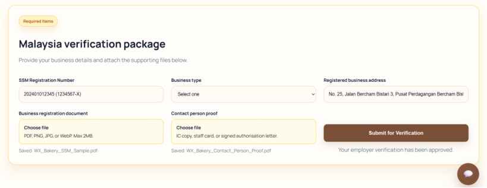

_Figure 3.63: Verification Page_

#### 3.11.15.6 Rating Page

The Rating Page shows the ratings and reviews of the Employer that have been received from Job Seekers for completed jobs. It includes an overview of the average rating, the number of reviews and the number of 5-star ratings, a rating distribution graph and a list of all the reviews received. The Rating Page design is demonstrated in Figure 3.64, which includes the rating overview, distribution breakdown and list of all ratings.

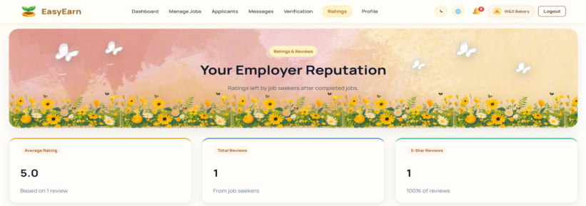

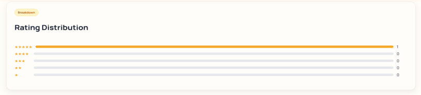

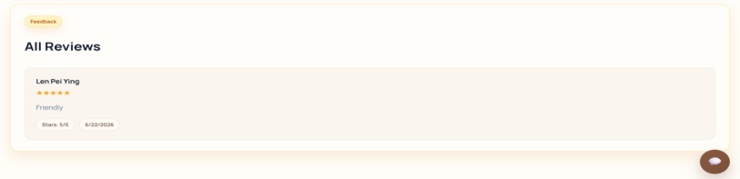

_Figure 3.64: Rating Page_

#### 3.11.15.7 Employer Profile Page

Employer Profile Page allows the Employer to keep certain company information that can foster trust with prospective Job Seekers before they apply for a job. It includes a profile form with the name of the company, contact email, contact phone number, business type, location, website, business logo and company overview. It also features a readiness snapshot panel, a preview of the company logo, and progress tracking throughout the Basic Info, Trust Setup and Hiring Ready stages, as well as a trust checklist that offers the steps to make the company profile more complete and trustworthy. EasyEarn Employer Profile Page design layout, as shown in Figure 3.65, contains the Employer Profile details form and Employer Profile ready snap.

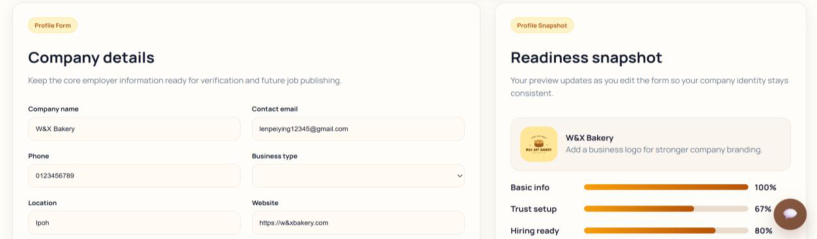

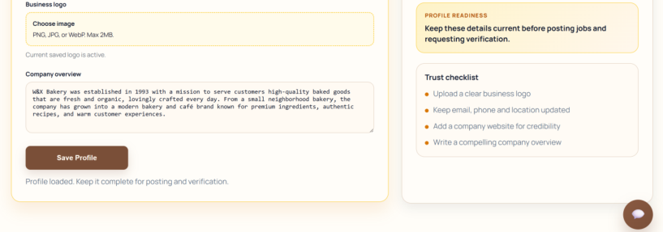

_Figure 3.65: Employer Profile Page_

### 3.11.16 Admin

The Admin module is designed to control and oversee the platform's operations and guarantee the integrity and safety of EasyEarn. Admins have access to reporting and can respond to user reports, review employer verification requests, access the platform's analytics using Chart.js dashboards, manage users and job listings, and use the rule-based chatbot for help. The module has been designed in a purple colour scheme to help stand out from the Job Seeker and Employer modules.

#### 3.11.16.1 Admin Dashboard

The Admin Dashboard gives the Administrator a full overview of platform activity, with statistics cards for total Users, Reports, Verifications, and Jobs. The Moderation Queue shows reports, verification requests and job postings that need to be reviewed by an admin, while the Database Distribution Metrics doughnut chart shows platform data proportions by category. Figure 3.66 shows the Admin Dashboard implemented with Platform statistics cards, activity stream and Database distribution metrics.

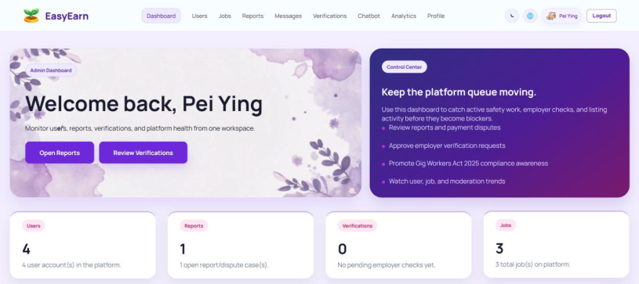

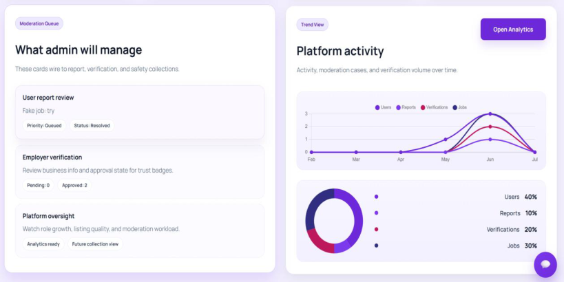

_Figure 3.66: Admin Dashboard_

#### 3.11.16.2 Admin Users Page

The Admin Users Page provides Administrators with a list of all users registered in the platform. It has a summary that displays the number of Job Seekers, Employers and Admins, and a user directory which filters by role. Alternatively, administrators can search for users by their name, email, phone number or location using the search field. All users appear in the directory with their respective roles, account status and user registration date, which can be used for additional moderation actions. The Admin Users Page design of EasyEarn is displayed in Figure 3.67, which includes an overview of the user count and a filterable user directory.

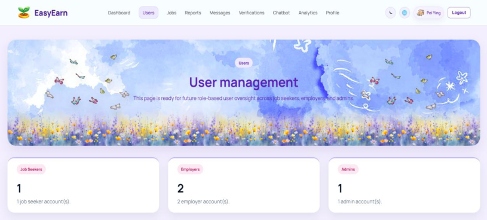

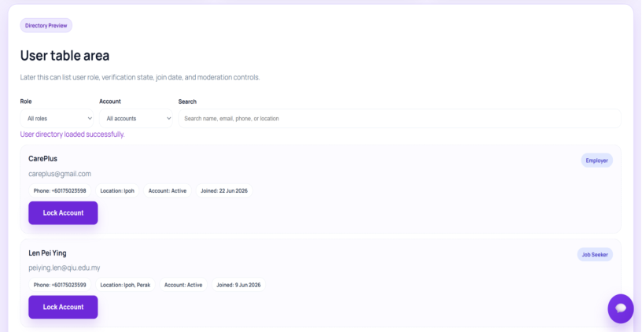

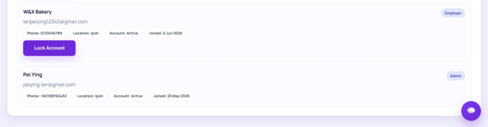

_Figure 3.67: Admin User Page_

#### 3.11.16.3 Admin Jobs Page

The Admin Jobs Page allows Admins to moderate job listings posted on the platform. It contains a summary of the number of Live Jobs, Flagged Jobs and Removed listings, and includes one Live Job review queue. The queue may be sorted by moderation status, which includes Pending Review, Approved, Flagged, Removed, Closed, Expired or All Jobs. A search bar is also provided to search by title, employer, category, pay or description. The employer name is displayed with the flag reason and moderation status for each of the job posts, and this lets Admins view and make changes to flagged or pending job posts. Figure 3.68 shows the EasyEarn system's Admin Jobs Page, which contains an overview of the jobs' status and provides a list of jobs in the review queue that can be filtered.

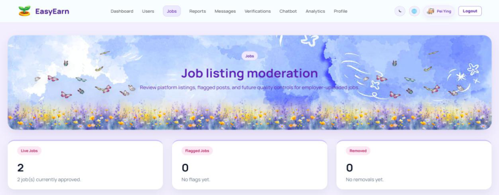

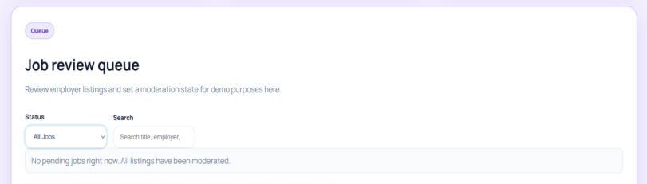

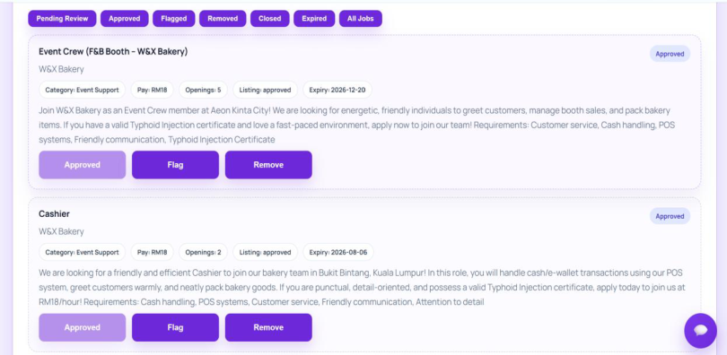

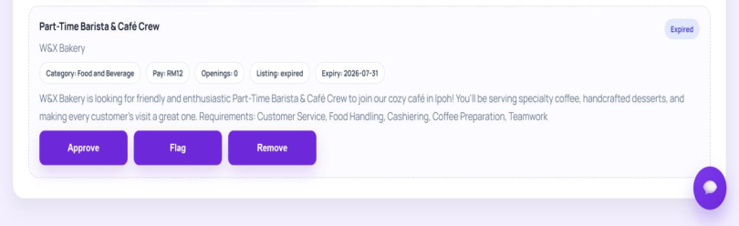

_Figure 3.68: Admin Jobs Page_

#### 3.11.16.4 Admin Reports Page

Admins can manage and resolve safety-related reports, such as suspicious employers, fraudulent listings and payment disputes, through the Admin Reports Page. It includes an overview of the number of Open, Escalated and Resolved reports, as well as a report feed that filters reports by Status (Open, Escalated or Resolved) and by Source (Supabase Reports or Payment Disputes). A search field is also included to search by type, description, reporter and/or status. Every report displays the type of report, priority and status, enabling Admins to view and act upon reports of fake employers, non-payment, suspicious listings or platform abuse. The design for the Admin Reports Page in EasyEarn is shown in Figure 3.69; it combines the report status overview and filterable report feed.

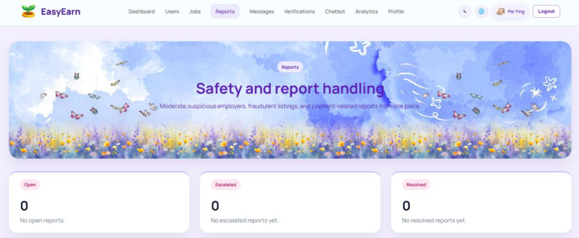

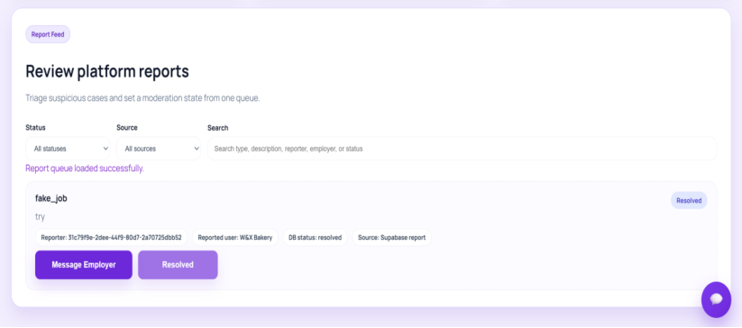

_Figure 3.69: Admin Reports Page_

#### 3.11.16.5 Admin Messages Page

If a payment dispute or moderation issue is to be followed up with the user in question, Admins may send them a message asynchronously from the Admin Messages Page. It features an inbox sidebar that notifies active conversations between the Admin and others, and includes a message panel that lists the selected conversation history so that the admin can view past messages and type in new ones. If follow-up is needed, the corresponding conversation will be available for the Admin on the Admin Reports Page. Admin Messages Page design in EasyEarn, with a conversation inbox and message thread panel, is shown in Figure 3.70.

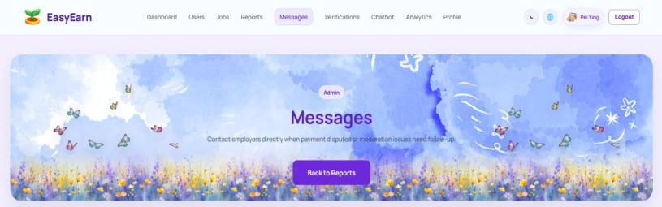

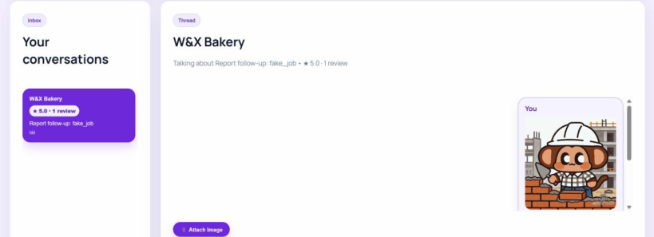

_Figure 3.70: Admin Messages Page_

#### 3.11.16.6 Admin Verifications Review Page

EasyEarn has a number of Safety and Trust features, including the Admin Verifications Review Page, which directly supports Research Objective 2. The page provides the Administrator the ability to view the verification submissions, review uploaded KYB documents, check on the status of the verification, and approve or deny the verification request. If an Employer makes a request for verification, his/her information, uploaded documents and verification status are displayed for review. This allows the Administrator to evaluate the information provided before verifying the submission and helps to ensure the platform's safety and trust. Figure 3.71 illustrates the Admin Verifications Review Page, which supports Research Objective 2 by allowing the Administrator to review Employer KYB documents, check the verification status, and approve or reject Employer verification submissions.

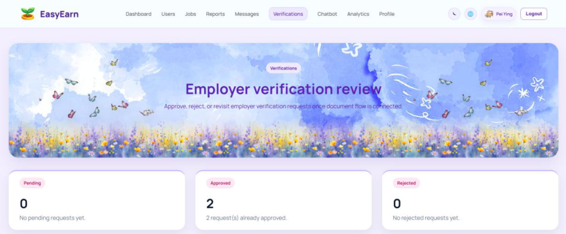

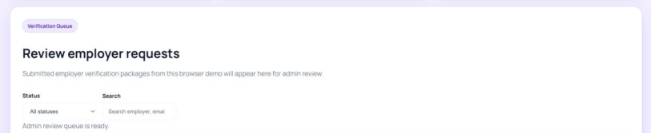

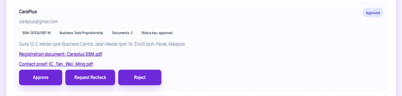

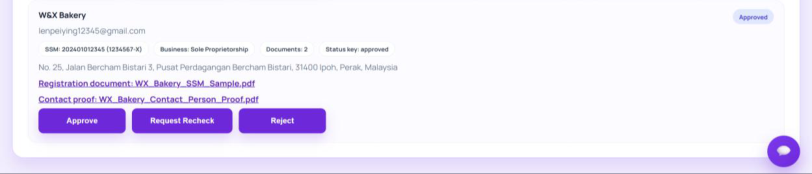

_Figure 3.71: Admin Verifications Review Page_

#### 3.11.16.7 Admin Chatbot Knowledge Management Page

The Admin Chatbot Knowledge Management Page is where Administrators can manage the knowledge that the EasyEarn rule-based chatbot uses. There is the ability to create new questions and answers, categorise and keyword questions, search for pre-existing chatbot knowledge and update or delete answers that are outdated. The chatbot knowledge is stored in the Supabase chatbot_knowledge table and is used to give a response to common platformrelated questions. This way, the information in the chatbot can be updated via the Admin page, without having to adjust chatbot code. Only authorised Administrators have access to the management functions. The Admin Chatbot Knowledge Management Page, as shown in Figure 3.72, contains the knowledge entry form, as well as the stored chatbot knowledge records.

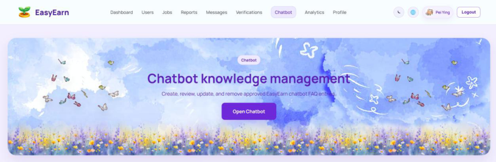

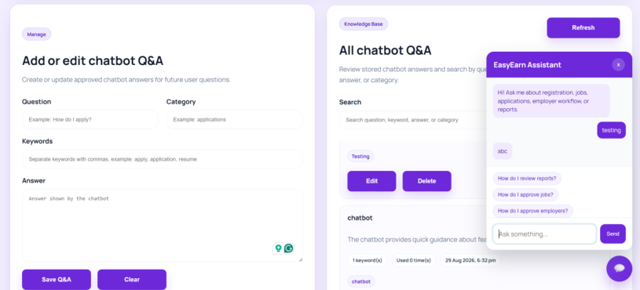

_Figure 3.72: Admin Chatbot Knowledge Management Page_

#### 3.11.16.8 Admin Analytics Page

The Admin Analytics Page offers Admins a snapshot of platform growth and workload with summary metrics for user growth, job volume and report load, a trend chart, and a distribution graph of users, jobs, reports and verifications. It also includes a Gig Workers Act 2025 awareness panel to remind Admins that there should be clear information in job postings, any claims related to payment must be followed up and that verification records should be looked at when considering employer accountabilities. Under the charts, there is a data explorer table showing analytics records which can be filtered by analytics type and status and searched by name, title, role, category or details. For the Admin Analytics Page, the design includes the filterable records table, the trend and distribution graphs, as well as summary metrics, as shown in Figure 3.73.

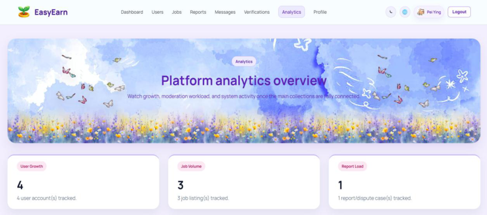

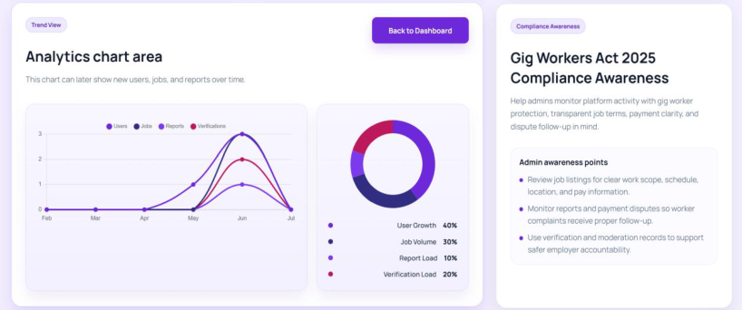

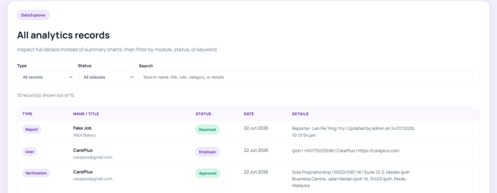

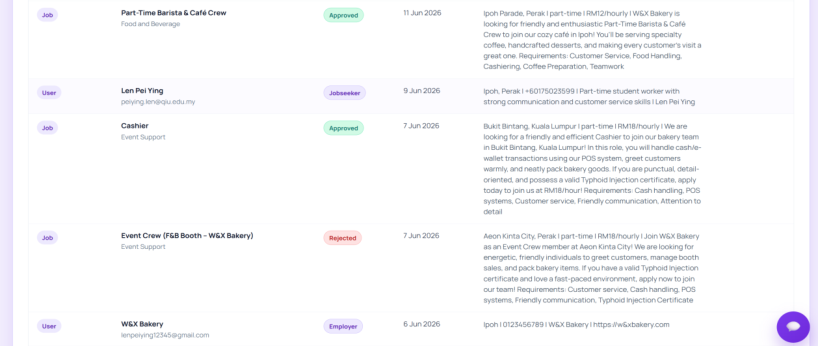

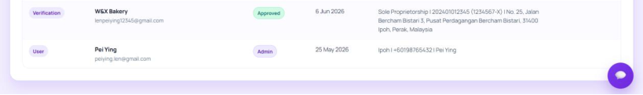

_Figure 3.73: Admin Analytics Page_

#### 3.11.16.9 Admin Profile Page

The Admin Profile page enables Admins to keep their contact information and avatar complete and trustworthy, and use it across moderation actions. It has a profile page with the Admin's name, email, telephone, address, picture and brief bio about their moderating position. A snapshot panel on the right provides a real-time preview of the profile and readiness flags for basic info, identity, and moderation readiness, as well as a trust checklist to remind Admins to ensure that all information is up to date before taking moderation action. The design of the Admin Profile Page as used in EasyEarn is shown in Figure 3.74 and further comprises the profile form as well as the readiness snapshot panel.

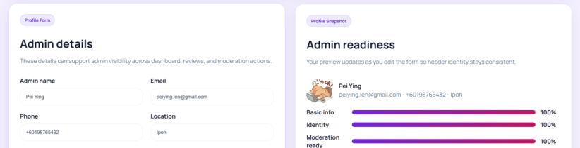

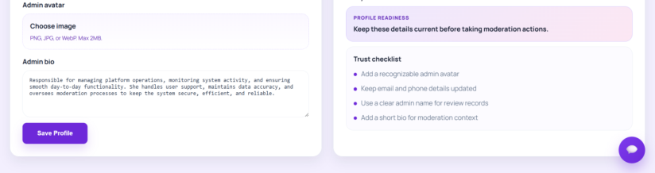

_Figure 3.74: Admin Profile Page_

## 3.12 Conclusion

This chapter documented the research methodology, planning structure, requirements, system design and UI design of the EasyEarn Job Matching Portal. The Hybrid Agile-Waterfall methodology provided a structured development process while supporting the delivery of the seven core system modules through an incremental and sprint-based approach [20], [74].

The planning artefacts (WBS, project schedule and Gantt Chart) provide a clear 26-week execution framework with defined milestones and deliverables. The Hardware and Software requirements analysis shows that developing and deploying EasyEarn is feasible within the academic project scope using web and cloud-based technology. These system design elements include the three-layer BaaS architecture, modular JavaScript system design, and the twelvetable relational PostgreSQL database schema [88], use case diagram [90], and role-based system workflow diagrams. Together, these elements serve as the technical basis for the EasyEarn platform.

The user-centred interface approach throughout the EasyEarn platform is illustrated in the wireframe designs of Section 3.10 and the implemented UI of Section 3.11 [79], [91]. One of the main features is the Auto-Generate Resume function in Section 3.11.14.7, which creates a resume PDF that can be downloaded from the Job Seeker's saved profile and work history data, without the need for manual formatting [49]. The system design prioritises simplicity, clarity, and easy access to the roles, consistent with the platform's mission to serve users with varying levels of digital literacy in underserved regions of Malaysia. Chapter 4 discusses the implementation, testing and evaluation of EasyEarn in relation to the project objectives.

# Chapter 4: Implementation

## 4.1 Introduction

The chapter gives the implementation and testing of EasyEarn, a web-based gig job-matching platform in the context of the gig economy in Malaysia. According to Malay Mail [5] citing MDEC's internal analysis, the size of Malaysia's gig economy was RM1.33 billion in Q3 2023, and it also recorded over 100,000 new participants and earners in the gig economy through gigeconomy platforms in the same period. This section describes the major technologies and decisions made for the frontend, backend, database, and third-party packages.

EasyEarn main implementation technologies and testing methods are summarised in Figure 4.1, which shows the frontend, Supabase backend services, the PostgreSQL database, third-party packages and the five different testing approaches applied to the system to examine it.

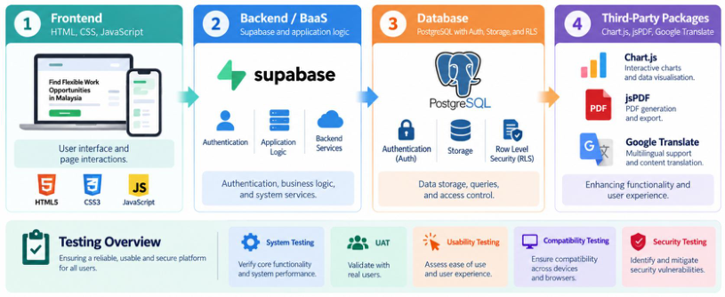

_Figure 4.1: Implementation and Testing Overview of EasyEarn_

## 4.2 Implementation

This section explains how EasyEarn is technically implemented in four aspects: Frontend, Backend, Database and Third-party Packages. EasyEarn uses a static frontend with a BaaS architecture. The frontend comprises HTML, CSS and JavaScript files served through GitHub Pages, while Supabase provides authentication, data persistence, access control and selected database-level business logic. This architecture minimises the need to have a dedicated application server and enables access-control rules to be implemented using Supabase RLS policies and database rules [18]. Section 4.2.1 explains the structure of the frontend and the page inventory; Section 4.2.2 describes the backend services and the security model; Section 4.2.3 describes the database schema and access-control policies; and Section 4.2.4 summarises the third-party packages used in the system.

### 4.2.1 Frontend

EasyEarn is a multi-page application organised into a set of public pages in the root directory (index.html, login.html, jobs.html) and three role-scoped directories (pages/jobseeker/, pages/employer/, pages/admin/). The page distribution is summarised in Table 4.1 below.

_Table 4.1: Page Distribution by role/section_

|**Section**|**Page Count**|**Representative Page**||**Paired CSS**|
|---|---|---|---|---|
|**Public / Auth**|16|index, login, register,|forgot-|css/landing.css,|
|||password, reset-password|, jobs,|css/style.css|
|||about, help, report, security|||
|**Job Seeker**|11|dashboard, jobs, appl|ications,|jobseeker-pages.css /|
|||saved-jobs, interviews,|resume,|jobseeker-|
|||work-history, messages, logout|profile,|dashboard.css|
|**Employer**|8|dashboard, post-job, mana applicants, ratings, veri messages, profile|ge-jobs, fication,|employer-pages.css|

|||||**BIT 31**|**18 Final Year Project 2**|
|---|---|---|---|---|---|
|**Admin**|9|dashboard,|jobs,|users,|admin-pages.css|
|||verifications,| reports,|chatbot-||
|||knowledge, profile|analytics,|messages,||

The page count includes redirect and compatibility routes retained in the project structure, such as post-job.html and saved-jobs.html, although their main functionality has been consolidated into manage-jobs.html and the Saved Jobs tab of jobs.html, respectively.

The three colour themes (green for Job Seekers, amber for Employers and purple for Admins) are stored centrally in a single CSS file per role folder.  All pages are written using semantic HTML5 and assembled dynamically using a lightweight client-side includes system (js/includes.js), where a common header and footer are dynamically included in each page, without any server-side template engine; a pattern that is appropriate to a static host like GitHub Pages [50].

To implement interactivity, EasyEarn uses multiple vanilla JavaScript ECMAScript (ES) modules [48], including page-specific modules such as jobseeker-resume.js, employermanage-jobs.js and admin-analytics.js, together with shared modules for authentication, data access, notifications, themes, translation and chatbot functionality.

The Job Seeker Resume Builder uses four supporting libraries to extend page functionality over native browser APIs: Lucide [92] is used to provide lightweight Scalable Vector Graphics (SVG) icons on all the role dashboards; Chart.js [51] is used to render charts in selected dashboard and analytics views, including the Job Seeker Applications page, Employer Dashboard and Admin Analytics Dashboard and html2canvas [93] and jsPDF [49] to take a snapshot of the on-screen Document Object Model (DOM) of the on-screen resume and export it as an A4 PDF without a server round trip.

### 4.2.2 Backend

EasyEarn's backend is powered by Supabase, with no need to build a custom application server. Three back-end issues are addressed this way: authentication, data access, and server-enforced business logic.

## Authentication:

Supabase Auth provides email/password sign-up and login, and issues JWTs [94], which are stored in the browser and automatically refreshed as needed without user intervention. Each protected page subscribes to the Supabase onAuthStateChange event using observeAuth() (js/supabase-data.js), and redirects unauthenticated visitors to the login page before any protected UI is rendered.

## Data access:

Instead of sending raw Structured Query Language (SQL) from the client, database operations are performed through the Supabase JavaScript client. The client sends Hypertext Transfer Protocol (HTTP) requeststhrough PostgREST to the underlying PostgreSQL database, where applicable RLS policies are evaluated before data is returned or modified [95]. This reduces the need to construct raw SQL queries directly in client-side code and helps reduce SQL injection risks associated with manually constructed queries [78].

_Table 4.2: Layered Access Control in EasyEarn_

|**Layer**|**Mechanism**|**Purpose**|
|---|---|---|
|**Client-side**|Use role guards in page|Protects UI from unauthorised users|
||JavaScript (e.g.||
||requireUser(), role checks in admin-*.js)||
|**Network**|PostgREST over HTTPS,|Client requests are sent to Supabase/PostgREST|
||Supabase anon key|over HTTPS, while database operations remain subject to the configured RLS policies|

|**Database**|RLS policies per table|Applies access rules when there are duplicate or modified client requests|
|---|---|---|

## Server-enforced business logic:

Important business rules that should not rely only on client-side JavaScript are implemented using PostgreSQL trigger functions at the database level. This reduces reliance on client-side checks because the rules are applied at the database level when the relevant operations are performed. The two key examples are sync_job_openings_from_application(), which is activated on INSERT/UPDATE/DELETE to the applications table to ensure that the job_listings.openings_count field is up to date, no overbooking occurs, and notify_new_application(), which adds a row to the notifications table for the appropriate employer when an application is added to the applications table.

### 4.2.3 Database

The EasyEarn schema consists of 12 tables, summarised in Table 4.3: Key tables support softdelete via a deleted_at timestamp column, preserving referential integrity while allowing logical removal of records (e.g. a withdrawn job listing).

_Table 4.3: EasyEarn Database Tables and Purpose_

|**Table**|**Purpose**|
|---|---|
|**users**|Stores information about the user's profile and role|
||(seeker/employer/admin) for each account.|
|**job_listings**|Job offers made by employers.|
|**applications**|Connects a person looking for a job to a job posting and tracks the|
||status of the job.|
|**notifications**|Built-in notifications based on system events.|
|**payments**|Completed application payment history.|

|**ratings**|Bidirectional post-completion ratings and reviews between|
|---|---|
||Employers and Job Seekers.|
|**reports**|Safety reports (fraud, dispute, abuse) are checked by Admins.|
|**saved_jobs**|Job seeker bookmarks.|
|**work_history**|Completed job records created when the application is completed.|
|**chatbot_knowledge**|Keyword-response pairs used by the rule-based chatbot.|
|**chatbot_logs**|Logged chatbot interactions.|
|**analytics**|All platform statistics for the Admin dashboard.|

Each table has RLS configured and policies are set based on the type and sensitivity of the data. Access rules are based on the authenticated user's UUID (auth.uid()), on record ownership fields like employer_id or seeker_id, on Administrator role checks and where not sensitive to public read access. This way, UI access control is complemented with access control at the PostgreSQL database level.

The chatbot_knowledge table is accessible for reading by public and authenticated users, enabling chatbot support before logging in, but INSERT, UPDATE and DELETE are only allowed for authorised Administrators. These interactions with the chatbot can be saved in the chatbot_logs table and only Administrators have access to see the chatbot's logs for monitoring.

Unique constraints are used to prevent duplicate records. The applications (job_id, seeker_id) constraint makes sure that any Job Seeker does not apply for the same job more than once, and the ratings (application_id, reviewer_id) ensures that no reviewer rates the same application more than once.

### 4.2.4 Imported Packages

EasyEarn is an integration of the following library packages with the goal of facilitating development. The following are the libraries integrated in EasyEarn for easy development and summarised in Table 4.4. All client-side libraries are loaded from CDN links, without the need for a local build pipeline, as it is used during publishing to GitHub Pages.

_Table 4.4:  Imported Packages and Third-party Libraries Used in EasyEarn_

|**Package / Library**|**Version / Source**|**Purpose**|
|---|---|---|
|||BaaS client for authentication and|
|Supabase JavaScript|@supabase/supabase-|database access through Supabase and|
|Client|js(CDN)|PostgREST; database access remains subject to configured RLS policies.|
|||Renders line and doughnut charts in|
|Chart.js|V4.x(CDN)|selected Job Seeker, Employer and Admin dashboard and analytics views.|
|jsPDF|v2.x(CDN)|Job Seeker: Export (programmatic) to PDF.|
|||The frame source which was used for|
|html2canvas|v1.x(CDN)|the exported resume (jsPDF) is a DOM- to-canvas snapshot.|
|||Helpful, user-friendly, lightweight SVG|
|Lucide Icons|CDN|icon library that is implemented in all role dashboards and in public pages.|
|||Redirects the existing EasyEarn page to|
|Google Translate|Google Translate|the Google Translate website translation|
|Website|Web Service|service, making it accessible in multiple languages.|
|Google Fonts (Manrope, DM Sans)|CDN|When using secondary UI typefaces: Manrope on public & landing pages; DM Sans on all role dashboards.|

Other services listed in Table 4.4 are the Supabase JavaScript Client [18], which is used to access Supabase from the client-side JavaScript, the Google Translate website translation service for multilingual access and Google Fonts for providing the Manrope and DM Sans typefaces employed across the site.

### 4.2.5 System Deployment

EasyEarn is published using the automatic build-and-deploy pipeline offered by GitHub Pages, which automatically rebuilds and republishes EasyEarn when changes are made to the main branch without needing a custom build/publish pipeline or manual release step. EasyEarn is built with a static-frontend, BaaS architecture, meaning that the HTML, CSS and JavaScript frontend is served from GitHub Pages, while Supabase serves managed backend services like authentication, database access, RLS and business logic at the database level. This design makes it possible to deploy the system without a specific application server.

There were some problems that were encountered in the deployment process that were not apparent when developing locally and only became apparent during deployment; these were related to paths. Shared partials are used in the site, including a common header and footer that are included from a shared file, js/includes.js (Section 4.2.1). The paths to these partials, logos and backgrounds are different for the depth of each page within the folder hierarchy, however. For instance, pages/jobseeker/dashboard.html has to have a different relative path from the top-level pages. Each page sets the EASYEARN_BASE_PATH global variable before the include file includes.js is loaded (such as '../../' for role-specific pages), so that they don't have to duplicate the logic for including the script. Then the script uses this base path to determine at runtime where the header, footer, logo and footer-link will be found. This partialloading approach allows the same common components to load properly across all system pages, even with varying folder depths.

The EasyEarn deployment history on Github shows successful and unsuccessful deployments across the development of EasyEarn. Potential deployment problems were resolved by future commits and successful deployments. This history shows that there were issues with deployment, which were monitored and acted upon throughout the iterative development process. The deployment history can be found in Appendix 7, Figure A7.1.

## 4.3 Testing

Five complementary testing methods were used: System Testing, UAT, Usability Testing, Security Testing, and Compatibility Testing. The methods are used to assess various quality characteristics of EasyEarn, such as functional correctness, user acceptance, usability, security and cross-environment behaviour. System Testing is the testing that checks the E2E functionality of EasyEarn.

### 4.3.1 System Testing

The latest System Testing workbook records 34 cases. The category totals below are derived from the individual case records, rather than inferred from screenshots.

| Category | Recorded cases | Pass | Other results |
| --- | --- | --- | --- |
| E2E Workflow | 6 | 6 | 0 |
| Integration | 6 | 6 | 0 |
| Performance | 4 | 4 | 0 |
| Recovery | 4 | 4 | 0 |
| Business Logic | 6 | 6 | 0 |
| Reporting | 4 | 4 | 0 |
| Compliance | 4 | 4 | 0 |

System Testing was conducted to evaluate the completed EasyEarn system across seven categories: E2E Workflow, Integration, Performance, Recovery, Business Logic, Reporting and Compliance. 34 System Testing test cases (ST-001-ST-034) were run and all of the test cases passed. The tests focused on the core workflows, front-end-to-Supabase integration, performance, failure handling and business rules, reporting accuracy, and selected compliance system controls. Security Testing and Compatibility Testing were evaluated separately in Sections 4.3.4 and 4.3.5. Figure 4.2 summarises the seven System Testing categories. The following is a representative test case for each category; the other test cases and supporting evidence are given in Appendix 3 [96].

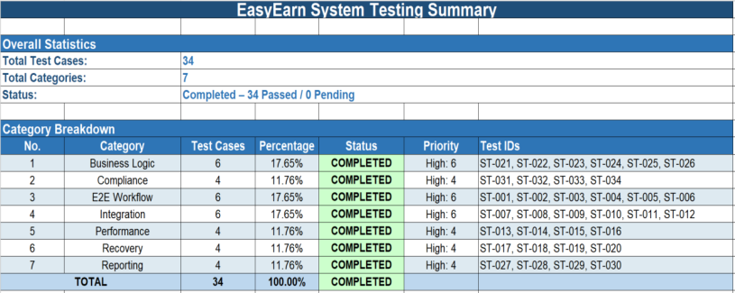

_Figure 4.2: EasyEarn System Testing Summary_

#### 4.3.1.1 End-to-End Workflow

E2E Workflow Testing tests the ability of a complete user workflow to complete successfully across interconnected sets of system functions [96]. In EasyEarn, the testing covered registration, job applications, applicant management, job completion, payment confirmation and moderation, with additional test cases and evidence provided in Appendix 3.1.

##### ST-003: Hire-to-Completion Flow

**Recorded result: Pass.**

The application successfully progressed through Reviewed, Interview, Accepted, Completion Pending and Completed. The Job Seeker confirmed interview attendance and payment receipt successfully. A 5-star rating and review were submitted for the Employer, and the completed job was added to the Job Seeker's Work History.

**Expected result:** Application status transitions correctly through Pending → Reviewed → Interview → Accepted → Completion Pending → Completed. Interview attendance is recorded successfully. After the Job Seeker confirms payment received, the completed job is added to Work History. The Job Seeker's rating and review are saved and displayed on the Employer's Ratings page.

**Test procedure:**

1. Employer marks the application as Reviewed.
2. Employer schedules an interview date and location.
3. Job Seeker confirms interview attendance.
4. Employer accepts the applicant after the interview.
5. Employer confirms work/payment, moving the application to Completion Pending.
6. Job Seeker confirms payment received, completing the application.
7. Job Seeker submits a star rating and review for the Employer.
8. Verify that the completed job appears in Work History.

**Test input:** Application ID: System-generated
Interview Date/Time: Valid future date/time
Interview Location: W&amp;X Bakery, Ipoh
Rating: 5 stars
Review: Great employer and smooth working experience.

**Recorded comments:** The complete hire-to-completion workflow functioned as expected across the Employer and Job Seeker modules.

Figure 4.3 retains the original screenshot associated with this case. The result and comments above follow the latest testing workbook.

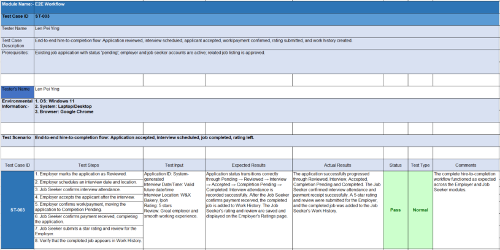

_Figure 4.3: Hire-to-completion flow_

#### 4.3.1.2 Integration

Integration Testing determines if the system components that are connected communicate and work properly together [96]. EasyEarn testing covered interactions among the JavaScript frontend, Supabase database, triggers, notifications, Employer Verification, asynchronous messaging, chatbot knowledge and saved jobs, with additional evidence provided in Appendix 3.2.

##### ST-007: Application CRUD and openings_count trigger

**Recorded result: Pass.**

The job listing initially showed 1 available opening. After the Job Seeker submitted an application, the available opening decreased from 1 to 0. When the Job Seeker cancelled the application, the available opening returned from 0 to 1. The openings count remained consistent throughout the test and did not become negative.

**Expected result:** The available openings count decreases from 1 to 0 when the Job Seeker submits an application. After the Job Seeker cancels the application, the openings count returns from 0 to 1 and remains consistent without becoming negative.

**Test procedure:**

1. Verify the job listing shows 1 available opening before application.
2. Job Seeker submits an application for the job.
3. Verify the available opening decreases from 1 to 0.
4. Job Seeker cancels/withdraws the application.
5. Verify the available opening increases from 0 back to 1.
6. Verify the openings count remains consistent and does not become negative.

**Test input:** Job ID: System-generated
Initial openings_count: 1
Action: Apply, then Cancel Application

**Recorded comments:** The openings count was correctly synchronized with the Job Seeker application and cancellation actions.

Figure 4.4 retains the original screenshot associated with this case. The result and comments above follow the latest testing workbook.

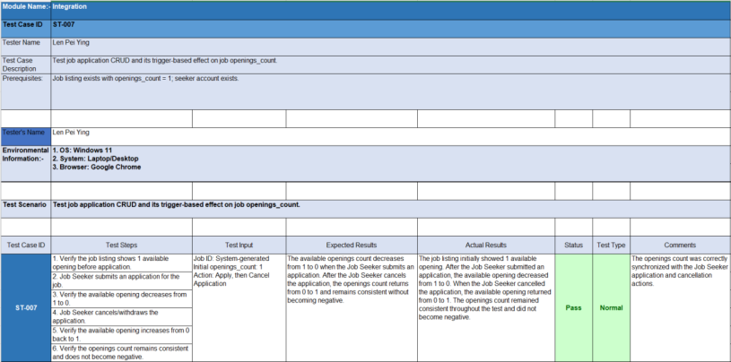

_Figure 4.4: Application CRUD and openings_count trigger_

#### 4.3.1.3 Performance

Performance Testing evaluates system response and behaviour during selected time-sensitive or data-processing operations [96]. EasyEarn testing covered job-page loading and filtering, concurrent applications, PDF resume generation and Admin Analytics rendering, with additional evidence provided in Appendix 3.3.

##### ST-014: Concurrent Application Race Condition

**Recorded result: Pass.**

During the near-simultaneous application test for a job with one remaining opening, one Job Seeker was able to submit the application successfully. For the second Job Seeker, the Apply button changed to Full, preventing another application from being submitted after the final opening had been taken. No overbooking occurred.

**Expected result:** Database-level trigger serialises the openings deduction so exactly one application succeeds when only one opening exists; no negative counts.

**Test procedure:**

1. Seeker A and Seeker B both load the same job listing.
2. Both submit an application within the same second.
3. Verify only one application succeeds in consuming the opening.
4. Verify the second receives the 'No openings available' error.
5. Confirm openings_count never goes below zero.

**Test input:** 2 concurrent INSERT requests on applications, same job_id

**Recorded comments:** The system prevented a second application after the final available opening was taken.

Figure 4.5 retains the original screenshot associated with this case. The result and comments above follow the latest testing workbook.

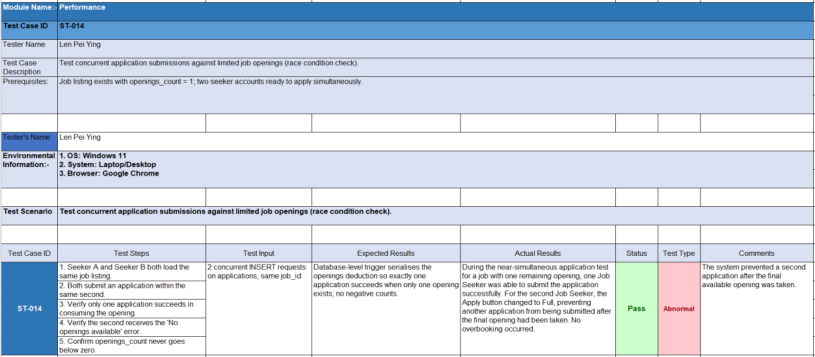

_Figure 4.5: Concurrent Application Race Condition_

#### 4.3.1.4 Recovery

Recovery Testing checks the response of the system to failure and disruption without compromising stability and consistency of the data state [96]. The connectivity loss, sessionrelated interruptions and failed transactions were covered in EasyEarn testing, and further test cases and evidence were supplied in Appendix 3.4.

##### ST-019: Failed Application Submission Rollback

**Recorded result: Pass.**

A direct database insert was attempted for a job with openings_count = 0. The database trigger rejected the insert with the error "No openings available for this job listing." A verification query confirmed that no application record was created for the tested Job Seeker and job combination, and the job's openings_count remained unchanged at 0.

**Expected result:** The exception raised inside the trigger rolls back the entire INSERT transaction, leaving both applications and job_listings tables in a consistent, unchanged state.

**Test procedure:**

1. Seeker attempts to apply to a job with 0 remaining openings.
2. Verify the INSERT is rejected by the database trigger.
3. Verify no partial/orphaned application row is created.
4. Verify the seeker sees a clear 'no openings available' message.
5. Confirm the job_listings.openings_count value is unchanged.

**Test input:** Job ID with openings_count = 0

**Recorded comments:** The failed application was fully rolled back, leaving no partial record and keeping openings_count unchanged.

Figure 4.6 retains the original screenshot associated with this case. The result and comments above follow the latest testing workbook.

_Figure 4.6: Failed Application Submission Rollback_

#### 4.3.1.5 Business Logic

Business Logic Testing is used to determine if the rules that govern the behavior of a system are functioning as expected. For location bonuses, application-status transitions, and rating eligibility, EasyEarn testing was conducted on these features and the behaviour of the Employer Verification Badge during moderation was provided in Appendix 3.5.

##### ST-023: Application Status Transition Constraints

**Recorded result: Pass.**

The forward application workflow had already been completed successfully during ST-003. During this test, a Reviewed application could not be moved backward to an earlier status. For a Completed application, the Employer view no longer provided any status-transition control; only non-status actions such as Message, Paid and Rated remained. Therefore, the completed application could not be reversed through the Employer UI.

**Expected result:** The Employer UI allows the intended forward workflow while preventing reverse status changes. A Completed application cannot be changed back to an earlier application status through the UI.

**Test procedure:**

1. Employer moves an application forward through the permitted status workflow.
2. Verify a Reviewed application cannot be moved backward to an earlier status through the Employer UI.
3. Open a Completed application and check available status controls.
4. Verify no status control allows a Completed application to be reversed to Pending/Reviewed/Accepted.

**Test input:** Observed workflow: forward status changes through Employer UI; Reviewed cannot be reversed; Completed application

**Recorded comments:** The Employer UI enforced forward-only status progression and prevented completed applications from being reversed.

Figure 4.7 retains the original screenshot associated with this case. The result and comments above follow the latest testing workbook.

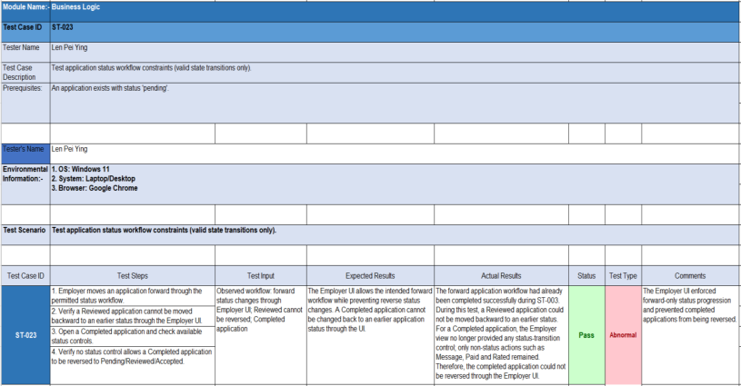

_Figure 4.7: Application Status Transition Constraints_

#### 4.3.1.6 Reporting

Reporting Testing determines if system-generated values and summaries match the data stored in the system [96]. EasyEarn testing covered Admin Analytics, job-listing reports, Job Seeker work history and earnings, and Employer job-performance information, with additional evidence provided in Appendix 3.6.

##### ST-027: Admin Analytics Dashboard Accuracy

**Recorded result: Pass.**

The Admin Analytics page displayed User Growth = 8, Job Volume = 5 and Report Load = 2. Supabase verification queries returned 8 active users, 5 active job listings, 2 report records and 1 approved employer verification. The chart displayed 50% User Growth, 31% Job Volume, 13% Report Load and 6% Verification Load, which matched the rounded proportions of the underlying values 8:5:2:1.

**Expected result:** The Analytics summary metrics must match the corresponding database counts. The distribution chart must reflect the same underlying values for users, jobs, reports and approved verifications.

**Test procedure:**

1. Log in as Admin and open the Analytics page.
2. Compare User Growth with the count of active user records in public.users.
3. Compare Job Volume with the count of active job listings in public.job_listings.
4. Compare Report Load with the count of report records in public.reports.
5. Compare Verification Load chart share with the number of approved employer verifications and verify the displayed chart proportions.

**Test input:** Observed dashboard: 8 users, 5 jobs, 2 reports; approved employer verifications: 1

**Recorded comments:** The analytics summary values and chart proportions matched the verified database counts.

Figure 4.8 retains the original screenshot associated with this case. The result and comments above follow the latest testing workbook.

_Figure 4.8: Admin Analytics Dashboard Accuracy_

#### 4.3.1.7 Compliance

Compliance-related System Testing consisted of the evaluation of selected EasyEarn controls related to privacy, transparency and user-protection aspects, such as privacy information access, handling of Employer verification documents, audit records, and compliance reminders [17], [76], [96]. These tests were for selected controls already implemented and were not legal or regulatory certification. Additional test cases and evidence are provided in Appendix 3.7.

##### ST-032: PDPA-Aligned Document Handling

**Recorded result: Pass.**

Employer verification documents were stored in each employer's own users record. W&amp;X Bakery and SugarShine each had their own registration and contact documents, while CarePlus had none submitted. A Job Seeker attempting to access the Employer verification area was redirected back to the Job Seeker section and could not view employer verification documents. Admin could access the Verifications area and review the submitted employer documents.

**Expected result:** Verification document data is stored in the relevant employer's users record; Job Seekers cannot access the Employer verification area, while Admin can review submitted verification documents.

**Test procedure:**

1. Submit employer verification with registration and contact documents.
2. Verify documents are stored only in fields scoped to that employer's row (registration_doc_data, contact_doc_data).
3. Verify a seeker or another employer account cannot query another employer's verification documents.
4. Verify admin-only access is required to view submitted documents during review.

**Test input:** Employer verification data stored in public.users; W&amp;X Bakery and SugarShine contain both registration and contact documents.

**Recorded comments:** Verification document access was restricted by role and record ownership in the tested scenarios.

Figure 4.9 retains the original screenshot associated with this case. The result and comments above follow the latest testing workbook.

_Figure 4.9: PDPA-aligned Document Handling_

Overall, all 34 System Testing test cases across the seven categories of E2E Workflow, Integration, Performance, Recovery, Business Logic, Reporting and Compliance achieved a Pass result. The tested EasyEarn workflows, system integrations, operations related to performance, recovery behaviour, business rules, reporting functions and selected compliancerelated controls functioned as designed in the scenarios evaluated. The remaining System Testing test cases and supporting evidence are provided in Appendix 3.

### 4.3.2 User Acceptance Testing (UAT)

User Acceptance Testing assessed whether five participants could complete the principal Job Seeker, Employer and Admin workflows. Each completed five tasks per role, giving 15 functional tasks per participant and 75 task executions overall. All 75 executions are marked Pass in the supplied forms. These are 15 distinct task definitions repeated by five participants, not 75 distinct test cases.

The forms record sessions between 5 and 15 September 2026. Table 4.5a identifies the participants, recorded devices and outcomes. All five selected Accept for Overall Acceptance. Their Additional Comments / Suggestions fields contain a dash; no substantive free-text suggestion is recorded there.

_Table 4.5a: UAT Participant and Execution Summary_

| Tester | Date recorded | Device recorded | Job Seeker | Employer | Admin | Overall acceptance |
| --- | --- | --- | --- | --- | --- | --- |
| Ang Mun Hin | 08/09/2026 | MSI Raider GE78 HX 14V, Intel Core i9, Windows 11 | 5/5 Pass | 5/5 Pass | 5/5 Pass | Accept |
| Chan Jade Qi | 05/09/2026 | Pavilion Plus 14, Tranquil Pink, Windows 11 | 5/5 Pass | 5/5 Pass | 5/5 Pass | Accept |
| Lee Jian Hou | 10/09/2026 | HONOR Pad 9, Android, Chrome | 5/5 Pass | 5/5 Pass | 5/5 Pass | Accept |
| Seah Pei Yan | 10/09/2026 | iPhone 15 Pro Max, Safari | 5/5 Pass | 5/5 Pass | 5/5 Pass | Accept |
| Wong Ke Ni | 15/09/2026 | HONOR X9b, Android, Chrome | 5/5 Pass | 5/5 Pass | 5/5 Pass | Accept |

The two Windows forms identify the laptop and operating system but do not identify a browser. The iPhone form explicitly records Safari; the HONOR Pad 9 and HONOR X9b forms explicitly record Android and Chrome. These UAT environments provide participant-level workflow evidence and do not replace the separate Compatibility Testing suite.

Figure 4.10 is the original UAT summary illustration. The current task totals are calculated from the forms reproduced in Appendix 4.

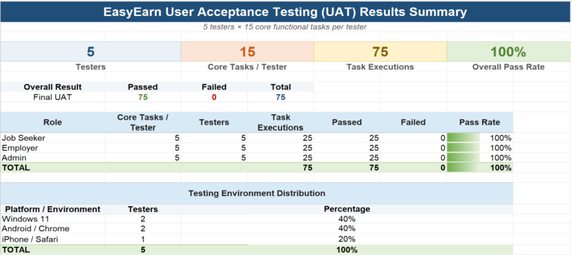

_Figure 4.10: Summary of User Acceptance Testing Results_

#### 4.3.2.1 Job Seeker UAT

All five participants completed the five Job Seeker tasks, producing 25 Pass records. The task labels below follow the current UAT forms.

| Task | Recorded outcome |
| --- | --- |
| Register and Login | 5 Pass / 0 Fail |
| Job Search &amp; Browse | 5 Pass / 0 Fail |
| Job Application | 5 Pass / 0 Fail |
| Work History &amp; Rate Employer | 5 Pass / 0 Fail |
| Resume Management | 5 Pass / 0 Fail |

Figure 4.11 retains the original representative illustration. Appendix 4 contains the complete current forms, including steps, remarks and participant details.

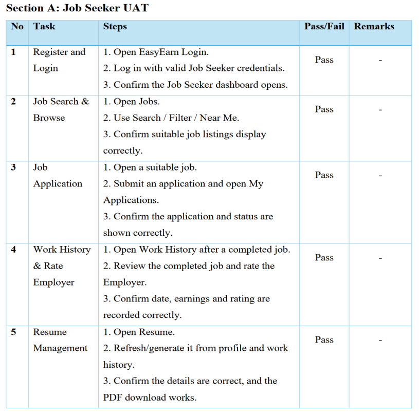

_Figure 4.11: Representative Job Seeker UAT Results_

#### 4.3.2.2 Employer UAT

All five participants completed the five Employer tasks, producing 25 Pass records. The task labels below follow the current UAT forms.

| Task | Recorded outcome |
| --- | --- |
| Post Job | 5 Pass / 0 Fail |
| View Applicants | 5 Pass / 0 Fail |
| Accept / Reject Applicant | 5 Pass / 0 Fail |
| Employer Verification | 5 Pass / 0 Fail |
| Job Completion &amp; Rate Job Seeker | 5 Pass / 0 Fail |

Figure 4.12 retains the original representative illustration. Appendix 4 contains the complete current forms, including steps, remarks and participant details.

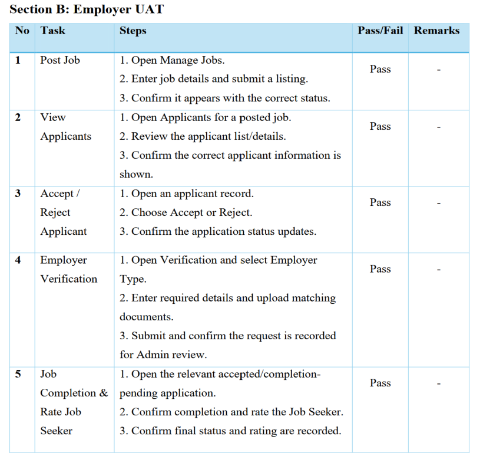

_Figure 4.12: Representative Employer UAT Results_

#### 4.3.2.3 Admin UAT

All five participants completed the five Admin tasks, producing 25 Pass records. The task labels below follow the current UAT forms.

| Task | Recorded outcome |
| --- | --- |
| Lock / Unlock Employer | 5 Pass / 0 Fail |
| Approve Job | 5 Pass / 0 Fail |
| Flag / Remove Job | 5 Pass / 0 Fail |
| Employer Verification Review | 5 Pass / 0 Fail |
| Reports | 5 Pass / 0 Fail |

Figure 4.13 retains the original representative illustration. Appendix 4 contains the complete current forms, including steps, remarks and participant details.

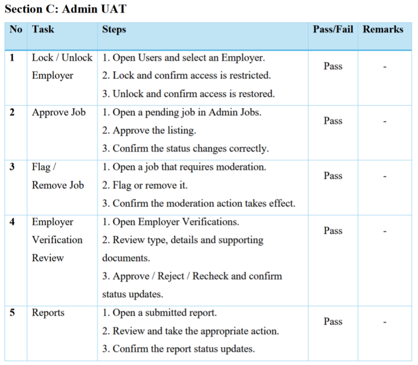

_Figure 4.13: Representative Admin UAT Results_

The UAT results support successful completion of the selected workflows using the recorded accounts, tasks and devices. The five-person sample does not establish population-wide acceptance, independent security assurance or performance under concurrent load.

### 4.3.3 Usability Testing

Usability was evaluated through Section D of the five UAT forms and the previously documented heuristic evaluation. Section D contains ten statements rated from 1 (Strongly Disagree) to 5 (Strongly Agree). The questionnaire measures the participants’ recorded perceptions after completing the functional tasks; it is not a formal TAM validation or an accessibility conformance assessment.

The forms contain 50 ratings: 42 Strongly Agree responses and 8 Agree responses, with no scores of 1, 2 or 3. The weighted mean is (42 × 5 + 8 × 4) / 50 = 4.84/5. All five participants selected Accept for Overall Acceptance.

_Table 4.5: End-user Usability Questionnaire Results_

| No. | Evaluation item | Agree (4) | Strongly Agree (5) | Mean score |
| --- | --- | --- | --- | --- |
| 1 | The navigation menu makes it easy to find the functions I need. | 0 | 5 | 5.00 |
| 2 | Job information, buttons and instructions are clear and easy to understand. | 0 | 5 | 5.00 |
| 3 | Job search, filters and Near Me are easy to use. | 0 | 5 | 5.00 |
| 4 | Application status and next actions are clearly displayed. | 0 | 5 | 5.00 |
| 5 | Forms and system messages help me complete tasks and correct mistakes. | 2 | 3 | 4.60 |
| 6 | The layout, buttons and design are consistent throughout EasyEarn. | 0 | 5 | 5.00 |
| 7 | Employer verification requirements are clear and understandable. | 3 | 2 | 4.40 |
| 8 | The chatbot and available guidance are helpful when I need assistance. | 3 | 2 | 4.40 |
| 9 | The translation feature is easy to access and use. | 0 | 5 | 5.00 |
| 10 | Overall, I can complete the main EasyEarn tasks easily and efficiently. | 0 | 5 | 5.00 |
| Overall | 50 ratings | 8 | 42 | 4.84 |

_Table 4.5b: Usability Scores by Participant_

| Participant | Ratings | Score total / 50 | Mean / 5 |
| --- | --- | --- | --- |
| Ang Mun Hin | 10 | 47 | 4.70 |
| Chan Jade Qi | 10 | 50 | 5.00 |
| Lee Jian Hou | 10 | 47 | 4.70 |
| Seah Pei Yan | 10 | 48 | 4.80 |
| Wong Ke Ni | 10 | 50 | 5.00 |

Seven items received a mean score of 5.00. Forms and system messages scored 4.60; employer-verification clarity and chatbot guidance each scored 4.40. These relatively lower scores identify possible improvement areas, even though all recorded responses were positive. The questionnaire contains only five respondents, and the high scores should be interpreted within that sample.

The author’s separate heuristic evaluation identified four issues across Visibility of System Status, Consistency and Standards, and Help and Documentation. Its existing observations and severity classifications are retained in Tables 4.6–4.8 because the supplied files contain no replacement heuristic assessment. Passing functional or compatibility tests does not by itself demonstrate that every heuristic issue has been resolved.

_Table 4.6: Heuristic Evaluation Issues and Proposed Solutions_

|**No.**| **Issue**|**Heuristic** **Violated**|**Location**|**Severity**|**Proposed Solution**|
|---|---|---|---|---|---|
|**1**|The chatbot can only handle a set of pre-|H10 - Help and|Floating chatbot|2 - Minor|Implement a lightweight intent-|
||defined FAQ|Documentat|widget (all||matching service or|
||keywords, and free-|ion|dashboard||Large Language|
||form natural||pages)||Model (LLM)-as-a-|
||language questions||||service tool to be|
||are not supported.||||used alongside the|
||||||existing FAQ knowledge base for handling free-form questions.|
|**2**|The navbar|H4 -|Job Seeker|1 -|Match the colour of|
||background colour is|Consistency|and Admin|Cosmetic|the navbar|
||inconsistent with the|and|dashboard||background to the|
||page background on|Standards|navbars||page-level colour|
||some role dashboards.||||token or CSS variable.|
|**3**|Below 700px, the|H4 -|Job Seeker|1 -|Make the 700px|
||Applications page|Consistency|Applications|Cosmetic|media query more|
||stat-card grid does|and|page||specific, or order the|
||not appear as desired|Standards|||media queries to|
||due to a CSS||||make the narrower|
||specificity issue.||||one the most specific.|
|**4**|The notification bell|H1 -|Notification|2 -|Use Supabase|
||is polling for 30|Visibility of|bell across|Minor|Realtime|
||seconds instead of|System|all roles||subscriptions instead|
||push-based|Status|||of periodic polling to|
||notification updates,||||ensure that|

|which may cause the|notifications are sent|
|---|---|
|status change to be|to the client more|
|delayed.|quickly.|

The heuristic findings were evaluated in conjunction with the lower end-user ratings of Employer verification clarity and chatbot guidance. The result of the chatbot was similar to that of H10, and there was no distinct heuristic violation found for Employer verification clarity.

Among the four usability issues identified in Table 4.6, two were rated as minor and were considered to have a greater effect on UX than the two cosmetic issues. These were limited help and documentation support (H10) and delayed notification updates (H1). Table 4.7 compares the current implementation of these two issues with their proposed improvements.

_Table 4.7: Comparison for the Two Higher-Impact Issues_

|**Issue**|**Current Implementation**|**Proposed**|**Improve**|**ment**|
|---|---|---|---|---|
|**Help and**|The chatbot answers primarily based|Integrate| light| intent|
|**Documentation**|on set FAQ keywords. If a question is|matching|/LLM|response|
|**(H10)**|not similar to the stored keywords, it|handling|for free-for|m inputs and|
||may not get the desired answer.|preserve|the FAQ|knowledge|
|||base.|||
|**Visibility of**|The notification bell refreshes every|Use |Supabase|Realtime|
|**System Status**|30 seconds, which can make it take a|subscripti|ons to push|notification|
|**(H1)**|bit longer for it to display the latest|updates|to the c|lient more|
||status changes.|promptly|.||

Table 4.7 presents the comparison between two higher-impact usability issues found in the heuristic evaluation: limited chatbot support under Help and Documentation (H10) and delayed notification updates under Visibility of System Status (H1). Both issues were rated as minor because they could affect the UX but did not prevent users from completing the main system tasks. All other usability problems were cosmetic and mainly were related to consistency and responsiveness of layout. To provide an overall summary of the heuristic evaluation, Table 4.8 maps all ten Nielsen heuristics to the issues identified in EasyEarn.

To provide an overall summary of the heuristic evaluation, Table 4.8 maps all ten Nielsen usability heuristics to the issues identified in EasyEarn. The table shows which heuristics were associated with usability issues and which were found to have no specific issue during the evaluation. This provides a consolidated view of the usability strengths and areas for improvement across the Job Seeker, Employer and Admin interfaces.

_Table 4.8: Heuristics and Issues Found_

|**Heuristic**|**Issue(s) Found**|**Notes**|
|---|---|---|
|H1 - Visibility of|Issue 4|Notification updates can take up to 30 seconds|
|System Status||since the notification bell operates on periodic polling instead of push updates.|
|H2 - Match Between|None identified|Job categories, RM currency formatting, role|
|System and the Real||names and application status terms match the|
|World||setting of the gig work in Malaysia.|
|H3 - User Control and|None identified|Actions supported can be edited and deleted or|
|Freedom||reversed, as applicable to the user's role and the state of the workflow.|
|H4 - Consistency and|Issues 2 and 3|There were two cosmetic consistency problems:|
|Standards||navbar background inconsistencies and a responsive stat-card layout problem below the 700px breakpoint.|

|H5 - Error Prevention|None identified|Validation and duplicate-submission prevention|
|---|---|---|
|||for required field data was verified to be working for the scenarios tested.|
|H6 - Recognition Rather Than Recall|None identified|Persistent navigation, role-specific menus and dashboard summaries minimize navigation path and system state memory.|
|H7 - Flexibility and|None identified|Filters, dark mode and saved jobs offer shortcuts|
|Efficiency of Use||and repeated-use support, but don't stop novice users from enjoying the same capabilities.|
|H8 - Aesthetic and|None identified|Common card layouts and specific content for|
|Minimalist Design||roles keep the interface system coherent and form task-oriented groups.|
|H9 - Help Users|None identified|Clear and actionable error messages were|
|Recognise, Diagnose, and Recover from Errors||displayed for the tested invalid inputs and failed actions.|
|H10 - Help and|Issue 1|The chatbot offers answers based on FAQs but|
|Documentation||can only match keywords and cannot handle free-form natural language questions.|

Overall, usability issues were identified under three of the ten heuristics: Visibility of System Status (H1), Consistency and Standards (H4), and Help and Documentation (H10). The remaining seven heuristics did not show a specific usability issue during the evaluation. Identified issues were minimal in that they were cosmetic issues and did not hinder completion of the main EasyEarn tasks.

#### 4.3.3.1 Justification for Non-Violations

For the seven heuristics where no specific usability issue was identified, the “Met” assessment was based on direct review of the deployed EasyEarn interfaces and the tested system behaviour. Match Between System and the Real World (H2) was judged as met because job categories, the format of RM currency, user-role terminology and application-status labels were presented consistently in the context of gig-work in Malaysia. User Control and Freedom (H3) was found to be met as users were able to edit, delete, logout and remove saved jobs where permitted, based on their role and workflow state.

Required field Validation and Duplicate submission controls were tested and found to be functioning as expected, and Error Prevention H5 was therefore judged met. Recognition Rather Than Recall (H6) was supported by sustained navigation and role-specific menus and dashboard summaries, decreasing the need for users to remember paths or states in the system. Flexibility and Efficiency of Use (H7) was supported by functions such as filters, dark mode and saved jobs, which provided convenient access without preventing new users from completing the same tasks. Aesthetic and Minimalist Design (H8) was classified as met, as the common card designs and the content relevant to the task remained clearly visible and the function was kept in focus. Help Users Recognise, Diagnose, and Recover from Errors (H9) was also rated as met, as clear error messages in the form of actionable instructions were displayed for the tested incorrect inputs or failed actions.

Overall, four usability issues were identified across three heuristics: Visibility of System Status (H1), Consistency and Standards (H4), and Help and Documentation (H10). Two issues were rated as minor and two as cosmetic, with none preventing completion of the main EasyEarn tasks. The results were generally similar to the end-user usability questionnaire that gave a mean score of 4.84 out of 5.00 on 50 usability ratings.

A limitation of the heuristic evaluation is that it was conducted by a single evaluator who was also the system developer. Therefore, the identified issues may not represent all possible usability problems. The heuristic findings should be considered in conjunction with the UAT results that included 50 usability ratings and 75 functional task executions by 5 testers in the Job Seeker, Employer and Admin roles.

### 4.3.4 Security Testing

The latest Security Testing workbook records 30 cases. The category totals below are derived from the individual case records, rather than inferred from screenshots.

| Category | Recorded cases | Pass | Other results |
| --- | --- | --- | --- |
| RLS - Data Isolation | 11 | 11 | 0 |
| Auth &amp; Access Control | 5 | 5 | 0 |
| Upload Security | 1 | 1 | 0 |
| Input Sanitisation | 2 | 2 | 0 |
| Rating &amp; Business Rules | 2 | 2 | 0 |
| Report Security | 2 | 2 | 0 |
| Analytics &amp; Chatbot | 2 | 2 | 0 |
| PDPA &amp; Compliance | 4 | 4 | 0 |
| Employer Verification | 1 | 1 | 0 |

Security Testing was conducted to evaluate the security controls implemented in EasyEarn for protecting user data, restricting unauthorised access and reducing common application-level security risks [78], [96]. The testing was organised into nine categories: RLS - Data Isolation, Auth & Access Control, Upload Security, Input Sanitisation, Rating & Business Rules, Report Security, Analytics & Chatbot, PDPA & Compliance, and Employer Verification & Visibility. A total of 30 Security Testing test cases (SEC-001 to SEC-030) were executed, and all 30 test cases achieved a Pass result in the final testing round. The testing centred on Supabase RLS, authentication and RBAC, file-upload restrictions, handling of input, rating and reporting restrictions, access to administrative data, privacy-related restrictions, and Employer verification-based job visibility. Figure 4.14 summarises the nine Security Testing categories. In this section, one representative test case from each category is presented, with the other test cases and supporting evidence given in Appendix 5.

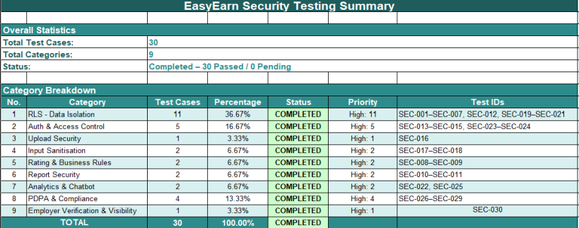

_Figure 4.14: EasyEarn Security Testing Summary_

#### 4.3.4.1 Row Level Security (RLS) - Data Isolation

RLS - Data Isolation Testing evaluated whether Supabase RLS controls restrict users to records they are authorised to access. EasyEarn testing covered applications, notifications, job listings, user profiles, work history and other user-related records, with additional test cases and evidence provided in Appendix 5.1.

##### SEC-001: Seeker Cannot Read Another Seeker's Applications

**Recorded result: Pass.**

While authenticated as ABCD, fetchApplications(ABCD_ID) returned exactly 1 application (id 888c03d0-98d9-4e89-bce4-5e0f4ef799c1, seeker_id = ABCD). Using the same authenticated session, fetchApplications(LEN_ID) returned an empty array []. Len Pei Ying's 4 application records were not exposed to ABCD.

**Expected result:** ABCD's own application is returned, while a query for Len Pei Ying's applications returns no rows. RLS must prevent cross-seeker application disclosure even when another seeker's ID is supplied by the client.

**Test procedure:**

1. Log in as Job Seeker ABCD.
2. Import the EasyEarn data module and call fetchApplications() using ABCD's own seeker ID.
3. In the same authenticated ABCD session, call fetchApplications() using Len Pei Ying's seeker ID.
4. Compare the returned arrays.

**Test input:** Authenticated user: ABCD (d1ff41b4-fb7d-4398-a270-c405c83fc795)
Other seeker: Len Pei Ying (31c79f9e-2dee-44f9-80d7-2a70725dbb52)

**Recorded comments:** Runtime RLS isolation was confirmed using ABCD's authenticated Supabase session: own row visible, another seeker's rows filtered out.

Figure 4.15 retains the original screenshot associated with this case. The result and comments above follow the latest testing workbook.

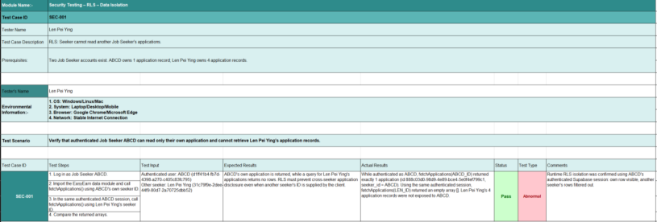

_Figure 4.15: RLS - Data Isolation (Seeker Application Read Isolation)_

#### 4.3.4.2 Auth & Access Control

Auth & Access Control Testing evaluated whether authentication, session and role-based restrictions prevent users from accessing functions or data outside their authorised role. The testing included registration controls, cross-role access, session handling, Admin-only functions, as well as some additional evidence in Appendix 5.2.

##### SEC-024: Admin Page Access Blocked for Non-Admin Users

**Recorded result: Pass.**

While authenticated as Job Seeker ABCD, direct navigation to the Admin Users page was blocked. The system redirected the non-admin session back to the Job Seeker Dashboard, and admin content was not displayed.

**Expected result:** Non-admin users are redirected away from admin pages; admin content is not rendered.

**Test procedure:**

1. Log in as Seeker.
2. Navigate directly to pages/admin/users.html.
3. Observe behaviour.

**Test input:** Auth: Seeker session
Files: admin-header.js, auth.js (requireAdmin)

**Recorded comments:** Non-admin direct URL access was correctly prevented by the admin access guard.

Figure 4.16 retains the original screenshot associated with this case. The result and comments above follow the latest testing workbook.

_Figure 4.16: Auth & Access Control - Admin Page Access Restriction_

#### 4.3.4.3 Upload Security

Upload Security Testing was used to assess the file-type and file-size limits for profile images and Employer verification documents. This category contains one test case, SEC-016, which is presented below.

##### SEC-016: Profile Photo and Verification Document Upload Restrictions

**Recorded result: Pass.**

Profile photo upload with an 11.46 MB PNG was rejected with 'Profile photo must be 2MB or smaller.' A plain-text file renamed with a .jpg extension was not saved and produced 'Unable to process the selected image.' An oversized Employer Verification document was rejected with 'Each file must be 2MB or smaller.' These tests confirm enforcement of file size limits and rejection of a non-image file disguised with an image extension.

**Expected result:** Files larger than 2MB rejected; non-image MIME types rejected even if extension is spoofed.

**Test procedure:**

1. Attempt to upload a 3MB image as profile photo.
2. Attempt to upload .exe renamed to .jpg.
3. Attempt oversized SSM document on verification form.
4. Verify rejected uploads show error and are not sent to storage.

**Test input:** File 1: 3MB .png
File 2: malware.exe renamed .jpg
Files: jobseeker-profile.js, employer-profile.js, employer-verification.js

**Recorded comments:** Upload controls correctly blocked oversized files and a spoofed non-image file. The tested invalid files were not accepted for storage.

Figure 4.17 retains the original screenshot associated with this case. The result and comments above follow the latest testing workbook.

_Figure 4.17: Upload Security - File Type and Size Restrictions_

#### 4.3.4.4 Input Sanitisation

Input Sanitisation Testing evaluated how EasyEarn handles potentially malicious user input, including Cross-Site Scripting (XSS) and SQL injection-related input. One representative test case is presented below, while the additional test case and evidence are provided in Appendix 5.4.

##### SEC-017: Input Sanitisation Against XSS

**Recorded result: Pass.**

XSS testing was completed across job descriptions, rating reviews, and chat messages using payloads such as &lt;script&gt;alert(1)&lt;/script&gt; and &lt;img src=x onerror=alert(1)&gt;. In the verified-employer W&amp;X Bakery retest, the job description payload was rendered as escaped text on the Job Seeker page and no alert executed. The same image/onerror payload was submitted in an employer rating review and in chat messages; no JavaScript alert executed on either side of the conversation. Normal functions such as viewing the job and applying remained available.

**Expected result:** Script/HTML payloads are rendered as harmless text, not executed, anywhere displayed back to other users.

**Test procedure:**

1. Post a job listing with &lt;script&gt;alert(1)&lt;/script&gt; in description.
2. View the listing on the public Jobs page.
3. Submit a rating review with &lt;img onerror=alert(1)&gt; payload.
4. View the review on Employer Ratings page.

**Test input:** Payload: &lt;script&gt;alert(1)&lt;/script&gt; and &lt;img src=x onerror=alert(1)&gt;
Files: employer-post-job.js, employer-ratings.js, messages-page.js

**Recorded comments:** Retest passed. User-controlled HTML/JavaScript payloads did not execute in the tested job description, rating review, or chat display paths. Job description content was shown as escaped text.

Figure 4.18 retains the original screenshot associated with this case. The result and comments above follow the latest testing workbook.

_Figure 4.18: Input Sanitisation - XSS Prevention_

#### 4.3.4.5 Rating & Business Rules

Rating & Business Rules Security Testing evaluated whether rating-related restrictions prevent invalid or unauthorised rating activities. The testing covered rating eligibility and self-rating prevention, with additional evidence provided in Appendix 5.5.

##### SEC-008: Seeker Cannot Submit a Rating for a Pending Application

**Recorded result: Pass.**

Initial test failed because Job Seeker ABCD could force a rating insert for a pending application and the rating was visible on the Employer Ratings page. After the database security fix, the same pending-application rating attempt was rejected with HTTP 403 and no new rating row was created; the Employer Ratings page no longer showed the pending test rating. Regression verification confirmed legitimate completed-application ratings remained available: Tsuki's completed applications 112ba3b2-819e-4009-a948-525e136ebba1 and 32ea3d8c-152d-4e74-897d-a5a5e1f32030 retained valid rating rows, including seeker-to-employer and employer-to-seeker ratings. Retest passed.

**Expected result:** Rating UI is not surfaced for pending applications; if forced via API, the insert succeeds at DB level but is never shown to the employer.

**Test procedure:**

1. Log in as S.
2. Attempt to call upsertRating() for the pending application.
3. Check UI and DB.

**Test input:** Auth: S
Application status: pending
Files: supabase-data.js (upsertRating), jobseeker-work-history.js

**Recorded comments:** Retest passed after database-level rating validation was added. Pending applications are now blocked from rating creation/visibility, while valid completed-application ratings continue to work.

Figure 4.19 retains the original screenshot associated with this case. The result and comments above follow the latest testing workbook.

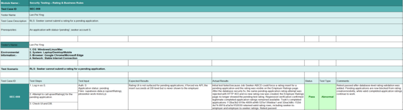

_Figure 4.19: Rating & Business Rules - Rating Eligibility Guard_

#### 4.3.4.6 Report Security

Report Security Testing determined that report submission and report records are controlled only to authenticated and authorised users. Testing included unauthenticated report submission and cross-user report access; further evidence is included in Appendix 5.6.

##### SEC-011: Seeker Cannot Read Another User's Submitted Reports

**Recorded result: Pass.**

While authenticated as Job Seeker ABCD (user ID d1ff41b4-fb7d-4398-a270-c405c83fc795), a direct query to the reports table returned an empty array with no error. Known reports belonging to Tsuki (d43f9652-89ed-45af-b429-bf361646a11a) and Len (fcc3189e-0e67-40f8-b688-c79842ba481f) were not returned. This confirms that another seeker's submitted reports are hidden by RLS.

**Expected result:** Only S2's own report rows (reporter_id = auth.uid()) are returned; S1's reports are hidden.

**Test procedure:**

1. Log in as S2.
2. Query reports table without reporter_id filter.
3. Check rows returned.

**Test input:** Auth: S2
Files: schema.sql (reports_select_own, reports_admin_select policies)

**Recorded comments:** RLS correctly limits report visibility to the authenticated user's own reports; unrelated seeker reports were not exposed.

Figure 4.20 retains the original screenshot associated with this case. The result and comments above follow the latest testing workbook.

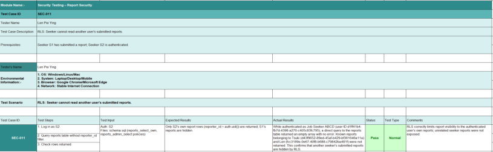

_Figure 4.20: Report Security - Report Read Isolation_

#### 4.3.4.7 Analytics & Chatbot

Analytics & Chatbot Security Testing examined whether analytics and chatbot data is limited by user role. The tests were focused on restricting non-admin users from accessing administrative analytics and chatbot log information, and further evidence is included in Appendix 5.7.

##### SEC-025: Admin Analytics Data is Not Accessible to Non-Admin Users

**Recorded result: Pass.**

While authenticated as Job Seeker ABCD, a direct SELECT query against public.analytics returned HTTP status 200 with data as an empty array and error = null. No analytics rows were exposed to the non-admin account, confirming that analytics data is restricted to admin users by RLS.

**Expected result:** No rows returned for non-admin users; analytics data is admin-only.

**Test procedure:**

1. Log in as Seeker.
2. Query analytics table directly.
3. Check rows returned.

**Test input:** Auth: Seeker
Files: schema.sql (analytics_admin_select policy)

**Recorded comments:** Admin analytics data is correctly hidden from non-admin users; the Job Seeker session could not read any analytics rows.

Figure 4.21 retains the original screenshot associated with this case. The result and comments above follow the latest testing workbook.

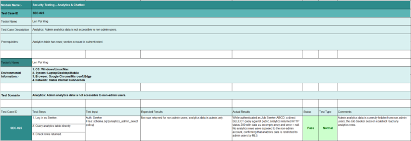

_Figure 4.21: Analytics & Chatbot - Analytics Access Restriction_

#### 4.3.4.8 PDPA & Compliance

PDPA & Compliance Security Testing evaluated selected EasyEarn privacy and access-control measures related to personal data, Employer verification information and job-listing visibility. These tests were for selected technical controls and were not part of a legal compliance audit. Additional test cases and evidence are provided in Appendix 5.8.

##### SEC-026: Personal Data Fields are Not Exposed in Public Job Listing Queries

**Recorded result: Pass.**

While unauthenticated, a direct SELECT * query on public.job_listings returned five public job rows. The returned objects contained job-specific fields only, including id, employer_id, title, description, category, location, job_type, pay_rate, pay_type, skill_tags, expiry_date, status, created_at, openings_count, deleted_at, approved_by and approved_at. No employer personal profile fields such as email, phone, bio, SSM number, registration document data or contact document data were included in the public job listing response.

**Expected result:** Job listing rows do not include employer personal contact fields; only job-specific fields (title, location, pay, category, etc.) are returned.

**Test procedure:**

1. Without logging in, open the public Jobs page.
2. Inspect job listing data returned from Supabase.
3. Verify employer personal data (phone, email, bio) is not embedded in the job listing response.

**Test input:** Auth: none (anon)
Files: jobseeker-jobs.js, schema.sql (job_listings_public_read policy)

**Recorded comments:** Public job listing queries expose job information only; employer personal/contact and verification-document fields are not embedded in the job listing response.

Figure 4.22 retains the original screenshot associated with this case. The result and comments above follow the latest testing workbook.

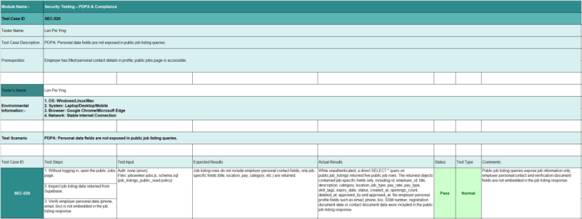

_Figure 4.22: PDPA & Compliance - Job Listing Data Minimisation_

#### 4.3.4.9 Employer Verification & Visibility

Employer Verification & Visibility Testing determined if public job visibility is appropriately limited based on the Employer's verification status. This category contains only one test case, SEC-030, which is presented in full below. Since there are no additional test cases in this category, SEC-030 is not repeated in Appendix 5.9.

##### SEC-030: Employer Verification & Job Visibility

**Recorded result: Pass.**

Initial test identified that an approved CarePlus job was publicly visible even though the employer had not passed verification. After adding the verified-employer database read gate, the CarePlus job remained available in the Employer Dashboard for management but disappeared from Public / Job Seeker Browse Jobs. The visibility rule was therefore corrected and the retest passed.

**Expected result:** An unverified employer may create and manage its own listing, but the job must not be publicly visible to Job Seekers until the employer is verified.

**Test procedure:**

1. Log in as unverified employer CarePlus and create/save a test job.
2. Admin approves the CarePlus job.
3. Open Public / Job Seeker Browse Jobs and verify the CarePlus job is not visible.
4. Return to CarePlus Employer Dashboard and verify the employer can still manage its own job.

**Test input:** Employer: CarePlus (unverified)
Initial observation: approved CarePlus job was visible to Job Seekers.
Fix: public job visibility requires job status = approved AND employer is_verified = true.

**Recorded comments:** Initial issue identified and resolved. Retest passed after security fix. Public visibility now requires both an approved job and a verified, active employer.

Figure 4.23 retains the original screenshot associated with this case. The result and comments above follow the latest testing workbook.

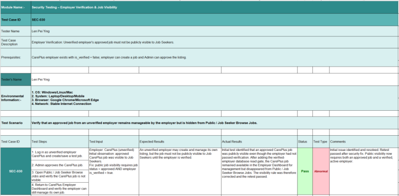

_Figure 4.23: Employer Verification and Job Visibility Restriction_

Overall, all 23 Compatibility Testing test cases across the six testing categories achieved a Pass result in the final testing round. In the directly tested environments, the platform features, authentication-session behaviour, the interface components and form controls performed as expected for the selected functions. The findings are limited to the browsers, devices, operating systems and viewport conditions that were directly tested. Other Security Testing test cases and supporting evidence are included in Appendix 5.

### 4.3.5 Compatibility Testing

The latest Compatibility Testing workbook records 23 cases. The category totals below are derived from the individual case records, rather than inferred from screenshots.

| Category | Recorded cases | Pass | Other results |
| --- | --- | --- | --- |
| Browser Compatibility | 4 | 4 | 0 |
| Responsive Design | 5 | 5 | 0 |
| Feature Compatibility | 6 | 6 | 0 |
| Session &amp; Auth | 2 | 2 | 0 |
| UI &amp; Display | 3 | 3 | 0 |
| Form &amp; Input | 3 | 3 | 0 |

Compatibility Testing was performed to determine if EasyEarn was consistent with the browsers, screen sizes, devices and interaction environments within the scope of the test. The testing categories were: Browser Compatibility, Responsive Design, Feature Compatibility, Session & Auth, UI & Display, Form & Input. A total of 23 Compatibility Testing test cases (CT-001 to CT-023) were executed, and all 23 achieved a Pass result in the final testing round. The tests included browser-dependent functionality, responsive layout, platform-dependent features, authentication-session functionality, presentation of the interface and form controls. Figure 4.24 summarises the six Compatibility Testing categories. One representative test case from each category is presented in this section, while the remaining test cases and supporting evidence are provided in Appendix 6.

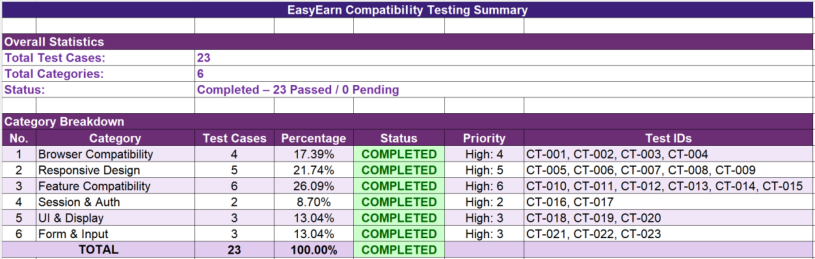

_Figure 4.24: EasyEarn Compatibility Testing Summary_

#### 4.3.5.1 Browser Compatibility

Browser Compatibility Testing evaluated the consistency of selected browser-dependent EasyEarn functions and interface elements as they were tested in the directly tested desktop browsers. The testing covered CSS layout rendering, JavaScript functionality, PDF resume generation and Chart.js analytics rendering in Google Chrome, Mozilla Firefox and Microsoft Edge. Additional test cases and evidence are provided in Appendix 6.1.

##### CT-001: CSS Layout Rendering

**Recorded result: Pass.**

Tested the EasyEarn Browse Jobs page in Google Chrome, Microsoft Edge and Mozilla Firefox on the same Windows device. The navigation bar, search/filter controls, job-card grid, verification badges, Apply buttons, icons, spacing and overall layout rendered consistently across all three browsers. No overlap, missing controls, broken Grid/Flex layout or meaningful visual discrepancy was observed. Safari was not tested because it was not available in the current Windows test environment.

**Expected result:** CSS layout renders consistently with no broken Grid/Flex, missing fonts, or visual discrepancies across all four browsers.

**Test procedure:**

1. Open EasyEarn homepage in Chrome and verify CSS Grid/Flex layout.
2. Repeat in Firefox and compare layout.
3. Repeat in Safari and compare layout.
4. Repeat in Edge and compare layout.
5. Check for any broken layout or missing styles across all four browsers.

**Test input:** Browsers: Chrome, Firefox, Safari, Edge
Files: css/*, includes.js

**Recorded comments:** Chrome, Edge and Firefox showed consistent rendering. Safari was not available for direct testing in the current environment.

Figure 4.25 retains the original screenshot associated with this case. The result and comments above follow the latest testing workbook.

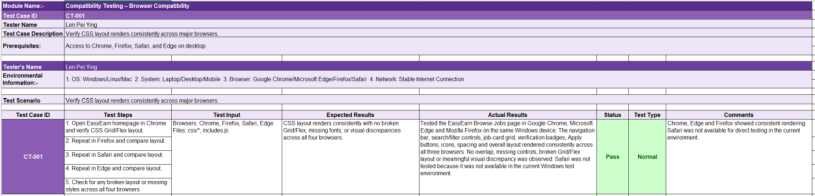

_Figure 4.25: Browser Compatibility - CSS Layout Rendering_

#### 4.3.5.2 Responsive Design

Responsive Design Testing determined if EasyEarn's layout, navigation and interactive components were responsive to desktop, tablet and mobile screen sizes. The testing included layout breakpoints, touch interactions, mobile content display, validation presentation and mobile filtering, and video evidence is attached in Appendix 6.2.

##### CT-005: Layout Breakpoints

**Recorded result: Pass.**

Retested the responsive layout after the 375px mobile fixes. The desktop (1920px), tablet (768px), and mobile (375px) views now adapt correctly. On mobile, navigation remains collapsed appropriately, dashboard and chart content fits within the viewport, charts stack vertically without being cut off, and no visible horizontal overflow or overlapping content was observed.

**Expected result:** Layout adapts fluidly at all three breakpoints with no horizontal scroll, overlapping elements, or broken navigation.

**Test procedure:**

1. Load Jobs page at 1920px (desktop) and verify multi-column grid layout.
2. Resize to 768px (tablet) and verify layout adapts to two columns.
3. Resize to 375px (mobile) and verify single-column layout.
4. Check navigation collapses into hamburger menu at mobile width.
5. Verify no horizontal scroll or overlapping elements at any breakpoint.

**Test input:** Viewports: 1920px, 768px, 375px
Files: css/*, includes.js

**Recorded comments:** 375px responsive issue was fixed and successfully retested. Desktop, tablet and mobile layouts now display correctly.

Figure 4.26 retains the original screenshot associated with this case. The result and comments above follow the latest testing workbook.

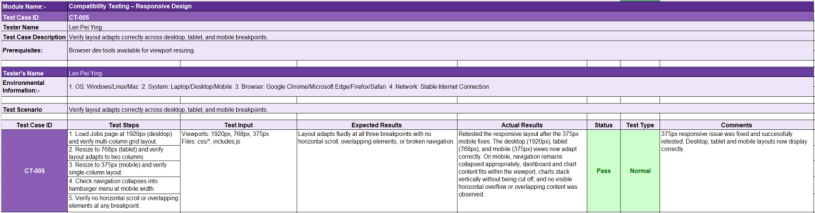

_Figure 4.26: Responsive Design - Layout Breakpoints_

#### 4.3.5.3 Feature Compatibility

Feature Compatibility Testing checked if the selected EasyEarn features functioned correctly across the browsers and screen resolutions tested. The tests covered Google Translate Integration, dark mode, the floating chatbot, Employer verification uploads, notification updates and Admin analytics, with additional evidence provided in Appendix 6.3.

##### CT-010: Google Translate Integration

**Recorded result: Pass.**

Tested Google Translate integration on EasyEarn by switching the interface to Bahasa Malaysia and Mandarin, using the Jobs search/filter functions while translated, and then switching the interface back to English. Visible page text translated successfully, the layout remained intact, search and filter controls continued to work, and switching back to English restored the original interface without functional issues.

**Expected result:** Google Translate widget loads and translates visible text; all interactive features continue to function while translated.

**Test procedure:**

1. Load homepage and activate Google Translate to Bahasa Malaysia.
2. Verify page content translates without breaking layout.
3. Use the Jobs search filter while translated.
4. Submit a job application while translated.
5. Switch back to English and verify all functionality is restored.

**Test input:** Target language: Bahasa Malaysia / Mandarin
Files: js/translate.js, index.html

**Recorded comments:** Bahasa Malaysia and Mandarin translation worked without breaking page layout or Jobs interactions. Returning to English also worked correctly.

Figure 4.27 retains the original screenshot associated with this case. The result and comments above follow the latest testing workbook.

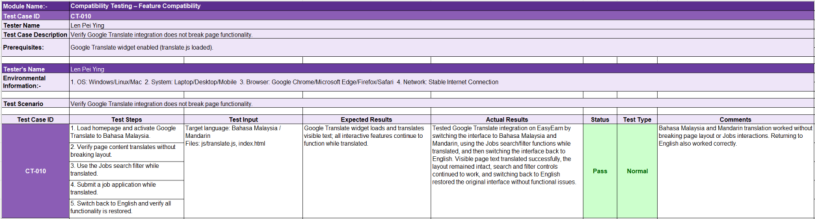

_Figure 4.27: Feature Compatibility - Google Translate Integration_

#### 4.3.5.4 Session & Auth

Session & Auth Compatibility Testing checked if authentication-session behaviour was consistent across multiple tabs in the same browser session. Tests included cross tab session persistence and synchronised logout and there was additional evidence provided in Appendix 6.4.

##### CT-017: Cross-Tab Logout

**Recorded result: Pass.**

Tested logout behaviour with the same Job Seeker session open in multiple tabs. Logging out from one tab cleared the shared authentication session and caused the other open EasyEarn tab to be logged out as well. After the session was cleared, protected pages could no longer be accessed without signing in again.

**Expected result:** Logout clears the Supabase session from localStorage; subsequent navigation in any tab detects no active session and redirects to Login.

**Test procedure:**

1. Log in as Job Seeker and open dashboard in Tab 1 and Tab 2.
2. Click Logout in Tab 1.
3. Verify Tab 1 redirects to Login page.
4. In Tab 2, attempt to navigate to a protected page or refresh.
5. Verify Tab 2 also redirects to Login page after session is cleared.

**Test input:** Files: js/auth.js (handleLogout), js/supabase-data.js (observeAuth)

**Recorded comments:** Logout propagated across tabs correctly and cleared the shared browser session as expected.

Figure 4.28 retains the original screenshot associated with this case. The result and comments above follow the latest testing workbook.

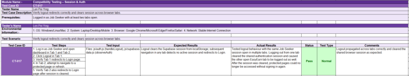

_Figure 4.28: Session & Auth - Cross-tab Logout_

#### 4.3.5.5 UI & Display

UI & Display Compatibility Testing was used to determine the readability and proper display of the EasyEarn interface content in the test environments. Testing was conducted on font rendering, long text handling and image-upload preview, and some specifics are included in Appendix 6.5.

##### CT-019: Long Text Overflow Handling

**Recorded result: Pass.**

Tested long text content using an extended job title, long job description and long employer company overview. At the 375px mobile viewport, text wrapped correctly inside the form fields and page containers without horizontal overflow, clipping or breaking the layout. The same content was also considered safe for the wider desktop layout because the available container width is greater than on mobile.

**Expected result:** Long text wraps correctly within containers at all viewports; no text overflows outside card or container boundaries.

**Test procedure:**

1. Open a job listing with a long description and verify text wraps correctly.
2. Open Employer profile with a long company overview and verify layout.
3. Resize to mobile (375px) and verify long text still wraps correctly.
4. Check job cards on Jobs page with long job titles.
5. Verify no text overflows outside card boundaries on any viewport.

**Test input:** Viewport: 1920px, 375px
Files: css/*, pages/jobseeker/jobs.html

**Recorded comments:** Long job and employer profile text wrapped correctly at 375px with no visible overflow. Desktop layout provides more width, so no additional overflow issue was expected.

Figure 4.29 retains the original screenshot associated with this case. The result and comments above follow the latest testing workbook.

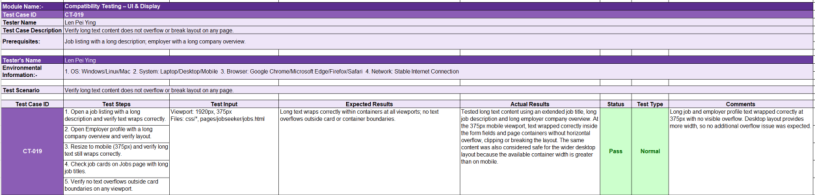

_Figure 4.29: UI & Display - Long Text Overflow Handling_

#### 4.3.5.6 Form & Input

Form & Input Compatibility Testing was used to determine if common EasyEarn form controls and functions responded in a consistent manner in the tested browsers. The tests included interview date and time selection, file-size and file-type validation, and password-field masking; additional evidence is included in Appendix 6.6.

##### CT-021: Interview date/time picker

**Recorded result: Pass.**

Tested interview date/time scheduling in Google Chrome, Mozilla Firefox and Microsoft Edge. The Employer could open an accepted application, use the date/time picker, select a valid interview date and time, save the schedule, and view the saved interview date/time correctly in all three tested browsers.

**Expected result:** Date and time picker opens and saves correctly across all browsers; scheduled interview date is stored and displayed accurately.

**Test procedure:**

1. Log in as Employer and open Applicants page in Chrome.
2. Select an accepted application and open interview scheduling.
3. Click the date/time input and verify date picker opens.
4. Select a date and time and verify the value is saved correctly.
5. Repeat steps 1–4 in Firefox, Safari, and Edge.

**Test input:** Browsers: Chrome, Firefox, Safari, Edge
Files: js/employer-applicants.js, pages/employer/applicants.html

**Recorded comments:** Interview scheduling worked consistently in Chrome, Firefox and Edge. Browser picker appearance differed slightly, but the selected date/time saved and displayed correctly.

Figure 4.30 retains the original screenshot associated with this case. The result and comments above follow the latest testing workbook.

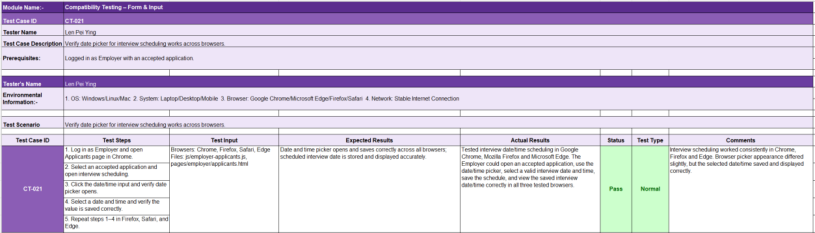

_Figure 4.30: Form & Input - Interview Date/Time Picker_

Overall, all 23 Compatibility Testing test cases across the six testing categories achieved a Pass result in the final testing round. For the EasyEarn browser, the results indicated that the tested environments operated in a consistent manner for the tested functions and the features of the platform selected, the authentication-session behaviour, the interface components and form controls. The findings are limited to the browsers, devices, operating systems and viewport conditions that were directly tested. The remaining Compatibility Testing test cases and supporting evidence are provided in Appendix 6.

### 4.3.6 Requirements Traceability and Verification Summary

The updated records qualify the interpretation of verification: ST-017 records a submit-button state that did not reset after a network failure; CT-020 excludes pre-save image preview; CT-001–CT-004 do not directly test Safari in the formal compatibility suite. The iPhone UAT supplies separate Safari workflow evidence. SEC-002 confirms the outcome by database readback rather than the client-helper return value. These qualifications apply to the evidence mappings below.

To show the connection between the system requirements established in Chapter 3 and the evidence of evaluating the system in this chapter, the FRs and NFRs of EasyEarn were mapped to the evidence of the implementation and the verification of the system. Requirements traceability provides a systematic relationship between software requirements, implementation and evaluation activities [21], [96]. Tables 4.9 and 4.10 accordingly show the evidence used to assess each requirement and whether it is verified, partially verified, evaluated or supported in terms of implementation evidence in the scope of this FYP.

The 18 FRs defined in Table 3.8 are mapped to the corresponding System Testing, UAT, Security Testing and Compatibility Testing evidence in Table 4.9. As the final UAT was structured as 15 core functional tasks for the Job Seeker, Employer and Admin roles, rather than as numbered test cases, the relevant UAT task descriptions are provided directly as evidence for verification in the table.

_Table 4.9: Functional Requirements Verification Summary_

|**Requirement**|**Verification Evidence**|**Status**|
|---|---|---|
|**FR01 – User Registration**|UAT – Job Seeker Registration & Login; ST-001;|Verified|
|**& Login**|SEC-014; SEC-015||
|**FR02 – RBAC**|SEC-013; SEC-024; ST-018|Verified|
|**FR03 – Profile Setup**|ST-001|Verified|
|**FR04 – Browse & Filter** **Job Listings**|UAT – Job Seeker Job Search & Browsing; ST- 013; CT-009|Verified|
|**FR05 – Apply for Jobs**|UAT – Job Seeker Job Application; ST-001; ST- 007|Verified|
|**FR06** **–** **Application** **Status Tracking**|ST-003; ST-023|Verified|
|**FR07 – Save Jobs /** **Wishlist**|ST-012|Verified|
|**FR08 – Work History**|UAT – Job Seeker Work History & Employer|Verified|
|**Dashboard**|Rating; ST-029||
|**FR09 – Auto-Generate**|UAT – Job Seeker Resume Management; ST-|Verified|
|**Resume**|015; CT-003||
|**FR10 – Post & Manage** **Job Listings**|UAT – Employer Job Posting; ST-002; ST-030|Verified|
|**FR11** **–** **Review** **&**|UAT – Employer Applicant Viewing and|Verified|
|**Manage Applicants**|Acceptance/Rejection; ST-003||
|**FR12** **–** **Employer**|UAT – Employer Verification; ST-009; ST-026;|Verified|
|**Verification Badge**|SEC-030||

|**FR13** **–** **Bidirectional**|UAT – Job Seeker Work History & Employer|Verified|
|---|---|---|
|**Rating & Review**|Rating; UAT – Employer Job Completion & Job Seeker Rating; ST-024; SEC-008; SEC-009||
|**FR14 – Report / Flag**|UAT – Admin Job Flagging/Removal; UAT –|Verified|
|**System**|Admin Handling of Reports; ST-004; ST-028; SEC-010; SEC-011||
|**FR15** **–** **User**|UAT – Admin Employer Account Lock/Unlock;|Verified|
|**Management**|ST-033||
|**FR16** **–** **Job** **Listing**|UAT – Admin Job Approval; UAT – Admin Job|Verified|
|**Moderation**|Flagging/Removal; ST-004; ST-025||
|**FR17 – Google Translate**|CT-010|Verified|
|**Integration**|||
|**FR18** **–** **Rule-Based**|ST-011; CT-012|Verified|
|**Chatbot**|||

Direct evidence of evaluation of all 18 FRs was provided within the scope of testing defined. The verification evidence included 34 System Testing test cases, 75 UAT functional task executions completed by five testers, 30 Security Testing test cases and 23 Compatibility Testing test cases. The results demonstrate that the FRs implemented worked as expected in the scenarios and environments tested [96].

Table 4.10 shows how the NFRs stipulated in Table 3.9 are mapped to the corresponding verification evidence. NFRs are the quality attributes and operational constraints that impact the performance of the system, such as performance, security, usability, compatibility and maintainability [20].

_Table 4.10: Non-Functional Requirements Verification Summary_

|**Requirement**|**Verification Evidence**|**Status**|
|---|---|---|
|**NFR01 – Page Load Time**|ST-013; ST-016|Verified (Selected Pages)|
|**NFR02** **–** **HTTPS**|Section 4.2.5 System Deployment;|Implementation|
|**Encryption**|HTTPS implementation evidence|Verified|
|**NFR03 – RLS**|SEC-001–SEC-007; SEC-012; SEC-019–SEC-021|Verified|
|**NFR04** **–** **Session** **Management**|ST-018; SEC-023; CT-016; CT-017|Verified|
|**NFR05** **–** **Responsive**|CT-005–CT-009; UAT device|Verified within Tested|
|**Design**|evidence|Devices|
|**NFR06 – Accessibility**|UAT Usability Questionnaire; Heuristic Evaluation|Evaluated|
|**NFR07** **–** **System** **Availability**|Section 4.2.5 System Deployment|Not Formally Verified|
|**NFR08** **–** **Concurrent**|ST-014|Partially Verified|
|**Users**|||
|**NFR09** **–** **Code**|Section 4.2.1 Frontend|Implementation|
|**Modularity**||Verified|
|**NFR10 – PDPA 2010**|SEC-026–SEC-029; ST-031–ST- 033|Verified (Selected Controls)|
|**NFR11** **–** **Browser**|CT-001–CT-004; UAT –|Partially Verified|
|**Compatibility**|iPhone/Safari||
|**NFR12** **–** **Deployment**|Section 4.2.5 System Deployment;|Implementation|
|**Independence**|Appendix 7|Verified|

The detailed evaluation results discussed in Sections 4.3.1-4.3.5 are complemented by the verification evidence presented in Tables 4.9 and 4.10. Most NFRs were evaluated through performance, security, usability and compatibility testing. NFR07 (System Availability) was not formally verified because the project did not require monitoring of system availability over long periods of time; NFR08 (Concurrent Users) was partially verified by the concurrent application test in ST-014 instead of formal load or stress testing with 100 concurrent users. Partially verified was also NFR11 (Browser Compatibility), as the formal Compatibility Testing suite only covered Google Chrome, Mozilla Firefox and Microsoft Edge, with Safari covered via the iPhone UAT. The supporting evidence for NFR02 (HTTPS Encryption), NFR09 (Code Modularity) and NFR12 (Deployment Independence) was done mainly by implementing and deploying implementation evidence and not by dedicated test cases based on execution. These classifications are used to avoid overstating the verification results [20], [21], [96].

## 4.4 Output Analysis

This section shows two sample outputs that EasyEarn can produce: the Admin Analytics Dashboard and the Job Seeker Auto-Generated Resume. The outputs provide examples of how the data stored and processed in EasyEarn can be converted to information that can be useful to various system users. The Admin Analytics Dashboard provides a summary of platform information and visualisations for easy administration monitoring, and the Auto-Generated Resume makes a Job Seeker's profile information and completed work history available as a downloadable PDF. The following subsections describe the purpose, data sources and resulting output of each feature.

### 4.4.1 Admin Analytics Dashboard Output

The Admin Analytics Dashboard provides Admins with a consolidated overview of platform activity through summary statistics, visualisations and detailed records. The dashboard presents information related to users, job listings, reports and Employer verification. Selected statistics are presented visually through charts for interpretation and monitoring of activities on the platform [51].

The dashboard fetches actual data from Supabase and makes the necessary calculations on the client side before returning and rendering the summaries and visualisations. The analytics information that was selected may also be saved as a dated snapshot in the analytics table, so that previous platform statistics may be referenced. It is implemented following EasyEarn's static-frontend and BaaS architecture, where the data is stored in Supabase, while the front-end processes and displays the retrieved information.

Admins also have access to a Data Explorer on the dashboard to view even more detailed information, depending on the filters available. In addition, a Compliance Awareness panel provides reminders related to job information, reports, payment disputes and Employer verification records. These elements combine to make the platform information comprehensible as a structured management overview. Figure 4.31 shows the Supabase analytics table used to store analytics records and historical snapshots.

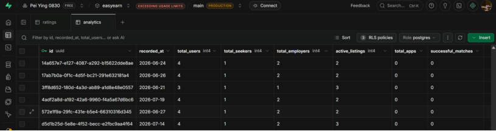

_Figure 4.31: Supabase Analytics Table_

### 4.4.2 Auto-Generated Resume Output

The Auto-Generated Resume function produces a PDF resume using information stored in the Job Seeker's EasyEarn profile and completed work history. The information for the resumes generated includes profile information, skills, education, availability, and completed work experience, so that the Job Seeker can use this information without having to re-enter it into EasyEarn.

The resume content is first rendered within the browser using the Job Seeker's stored information. The html2canvas library captures the rendered resume content and converts it to PDF document format with a size of A4, using jsPDF [49], [93]. The document will then show the profile and completed work information provided when the Resume was made.

Completed work records can provide supporting employment information such as the job role, completion details and available platform rating information. The Auto-Generated Resume transforms the Job Seeker data stored in EasyEarn into a portable employment document. Figure 4.32 shows an example of the PDF resume generated by EasyEarn.

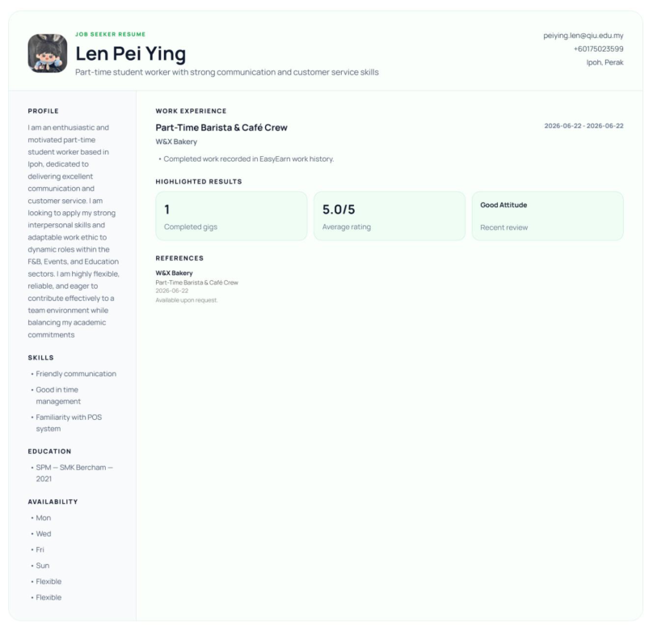

_Figure 4.32: Auto-Generated Resume Output (PDF)_

## 4.5 Conclusion

The current source records contain 87 named technical test cases (34 system, 30 security and 23 compatibility) and 75 UAT task executions. These are separate evaluation units and are not combined into a single “test-case” total. All are recorded as Pass, subject to the scenario limits and observations described above. The five UAT forms provide 50 usability ratings with a mean of 4.84/5 and five Accept decisions.

This chapter presented the implementation, testing and representative outputs of the EasyEarn Job Matching Portal. Section 4.2 described the frontend, backend, database, imported packages and system deployment. EasyEarn is built as a multi-page web application with HTML, CSS, and JavaScript, with Supabase handling the authentication, database services, RLS, and some of the database logic. It was deployed using a static frontend and a BaaS approach via GitHub Pages.

Five complementary evaluation methods were conducted in Section 4.3: System Testing, UAT, Usability Testing, Security Testing and Compatibility Testing. All 34 System Testing test cases across seven categories achieved a Pass result. Five UAT testers completed 75 functional task executions across the Job Seeker, Employer and Admin roles, with all tested tasks completed successfully. The mean value of the end-user usability questionnaire was 4.84 out of a maximum of 5.00. In addition, the heuristic evaluation identified four usability issues across three of Nielsen's usability heuristics, consisting of two minor issues and two cosmetic issues.

Security Testing had 30 test cases in 9 categories, with all 30 passing the final testing round. Several deficiencies that were noted during the first testing were rectified and retested satisfactorily before the final results were obtained. Compatibility Testing included 23 test cases across six categories, all of which passed in the directly tested environments. The Compatibility Testing findings were therefore limited to the browsers, devices, operating systems and viewport conditions that were directly evaluated.

The FRs and NFRs were mapped to the respective testing and implementation evidence in Section 4.3.6 to show requirement traceability. All 18 FRs were found to be supported by direct evaluation evidence, and selected NFRs were identified as verified, partially verified, evaluated, implementation verified or not formally verified based on the available evidence and project scope.

The first system output shown in Section 4.4 was the Admin Analytics Dashboard and the second was the Auto-Generated Resume. The Admin Analytics Dashboard pulls data from the platform to produce a summary and visualisations for admin monitoring, and the AutoGenerated Resume converts a Job Seeker's profile and completed work history into a downloadable PDF document. Overall, the implementation and evaluation results give evidence that the main EasyEarn functions and workflows were functioning as intended within the scope that was evaluated. The findings, limitations, project contributions and future enhancements are discussed further in Chapter 5.

# Chapter 5: Discussion and Conclusion

## 5.1 Introduction

This final chapter discusses the findings of the EasyEarn project in relation to the four RQs presented in Section 1.3.1 and the four research objectives outlined in Section 1.3. The findings are interpreted using the implementation, testing and output evidence presented in Chapter 4. Section 5.2 discusses how each RQ was addressed and how the corresponding research objective was achieved. Limitations related to implementation, security assurance and testing are discussed in Section 5.3. The practical, academic and technological contributions of EasyEarn are presented in Section 5.4, followed by future enhancements in Section 5.5. Section 5.6 concludes the chapter and the overall project. Figure 5.1 outlines the discussion of the research findings, objective achievement, project limitations, contributions, future enhancements and overall project conclusion.

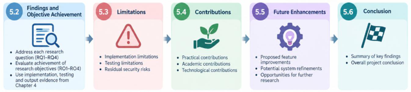

_Figure 5.1: Overview of Chapter 5 Discussion and Conclusion_

## 5.2 Findings

The key findings of the EasyEarn project are discussed in relation to the four RQs and their corresponding research objectives. Each subsection explains how the relevant RQ was addressed through the user requirement findings, system implementation and testing evidence presented in the previous chapters, and evaluates whether the corresponding research objective was achieved.

### 5.2.1 RQ1 and Objective 1: A Multi-User Job-Matching Platform

RQ1 aimed to identify the key requirements for a web-based job-matching platform that supports short-term, part-time and freelance employment between Job Seekers and Employers in Malaysia. Based on the user requirement findings and the identified system requirements, the main requirements included role-based access, job posting and application management, location and category-based job search and filtering, application status tracking, and usersupport functions. These requirements formed the basis for the development of the main EasyEarn platform functions.

Objective 1 was achieved through the development of a multi-user web-based jobmatching platform with separate role-based interfaces for Job Seekers, Employers and Admins. Job Seekers can browse and filter job listings, apply for jobs, track application status, save jobs and access the rule-based chatbot. Employers can create and manage job listings, review applicants and manage application progress. Admins are provided with platform management, user management, job moderation, reporting and analytics functions.

System Testing and UAT were used to evaluate the implementation. All 34 System Testing test cases were conducted across the E2E Workflow, Integration, Performance, Recovery, Business Logic, Reporting and Compliance categories. In addition, five UAT testers completed 75 functional task executions across the Job Seeker, Employer and Admin roles using designated accounts and test data stored in Supabase. All 75 task executions were completed successfully, indicating that the main role-based workflows could be completed within the tested scenarios

The findings therefore indicate that EasyEarn provides the essential functions required for structured short-term job matching between Job Seekers and Employers. This directly addresses Problem 1, Lack of a Specialised Short-Term Labour Platform in Smaller Towns; Problem 4, Inefficient Recruitment Process for Employers; and Problem 5, Limited Structured Access to Flexible Work Opportunities, as identified in Section 1.2.

Figure 5.2 summarises the key findings for RQ1 and Objective 1, including the main role-based functions of EasyEarn, the supporting System Testing and UAT evidence, and the three related problems addressed by the platform.

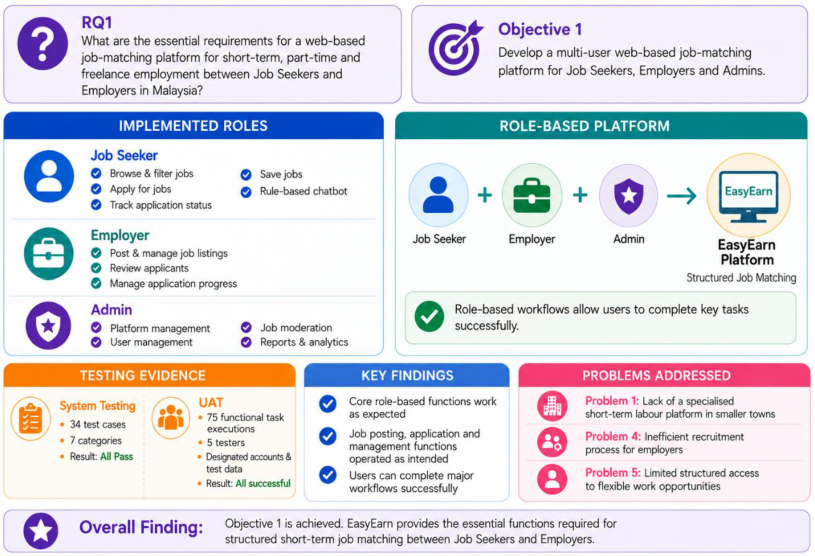

_Figure 5.2: Summary of Findings for RQ1 and Objective 1_

### 5.2.2 RQ2 and Objective 2: A Safety and Trust Verification System

RQ2 focused on the safety and trust aspects that can be included in EasyEarn to minimise the risk of fraudulent job postings and build trust between the Job Seeker and Employer. Employer verification and reporting/flagging, bidirectional ratings and reviews, and RBAC and security controls are important features to support transparency and accountability for the platform.

The Employer Verification Badge, Report and Flag System, and Bidirectional Rating and Review System were used to accomplish Objective 2. These functions give users options to review completed work engagements, report any suspicious activity and find out which Employers have been verified by the platform.

Security Testing was conducted to evaluate the implemented safety- and securityrelated controls. All 30 Security Testing test cases were performed on nine categories, and all 30 of them passed the final test rounds. Several weaknesses identified during the initial testing were corrected and successfully retested, including rating eligibility, unauthorised applicationstatus modification and the public visibility of jobs posted by unverified Employers. The final results showed that all the tested controls in authentication, access control, reporting, privacy and Employer verification were working as designed in the tested scenarios.

Overall, EasyEarn provides more structured accountability mechanisms than informal job-seeking channels. This answers Problem 2: Prevalence of Social Media Job Scams identified in Section 1.2.

Figure 5.3 summarises the key findings for RQ2 and Objective 2, including EasyEarn's main safety and trust features, the supporting Security Testing evidence, and how these functions address Problem 2 related to social media job scams.

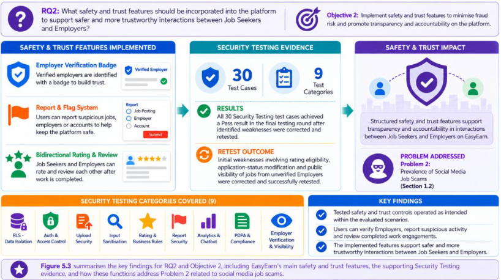

_Figure 5.3: Summary of Findings for RQ2 and Objective 2_

### 5.2.3 RQ3 and Objective 3: A Verifiable Digital Work History

RQ3 focused on the use of a digital work history and the Auto-Generated Resume to document and present the completed work experience of gig workers. The results suggest that data gathered from completed jobs, skills and platform ratings can be utilised to build a structured work history and used to produce a downloadable PDF resume. This allows Job Seekers to have a more portable and structured resume of their experience on platforms.

Objective 3 was accomplished by implementing the Work History Dashboard and Auto-Generated Resume identified in Section 4.4.2. The Resume Builder extracts the content from the Job Seeker's profile, skill tags, work history and platform ratings from Supabase and outputs them into a formatted resume and downloadable PDF. The resume created, therefore, is based on information already recorded in the EasyEarn platform, and does not require that the Job Seeker re-enter the information.

The Work History Dashboard also offers a detailed history of the jobs Job Seekers have finished and some work details. When combined, the Work History Dashboard and AutoGenerated Resume offer a viable means of recording and presenting gig workers' work history more systematically.

This directly responds to Problem 3 in Section 1.2: Lack of Verifiable Work History for Gig Workers. The key findings for RQ3 and Objective 3 are summarised in Figure 5.4, which includes the Work History Dashboard, Auto-Generated Resume, output evidence to show the work, and inputs to address the lack of verifiable work history for gig workers.

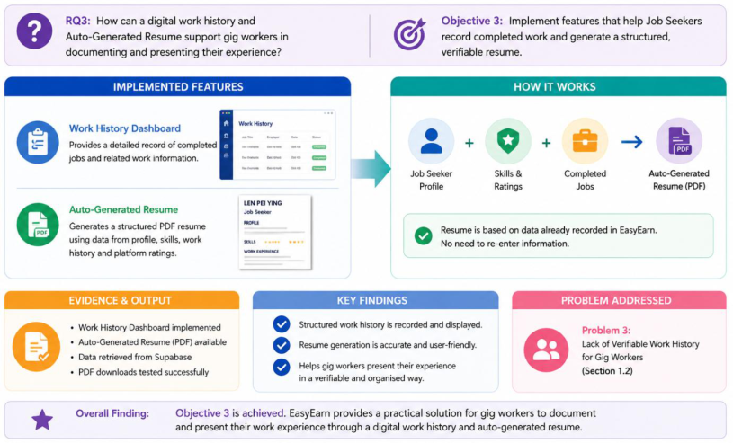

_Figure 5.4: Summary of findings for RQ3 and Objective 3_

### 5.2.4 RQ4 and Objective 4: Multilingual Accessibility

RQ4 explored the possibility of EasyEarn being more accessible to users with different language preferences by using multilingual access. The results show that multilingual accessibility can be achieved by providing a translated version of EasyEarn on the Google Translate website service. This way, users who are using different languages can see the content on the pages displayed in their own language, rather than having to download different versions of each EasyEarn page that have been translated into the users' language.

The Google Translate Integration implemented in EasyEarn achieved Objective 4. The translation function enables the website to be read in various languages such as Bahasa Melayu, Mandarin and Tamil, depending on the languages supported by the Google Translate service.

The multilingual feature was evaluated through CT-010: Google Translate Integration as part of Compatibility Testing. The translation function was successfully activated during testing, and the content of the tested page, navigation and main interface elements were accessible. The broader Compatibility Testing suite achieved 23 Pass results across six categories within the directly tested environments.

The implementation thus offers a useful multilingual-access option for different language preferences of users. It directly addresses Problem 6, Language Barrier on Existing Platforms, in Section 1.2.

Figure 5.5 summarises the key findings for RQ4 and Objective 4, including the multilingual feature implemented in EasyEarn, the supporting Compatibility Testing evidence, and how the feature addresses Problem 6 related to language barriers on existing platforms.

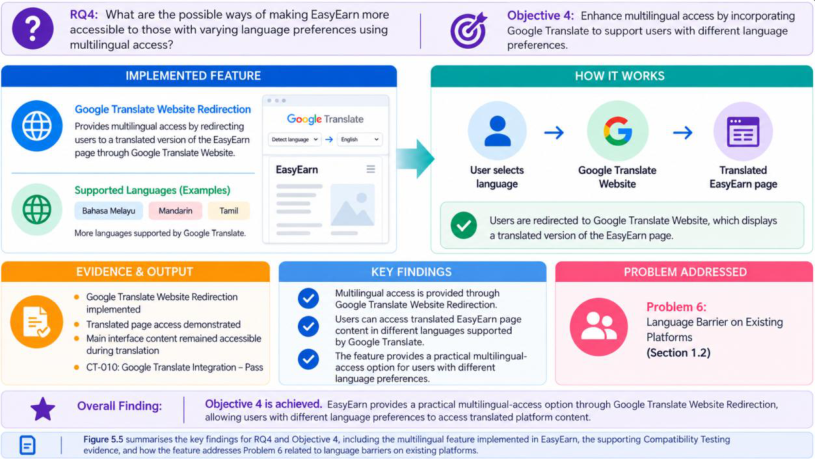

_Figure 5.5: Summary of findings for RQ4 and Objective 4_

### 5.2.5 Overall Objective Achievement Summary

The findings presented in Sections 5.2.1 to 5.2.4 demonstrate the extent to which each research objective was achieved. The evidence of implementation, evaluation outcomes and overall achievement of each project objective are summarised in Table 5.1.

_Table 5.1: Overall Project Objective Achievement Summary_

|**Objective**|**Evidence**|**Result**|||**Status**|
|---|---|---|---|---|---|
||**Collected**|||||
|**Objective 1: Develop a**|34 System Testing|Core|workflows for|Job|Achieved|
|**multi-user web-based job-**|test cases; 75 UAT|Seeker,| Employer|and||
|**matching platform with**|functional task|Admin|were success|fully||
|**role-based** **dashboards,**|executions; role-|comple|ted within|the||
|**CRUD job management**|based|evaluat|ed scenarios.|||
|**and a rule-based chatbot.**|implementation|||||

|**Objective 2: Implement**|30 Security|The tested safety, trust and|Achieved|
|---|---|---|---|
|**trust and safety features to**|Testing test cases;|security-related controls||
|**improve** **platform**|Employer|operated as intended in the||
|**reliability.**|Verification Badge; Report & Flag System; Bidirectional Rating & Review|final testing round after identified weaknesses were corrected and retested.||
|**Objective 3: Develop a**|Work History|The completed work history|Achieved|
|**digital work history profile**|Dashboard, Auto-|was successfully converted||
|**with** **automatic** **PDF** **resume generation.**|Generate Resume, System Testing|into a downloadable PDF resume.||
|**Objective** **4:** **Improve**|CT-010; Google|Translation functionality|Achieved|
|**multilingual** **accessibility**|Translate|operated correctly in the||
|**through Google Translate**|Integration;|tested environments, and all||
|**integration.**|Compatibility Testing|Compatibility Testing test cases passed.||

Overall, the evaluation results indicate that all four project objectives were achieved within the scope of this FYP. The achievement of each objective was supported by implementation evidence together with the System Testing, UAT, Security Testing, Usability Testing and Compatibility Testing results presented in Chapter 4. The remaining limitations mainly relate to long-term operational evaluation and system scalability, which are discussed in Section 5.3.

## 5.3 Limitations

The four project objectives were met based on the findings presented in Section 5.2, but there were a number of limitations during the implementation and testing of EasyEarn. The limitations should be taken into account before the system is deployed more widely in a production environment.

### 5.3.1 Security Assurance Limitations

The latest security workbook distinguishes final outcomes from initial failures. SEC-008, SEC-020 and SEC-030 explicitly describe initial vulnerabilities followed by fixes and passing retests; SEC-005 and SEC-006 record clean authenticated-query retests. A final Pass therefore describes the verified retest scenario, not uninterrupted security throughout development. SEC-002 also records an optimistic helper response that required a trusted database readback to establish that an unauthorised update had not persisted.

All 30 Security Testing test cases passed in the final testing round after the issues found during the earlier testing were fixed and tested again. However, passing these test cases does not mean that EasyEarn is completely free from security risks. In this FYP, only selected areas have been tested, including authentication, access control, RLS, file upload, input handling, ratings, reporting, privacy and Employer verification.

The security evaluation was mainly carried out using manually prepared test cases and by checking the security controls implemented in the system. It was not an independent penetration test or a comprehensive security audit. Therefore, there may still be security risks that were not covered by the selected test cases, especially if the system code, database policies or third-party services are changed in the future.

Before EasyEarn is deployed more widely, further security testing should be carried out. This can involve independent security testing, periodic audits of Supabase RLS and database security features, scans for vulnerabilities and dependencies, and regression testing after security changes. The main constraint is thus not in the final Security Testing result, but in the scope of the security evaluation.

Figure 5.6 highlights the primary security testing and assurance weaknesses of EasyEarn, namely the narrow focus of the Security Testing scenarios, the lack of independent Security Testing and a formal security audit, and the requirement for ongoing testing and regression testing prior to the wider production deployment of EasyEarn.

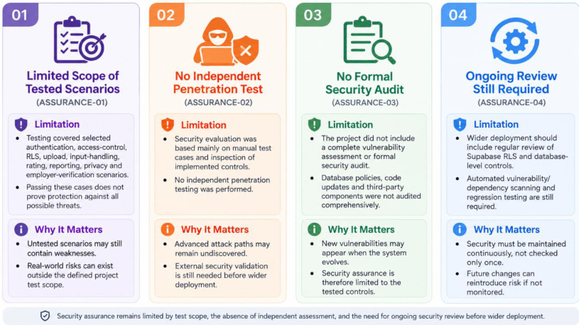

_Figure 5.6: Limitation – Security Assurance Limitations_

### 5.3.2 Testing Methodology Limitations

The UAT forms record sessions on 5, 8, 10 and 15 September 2026. Some technical evidence refers to subsequent database states and retests; the files do not document a repeated UAT round after every later change. Accordingly, the UAT findings describe the recorded sessions rather than proving user acceptance of all later revisions. The Windows UAT forms do not specify browser versions or even a browser name, and the supplied records do not support a complete browser-version/device matrix.

The project author performed Security Testing by manual analysis of the source code, RLS policies and some of the security test scenarios. Some combinations of vulnerabilities or attack patterns may not have been discovered in the 30 Security Testing test cases; the testing was not conducted by any independent penetration-testing team or a full security audit.

Usability Testing based on Nielsen's 10 Usability Heuristics [55] identified four minor or cosmetic issues across three heuristics. This evaluation was done by one evaluator, who was also the author of the project, which is one of the limitations of this evaluation. Multiple evaluators are recommended by Nielsen [55] as it is possible that different evaluators will find different usability problems. Thus, the results are not meant to be definitive.

The UAT (Section 4.3.2) involved five testers who completed 75 functional task executions across the Job Seeker, Employer and Admin roles using designated accounts and test data stored in Supabase. The UAT was able to test the major workflows of a role, but the number of testers was low in relation to the total target user base within the selected underserved towns in Malaysia. In addition, the testers were not chosen through an official sampling process. A larger-scale field test including users of different geographical regions would thus offer more reliable evidence of the usability and acceptance of the platform in realworld contexts.

Figure 5.7 summarises the main limitations of the testing methodology, including the absence of an independent security assessment, the use of a single evaluator for heuristic evaluation, and the limited number of UAT testers compared with the intended user population.

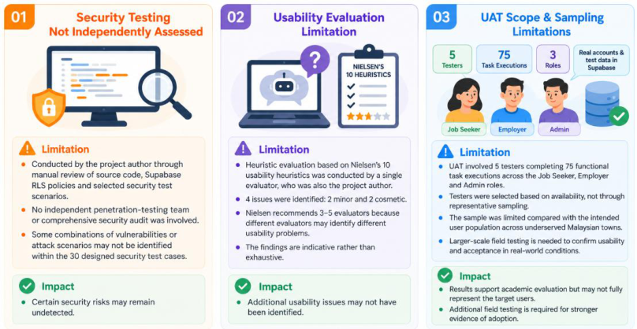

_Figure 5.7: Limitation – Testing Methodology Limitations_

### 5.3.3 Scope Limitations

Two qualifications in the technical test records remain relevant. ST-017 records successful recovery and retry after reconnection, but the submit control remained in the “Submitting...” state after the failed attempt. CT-020 assesses upload and post-save image display and explicitly excludes optional pre-save preview because it was not consistently stable. The formal Compatibility Testing suite directly covers Chrome, Edge and Firefox in the available Windows environment; Safari evidence comes from an iPhone UAT form, while macOS and Linux are not directly verified by CT-018.

The scope and constraints of the project outlined in Section 1.8.1 (Table 1.7) come with a few limitations. EasyEarn was developed over 26 weeks' academic time in two FYP courses, and was carried out by one developer. In the absence of an independent peer review and crossfunctional development team, requirements analysis, system design, development, testing and QA activities were completed. This could have reduced the amount of independent validation and evaluation that was available in the development and evaluation stages.

EasyEarn also uses a static frontend and BaaS architecture. The frontend is deployed using GitHub Pages; Supabase offers authentication, database services, RLS policies and some business logic in the database. There are also some controls on the client side, using JavaScript. This architecture significantly lowers the need for a dedicated application server, but there are still some potential security and privacy concerns that should be addressed before this is rolled out into production, which are discussed in Section 5.3.1.

The scope of implementation and evaluation was similarly limited by the system limitations found in Section 1.8.2 (Table 1.8). An integrated payment gateway and native mobile application were excluded from the implemented system due to the current project scope. As the current messaging function isn't a real-time one, the communication testing has been concentrated on the implemented asynchronous messaging feature and the rule-based chatbot. The accessibility and usability of EasyEarn pages translated using the Google Translate website service were assessed as part of Compatibility Testing, but no formal assessment of translation accuracy and native localisation was carried out.

EasyEarn's key scope limitations are outlined in Figure 5.8, including the 26-week academic time frame, single developer environment, architecture constraints, and areas excluded or limited such as payment gateway integration, native mobile application and limitations of asynchronous messaging.

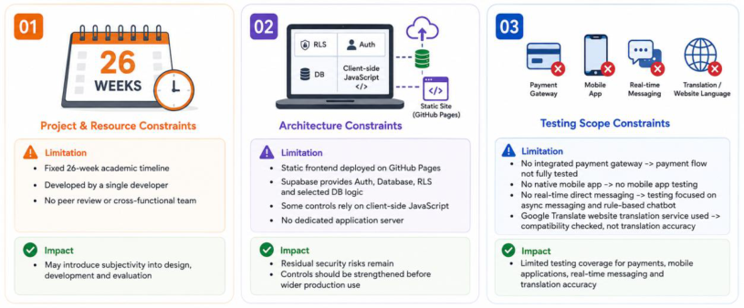

_Figure 5.8: Limitation – Scope Limitations_

## 5.4 Contribution of the Project

This section looks at the other contributions of EasyEarn, in addition to the four project objectives outlined in Section 5.2. The contributions are evaluated from the viewpoints of practical usefulness for Job Seekers and Employers, academic/methodological usefulness as a FYP, and technological usefulness in terms of architecture and technologies used in the system.

## Contribution to Job Seekers and Employers

The following section summarises the practical benefits of the implementation and evaluation results presented in Chapter 4. The evaluation included 34 System Testing test cases, 75 UAT functional task executions, 30 Security Testing test cases and 23 Compatibility Testing test cases, together with the end-user usability questionnaire and heuristic evaluation. The results showed that the main EasyEarn functions worked as expected in the scenarios considered. EasyEarn is thus offering a structured platform that helps to connect Job Seekers and Employers and assists with job searching, application management, hiring, verification, reporting, rating and work-history functions. However, the constraints mentioned in Section 5.3 should be taken into account prior to wider production deployment.

For the Job Seekers, the Work History Dashboard and Auto-Generated Resume also offer a practical benefit, as completed work history, skills and available platform ratings stored in EasyEarn can be used again in a downloadable PDF resume. This will allow Job Seekers to provide a more structured and portable record of their work history.

## Academic and Methodological Contribution

EasyEarn documents a case study that applies a Hybrid Agile-Waterfall approach to a FYP developed by a single developer. The project was a blend of formal planning and documentation and iterative development during the FYP. For the evaluation approach, as mentioned in Chapter 4, it used System Testing, UAT, Nielsen's 10 Usability Heuristics [55], Security Testing and Compatibility Testing. Along with the restrictions listed in Sections 5.3.1 and 5.3.2, this is an example of how several testing methods can be implemented in the context of an academic information systems project, with limitations.

The findings can also be understood in the context of the TAM presented in Section 2.2.2, when interpreting the usability and acceptance of EasyEarn. The UAT and Usability Testing, however, were not formal assessments of constructs of the TAM (such as PEOU or PU). Thus, the outcomes should not be considered a formal TAM assessment.

## Technological Contribution

EasyEarn is an example of a multi-role web application implemented using a BaaS architecture with Supabase, GitHub Pages, Chart.js and jsPDF. Supabase provides authentication, database services and selected database-level business logic through RLS policies, while the frontend is deployed as a static website using GitHub Pages without the need for a dedicated application server.

The various contributions of EasyEarn are summarised in Figure 5.9, which outlines the practical value of EasyEarn to Job Seekers and Employers, the academic and methodological contribution of the Hybrid Agile-Waterfall approach and multiple testing methods, and the technological contribution of the implementation of a multi-role web application with a BaaS architecture.

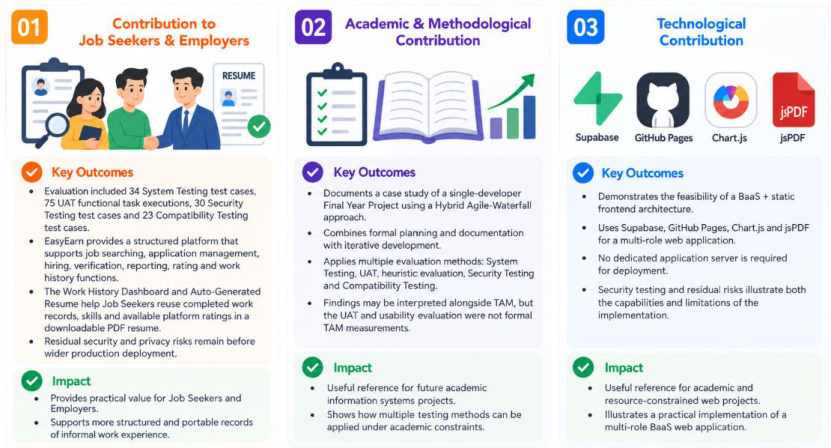

_Figure 5.9: Contribution of the Project_

## 5.5 Future Enhancement

Immediate follow-up work should reset the submission control after network failure and verify retry behaviour in a regression test, assess the pre-save image preview separately if it remains part of the interface, and repeat the affected UAT tasks after security or workflow changes. Compatibility coverage should also be expanded through directly recorded browser versions, Safari test cases and additional operating systems. These actions follow from ST-017, CT-020 and the documented environment and session limits rather than from an assumption that all possible behaviour was tested.

Future security enhancement should focus on strengthening security assurance beyond the test scenarios completed in this project. This can involve independent penetration testing, automated vulnerability and dependency checks, regular audit of Supabase RLS and databaselevel security measures, improved surveillance of security-sensitive activities, and testing for regression issues following system changes that impact security.

The platform might also be expanded with other features. Manual payment confirmation can be minimised by integrating payment, for instance, with DuitNow. The existing asynchronous messaging functionality could be improved with real-time messaging functionality by providing Supabase Realtime or another suitable real-time messaging service. A native iOS or Android application could also be developed to complement the existing responsive web design and provide mobile-specific capabilities such as push notifications and selected offline features.

More end users from the target underserved towns should be involved in future evaluation. More extensive field testing would yield better evidence of usability and acceptance of EasyEarn in the field, since it was tried by just five testers during the UAT. To gain better coverage of potential usability problems, heuristic evaluation could be performed by three or five evaluators, as suggested by Nielsen [55]. Furthermore, the existing Google Translate website translation service may be replaced or expanded with a Google Cloud Translation API, and a formal identity verification service can be introduced into the Employer verification process. These improvements may help bring EasyEarn a step closer to broader production use.

The proposed EasyEarn Future Enhancement Roadmap is summarised in Figure 5.10 and covers continued security assurance through independent security assessment, automated vulnerability and dependency scanning, periodic review of access-control mechanisms and regression testing; feature expansion through payment integration, real-time messaging and a native mobile application; and expanded evaluation through larger-scale UAT, multi-evaluator heuristic testing, formal identity verification and enhanced multilingual support.

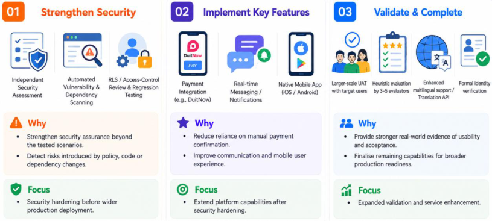

_Figure 5.10: Future Enhancement_

## 5.6 Conclusion

The refreshed evidence supports a scoped conclusion: all 87 named technical cases and 75 UAT task executions are recorded as Pass, while 50 participant ratings produce a mean of 4.84/5 and all five participants select Accept. Recorded observations, excluded preview behaviour, limited environments and the timing of UAT constrain how broadly those outcomes can be generalised.

The EasyEarn project aimed to develop a web-based job-matching platform for Job Seekers and Employers, with particular consideration for underserved towns in Malaysia such as Ipoh, Kangar, Alor Setar, Kuala Terengganu and Kota Bharu. The findings indicate that the four project objectives outlined in Section 1.3 were achieved within the scope of this FYP. Supporting evaluation evidence included 34 System Testing test cases, 75 UAT functional task executions, 30 Security Testing test cases, 23 Compatibility Testing test cases, an end-user usability questionnaire and a heuristic evaluation.

The project also has limitations related to security assurance, testing methodology and implementation scope, as discussed in Section 5.3. These restrictions are a limitation of a system developed in a 26-week academic period by one developer. Nevertheless, EasyEarn provides practical, academic and technological contributions, while the future enhancements presented in Section 5.5 provide directions for further development and evaluation.

In summary, EasyEarn proves that it is possible to build a multi-role job matching web application, based on a static frontend and a BaaS architecture, in a single developer academic project. The functions implemented meet the project's identified needs within the scope of the project in relation to structured job access, platform trust, digital work history and multilingual accessibility. Further security assurance, more extensive user evaluation and productionoriented improvements would be needed for broader deployment.

# References

- [1] World Bank, “Working without borders: The promise and peril of online gig work,” World Bank, 2023. [Online]. Available: https://www.worldbank.org

- [2] International Labour Organisation, “World employment and social outlook 2021: The role of digital labour platforms in transforming the world of work,” International Labour Organisation, 2021. [Online]. Available: https://www.ilo.org

- [3] N. Abd Samad, M. D. Siti Nurazira, and A. Zainudin, “Motivational factors of gig economy participation among Malaysian youth,” _Asian J. Econ. Bus._ , vol. 4, no. 2, pp. 45–58, 2023.

- [4] N. Mohd Hed and N. A. Rosli, “Navigating the gig economy: What drives Malaysian youth?,” _J. Appl. Youth Stud._ , vol. 9, pp. 141–164, 2026, doi: 10.1007/s43151-025-00192z.

- [5] Malay Mail, “MDEC: Gig economy continues to grow despite normalisation of household, business activities,” _Malay Mail_ , Dec. 17, 2023. [Online]. Available: https://www.malaymail.com/news/money/2023/12/17/mdec-gig-economy-continues-togrow-despite-normalisation-of-household-business-activities/107968

- [6] GoGet, “Hire verified, quality part-timers instantly,” GoGet. [Online]. Available: https://goget.my/business/

- [7] Randstad Malaysia, “Talent in Malaysia seeking more financial support from their employers: 2024 employer brand research,” Randstad Malaysia. [Online]. Available: https://www.randstad.com.my/hr-trends/employer-brand/employer-brand-research-jobmobility-2024/

- [8] Royal Malaysia Police, “#BeSmartStayAlert #LetsFightScammerTogether [Posting Pilihan] Scam alert: Statistik kes penipuan tawaran pekerjaan sambilan,” Royal Malaysia Police. [Online]. Available: https://www.rmp.gov.my/newsdetail/2026/01/27/besmartstayalert-letsfightscammertogether-posting-pilihan-scamalert-statistik-kes-penipuan-tawaran-pekerjaan-sambilan

- [9] P. N. E. Nohuddin, Z. AbdKadir, and N. A. Noordin, “A framework for bridging the digital divide: Improving connectivity and opportunities in rural Malaysia,” in _Technology for Societal Transformation_ , 2025, pp. 215–233. doi: 10.1007/978-981-961721-0_14.

- [10] R. Corten, J. Kas, T. Teubner, and M. Arets, “The role of contextual and contentual signals for online trust: Evidence from a crowd work experiment,” _Electron. Mark._ , vol. 33, p. Article 41, 2023, doi: 10.1007/s12525-023-00655-2.

- [11] United Nations Capital Development Fund, “The gig economy and financial health: A snapshot of Malaysia and China,” United Nations Capital Development Fund. [Online]. Available: https://www.uncdf.org/article/6398/the-gig-economy-and-financial-health-asnapshot-of-malaysia-and-china

- [12] M. Graham, I. Hjorth, and V. Lehdonvirta, “Digital labour and development: Impacts of global digital labour platforms and the gig economy on worker livelihoods,” _Transf. Eur. Rev. Labour Res._ , vol. 23, no. 2, pp. 135–162, 2017, doi: 10.1177/1024258916687250.

- [13] Department of Statistics Malaysia, “Micro, small & medium enterprises (MSMEs) performance 2025,” Department of Statistics Malaysia. [Online]. Available: https://www.dosm.gov.my/portal-main/release-content/micro-small--mediumenterprises-msmes-performance-2025

- [14] M. Gusenbauer, S. Könitzer, and M. Kitowski, “A remedy for the liability of smallness? How digital work platforms augment the smallest enterprises,” _Rev. Manag. Sci._ , vol. 19, pp. 2867–2898, 2025, doi: 10.1007/s11846-025-00834-9.

- [15] United Nations Capital Development Fund, “GoGet, a start-up in Malaysia, shares its B40 Challenge experience,” United Nations Capital Development Fund. [Online]. Available: https://www.uncdf.org/article/4628/goget-a-start-up-in-malaysia-shares-its-b40challenge-experience

- [16] A. Saulītis, “Evaluating multilingual digital resources: Machine translation adoption and user satisfaction across six European countries,” vol. 60, no. 1, p. Article 7, 2026, doi: 10.1007/s10579-025-09884-7.

- [17] Ministry of Human Resources Malaysia, “Gig Workers Act 2025 (Act 872),” Ministry of Human Resources Malaysia. [Online]. Available: https://www.mohr.gov.my/aktapekerjagig2025/

- [18] Supabase, “Supabase documentation: Database, authentication, and storage,” Supabase. [Online]. Available: https://supabase.com/docs

- [19] Project Management Institute, _A guide to the project management body of knowledge (PMBOK® guide)_ , 7th ed. Project Management Institute, 2021. [Online]. Available: https://www.pmi.org/pmbok-guide-standards/foundational/pmbok

- [20] I. Sommerville, _Software engineering_ , 10th ed. Pearson Education Limited, 2016. [Online]. Available: https://www.pearson.com/en-gb/subject-catalog/p/SommervilleSoftware-Engineering-Global-Edition-10th-Edition/P200000005464/9781292096148

- [21] R. S. Pressman and B. R. Maxim, _Software engineering: A practitioner’s approach_ , 9th ed. McGraw-Hill Education, 2020.

- [22] Bank Negara Malaysia, “Financial technology enabler group: Payment systems policy,” Bank Negara Malaysia. [Online]. Available: https://www.bnm.gov.my

- [23] Apple Developer Program, “App Store review guidelines,” Apple Inc. [Online]. Available: https://developer.apple.com/app-store/review/guidelines/

- [24] Google Play Console, “Android developer guide: Publish your app.” [Online]. Available: https://developer.android.com/distribute/googleplay

- [25] Google Cloud, “Cloud Translation API documentation,” Google Cloud. [Online]. Available: https://cloud.google.com/translate/docs

- [26] F. D. Davis, “Perceived Usefulness, Perceived Ease of Use, and User Acceptance of Information Technology,” _MIS Q._ , vol. 13, no. 3, pp. 319–340, Sep. 1989, doi: 10.2307/249008.

- [27] J. W. Creswell, _Research design: Qualitative, quantitative, and mixed methods approaches_ , 4th ed. SAGE Publications, 2014. [Online]. Available: https://oscarjaramillo.cl/wp-content/uploads/2015/12/version-nueva-Creswell-2008Research-Design.pdf#page=6.00

- [28] I. Ajzen and M. Fishbein, _Understanding attitudes and predicting social behaviour_ . Prentice-Hall, 1980.

- [29] V. Venkatesh and F. D. Davis, “A Theoretical Extension of the Technology Acceptance Model: Four Longitudinal Field Studies,” _Manag. Sci._ , vol. 46, no. 2, pp. 186–204, Feb. 2000, doi: 10.1287/mnsc.46.2.186.11926.

- [30] V. Venkatesh, M. G. Morris, G. B. Davis, and F. D. Davis, “User Acceptance of Information Technology: Toward A Unified View,” _MIS Q._ , vol. 27, no. 3, pp. 425–478, Sep. 2003, doi: 10.2307/30036540.

- [31] W. R. King and J. He, “A meta-analysis of the technology acceptance model,” _Inf. Manage._ , vol. 43, no. 6, pp. 740–755, Sep. 2006, doi: 10.1016/j.im.2006.05.003.

- [32] I. Park, D. Kim, J. Moon, S. Kim, Y. Kang, and S. Bae, “Searching for New Technology Acceptance Model under Social Context: Analyzing the Determinants of Acceptance of Intelligent Information Technology in Digital Transformation and Implications for the

Requisites of Digital Sustainability,” _Sustainability_ , vol. 14, no. 1, p. 579, Jan. 2022, doi: 10.3390/su14010579.

- [33] A. Schorr, “The Technology Acceptance Model (TAM) and its importance for digitalization research: A review,” _Open Educ. Stud._ , vol. 5, no. 1, 2023, [Online]. Available:

https://www.researchgate.net/publication/372301809_The_Technology_Acceptance_M odel_TAM_and_its_Importance_for_Digitalization_Research_A_Review

- [34] P. A. Pavlou, “Consumer acceptance of electronic commerce: Integrating trust and risk with the technology acceptance model,” _Int. J. Electron. Commer._ , vol. 7, no. 3, pp. 101– 134, 2003.

- [35] I. Constantiou, A. Marton, and V. K. Tuunainen, “Four models of sharing economy platforms,” _MIS Q. Exec._ , vol. 16, no. 4, pp. 236–251, 2017.

- [36] R. P. Bagozzi, “The legacy of the technology acceptance model and a proposal for a paradigm shift,” _J. Assoc. Inf. Syst._ , vol. 8, no. 4, pp. 244–254, 2007.

- [37] D. Gefen, E. Karahanna, and D. W. Straub, “Trust and TAM in online shopping: An integrated model,” _MIS Q._ , vol. 27, no. 1, pp. 51–90, Mar. 2003, doi: 10.2307/30036519.

- [38] X. Hu, “The Gig Economy Revisited: Synthesizing Knowledge and Pioneering Paths Forward,” _J. Knowl. Econ._ , Jul. 2026, doi: 10.1007/s13132-026-03427-3.

- [39] A. Ali _et al._ , “Comparative Analysis on the Legal Status of GIG Workers Between Malaysia and Indonesia,” in _Next-Generation Business Models: The Role of Advanced Technologies in Defining the Future_ , vol. 1572, B. Alareeni and A. Hamdan, Eds., in Lecture Notes in Networks and Systems, vol. 1572. , Cham: Springer Nature Switzerland, 2025, pp. 306–315. doi: 10.1007/978-3-032-00441-3_29.

- [40] Q. Sallehuddin, “Gig Workers Act 2025 comes into force today,” _The Star_ , Mar. 31, 2026. [Online]. Available: https://www.thestar.com.my/news/nation/2026/03/31/gig-workersact-2025-comes-into-force-today

- [41] V. N. Rao, S. Dalal, A. Schwartz, A. Liaqat, D. Calacci, and A. Monroy-Hernández, “FareShare: A Tool for Labor Organizers to Estimate Lost Wages and Contest Arbitrary AI and Algorithmic Deactivations,” _Proc. ACM Hum.-Comput. Interact._ , vol. 10, no. 2, pp. 1–32, Apr. 2026, doi: 10.1145/3788052.

- [42] J. Hsieh _et al._ , “Gig2Gether: Datasharing to Empower, Unify and Demystify Gig Work,” in _Proceedings of the 2025 CHI Conference on Human Factors in Computing Systems_ , Yokohama Japan: ACM, Apr. 2025, pp. 1–25. doi: 10.1145/3706598.3714398.

- [43] J. Hui, M. E. Filipof, S. Lee, S. Corvite, M. Naseem, and T. R. Dillahunt, “‘I Know I Can Do the Job, It’s Just Putting It Down’: Using Personas as a Mirror to Identify Strengths,” in _Proceedings of the 2026 CHI Conference on Human Factors in Computing Systems_ , Barcelona Spain: ACM, Apr. 2026, pp. 1–44. doi: 10.1145/3772318.3790914.

- [44] J. Wang, Q. Gao, and R. Zhang, “Gig economy and its impact on individual employment: an empirical analysis,” _Humanit. Soc. Sci. Commun._ , vol. 12, no. 1, p. 1703, Nov. 2025, doi: 10.1057/s41599-025-05970-x.

- [45] Y. Uchiyama and F. Furuoka, “On-Demand App Gig Work for Youth: A Case in Malaysia,” in _Youth and Employment_ , Singapore: Springer Nature Singapore, 2025, pp. 133–161. doi: 10.1007/978-981-95-3257-5_6.

- [46] M. R. Sarker _et al._ , “Gender differences in job satisfaction among gig workers in Bangladesh,” _Sci. Rep._ , vol. 14, no. 1, p. 17128, Jul. 2024, doi: 10.1038/s41598-02468327-5.

- [47] R. H. L. Hernandez, Q. Song, Y. Kou, and X. Gui, “Making the Gig Economy Infrastructure Work: Gig Drivers’ Adaptive, Algorithmic, and Social Knowledge Practices,” _Comput. Support. Coop. Work CSCW_ , vol. 35, no. 1, p. 1, Mar. 2026, doi: 10.1007/s10606-026-09536-6.

- [48] MDN Web Docs, “HTML, CSS, and JavaScript references,” Mozilla Foundation. [Online]. Available: https://developer.mozilla.org

- [49] J. Hall, “jsPDF: Client-side JavaScript PDF generation for everyone [Software library],” GitHub. [Online]. Available: https://github.com/parallax/jsPDF

- [50] GitHub, “GitHub Pages: Websites for you and your projects,” GitHub. [Online]. Available: https://pages.github.com

- [51] Chart.js, “Chart.js documentation.” [Online]. Available: https://www.chartjs.org/docs/latest/

- [52] DeepL, “DeepL translator: Supported languages.” [Online]. Available: https://www.deepl.com/en/languages

- [53] Google, “Google Translate.” [Online]. Available: https://translate.google.com

- [54] Canva, “Canva: Visual communication platform.” [Online]. Available: https://www.canva.com

- [55] J. Nielsen, _Usability engineering_ . Academic Press, 1993.

- [56] JobStreet Malaysia, “Part Time Jobs in Malaysia,” JobStreet by SEEK. Accessed: Sep. 09, 2026. [Online]. Available: https://my.jobstreet.com/jobs/in-Malaysia/part-time

- [57] RiceBowl Malaysia, “Get A Job Faster,” Google Play. Accessed: Sep. 09, 2026. [Online]. Available: https://play.google.com/store/apps/details?id=my.ricebowl.applicant

- [58] JobStreet Malaysia, “Job Seeker Security Hub,” JobStreet by SEEK. Accessed: Sep. 09, 2026. [Online]. Available: https://my.jobstreet.com/security-hub

- [59] JobStreet Malaysia, “Company Reviews Community Guidelines,” JobStreet Help Centre. Accessed: Sep. 09, 2026. [Online]. Available: https://help.my.jobstreet.com/article/Company-reviews-community-guidelines-asia

- [60] RiceBowl Malaysia, “RiceBowl Safety Centre,” RiceBowl Malaysia. Accessed: Sep. 09, 2026. [Online]. Available: https://www.ricebowl.my/zh/career-advice/safety-centre/

- [61] TROOPERS, “About Troopers.” [Online]. Available: https://www.troopers.com.my

- [62] Fiverr, “How Fiverr works for clients,” Fiverr Help Center. Accessed: Sep. 09, 2026. [Online]. Available: https://help.fiverr.com/hc/en-us/articles/360010558038-HowFiverr-works-for-clients

- [63] Upwork, “Intro to Upwork,” Upwork Help. [Online]. Available: https://support.upwork.com/hc/en-us/articles/34954643219987-Intro-to-Upwork

- [64] Upwork, “How to start hiring on Upwork,” Upwork Help. Accessed: Sep. 09, 2026. [Online]. Available: https://support.upwork.com/hc/en-us/articles/211063398-How-tostart-hiring-on-Upwork

- [65] Taskrabbit, “Taskrabbit: Same Day Handyman, Moving & Mounting Services,” Taskrabbit. [Online]. Available: https://www.taskrabbit.com/

- [66] Taskrabbit, “Services offered,” Taskrabbit. [Online]. Available: https://www.taskrabbit.com/services

- [67] Taskrabbit Support, “How Do I Hire a Tasker?,” Taskrabbit Support. [Online]. Available: https://support.taskrabbit.com/hc/en-us/articles/46260422073755-How-Do-I-Hire-aTasker

- [68] V. Venkatesh and H. Bala, “Technology Acceptance Model 3 and a Research Agenda on Interventions,” _Decis. Sci._ , vol. 39, no. 2, pp. 273–315, May 2008, doi: 10.1111/j.15405915.2008.00192.x.

- [69] M. Saunders, P. Lewis, and A. Thornhill, _Research methods for business students_ , 8th ed. Pearson, 2019. [Online]. Available: https://www.pearson.com/en-gb/subjectcatalog/p/research-methods-for-business-students/P200000005358/9781292208800

- [70] I. Etikan, S. A. Musa, and R. S. Alkassim, “Comparison of Convenience Sampling and Purposive Sampling,” _Am. J. Theor. Appl. Stat._ , vol. 5, no. 1, pp. 1–4, 2016, doi: 10.11648/j.ajtas.20160501.11.

- [71] W. W. Royce, “Managing the development of large software systems,” in _Proceedings of IEEE WESCON_ , 1970, pp. 1–9. [Online]. Available: https://www.praxisframework.org/files/royce1970.pdf

- [72] K. Beck _et al._ , “Manifesto for agile software development.” [Online]. Available: https://agilemanifesto.org/

- [73] K. Schwaber and J. Sutherland, “The Scrum guide: The definitive guide to Scrum—The rules of the game.” [Online]. Available: https://www.scrumguides.org/scrum-guide.html

- [74] B. Boehm and R. Turner, _Balancing agility and discipline: A guide for the perplexed_ . Addison-Wesley, 2004. [Online]. Available: https://dl.acm.org/doi/10.5555/861419

- [75] International Software Testing Qualifications Board, “ISTQB glossary.” [Online]. Available: https://glossary.istqb.org

- [76] _Personal Data Protection Act 2010 (Act 709)_ . 2010. [Online]. Available: https://www.agc.gov.my/

- [77] GitHub, “GitHub Pages documentation.” [Online]. Available: https://docs.github.com/en/pages

- [78] Open Web Application Security Project Foundation, “OWASP top ten.” [Online]. Available: https://owasp.org/www-project-top-ten/

- [79] J. Nielsen, “Usability 101: Introduction to usability,” Nielsen Norman Group. [Online]. Available: https://www.nngroup.com/articles/usability-101-introduction-to-usability/

- [80] _Computer Crimes Act 1997 (Act 563)_ . 1997. [Online]. Available: https://www.agc.gov.my/

- [81] _Consumer Protection Act 1999 (Act 599)_ . 1999. [Online]. Available: https://www.agc.gov.my/

- [82] _Employment Act 1955 (Act 265)_ . 1955. [Online]. Available: https://www.agc.gov.my/

- [83] D. Flanagan, _JavaScript: The definitive guide_ , 7th ed. O’Reilly Media, 2020. [Online]. Available: https://www.oreilly.com/library/view/-/9781491952016

- [84] M. Fowler, _Refactoring: Improving the design of existing code_ , 2nd ed. Addison-Wesley, 2018.

- [85] D. F. Ferraiolo, R. Sandhu, S. Gavrila, D. R. Kuhn, and R. Chandramouli, “Proposed NIST standard for role-based access control,” _ACM Trans. Inf. Syst. Secur._ , vol. 4, no. 3, pp. 224–274, Aug. 2001, doi: 10.1145/501978.501980.

- [86] Eurofound, “Employment and working conditions of selected types of platform work,” Publications Office of the European Union, 2018. [Online]. Available: https://www.eurofound.europa.eu/publications/report/2018/employment-and-workingconditions-of-selected-types-of-platform-work

- [87] H. Shum, X. He, and D. Li, “From Eliza to XiaoIce: challenges and opportunities with social chatbots,” _Front. Inf. Technol. Electron. Eng._ , vol. 19, no. 1, pp. 10–26, Jan. 2018, doi: 10.1631/FITEE.1700826.

- [88] C. J. Date, _Database Design and Relational Theory: Normal Forms and All That Jazz_ . Berkeley, CA: Apress, 2019. doi: 10.1007/978-1-4842-5540-7.

- [89] P. Leach, M. Mealling, and R. Salz, “A universally unique identifier (UUID) URN namespace,” Internet Engineering Task Force, RFC 4122, 2005. [Online]. Available: https://www.rfc-editor.org/rfc/rfc4122

- [90] J. Rumbaugh, I. Jacobson, and G. Booch, _The Unified Modelling Language reference manual_ , 2nd ed. Addison-Wesley, 2004. [Online]. Available: https://www.oreilly.com/library/view/unified-modeling-language/0321245628/

- [91] J. J. Garrett, _The elements of user experience: User-centered design for the web and beyond_ , 2nd ed. New Riders, 2011.

- [92] Lucide Contributors, “Lucide icons documentation,” Lucide. [Online]. Available: https://lucide.dev

- [93] N. von Hertzen, “html2canvas: Screenshots with JavaScript [Software library],” GitHub. [Online]. Available: https://github.com/niklasvh/html2canvas

- [94] M. Jones, J. Bradley, and N. Sakimura, “JSON Web Token (JWT),” Internet Engineering Task Force, RFC 7519, 2015. [Online]. Available: https://www.rfc-editor.org/rfc/rfc7519

- [95] PostgREST, “PostgREST documentation,” PostgREST documentation. [Online]. Available: https://postgrest.org

- [96] International Organization for Standardization, _ISO/IEC/IEEE 29119-1:2022—Software and systems engineering—Software testing—Part 1: General concepts_ , ISO/IEC/IEEE 29119-1:2022, 2022. [Online]. Available: https://www.iso.org/standard/81291.html

# Appendix

## Appendix 1: Google Form

This appendix shows the Google Form used for the EasyEarn User Requirement Survey. Information on users' requirements and extra feedback was gathered using the questionnaire, which also asked for respondents' background data, their job searches, and their experiences of being hired or not.

<u>https://forms.gle/28utP2sdZZ9MFvBbA</u>

## Appendix 2: EasyEarn Job Matching Portal

This appendix provides a link to the deployed EasyEarn Job Matching Portal for direct access to the implemented system.

<u>https://peiying040830.github.io/easyearn/</u>

## Appendix 3: System Testing

This appendix provides the detailed System Testing test cases and supporting evidence that are not presented in Section 4.3.1. System Testing was conducted across seven categories: E2E Workflow, Integration, Performance, Recovery, Business Logic, Reporting and Compliance. A total of 34 System Testing test cases (ST-001 to ST-034) were executed, and all 34 achieved a Pass result in the final testing round. A representative case from each of these categories is included in Section 4.3.1, and the other test cases and evidence are grouped by category in Appendix 3.1 to Appendix 3.7.

### Appendix 3.1 E2E Workflow

This appendix provides the remaining E2E Workflow System Testing test cases that are not presented in Section 4.3.1.1. These test cases provide supporting evidence for complete EasyEarn workflows involving the Job Seeker, Employer and Admin roles. The representative test case, ST-003: Hire-to-Completion Flow, is presented in Section 4.3.1.1, while the additional E2E Workflow test cases are provided below.

##### ST-001: Job Seeker Registration to Application

**Recorded result: Pass.**

A new job seeker account was successfully registered and logged in. Profile details including location, skills and availability were saved and retained after reopening the page. The SugarShine job application was submitted successfully and appeared under My Applications with Pending status, which remained after refreshing the page.

**Expected result:** Account is created with role 'seeker'; profile saves correctly; job application is recorded and visible under Applications with status 'Pending'.

**Test procedure:**

1. Open Register page and select 'Job Seeker' role.
2. Submit registration form with valid email/password.
3. Log in with the new account.
4. Complete profile (skills, location, availability).
5. Browse Jobs page and view a listing.
6. Submit a job application.

**Test input:** Email: bxg123@gmail.com Password: PEIying@0830

**Recorded comments:** The complete job seeker workflow functioned as expected. Registration, login, profile update, job browsing and job application were completed successfully without errors, and the submitted application remained visible with Pending status after refresh.

Figure A3.1 retains the original screenshot associated with this case. The result and comments above follow the latest testing workbook.

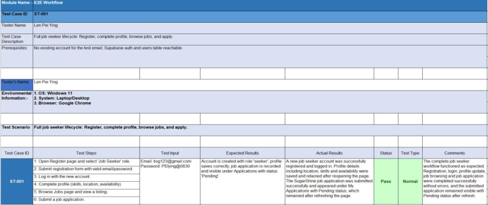

_Figure A3.1: Job Seeker Registration to Application_

##### ST-002: Employer Registration to Applicant Review

**Recorded result: Pass.**

A new employer job listing was successfully created and initially displayed as Pending Review. The administrator approved the listing, after which it became visible to Job Seekers. A Job Seeker successfully submitted an application, and the Employer received a new application notification. The Employer reviewed the application, and the updated Reviewed status was correctly reflected on the Job Seeker's My Applications page.

**Expected result:** Employer registration succeeds with the valid employer code. The new job listing is created with Pending Review status. After admin approval, the job becomes available to job seekers. A seeker can apply, and the employer can update the application status, which remains visible to the seeker after refresh.

**Test procedure:**

1. Open Register page and select 'Employer' role.
2. Enter employer secure code and submit registration.
3. Log in and open employer dashboard.
4. Post a new job listing with pay rate and openings.
5. Wait for a seeker application to arrive.
6. Open Applicants page and update application status.

**Test input:** Employer Code: EASYEARN-EMPLOYER-2026 Job: Part-time Barista, RM 12/hr, 2 openings

**Recorded comments:** The employer job posting, admin approval, job seeker application and application status update workflow were completed successfully without errors.

Figure A3.2 retains the original screenshot associated with this case. The result and comments above follow the latest testing workbook.

_Figure A3.2: Employer Registration to Applicant Review_

##### ST-004: Admin Moderation Lifecycle

**Recorded result: Pass.**

The suspicious job report was successfully submitted and appeared on the Admin Reports page. The Admin reviewed the report, removed the related job listing, and resolved the report successfully. The report status changed to Resolved, and the removed job no longer appeared in the Job Seeker active Jobs listing.

**Expected result:** The reported job is removed by the Admin and no longer appears in the active Job Seeker Jobs listing. The related report changes to Resolved and an admin note with the update timestamp is saved.

**Test procedure:**

1. Job Seeker submits a report for an active job listing.
2. Admin logs in and opens the Reports page.
3. Admin reviews the reported job information.
4. Admin opens Jobs, finds the reported listing, and clicks Remove.
5. Admin returns to Reports and clicks Resolve for the related report.
6. Verify the report is Resolved and the removed job is no longer visible to Job Seekers.

**Test input:** Report Type: Suspicious Listing
Reported Job: [ST-004 TEST] Suspicious Part-Time Job
Admin Action: Remove
Report Resolution: Resolve

**Recorded comments:** The admin moderation and report resolution workflow functioned as expected.

Figure A3.3 retains the original screenshot associated with this case. The result and comments above follow the latest testing workbook.

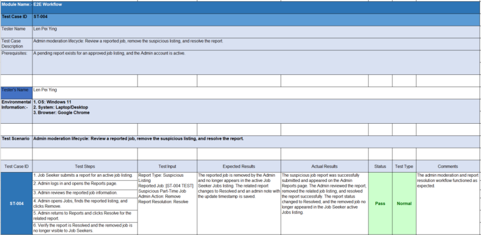

_Figure A3.3: Admin Moderation Lifecycle_

##### ST-005: Payment Lifecycle

**Recorded result: Pass.**

The Employer successfully confirmed work and payment for the accepted application, and the application moved to Completion Pending. The Job Seeker then confirmed payment receipt, after which the application changed to Completed. The completed job was also recorded in Work History with the corresponding earnings.

**Expected result:** Employer payment confirmation is recorded first and the application moves to Completion Pending. After the Job Seeker confirms receipt, payment status becomes confirmed, the application becomes Completed, and the completed job is saved to Work History.

**Test procedure:**

1. Employer opens the accepted application and clicks Confirm Work / Payment.
2. Enter final earnings greater than RM 0 and confirm.
3. Verify the application moves to Completion Pending and employer payment confirmation is recorded.
4. Job Seeker opens Applications and clicks Confirm Payment Received.
5. Verify the payment becomes confirmed and the application becomes Completed.
6. Verify the completed job is saved to Work History with the recorded earnings.

**Test input:** Application ID: System-generated
Payment Method: DuitNow / Offline
Final Earnings: Valid amount greater than RM 0

**Recorded comments:** The employer payment confirmation and job seeker receipt confirmation workflow functioned as expected.

Figure A3.4 retains the original screenshot associated with this case. The result and comments above follow the latest testing workbook.

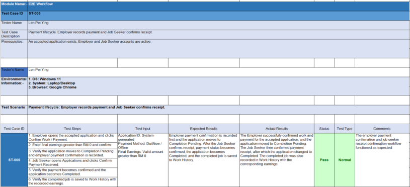

_Figure A3.4: Payment Lifecycle_

##### ST-006: Payment Dispute and Resolution

**Recorded result: Pass.**

The Job Seeker successfully submitted a payment dispute, and the report appeared on the Admin Reports page with the correct application and payment context. The Admin reviewed and resolved the dispute successfully. The dispute status changed to Resolved while the related payment and application information remained correctly linked.

**Expected result:** The payment dispute is linked to the correct application/payment, becomes visible to Admin for review, and can be resolved with an admin resolution note without losing the original payment context.

**Test procedure:**

1. Job Seeker opens the related application and submits a payment issue report.
2. Enter the payment dispute description and submit the report.
3. Admin opens Reports and reviews the payment dispute with the related application/payment context.
4. Admin records a resolution and resolves the payment dispute.
5. Verify the dispute is marked Resolved and the payment/application reference remains correct.

**Test input:** Report Type: Payment Dispute
Description: Payment issue reported for System Testing ST-006
Application ID: System-generated

**Recorded comments:** The payment dispute and admin resolution workflow functioned as expected.

Figure A3.5 retains the original screenshot associated with this case. The result and comments above follow the latest testing workbook.

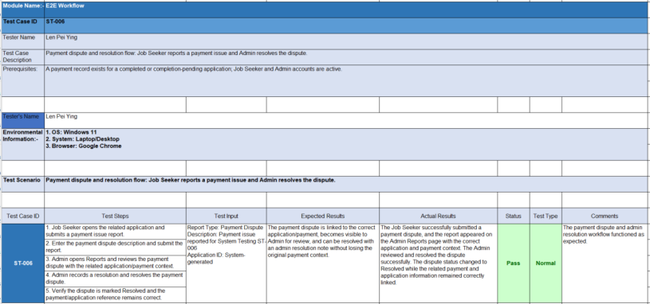

_Figure A3.5: Payment Dispute and Resolution_

### Appendix 3.2 Integration

This appendix provides the remaining Integration System Testing test cases that are not presented in Section 4.3.1.2. These test cases provide supporting evidence for interactions among the EasyEarn frontend, Supabase database, database triggers, notifications, Employer verification workflow, asynchronous messaging, chatbot knowledge base and saved-job functions. The representative test case, ST-007: Application CRUD and openings_count Trigger, is presented in Section 4.3.1.2, while the additional Integration test cases are provided below.

##### ST-008: New-Application Notification Trigger

**Recorded result: Pass.**

A new application notification was successfully created for the correct Employer after the Job Seeker submitted an application. The notification appeared in the Employer notification panel, and its unread status updated correctly after it was viewed or marked as read.

**Expected result:** Notification of type 'application_update' is created for the job's employer_id only; marking as read updates is_read = true.

**Test procedure:**

1. Seeker submits a job application.
2. Verify a row is inserted into notifications for the job's employer.
3. Employer dashboard polls and displays the notification badge.
4. Employer opens the notification; verify is_read updates.

**Test input:** Job ID + Employer ID: System-generated

**Recorded comments:** The new application notification was delivered to the correct Employer and the read status updated as expected.

Figure A3.6 retains the original screenshot associated with this case. The result and comments above follow the latest testing workbook.

_Figure A3.6: New-application Notification Trigger_

##### ST-009: Employer Verification Workflow

**Recorded result: Pass.**

The Employer successfully submitted the verification package with the required business information and documents. The verification request appeared on the Admin Verifications page and was approved successfully. The Employer verification status changed to Approved, and the verified badge was displayed correctly on the relevant Employer and job views.

**Expected result:** Verification fields persist with status 'pending'; after admin approval, is_verified becomes true and badge appears across the platform.

**Test procedure:**

1. Employer fills SSM number, business type, and address.
2. Employer uploads registration and contact documents.
3. Employer submits verification request.
4. Admin opens Verifications page and reviews documents.
5. Admin approves the request.
6. Verify employer profile now shows verified badge.

**Test input:** SSM Number: 202601234567

**Recorded comments:** The employer verification submission, admin approval and verified badge workflow functioned as expected.

Figure A3.7 retains the original screenshot associated with this case. The result and comments above follow the latest testing workbook.

_Figure A3.7: Employer Verification Workflow_

##### ST-010: Messaging Integration

**Recorded result: Pass.**

The Employer successfully sent a message to the Job Seeker, and the message appeared in the correct conversation thread. The Job Seeker received an unread message indicator, which cleared after the conversation was opened. A reply from the Job Seeker was also successfully displayed on the Employer side, and the conversation history remained available.

**Expected result:** Messages persist per job/counterpart pair; thread list shows latest message and unread indicator; opening a thread clears the unread state.

**Test procedure:**

1. Seeker opens Messages and starts a thread tied to the job application.
2. Seeker sends a message.
3. Employer opens Messages and views the thread.
4. Employer replies.
5. Verify thread is marked read for the recipient.

**Test input:** Job ID + counterpart IDs: System-generated

**Recorded comments:** The messaging, unread indicator and conversation synchronization functioned as expected.

Figure A3.8 retains the original screenshot associated with this case. The result and comments above follow the latest testing workbook.

_Figure A3.8: Messaging Integration_

##### ST-011: Chatbot Knowledge Base Integration

**Recorded result: Pass.**

The chatbot successfully returned the expected knowledge-base response for the recognised query "How do I apply for a job?". For the unrecognised query "What is the weather on Mars today?", the chatbot returned a fallback support response without error. The recognised and unrecognised query paths both functioned correctly.

**Expected result:** Recognised queries return the seeded answer from chatbot_knowledge; unrecognised queries return the fallback message; every interaction is recorded in chatbot_logs with a matched flag.

**Test procedure:**

1. Open floating chatbot widget on any page.
2. Type a known query (e.g. 'how to apply for a job').
3. Verify the matched answer is displayed.
4. Type an unrecognised query.
5. Verify fallback reply is shown.
6. Verify both interactions are logged.

**Test input:** Query 1: 'how to apply for a job' Query 2: 'asdkjqwe123'

**Recorded comments:** The chatbot knowledge matching and fallback response functioned as expected.

Figure A3.9 retains the original screenshot associated with this case. The result and comments above follow the latest testing workbook.

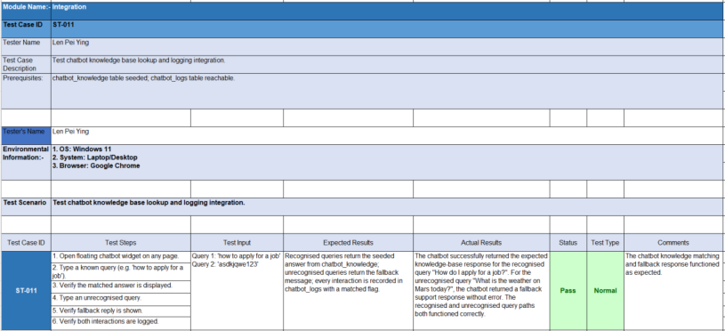

_Figure A3.9: Chatbot Knowledge Base Integration_

##### ST-012: Saved Jobs Integration

**Recorded result: Pass.**

The Job Seeker successfully saved a job and the Saved Jobs count increased accordingly. The saved job appeared correctly in the Saved Jobs list. After the Job Seeker cancelled/removed the saved job, it disappeared from the list and the Saved Jobs count decreased accordingly.

**Expected result:** saved_jobs rows are created/removed in sync with the bookmark toggle; Saved Jobs page metrics (total/live/applied) reconcile correctly against current job and application state.

**Test procedure:**

1. Seeker clicks the bookmark icon on a job card to save it.
2. Open Saved Jobs page and verify the job appears.
3. Click unsave on the same job.
4. Verify the job disappears from Saved Jobs.
5. Save a job, then apply to it, and verify it shows under both Saved and Applied counts.

**Test input:** Job ID: System-generated

**Recorded comments:** The Saved Jobs list and count updated correctly after saving and removing a job.

Figure A3.10 retains the original screenshot associated with this case. The result and comments above follow the latest testing workbook.

_Figure A3.10: Saved Jobs Integration_

### Appendix 3.3 Performance

This appendix provides the remaining Performance System Testing test cases that are not presented in Section 4.3.1.3. The tests evaluated selected time-sensitive and data-processing operations, including Jobs page loading and filtering, PDF resume generation and Admin Analytics rendering. The representative test case, ST-014: Concurrent Application Race Condition, is presented in Section 4.3.1.3, while the additional Performance test cases are provided below.

##### ST-013: Jobs Page Load and Filter Performance

**Recorded result: Pass.**

The Job Seeker Jobs page loaded successfully without visible freezing. Chrome DevTools recorded 79 requests, 3.0 MB transferred, 3.8 MB resources, and a total finish time of 1.11 seconds. Applying the job filters updated the displayed results quickly without noticeable delay or UI freezing.

**Expected result:** Job list renders in under 2 seconds; filtering and match-score recalculation complete in under 1 second without UI freeze.

**Test procedure:**

1. Load Jobs page with no filters applied.
2. Measure initial render time for the job list.
3. Apply category + location filters simultaneously.
4. Measure re-filter response time.
5. Scroll through paginated results.

**Test input:** 300 job listings, 50 seeker skill profiles

**Recorded comments:** The Jobs page loaded within the expected time and the filters responded quickly without visible lag.

Figure A3.11 retains the original screenshot associated with this case. The result and comments above follow the latest testing workbook.

_Figure A3.11: Jobs Page Load and Filter Performance_

##### ST-015: PDF Resume Generation Performance

**Recorded result: Pass.**

The PDF resume was generated successfully in approximately 2.56 seconds, which was within the expected 3-second target. After opening the generated PDF, the profile, skills, education and work history content displayed correctly without clipped text, missing content or layout problems.

**Expected result:** PDF generates within 3 seconds for typical profile length and renders one A4 page (or correctly paginated multi-page) without clipped content.

**Test procedure:**

1. Open Resume page with complete profile data.
2. Click 'Download PDF'.
3. Measure time to generate and trigger download.
4. Open resulting PDF and verify layout/text are not cut off.

**Test input:** Resume with 5 work history entries, skill tags, education

**Recorded comments:** The PDF resume generated within the expected time and displayed correctly without content being cut off.

Figure A3.12 retains the original screenshot associated with this case. The result and comments above follow the latest testing workbook.

_Figure A3.12: PDF Resume Generation Performance_

##### ST-016: Admin Analytics Dashboard Render Time

**Recorded result: Pass.**

The Admin Analytics Dashboard loaded successfully with 75 requests, 5.0 MB transferred and 6.1 MB of resources. Chrome DevTools recorded a total finish time of 1.86 seconds. The summary cards and Chart.js visualisations displayed correctly without noticeable UI freezing or rendering problems.

**Expected result:** Dashboard summary cards render within 2 seconds and charts finish drawing within 3 seconds on a cold load, with no noticeable UI freeze while aggregating counts client-side.

**Test procedure:**

1. Log in as Admin and navigate to the Analytics page.
2. Measure time until summary cards (users, listings, matches) render.
3. Measure time until Chart.js graphs finish drawing.
4. Repeat with browser cache cleared to test a cold load.

**Test input:** Seed: 500 applications, 80 job listings, 60 users

**Recorded comments:** The Admin Analytics Dashboard rendered within the expected time and displayed all cards and charts correctly.

Figure A3.13 retains the original screenshot associated with this case. The result and comments above follow the latest testing workbook.

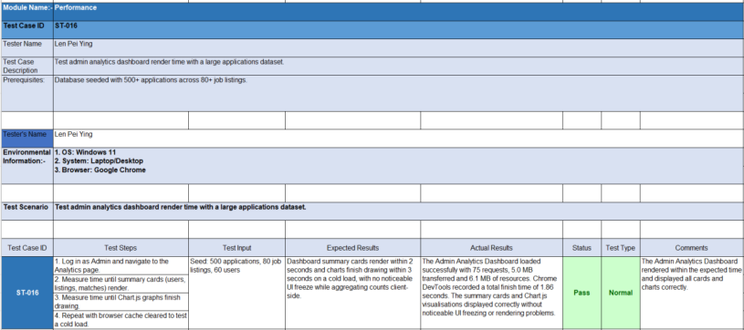

_Figure A3.13: Admin Analytics Dashboard Render Time_

### Appendix 3.4 Recovery

This appendix provides the remaining Recovery System Testing test cases that are not presented in Section 4.3.1.4. The tests verified the stability and consistency of data state in case of loss of connectivity, interruption of a session and repeated payment operations. The representative test case, ST-019: Failed Application Submission Rollback, is presented in Section 4.3.1.4, while the additional Recovery test cases are provided below.

##### ST-017: Supabase Connectivity Loss Handling

**Recorded result: Pass.**

When network connectivity was disabled, the application submission failed and the system displayed the message "Unable to submit application. Please try again." The page did not crash or become blank. The submit control remained showing "Submitting..." after the failed attempt. After network connectivity was restored, the Job Seeker retried the application and it was submitted successfully.

**Expected result:** Failed Supabase calls are caught and surfaced as a user-facing error; no unhandled exception or blank page; retry succeeds once connectivity returns.

**Test procedure:**

1. Load Jobs page successfully online.
2. Disable network connectivity (simulate offline).
3. Attempt to submit a job application.
4. Verify a clear error is shown instead of a silent failure or crash.
5. Restore connectivity and retry the action.

**Test input:** Network state: Offline → Online

**Recorded comments:** Connectivity loss was handled with a clear error and retry succeeded; the submit button remained in the Submitting state after the failed attempt.

Figure A3.14 retains the original screenshot associated with this case. The result and comments above follow the latest testing workbook.

The Pass status applies to error handling and successful retry after reconnection. It does not establish that the submit control recovered correctly: the recorded “Submitting...” state remains a user-interface limitation of this test.

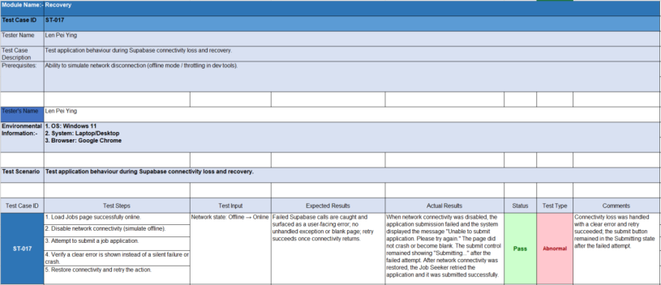

_Figure A3.14: Supabase Connectivity Loss Handling_

##### ST-018: Session Expiry and Re-authentication

**Recorded result: Pass.**

After the stored authentication session was cleared, the protected Job Seeker page no longer remained accessible and the system redirected the user to the Login page. No protected application data was shown without an active session. After logging in again with valid credentials, the user was able to access the dashboard and Applications page normally.

**Expected result:** Expired sessions are detected and the user is redirected to the Login page; no protected data is shown to an unauthenticated request.

**Test procedure:**

1. Log in successfully and navigate to dashboard.
2. Force-expire the Supabase session token.
3. Attempt a protected action (e.g. view Applications).
4. Verify the user is redirected to Login rather than seeing broken/empty data.
5. Log in again and verify the previous destination or dashboard loads correctly.

**Test input:** Expired/cleared auth token

**Recorded comments:** Expired or cleared sessions were handled correctly, and re-authentication restored normal access.

Figure A3.15 retains the original screenshot associated with this case. The result and comments above follow the latest testing workbook.

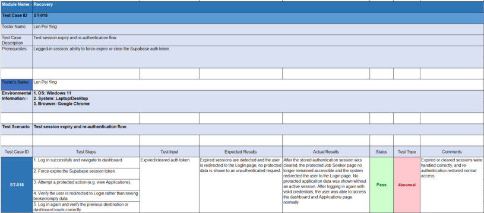

_Figure A3.15: Session Expiry and Re-authentication_

##### ST-020: Duplicate Payment Prevention on Retry

**Recorded result: Pass.**

The Employer successfully confirmed payment for the application. After the first successful confirmation, the payment button became locked and could not be submitted again. A database query confirmed that only one payment record existed for application 112ba3b2-819e-4009-a948-525e136ebba1, with an amount of RM200. No duplicate payment record was created.

**Expected result:** After the first successful payment confirmation, the payment action is prevented from being submitted again through the UI. Only one payment record should exist for the application with the correct payment amount.

**Test procedure:**

1. Employer confirms work/payment for an accepted application.
2. Verify the payment action becomes locked/disabled after the first successful confirmation.
3. Query the payments table for the same application_id.
4. Verify only one payment row exists with the correct amount.

**Test input:** Application ID: 112ba3b2-819e-4009-a948-525e136ebba1
Payment Amount: RM200

**Recorded comments:** Duplicate payment submission was prevented, and only one RM200 payment record existed for the application.

Figure A3.16 retains the original screenshot associated with this case. The result and comments above follow the latest testing workbook.

_Figure A3.16: Duplicate Payment Prevention on Retry_

### Appendix 3.5 Business Logic

This appendix provides the remaining Business Logic System Testing test cases that are not presented in Section 4.3.1.5. The tests were designed to assess important EasyEarn business rules such as Job Match calculations, location-distance bonuses, rating eligibility, moderation classification and the action of the Employer Verification Badge. The below Business Logic test cases are presented in Section 4.3.1.5 as an additional test case to ST-023: Application Status Transition Constraints.

##### ST-021: Match Score Calculation Accuracy

**Recorded result: Pass.**

For the Cashier job listing, the Job Seeker profile matched 4 of 5 required skills. The system correctly displayed an 80% Match score, with Cash handling, POS systems, Customer service and Friendly communication listed as matched skills, while Attention to detail was shown under Skills To Build. After all Job Seeker skills were removed and the Jobs page was refreshed, the match badge changed to "New" instead of displaying 0%.

**Expected result:** Match percent = (number of job-required skills the seeker has) / (total job-required skills) × 100, i.e. 2/3 ≈ 67%, with no skills resulting in a 'New' badge rather than 0%.

**Test procedure:**

1. Set seeker skills to ['cashier','customer service','english'].
2. Set job required skills to ['cashier','english','mandarin'].
3. View the job card match badge on Jobs page.
4. Verify the displayed match percentage equals matched/required skill ratio.
5. Change seeker skills to an empty list and verify badge shows 'New' instead of a percentage.

**Test input:** Seeker skills: cashier, customer service, english Job skills: cashier, english, mandarin

**Recorded comments:** The required-skill match ratio and the no-skills "New" badge were displayed correctly.

Figure A3.17 retains the original screenshot associated with this case. The result and comments above follow the latest testing workbook.

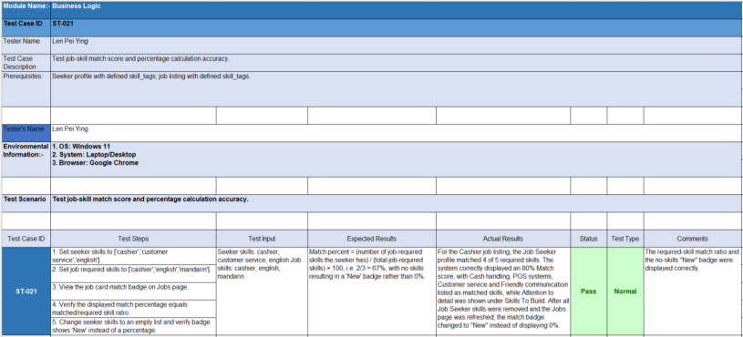

_Figure A3.17: Match Score Calculation Accuracy_

##### ST-022: Location-Distance Bonus and Match Cap

**Recorded result: Pass.**

With full skill matching (5 of 5 required skills), the same job displayed an 85% Match score when no location distance bonus was available. After Near Me was enabled, the job was shown at 2.9 km away and the system applied the nearby location boost. The final match score increased to 99%, correctly respecting the maximum cap for location-aware matching.

**Expected result:** Jobs within 2km get up to +15% bonus (capped at 99% total); jobs beyond 25km get +0% bonus; jobs with unknown distance are capped at 85% even at 100% skill match.

**Test procedure:**

1. View match percent for a job 1.5km away with full skill match.
2. View match percent for a job 30km away with full skill match.
3. View match percent for a job with unknown distance (no GPS) and full skill match.
4. Verify the percentage cap differs between location-known and location-unknown cases.

**Test input:** Distances: 1.5km, 30km, unknown Skill match: 100%

**Recorded comments:** The location bonus and match-score cap were applied correctly for the tested nearby and no-location cases.

Figure A3.18 retains the original screenshot associated with this case. The result and comments above follow the latest testing workbook.

_Figure A3.18: Location-distance Bonus and Match Cap_

##### ST-024: Bidirectional Rating Eligibility

**Recorded result: Pass.**

For an application that had not reached Completed status, the rating action was not available to the user. For a Completed application, the rating had already been submitted successfully during the earlier end-to-end workflow, and the interface displayed the application as Rated with the rating control no longer available for a second submission.

**Expected result:** Rating UI/flow is only available for completed applications; resubmitting for the same application updates rather than duplicates the existing rating.

**Test procedure:**

1. Attempt to submit a rating for the 'pending' application.
2. Verify the rating option is unavailable/blocked.
3. Submit a rating for the 'completed' application.
4. Attempt to submit a second rating for the same completed application.
5. Verify duplicate rating is prevented or correctly handled.

**Test input:** Application A: status pending Application B: status completed

**Recorded comments:** Ratings were only available after job completion, and the UI prevented a duplicate rating submission.

Figure A3.19 retains the original screenshot associated with this case. The result and comments above follow the latest testing workbook.

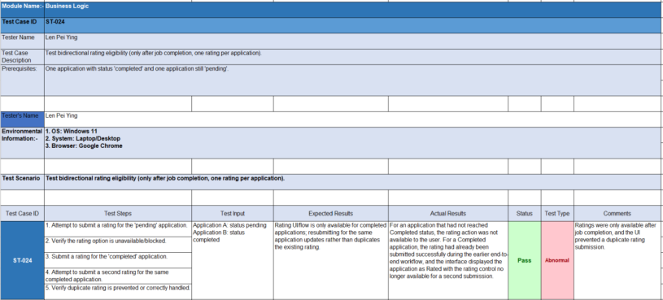

_Figure A3.19: Bidirectional Rating Eligibility_

##### ST-025: Admin Moderation Queue Classification

**Recorded result: Pass.**

On the Admin Jobs page, the Pending Review, Flagged and Removed moderation filters displayed listings under the correct status categories. Switching between the filters changed the visible job queue accordingly, and the displayed moderation counts were consistent with the listings shown for each category.

**Expected result:** Each moderation status label (Pending Review, Approved, Flagged, Removed) maps to the correct underlying job_listings.status value, and switching filters changes both the visible queue and the metric counts consistently.

**Test procedure:**

1. Open Admin Jobs page with the default 'Pending Review' filter.
2. Verify only newly posted/pending listings appear.
3. Switch filter to 'Flagged' and verify only reported listings appear.
4. Switch filter to 'Removed' and verify only closed/rejected listings appear.
5. Verify the live/flagged/removed count metrics match the filtered list lengths.

**Test input:** Use the current system data required by the test steps.

**Recorded comments:** The admin moderation filters and status counts were consistent with the displayed job queues.

Figure A3.20 retains the original screenshot associated with this case. The result and comments above follow the latest testing workbook.

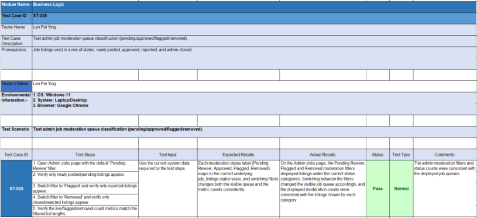

_Figure A3.20: Admin Moderation Queue Classification_

##### ST-026: Employer Verification Badge Visibility

**Recorded result: Pass.**

Verified employers displayed the verification badge consistently on the Employer Dashboard and on their job listings. For an unverified employer, the verification badge was not displayed. The badge visibility therefore matched the employer verification status across the tested views.

**Expected result:** The verified badge is shown if and only if the listing's employer has is_verified = true in public.users, with no inconsistency between the Jobs list view and the employer profile view.

**Test procedure:**

1. View a job listing posted by the verified employer on the Jobs page.
2. Verify the verified badge/icon appears next to the company name.
3. View a job listing posted by the unverified employer.
4. Verify no verified badge appears.
5. Verify the same badge logic is consistent on the employer's public profile page.

**Test input:** Use the current system data required by the test steps.

**Recorded comments:** The verification badge was shown only for verified employers and was consistent across the tested views.

Figure A3.21 retains the original screenshot associated with this case. The result and comments above follow the latest testing workbook.

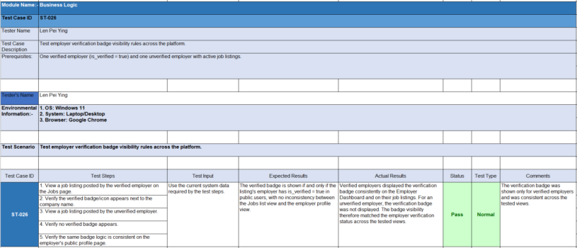

_Figure A3.21: Employer Verification Badge Visibility_

### Appendix 3.6 Reporting

This appendix provides the remaining Reporting System Testing test cases that are not presented in Section 4.3.1.6. The tests evaluated whether information displayed in EasyEarn reports, dashboards and calculated summaries was consistent with the underlying stored data. The additional tests covered job-listing reports, Job Seeker work history and earnings, and Employer job-posting performance. The representative test case is shown in Section 4.3.1.6: Admin Analytics Dashboard Accuracy.

##### ST-028: Job Listing Reporting Feature

**Recorded result: Pass.**

The Job Seeker successfully submitted a suspicious job report. The report appeared on the Admin Reports page with the correct Job Seeker as reporter, the correct reported job/employer reference, the submitted description, and an initial Pending status. The report could then be reviewed and resolved by the Admin.

**Expected result:** Report is saved with correct reporter_id, reported_user, description, and status 'pending'; visible to admin shortly after submission.

**Test procedure:**

1. Seeker opens a job listing and clicks 'Report'.
2. Seeker selects a report type and writes a description.
3. Seeker submits the report.
4. Admin opens Reports page and views the new report.
5. Verify the reported user/job reference is correct.

**Test input:** Report Type: 'Suspicious / Scam Listing' Description: 'Asked for upfront deposit before interview.'

**Recorded comments:** The suspicious job report was stored with the correct reporter and target information and was visible to the Admin.

Figure A3.22 retains the original screenshot associated with this case. The result and comments above follow the latest testing workbook.

_Figure A3.22: Job Listing Report Feature_

##### ST-029: Work History and Earnings Report

**Recorded result: Pass.**

The Work History page displayed 1 Completed Job with Total Earnings of RM120. Database verification showed that the Part-Time Barista &amp; Café Crew application was Completed with a confirmed RM120 payment, while the Cashier record remained in Completion Pending and was therefore excluded from completed work history. A query using the same completion and payment-confirmation rules returned 1 completed job and RM120 total earnings, matching the page.

**Expected result:** The Work History page should include only applications that are Completed with confirmed payment, and the displayed completed-job count and total earnings should match those eligible records.

**Test procedure:**

1. Seeker opens the Work History page.
2. Verify only applications with status Completed and confirmed payment are included in the completed work history.
3. Compare the displayed total earnings with the payment amount used for the included completed application(s).
4. Verify the displayed job title, employer and category match the included completed work-history record.

**Test input:** Tested seeker: Len Pei Ying; completed application included: Part-Time Barista &amp; Café Crew; confirmed payment amount: RM120

**Recorded comments:** The completed-job count and total earnings matched the eligible Completed application and confirmed payment record.

Figure A3.23 retains the original screenshot associated with this case. The result and comments above follow the latest testing workbook.

_Figure A3.23: Work History and Earnings Report_

##### ST-030: Employer Job Posting Performance View

**Recorded result: Pass.**

The Employer Manage Jobs page displayed applicant counts and remaining openings that matched the database for the tested listings. For [ST-002 TEST] Part-time Barista, the page showed 2 applicants and 0 openings; the database returned the same values. For Event Crew (F&amp;B Booth – SugarShine), the page showed 1 applicant and 2 openings; the database also matched. After closing the ST-002 test listing, its status changed to Closed, the summary reflected one closed listing, and the action changed from Close to Reopen.

**Expected result:** Per-listing applicant counts and openings figures shown to the employer accurately reflect the applications and job_listings tables, and manually closing a listing immediately removes it from the active view.

**Test procedure:**

1. Employer opens Manage Jobs page.
2. Verify each listing shows correct applicant count.
3. Verify each listing shows correct remaining openings.
4. Close one listing manually and verify it moves out of the active list.

**Test input:** Use the current system data required by the test steps.

**Recorded comments:** Applicant counts, openings and manual close status matched the verified database values for the tested listings.

Figure A3.24 retains the original screenshot associated with this case. The result and comments above follow the latest testing workbook.

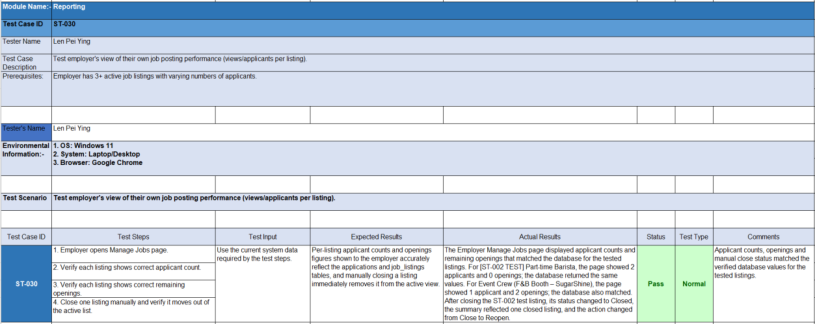

_Figure A3.24: Employer Job Posting Performance View_

### Appendix 3.7 Compliance

This appendix provides the remaining Compliance-related System Testing test cases that are not presented in Section 4.3.1.7. The tests included selected EasyEarn controls pertaining to privacy, transparency and user protection, such as access to the Privacy Policy and Terms of Service, administrative audit records, and reminders of compliance with the policy and awareness of the user. These tests were used to assess selected implemented controls and were not intended to be legal or regulatory certification. The representative test case, ST-032: PDPAAligned Document Handling, is presented in Section 4.3.1.7, while the remaining test cases are provided below.

##### ST-031: Privacy Policy and Terms of Service Accessibility

**Recorded result: Pass.**

The registration form displayed a dedicated consent and privacy notice before account creation, explaining the collection and use of account and profile data for EasyEarn services and that data is stored using Supabase. The notice included working links to the Privacy Policy and Terms of Service. Both policy pages loaded successfully, and the same Privacy Policy and Terms links were also available through the shared site footer.

**Expected result:** Privacy Policy and Terms of Service are present, accurately describe data handling (Supabase storage, document uploads), and are consistently linked sitewide via the footer partial.

**Test procedure:**

1. Open Register page and locate Privacy Policy / Terms links.
2. Click through to Privacy Policy and verify content loads.
3. Click through to Terms of Service and verify content loads.
4. Verify both pages are reachable from the site footer on every page.

**Test input:** Use the current system data required by the test steps.

**Recorded comments:** Privacy information and consent were presented directly in the registration form before account creation, with policy links also available through the site footer.

Figure A3.25 retains the original screenshot associated with this case. The result and comments above follow the latest testing workbook.

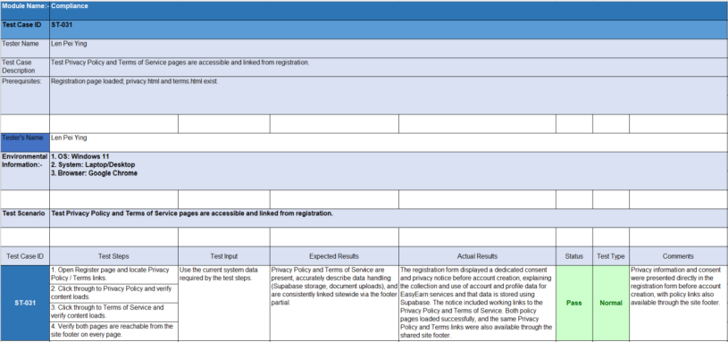

_Figure A3.25: Privacy Policy and Terms of Service Accessibility_

##### ST-033: Admin Audit Trail for Account Decisions

**Recorded result: Pass.**

Admin locked the ABCD Job Seeker account and the account was shown as Locked. After logout, a new login attempt was blocked with the message "Your account has been locked by the administrator. Please contact support." Admin then unlocked the account; its status returned to Active and login was restored. Admin rejected the CarePlus employer verification. The employer side reflected Rejected, and a database check confirmed verification_status = rejected with verification_notes = "Admin rejected this verification package."

**Expected result:** Locked accounts should be blocked from a new login until an Admin restores the account to Active. Employer verification decisions should persist in the users record, including the system-generated verification note.

**Test procedure:**

1. Admin locks a test user account (account_status = 'suspended').
2. Verify the locked user is blocked when attempting to log in again.
3. Admin unlocks the account (account_status = 'active') and verify login is restored.
4. Admin rejects an employer verification request.
5. Verify the rejection status and system-generated verification note are persisted in public.users and reflected to the employer.

**Test input:** Test user ABCD: account status locked then restored to Active; employer CarePlus: verification status changed to Rejected.

**Recorded comments:** Account lock/unlock enforcement and verification-decision persistence worked as expected in the tested scenarios.

Figure A3.26 retains the original screenshot associated with this case. The result and comments above follow the latest testing workbook.

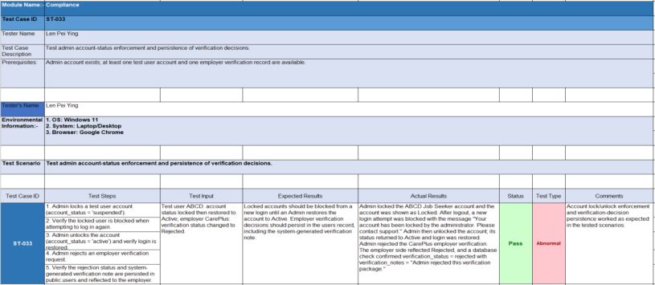

_Figure A3.26: Admin Audit Trail for Account Decisions_

##### ST-034: Gig Workers Act 2025 Compliance Reminders

**Recorded result: Pass.**

The Admin Analytics page displayed a 'Gig Workers Act 2025 Compliance Awareness' panel. It reminded Admin to review job listings for clear work scope, schedule, location and pay information; monitor reports and payment disputes so worker complaints receive proper follow-up; and use verification and moderation records to support safer employer accountability.

**Expected result:** The Admin Analytics page should display a compliance-awareness reminder covering transparent job terms, payment/dispute follow-up, and employer accountability. This test checks the implemented awareness guidance only and does not constitute formal legal compliance certification.

**Test procedure:**

1. Open Admin Analytics page and locate the Compliance Awareness panel.
2. Verify the panel reminds Admin to review clear work scope, schedule, location and pay information.
3. Verify the panel reminds Admin to monitor reports and payment disputes for proper follow-up.
4. Verify the panel references verification and moderation records for employer accountability.

**Test input:** Admin Analytics &gt; Gig Workers Act 2025 Compliance Awareness panel.

**Recorded comments:** The implemented Admin compliance-awareness panel displayed the expected transparency, payment/dispute and accountability reminders.

Figure A3.27 retains the original screenshot associated with this case. The result and comments above follow the latest testing workbook.

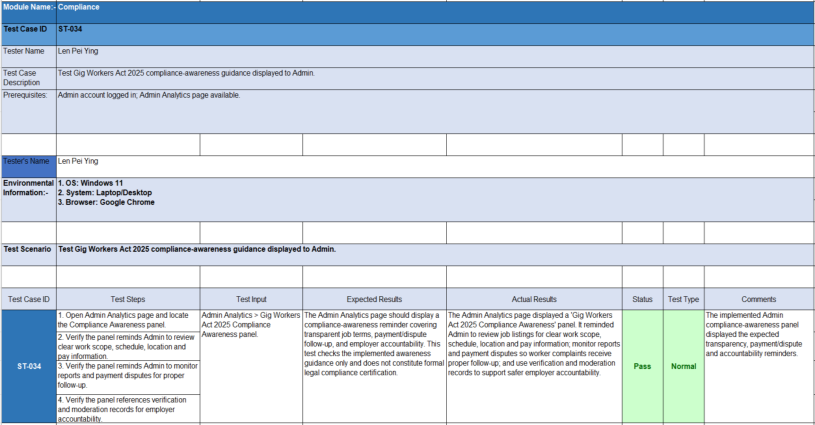

_Figure A3.27: Gig Workers Act 2025 Compliance Reminders_

Overall, all 34 System Testing test cases across the seven categories achieved a Pass result. The detailed evidence in Appendix 3 supports the System Testing results summarised in Section 4.3.1 and documents the additional test cases omitted from the main chapter for conciseness.

## Appendix 4: User Acceptance Testing (UAT)

This appendix reproduces the five supplied UAT forms as editable text and tables. Each form contains participant details, five Job Seeker tasks, five Employer tasks, five Admin tasks, ten usability ratings and Overall Acceptance. Sections A–C therefore contain 15 tasks per participant in total. The original wording, Pass/Fail entries, remarks, checked rating columns and signature text are retained.

The forms are ordered by the dates recorded by the participants. The records document UAT sessions in September 2026; they do not establish that participants repeated UAT after every subsequent security or interface change.

### Appendix 4.1: Chan Jade Qi

#### USER ACCEPTANCE TEST – EasyEarn

Instructions for the tester: Please fill in your name, date, time, institution and device used at the top of this form. Complete each task in Sections A to C without assistance from the system developer. Record ‘Pass’ if you are able to complete the task independently and ‘Fail’ if you are unable to complete it. Use the Remarks column to record anything that you find confusing, unclear or difficult to complete. For Section D, rate each usability statement from 1 (Strongly Disagree) to 5 (Strongly Agree) based on your experience using EasyEarn. After completing all sections, indicate your Overall Acceptance and provide any additional comments or suggestions.

<table>
<tr>
<td>Tester Name</td>
<td>Chan Jade Qi</td>
</tr>
<tr>
<td>Date</td>
<td>05/09/2026</td>
</tr>
<tr>
<td>Time</td>
<td>04:23 PM</td>
</tr>
<tr>
<td>Institution</td>
<td>Quest International University (QIU)</td>
</tr>
<tr>
<td>Device Used</td>
<td>Pavilion Plus 14, Tranquil Pink, Windows 11</td>
</tr>
<tr>
<td>Roles Tested</td>
<td>Job Seeker, Employer and Administrator</td>
</tr>
</table>

#### Section A: Job Seeker UAT

<table>
<tr>
<td>No</td>
<td>Task</td>
<td>Steps</td>
<td>Pass/Fail</td>
<td>Remarks</td>
</tr>
<tr>
<td>1</td>
<td>Register and Login</td>
<td>1. Open EasyEarn Login. 2. Log in with valid Job Seeker credentials. 3. Confirm the Job Seeker dashboard opens.</td>
<td>Pass</td>
<td>-</td>
</tr>
<tr>
<td>2</td>
<td>Job Search &amp; Browse</td>
<td>1. Open Jobs. 2. Use Search / Filter / Near Me. 3. Confirm suitable job listings display correctly.</td>
<td>Pass</td>
<td>-</td>
</tr>
<tr>
<td>3</td>
<td>Job Application</td>
<td>1. Open a suitable job. 2. Submit an application and open My Applications. 3. Confirm the application and status are shown correctly.</td>
<td>Pass</td>
<td>-</td>
</tr>
<tr>
<td>4</td>
<td>Work History &amp; Rate Employer</td>
<td>1. Open Work History after a completed job. 2. Review the completed job and rate the Employer. 3. Confirm date, earnings and rating are recorded correctly.</td>
<td>Pass</td>
<td>-</td>
</tr>
<tr>
<td>5</td>
<td>Resume Management</td>
<td>1. Open Resume. 2. Refresh/generate it from profile and work history. 3. Confirm the details are correct, and the PDF download works.</td>
<td>Pass</td>
<td>-</td>
</tr>
</table>

#### Section B: Employer UAT

<table>
<tr>
<td>No</td>
<td>Task</td>
<td>Steps</td>
<td>Pass/Fail</td>
<td>Remarks</td>
</tr>
<tr>
<td>1</td>
<td>Post Job</td>
<td>1. Open Manage Jobs. 2. Enter job details and submit a listing. 3. Confirm it appears with the correct status.</td>
<td>Pass</td>
<td>-</td>
</tr>
<tr>
<td>2</td>
<td>View Applicants</td>
<td>1. Open Applicants for a posted job. 2. Review the applicant list/details. 3. Confirm the correct applicant information is shown.</td>
<td>Pass</td>
<td>-</td>
</tr>
<tr>
<td>3</td>
<td>Accept / Reject Applicant</td>
<td>1. Open an applicant record. 2. Choose Accept or Reject. 3. Confirm the application status updates.</td>
<td>Pass</td>
<td>-</td>
</tr>
<tr>
<td>4</td>
<td>Employer Verification</td>
<td>1. Open Verification and select Employer Type. 2. Enter required details and upload matching documents. 3. Submit and confirm the request is recorded for Admin review.</td>
<td>Pass</td>
<td>-</td>
</tr>
<tr>
<td>5</td>
<td>Job Completion &amp; Rate Job Seeker</td>
<td>1. Open the relevant accepted/completion-pending application. 2. Confirm completion and rate the Job Seeker. 3. Confirm final status and rating are recorded.</td>
<td>Pass</td>
<td>-</td>
</tr>
</table>

#### Section C: Admin UAT

<table>
<tr>
<td>No</td>
<td>Task</td>
<td>Steps</td>
<td>Pass/Fail</td>
<td>Remarks</td>
</tr>
<tr>
<td>1</td>
<td>Lock / Unlock Employer</td>
<td>1. Open Users and select an Employer. 2. Lock and confirm access is restricted. 3. Unlock and confirm access is restored.</td>
<td>Pass</td>
<td>-</td>
</tr>
<tr>
<td>2</td>
<td>Approve Job</td>
<td>1. Open a pending job in Admin Jobs. 2. Approve the listing. 3. Confirm the status changes correctly.</td>
<td>Pass</td>
<td>-</td>
</tr>
<tr>
<td>3</td>
<td>Flag / Remove Job</td>
<td>1. Open a job that requires moderation. 2. Flag or remove it. 3. Confirm the moderation action takes effect.</td>
<td>Pass</td>
<td>-</td>
</tr>
<tr>
<td>4</td>
<td>Employer Verification Review</td>
<td>1. Open Employer Verifications. 2. Review type, details and supporting documents. 3. Approve / Reject / Recheck and confirm status updates.</td>
<td>Pass</td>
<td>-</td>
</tr>
<tr>
<td>5</td>
<td>Reports</td>
<td>1. Open a submitted report. 2. Review and take the appropriate action. 3. Confirm the report status updates.</td>
<td>Pass</td>
<td>-</td>
</tr>
</table>

#### Section D: Usability Testing Form

<table>
<tr>
<td>No</td>
<td>Evaluation Item</td>
<td colspan="5">Ratings</td>
</tr>
<tr>
<td colspan="2">1 = Strongly Disagree &#124; 2 = Disagree &#124; 3 = Neutral &#124; 4 = Agree &#124; 5 = Strongly Agree</td>
<td>1</td>
<td>2</td>
<td>3</td>
<td>4</td>
<td>5</td>
</tr>
<tr>
<td>1</td>
<td>The navigation menu makes it easy to find the functions I need.</td>
<td></td>
<td></td>
<td></td>
<td></td>
<td>✓</td>
</tr>
<tr>
<td>2</td>
<td>Job information, buttons and instructions are clear and easy to understand.</td>
<td></td>
<td></td>
<td></td>
<td></td>
<td>✓</td>
</tr>
<tr>
<td>3</td>
<td>Job search, filters and Near Me are easy to use.</td>
<td></td>
<td></td>
<td></td>
<td></td>
<td>✓</td>
</tr>
<tr>
<td>4</td>
<td>Application status and next actions are clearly displayed.</td>
<td></td>
<td></td>
<td></td>
<td></td>
<td>✓</td>
</tr>
<tr>
<td>5</td>
<td>Forms and system messages help me complete tasks and correct mistakes.</td>
<td></td>
<td></td>
<td></td>
<td></td>
<td>✓</td>
</tr>
<tr>
<td>6</td>
<td>The layout, buttons and design are consistent throughout EasyEarn.</td>
<td></td>
<td></td>
<td></td>
<td></td>
<td>✓</td>
</tr>
<tr>
<td>7</td>
<td>Employer verification requirements are clear and understandable.</td>
<td></td>
<td></td>
<td></td>
<td></td>
<td>✓</td>
</tr>
<tr>
<td>8</td>
<td>The chatbot and available guidance are helpful when I need assistance.</td>
<td></td>
<td></td>
<td></td>
<td></td>
<td>✓</td>
</tr>
<tr>
<td>9</td>
<td>The translation feature is easy to access and use.</td>
<td></td>
<td></td>
<td></td>
<td></td>
<td>✓</td>
</tr>
<tr>
<td>10</td>
<td>Overall, I can complete the main EasyEarn tasks easily and efficiently.</td>
<td></td>
<td></td>
<td></td>
<td></td>
<td>✓</td>
</tr>
</table>

#### Overall Acceptance:

<table>
<tr>
<td>✓</td>
<td>Accept</td>
<td></td>
<td>Accept with Minor Changes</td>
<td></td>
<td>Reject</td>
</tr>
<tr>
<td colspan="3">Additional Comments / Suggestions:</td>
<td colspan="3">-</td>
</tr>
<tr>
<td colspan="3">Tester Signature:</td>
<td colspan="3">Jade</td>
</tr>
</table>

### Appendix 4.2: Ang Mun Hin

#### USER ACCEPTANCE TEST – EasyEarn

Instructions for the tester: Please fill in your name, date, time, institution and device used at the top of this form. Complete each task in Sections A to C without assistance from the system developer. Record ‘Pass’ if you are able to complete the task independently and ‘Fail’ if you are unable to complete it. Use the Remarks column to record anything that you find confusing, unclear or difficult to complete. For Section D, rate each usability statement from 1 (Strongly Disagree) to 5 (Strongly Agree) based on your experience using EasyEarn. After completing all sections, indicate your Overall Acceptance and provide any additional comments or suggestions.

<table>
<tr>
<td>Tester Name</td>
<td>Ang Mun Hin</td>
</tr>
<tr>
<td>Date</td>
<td>08/09/2026</td>
</tr>
<tr>
<td>Time</td>
<td>5:50 PM</td>
</tr>
<tr>
<td>Institution</td>
<td>Universiti Sains Malaysia (USM)</td>
</tr>
<tr>
<td>Device Used</td>
<td>MSI Raider GE78 HX 14V, Intel Core i9, Windows 11</td>
</tr>
<tr>
<td>Roles Tested</td>
<td>Job Seeker, Employer and Administrator</td>
</tr>
</table>

#### Section A: Job Seeker UAT

<table>
<tr>
<td>No</td>
<td>Task</td>
<td>Steps</td>
<td>Pass/Fail</td>
<td>Remarks</td>
</tr>
<tr>
<td>1</td>
<td>Register and Login</td>
<td>1. Open EasyEarn Login. 2. Log in with valid Job Seeker credentials. 3. Confirm the Job Seeker dashboard opens.</td>
<td>Pass</td>
<td>-</td>
</tr>
<tr>
<td>2</td>
<td>Job Search &amp; Browse</td>
<td>1. Open Jobs. 2. Use Search / Filter / Near Me. 3. Confirm suitable job listings display correctly.</td>
<td>Pass</td>
<td>-</td>
</tr>
<tr>
<td>3</td>
<td>Job Application</td>
<td>1. Open a suitable job. 2. Submit an application and open My Applications. 3. Confirm the application and status are shown correctly.</td>
<td>Pass</td>
<td>-</td>
</tr>
<tr>
<td>4</td>
<td>Work History &amp; Rate Employer</td>
<td>1. Open Work History after a completed job. 2. Review the completed job and rate the Employer. 3. Confirm date, earnings and rating are recorded correctly.</td>
<td>Pass</td>
<td>-</td>
</tr>
<tr>
<td>5</td>
<td>Resume Management</td>
<td>1. Open Resume. 2. Refresh/generate it from profile and work history. 3. Confirm the details are correct, and the PDF download works.</td>
<td>Pass</td>
<td>-</td>
</tr>
</table>

#### Section B: Employer UAT

<table>
<tr>
<td>No</td>
<td>Task</td>
<td>Steps</td>
<td>Pass/Fail</td>
<td>Remarks</td>
</tr>
<tr>
<td>1</td>
<td>Post Job</td>
<td>1. Open Manage Jobs. 2. Enter job details and submit a listing. 3. Confirm it appears with the correct status.</td>
<td>Pass</td>
<td>-</td>
</tr>
<tr>
<td>2</td>
<td>View Applicants</td>
<td>1. Open Applicants for a posted job. 2. Review the applicant list/details. 3. Confirm the correct applicant information is shown.</td>
<td>Pass</td>
<td>-</td>
</tr>
<tr>
<td>3</td>
<td>Accept / Reject Applicant</td>
<td>1. Open an applicant record. 2. Choose Accept or Reject. 3. Confirm the application status updates.</td>
<td>Pass</td>
<td>-</td>
</tr>
<tr>
<td>4</td>
<td>Employer Verification</td>
<td>1. Open Verification and select Employer Type. 2. Enter required details and upload matching documents. 3. Submit and confirm the request is recorded for Admin review.</td>
<td>Pass</td>
<td>-</td>
</tr>
<tr>
<td>5</td>
<td>Job Completion &amp; Rate Job Seeker</td>
<td>1. Open the relevant accepted/completion-pending application. 2. Confirm completion and rate the Job Seeker. 3. Confirm final status and rating are recorded.</td>
<td>Pass</td>
<td>-</td>
</tr>
</table>

#### Section C: Admin UAT

<table>
<tr>
<td>No</td>
<td>Task</td>
<td>Steps</td>
<td>Pass/Fail</td>
<td>Remarks</td>
</tr>
<tr>
<td>1</td>
<td>Lock / Unlock Employer</td>
<td>1. Open Users and select an Employer. 2. Lock and confirm access is restricted. 3. Unlock and confirm access is restored.</td>
<td>Pass</td>
<td>-</td>
</tr>
<tr>
<td>2</td>
<td>Approve Job</td>
<td>1. Open a pending job in Admin Jobs. 2. Approve the listing. 3. Confirm the status changes correctly.</td>
<td>Pass</td>
<td>-</td>
</tr>
<tr>
<td>3</td>
<td>Flag / Remove Job</td>
<td>1. Open a job that requires moderation. 2. Flag or remove it. 3. Confirm the moderation action takes effect.</td>
<td>Pass</td>
<td>-</td>
</tr>
<tr>
<td>4</td>
<td>Employer Verification Review</td>
<td>1. Open Employer Verifications. 2. Review type, details and supporting documents. 3. Approve / Reject / Recheck and confirm status updates.</td>
<td>Pass</td>
<td>-</td>
</tr>
<tr>
<td>5</td>
<td>Reports</td>
<td>1. Open a submitted report. 2. Review and take the appropriate action. 3. Confirm the report status updates.</td>
<td>Pass</td>
<td>-</td>
</tr>
</table>

#### Section D: Usability Testing Form

<table>
<tr>
<td>No</td>
<td>Evaluation Item</td>
<td colspan="5">Ratings</td>
</tr>
<tr>
<td colspan="2">1 = Strongly Disagree &#124; 2 = Disagree &#124; 3 = Neutral &#124; 4 = Agree &#124; 5 = Strongly Agree</td>
<td>1</td>
<td>2</td>
<td>3</td>
<td>4</td>
<td>5</td>
</tr>
<tr>
<td>1</td>
<td>The navigation menu makes it easy to find the functions I need.</td>
<td></td>
<td></td>
<td></td>
<td></td>
<td>✓</td>
</tr>
<tr>
<td>2</td>
<td>Job information, buttons and instructions are clear and easy to understand.</td>
<td></td>
<td></td>
<td></td>
<td></td>
<td>✓</td>
</tr>
<tr>
<td>3</td>
<td>Job search, filters and Near Me are easy to use.</td>
<td></td>
<td></td>
<td></td>
<td></td>
<td>✓</td>
</tr>
<tr>
<td>4</td>
<td>Application status and next actions are clearly displayed.</td>
<td></td>
<td></td>
<td></td>
<td></td>
<td>✓</td>
</tr>
<tr>
<td>5</td>
<td>Forms and system messages help me complete tasks and correct mistakes.</td>
<td></td>
<td></td>
<td></td>
<td>✓</td>
<td></td>
</tr>
<tr>
<td>6</td>
<td>The layout, buttons and design are consistent throughout EasyEarn.</td>
<td></td>
<td></td>
<td></td>
<td></td>
<td>✓</td>
</tr>
<tr>
<td>7</td>
<td>Employer verification requirements are clear and understandable.</td>
<td></td>
<td></td>
<td></td>
<td>✓</td>
<td></td>
</tr>
<tr>
<td>8</td>
<td>The chatbot and available guidance are helpful when I need assistance.</td>
<td></td>
<td></td>
<td></td>
<td>✓</td>
<td></td>
</tr>
<tr>
<td>9</td>
<td>The translation feature is easy to access and use.</td>
<td></td>
<td></td>
<td></td>
<td></td>
<td>✓</td>
</tr>
<tr>
<td>10</td>
<td>Overall, I can complete the main EasyEarn tasks easily and efficiently.</td>
<td></td>
<td></td>
<td></td>
<td></td>
<td>✓</td>
</tr>
</table>

#### Overall Acceptance:

<table>
<tr>
<td>✓</td>
<td>Accept</td>
<td></td>
<td>Accept with Minor Changes</td>
<td></td>
<td>Reject</td>
</tr>
<tr>
<td colspan="3">Additional Comments / Suggestions:</td>
<td colspan="3">-</td>
</tr>
<tr>
<td colspan="3">Tester Signature:</td>
<td colspan="3">AMH</td>
</tr>
</table>

### Appendix 4.3: Seah Pei Yan

#### USER ACCEPTANCE TEST – EasyEarn

Instructions for the tester: Please fill in your name, date, time, institution and device used at the top of this form. Complete each task in Sections A to C without assistance from the system developer. Record ‘Pass’ if you are able to complete the task independently and ‘Fail’ if you are unable to complete it. Use the Remarks column to record anything that you find confusing, unclear or difficult to complete. For Section D, rate each usability statement from 1 (Strongly Disagree) to 5 (Strongly Agree) based on your experience using EasyEarn. After completing all sections, indicate your Overall Acceptance and provide any additional comments or suggestions.

<table>
<tr>
<td>Tester Name</td>
<td>Seah Pei Yan</td>
</tr>
<tr>
<td>Date</td>
<td>10/09/2026</td>
</tr>
<tr>
<td>Time</td>
<td>10:59 PM</td>
</tr>
<tr>
<td>Institution</td>
<td>Universiti Malaysia Perlis (UNIMAP)</td>
</tr>
<tr>
<td>Device Used</td>
<td>iPhone 15 Pro Max, Safari</td>
</tr>
<tr>
<td>Roles Tested</td>
<td>Job Seeker, Employer and Administrator</td>
</tr>
</table>

#### Section A: Job Seeker UAT

<table>
<tr>
<td>No</td>
<td>Task</td>
<td>Steps</td>
<td>Pass/Fail</td>
<td>Remarks</td>
</tr>
<tr>
<td>1</td>
<td>Register and Login</td>
<td>1. Open EasyEarn Login. 2. Log in with valid Job Seeker credentials. 3. Confirm the Job Seeker dashboard opens.</td>
<td>Pass</td>
<td>-</td>
</tr>
<tr>
<td>2</td>
<td>Job Search &amp; Browse</td>
<td>1. Open Jobs. 2. Use Search / Filter / Near Me. 3. Confirm suitable job listings display correctly.</td>
<td>Pass</td>
<td>-</td>
</tr>
<tr>
<td>3</td>
<td>Job Application</td>
<td>1. Open a suitable job. 2. Submit an application and open My Applications. 3. Confirm the application and status are shown correctly.</td>
<td>Pass</td>
<td>-</td>
</tr>
<tr>
<td>4</td>
<td>Work History &amp; Rate Employer</td>
<td>1. Open Work History after a completed job. 2. Review the completed job and rate the Employer. 3. Confirm date, earnings and rating are recorded correctly.</td>
<td>Pass</td>
<td>-</td>
</tr>
<tr>
<td>5</td>
<td>Resume Management</td>
<td>1. Open Resume. 2. Refresh/generate it from profile and work history. 3. Confirm the details are correct, and the PDF download works.</td>
<td>Pass</td>
<td>-</td>
</tr>
</table>

#### Section B: Employer UAT

<table>
<tr>
<td>No</td>
<td>Task</td>
<td>Steps</td>
<td>Pass/Fail</td>
<td>Remarks</td>
</tr>
<tr>
<td>1</td>
<td>Post Job</td>
<td>1. Open Manage Jobs. 2. Enter job details and submit a listing. 3. Confirm it appears with the correct status.</td>
<td>Pass</td>
<td>-</td>
</tr>
<tr>
<td>2</td>
<td>View Applicants</td>
<td>1. Open Applicants for a posted job. 2. Review the applicant list/details. 3. Confirm the correct applicant information is shown.</td>
<td>Pass</td>
<td>-</td>
</tr>
<tr>
<td>3</td>
<td>Accept / Reject Applicant</td>
<td>1. Open an applicant record. 2. Choose Accept or Reject. 3. Confirm the application status updates.</td>
<td>Pass</td>
<td>-</td>
</tr>
<tr>
<td>4</td>
<td>Employer Verification</td>
<td>1. Open Verification and select Employer Type. 2. Enter required details and upload matching documents. 3. Submit and confirm the request is recorded for Admin review.</td>
<td>Pass</td>
<td>-</td>
</tr>
<tr>
<td>5</td>
<td>Job Completion &amp; Rate Job Seeker</td>
<td>1. Open the relevant accepted/completion-pending application. 2. Confirm completion and rate the Job Seeker. 3. Confirm final status and rating are recorded.</td>
<td>Pass</td>
<td>-</td>
</tr>
</table>

#### Section C: Admin UAT

<table>
<tr>
<td>No</td>
<td>Task</td>
<td>Steps</td>
<td>Pass/Fail</td>
<td>Remarks</td>
</tr>
<tr>
<td>1</td>
<td>Lock / Unlock Employer</td>
<td>1. Open Users and select an Employer. 2. Lock and confirm access is restricted. 3. Unlock and confirm access is restored.</td>
<td>Pass</td>
<td>-</td>
</tr>
<tr>
<td>2</td>
<td>Approve Job</td>
<td>1. Open a pending job in Admin Jobs. 2. Approve the listing. 3. Confirm the status changes correctly.</td>
<td>Pass</td>
<td>-</td>
</tr>
<tr>
<td>3</td>
<td>Flag / Remove Job</td>
<td>1. Open a job that requires moderation. 2. Flag or remove it. 3. Confirm the moderation action takes effect.</td>
<td>Pass</td>
<td>-</td>
</tr>
<tr>
<td>4</td>
<td>Employer Verification Review</td>
<td>1. Open Employer Verifications. 2. Review type, details and supporting documents. 3. Approve / Reject / Recheck and confirm status updates.</td>
<td>Pass</td>
<td>-</td>
</tr>
<tr>
<td>5</td>
<td>Reports</td>
<td>1. Open a submitted report. 2. Review and take the appropriate action. 3. Confirm the report status updates.</td>
<td>Pass</td>
<td>-</td>
</tr>
</table>

#### Section D: Usability Testing Form

<table>
<tr>
<td>No</td>
<td>Evaluation Item</td>
<td colspan="5">Ratings</td>
</tr>
<tr>
<td colspan="2">1 = Strongly Disagree &#124; 2 = Disagree &#124; 3 = Neutral &#124; 4 = Agree &#124; 5 = Strongly Agree</td>
<td>1</td>
<td>2</td>
<td>3</td>
<td>4</td>
<td>5</td>
</tr>
<tr>
<td>1</td>
<td>The navigation menu makes it easy to find the functions I need.</td>
<td></td>
<td></td>
<td></td>
<td></td>
<td>✓</td>
</tr>
<tr>
<td>2</td>
<td>Job information, buttons and instructions are clear and easy to understand.</td>
<td></td>
<td></td>
<td></td>
<td></td>
<td>✓</td>
</tr>
<tr>
<td>3</td>
<td>Job search, filters and Near Me are easy to use.</td>
<td></td>
<td></td>
<td></td>
<td></td>
<td>✓</td>
</tr>
<tr>
<td>4</td>
<td>Application status and next actions are clearly displayed.</td>
<td></td>
<td></td>
<td></td>
<td></td>
<td>✓</td>
</tr>
<tr>
<td>5</td>
<td>Forms and system messages help me complete tasks and correct mistakes.</td>
<td></td>
<td></td>
<td></td>
<td></td>
<td>✓</td>
</tr>
<tr>
<td>6</td>
<td>The layout, buttons and design are consistent throughout EasyEarn.</td>
<td></td>
<td></td>
<td></td>
<td></td>
<td>✓</td>
</tr>
<tr>
<td>7</td>
<td>Employer verification requirements are clear and understandable.</td>
<td></td>
<td></td>
<td></td>
<td>✓</td>
<td></td>
</tr>
<tr>
<td>8</td>
<td>The chatbot and available guidance are helpful when I need assistance.</td>
<td></td>
<td></td>
<td></td>
<td>✓</td>
<td></td>
</tr>
<tr>
<td>9</td>
<td>The translation feature is easy to access and use.</td>
<td></td>
<td></td>
<td></td>
<td></td>
<td>✓</td>
</tr>
<tr>
<td>10</td>
<td>Overall, I can complete the main EasyEarn tasks easily and efficiently.</td>
<td></td>
<td></td>
<td></td>
<td></td>
<td>✓</td>
</tr>
</table>

#### Overall Acceptance:

<table>
<tr>
<td>✓</td>
<td>Accept</td>
<td></td>
<td>Accept with Minor Changes</td>
<td></td>
<td>Reject</td>
</tr>
<tr>
<td colspan="3">Additional Comments / Suggestions:</td>
<td colspan="3">-</td>
</tr>
<tr>
<td colspan="3">Tester Signature:</td>
<td colspan="3">chole</td>
</tr>
</table>

### Appendix 4.4: Lee Jian Hou

#### USER ACCEPTANCE TEST – EasyEarn

Instructions for the tester: Please fill in your name, date, time, institution and device used at the top of this form. Complete each task in Sections A to C without assistance from the system developer. Record ‘Pass’ if you are able to complete the task independently and ‘Fail’ if you are unable to complete it. Use the Remarks column to record anything that you find confusing, unclear or difficult to complete. For Section D, rate each usability statement from 1 (Strongly Disagree) to 5 (Strongly Agree) based on your experience using EasyEarn. After completing all sections, indicate your Overall Acceptance and provide any additional comments or suggestions.

<table>
<tr>
<td>Tester Name</td>
<td>Lee Jian Hou</td>
</tr>
<tr>
<td>Date</td>
<td>10/09/2026</td>
</tr>
<tr>
<td>Time</td>
<td>11:02 PM</td>
</tr>
<tr>
<td>Institution</td>
<td>Sunway College Ipoh (SCI)</td>
</tr>
<tr>
<td>Device Used</td>
<td>HONOR Pad 9, Android, Chrome</td>
</tr>
<tr>
<td>Roles Tested</td>
<td>Job Seeker, Employer and Administrator</td>
</tr>
</table>

#### Section A: Job Seeker UAT

<table>
<tr>
<td>No</td>
<td>Task</td>
<td>Steps</td>
<td>Pass/Fail</td>
<td>Remarks</td>
</tr>
<tr>
<td>1</td>
<td>Register and Login</td>
<td>1. Open EasyEarn Login. 2. Log in with valid Job Seeker credentials. 3. Confirm the Job Seeker dashboard opens.</td>
<td>Pass</td>
<td>-</td>
</tr>
<tr>
<td>2</td>
<td>Job Search &amp; Browse</td>
<td>1. Open Jobs. 2. Use Search / Filter / Near Me. 3. Confirm suitable job listings display correctly.</td>
<td>Pass</td>
<td>-</td>
</tr>
<tr>
<td>3</td>
<td>Job Application</td>
<td>1. Open a suitable job. 2. Submit an application and open My Applications. 3. Confirm the application and status are shown correctly.</td>
<td>Pass</td>
<td>-</td>
</tr>
<tr>
<td>4</td>
<td>Work History &amp; Rate Employer</td>
<td>1. Open Work History after a completed job. 2. Review the completed job and rate the Employer. 3. Confirm date, earnings and rating are recorded correctly.</td>
<td>Pass</td>
<td>-</td>
</tr>
<tr>
<td>5</td>
<td>Resume Management</td>
<td>1. Open Resume. 2. Refresh/generate it from profile and work history. 3. Confirm the details are correct, and the PDF download works.</td>
<td>Pass</td>
<td>-</td>
</tr>
</table>

#### Section B: Employer UAT

<table>
<tr>
<td>No</td>
<td>Task</td>
<td>Steps</td>
<td>Pass/Fail</td>
<td>Remarks</td>
</tr>
<tr>
<td>1</td>
<td>Post Job</td>
<td>1. Open Manage Jobs. 2. Enter job details and submit a listing. 3. Confirm it appears with the correct status.</td>
<td>Pass</td>
<td>-</td>
</tr>
<tr>
<td>2</td>
<td>View Applicants</td>
<td>1. Open Applicants for a posted job. 2. Review the applicant list/details. 3. Confirm the correct applicant information is shown.</td>
<td>Pass</td>
<td>-</td>
</tr>
<tr>
<td>3</td>
<td>Accept / Reject Applicant</td>
<td>1. Open an applicant record. 2. Choose Accept or Reject. 3. Confirm the application status updates.</td>
<td>Pass</td>
<td>-</td>
</tr>
<tr>
<td>4</td>
<td>Employer Verification</td>
<td>1. Open Verification and select Employer Type. 2. Enter required details and upload matching documents. 3. Submit and confirm the request is recorded for Admin review.</td>
<td>Pass</td>
<td>-</td>
</tr>
<tr>
<td>5</td>
<td>Job Completion &amp; Rate Job Seeker</td>
<td>1. Open the relevant accepted/completion-pending application. 2. Confirm completion and rate the Job Seeker. 3. Confirm final status and rating are recorded.</td>
<td>Pass</td>
<td>-</td>
</tr>
</table>

#### Section C: Admin UAT

<table>
<tr>
<td>No</td>
<td>Task</td>
<td>Steps</td>
<td>Pass/Fail</td>
<td>Remarks</td>
</tr>
<tr>
<td>1</td>
<td>Lock / Unlock Employer</td>
<td>1. Open Users and select an Employer. 2. Lock and confirm access is restricted. 3. Unlock and confirm access is restored.</td>
<td>Pass</td>
<td>-</td>
</tr>
<tr>
<td>2</td>
<td>Approve Job</td>
<td>1. Open a pending job in Admin Jobs. 2. Approve the listing. 3. Confirm the status changes correctly.</td>
<td>Pass</td>
<td>-</td>
</tr>
<tr>
<td>3</td>
<td>Flag / Remove Job</td>
<td>1. Open a job that requires moderation. 2. Flag or remove it. 3. Confirm the moderation action takes effect.</td>
<td>Pass</td>
<td>-</td>
</tr>
<tr>
<td>4</td>
<td>Employer Verification Review</td>
<td>1. Open Employer Verifications. 2. Review type, details and supporting documents. 3. Approve / Reject / Recheck and confirm status updates.</td>
<td>Pass</td>
<td>-</td>
</tr>
<tr>
<td>5</td>
<td>Reports</td>
<td>1. Open a submitted report. 2. Review and take the appropriate action. 3. Confirm the report status updates.</td>
<td>Pass</td>
<td>-</td>
</tr>
</table>

#### Section D: Usability Testing Form

<table>
<tr>
<td>No</td>
<td>Evaluation Item</td>
<td colspan="5">Ratings</td>
</tr>
<tr>
<td colspan="2">1 = Strongly Disagree &#124; 2 = Disagree &#124; 3 = Neutral &#124; 4 = Agree &#124; 5 = Strongly Agree</td>
<td>1</td>
<td>2</td>
<td>3</td>
<td>4</td>
<td>5</td>
</tr>
<tr>
<td>1</td>
<td>The navigation menu makes it easy to find the functions I need.</td>
<td></td>
<td></td>
<td></td>
<td></td>
<td>✓</td>
</tr>
<tr>
<td>2</td>
<td>Job information, buttons and instructions are clear and easy to understand.</td>
<td></td>
<td></td>
<td></td>
<td></td>
<td>✓</td>
</tr>
<tr>
<td>3</td>
<td>Job search, filters and Near Me are easy to use.</td>
<td></td>
<td></td>
<td></td>
<td></td>
<td>✓</td>
</tr>
<tr>
<td>4</td>
<td>Application status and next actions are clearly displayed.</td>
<td></td>
<td></td>
<td></td>
<td></td>
<td>✓</td>
</tr>
<tr>
<td>5</td>
<td>Forms and system messages help me complete tasks and correct mistakes.</td>
<td></td>
<td></td>
<td></td>
<td>✓</td>
<td></td>
</tr>
<tr>
<td>6</td>
<td>The layout, buttons and design are consistent throughout EasyEarn.</td>
<td></td>
<td></td>
<td></td>
<td></td>
<td>✓</td>
</tr>
<tr>
<td>7</td>
<td>Employer verification requirements are clear and understandable.</td>
<td></td>
<td></td>
<td></td>
<td>✓</td>
<td></td>
</tr>
<tr>
<td>8</td>
<td>The chatbot and available guidance are helpful when I need assistance.</td>
<td></td>
<td></td>
<td></td>
<td>✓</td>
<td></td>
</tr>
<tr>
<td>9</td>
<td>The translation feature is easy to access and use.</td>
<td></td>
<td></td>
<td></td>
<td></td>
<td>✓</td>
</tr>
<tr>
<td>10</td>
<td>Overall, I can complete the main EasyEarn tasks easily and efficiently.</td>
<td></td>
<td></td>
<td></td>
<td></td>
<td>✓</td>
</tr>
</table>

#### Overall Acceptance:

<table>
<tr>
<td>✓</td>
<td>Accept</td>
<td></td>
<td>Accept with Minor Changes</td>
<td></td>
<td>Reject</td>
</tr>
<tr>
<td colspan="3">Additional Comments / Suggestions:</td>
<td colspan="3">-</td>
</tr>
<tr>
<td colspan="3">Tester Signature:</td>
<td colspan="3">Lee</td>
</tr>
</table>

### Appendix 4.5: Wong Ke Ni

#### USER ACCEPTANCE TEST – EasyEarn

Instructions for the tester: Please fill in your name, date, time, institution and device used at the top of this form. Complete each task in Sections A to C without assistance from the system developer. Record ‘Pass’ if you are able to complete the task independently and ‘Fail’ if you are unable to complete it. Use the Remarks column to record anything that you find confusing, unclear or difficult to complete. For Section D, rate each usability statement from 1 (Strongly Disagree) to 5 (Strongly Agree) based on your experience using EasyEarn. After completing all sections, indicate your Overall Acceptance and provide any additional comments or suggestions.

<table>
<tr>
<td>Tester Name</td>
<td>Wong Ke Ni</td>
</tr>
<tr>
<td>Date</td>
<td>15/09/2026</td>
</tr>
<tr>
<td>Time</td>
<td>10:15 AM</td>
</tr>
<tr>
<td>Institution</td>
<td>Quest International University (QIU)</td>
</tr>
<tr>
<td>Device Used</td>
<td>HONOR X9b, Android, Chrome</td>
</tr>
<tr>
<td>Roles Tested</td>
<td>Job Seeker, Employer and Administrator</td>
</tr>
</table>

#### Section A: Job Seeker UAT

<table>
<tr>
<td>No</td>
<td>Task</td>
<td>Steps</td>
<td>Pass/Fail</td>
<td>Remarks</td>
</tr>
<tr>
<td>1</td>
<td>Register and Login</td>
<td>1. Open EasyEarn Login. 2. Log in with valid Job Seeker credentials. 3. Confirm the Job Seeker dashboard opens.</td>
<td>Pass</td>
<td>-</td>
</tr>
<tr>
<td>2</td>
<td>Job Search &amp; Browse</td>
<td>1. Open Jobs. 2. Use Search / Filter / Near Me. 3. Confirm suitable job listings display correctly.</td>
<td>Pass</td>
<td>-</td>
</tr>
<tr>
<td>3</td>
<td>Job Application</td>
<td>1. Open a suitable job. 2. Submit an application and open My Applications. 3. Confirm the application and status are shown correctly.</td>
<td>Pass</td>
<td>-</td>
</tr>
<tr>
<td>4</td>
<td>Work History &amp; Rate Employer</td>
<td>1. Open Work History after a completed job. 2. Review the completed job and rate the Employer. 3. Confirm date, earnings and rating are recorded correctly.</td>
<td>Pass</td>
<td>-</td>
</tr>
<tr>
<td>5</td>
<td>Resume Management</td>
<td>1. Open Resume. 2. Refresh/generate it from profile and work history. 3. Confirm the details are correct, and the PDF download works.</td>
<td>Pass</td>
<td>-</td>
</tr>
</table>

#### Section B: Employer UAT

<table>
<tr>
<td>No</td>
<td>Task</td>
<td>Steps</td>
<td>Pass/Fail</td>
<td>Remarks</td>
</tr>
<tr>
<td>1</td>
<td>Post Job</td>
<td>1. Open Manage Jobs. 2. Enter job details and submit a listing. 3. Confirm it appears with the correct status.</td>
<td>Pass</td>
<td>-</td>
</tr>
<tr>
<td>2</td>
<td>View Applicants</td>
<td>1. Open Applicants for a posted job. 2. Review the applicant list/details. 3. Confirm the correct applicant information is shown.</td>
<td>Pass</td>
<td>-</td>
</tr>
<tr>
<td>3</td>
<td>Accept / Reject Applicant</td>
<td>1. Open an applicant record. 2. Choose Accept or Reject. 3. Confirm the application status updates.</td>
<td>Pass</td>
<td>-</td>
</tr>
<tr>
<td>4</td>
<td>Employer Verification</td>
<td>1. Open Verification and select Employer Type. 2. Enter required details and upload matching documents. 3. Submit and confirm the request is recorded for Admin review.</td>
<td>Pass</td>
<td>-</td>
</tr>
<tr>
<td>5</td>
<td>Job Completion &amp; Rate Job Seeker</td>
<td>1. Open the relevant accepted/completion-pending application. 2. Confirm completion and rate the Job Seeker. 3. Confirm final status and rating are recorded.</td>
<td>Pass</td>
<td>-</td>
</tr>
</table>

#### Section C: Admin UAT

<table>
<tr>
<td>No</td>
<td>Task</td>
<td>Steps</td>
<td>Pass/Fail</td>
<td>Remarks</td>
</tr>
<tr>
<td>1</td>
<td>Lock / Unlock Employer</td>
<td>1. Open Users and select an Employer. 2. Lock and confirm access is restricted. 3. Unlock and confirm access is restored.</td>
<td>Pass</td>
<td>-</td>
</tr>
<tr>
<td>2</td>
<td>Approve Job</td>
<td>1. Open a pending job in Admin Jobs. 2. Approve the listing. 3. Confirm the status changes correctly.</td>
<td>Pass</td>
<td>-</td>
</tr>
<tr>
<td>3</td>
<td>Flag / Remove Job</td>
<td>1. Open a job that requires moderation. 2. Flag or remove it. 3. Confirm the moderation action takes effect.</td>
<td>Pass</td>
<td>-</td>
</tr>
<tr>
<td>4</td>
<td>Employer Verification Review</td>
<td>1. Open Employer Verifications. 2. Review type, details and supporting documents. 3. Approve / Reject / Recheck and confirm status updates.</td>
<td>Pass</td>
<td>-</td>
</tr>
<tr>
<td>5</td>
<td>Reports</td>
<td>1. Open a submitted report. 2. Review and take the appropriate action. 3. Confirm the report status updates.</td>
<td>Pass</td>
<td>-</td>
</tr>
</table>

#### Section D: Usability Testing Form

<table>
<tr>
<td>No</td>
<td>Evaluation Item</td>
<td colspan="5">Ratings</td>
</tr>
<tr>
<td colspan="2">1 = Strongly Disagree &#124; 2 = Disagree &#124; 3 = Neutral &#124; 4 = Agree &#124; 5 = Strongly Agree</td>
<td>1</td>
<td>2</td>
<td>3</td>
<td>4</td>
<td>5</td>
</tr>
<tr>
<td>1</td>
<td>The navigation menu makes it easy to find the functions I need.</td>
<td></td>
<td></td>
<td></td>
<td></td>
<td>✓</td>
</tr>
<tr>
<td>2</td>
<td>Job information, buttons and instructions are clear and easy to understand.</td>
<td></td>
<td></td>
<td></td>
<td></td>
<td>✓</td>
</tr>
<tr>
<td>3</td>
<td>Job search, filters and Near Me are easy to use.</td>
<td></td>
<td></td>
<td></td>
<td></td>
<td>✓</td>
</tr>
<tr>
<td>4</td>
<td>Application status and next actions are clearly displayed.</td>
<td></td>
<td></td>
<td></td>
<td></td>
<td>✓</td>
</tr>
<tr>
<td>5</td>
<td>Forms and system messages help me complete tasks and correct mistakes.</td>
<td></td>
<td></td>
<td></td>
<td></td>
<td>✓</td>
</tr>
<tr>
<td>6</td>
<td>The layout, buttons and design are consistent throughout EasyEarn.</td>
<td></td>
<td></td>
<td></td>
<td></td>
<td>✓</td>
</tr>
<tr>
<td>7</td>
<td>Employer verification requirements are clear and understandable.</td>
<td></td>
<td></td>
<td></td>
<td></td>
<td>✓</td>
</tr>
<tr>
<td>8</td>
<td>The chatbot and available guidance are helpful when I need assistance.</td>
<td></td>
<td></td>
<td></td>
<td></td>
<td>✓</td>
</tr>
<tr>
<td>9</td>
<td>The translation feature is easy to access and use.</td>
<td></td>
<td></td>
<td></td>
<td></td>
<td>✓</td>
</tr>
<tr>
<td>10</td>
<td>Overall, I can complete the main EasyEarn tasks easily and efficiently.</td>
<td></td>
<td></td>
<td></td>
<td></td>
<td>✓</td>
</tr>
</table>

#### Overall Acceptance:

<table>
<tr>
<td>✓</td>
<td>Accept</td>
<td></td>
<td>Accept with Minor Changes</td>
<td></td>
<td>Reject</td>
</tr>
<tr>
<td colspan="3">Additional Comments / Suggestions:</td>
<td colspan="3">-</td>
</tr>
<tr>
<td colspan="3">Tester Signature:</td>
<td colspan="3">Keni</td>
</tr>
</table>

## Appendix 5: Security Testing

This appendix provides the detailed Security Testing test cases and supporting evidence that are not presented in Section 4.3.4. Security Testing was conducted across nine categories: RLS - Data Isolation, Auth & Access Control, Upload Security, Input Sanitisation, Rating & Business Rules, Report Security, Analytics & Chatbot, PDPA & Compliance, and Employer Verification & Visibility. A total of 30 Security Testing test cases (SEC-001 to SEC-030) were executed, and all 30 achieved a Pass result in the final testing round. Section 4.3.4 provides one representative test case from each category, while the rest of the test cases and supporting evidence are provided in Appendix 5.1 to Appendix 5.9. There were a number of limitations that were identified during the early testing phases, which were resolved and successfully retested prior to the final results being recorded.

### Appendix 5.1: RLS - Data Isolation

This appendix provides the remaining RLS - Data Isolation Security Testing test cases that are not presented in Section 4.3.4.1. These tests provide supporting evidence for the RLS controls applied to user-specific records, including applications, notifications, job listings, verification information, payments, saved jobs, user profiles and work history. The representative test case, SEC-001: Seeker Cannot Read Another Job Seeker's Applications, is presented in Section 4.3.4.1, while the additional RLS - Data Isolation test cases are provided below.

##### SEC-002: Seeker Cannot Update Another Seeker's Application Status

**Recorded result: Pass.**

While authenticated as ABCD, updateApplicationStatus() was called for Len Pei Ying's application and the helper returned {id: '895fe1b2-7ba7-4d2c-b071-ee5929d10797', status: 'rejected'}. However, a direct database check immediately afterwards showed the application still stored as status = completed. Therefore the requested cross-seeker update did not persist.

**Expected result:** The cross-seeker UPDATE must not persist. The target application's stored status should remain unchanged because RLS restricts update access to the owning seeker.

**Test procedure:**

1. Log in as Job Seeker ABCD.
2. Using ABCD's authenticated browser session, call updateApplicationStatus() for Len Pei Ying's application ID and request status = rejected.
3. Query the same application directly in Supabase SQL Editor and verify the stored status.

**Test input:** Authenticated user: ABCD
Target application: 895fe1b2-7ba7-4d2c-b071-ee5929d10797
Owner seeker_id: 31c79f9e-2dee-44f9-80d7-2a70725dbb52 (Len Pei Ying)
Attempted status: rejected

**Recorded comments:** RLS prevented the unauthorized update from persisting. Note: the client helper returns the requested status without confirming an affected row, so database verification is required.

Figure A5.1 retains the original screenshot associated with this case. The result and comments above follow the latest testing workbook.

The database readback, rather than the optimistic client-helper response, is the basis of the recorded Pass result.

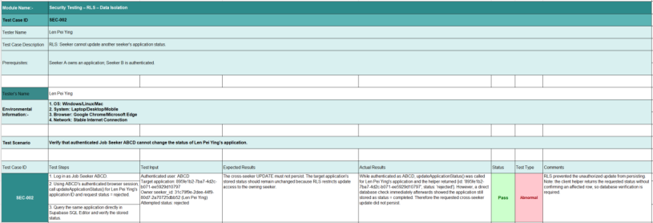

_Figure A5.1: RLS - Data Isolation (Seeker Application Update Isolation)_

##### SEC-003: Seeker Cannot Read Another User's Notifications

**Recorded result: Pass.**

Using ABCD's authenticated session, fetchNotifications(ABCD_ID) returned 1 notification with user_id = ABCD (application_update: 'Your application for Event Crew (F&amp;B Booth – SugarShine) is now pending.'). Using the same session, fetchNotifications(LEN_ID) returned an empty array []. No Len Pei Ying notification rows were exposed.

**Expected result:** ABCD's own notification rows may be returned. A request for Len Pei Ying's notifications from ABCD's authenticated session should return no Len-owned notification rows.

**Test procedure:**

1. Log in as Job Seeker ABCD.
2. Using ABCD's authenticated browser session, call fetchNotifications() with ABCD's user ID.
3. In the same session, call fetchNotifications() with Len Pei Ying's user ID and compare the returned arrays.

**Test input:** Authenticated user: ABCD (d1ff41b4-fb7d-4398-a270-c405c83fc795)
Other user: Len Pei Ying (31c79f9e-2dee-44f9-80d7-2a70725dbb52)

**Recorded comments:** Runtime RLS isolation was confirmed: ABCD could read an own notification row but not another user's notifications.

Figure A5.2 retains the original screenshot associated with this case. The result and comments above follow the latest testing workbook.

_Figure A5.2: RLS - Data Isolation (Notification Read Isolation)_

##### SEC-004: Employer cannot update another employer's job listing

**Recorded result: Pass.**

While authenticated as SugarShine, updateJobListing() was called for W&amp;X Bakery's job with title = 'SEC-004 UNAUTHORIZED TEST'. The helper returned null. A direct database check immediately afterwards showed the job still stored as title = 'Event Crew (F&amp;B Booth – W&amp;X Bakery)' with status = approved. The unauthorized cross-employer update did not persist.

**Expected result:** The cross-employer UPDATE must not persist. The W&amp;X Bakery job title should remain unchanged because update access is restricted to the owning employer.

**Test procedure:**

1. Log in as employer SugarShine.
2. Using SugarShine's authenticated browser session, call updateJobListing() for W&amp;X Bakery's job and attempt to change its title.
3. Query the same job row directly in Supabase SQL Editor and verify whether the stored title changed.

**Test input:** Authenticated employer: SugarShine
Target job: b534a64e-03ea-498c-9504-b39ebae6980d
Owner employer_id: cfc76680-17f4-4670-a0cd-c5c02b6a6650 (W&amp;X Bakery)
Attempted title: SEC-004 UNAUTHORIZED TEST

**Recorded comments:** Runtime ownership enforcement was confirmed: a different employer could not modify W&amp;X Bakery's listing.

Figure A5.3 retains the original screenshot associated with this case. The result and comments above follow the latest testing workbook.

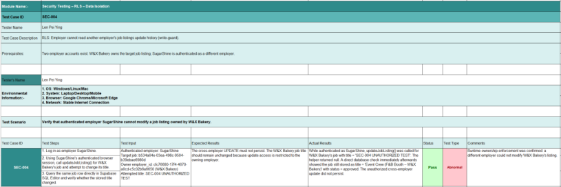

_Figure A5.3: RLS - Data Isolation (Job Listing Update Isolation)_

##### SEC-005: Employer Cannot Modify Another Employer's Verification Documents

**Recorded result: Pass.**

Retest passed. RLS is enabled on public.users. The active SELECT policies allow only users_select_own (auth.uid() = id) and users_select_admin (is_admin_user(auth.uid())). SugarShine's authenticated user had no admin app_metadata role. A direct authenticated query to public.users for W&amp;X Bakery's id and sensitive verification columns returned testData = [] and testError = null. Therefore the target row and verification document fields were not exposed to SugarShine. The earlier fetchProfile observation was not used as final evidence because the direct raw RLS retest contradicted it.

**Expected result:** A non-owner, non-admin employer must not receive W&amp;X Bakery's row or sensitive verification fields. RLS may silently filter the row, returning an empty array without an error.

**Test procedure:**

1. Log in as employer SugarShine and confirm the authenticated user is not an admin.
2. Using the authenticated Supabase client, query public.users directly for W&amp;X Bakery's id and select the sensitive verification columns.
3. Inspect the raw query result and error returned by Supabase RLS.

**Test input:** Authenticated user id: df0abc84-7df8-4709-94de-02f43e097c84 (SugarShine)
app_metadata.role: undefined (not admin)
Target employer: W&amp;X Bakery (cfc76680-17f4-4670-a0cd-c5c02b6a6650)
Queried columns: id, full_name, email, ssm_number, registration_doc_name, registration_doc_data, contact_doc_name, contact_doc_data

**Recorded comments:** Final SEC-005 result is based on the direct authenticated raw Supabase query. RLS correctly filtered another employer's users row. No cross-employer verification document access was returned in the retest.

Figure A5.4 retains the original screenshot associated with this case. The result and comments above follow the latest testing workbook.

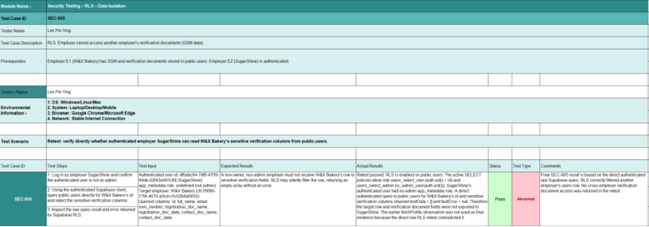

_Figure A5.4: RLS - Data Isolation (Verification Document Access)_

##### SEC-006: Seeker Cannot Insert a Payment Record on the Employer's Behalf

**Recorded result: Pass.**

Retest passed. The authenticated user ID was confirmed as ABCD (d1ff41b4-fb7d-4398-a270-c405c83fc795). The direct payments INSERT attempting payer_id = SugarShine returned HTTP 403 with PostgreSQL error code 42501: 'new row violates row-level security policy for table "payments"'. retestData was null. A database query for application_id 888c03d0-98d9-4e89-bce4-5e0f4ef799c1 and amount 6.07 returned 0 rows, confirming no test payment was inserted.

**Expected result:** The Job Seeker must not be able to create a payment row on the employer's behalf. The insert should be rejected by RLS and no matching payment row should exist.

**Test procedure:**

1. Log in as Job Seeker ABCD and confirm the authenticated user ID.
2. Using ABCD's authenticated Supabase client, insert into payments for ABCD's application while setting payer_id to SugarShine and payee_id to ABCD.
3. Query the database for the inserted test amount and verify whether the forged payment row exists.

**Test input:** Authenticated seeker: ABCD (d1ff41b4-fb7d-4398-a270-c405c83fc795)
Application: 888c03d0-98d9-4e89-bce4-5e0f4ef799c1
Attempted payer_id: SugarShine (df0abc84-7df8-4709-94de-02f43e097c84)
payee_id: ABCD
amount: 6.07
method: SEC-006 RETEST

**Recorded comments:** Final SEC-006 result is based on the clean retest using the real ABCD authenticated browser session. RLS blocked the forged employer payment insert and no matching database row persisted.

Figure A5.5 retains the original screenshot associated with this case. The result and comments above follow the latest testing workbook.

_Figure A5.5: RLS - Data Isolation (Payment Insert Restriction)_

##### SEC-007: Seeker Cannot Update Another Seeker's Payment Confirmation

**Recorded result: Pass.**

While authenticated as ABCD, the UPDATE targeting Tsuki's payment returned sec007Data = [] and sec007Error = null. A direct database check afterwards showed seeker_confirmed_at remained 2026-09-29 19:48:14.227+00. Therefore ABCD could not modify another seeker's payment confirmation timestamp.

**Expected result:** The cross-seeker UPDATE must not persist. ABCD should receive no updated row, and Tsuki's stored seeker_confirmed_at value must remain unchanged.

**Test procedure:**

1. Log in as Job Seeker ABCD and confirm the authenticated user ID.
2. Using ABCD's authenticated Supabase client, attempt to update seeker_confirmed_at for Tsuki's payment row.
3. Query the same payment row directly in Supabase SQL Editor and verify that seeker_confirmed_at is unchanged.

**Test input:** Authenticated seeker: ABCD (d1ff41b4-fb7d-4398-a270-c405c83fc795)
Target payment: 254a0c07-52cd-4047-ae4b-7ca282a17493
Target payee / seeker: Tsuki (4be6d53d-c79c-4107-8d1a-b66c43bfe1ac)
Original seeker_confirmed_at: 2026-09-29 19:48:14.227+00
Attempted value: 2026-09-30T06:37:00Z

**Recorded comments:** RLS correctly filtered the unauthorized UPDATE. No row was returned to ABCD and the database value remained unchanged.

Figure A5.6 retains the original screenshot associated with this case. The result and comments above follow the latest testing workbook.

_Figure A5.6: RLS - Data Isolation (Payment Confirmation Isolation)_

##### SEC-012: Seeker Cannot Delete Another Seeker's Saved Job

**Recorded result: Pass.**

While authenticated as ABCD, the DELETE targeting Len Pei Ying's saved_job returned sec012Data = [] and sec012Error = null. A direct database check afterwards still returned the saved_job row 4c96f5d2-0bd6-4994-b994-59391d3b78ac owned by Len Pei Ying. Therefore ABCD could not delete another seeker's saved job.

**Expected result:** The cross-seeker DELETE must not persist. ABCD should receive no deleted row, and Len Pei Ying's saved_job must remain in the database.

**Test procedure:**

1. Log in as Job Seeker ABCD and confirm the authenticated user ID.
2. Using ABCD's authenticated Supabase client, attempt to delete Len Pei Ying's saved_job row by id.
3. Query the same saved_job row directly in Supabase SQL Editor and verify that it still exists.

**Test input:** Authenticated seeker: ABCD (d1ff41b4-fb7d-4398-a270-c405c83fc795)
Target saved_job: 4c96f5d2-0bd6-4994-b994-59391d3b78ac
Owner seeker: Len Pei Ying (31c79f9e-2dee-44f9-80d7-2a70725dbb52)

**Recorded comments:** RLS correctly filtered the unauthorized DELETE. No row was deleted and the target saved_job remained intact.

Figure A5.7 retains the original screenshot associated with this case. The result and comments above follow the latest testing workbook.

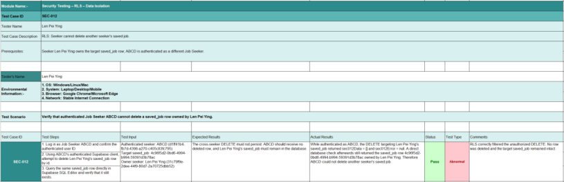

_Figure A5.7: RLS - Data Isolation (Saved Job Delete Isolation)_

##### SEC-019: Non-Admin Cannot Update Another User's Profile Row

**Recorded result: Pass.**

While authenticated as ABCD, the UPDATE targeting Len Pei Ying's users row returned sec019Data = [] and sec019Error = null. A direct database check afterwards showed Len Pei Ying's phone remained +60175023599, with role = seeker and account_status = active. Therefore ABCD could not modify another user's profile row.

**Expected result:** The cross-user UPDATE must not persist. ABCD should receive no updated row, and Len Pei Ying's phone value must remain unchanged.

**Test procedure:**

1. Log in as Job Seeker ABCD and confirm the authenticated user ID.
2. Using ABCD's authenticated Supabase client, attempt to update Len Pei Ying's phone field.
3. Query Len Pei Ying's users row directly in Supabase SQL Editor and verify that the phone value remains unchanged.

**Test input:** Authenticated seeker: ABCD (d1ff41b4-fb7d-4398-a270-c405c83fc795)
Target user: Len Pei Ying (31c79f9e-2dee-44f9-80d7-2a70725dbb52)
Original phone: +60175023599
Attempted phone: SEC-019-TEST

**Recorded comments:** RLS correctly filtered the unauthorized UPDATE. The target user's profile data remained unchanged.

Figure A5.8 retains the original screenshot associated with this case. The result and comments above follow the latest testing workbook.

_Figure A5.8: RLS - Data Isolation (User Profile Update Isolation)_

##### SEC-020: Seeker Cannot Change an Application's Status Field Directly

**Recorded result: Pass.**

Initial test failed because Job Seeker ABCD could directly change the owned application status from pending to completed. After the security fix was applied, the same attack was repeated while authenticated as ABCD. The PATCH request returned HTTP 403, sec020RetestData = null, and error code 42501 with a database message blocking the seeker status change. A direct database check confirmed the application status remained pending. Retest passed.

**Expected result:** The Job Seeker should not be able to change the employer-controlled application lifecycle status. The stored status should remain pending.

**Test procedure:**

1. Log in as Job Seeker ABCD and confirm the authenticated user ID.
2. Using ABCD's authenticated Supabase client, attempt to update the owned application status from pending to completed.
3. Query the same application row directly in Supabase SQL Editor and verify whether the stored status changed.

**Test input:** Authenticated seeker: ABCD (d1ff41b4-fb7d-4398-a270-c405c83fc795)
Application: 888c03d0-98d9-4e89-bce4-5e0f4ef799c1
Original status: pending
Attempted status: completed

**Recorded comments:** Retest passed after security fix. The initial vulnerability allowed a seeker to change the application status directly; the repaired database rule now blocks unauthorized status changes while preserving the controlled seeker completion flow.

Figure A5.9 retains the original screenshot associated with this case. The result and comments above follow the latest testing workbook.

_Figure A5.9: RLS - Data Isolation (Application Status Field Restriction)_

##### SEC-021: Employer Cannot Read Another Seeker's Work History

**Recorded result: Pass.**

While authenticated as SugarShine Employer, the targeted query for Tsuki's work_history returned sec021Data = [] and sec021Error = null. An unfiltered query of work_history returned sec021All = [] and sec021AllError = null. Therefore the Employer could not read Job Seeker work_history records.

**Expected result:** The Employer must not receive another seeker's work_history row. Both the targeted query and unfiltered work_history query should return no unauthorized rows.

**Test procedure:**

1. Log in as SugarShine Employer and confirm the authenticated user ID.
2. Using the authenticated Employer Supabase client, query a specific Tsuki work_history row and then query all work_history rows.
3. Verify that no Job Seeker work_history rows are returned to the Employer.

**Test input:** Authenticated employer: SugarShine (df0abc84-7df8-4709-94de-02f43e097c84)
Target work_history: db3b5217-1664-4068-8cb7-d66429e00a9f
Target seeker: Tsuki (4be6d53d-c79c-4107-8d1a-b66c43bfe1ac)
Target job: Part-Time Barista &amp; Café Crew

**Recorded comments:** RLS correctly restricted work_history visibility. No seeker work_history rows were exposed to the authenticated Employer.

Figure A5.10 retains the original screenshot associated with this case. The result and comments above follow the latest testing workbook.

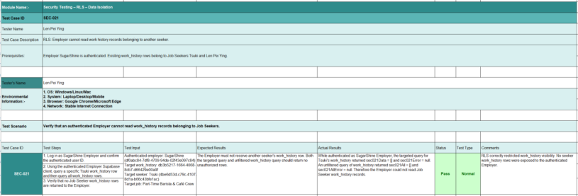

_Figure A5.10: RLS - Data Isolation - Work History Read Isolation_

### Appendix 5.2: Auth & Access Control

This appendix provides the remaining Auth & Access Control Security Testing test cases that are not presented in Section 4.3.4.2. These tests cover authentication, session handling and role-based access restrictions, such as cross-role access, registration role-gating, password handling and session expiry. The representative test case, SEC-024: Admin Page Access Blocked for Non-Admin Authenticated Users, is presented in Section 4.3.4.2, while the additional test cases are provided below.

##### SEC-013: RLS Prevents Cross-Role Data Access

**Recorded result: Pass.**

Prior SEC-001 testing confirmed seeker-to-seeker application isolation. While logged in as SugarShine Employer, querying applications for W&amp;X Bakery's job returned sec013Apps = [] and sec013AppsError = null. Directly opening the Admin Dashboard while still logged in as SugarShine redirected the session back to the Employer Dashboard. Therefore the tested cross-account and admin-page access controls operated as intended.

**Expected result:** A seeker must not read another seeker's applications; an employer must not read another employer's applicant data; non-admin sessions must not access the Admin Dashboard.

**Test procedure:**

1. Use prior SEC-001 evidence showing a seeker cannot read another seeker's applications.
2. While authenticated as SugarShine Employer, query applications belonging to W&amp;X Bakery's job.
3. Attempt direct URL access to the Admin Dashboard while still logged in as SugarShine Employer.
4. Verify that unauthorized data is not returned and the admin-only page redirects the non-admin session.

**Test input:** Employer: SugarShine (df0abc84-7df8-4709-94de-02f43e097c84)
Target W&amp;X job: b534a64e-03ea-498c-9504-b39ebae6980d
Prior seeker isolation evidence: SEC-001

**Recorded comments:** Cross-role isolation verified using prior seeker RLS evidence, employer cross-account applicant access, and direct admin-page access control.

Figure A5.11 retains the original screenshot associated with this case. The result and comments above follow the latest testing workbook.

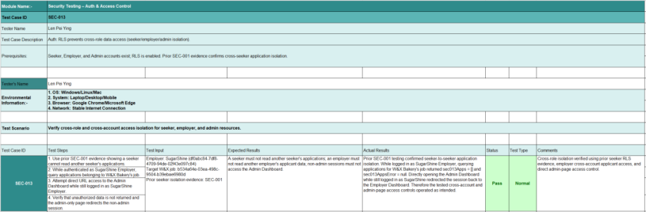

_Figure A5.11: Auth & Access Control - Cross-role Data Access_

##### SEC-014: Registration Role-Gating via Invite Codes

**Recorded result: Pass.**

Admin registration with incorrect secure code 'WRONG-1234' was blocked and displayed 'Invalid admin secure code.' Employer registration with incorrect secure code 'WRONG-1234' was also blocked and displayed 'Invalid employer secure code.' No privileged-role registration proceeded with an invalid invite code.

**Expected result:** Registration is blocked with appropriate error unless the exact matching constant is supplied.

**Test procedure:**

1. Select Admin role and submit with incorrect admin code.
2. Verify rejection.
3. Select Employer role and submit with incorrect employer code.
4. Verify rejection.

**Test input:** Wrong code: 'WRONG-1234'
Correct: EASYEARN-ADMIN-2026 / EASYEARN-EMPLOYER-2026
Files: auth.js

**Recorded comments:** Role-gating correctly rejected invalid secure codes for both Admin and Employer registration paths.

Figure A5.12 retains the original screenshot associated with this case. The result and comments above follow the latest testing workbook.

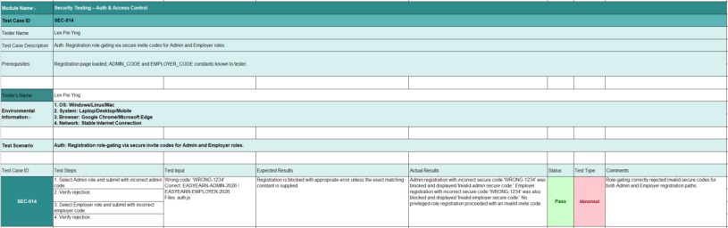

_Figure A5.12: Auth & Access Control - Registration Role-gating_

##### SEC-015: Password Policy Enforcement and Credential Handling

**Recorded result: Pass.**

Registration with password '12345' was blocked with 'Password must be at least 6 characters.' A password without the required composition was blocked, including the messages 'Password must contain at least one letter and one number.' and 'Password must contain at least one of !@#$%^.'. A mismatched confirmation was blocked with 'Confirm password does not match.' Login using an unregistered email returned the non-revealing message 'Invalid email or password.' No plaintext password was exposed in the observed UI messages.

**Expected result:** Each invalid case is rejected client-side or by Supabase Auth with a clear, non-revealing error message; no password logged in plaintext.

**Test procedure:**

1. Attempt registration with a 5-character password.
2. Attempt registration without special character.
3. Attempt with mismatched confirm-password.
4. Attempt login with unregistered email.

**Test input:** Passwords: '12345', 'abcdefgh', confirm mismatch
Files: auth.js (handleRegister, handleLogin, mapSupabaseAuthError)

**Recorded comments:** Password length, composition and confirmation validation worked as expected, and invalid login used a generic credential error message.

Figure A5.13 retains the original screenshot associated with this case. The result and comments above follow the latest testing workbook.

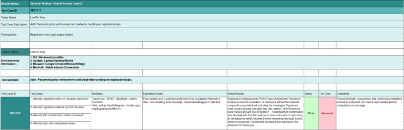

_Figure A5.13: Auth & Access Control - Password Policy Enforcement_

##### SEC-023: Session Expiry and requireUser() Redirect Behaviour

**Recorded result: Pass.**

While logged in as a Job Seeker, localStorage and sessionStorage were cleared to invalidate the local session. After refresh, the protected dashboard could no longer verify the account session and redirected the user to the Login page. The console also showed 'Account access verification failed: Error: Account profile could not be verified.' Protected content was not retained.

**Expected result:** User is redirected to login page; protected page content is not rendered.

**Test procedure:**

1. Log in as Seeker.
2. Manually clear localStorage session token or wait for expiry.
3. Attempt to navigate to a protected page (e.g. jobseeker/dashboard.html).
4. Observe redirect.

**Test input:** Auth: expired/cleared session
Files: auth.js (requireUser, observeAuth)

**Recorded comments:** Session-clearing test passed: the protected page rejected the invalidated session and redirected to Login. The Grammarly/permissions-policy console warning was unrelated to EasyEarn access control.

Figure A5.14 retains the original screenshot associated with this case. The result and comments above follow the latest testing workbook.

_Figure A5.14: Auth & Access Control - Session Expiry Handling_

### Appendix 5.3: Upload Security

This appendix supports the Upload Security Testing presented in Section 4.3.4.3. SEC-016 evaluated the file-size and file-type restrictions applied to Job Seeker profile images and Employer verification documents. Since this category contains only one test case and the complete representative result is presented in Section 4.3.4.3, the test case is not repeated in this appendix.

### Appendix 5.4: Input Sanitisation

This appendix provides the remaining Input Sanitisation Security Testing test case that is not presented in Section 4.3.4.4. The tests evaluated how potentially malicious input was handled, including XSS and SQL injection-related input. The representative test case, SEC-017: Input Sanitisation Against XSS, is presented in Section 4.3.4.4, while the additional test case is provided below.

##### SEC-018: SQL Injection Resistance

**Recorded result: Pass.**

Login SQL injection attempt using the payload ' OR '1'='1 was rejected by email-format validation with the message 'Please enter a valid email address.' The same SQLi payload entered in the Jobs search/filter field was treated as literal search text and returned 'No available jobs found'; no extra records, protected data, or query-structure bypass was observed.

**Expected result:** All inputs treated as literal parameter values; no query structure altered and no data leaked.

**Test procedure:**

1. Enter ' OR '1'='1 in login email field.
2. Enter SQLi payload in Jobs search/filter field.
3. Verify no data leak and no query alteration.

**Test input:** Payload: ' OR '1'='1
Files: auth.js, jobseeker-jobs.js, supabase-config.js

**Recorded comments:** Tested SQL injection payloads did not alter query logic or expose additional data. Inputs were either rejected by validation or handled as literal values.

Figure A5.15 retains the original screenshot associated with this case. The result and comments above follow the latest testing workbook.

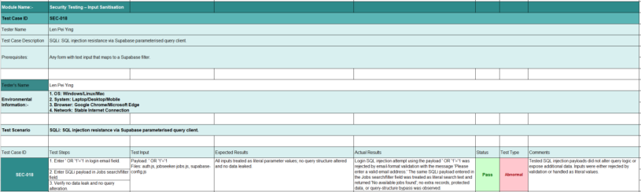

_Figure A5.15: Input Sanitisation - SQL Injection Resistance_

### Appendix 5.5: Rating & Business Rules

This appendix provides the remaining Rating & Business Rules Security Testing test case that is not presented in Section 4.3.4.5. The tests focused on limitations on rating eligibility and reviewer-reviewee relationships as they relate to security issues. The representative test case, SEC-008: Seeker Cannot Submit a Rating for a Pending Application, is presented in Section 4.3.4.5, while the additional test case is provided below.

##### SEC-009: Reviewer and Reviewee Cannot Be the Same User

**Recorded result: Pass.**

While authenticated as Tsuki, a forced self-rating attempt was made using the completed application 112ba3b2-819e-4009-a948-525e136ebba1 with reviewer_id = reviewee_id = Tsuki. The ratings upsert request was rejected with HTTP 403 Forbidden. A direct database query for review = 'SEC-009 self-rating test' returned no rows. Therefore the database-level rating validation successfully prevented self-rating.

**Expected result:** Self-rating is not explicitly blocked by a DB CHECK constraint; the UI never constructs a self-rating call.

**Test procedure:**

1. Log in as U.
2. Attempt to call upsertRating() with reviewer_id = reviewee_id = U.id.
3. Verify DB row.

**Test input:** Auth: U
reviewee_id = U.id (same as reviewer)
Files: supabase-data.js (upsertRating), schema.sql

**Recorded comments:** Self-rating is now blocked by database validation requiring reviewer and reviewee to be opposite parties of a completed application.

Figure A5.16 retains the original screenshot associated with this case. The result and comments above follow the latest testing workbook.

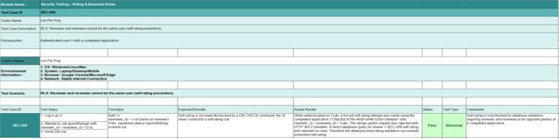

_Figure A5.16: Rating & Business Rules - Self-rating Prevention_

### Appendix 5.6: Report Security

This appendix provides the remaining Report Security test case that is not presented in Section 4.3.4.6. The tests evaluated whether report submission and report records were restricted to authenticated and authorised users. The representative test case, SEC-011: Seeker Cannot Read Another User's Submitted Reports, is presented in Section 4.3.4.6, while the additional test case is provided below.

##### SEC-010: Unauthenticated User Cannot Submit a Report

**Recorded result: Pass.**

With no active EasyEarn session, direct navigation to the Report page was blocked. The unauthenticated user was redirected to the Login page before the report form could be used, so no report could be submitted.

**Expected result:** Report submission is blocked; no report row is inserted.

**Test procedure:**

1. Open browser without logging in.
2. Navigate to the Report page.
3. Attempt to submit a report form.

**Test input:** Auth: none (anon)
Files: schema.sql (reports_insert_own policy), report.html

**Recorded comments:** Unauthenticated access to the report submission page is correctly protected by authentication redirect.

Figure A5.17 retains the original screenshot associated with this case. The result and comments above follow the latest testing workbook.

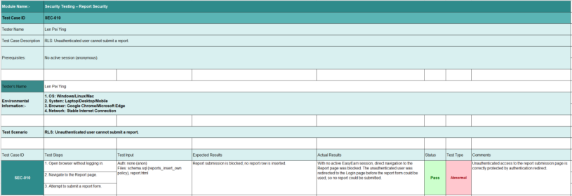

_Figure A5.17: Report Security - Unauthenticated Submission Block_

### Appendix 5.7: Analytics & Chatbot

This appendix provides the remaining Analytics & Chatbot Security Testing test case that is not presented in Section 4.3.4.7. The tests determined if administrative analytics and chatbotrelated records were limited by user role. The representative test case, SEC-025: Admin Analytics Data Is Not Accessible to Non-Admin Users, is presented in Section 4.3.4.7, while the additional test case is provided below.

##### SEC-022: Admin-Only Access to Chatbot Logs

**Recorded result: Pass.**

While authenticated as Job Seeker ABCD, a direct SELECT query against public.chatbot_logs returned HTTP status 200 with data as an empty array and error = null. No chatbot log rows were exposed to the seeker account, confirming that the admin-only RLS policy prevented non-admin read access.

**Expected result:** No rows returned; only admin-role users can SELECT from chatbot_logs.

**Test procedure:**

1. Log in as Seeker.
2. Query chatbot_logs table.
3. Check rows returned.

**Test input:** Auth: Seeker
Files: schema.sql (chatbot_logs_select_admin policy)

**Recorded comments:** Non-admin users cannot read chatbot_logs; RLS correctly hides all rows from the Job Seeker session.

Figure A5.18 retains the original screenshot associated with this case. The result and comments above follow the latest testing workbook.

_Figure A5.18: Analytics & Chatbot - Chatbot Log Access Restriction_

### Appendix 5.8: PDPA & Compliance

This appendix provides the remaining PDPA & Compliance Security Testing test cases that are not presented in Section 4.3.4.8. The tests examined certain privacy and access-control aspects of personal data, Employer verification information, modification of verification status and visibility of public job listings. These tests evaluated the technical controls that had been implemented and were not a comprehensive legal compliance audit. The representative test case, SEC-026: Personal Data Fields Are Not Exposed in Public Job Listing Queries, is presented in Section 4.3.4.8, while the additional test cases are provided below.

##### SEC-027: Employer Verification Documents Are Not Exposed to Authenticated NonOwner Users

**Recorded result: Pass.**

While authenticated as Job Seeker ABCD, a direct query against public.users targeted W&amp;X Employer (cfc76680-17f4-4670-a0cd-c5c02b6a6650) and requested protected profile and verification fields including email, SSM number, registration document information and contact document information. The request returned HTTP status 200, error = null and data as an empty array. No protected Employer verification information was exposed to the non-owner account.

**Expected result:** The authenticated non-owner user cannot retrieve Employer E1's protected user record or verification document information. The updated RLS policies restrict direct user-record access to the record owner and authorised Administrators.

**Test procedure:**

1. Log in as a Job Seeker who is not the owner of Employer E1's record.
2. Query public.users for Employer E1's record and attempt to retrieve the verification document fields.
3. Check whether any protected Employer verification information is returned.

**Test input:** Auth: Job Seeker (non-owner) Target: Employer E1 UUID RLS: users_select_own and users_select_admin

**Recorded comments:** RLS correctly prevents an authenticated non-owner Job Seeker from retrieving another Employer's protected user record and verification-document fields.

Figure A5.19 retains the original screenshot associated with this case. The result and comments above follow the latest testing workbook.

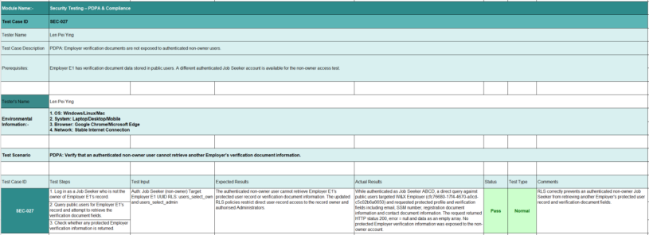

_Figure A5.19: PDPA & Compliance - Verification Document Access Restriction_

##### SEC-028:  Seeker Cannot Update an Employer's Verification Status

**Recorded result: Pass.**

While authenticated as Job Seeker ABCD, a direct UPDATE was attempted against W&amp;X Employer (cfc76680-17f4-4670-a0cd-c5c02b6a6650) to set verification_status = 'verified'. The request returned HTTP status 200 with data as an empty array and error = null, indicating no row was updated under RLS. A trusted SQL readback confirmed the Employer record remained verification_status = 'submitted' and is_verified = true. Therefore the non-admin user could not change the Employer verification status.

**Expected result:** UPDATE is blocked; verification_status can only be changed by the admin.

**Test procedure:**

1. Log in as Seeker S.
2. Attempt to PATCH public.users to set verification_status = 'verified' for E1.
3. Verify response.

**Test input:** Auth: Seeker S
Target: E1 UUID, field: verification_status
Files: schema.sql (users_update_own, users_admin_update policies)

**Recorded comments:** RLS correctly prevents a Job Seeker from updating another Employer's verification status; database readback confirmed the protected field was unchanged.

Figure A5.20 retains the original screenshot associated with this case. The result and comments above follow the latest testing workbook.

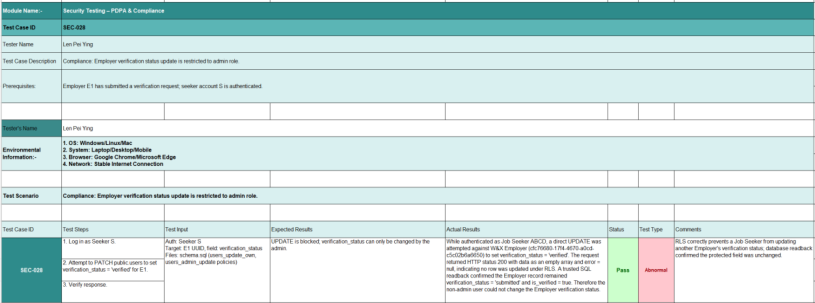

_Figure A5.20: PDPA & Compliance - Verification Status Update Restriction_

##### SEC-029: Closed Job Listings Are Removed from Public Job Search

**Recorded result: Pass.**

A job listing with status = 'closed' was identified: de85ecb3-8148-40a2-bc5d-f68d4969bdd6 ([ST-002 TEST] Part-time Barista). While unauthenticated, a direct query against public.job_listings for this exact job ID returned HTTP status 200 with data as an empty array and error = null. The closed listing was therefore not exposed through the public job query.

**Expected result:** Closed listings are excluded from the public job search results.

**Test procedure:**

1. Admin sets job_listings.status = 'closed' for a listing.
2. Open public Jobs page without logging in.
3. Verify the closed listing does not appear.

**Test input:** Auth: admin action then anon view
Files: admin-jobs.js (updateJobListingStatus), jobseeker-jobs.js (public query filter), schema.sql

**Recorded comments:** Closed job listings are excluded from unauthenticated/public job search access as required.

Figure A5.21 retains the original screenshot associated with this case. The result and comments above follow the latest testing workbook.

_Figure A5.21: PDPA & Compliance - Closed Listing Removal_

### Appendix 5.9: Employer Verification & Visibility

This appendix corresponds to the Employer Verification & Visibility Security Testing category. This category contains one test case, SEC-030: Employer Verification & Job Visibility.  The complete test case and supporting evidence are presented in Section 4.3.4.9; therefore, SEC030 is not repeated in this appendix.

Overall, all 30 Security Testing test cases across the nine testing categories achieved a Pass result in the final testing round. Several vulnerabilities detected in the initial test were patched, and retests were conducted successfully. The detailed evidence in Appendix 5 supports the Security Testing results summarised in Section 4.3.4 and documents the additional test cases omitted from the main chapter for conciseness. The restrictions mentioned in Section 5.3.1 apply to the scope of security assurance and are not directly related to known failures in the final Security Testing results.

## Appendix 6: Compatibility Testing

This appendix provides the detailed Compatibility Testing test cases and supporting evidence that are not presented in Section 4.3.5. Compatibility Testing was conducted across six categories: Browser Compatibility, Responsive Design, Feature Compatibility, Session & Auth, UI & Display, and Form & Input. A total of 23 Compatibility Testing test cases (CT-001 to CT-023) were executed, and all 23 achieved a Pass result in the final testing round within the environments directly tested. One representative test case from each category is contained in Section 4.3.5, and all the other test cases and supporting evidence are grouped in Appendix 6.1 to Appendix 6.6.

### Appendix 6.1: Browser Compatibility

This appendix provides the remaining Browser Compatibility test cases that are not presented in Section 4.3.5.1. These tests evaluated selected browser-dependent functions and interface elements in Google Chrome, Mozilla Firefox and Microsoft Edge, such as feature support for JavaScript, creating PDF resumes and rendering analytics with Chart.js. The following Browser Compatibility test cases are provided; for the representative test case, a description is given in Section 4.3.5.1.

##### CT-002: JavaScript Feature Support

**Recorded result: Pass.**

Tested the Browse Jobs page in Google Chrome, Microsoft Edge and Mozilla Firefox. In all three browsers, job listings loaded successfully from Supabase and the page remained functional, confirming that fetch-based data loading and ES module scripts executed correctly. No EasyEarn application JavaScript error was observed. Chrome displayed errors from browser extensions (for example Zotero/injected extension scripts) and a permissions-policy unload warning; these were unrelated to EasyEarn. Firefox displayed a browser Quirks Mode warning, but the EasyEarn jobs page still loaded and functioned normally. Safari was not available in the current Windows test environment.

**Expected result:** fetch() and ES module imports execute without errors across all four browsers; Supabase data loads correctly.

**Test procedure:**

1. Open browser console in Chrome and load the Jobs page.
2. Verify fetch() calls to Supabase complete without errors.
3. Verify ES module imports (type=module) load correctly.
4. Repeat steps 1–3 in Firefox, Safari, and Edge.
5. Confirm no JS errors appear in any browser console.

**Test input:** Browsers: Chrome, Firefox, Safari, Edge
Files: js/supabase-data.js, js/jobseeker-jobs.js

**Recorded comments:** Pass for Chrome, Edge and Firefox. Observed console messages were browser/extension warnings rather than EasyEarn JavaScript failures. Safari was not directly tested.

Figure A6.1 retains the original screenshot associated with this case. The result and comments above follow the latest testing workbook.

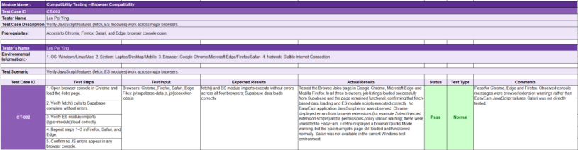

_Figure A6.1: Browser Compatibility - JavaScript Feature Support_

##### CT-003: PDF Resume Generation

**Recorded result: Pass.**

Three PDF resume outputs generated during cross-browser testing were reviewed. All three files opened successfully as single-page PDFs and displayed the same Tsuki resume content, including profile details, two completed work-history entries, highlighted results, references, skills, education and availability. The page structure, fonts, spacing and section placement were visually consistent across the three outputs. Two rendered outputs were pixel-identical; the third showed only negligible rendering/anti-aliasing differences with no missing, clipped or shifted content. Therefore PDF generation produced a valid and consistent resume across the tested browsers. Safari was not available in the current Windows test environment.

**Expected result:** PDF resume generates and downloads successfully in all four browsers with consistent formatting and correct content.

**Test procedure:**

1. Log in as Job Seeker and navigate to Work History page in Chrome.
2. Click Generate Resume and verify PDF downloads correctly.
3. Open the PDF and verify content and formatting are correct.
4. Repeat steps 1–3 in Firefox, Safari, and Edge.
5. Compare PDF output across all browsers for consistency.

**Test input:** Browser: Chrome, Firefox, Safari, Edge
Files: js/jobseeker-resume.js (jsPDF, html2canvas)

**Recorded comments:** All three tested browser outputs generated usable PDFs with consistent content and layout. Minor renderer-level pixel differences did not affect readability or correctness. Safari was not directly tested.

Figure A6.2 retains the original screenshot associated with this case. The result and comments above follow the latest testing workbook.

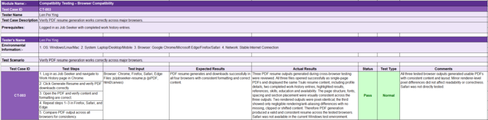

_Figure A6.2: Browser Compatibility - PDF Resume Generation_

##### CT-004: Chart.js Analytics Rendering

**Recorded result: Pass.**

Tested the Admin Analytics page in Google Chrome, Microsoft Edge and Mozilla Firefox. Across all three browsers, the analytics overview, KPI cards, line chart, doughnut chart, chart legend, percentages and Data Explorer table rendered consistently with no missing, blank, overlapping or broken elements. The same analytics values were displayed across browsers, including User Growth 8, Job Volume 8 and Report Load 2, and the chart proportions remained consistent. No meaningful visual or functional difference was observed. Safari was not available in the current Windows test environment.

**Expected result:** Chart.js line and donut charts render correctly with accurate data and tooltips across all four browsers.

**Test procedure:**

1. Log in as Admin and navigate to Analytics Dashboard in Chrome.
2. Verify line chart and donut chart render correctly.
3. Hover over chart data points and verify tooltips appear.
4. Repeat steps 1–3 in Firefox, Safari, and Edge.
5. Confirm charts display consistent data and appearance across browsers.

**Test input:** Browsers: Chrome, Firefox, Safari, Edge
Files: js/admin-analytics.js (Chart.js CDN)

**Recorded comments:** Chrome, Edge and Firefox produced consistent Chart.js output and analytics data. Safari was not directly tested.

Figure A6.3 retains the original screenshot associated with this case. The result and comments above follow the latest testing workbook.

_Figure A6.3: Browser Compatibility - Chart.js Analytics Rendering_

### Appendix 6.2: Responsive Design

This appendix provides the remaining Responsive Design Compatibility Testing test cases that are not presented in Section 4.3.5.2. These tests assessed how EasyEarn reacts to the following viewport sizes and interactions: mobile touch interaction, mobile content display, formvalidation presentation and mobile filtering. The representative test case, CT-005: Layout Breakpoints, is presented in Section 4.3.5.2, while the additional test cases are provided below.

##### CT-006: Mobile Touch Interactions

**Recorded result: Pass.**

Tested in a 375px mobile emulation viewport. The hamburger menu opened and closed correctly; Browse Jobs and Saved Jobs tabs switched correctly; job interactions responded to tap; filter dropdowns opened and allowed selection; and vertical scrolling worked normally without interaction issues.

**Expected result:** All tap interactions, dropdowns, and scrolling function correctly on mobile touch screens without requiring hover.

**Test procedure:**

1. Open EasyEarn on mobile and tap the hamburger menu.
2. Verify dropdown navigation opens and closes correctly on tap.
3. Tap on a job listing card and verify it navigates to job details.
4. Tap on filter dropdowns and verify they open and are selectable.
5. Scroll through the Jobs page and verify smooth scrolling.

**Test input:** Device: Mobile (375px viewport)
Files: css/*, includes.js, js/jobseeker-jobs.js

**Recorded comments:** All required mobile tap interactions and scrolling functions worked correctly in the tested mobile viewport.

Figure A6.4 retains the original screenshot associated with this case. The result and comments above follow the latest testing workbook.

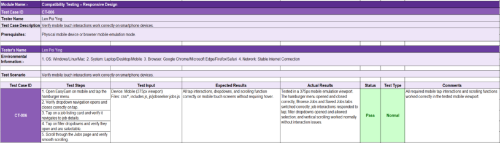

_Figure A6.4: Responsive Design - Mobile Touch Interactions_

##### CT-007: Mobile Content Display

**Recorded result: Pass.**

Tested the Saved Jobs and Work History pages at a 375px mobile viewport. Saved Jobs displayed the full job card within the viewport, including title, employer, description, location/pay badges and action buttons, with no visible horizontal overflow or clipped content. Work History also displayed the job title, employer, date, earnings (RM200), category and status/action information within the mobile viewport. Both pages stacked content vertically and remained readable without horizontal scrolling or truncated data.

**Expected result:** Saved Jobs and Work History pages display all content within the mobile viewport with no horizontal overflow or truncated data.

**Test procedure:**

1. Log in as Job Seeker on mobile (375px viewport).
2. Navigate to Saved Jobs page and verify all job cards display fully.
3. Check no content overflows off-screen horizontally.
4. Navigate to Work History page and verify entries display correctly.
5. Verify earnings, job title, and date columns are readable on mobile.

**Test input:** Viewport: 375px
Files: pages/jobseeker/saved-jobs.html, pages/jobseeker/work-history.html

**Recorded comments:** Saved Jobs and Work History were readable and usable at 375px with no horizontal overflow observed.

Figure A6.5 retains the original screenshot associated with this case. The result and comments above follow the latest testing workbook.

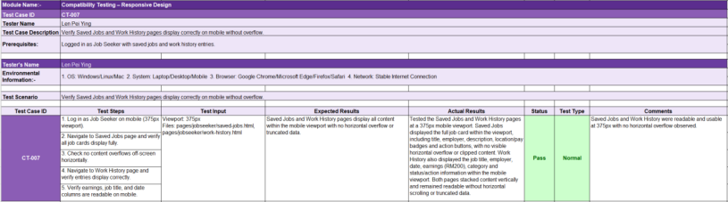

_Figure A6.5: Responsive Design - Mobile Content Display_

##### CT-008: Form Validation Consistency

**Recorded result: Pass.**

Tested Login and Register form validation in Google Chrome, Microsoft Edge and Mozilla Firefox. Submitting the Login form with empty required fields produced the expected validation behaviour in all three browsers. Submitting the Register form with an invalid password format also produced the expected password validation message consistently across all three browsers. No browser-specific validation inconsistency was observed. Safari was not available in the current Windows test environment.

**Expected result:** Form validation error messages appear consistently across all browsers for empty fields and invalid password format.

**Test procedure:**

1. Open Login page in Chrome and submit with empty fields.
2. Verify validation error messages appear correctly.
3. Open Register page and submit with invalid password format.
4. Verify password validation error is shown.
5. Repeat steps 1–4 in Firefox, Safari, and Edge.

**Test input:** Browsers: Chrome, Firefox, Safari, Edge
Files: login.html, register.html, js/auth.js

**Recorded comments:** Chrome, Edge and Firefox showed consistent Login and Register validation behaviour. Safari was not directly tested.

Figure A6.6 retains the original screenshot associated with this case. The result and comments above follow the latest testing workbook.

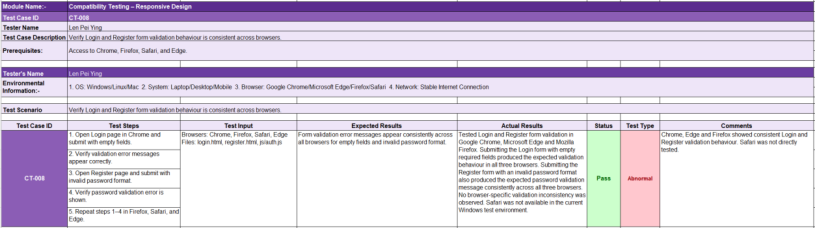

_Figure A6.6: Responsive Design - Form Validation Consistency_

##### CT-009: Mobile Filter Functionality

**Recorded result: Pass.**

Tested the Job Seeker Jobs page at a 375px mobile viewport. Category filters were tappable and filtered the listings correctly; the location dropdown opened and allowed selection; the job results updated in place without requiring a page reload; and using the reset/clear filters function restored the full job list. No mobile interaction issue was observed during filtering.

**Expected result:** Category and location filters are tappable on mobile and correctly filter job listings without requiring a page reload.

**Test procedure:**

1. Open Jobs page on mobile (375px viewport).
2. Tap category filter chips and verify filtering works.
3. Tap location filter dropdown and select a location.
4. Verify filtered results update correctly.
5. Clear filters and verify all listings are restored.

**Test input:** Viewport: 375px
Files: pages/jobseeker/jobs.html, js/jobseeker-jobs.js

**Recorded comments:** All mobile job-filter interactions worked correctly at 375px, including category, location, live result updates and filter reset.

Figure A6.7 retains the original screenshot associated with this case. The result and comments above follow the latest testing workbook.

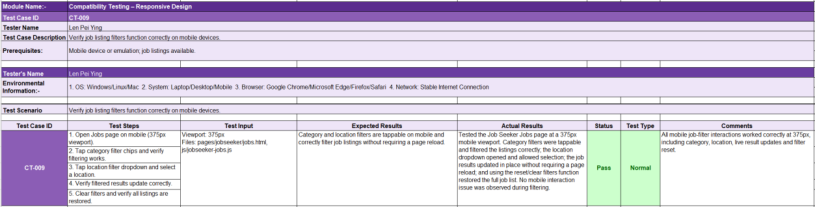

_Figure A6.7: Responsive Design - Mobile Filter Functionality_

### Appendix 6.3: Feature Compatibility

This appendix provides the remaining Feature Compatibility test cases that are not presented in Section 4.3.5.3. These tests evaluated selected EasyEarn features within the tested browser and screen environments, including dark mode, the floating chatbot, Employer verification file uploads, notification updates and Admin Analytics. The representative test case, CT-010: Google Translate Integration, is presented in Section 4.3.5.3, while the additional test cases are provided below.

##### CT-011: Dark Mode Across Role Dashboards

**Recorded result: Pass.**

Tested dark mode on the Job Seeker, Employer and Admin dashboards. All three dashboards switched to dark mode correctly, with role-specific accent colours and interface text remaining readable. After refreshing the pages, the selected dark mode preference remained active as expected.

**Expected result:** Dark mode applies consistently across all three role dashboards with legible text and correct accent colours; preference persists after page reload.

**Test procedure:**

1. Log in as Job Seeker and toggle dark mode on dashboard.
2. Verify teal/green accent colours remain legible in dark mode.
3. Log in as Employer and toggle dark mode; verify brown/gold theme.
4. Log in as Admin and toggle dark mode; verify purple theme.
5. Refresh each dashboard and verify dark mode preference persists.

**Test input:** Files: js/theme.js, css/jobseeker-dashboard.css, css/employer-dashboard.css, css/admin-dashboard.css

**Recorded comments:** Dark mode worked correctly for Job Seeker, Employer and Admin dashboards, and the preference persisted after refresh.

Figure A6.8 retains the original screenshot associated with this case. The result and comments above follow the latest testing workbook.

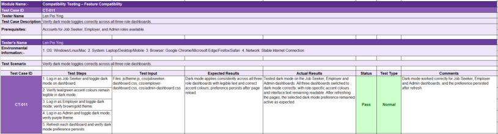

_Figure A6.8: Feature Compatibility - Dark Mode Across Role Dashboards_

##### CT-012: Floating Chatbot Widget

**Recorded result: Pass.**

Tested the floating EasyEarn Assistant on the mobile 375px view. The chatbot opened correctly within the viewport, displayed its header, suggested questions, message input and Send button, and remained accessible without being cut off by the screen edge. The earlier apparent clipping was related to the underlying responsive chart/page layout rather than the chatbot component itself.

**Expected result:** Chatbot widget opens, sends messages, and receives responses correctly across all browsers and on mobile without UI overlap issues.

**Test procedure:**

1. Open Job Seeker dashboard in Chrome and click the chatbot widget.
2. Send a test message and verify a response is returned.
3. Verify widget opens/closes correctly and does not overlap critical UI.
4. Repeat in Firefox, Safari, and Edge.
5. Repeat on mobile (375px) and verify chatbot is accessible and usable.

**Test input:** Browsers: Chrome, Firefox, Safari, Edge; Viewport: 375px mobile
Files: js/floating-chatbot.js

**Recorded comments:** Chatbot mobile display is acceptable and usable. The separate 375px chart/responsive layout issue remains tracked under CT-005 for retesting after the responsive fix.

Figure A6.9 retains the original screenshot associated with this case. The result and comments above follow the latest testing workbook.

The CT-012 comment refers to the earlier responsive-layout issue. The final CT-005 record subsequently reports that the 375px fix was retested successfully; the earlier CT-012 comment is retained as part of the test history.

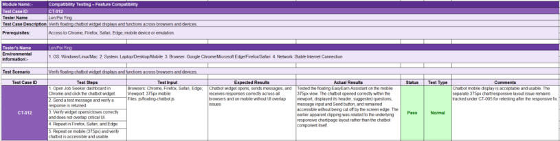

_Figure A6.9: Feature Compatibility - Floating Chatbot Widget_

##### CT-013: File Upload for Verification

**Recorded result: Pass.**

Tested employer verification document upload in Google Chrome, Microsoft Edge and Mozilla Firefox. In all three browsers, the file picker opened correctly, the selected verification file was accepted and displayed as expected, and the verification submission completed successfully. No browser-specific upload issue was observed. Safari was not available in the current Windows test environment.

**Expected result:** File picker opens in all browsers; selected file uploads successfully to Supabase storage with correct file type and size validation.

**Test procedure:**

1. Log in as Employer and navigate to Verification page in Chrome.
2. Click file upload and select a PDF document.
3. Verify file is accepted and preview/name is shown.
4. Submit verification and confirm upload succeeds.
5. Repeat steps 1–4 in Firefox, Safari, and Edge.

**Test input:** Browsers: Chrome, Firefox, Safari, Edge
File types: PDF, JPG
Files: js/employer-verification.js

**Recorded comments:** Employer verification file upload worked consistently in Chrome, Edge and Firefox. Safari was not directly tested.

Figure A6.10 retains the original screenshot associated with this case. The result and comments above follow the latest testing workbook.

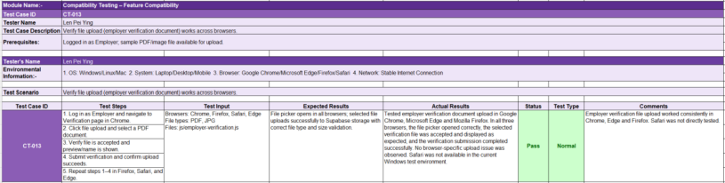

_Figure A6.10: Feature Compatibility - File Upload for Verification_

##### CT-014: Notification Bell Updates

**Recorded result: Pass.**

Tested notification updates in Google Chrome, Mozilla Firefox and Microsoft Edge using separate Job Seeker and Employer sessions. After the Employer changed an application status, the Job Seeker notification bell updated automatically without requiring a page reload, and opening the bell displayed the notification list correctly in all three tested browsers.

**Expected result:** Notification bell reflects new notifications within the polling interval across all tested browsers without requiring a page reload.

**Test procedure:**

1. Log in as Job Seeker in Chrome and observe notification bell.
2. In a separate tab, log in as Employer and change application status.
3. Verify notification bell on Job Seeker tab updates without page reload.
4. Click notification bell and verify notification list is shown.
5. Repeat test in Firefox and Edge.

**Test input:** Browsers: Chrome, Firefox, Edge
Files: js/notifications.js, includes/header-jobseeker.html

**Recorded comments:** Notification polling behaved consistently in Chrome, Firefox and Edge. The bell updated without manual refresh and the notification list opened correctly.

Figure A6.11 retains the original screenshot associated with this case. The result and comments above follow the latest testing workbook.

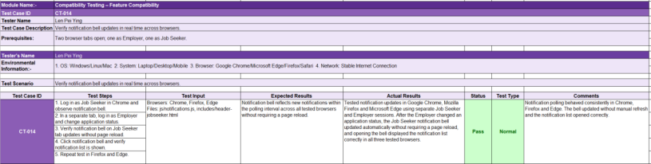

_Figure A6.11: Feature Compatibility - Notification Bell Updates_

##### CT-015: Admin Analytics Data Consistency

**Recorded result: Pass.**

Tested the Admin Analytics Dashboard in Google Chrome, Microsoft Edge and Mozilla Firefox. All three browsers displayed the same analytics values: User Growth = 8, Job Volume = 8, and Report Load = 2. The chart data and displayed statistics were consistent across all three browsers, with no missing or mismatched values observed.

**Expected result:** Analytics figures and charts display the same correct data across all tested browsers with no missing or mismatched values.

**Test procedure:**

1. Log in as Admin and open Analytics Dashboard in Chrome.
2. Verify total users, total jobs, and successful matches figures are correct.
3. Verify chart data points match the displayed statistics.
4. Repeat in Firefox and Edge.
5. Confirm all figures and charts are consistent across browsers.

**Test input:** Browsers: Chrome, Firefox, Edge
Files: js/admin-analytics.js, Supabase analytics table

**Recorded comments:** Chrome, Edge and Firefox all showed identical analytics values (8 / 8 / 2), and the chart data points were consistent.

Figure A6.12 retains the original screenshot associated with this case. The result and comments above follow the latest testing workbook.

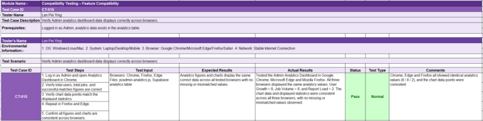

_Figure A6.12: Feature Compatibility - Admin Analytics Data Consistency_

### Appendix 6.4: Session & Auth

This appendix provides the remaining Session & Auth Compatibility Testing test case that is not presented in Section 4.3.5.4. The tests covered the authentication-session behaviour for various tabs in the same browser session, such as cross-tab session persistence and synchronised logout. The representative test case, CT-017: Cross-Tab Logout, is presented in Section 4.3.5.4, while the additional test case is provided below.

##### CT-016: Cross-Tab Session Persistence

**Recorded result: Pass.**

Tested authentication session persistence across multiple tabs in Google Chrome, Mozilla Firefox and Microsoft Edge. After logging in as a Job Seeker in the first tab, opening EasyEarn directly in a second tab did not require another login. The authenticated session remained active while navigating to other Job Seeker pages in the second tab across all three tested browsers.

**Expected result:** Auth session is shared across tabs in the same browser; no re-login required when opening a new tab to EasyEarn.

**Test procedure:**

1. Log in as Job Seeker in Chrome Tab 1.
2. Open a new Tab 2 and navigate to EasyEarn dashboard URL directly.
3. Verify Tab 2 shows the dashboard without requiring login again.
4. Navigate to different pages in Tab 2 and verify session remains active.
5. Repeat test in Firefox and Edge.

**Test input:** Browsers: Chrome, Firefox, Edge
Files: js/supabase-data.js (observeAuth)

**Recorded comments:** Session sharing across tabs worked correctly in Chrome, Firefox and Edge. No re-login was required within the same browser.

Figure A6.13 retains the original screenshot associated with this case. The result and comments above follow the latest testing workbook.

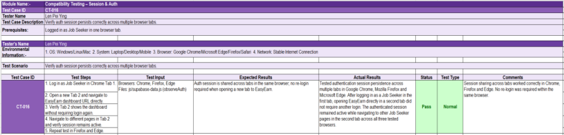

_Figure A6.13: Session & Auth - Cross-tab Session Persistence_

### Appendix 6.5: UI & Display

This appendix provides the remaining UI & Display Compatibility Testing test cases that are not presented in Section 4.3.5.5. The following tests were performed for the selected EasyEarn interface elements to assess their readability and presentation in the environments being tested, such as font rendering and previews of images being uploaded. The representative test case, CT-019: Long Text Overflow Handling, is presented in Section 4.3.5.5, while the additional test cases are provided below.

##### CT-018: Cross-Operating-System Font Rendering

**Recorded result: Pass.**

Tested font rendering in the available Windows environment. Headings, body text and button labels displayed clearly and consistently, with no visible blurry text, clipping, character misalignment or readability issues.

**Expected result:** Text renders legibly and consistently across all three operating systems with no blurry, clipped, or misaligned characters.

**Test procedure:**

1. Open EasyEarn homepage on Windows and verify font appearance.
2. Open EasyEarn homepage on Mac and compare font rendering.
3. Open EasyEarn homepage on Linux and compare font rendering.
4. Check headings, body text, and button labels across all three OS.
5. Verify no text appears blurry, clipped, or misaligned on any OS.

**Test input:** OS: Windows 10/11, macOS, Linux
Files: css/* (font-family declarations)

**Recorded comments:** Tested on Windows, which was the selected test environment. Font rendering was clear and readable with no visible clipping or misalignment.

Figure A6.14 retains the original screenshot associated with this case. The result and comments above follow the latest testing workbook.

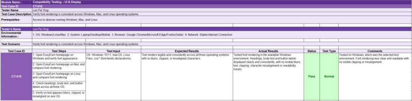

_Figure A6.14: UI & Display - Cross-OS Font Rendering_

##### CT-020: Image Upload Preview

**Recorded result: Pass.**

Tested image upload and post-upload display for Job Seeker profile images and Employer verification images. Uploaded images were saved successfully and displayed correctly after saving/submission. The test focuses on the stable upload-and-display behaviour and does not assess the optional pre-save preview behaviour.

**Expected result:** Selected images upload successfully and display correctly after saving or submission across all tested browsers.

**Test procedure:**

1. Log in as Job Seeker and navigate to Profile page in Chrome.
2. Select and upload a profile image, then save the profile.
3. Verify the uploaded profile image displays correctly after saving.
4. Log in as Employer and upload a verification document image; verify it displays correctly after submission.
5. Repeat the upload/display checks in Firefox and Edge.

**Test input:** Browsers: Chrome, Firefox, Edge
File types: JPG, PNG
Files: js/jobseeker-profile.js, js/employer-verification.js

**Recorded comments:** Stable upload and post-upload image display worked correctly. Pre-save preview behaviour was excluded from this compatibility test because it is not consistently stable.

Figure A6.15 retains the original screenshot associated with this case. The result and comments above follow the latest testing workbook.

This Pass result covers upload and post-save display only. It does not verify the optional pre-save image preview.

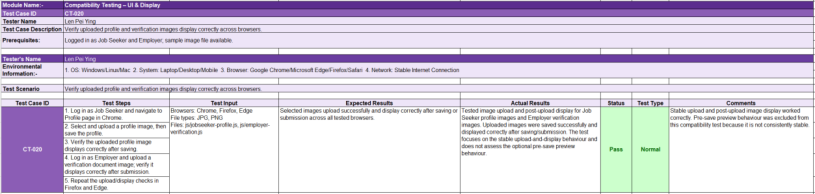

_Figure A6.15: UI & Display - Image Upload Preview_

### Appendix 6.6: Form & Input

This appendix provides the remaining Form & Input Compatibility Testing test cases that are not presented in Section 4.3.5.6. The tests checked typical form and input controls for the browsers that were tested, such as password masking for fields, file-size and file-type checking. The representative test case, CT-021: Interview Date/Time Picker, is presented in Section 4.3.5.6, while the additional test cases are provided below.

##### CT-022: File Size and Type Validation

**Recorded result: Pass.**

Tested profile picture file validation in Google Chrome, Mozilla Firefox and Microsoft Edge. An oversized file was rejected with an appropriate validation message, an invalid file type was rejected, and a valid JPG/PNG image was accepted successfully. The validation behaviour was consistent across all three tested browsers.

**Expected result:** File size and type validation rejects invalid files with clear error messages consistently across all browsers; valid files are accepted.

**Test procedure:**

1. Log in as Job Seeker and attempt to upload a file exceeding the size limit in Chrome.
2. Verify an appropriate error message is shown.
3. Attempt to upload an invalid file type (e.g. .exe) and verify rejection.
4. Upload a valid JPG/PNG and verify it is accepted.
5. Repeat steps 1–4 in Firefox, Safari, and Edge.

**Test input:** Browsers: Chrome, Firefox, Safari, Edge
Test files: oversized file, .exe, valid JPG/PNG
Files: js/jobseeker-profile.js

**Recorded comments:** File size and file type validation worked consistently in Chrome, Firefox and Edge; valid image files were accepted as expected.

Figure A6.16 retains the original screenshot associated with this case. The result and comments above follow the latest testing workbook.

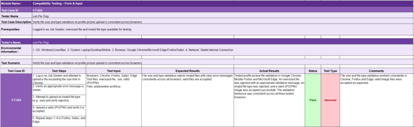

_Figure A6.16: Form & Input - File Size and Type Validation_

##### CT-023: Password Field Masking

**Recorded result: Pass.**

Password fields use input type=password which is universally supported and masks input by default in all modern browsers. Password is transmitted to Supabase Auth over HTTPS and never logged to the browser console.

**Expected result:** Password field masks input as dots/asterisks in all browsers; show/hide toggle works correctly; no plain text password is exposed in console or network requests.

**Test procedure:**

1. Open Login page in Chrome and type in the password field.
2. Verify password characters are masked (shown as dots/asterisks).
3. Click the show/hide password toggle (if available) and verify it works.
4. Repeat steps 1–3 in Firefox, Safari, and Edge.
5. Verify no plain text password is visible in the browser console or network tab.

**Test input:** Browsers: Chrome, Firefox, Safari, Edge
Files: login.html, register.html, js/auth.js

**Recorded comments:** Show/hide toggle (if implemented) uses JS to toggle input type between password and text, which is supported consistently across all tested browsers.

Figure A6.17 retains the original screenshot associated with this case. The result and comments above follow the latest testing workbook.

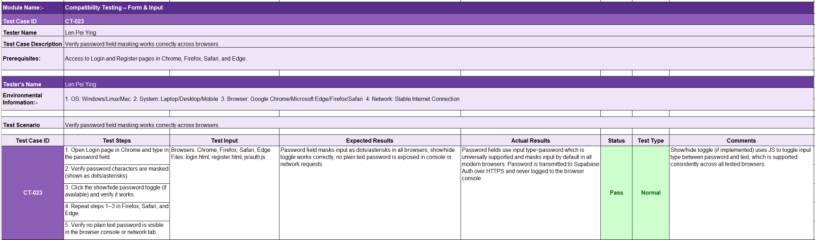

_Figure A6.17: Form & Input - Password Field Masking_

Overall, all 23 Compatibility Testing test cases across the six testing categories achieved a Pass result in the final testing round within the environments directly tested. The Compatibility Testing results summarised in Section 4.3.5 are detailed in Appendix 6, which also provides information about test cases excluded from the main chapter for brevity. The results are only applicable to browsers, devices, operating systems and viewport configurations evaluated directly, and are not a guarantee of all possible environments.

## Appendix 7: GitHub Repository and Deployment

EasyEarn was developed using Git for version control and GitHub as the project repository. The repository maintains the development history of the system through commits made throughout the implementation, testing, correction and deployment stages. The commit history then supports evidence of the iterative development process undertaken during FYP2.

The EasyEarn web application is deployed by the main deployment workflow of the EasyEarn repository to GitHub Pages. This deployment strategy is similar to the static-frontend and BaaS architecture discussed in Section 4.2, with the frontend served using GitHub Pages and the authentication and database services offered by Supabase.

The deployment history also shows repeated deployments while developing the system, which is also written to the deployment history on GitHub Pages. Successful and unsuccessful deployment attempts provided evidence of the iterative deployment process, where deployment-related issues were identified, corrected and followed by subsequent deployments.

The development record export is available as a supplementary spreadsheet, which can be downloaded from the link below. The record will allow you to see the commit history and development evidence without having to replicate this history in this report.

# GitHub Repository:

<u>https://github.com/PeiYing040830/easyearn</u>

# Deployed EasyEarn Website:

<u>https://peiying040830.github.io/easyearn/</u>

# Supplementary Development Record:

<u>https://docs.google.com/spreadsheets/d/1kI1XszY_p9zjSSiSyxYvcOC7JIXOphPacPTJAdbir EA/edit?usp=drive_link</u>
